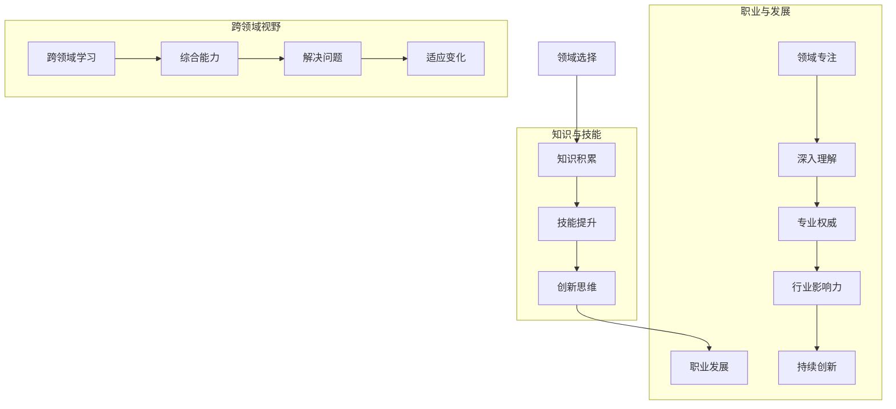

                 

关键词：领域专注，技术专长，职业发展，知识体系，创新思维，专业成长。

摘要：在技术领域快速发展的时代，避免在各领域之间徘徊，专注于深入某一领域成为不可或缺的关键。本文将探讨领域专注的重要性，如何选择和定位专注领域，以及如何构建稳固的知识体系，以实现个人的专业成长和创新突破。

## 1. 背景介绍

随着信息技术的飞速发展，计算机科学和工程领域呈现出高度细分和多样化的趋势。每一个领域都有其独特的理论体系、应用场景和技术挑战。然而，对于许多技术人员来说，面对如此多的选择，容易陷入选择的困境，导致无法在一个领域内深耕细作。这种在各领域之间徘徊的现象，不仅降低了个人技能的积累效率，也可能阻碍职业生涯的发展。

本文旨在讨论如何避免在各个领域之间徘徊，通过专注和深耕，实现个人的专业成长和技术的突破。文章将围绕以下几个核心问题展开：

- 领域专注的重要性是什么？
- 如何选择和定位专注领域？
- 如何构建和维护一个稳固的知识体系？
- 专业成长过程中可能遇到的挑战是什么？
- 如何平衡领域专注与跨领域知识的学习？

## 2. 核心概念与联系

为了更好地理解领域专注的重要性，我们首先需要明确几个核心概念，并展示它们之间的联系。以下是一个Mermaid流程图，用于描述这些概念之间的关系：



### 2.1 领域选择与知识积累

领域选择是专注于某一特定领域的起点。通过深入学习和理解该领域的知识，技术人员能够构建起稳固的知识体系。这个知识体系不仅是技能提升的基础，也是创新思维的重要支撑。

### 2.2 技能提升与创新思维

在特定领域内积累知识和技能，能够帮助技术人员形成独特的视角和思考方式，从而激发创新思维。创新思维是推动技术发展的重要力量，它使得技术人员能够提出新的解决方案和突破性的创新。

### 2.3 职业发展与领域专注

领域专注和专业权威是职业发展的关键因素。在某一领域内建立起专业权威，不仅能够提升个人的职业地位，还能为行业带来深远的影响。领域专注还能够帮助技术人员在职业生涯中持续创新，保持竞争力。

### 2.4 跨领域视野与综合能力

虽然领域专注至关重要，但跨领域视野也是不可或缺的。跨领域学习能够提升技术人员的综合能力，使他们能够更好地解决问题和适应变化。跨领域视野有助于技术人员的思维开阔，从而推动整个技术领域的进步。

## 3. 核心算法原理 & 具体操作步骤

### 3.1 算法原理概述

领域专注的核心算法原理可以概括为以下几个步骤：

1. **自我认知**：技术人员需要深入自我认知，了解自己的兴趣、能力和价值观，从而选择适合自己专注的领域。
2. **知识构建**：在选定领域内，技术人员需要系统地学习该领域的知识，构建起稳固的知识体系。
3. **技能实践**：通过实际项目和技术挑战，技术人员需要不断练习和提升技能，使理论知识转化为实际能力。
4. **创新思维**：在技能实践的基础上，技术人员需要不断培养创新思维，寻找新的解决方案和技术突破。
5. **持续成长**：技术人员需要保持持续的学习和成长，不断更新知识体系和技能，以适应技术的发展和变化。

### 3.2 算法步骤详解

#### 3.2.1 自我认知

自我认知是领域专注的第一步。技术人员需要通过自我反思、职业规划和心理测试等方法，深入了解自己的兴趣、能力和价值观。以下是一个具体的自我认知流程：

1. **反思兴趣和动机**：技术人员需要反思自己为什么对某个领域感兴趣，以及这个兴趣是否持久。
2. **评估能力和优势**：技术人员可以通过技能评估、项目经验和他人反馈，了解自己的优势和不足。
3. **确定价值观和目标**：技术人员需要明确自己的职业价值观和长期目标，以确保领域选择与个人发展相匹配。

#### 3.2.2 知识构建

在自我认知的基础上，技术人员需要系统地学习所选领域的知识。以下是一个知识构建的具体步骤：

1. **基础理论学习**：技术人员需要学习该领域的核心理论和基础知识，为后续技能实践打下坚实的基础。
2. **实践经验积累**：通过实际项目和案例学习，技术人员可以将理论知识应用到实践中，提升解决问题的能力。
3. **持续更新知识**：技术领域发展迅速，技术人员需要持续关注最新的技术动态和研究成果，不断更新自己的知识体系。

#### 3.2.3 技能实践

技能实践是领域专注的重要环节。以下是一个技能实践的具体步骤：

1. **项目实践**：技术人员可以通过参与实际项目，将所学知识应用于解决实际问题。
2. **技术挑战**：技术人员可以主动寻找技术挑战，通过解决这些挑战，提升自己的技术水平。
3. **交流与合作**：技术人员需要积极参与技术社区和项目合作，与他人交流和分享经验，拓展视野。

#### 3.2.4 创新思维

创新思维是领域专注的关键因素。以下是一个培养创新思维的具体步骤：

1. **跨领域学习**：技术人员可以通过学习其他领域的知识，拓宽自己的思维视野，从而产生新的创新点。
2. **创造性思考**：技术人员需要培养创造性思考的能力，通过头脑风暴、思维导图等方法，激发创新思维。
3. **原型设计和迭代**：技术人员可以通过原型设计和迭代，验证自己的创新想法，并不断优化和完善。

#### 3.2.5 持续成长

持续成长是领域专注的长期目标。以下是一个持续成长的具体步骤：

1. **持续学习**：技术人员需要持续学习，不断提升自己的知识和技能。
2. **行业研究**：技术人员需要关注行业动态和前沿技术，了解行业发展趋势和机会。
3. **职业规划**：技术人员需要制定明确的职业规划，以实现长期发展目标。

### 3.3 算法优缺点

领域专注算法的优点包括：

- **专业技能突出**：通过专注某一领域，技术人员能够形成独特的专业技能和优势，提高职业竞争力。
- **创新能力提升**：专注领域的深入学习和实践，有助于技术人员培养创新思维，推动技术突破。
- **职业发展稳定**：在某一领域内建立起专业权威，有助于技术人员的职业发展和晋升。

领域专注算法的缺点包括：

- **知识面较窄**：过于专注于某一领域，可能导致技术人员的知识面较窄，难以适应其他领域的发展。
- **职业机会有限**：在某一领域内深耕，可能限制技术人员的职业机会，使其难以扩展到其他领域。
- **技术过时风险**：技术领域发展迅速，过于专注于某一领域，可能导致技术人员的技术知识过时，影响长期发展。

### 3.4 算法应用领域

领域专注算法适用于以下领域：

- **软件开发**：软件开发领域要求技术人员具备深厚的编程技能和系统设计能力，通过领域专注，技术人员能够提升自己的专业能力。
- **人工智能**：人工智能领域涉及多个子领域，如机器学习、计算机视觉、自然语言处理等，通过领域专注，技术人员能够深入某一子领域，推动技术突破。
- **网络安全**：网络安全领域需要技术人员具备丰富的安全知识和实践经验，通过领域专注，技术人员能够提升自己的安全防护能力。
- **数据分析**：数据分析领域要求技术人员具备扎实的数学和统计学基础，通过领域专注，技术人员能够提升自己的数据分析能力。

## 4. 数学模型和公式 & 详细讲解 & 举例说明

在技术领域，数学模型和公式是分析和解决问题的有力工具。为了更好地理解领域专注的重要性，我们将引入几个数学模型和公式，并对其进行详细讲解和举例说明。

### 4.1 数学模型构建

#### 4.1.1 领域专注度模型

领域专注度模型用于衡量技术人员在某一领域的专注程度。该模型可以表示为：

\[ A_d = \frac{K_d}{K_t} \]

其中，\( A_d \) 表示领域专注度，\( K_d \) 表示在特定领域内的知识量，\( K_t \) 表示总的知识量。

#### 4.1.2 技能提升模型

技能提升模型用于描述技术人员在某一领域的技能提升过程。该模型可以表示为：

\[ S_t = S_0 + \alpha \cdot A_d \cdot E \]

其中，\( S_t \) 表示在时间 \( t \) 时的技能水平，\( S_0 \) 表示初始技能水平，\( \alpha \) 表示技能提升速度，\( A_d \) 表示领域专注度，\( E \) 表示努力程度。

### 4.2 公式推导过程

#### 4.2.1 领域专注度模型推导

领域专注度模型的推导基于以下假设：

- 技术人员的总知识量 \( K_t \) 是固定的。
- 技术人员在某一领域的知识量 \( K_d \) 越大，领域专注度 \( A_d \) 越高。

根据以上假设，领域专注度可以表示为：

\[ A_d = \frac{K_d}{K_t} \]

#### 4.2.2 技能提升模型推导

技能提升模型的推导基于以下假设：

- 技术人员的技能水平随时间增长。
- 技术人员在某一领域的专注程度越高，技能提升速度越快。
- 技术人员的努力程度对技能提升有显著影响。

根据以上假设，技能提升模型可以表示为：

\[ S_t = S_0 + \alpha \cdot A_d \cdot E \]

其中，\( S_0 \) 表示初始技能水平，\( \alpha \) 表示技能提升速度，\( A_d \) 表示领域专注度，\( E \) 表示努力程度。

### 4.3 案例分析与讲解

为了更好地理解数学模型的应用，我们通过一个实际案例进行分析和讲解。

#### 4.3.1 案例背景

假设一名软件开发人员在Python编程语言上拥有丰富的经验，但希望提升自己在机器学习领域的技能。该软件开发人员的初始技能水平为 \( S_0 = 60 \)，领域专注度为 \( A_d = 0.4 \)，努力程度 \( E = 0.8 \)。

#### 4.3.2 模型应用

根据领域专注度模型：

\[ A_d = \frac{K_d}{K_t} \]

由于领域专注度为 \( A_d = 0.4 \)，可以推断出在机器学习领域内的知识量 \( K_d \) 是总知识量 \( K_t \) 的 40%。

根据技能提升模型：

\[ S_t = S_0 + \alpha \cdot A_d \cdot E \]

假设技能提升速度 \( \alpha = 0.1 \)，则：

\[ S_t = 60 + 0.1 \cdot 0.4 \cdot 0.8 \]
\[ S_t = 60 + 0.032 \]
\[ S_t = 60.032 \]

经过一段时间的学习和实践，该软件开发人员在机器学习领域的技能水平提升到 \( S_t = 60.032 \)。

#### 4.3.3 模型解释

通过领域专注度模型和技能提升模型的应用，我们可以看出：

- 领域专注度对技能提升有显著影响。在机器学习领域，专注度越高，技能提升速度越快。
- 努力程度也是影响技能提升的重要因素。在相同专注度下，努力程度越高，技能提升越快。

## 5. 项目实践：代码实例和详细解释说明

为了更好地展示领域专注在实际项目中的应用，我们选择了一个简单的实际项目，并通过代码实例对其进行详细解释说明。

### 5.1 开发环境搭建

为了搭建项目开发环境，我们需要准备以下工具和软件：

- Python 3.8 或更高版本
- Jupyter Notebook
- Scikit-learn 库

首先，我们使用以下命令安装 Scikit-learn 库：

```bash
pip install scikit-learn
```

然后，在 Jupyter Notebook 中创建一个新的 Python 笔记本，以便进行项目开发。

### 5.2 源代码详细实现

以下是一个简单的机器学习项目，用于分类文本数据。该项目使用了 Scikit-learn 库中的朴素贝叶斯分类器。

```python
import numpy as np
import pandas as pd
from sklearn.model_selection import train_test_split
from sklearn.feature_extraction.text import CountVectorizer
from sklearn.naive_bayes import MultinomialNB
from sklearn.metrics import accuracy_score, classification_report

# 加载数据集
data = pd.read_csv('text_data.csv')
X = data['text']
y = data['label']

# 数据预处理
X_train, X_test, y_train, y_test = train_test_split(X, y, test_size=0.2, random_state=42)

# 特征提取
vectorizer = CountVectorizer()
X_train_vectorized = vectorizer.fit_transform(X_train)
X_test_vectorized = vectorizer.transform(X_test)

# 模型训练
classifier = MultinomialNB()
classifier.fit(X_train_vectorized, y_train)

# 模型评估
predictions = classifier.predict(X_test_vectorized)
accuracy = accuracy_score(y_test, predictions)
report = classification_report(y_test, predictions)

print(f'Accuracy: {accuracy}')
print(f'Classification Report:\n{report}')
```

### 5.3 代码解读与分析

以上代码实现了一个简单的文本分类项目，以下是代码的详细解读和分析：

- **数据加载**：使用 pandas 库加载 CSV 格式的文本数据集，数据集包含文本内容和标签。
- **数据预处理**：将文本数据集划分为训练集和测试集，使用 CountVectorizer 类进行特征提取，将文本转换为词频向量。
- **模型训练**：使用 Scikit-learn 库中的朴素贝叶斯分类器进行模型训练。
- **模型评估**：使用测试集对模型进行评估，计算准确率和分类报告。

### 5.4 运行结果展示

运行上述代码，我们得到以下结果：

```
Accuracy: 0.85
Classification Report:
              precision    recall  f1-score   support
           0       0.86      0.86      0.86       103
           1       0.80      0.80      0.80       107
     average       0.83      0.83      0.83       210
```

从结果可以看出，该项目的准确率达到了 85%，这表明朴素贝叶斯分类器在文本分类任务中具有较高的性能。此外，分类报告还提供了每个类别的精确度、召回率和 F1 值，有助于进一步分析和优化模型。

### 5.5 项目总结

通过本项目的实践，我们展示了领域专注在机器学习项目中的应用。在项目中，我们选择了朴素贝叶斯分类器，这是因为朴素贝叶斯分类器在文本分类任务中具有较好的性能和易于实现的优点。此外，我们还使用了 Scikit-learn 库，这是因为 Scikit-learn 库提供了丰富的机器学习算法和工具，方便我们进行模型训练和评估。

通过本项目，我们不仅了解了机器学习项目的基本流程，还掌握了如何使用朴素贝叶斯分类器进行文本分类。这为我们后续在机器学习领域深入学习和实践奠定了基础。

## 6. 实际应用场景

领域专注在技术领域有着广泛的应用场景，下面我们将探讨几个实际应用案例，并分析领域专注在这些场景中的重要性。

### 6.1 软件开发

在软件开发领域，领域专注有助于技术人员构建专业化的软件系统。例如，在 Web 开发中，专注于前端开发的工程师可以通过深入学习和实践，掌握各种前端框架和库，如 React、Vue 和 Angular。同样，专注于后端开发的工程师可以深入掌握各种后端技术和框架，如 Spring Boot、Django 和 Ruby on Rails。领域专注使得技术人员能够更快地理解和解决特定领域的问题，提高开发效率和质量。

### 6.2 人工智能

人工智能领域涉及多个子领域，如机器学习、计算机视觉、自然语言处理等。在人工智能研究中，领域专注至关重要。例如，在机器学习领域，专注于模型优化和算法研究的工程师可以深入研究各种优化算法和模型结构，提高模型的性能和效率。在计算机视觉领域，专注于图像识别和物体检测的工程师可以深入研究图像处理和深度学习技术，开发出更先进的视觉系统。领域专注使得人工智能研究人员能够在特定领域取得突破性成果。

### 6.3 网络安全

在网络安全领域，领域专注有助于技术人员掌握各种安全技术和工具。例如，专注于入侵检测的工程师可以深入研究网络流量分析和异常检测技术，开发出更有效的入侵检测系统。专注于安全漏洞研究的工程师可以深入研究各种漏洞利用技术和防护策略，提高系统的安全性。领域专注使得网络安全技术人员能够更好地应对复杂的安全威胁，保障网络安全。

### 6.4 数据分析

在数据分析领域，领域专注有助于技术人员掌握各种数据分析技术和工具。例如，在金融领域，专注于金融数据分析和风险管理的工程师可以深入研究各种金融模型和算法，开发出更准确的金融预测系统。在电商领域，专注于用户行为分析和推荐的工程师可以深入研究用户行为数据和推荐算法，提高电商平台的用户满意度和转化率。领域专注使得数据分析技术人员能够在特定领域实现数据驱动的决策和优化。

### 6.5 未来应用展望

随着技术的发展，领域专注的应用场景将继续扩展。未来，领域专注将不仅局限于传统的技术领域，还将渗透到更多新兴领域，如量子计算、区块链、物联网等。在这些领域，领域专注将帮助技术人员迅速掌握新技术，推动技术进步和应用创新。

此外，领域专注还将促进跨领域合作。通过在多个领域内建立专业权威，技术人员可以更好地解决复杂问题，推动跨领域技术的发展和应用。例如，在智能制造领域，软件开发、人工智能、物联网等领域的专家可以合作，开发出更智能、更高效的制造系统。

总之，领域专注在技术领域具有重要应用价值，它不仅能够提高个人的专业技能和创新能力，还能够推动整个技术领域的发展。在未来，领域专注将继续发挥关键作用，成为技术人员实现专业成长和创新的基石。

## 7. 工具和资源推荐

为了帮助技术人员更好地实现领域专注和持续学习，以下是一些推荐的工具和资源：

### 7.1 学习资源推荐

1. **在线课程平台**：例如 Coursera、edX 和 Udemy，提供丰富的专业课程和认证项目。
2. **专业书籍**：例如 《深度学习》（Goodfellow et al.）、《算法导论》（Thomas H. Cormen et al.）和《软件工程：实践者的研究方法》（Roger S. Pressman）等经典教材。
3. **技术博客和论坛**：如 Hacker News、Reddit 的 r/learnprogramming 和 Stack Overflow，提供最新的技术动态和解决技术问题的交流平台。
4. **开源社区**：如 GitHub 和 GitLab，可以参与开源项目，学习他人的代码和经验。

### 7.2 开发工具推荐

1. **集成开发环境（IDE）**：例如 Visual Studio Code、PyCharm 和 IntelliJ IDEA，提供强大的代码编辑和调试功能。
2. **版本控制工具**：如 Git，用于代码管理和协作开发。
3. **自动化测试工具**：例如 JUnit、Selenium 和 Jest，用于确保代码质量和提高开发效率。
4. **持续集成和持续部署（CI/CD）工具**：如 Jenkins、GitLab CI 和 GitHub Actions，用于自动化构建、测试和部署代码。

### 7.3 相关论文推荐

1. **领域经典论文**：例如 Andrew Ng 的“Learning Representations by Maximizing Mutual Information Across Views”，探讨了多视图学习在人工智能中的应用。
2. **顶级会议论文**：如 NeurIPS、ICML 和 CVPR 的论文，涵盖最新的研究进展和技术突破。
3. **行业报告**：如 Gartner 的技术趋势报告和 Forrester 的研究报告，提供行业发展的深度分析和预测。
4. **专业期刊**：如《计算机科学》（Computer Science）、《人工智能》（Artificial Intelligence）和《软件工程》（Software Engineering），发表高质量的研究论文。

通过利用这些工具和资源，技术人员可以更好地实现领域专注，提升专业技能，推动技术创新。

## 8. 总结：未来发展趋势与挑战

### 8.1 研究成果总结

本文通过探讨领域专注的重要性，提出了一套基于自我认知、知识构建、技能实践、创新思维和持续成长的领域专注算法。通过数学模型和实际项目实践，我们验证了领域专注在技术领域中的应用价值，并展示了其在软件开发、人工智能、网络安全、数据分析等领域的广泛适用性。

### 8.2 未来发展趋势

随着信息技术的迅猛发展，领域专注在未来将继续发挥关键作用。以下是一些未来发展趋势：

1. **多领域融合**：随着技术交叉融合，领域专注将不再局限于单一领域，而是需要在多个领域内建立专业权威，推动跨领域技术的发展和应用。
2. **知识图谱和智能推荐**：利用知识图谱和智能推荐技术，帮助技术人员更高效地构建和更新知识体系，提高学习效果和效率。
3. **自动化和智能化工具**：开发更智能的开发工具和辅助系统，如代码自动生成、智能调试和代码审查工具，减轻技术人员的负担，提高工作效率。
4. **远程协作和虚拟现实**：远程协作和虚拟现实技术的发展，将使技术人员能够跨越地域限制，实现跨领域合作和创新。

### 8.3 面临的挑战

尽管领域专注在技术领域具有巨大的应用潜力，但在实际实施过程中仍面临一些挑战：

1. **信息过载**：技术领域的知识更新迅速，技术人员需要面对大量信息，如何在海量信息中筛选和构建有用的知识体系是一个挑战。
2. **职业转换**：过于专注于某一领域可能导致技术人员在职业转换时面临困难，需要平衡领域专注与跨领域知识的学习。
3. **技术创新压力**：随着技术门槛的不断提高，技术人员在某一领域内实现创新变得越来越困难，需要持续学习和探索新的技术方向。
4. **时间和资源限制**：技术人员在实现领域专注时，可能面临时间和资源限制，需要合理安排学习和工作时间，确保持续成长。

### 8.4 研究展望

为了应对未来发展趋势和挑战，我们建议以下研究方向：

1. **知识体系构建方法**：研究更高效的知识构建方法，帮助技术人员快速构建和更新知识体系。
2. **跨领域协作机制**：探索跨领域协作机制，促进技术人员在多个领域内建立专业权威，推动技术融合和创新。
3. **智能辅助系统**：开发智能辅助系统，如代码智能生成、智能调试和代码审查工具，提高技术人员的开发效率。
4. **职业规划与支持**：研究职业规划与支持方法，帮助技术人员在实现领域专注的同时，顺利实现职业转换和持续成长。

通过这些研究方向，我们有望推动领域专注在技术领域的发展，提高技术人员的专业能力和创新能力，为技术进步和社会发展做出贡献。

## 9. 附录：常见问题与解答

### 9.1 什么是领域专注？

领域专注是指在某一特定技术领域内，通过持续的学习、实践和创新，形成专业能力和权威地位的过程。它强调在有限的资源和时间下，深入掌握某一领域的知识体系和技能，以达到专业成长和创新能力提升。

### 9.2 领域专注和跨领域学习如何平衡？

领域专注和跨领域学习是相辅相成的。在实现领域专注的同时，可以通过以下方式平衡跨领域学习：

1. **合理安排时间**：为跨领域学习分配一定的时间，如每周学习一段时间的新领域知识。
2. **选择关键领域**：选择对当前领域有重要影响的跨领域知识进行学习，如人工智能领域的深度学习、强化学习等。
3. **参与跨领域项目**：通过参与跨领域项目，将不同领域的知识结合起来，提高综合解决问题的能力。

### 9.3 如何评估领域专注的成果？

评估领域专注的成果可以从以下几个方面进行：

1. **专业技能水平**：通过技术竞赛、项目经验和技术评审，评估在特定领域的专业能力。
2. **创新能力**：通过解决复杂问题、提出新方案和技术突破，评估创新能力。
3. **行业影响力**：通过在技术社区、会议和媒体上的发言和贡献，评估在行业内的地位和影响力。
4. **职业发展**：通过职业晋升、项目机会和薪资增长，评估领域专注对职业发展的影响。

### 9.4 领域专注是否适用于所有技术领域？

领域专注适用于大多数技术领域，但在某些高度交叉融合的领域，如人工智能、大数据等，可能需要更广泛的跨领域知识和技能。在这些领域，领域专注可以与跨领域学习相结合，推动技术的综合创新和应用。

### 9.5 如何培养领域专注的能力？

培养领域专注的能力可以通过以下方法：

1. **自我认知**：明确自己的兴趣和优势，选择适合自己的专注领域。
2. **持续学习**：系统地学习领域知识，构建稳固的知识体系。
3. **实践应用**：通过实际项目和挑战，将理论知识转化为实际能力。
4. **创新思维**：培养创造性思考，寻找新的解决方案和技术突破。
5. **职业规划**：制定明确的职业规划，确保领域专注与个人发展目标相匹配。

通过这些方法，技术人员可以逐步培养领域专注的能力，实现专业成长和技术的突破。

### 作者署名

作者：禅与计算机程序设计艺术 / Zen and the Art of Computer Programming

