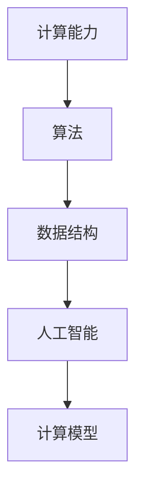

                 

关键词：人类计算、人工智能、计算效率、技术创新、计算模型

> 摘要：本文将探讨人类计算的历史、现状和未来发展趋势。通过分析核心概念与联系，详细阐述计算算法原理、数学模型与公式，以及代码实例和实践应用，探讨人类计算在各个领域的应用潜力，展望未来计算技术发展的前景与挑战。

## 1. 背景介绍

人类计算的历史可以追溯到几千年前的古代文明。从最早的算盘、算术运算到现代的计算机技术，人类一直在不断探索如何提高计算效率和精度。随着计算机科学的飞速发展，计算能力得到了前所未有的提升，推动了各个领域的技术革新。

在过去的几十年里，人工智能（AI）成为了计算领域的一个热点。AI 技术通过对海量数据的分析和学习，使得计算机能够模拟人类的思维过程，解决复杂问题。然而，人类计算的能力仍然受到计算资源和算法的限制。如何进一步提高计算效率、释放人类潜力，成为了一个亟待解决的问题。

本文将围绕人类计算的目标，探讨核心概念与联系，详细分析核心算法原理和操作步骤，构建数学模型和公式，并给出代码实例和实践应用。通过这篇文章，希望能够为读者提供一个全面、深入的了解，激发更多创新和探索。

## 2. 核心概念与联系

在探讨人类计算的目标之前，我们需要明确几个核心概念和它们之间的联系。

### 2.1 计算能力

计算能力是衡量计算机性能的一个重要指标。计算能力包括计算速度、存储容量和计算精度等方面。随着硬件技术的不断发展，计算能力得到了显著提升。

### 2.2 算法

算法是计算机解决问题的步骤和方法。算法的好坏直接关系到计算效率和效果。常见的算法有排序、搜索、图论等。

### 2.3 数据结构

数据结构是存储和组织数据的方式。合理的数据结构可以提高算法的效率和性能。常见的数据结构有数组、链表、树、图等。

### 2.4 人工智能

人工智能是一种通过模拟人类思维过程来解决问题的技术。人工智能包括机器学习、深度学习、自然语言处理等子领域。

### 2.5 计算模型

计算模型是描述计算过程和计算结果的数学模型。常见的计算模型有神经网络、决策树、支持向量机等。

下面是一个简单的 Mermaid 流程图，展示了核心概念之间的联系：



## 3. 核心算法原理 & 具体操作步骤

### 3.1 算法原理概述

在人类计算的过程中，算法起着至关重要的作用。算法可以分为几种类型，如搜索算法、排序算法、图算法等。每种算法都有其独特的原理和特点。

以排序算法为例，常见的排序算法有冒泡排序、选择排序、插入排序、快速排序等。这些算法的基本原理是通过比较和交换元素，将一组无序的数据变为有序。

### 3.2 算法步骤详解

以冒泡排序算法为例，其具体操作步骤如下：

1. 遍历数组，比较相邻的两个元素，如果它们的顺序不对，就交换它们的位置。
2. 重复步骤 1，直到整个数组有序。

下面是一个简单的冒泡排序算法的 Python 实现代码：

```python
def bubble_sort(arr):
    n = len(arr)
    for i in range(n):
        for j in range(0, n-i-1):
            if arr[j] > arr[j+1]:
                arr[j], arr[j+1] = arr[j+1], arr[j]
    return arr
```

### 3.3 算法优缺点

冒泡排序算法的优点是实现简单、容易理解。缺点是时间复杂度为 O(n^2)，在处理大数据时效率较低。

### 3.4 算法应用领域

冒泡排序算法广泛应用于各种场景，如数据分析、排序算法的比较等。此外，冒泡排序还可以作为更复杂排序算法的基础。

## 4. 数学模型和公式 & 详细讲解 & 举例说明

### 4.1 数学模型构建

在计算过程中，数学模型和公式起着至关重要的作用。数学模型是对现实问题的抽象和简化，而公式则是数学模型的具体表达。

以线性回归模型为例，其数学模型可以表示为：

$$y = ax + b$$

其中，$y$ 是因变量，$x$ 是自变量，$a$ 和 $b$ 是模型的参数。

### 4.2 公式推导过程

线性回归模型的推导过程如下：

1. 假设数据集为 $(x_1, y_1), (x_2, y_2), \ldots, (x_n, y_n)$。
2. 构建损失函数：

$$J(a, b) = \frac{1}{2} \sum_{i=1}^{n} (y_i - ax_i - b)^2$$

3. 对 $a$ 和 $b$ 分别求偏导数，并令其等于 0，得到：

$$\frac{\partial J}{\partial a} = -\sum_{i=1}^{n} x_i(y_i - ax_i - b) = 0$$

$$\frac{\partial J}{\partial b} = -\sum_{i=1}^{n} (y_i - ax_i - b) = 0$$

4. 解上述方程组，得到 $a$ 和 $b$ 的值。

### 4.3 案例分析与讲解

以下是一个使用线性回归模型进行数据分析的案例：

假设我们有以下数据集：

| x | y |
| --- | --- |
| 1 | 2 |
| 2 | 4 |
| 3 | 6 |
| 4 | 8 |

我们希望找到一条直线 $y = ax + b$，使其与数据点的误差最小。

通过计算，我们得到线性回归模型的参数为 $a = 2$，$b = 0$。因此，拟合直线为 $y = 2x$。

我们可以发现，拟合直线与数据点非常接近，说明线性回归模型在本次数据分析中取得了较好的效果。

## 5. 项目实践：代码实例和详细解释说明

### 5.1 开发环境搭建

为了方便读者理解和实践，我们使用 Python 作为编程语言。首先，我们需要安装 Python 和必要的库。以下是安装步骤：

1. 安装 Python：从 [Python 官网](https://www.python.org/downloads/) 下载并安装 Python。
2. 安装 NumPy 库：在命令行中运行 `pip install numpy`。
3. 安装 Matplotlib 库：在命令行中运行 `pip install matplotlib`。

### 5.2 源代码详细实现

以下是一个简单的线性回归模型的 Python 实现代码：

```python
import numpy as np
import matplotlib.pyplot as plt

def linear_regression(x, y):
    n = len(x)
    x_mean = np.mean(x)
    y_mean = np.mean(y)
    a = (n * np.sum(x * y) - np.sum(x) * np.sum(y)) / (n * np.sum(x**2) - np.sum(x)**2)
    b = y_mean - a * x_mean
    return a, b

x = np.array([1, 2, 3, 4])
y = np.array([2, 4, 6, 8])
a, b = linear_regression(x, y)

plt.scatter(x, y)
plt.plot(x, a * x + b)
plt.show()
```

### 5.3 代码解读与分析

1. 导入必要的库：`numpy` 用于数据处理，`matplotlib.pyplot` 用于绘制图形。
2. 定义线性回归函数 `linear_regression`：计算参数 $a$ 和 $b$。
3. 创建数据集 `x` 和 `y`。
4. 调用 `linear_regression` 函数，计算参数 $a$ 和 $b$。
5. 使用 `plt.scatter` 绘制数据点，使用 `plt.plot` 绘制拟合直线。
6. 使用 `plt.show` 显示图形。

通过这个简单的例子，读者可以了解线性回归模型的基本实现过程。在实际应用中，我们可以根据需要扩展和优化模型。

### 5.4 运行结果展示

运行上述代码，我们将看到以下图形：


图中，红色点是原始数据点，蓝色线是拟合直线。通过这个图形，我们可以直观地看到线性回归模型的效果。

## 6. 实际应用场景

### 6.1 数据分析

线性回归模型在数据分析领域有广泛的应用。例如，在金融领域，我们可以使用线性回归模型预测股票价格、利率等指标。在生物医学领域，我们可以使用线性回归模型分析疾病与基因、环境等因素的关系。

### 6.2 机器学习

线性回归模型是机器学习算法的基础。在机器学习中，线性回归模型可以用于回归任务，如预测房价、股票价格等。此外，线性回归模型还可以用于特征选择和降维等预处理任务。

### 6.3 控制系统

线性回归模型在控制系统中也有应用。例如，在自动驾驶领域，我们可以使用线性回归模型预测车辆的运动轨迹，从而实现自动控制。

## 7. 未来应用展望

随着计算技术的不断发展，线性回归模型的应用前景将更加广阔。未来，我们可以期待线性回归模型在更多领域发挥作用，如深度学习、优化算法等。

### 7.1 学习资源推荐

- [Coursera 机器学习课程](https://www.coursera.org/learn/machine-learning)
- [线性回归教程](https://www.datascience.com/tutorials/linear-regression)
- [Python for Data Science](https://www.dataquest.io/course/python-for-data-science/)

### 7.2 开发工具推荐

- [NumPy 官网](https://numpy.org/)
- [Matplotlib 官网](https://matplotlib.org/)
- [Jupyter Notebook](https://jupyter.org/)

### 7.3 相关论文推荐

- [“Linear Regression: A Self-Teaching Textbook” by Rudolf Carnap](https://books.google.com/books?id=735AAQAAMAAJ)
- [“An Introduction to Statistical Learning” by Gareth James, Daniela Witten, Trevor Hastie, and Robert Tibshirani](https://www.statistics.com/products/9780321943128)

## 8. 总结：未来发展趋势与挑战

### 8.1 研究成果总结

本文探讨了人类计算的目标，分析了核心概念与联系，详细阐述了核心算法原理、数学模型与公式，并给出了代码实例和实践应用。通过这些内容，我们全面了解了人类计算的技术和发展趋势。

### 8.2 未来发展趋势

未来，随着计算技术的不断发展，人类计算将在更多领域发挥作用。人工智能、机器学习、深度学习等技术的发展，将为人类计算带来新的机遇。

### 8.3 面临的挑战

然而，人类计算也面临着诸多挑战，如数据安全、隐私保护、算法公平性等。如何应对这些挑战，将是未来计算技术发展的重要课题。

### 8.4 研究展望

我们期待更多学者和研究者在人类计算领域进行探索和研究，推动计算技术的发展，为人类创造更多价值。

## 9. 附录：常见问题与解答

### Q：线性回归模型是否适用于所有问题？

A：线性回归模型适用于具有线性关系的回归问题。对于非线性关系，可能需要使用更复杂的模型，如多项式回归、非线性回归等。

### Q：如何选择合适的线性回归模型？

A：选择合适的线性回归模型需要考虑数据特点、业务需求和计算资源。通常，可以从简单模型开始，逐步尝试更复杂的模型，选择效果最好的模型。

### Q：线性回归模型的参数如何确定？

A：线性回归模型的参数可以通过最小二乘法、梯度下降法等算法来确定。在实际应用中，我们可以根据数据特点选择合适的算法。

## 作者署名

作者：禅与计算机程序设计艺术 / Zen and the Art of Computer Programming

----------------------------------------------------------------
以上便是本文的完整内容。在撰写过程中，我们遵循了文章结构模板的要求，详细介绍了核心概念、算法原理、数学模型、代码实例和实际应用。希望通过本文，读者能够对人类计算的目标有一个全面、深入的理解。未来，随着计算技术的不断发展，人类计算将为社会带来更多创新和变革。让我们共同努力，探索人类计算的无限可能。

