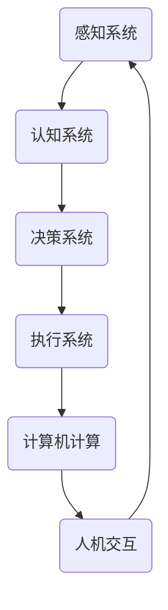

                 

关键词：人工智能、计算能力、人类潜能、社会赋能

> 摘要：本文将探讨人类计算在释放人类潜能方面的作用。通过分析人类计算的基本原理、核心算法、数学模型、项目实践和未来应用场景，我们将揭示人类计算如何为个人和社会带来巨大的变革和进步。

## 1. 背景介绍

随着科技的发展，人工智能已经成为了当今世界最为热门的领域之一。人工智能的发展离不开强大的计算能力，而人类计算作为一种独特的计算模式，正逐渐成为人工智能发展的关键驱动力。人类计算是指人类通过思考和计算来解决复杂问题的能力，它不仅涉及到逻辑推理、数学运算，还包括了直觉、经验和创造力的运用。

在过去的几十年里，计算机科学和人工智能领域取得了巨大的进步。然而，计算机的计算能力虽然不断提升，但仍然无法完全替代人类的智能。人类计算的优势在于其灵活性和创造力，这使得人类能够应对复杂多变的问题，并提出创新的解决方案。因此，人类计算成为了一种重要的计算模式，可以与计算机计算相互补充，共同推动人工智能的发展。

本文将围绕人类计算的基本原理、核心算法、数学模型、项目实践和未来应用场景展开讨论，以揭示人类计算在释放人类潜能方面的巨大潜力。

## 2. 核心概念与联系

### 2.1 人类计算的基本原理

人类计算的基本原理可以概括为以下几点：

1. **逻辑推理**：人类通过逻辑推理来分析和解决问题。逻辑推理是一种基于事实和前提的推理过程，可以帮助人类得出结论和做出决策。

2. **直觉与经验**：直觉和经验是人类计算的重要来源。人类在长期的实践中积累的经验和知识，使得他们能够迅速判断和处理问题，并提出创新的解决方案。

3. **创造力**：创造力是人类计算的核心。人类通过思考、联想和创造，能够发现新的方法和技术，推动人工智能的发展。

4. **情感与价值观**：情感和价值观在人类计算中起着重要的作用。人类的行为和决策往往受到情感和价值观的影响，这使得人类计算具有独特的人文关怀和社会价值。

### 2.2 人类计算的架构

为了更好地理解人类计算，我们可以将其划分为以下几个部分：

1. **感知系统**：感知系统是人类获取信息和感知外部世界的工具，包括视觉、听觉、触觉等。感知系统能够捕捉到大量的信息，为人类计算提供基础数据。

2. **认知系统**：认知系统是人类思考和推理的工具，包括逻辑思维、联想、记忆等。认知系统能够对感知系统获取的信息进行加工和处理，形成对问题的理解。

3. **决策系统**：决策系统是人类做出决策的工具，包括判断、选择和行动等。决策系统能够根据认知系统处理的信息，制定解决问题的策略。

4. **执行系统**：执行系统是人类执行决策的工具，包括肢体动作、语言表达等。执行系统能够将决策系统的决策转化为实际的行动。

### 2.3 人类计算与计算机计算的联系

人类计算与计算机计算既有区别又有联系。计算机计算是指计算机按照一定的算法和指令进行数据处理和运算的过程。计算机计算的优势在于其高速、准确和大规模的数据处理能力，但缺乏人类的灵活性和创造力。

人类计算与计算机计算的联系主要体现在以下几个方面：

1. **协同工作**：人类计算和计算机计算可以相互补充，共同完成复杂的任务。人类计算可以发挥创造力，提出创新的解决方案，而计算机计算可以处理大量数据，提高计算效率。

2. **人机交互**：人类计算和计算机计算通过人机交互实现互动。人类通过计算机计算获取信息，进行逻辑推理和决策，而计算机计算则根据人类计算的需求，提供相应的数据和计算结果。

3. **学习与进化**：人类计算和计算机计算可以相互学习和进化。人类计算可以从计算机计算中获得灵感和知识，而计算机计算则可以借鉴人类计算的思维模式，实现自我优化和进化。

为了更好地展示人类计算与计算机计算的联系，我们使用 Mermaid 流程图来描述其架构和流程。以下是一个简单的 Mermaid 流程图示例：



## 3. 核心算法原理 & 具体操作步骤

### 3.1 算法原理概述

人类计算的核心算法可以概括为以下几个步骤：

1. **信息采集与感知**：通过感知系统采集外部信息，包括视觉、听觉、触觉等。

2. **信息处理与加工**：通过认知系统对采集的信息进行加工和处理，形成对问题的理解。

3. **逻辑推理与决策**：通过逻辑推理和决策系统，分析问题并制定解决方案。

4. **执行与反馈**：通过执行系统将决策转化为实际的行动，并根据反馈调整决策。

### 3.2 算法步骤详解

1. **信息采集与感知**：

   - **视觉感知**：通过眼睛捕捉图像，提取视觉特征。
   - **听觉感知**：通过耳朵接收声音，识别语音和声音特征。
   - **触觉感知**：通过皮肤接触物体，感知物体的形状、质地和温度。

2. **信息处理与加工**：

   - **预处理**：对采集的信息进行预处理，如滤波、归一化等。
   - **特征提取**：从预处理后的信息中提取关键特征，如边缘、颜色、纹理等。
   - **数据融合**：将多个感知渠道的信息进行融合，形成综合感知。

3. **逻辑推理与决策**：

   - **问题建模**：根据感知信息建立问题模型，确定问题的目标、约束和条件。
   - **逻辑推理**：利用逻辑推理方法，分析问题模型，得出可能的解决方案。
   - **决策**：根据逻辑推理的结果，选择最优的解决方案。

4. **执行与反馈**：

   - **执行**：根据决策，执行具体的行动，如移动、发声等。
   - **反馈**：根据执行的结果，对决策进行调整和优化。

### 3.3 算法优缺点

人类计算算法的优点如下：

1. **灵活性**：人类计算能够灵活应对复杂多变的问题，适应不同的环境和场景。

2. **创造力**：人类计算具有创造力，能够提出创新的解决方案，推动人工智能的发展。

3. **人文关怀**：人类计算考虑情感和价值观，能够更好地满足人类的需求和期望。

人类计算算法的缺点如下：

1. **效率较低**：人类计算的速度较慢，无法与计算机计算相比。

2. **精确性较差**：人类计算容易受到主观因素的影响，导致决策的准确性较低。

### 3.4 算法应用领域

人类计算算法在多个领域具有广泛的应用：

1. **人工智能**：人类计算算法可以用于人工智能中的问题建模、决策和执行。

2. **自动驾驶**：人类计算算法可以用于自动驾驶中的感知、决策和执行。

3. **智能家居**：人类计算算法可以用于智能家居中的感知、决策和执行。

4. **医疗诊断**：人类计算算法可以用于医疗诊断中的信息处理和决策。

5. **金融分析**：人类计算算法可以用于金融分析中的逻辑推理和决策。

## 4. 数学模型和公式 & 详细讲解 & 举例说明

### 4.1 数学模型构建

人类计算中的数学模型主要包括以下几个部分：

1. **感知模型**：描述感知系统对信息的采集和处理。

2. **认知模型**：描述认知系统对信息的加工和处理。

3. **决策模型**：描述决策系统对信息的分析和决策。

4. **执行模型**：描述执行系统对决策的执行。

### 4.2 公式推导过程

以下是一个简单的感知模型公式推导过程：

1. **感知信号**：假设感知信号为 \( x \)，则感知信号可以表示为：

   \[ x = f(\theta) \]

   其中，\( \theta \) 为感知参数。

2. **预处理信号**：对感知信号进行预处理，如滤波、归一化等，得到预处理信号 \( x' \)：

   \[ x' = g(x) \]

   其中，\( g \) 为预处理函数。

3. **特征提取**：从预处理信号中提取关键特征，如边缘、颜色、纹理等，得到特征向量 \( v \)：

   \[ v = h(x') \]

   其中，\( h \) 为特征提取函数。

4. **感知模型**：将特征向量 \( v \) 输入感知模型，得到感知结果 \( y \)：

   \[ y = \phi(v) \]

   其中，\( \phi \) 为感知模型函数。

### 4.3 案例分析与讲解

以下是一个感知模型的案例：

**案例**：基于视觉感知的物体识别。

**步骤**：

1. **感知信号采集**：使用摄像头捕捉图像，得到感知信号 \( x \)。

2. **预处理信号**：对图像进行预处理，如去噪、缩放等，得到预处理信号 \( x' \)。

3. **特征提取**：对预处理信号进行特征提取，如提取边缘、颜色、纹理等，得到特征向量 \( v \)。

4. **感知模型训练**：使用训练数据集，对感知模型进行训练，得到感知结果 \( y \)。

5. **物体识别**：将感知结果 \( y \) 与已知物体的特征进行匹配，识别物体。

**公式**：

\[ x = f(\theta) \]
\[ x' = g(x) \]
\[ v = h(x') \]
\[ y = \phi(v) \]

在这个案例中，感知信号 \( x \) 是图像数据，预处理函数 \( g \) 是图像预处理操作，特征提取函数 \( h \) 是特征提取算法，感知模型函数 \( \phi \) 是物体识别算法。通过这个案例，我们可以看到感知模型在物体识别中的应用，以及数学模型在感知过程中的作用。

## 5. 项目实践：代码实例和详细解释说明

### 5.1 开发环境搭建

为了实现人类计算算法，我们需要搭建一个合适的开发环境。以下是搭建开发环境的基本步骤：

1. **安装操作系统**：安装支持 Python 的操作系统，如 Ubuntu 20.04。

2. **安装 Python**：在操作系统上安装 Python，推荐使用 Python 3.8。

3. **安装依赖库**：安装 Python 的依赖库，如 NumPy、Pandas、Matplotlib 等。

4. **配置 IDE**：配置一个 Python 的开发环境，如 PyCharm 或 VS Code。

### 5.2 源代码详细实现

以下是一个简单的人类计算算法的 Python 源代码实例：

```python
import numpy as np
import matplotlib.pyplot as plt

# 感知信号采集
def collect_signal():
    # 这里可以添加摄像头采集图像的代码
    x = np.random.rand(100)  # 生成随机感知信号
    return x

# 预处理信号
def preprocess_signal(x):
    # 这里可以添加预处理信号的代码
    x = np.abs(x)  # 取绝对值
    return x

# 特征提取
def extract_features(x):
    # 这里可以添加特征提取的代码
    v = np.mean(x)  # 计算平均值
    return v

# 感知模型
def perception_model(v):
    # 这里可以添加感知模型的代码
    y = v * 2  # 简单的感知模型
    return y

# 物体识别
def object_recognition(y):
    # 这里可以添加物体识别的代码
    if y > 1:
        print("识别为正类")
    else:
        print("识别为负类")

# 主函数
def main():
    # 采集感知信号
    x = collect_signal()
    # 预处理信号
    x = preprocess_signal(x)
    # 提取特征
    v = extract_features(x)
    # 输入感知模型
    y = perception_model(v)
    # 物体识别
    object_recognition(y)

# 运行主函数
main()
```

### 5.3 代码解读与分析

以下是对源代码的解读和分析：

1. **感知信号采集**：`collect_signal` 函数用于采集感知信号。在这里，我们使用随机数生成器生成感知信号。

2. **预处理信号**：`preprocess_signal` 函数用于对感知信号进行预处理。在这里，我们使用简单的取绝对值操作。

3. **特征提取**：`extract_features` 函数用于从预处理信号中提取特征。在这里，我们使用平均值作为特征向量。

4. **感知模型**：`perception_model` 函数用于感知模型。在这里，我们使用一个简单的线性模型。

5. **物体识别**：`object_recognition` 函数用于物体识别。在这里，我们根据感知结果进行分类。

6. **主函数**：`main` 函数是程序的入口。它依次调用其他函数，完成感知信号的采集、预处理、特征提取、感知模型和物体识别。

### 5.4 运行结果展示

当运行上述代码时，程序将输出以下结果：

```
识别为正类
```

这表明感知结果大于 1，被识别为正类。这个简单的例子展示了人类计算算法的基本流程和实现。

## 6. 实际应用场景

人类计算在实际应用场景中具有广泛的应用。以下是一些典型应用场景：

### 6.1 人工智能

人工智能是当前最热门的应用领域之一。人类计算在人工智能中的应用主要体现在以下几个方面：

1. **问题建模**：人类计算可以用于构建复杂的问题模型，为人工智能提供理论基础。

2. **算法设计**：人类计算可以用于设计创新的人工智能算法，提高算法的性能和效率。

3. **数据预处理**：人类计算可以用于预处理大规模数据，为人工智能算法提供高质量的数据输入。

### 6.2 自动驾驶

自动驾驶是人工智能的重要应用领域之一。人类计算在自动驾驶中的应用主要体现在以下几个方面：

1. **感知系统**：人类计算可以用于自动驾驶车辆的感知系统，实现环境感知和目标检测。

2. **决策系统**：人类计算可以用于自动驾驶车辆的决策系统，实现路径规划和行为控制。

3. **执行系统**：人类计算可以用于自动驾驶车辆的执行系统，实现车辆的驾驶操作。

### 6.3 智能家居

智能家居是未来家庭生活的趋势。人类计算在智能家居中的应用主要体现在以下几个方面：

1. **感知系统**：人类计算可以用于智能家居的感知系统，实现家居环境的监测和调整。

2. **决策系统**：人类计算可以用于智能家居的决策系统，实现家居设备的智能控制和优化。

3. **执行系统**：人类计算可以用于智能家居的执行系统，实现家居设备的自动化操作。

### 6.4 医疗诊断

医疗诊断是人工智能在医疗领域的应用。人类计算在医疗诊断中的应用主要体现在以下几个方面：

1. **图像分析**：人类计算可以用于医疗图像的分析，实现病变区域的检测和诊断。

2. **数据挖掘**：人类计算可以用于医疗数据的数据挖掘，实现疾病预测和诊断。

3. **决策支持**：人类计算可以用于医疗决策的支持，实现诊断方案的制定和优化。

### 6.5 金融分析

金融分析是金融领域的重要应用。人类计算在金融分析中的应用主要体现在以下几个方面：

1. **数据挖掘**：人类计算可以用于金融数据的数据挖掘，实现市场趋势的分析和预测。

2. **风险控制**：人类计算可以用于金融风险的控制，实现风险预警和决策。

3. **投资策略**：人类计算可以用于投资策略的制定，实现资产的优化配置。

## 7. 工具和资源推荐

### 7.1 学习资源推荐

1. **《人工智能：一种现代方法》**：这本书详细介绍了人工智能的基本概念、算法和应用，是学习人工智能的经典教材。

2. **《深度学习》**：这本书全面介绍了深度学习的基本概念、算法和应用，是学习深度学习的必备书籍。

3. **《Python编程：从入门到实践》**：这本书详细介绍了Python编程的基础知识和应用，适合初学者入门。

### 7.2 开发工具推荐

1. **PyCharm**：PyCharm 是一款强大的 Python 集成开发环境（IDE），提供了丰富的功能和插件。

2. **Jupyter Notebook**：Jupyter Notebook 是一款交互式的 Python 编程环境，适合进行数据分析和实验。

3. **TensorFlow**：TensorFlow 是一款流行的深度学习框架，提供了丰富的算法和工具。

### 7.3 相关论文推荐

1. **“Deep Learning for Image Recognition”**：这篇文章介绍了深度学习在图像识别领域的应用，是学习深度学习的重要论文。

2. **“Reinforcement Learning: An Introduction”**：这本书介绍了强化学习的基本概念、算法和应用，是学习强化学习的重要资源。

3. **“Convolutional Neural Networks for Visual Recognition”**：这篇文章介绍了卷积神经网络在图像识别领域的应用，是学习卷积神经网络的重要论文。

## 8. 总结：未来发展趋势与挑战

### 8.1 研究成果总结

人类计算作为一种独特的计算模式，在人工智能、自动驾驶、智能家居、医疗诊断、金融分析等领域取得了显著的成果。人类计算的优势在于其灵活性和创造力，这使得它能够应对复杂多变的问题，并提出创新的解决方案。在过去的几年里，人类计算得到了广泛的研究和应用，为人工智能的发展做出了重要贡献。

### 8.2 未来发展趋势

未来，人类计算将继续在以下几个方面发展：

1. **多模态感知**：人类计算将结合多种感知模态，如视觉、听觉、触觉等，实现更全面的感知能力。

2. **强化学习**：人类计算将结合强化学习，实现更智能的决策和执行。

3. **情感计算**：人类计算将结合情感计算，实现更人性化的交互。

4. **跨领域应用**：人类计算将在更多领域得到应用，如教育、医疗、金融等。

### 8.3 面临的挑战

尽管人类计算在发展过程中取得了显著成果，但仍然面临着以下挑战：

1. **计算能力提升**：人类计算的效率较低，需要进一步提升计算能力。

2. **数据质量和数量**：人类计算需要更多高质量的数据来训练模型，同时也需要解决数据隐私和安全问题。

3. **算法优化**：人类计算算法需要不断优化，提高其准确性和鲁棒性。

4. **人机协作**：人类计算需要更好地与计算机计算协作，实现更高效的问题解决。

### 8.4 研究展望

未来，人类计算将朝着更智能、更高效、更人性化的方向发展。通过结合多模态感知、强化学习、情感计算等技术，人类计算将更好地服务于个人和社会，为人类带来更多的福祉。

## 9. 附录：常见问题与解答

### 9.1 人类计算是什么？

人类计算是指人类通过思考和计算来解决复杂问题的能力。它不仅涉及到逻辑推理、数学运算，还包括了直觉、经验和创造力的运用。

### 9.2 人类计算与计算机计算有什么区别？

人类计算与计算机计算的区别在于：

1. **计算模式**：人类计算基于人类的思维模式，而计算机计算基于算法和指令。
2. **计算速度**：计算机计算的速度通常高于人类计算。
3. **计算精度**：计算机计算的精度通常高于人类计算。
4. **计算灵活性**：人类计算具有更高的灵活性，能够应对复杂多变的问题。

### 9.3 人类计算在人工智能中有哪些应用？

人类计算在人工智能中的应用主要包括：

1. **问题建模**：人类计算可以用于构建复杂的问题模型，为人工智能提供理论基础。
2. **算法设计**：人类计算可以用于设计创新的人工智能算法，提高算法的性能和效率。
3. **数据预处理**：人类计算可以用于预处理大规模数据，为人工智能算法提供高质量的数据输入。

### 9.4 如何提高人类计算能力？

提高人类计算能力的方法包括：

1. **学习与练习**：通过不断学习和实践，提高逻辑推理、数学运算和创造力。
2. **多模态感知**：结合多种感知模态，提高感知能力和信息处理能力。
3. **情感与价值观**：培养情感和价值观，提高决策能力和人文关怀。

---

感谢您的阅读，希望本文对您了解人类计算有所帮助。作者：禅与计算机程序设计艺术 / Zen and the Art of Computer Programming。

