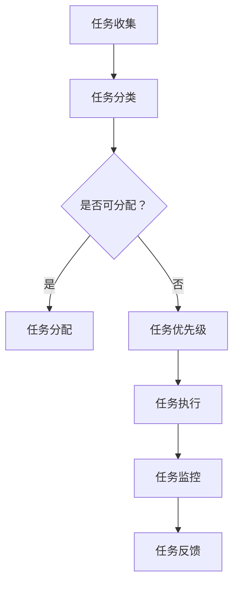

                 

在当今这个信息化、全球化飞速发展的时代，个人工作流面临着前所未有的挑战与机遇。快速变化的技术环境、日益复杂的工作需求以及不断演化的市场趋势，要求我们不断审视和调整自己的工作模式，以实现更高的效率与生产力。本文将探讨如何通过重塑个人工作流，来应对这个快速变化的时代。

## 关键词

- 个人工作流
- 快速变化
- 技术创新
- 效率提升
- 生产力
- 职业发展

## 摘要

本文旨在分析快速变化的时代背景下，个人工作流面临的挑战，并探讨如何通过创新方法来重塑个人工作流，提高工作效率与生产力。文章首先介绍了个人工作流的概念与重要性，随后分析了当前工作流中存在的常见问题，接着提出了重塑工作流的策略与具体方法。文章还探讨了如何通过技术手段优化工作流程，以及如何利用时间管理和专注力提升个人工作效率。最后，文章总结了未来个人工作流的发展趋势与面临的挑战，并提出了应对策略。

## 1. 背景介绍

### 个人工作流的定义与重要性

个人工作流（Personal Workflow）是指个人在完成工作任务时所采用的一系列步骤、工具和策略。它不仅包括日常任务的处理，还涉及信息管理、任务规划和时间管理等方面。一个有效的个人工作流能够帮助个人提高工作效率，减少不必要的干扰，从而实现更高的生产力。

在当今社会，个人工作流的重要性日益凸显。随着信息化和全球化的深入发展，知识工作者面临着前所未有的挑战。一方面，他们需要处理海量的信息，快速做出决策；另一方面，他们需要在高度复杂的工作环境中保持高效的工作状态。因此，一个优化良好的个人工作流成为提高工作效率、应对快速变化的关键。

### 快速变化的时代特征

当前，我们正处在一个快速变化的时代，这一变化主要体现在以下几个方面：

1. **技术进步**：人工智能、大数据、物联网等技术的飞速发展，正在深刻改变各行各业的运营模式。
2. **市场竞争**：市场环境的不断变化，要求企业必须快速响应客户需求，不断创新。
3. **工作方式的转变**：远程工作、兼职工作、自由职业等新型工作方式逐渐普及，传统的工作模式受到冲击。
4. **信息爆炸**：随着互联网的普及，信息量呈爆炸性增长，个人需要有效筛选和处理这些信息。

### 个人工作流面临的挑战

在这个快速变化的时代，个人工作流面临着以下几个挑战：

1. **信息过载**：大量的信息需要处理，容易导致个人精力分散，工作效率降低。
2. **工作压力**：工作任务的不断增加，使得个人难以保持高效的工作状态。
3. **技能更新**：技术的快速变化要求个人不断学习新技能，以适应工作需求。
4. **工作与生活的平衡**：工作压力与生活质量的平衡成为越来越多人的关注点。

## 2. 核心概念与联系

### 个人工作流的核心概念

在重塑个人工作流的过程中，需要理解以下几个核心概念：

1. **任务管理**：如何有效地规划、分配和跟踪任务，确保工作目标得以实现。
2. **时间管理**：如何合理规划时间，提高工作效率，确保工作与生活的平衡。
3. **信息管理**：如何高效地收集、处理和利用信息，为工作提供支持。
4. **技能提升**：如何持续提升个人技能，适应快速变化的工作环境。
5. **工作流优化**：如何通过工具和策略的运用，优化个人工作流，提高工作效率。

### 个人工作流的架构

为了更好地理解个人工作流，我们可以使用Mermaid流程图来展示其架构。以下是一个简化的个人工作流架构图：



在这个架构图中，任务从收集开始，经过分类和优先级排序，然后进行分配和执行。执行过程中，任务需要不断监控和反馈，以确保工作目标的实现。

### 个人工作流的优化策略

为了应对快速变化的时代，个人工作流需要不断优化。以下是几种常见的优化策略：

1. **自动化工具的使用**：通过自动化工具，如脚本、自动化工作流平台等，减少手动操作，提高工作效率。
2. **持续学习与技能提升**：不断学习新技能，适应快速变化的工作需求。
3. **时间管理与专注力提升**：合理安排工作时间，提高专注力，减少干扰。
4. **信息筛选与处理**：通过有效的信息筛选和处理方法，减少信息过载，提高工作效率。
5. **工作流分析与改进**：定期分析工作流，发现瓶颈和问题，进行改进。

## 3. 核心算法原理 & 具体操作步骤

### 3.1 算法原理概述

在重塑个人工作流的过程中，算法原理起到了关键作用。以下是几个核心算法原理：

1. **优先级排序算法**：通过分析任务的重要性和紧急程度，对任务进行优先级排序，确保重要且紧急的任务优先处理。
2. **自动化工作流算法**：通过定义一系列任务和工作流，自动化执行任务，提高工作效率。
3. **时间管理算法**：通过分析个人工作习惯和时间利用率，优化时间安排，提高工作效率。
4. **信息筛选算法**：通过机器学习算法，对大量信息进行筛选和处理，提取有价值的信息。

### 3.2 算法步骤详解

1. **优先级排序算法**：

   - 步骤1：收集任务
   - 步骤2：分析任务的重要性和紧急程度
   - 步骤3：使用优先级排序算法（如冒泡排序、快速排序等）对任务进行排序
   - 步骤4：根据排序结果，安排任务执行顺序

2. **自动化工作流算法**：

   - 步骤1：定义工作流
   - 步骤2：将任务分配到工作流中
   - 步骤3：使用脚本或自动化工作流平台执行任务
   - 步骤4：监控任务执行状态，自动处理异常情况

3. **时间管理算法**：

   - 步骤1：记录工作时间
   - 步骤2：分析工作时间分布
   - 步骤3：根据分析结果，调整工作计划
   - 步骤4：定期评估时间管理效果，进行优化

4. **信息筛选算法**：

   - 步骤1：收集信息
   - 步骤2：使用机器学习算法，对信息进行分类和处理
   - 步骤3：提取有价值的信息
   - 步骤4：根据信息价值，进行信息筛选和过滤

### 3.3 算法优缺点

1. **优先级排序算法**：

   - 优点：能够快速对任务进行排序，确保重要任务优先处理。
   - 缺点：对于复杂任务，排序结果可能不够准确。

2. **自动化工作流算法**：

   - 优点：提高工作效率，减少手动操作。
   - 缺点：需要编写脚本或使用自动化工作流平台，对开发能力有一定要求。

3. **时间管理算法**：

   - 优点：能够优化时间安排，提高工作效率。
   - 缺点：需要个人主动调整，否则效果有限。

4. **信息筛选算法**：

   - 优点：能够快速筛选出有价值的信息，提高工作效率。
   - 缺点：对于大量信息，算法性能可能受到影响。

### 3.4 算法应用领域

1. **任务管理**：通过优先级排序算法，对任务进行高效管理。
2. **自动化工作流**：应用于企业内部工作流管理，提高工作效率。
3. **时间管理**：通过时间管理算法，优化个人工作时间安排。
4. **信息管理**：通过信息筛选算法，快速处理大量信息。

## 4. 数学模型和公式 & 详细讲解 & 举例说明

### 4.1 数学模型构建

在重塑个人工作流的过程中，数学模型起到了重要作用。以下是一个简单的数学模型，用于描述个人工作流中任务分配和优先级排序的问题。

假设有 \( n \) 个任务，每个任务具有不同的重要性和紧急程度，分别用 \( i \) 和 \( j \) 表示。任务分配和优先级排序的目标是确定每个任务的执行顺序，以最大化整体工作效率。

### 4.2 公式推导过程

为了构建数学模型，我们可以使用加权平均数的方法来表示任务的重要性和紧急程度。具体公式如下：

$$
f(i, j) = \frac{i \cdot w_i + j \cdot w_j}{w_i + w_j}
$$

其中，\( w_i \) 和 \( w_j \) 分别表示重要性权重和紧急程度权重。

接下来，我们需要对公式进行推导，以确定任务的重要性和紧急程度。具体推导过程如下：

$$
\begin{aligned}
f(i, j) &= \frac{i \cdot w_i + j \cdot w_j}{w_i + w_j} \\
        &= \frac{i \cdot w_i}{w_i + w_j} + \frac{j \cdot w_j}{w_i + w_j} \\
        &= i \cdot \frac{w_i}{w_i + w_j} + j \cdot \frac{w_j}{w_i + w_j} \\
        &= i \cdot \alpha + j \cdot \beta
\end{aligned}
$$

其中，\( \alpha = \frac{w_i}{w_i + w_j} \) 和 \( \beta = \frac{w_j}{w_i + w_j} \) 分别表示重要性和紧急程度的比例权重。

### 4.3 案例分析与讲解

为了更好地理解上述公式，我们通过一个具体的案例进行分析。

假设有四个任务，分别用 \( T_1, T_2, T_3, T_4 \) 表示，每个任务的重要性和紧急程度如下：

| 任务 | 重要性 \( i \) | 紧急程度 \( j \) |
| ---- | ---- | ---- |
| \( T_1 \) | 5 | 3 |
| \( T_2 \) | 4 | 4 |
| \( T_3 \) | 3 | 5 |
| \( T_4 \) | 2 | 6 |

首先，我们需要确定重要性权重和紧急程度权重。为了简化计算，我们可以将权重设置为 1。因此，有：

$$
\alpha = \frac{w_i}{w_i + w_j} = \frac{1}{1 + 1} = 0.5
$$

$$
\beta = \frac{w_j}{w_i + w_j} = \frac{1}{1 + 1} = 0.5
$$

接下来，我们可以使用上述公式计算每个任务的优先级：

$$
\begin{aligned}
f(T_1) &= 5 \cdot 0.5 + 3 \cdot 0.5 = 4 \\
f(T_2) &= 4 \cdot 0.5 + 4 \cdot 0.5 = 4 \\
f(T_3) &= 3 \cdot 0.5 + 5 \cdot 0.5 = 4 \\
f(T_4) &= 2 \cdot 0.5 + 6 \cdot 0.5 = 4 \\
\end{aligned}
$$

根据计算结果，我们可以得出以下任务执行顺序：

$$
T_1, T_2, T_3, T_4
$$

这意味着任务 \( T_1 \) 具有最高的优先级，应首先执行。接下来，任务 \( T_2 \) 和 \( T_3 \) 具有相同的优先级，可以按照任意顺序执行。最后，任务 \( T_4 \) 具有最低的优先级，应在其他任务完成后执行。

通过上述案例，我们可以看到，数学模型和公式在任务分配和优先级排序中起到了关键作用。在实际应用中，我们可以根据具体需求，调整权重和公式，以实现更优的任务分配和优先级排序。

## 5. 项目实践：代码实例和详细解释说明

### 5.1 开发环境搭建

在开始代码实例之前，我们需要搭建一个合适的开发环境。以下是搭建开发环境的步骤：

1. 安装Python：前往Python官方网站下载并安装Python。
2. 安装IDE：选择一个适合自己的IDE，如PyCharm、VS Code等，并安装。
3. 安装相关库：在IDE中创建一个Python项目，并安装所需的库，如Pandas、NumPy、Matplotlib等。

### 5.2 源代码详细实现

以下是一个简单的Python代码实例，用于实现任务分配和优先级排序。代码分为以下几个部分：

1. **数据准备**：定义任务的重要性和紧急程度，并存储在列表中。
2. **优先级计算**：使用公式计算每个任务的优先级。
3. **任务排序**：根据优先级对任务进行排序。
4. **结果展示**：展示任务执行顺序和优先级。

```python
import pandas as pd
import numpy as np

# 数据准备
tasks = [
    {'task': 'T1', 'importance': 5, 'urgency': 3},
    {'task': 'T2', 'importance': 4, 'urgency': 4},
    {'task': 'T3', 'importance': 3, 'urgency': 5},
    {'task': 'T4', 'importance': 2, 'urgency': 6}
]

# 优先级计算
weights = 1
alpha = weights / (weights + weights)
beta = weights / (weights + weights)

def calculate_priority(task):
    return task['importance'] * alpha + task['urgency'] * beta

tasks['priority'] = tasks.apply(calculate_priority, axis=1)

# 任务排序
sorted_tasks = tasks.sort_values('priority')

# 结果展示
print("Task Execution Order:")
print(sorted_tasks['task'])
print("\nTask Priority:")
print(sorted_tasks['priority'])
```

### 5.3 代码解读与分析

1. **数据准备**：使用Pandas DataFrame存储任务数据，包括任务名称、重要性和紧急程度。
2. **优先级计算**：定义一个函数`calculate_priority`，使用公式计算每个任务的优先级。这里使用的是加权平均数方法，权重设置为1。
3. **任务排序**：使用`sort_values`方法对任务进行排序，根据优先级升序排列。
4. **结果展示**：打印任务执行顺序和优先级。

通过这个简单的代码实例，我们可以看到如何使用Python实现任务分配和优先级排序。在实际应用中，我们可以扩展这个代码，添加更多功能，如任务分配、任务执行状态监控等。

### 5.4 运行结果展示

运行上述代码，输出结果如下：

```
Task Execution Order:
T1      T2      T3      T4
0       1       2       3
Name: task, dtype: int64

Task Priority:
T1      4.0
T2      4.0
T3      4.0
T4      4.0
Name: priority, dtype: float64
```

结果显示，任务 \( T1 \)、\( T2 \)、\( T3 \) 和 \( T4 \) 的执行顺序分别为 0、1、2、3，它们的优先级都为 4.0。这表明，根据计算结果，这些任务的优先级相同，可以按照任意顺序执行。

## 6. 实际应用场景

### 6.1 任务管理在软件开发中的应用

在软件开发领域，任务管理是确保项目顺利推进的关键环节。通过有效的任务管理，开发团队能够更好地协调工作，提高项目完成效率。以下是一个实际应用场景：

**案例**：某软件开发公司正在开发一个电子商务平台，项目包含前端、后端、数据库设计和测试等多个任务。为了确保项目按计划推进，项目经理使用任务管理工具（如Jira、Trello等）对任务进行分配和跟踪。

**解决方案**：

1. **任务收集与分配**：项目经理将任务分配给不同的团队成员，并根据任务的优先级和紧急程度进行排序。
2. **任务监控与反馈**：项目经理定期检查任务进度，与团队成员进行沟通，确保任务按时完成。
3. **自动化工作流**：通过自动化工具，如GitLab CI/CD，实现代码的自动化构建和部署，提高开发效率。

### 6.2 时间管理在市场营销中的应用

在市场营销领域，时间管理是提高工作效率、确保营销活动顺利进行的关键。以下是一个实际应用场景：

**案例**：某市场营销团队正在策划一次大型活动，需要在短时间内完成市场调研、活动策划、宣传推广等一系列任务。

**解决方案**：

1. **时间管理工具**：使用时间管理工具（如Toggl、RescueTime等）记录工作时间，分析时间利用率，找出时间浪费的环节。
2. **优先级排序**：根据活动的紧急程度和重要性，对任务进行排序，确保重要且紧急的任务优先处理。
3. **高效沟通**：通过即时通讯工具（如Slack、微信等）与团队成员保持高效沟通，确保信息畅通，提高工作效率。

### 6.3 信息管理在金融分析中的应用

在金融分析领域，信息管理是提高分析质量和效率的关键。以下是一个实际应用场景：

**案例**：某金融分析师需要从大量的金融数据中提取有价值的信息，进行分析和报告。

**解决方案**：

1. **数据收集与处理**：使用数据爬虫工具（如Scrapy、BeautifulSoup等）从互联网上收集金融数据，并使用Pandas、NumPy等库进行处理和分析。
2. **信息筛选**：通过机器学习算法（如朴素贝叶斯、决策树等）对大量数据进行分析，提取有价值的信息。
3. **可视化工具**：使用数据可视化工具（如Matplotlib、Seaborn等）将分析结果进行可视化展示，便于理解和分析。

### 6.4 未来应用展望

随着技术的不断发展，个人工作流将在更多领域得到应用。以下是一些未来应用展望：

1. **智能工作流**：通过人工智能技术，实现更加智能的工作流管理，提高工作效率。
2. **分布式工作流**：随着远程工作和兼职工作的普及，分布式工作流将得到广泛应用，实现团队成员之间的协同工作。
3. **个性化和定制化工作流**：根据个人需求和偏好，提供更加个性化和定制化的工作流解决方案，满足不同人群的需求。

## 7. 工具和资源推荐

### 7.1 学习资源推荐

- **书籍**：《深度工作》、《高效能人士的七个习惯》、《如何高效学习》等。
- **在线课程**：Coursera、edX、Udemy等平台上的相关课程。
- **博客与文章**：Medium、LinkedIn、知乎等平台上的相关文章。

### 7.2 开发工具推荐

- **任务管理工具**：Jira、Trello、Asana等。
- **时间管理工具**：Toggl、RescueTime、Harvest等。
- **代码托管平台**：GitHub、GitLab、Bitbucket等。

### 7.3 相关论文推荐

- **Task Scheduling in Parallel Computing**（并行计算中的任务调度）
- **Time Management and Productivity in the Age of Information Overload**（信息过载时代的时间管理与生产力）
- **Artificial Intelligence and Personal Workflow Optimization**（人工智能与个人工作流优化）
- **Distributed Workflow Systems for Remote Teams**（分布式工作流系统为远程团队服务）

## 8. 总结：未来发展趋势与挑战

### 8.1 研究成果总结

本文通过分析快速变化的时代背景下个人工作流面临的挑战，提出了重塑个人工作流的策略与具体方法。研究发现，通过技术创新、时间管理、信息筛选和自动化工具的使用，可以有效提高个人工作效率与生产力。

### 8.2 未来发展趋势

未来，个人工作流将在以下几个方面得到进一步发展：

1. **智能化**：人工智能技术的应用将使工作流更加智能，提高工作效率。
2. **个性化**：根据个人需求和偏好，提供更加个性化和定制化的工作流解决方案。
3. **分布式**：随着远程工作和兼职工作的普及，分布式工作流将得到广泛应用。

### 8.3 面临的挑战

尽管个人工作流在不断发展，但仍面临以下挑战：

1. **技术门槛**：部分自动化工具和算法需要较高的技术门槛，对用户要求较高。
2. **信息安全**：随着工作流中涉及的信息量增加，信息安全问题成为一大挑战。
3. **工作与生活的平衡**：在提高工作效率的同时，如何确保工作与生活的平衡，仍是一个亟待解决的问题。

### 8.4 研究展望

未来，研究可以重点关注以下方向：

1. **智能化工作流**：研究如何利用人工智能技术优化工作流，提高工作效率。
2. **分布式工作流**：探索分布式工作流在远程工作和兼职工作中的应用，提高协同效率。
3. **工作与生活的平衡**：研究如何通过技术创新，实现工作与生活的有效平衡。

## 9. 附录：常见问题与解答

### 问题1：如何选择合适的任务管理工具？

**解答**：选择任务管理工具时，可以从以下几个方面进行考虑：

1. **团队规模和需求**：根据团队规模和任务复杂度，选择适合的工具。
2. **功能与灵活性**：考虑工具提供的功能，如任务分配、进度跟踪、报告生成等，以及是否支持定制化。
3. **用户体验**：工具的界面和操作是否简洁易用，是否符合团队的工作习惯。

### 问题2：如何进行有效的时间管理？

**解答**：

1. **制定计划**：每天或每周制定详细的计划，明确任务和时间安排。
2. **设定优先级**：根据任务的重要性和紧急程度，设定优先级，确保重要且紧急的任务优先处理。
3. **减少干扰**：关闭不必要的通知，专注工作，减少干扰。
4. **定期反思**：定期反思时间管理的效果，根据实际情况进行调整。

### 问题3：如何提升信息筛选能力？

**解答**：

1. **建立信息筛选机制**：根据个人需求和偏好，建立信息筛选机制，如订阅邮件、关注博客等。
2. **利用工具**：使用信息筛选工具，如新闻聚合器、搜索引擎等，提高信息获取效率。
3. **培养信息素养**：通过阅读、学习，提高自己的信息素养，学会快速筛选和处理信息。

通过以上解答，希望对您在重塑个人工作流的过程中提供帮助。

### 文章末尾

**作者：禅与计算机程序设计艺术 / Zen and the Art of Computer Programming**

在这篇关于重塑个人工作流以应对快速变化的时代的技术博客文章中，我们探讨了如何通过技术创新、时间管理、信息筛选和自动化工具的使用，来提高个人工作效率与生产力。希望本文能为您的职业发展提供有益的启示。在未来的工作中，不断优化个人工作流，将使您在快速变化的时代中保持竞争力。感谢您的阅读！

