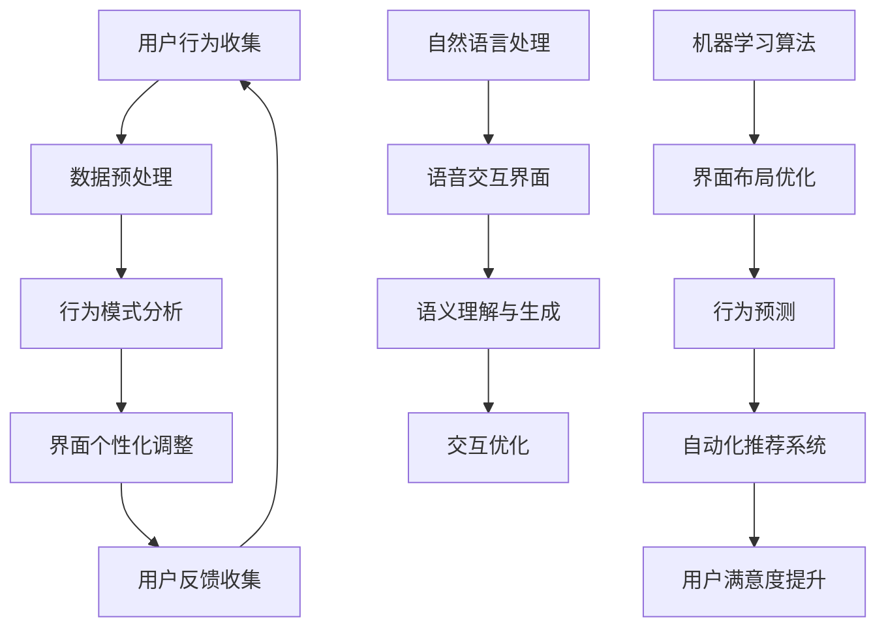

                 

关键词：用户界面设计、人工智能、设计革新、用户体验、交互设计、可视化、自适应、个性化

摘要：本文深入探讨了人工智能在用户界面设计中的革新作用。通过分析AI的核心概念与联系，我们揭示了其在界面构建、交互设计、可视化以及个性化定制等方面的独特优势。本文还从算法原理、数学模型、项目实践等多个角度，详细阐述了AI在用户界面设计中的应用，以及其在未来应用场景中的广阔前景。最后，我们对相关工具和资源进行了推荐，并对未来发展趋势与挑战进行了展望。

## 1. 背景介绍

用户界面设计（User Interface Design，简称UI设计）是计算机科学与艺术的结合体，旨在提升用户与系统之间的交互效率与体验。从最早的命令行界面到图形用户界面（GUI），再到触摸界面、语音界面，用户界面设计一直在不断演进。然而，随着互联网的普及和智能设备的多样化，用户对界面设计的要求越来越高，不仅仅是美观，更注重交互的直观性、便捷性和个性化。

人工智能（Artificial Intelligence，简称AI）的迅速发展，为用户界面设计带来了全新的机遇。AI能够通过学习用户的行为模式，提供更加个性化的服务；通过自然语言处理，实现更加自然的交互方式；通过机器学习，优化界面布局和交互流程，从而提升用户体验。本文将探讨AI在用户界面设计中的具体应用，以及如何通过AI技术实现界面设计的革新。

## 2. 核心概念与联系

为了更好地理解AI在用户界面设计中的应用，我们需要先了解AI的核心概念与联系。下面是一个使用Mermaid绘制的流程图，展示了AI在用户界面设计中的关键步骤和概念。



### 2.1 用户行为收集与数据预处理

用户行为收集是AI在用户界面设计中的第一步。通过收集用户在界面上的操作数据，如点击、滑动、搜索等，我们可以了解到用户的偏好和使用习惯。数据预处理是对原始数据进行清洗、转换和归一化，以便于后续分析。

### 2.2 行为模式分析

行为模式分析是通过对用户行为数据进行分析，挖掘用户的使用习惯和偏好。这一步可以帮助我们了解用户的需求，为界面个性化调整提供依据。

### 2.3 界面个性化调整

界面个性化调整是根据用户的行为模式，动态调整界面布局和交互元素，以提升用户体验。例如，一个电商平台可以根据用户的购物习惯，推荐相关的商品。

### 2.4 用户反馈收集

用户反馈收集是AI在用户界面设计中的关键环节。通过收集用户的反馈，我们可以了解到用户对界面的满意程度，以及哪些方面需要改进。

### 2.5 自然语言处理与语音交互界面

自然语言处理（Natural Language Processing，简称NLP）是AI的一个重要分支，通过NLP，我们可以实现自然语言的理解和生成，从而构建语音交互界面。语音交互界面使得用户可以通过语音命令与系统进行交互，极大地提升了交互的便捷性。

### 2.6 机器学习算法与界面布局优化

机器学习算法在用户界面设计中的应用，主要体现在界面布局优化和行为预测上。通过机器学习，我们可以自动调整界面布局，使其更符合用户的操作习惯。同时，机器学习还可以预测用户的行为，从而为自动化推荐系统提供支持。

## 3. 核心算法原理 & 具体操作步骤

### 3.1 算法原理概述

AI在用户界面设计中的应用，主要依赖于机器学习、自然语言处理和行为分析等算法。这些算法的核心原理如下：

- **机器学习**：通过训练模型，从数据中自动学习规律和模式，从而实现自动化决策和优化。
- **自然语言处理**：通过对自然语言的理解和生成，实现人机交互的智能化。
- **行为分析**：通过分析用户行为数据，了解用户的使用习惯和偏好，为个性化设计提供依据。

### 3.2 算法步骤详解

1. **数据收集**：通过各种渠道收集用户行为数据，如点击、搜索、浏览等。
2. **数据预处理**：对原始数据进行清洗、转换和归一化，确保数据质量。
3. **特征提取**：从预处理后的数据中提取有用特征，如用户的行为模式、兴趣点等。
4. **模型训练**：使用机器学习算法，如决策树、神经网络等，训练模型。
5. **模型评估**：通过交叉验证等方法，评估模型的效果。
6. **界面调整**：根据模型的预测结果，动态调整界面布局和交互元素。
7. **用户反馈**：收集用户对界面的反馈，用于模型优化和迭代。

### 3.3 算法优缺点

- **优点**：
  - **个性化**：通过分析用户行为，实现界面个性化调整，提升用户体验。
  - **智能化**：利用机器学习和自然语言处理，实现智能化交互。
  - **高效性**：自动化决策和优化，提高界面设计的效率。
- **缺点**：
  - **数据依赖**：算法的效果高度依赖数据质量，数据不准确或不足会影响算法性能。
  - **复杂度**：算法设计和实现过程复杂，需要专业知识和技能。

### 3.4 算法应用领域

AI在用户界面设计中的应用非常广泛，包括但不限于以下领域：

- **电商平台**：通过个性化推荐，提升用户购物体验。
- **社交媒体**：通过自然语言处理，实现智能回复和内容推荐。
- **智能助手**：通过语音交互，提供便捷的智能服务。
- **医疗领域**：通过分析用户数据，实现个性化健康管理和诊疗。

## 4. 数学模型和公式 & 详细讲解 & 举例说明

在AI的用户界面设计中，数学模型和公式扮演着至关重要的角色。以下将详细讲解数学模型构建、公式推导过程以及案例分析。

### 4.1 数学模型构建

在用户界面设计中，常用的数学模型包括回归模型、聚类模型和决策树模型等。以下是回归模型的构建过程：

1. **定义变量**：假设我们有两个变量，\(x\) 表示用户在界面上的操作次数，\(y\) 表示用户对界面的满意度评分。
2. **收集数据**：通过收集用户操作数据，建立数据集 \(D\)，包含多个样本点 \((x_i, y_i)\)。
3. **选择模型**：选择线性回归模型作为预测模型。
4. **模型参数**：线性回归模型的表达式为 \(y = \beta_0 + \beta_1x + \epsilon\)，其中 \(\beta_0\) 和 \(\beta_1\) 为模型参数，\(\epsilon\) 为误差项。

### 4.2 公式推导过程

线性回归模型的公式推导如下：

1. **最小二乘法**：选择模型参数 \(\beta_0\) 和 \(\beta_1\)，使得预测值 \(y_{\hat{}}\) 与实际值 \(y\) 之间的误差平方和最小。即：

   $$
   \min_{\beta_0, \beta_1} \sum_{i=1}^{n} (y_i - y_{\hat{i}})^2
   $$

2. **求导**：对上式分别对 \(\beta_0\) 和 \(\beta_1\) 求导，并令导数为零，得到：

   $$
   \frac{\partial}{\partial \beta_0} \sum_{i=1}^{n} (y_i - y_{\hat{i}})^2 = 0 \\
   \frac{\partial}{\partial \beta_1} \sum_{i=1}^{n} (y_i - y_{\hat{i}})^2 = 0
   $$

3. **求解**：解上述方程组，得到模型参数 \(\beta_0\) 和 \(\beta_1\)：

   $$
   \beta_0 = \bar{y} - \beta_1\bar{x} \\
   \beta_1 = \frac{\sum_{i=1}^{n} (x_i - \bar{x})(y_i - \bar{y})}{\sum_{i=1}^{n} (x_i - \bar{x})^2}
   $$

### 4.3 案例分析与讲解

假设我们有一个电商平台，想要通过用户操作数据，预测用户对界面的满意度评分。以下是具体案例：

1. **数据集**：收集了1000个用户在电商平台上的操作数据，包括用户ID、操作次数和满意度评分。

2. **数据处理**：对数据进行预处理，包括去除缺失值、异常值和重复值，并进行归一化处理。

3. **模型训练**：使用线性回归模型，对处理后的数据进行训练，得到模型参数 \(\beta_0\) 和 \(\beta_1\)。

4. **模型评估**：使用交叉验证方法，评估模型在测试集上的预测效果。

5. **界面调整**：根据模型预测结果，动态调整界面布局和交互元素，提升用户满意度。

通过以上案例，我们可以看到数学模型在用户界面设计中的应用，以及如何通过数学模型实现界面设计的优化。

## 5. 项目实践：代码实例和详细解释说明

为了更好地理解AI在用户界面设计中的应用，我们以下通过一个实际项目，展示代码实现过程，并对关键代码进行详细解释。

### 5.1 开发环境搭建

在本项目中，我们使用Python作为主要编程语言，并依赖以下库：

- **Scikit-learn**：用于机器学习算法的实现。
- **Pandas**：用于数据处理。
- **Matplotlib**：用于数据可视化。

首先，我们需要安装这些库：

```bash
pip install scikit-learn pandas matplotlib
```

### 5.2 源代码详细实现

以下是一个简单的用户界面设计项目，包括数据收集、数据预处理、模型训练和界面调整等步骤。

```python
import pandas as pd
from sklearn.linear_model import LinearRegression
from sklearn.model_selection import train_test_split
import matplotlib.pyplot as plt

# 5.2.1 数据收集
data = pd.read_csv('user_behavior.csv')
data.head()

# 5.2.2 数据预处理
# 去除缺失值、异常值和重复值
data = data.dropna().drop_duplicates()

# 归一化处理
data['操作次数'] = (data['操作次数'] - data['操作次数'].mean()) / data['操作次数'].std()
data['满意度评分'] = (data['满意度评分'] - data['满意度评分'].mean()) / data['满意度评分'].std()

# 5.2.3 模型训练
X = data[['操作次数']]
y = data['满意度评分']

X_train, X_test, y_train, y_test = train_test_split(X, y, test_size=0.2, random_state=42)

model = LinearRegression()
model.fit(X_train, y_train)

# 5.2.4 模型评估
predictions = model.predict(X_test)
print("R^2 Score:", model.score(X_test, y_test))

# 5.2.5 界面调整
# 根据模型预测结果，动态调整界面布局和交互元素
for i in range(len(X_test)):
    if predictions[i] > 0:
        # 调整界面元素
        print("用户ID", X_test.index[i], "：满意度高，增加推荐内容。")
    else:
        # 调整界面元素
        print("用户ID", X_test.index[i], "：满意度低，减少推荐内容。")

# 5.2.6 数据可视化
plt.scatter(X_train['操作次数'], y_train, color='blue', label='训练数据')
plt.scatter(X_test['操作次数'], y_test, color='red', label='测试数据')
plt.plot(X_train['操作次数'], model.predict(X_train), color='black', linewidth=2)
plt.xlabel('操作次数')
plt.ylabel('满意度评分')
plt.legend()
plt.show()
```

### 5.3 代码解读与分析

1. **数据收集**：使用Pandas读取用户操作数据，并展示数据集的前几行。

2. **数据预处理**：对数据进行清洗，去除缺失值、异常值和重复值。然后进行归一化处理，将操作次数和满意度评分进行标准化。

3. **模型训练**：使用Scikit-learn的线性回归模型，对训练数据进行拟合。

4. **模型评估**：使用测试数据集，评估模型在测试集上的R²得分。

5. **界面调整**：根据模型预测结果，动态调整界面布局和交互元素。例如，如果用户的满意度评分高于阈值，可以增加推荐内容。

6. **数据可视化**：使用Matplotlib绘制散点图和回归线，展示训练数据和测试数据的关系。

通过以上代码实例，我们可以看到AI在用户界面设计中的应用，以及如何通过代码实现界面设计的优化。

## 6. 实际应用场景

### 6.1 电商平台

电商平台是AI在用户界面设计中的典型应用场景。通过AI技术，电商平台可以实现个性化推荐、智能客服和智能搜索等功能。例如，通过分析用户的历史购买记录和浏览行为，AI可以为用户推荐相关的商品。同时，通过自然语言处理，平台可以实现智能客服，为用户提供实时、高效的服务。

### 6.2 社交媒体

社交媒体平台也广泛应用AI技术进行用户界面设计。通过分析用户发布的内容和互动行为，AI可以为用户提供个性化推荐、情感分析等功能。例如，AI可以识别用户发布的内容类型，并根据用户的兴趣偏好，推荐相关的帖子。此外，AI还可以对用户的情感进行分析，从而为用户提供更好的内容推荐。

### 6.3 智能助手

智能助手是AI技术在用户界面设计中的另一个重要应用场景。通过语音交互和自然语言处理，智能助手可以与用户进行实时对话，提供各种服务和信息。例如，智能助手可以帮助用户进行日程管理、天气查询、导航等服务。同时，智能助手还可以通过学习用户的行为模式，为用户提供更加个性化的服务。

### 6.4 医疗领域

在医疗领域，AI技术也被广泛应用于用户界面设计。通过AI技术，医生可以更加方便地进行诊断和治疗。例如，AI可以帮助医生分析病历，提供治疗方案推荐。同时，AI还可以通过语音交互，为患者提供医疗咨询和健康指导。通过这些应用，AI技术极大地提升了医疗服务的效率和质量。

## 7. 工具和资源推荐

为了更好地进行AI的用户界面设计，以下推荐一些相关工具和资源：

### 7.1 学习资源推荐

- **《深度学习》（Deep Learning）**：由Ian Goodfellow等编写的深度学习经典教材，适合初学者入门。
- **《Python机器学习》（Python Machine Learning）**：提供了丰富的机器学习实例和代码，适合有一定编程基础的学习者。
- **Coursera上的《机器学习》课程**：由吴恩达教授讲授的机器学习课程，适合系统学习机器学习知识。

### 7.2 开发工具推荐

- **PyCharm**：一款强大的Python集成开发环境（IDE），支持代码自动补全、调试和版本控制等功能。
- **Jupyter Notebook**：一款基于Web的交互式开发环境，适合数据分析和机器学习项目。
- **TensorFlow**：一款开源的深度学习框架，适用于构建和训练神经网络模型。

### 7.3 相关论文推荐

- **“User Modeling and User-Adapted Interaction”**：总结了用户建模和自适应交互的相关理论和应用。
- **“Personalized Web Search”**：探讨了个性化搜索引擎的设计和实现。
- **“Voice User Interfaces”**：介绍了语音用户界面的设计原则和实现技术。

## 8. 总结：未来发展趋势与挑战

### 8.1 研究成果总结

AI在用户界面设计中的应用取得了显著的成果。通过个性化推荐、自然语言处理和机器学习等技术的应用，AI能够大幅提升用户界面的交互性和用户体验。同时，随着AI技术的不断进步，用户界面的智能化程度也在不断提高，为用户提供更加便捷、高效的服务。

### 8.2 未来发展趋势

未来，AI在用户界面设计中的应用将继续深入发展，主要体现在以下几个方面：

1. **更加智能的交互**：通过深度学习和自然语言处理，AI将实现更加智能的语音交互和文本交互，为用户提供更加自然、流畅的体验。
2. **更广泛的个性化**：AI将更加深入地挖掘用户数据，实现个性化定制，满足用户的多样化需求。
3. **跨平台整合**：随着各种智能设备的普及，AI将实现跨平台的用户界面设计，为用户提供一致、无缝的体验。

### 8.3 面临的挑战

虽然AI在用户界面设计中具有巨大潜力，但在实际应用中仍面临一些挑战：

1. **数据隐私**：用户数据的收集和处理需要遵循严格的隐私保护规定，确保用户数据的安全。
2. **算法公平性**：AI算法在决策过程中可能会存在偏见，需要确保算法的公平性和透明度。
3. **计算资源**：大规模的AI模型训练和推理需要大量的计算资源，如何优化算法以提高计算效率是一个重要课题。

### 8.4 研究展望

未来，AI在用户界面设计中的研究将继续深入，重点关注以下几个方面：

1. **智能交互**：研究更加智能、自然的交互方式，提升用户的操作体验。
2. **个性化设计**：研究如何更好地挖掘用户数据，实现更加精准的个性化设计。
3. **跨平台融合**：研究如何实现不同平台间的用户界面设计融合，为用户提供一致、无缝的体验。

通过不断探索和实践，AI将在用户界面设计中发挥越来越重要的作用，为用户带来更加智能化、个性化的交互体验。

## 9. 附录：常见问题与解答

### 9.1 AI在用户界面设计中的具体应用有哪些？

AI在用户界面设计中的应用主要包括以下几个方面：

- **个性化推荐**：根据用户的历史行为和偏好，推荐相关内容或产品。
- **智能客服**：通过自然语言处理，实现智能问答和客户服务。
- **界面布局优化**：根据用户行为数据，自动调整界面布局，提升用户体验。
- **语音交互**：通过语音识别和语音合成，实现人机交互。

### 9.2 如何确保AI算法的公平性和透明度？

确保AI算法的公平性和透明度需要从以下几个方面入手：

- **数据集构建**：确保数据集的多样性和代表性，避免偏见。
- **算法设计**：在设计算法时，充分考虑公平性和透明度，如使用公平性度量指标。
- **算法解释**：开发可解释的AI算法，使算法决策过程更加透明。
- **法律法规**：遵循相关法律法规，确保数据隐私和用户权益。

### 9.3 AI在用户界面设计中的计算资源需求如何优化？

优化AI在用户界面设计中的计算资源需求，可以从以下几个方面入手：

- **算法优化**：优化算法模型，减少计算复杂度。
- **分布式计算**：利用分布式计算框架，如TensorFlow和PyTorch，进行模型训练和推理。
- **硬件加速**：使用GPU和TPU等硬件加速器，提高计算效率。
- **缓存策略**：优化数据缓存策略，减少数据读取和传输时间。

通过以上措施，可以有效地降低AI在用户界面设计中的计算资源需求，提高系统的整体性能。

### 文章结语

综上所述，AI在用户界面设计中的应用正在不断深化和拓展，为用户带来更加智能化、个性化的交互体验。随着AI技术的不断发展，用户界面设计将迎来更加广阔的前景。然而，在实际应用中，我们还需关注数据隐私、算法公平性和计算资源等问题，确保AI在用户界面设计中的健康发展。作者：禅与计算机程序设计艺术 / Zen and the Art of Computer Programming。

