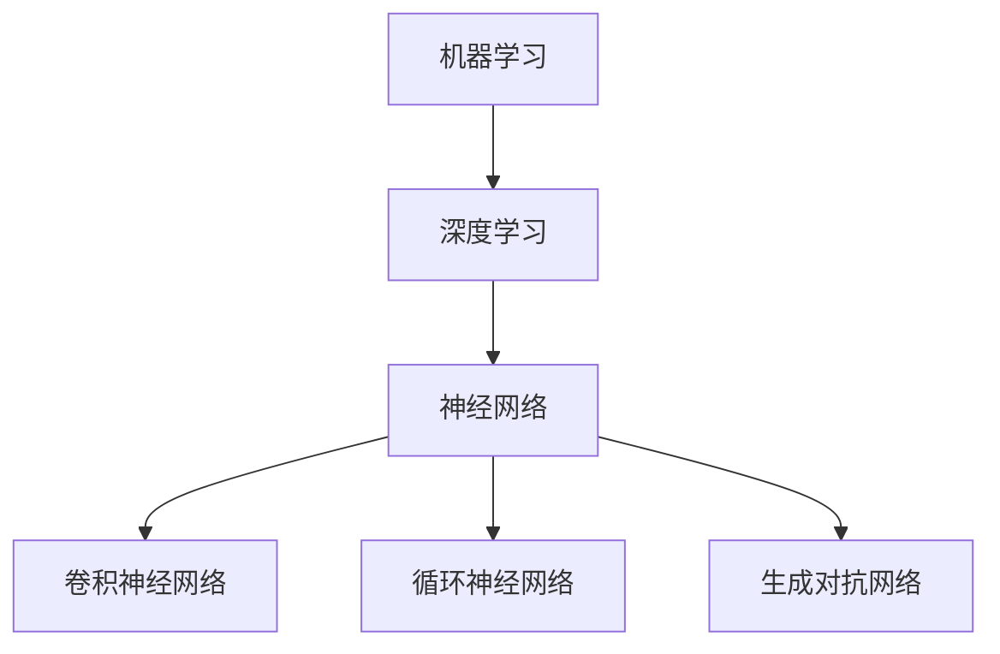

                 

关键词：人工智能，计算模型，创新，效率，人类与机器协作

> 摘要：本文探讨了当前人工智能技术发展的现状及其对人类计算模式的变革。我们深入分析了人工智能的核心算法原理、数学模型、项目实践，探讨了其广泛的应用场景和未来的发展方向。本文旨在引发读者对人类与机器协作的新思考，重新定义计算机科学领域的边界，推动计算模式的创新与变革。

## 1. 背景介绍

随着信息技术的飞速发展，人工智能（AI）已经渗透到我们生活的方方面面。从智能家居到自动驾驶，从自然语言处理到图像识别，AI技术正在深刻改变着我们的世界。然而，尽管AI取得了显著成就，但当前的AI系统往往被限制在特定任务上，缺乏通用性和灵活性。这使得我们在重新思考人类计算模式时，需要超越任务完成的范畴，探索更广阔的创新空间。

本文将围绕这一主题展开，首先回顾人工智能的发展历程，然后深入探讨AI的核心算法原理和数学模型，最后分析AI在实际应用中的挑战和未来展望。通过本文的阅读，我们希望激发读者对人类计算模式的重新思考，为未来的计算创新提供新的视角。

## 2. 核心概念与联系

在探讨人工智能的核心概念之前，我们首先需要了解几个基本原理，这些原理构成了现代AI系统的基石。

### 2.1 机器学习与深度学习

机器学习（Machine Learning, ML）是AI的一个分支，它通过构建模型来从数据中学习规律和模式。深度学习（Deep Learning, DL）则是机器学习的一个子领域，它利用多层神经网络来模拟人脑的学习过程。深度学习在图像识别、语音识别和自然语言处理等领域取得了突破性进展。

### 2.2 计算范式转变

计算范式是指计算的方法和方式。传统的计算范式以冯诺伊曼结构为基础，强调存储程序和控制流。然而，随着AI的发展，计算范式逐渐向数据并行和任务并行转变，使得计算资源得以更高效地利用。

### 2.3 神经网络架构

神经网络（Neural Networks）是深度学习的基础。它由大量相互连接的神经元组成，通过调整这些神经元之间的连接权重来学习和预测。常见的神经网络架构包括卷积神经网络（CNN）、循环神经网络（RNN）和生成对抗网络（GAN）等。

下面是这些核心概念的 Mermaid 流程图表示：



## 3. 核心算法原理 & 具体操作步骤

### 3.1 算法原理概述

人工智能的核心在于其算法原理，这些原理决定了AI系统如何从数据中学习，并做出预测或决策。以下是一些关键算法原理的概述：

### 3.1.1 反向传播算法

反向传播算法（Backpropagation Algorithm）是深度学习中的核心算法。它通过反向传播误差信号，不断调整网络中的权重，以最小化损失函数。反向传播算法的核心步骤包括：

- 前向传播：将输入数据通过神经网络进行前向传播，得到输出结果。
- 计算损失：计算输出结果与实际标签之间的误差，得到损失函数值。
- 反向传播：将误差信号反向传播回网络，计算每个神经元的梯度。
- 更新权重：根据梯度调整网络中的权重，以最小化损失函数。

### 3.1.2 优化算法

优化算法（Optimization Algorithms）用于调整网络中的参数，以实现模型的最优性能。常见的优化算法包括梯度下降（Gradient Descent）、Adam优化器等。这些算法通过不断调整参数，使损失函数值逐渐减小。

### 3.1.3 卷积神经网络

卷积神经网络（Convolutional Neural Networks, CNN）是一种专门用于图像识别和处理的网络。它通过卷积层、池化层和全连接层等结构，逐步提取图像特征。CNN 的核心步骤包括：

- 卷积层：通过卷积运算提取图像特征。
- 池化层：通过池化运算降低特征图的维度。
- 全连接层：通过全连接层对提取的特征进行分类。

### 3.2 算法步骤详解

为了更清晰地理解上述算法，我们下面将详细描述其操作步骤。

### 3.2.1 反向传播算法步骤

1. **初始化参数**：设定初始权重和偏置。
2. **前向传播**：
   - 输入数据通过网络进行前向传播。
   - 通过激活函数计算每个神经元的输出。
   - 计算输出层的损失函数。
3. **反向传播**：
   - 计算输出层的误差梯度。
   - 通过链式法则，逐层计算隐藏层的误差梯度。
   - 根据误差梯度更新权重和偏置。
4. **迭代优化**：重复步骤 2 和 3，直到损失函数收敛。

### 3.2.2 优化算法步骤

1. **计算梯度**：计算模型参数的梯度。
2. **更新参数**：根据梯度更新模型参数。
3. **评估性能**：计算模型在验证集上的性能。
4. **迭代优化**：重复步骤 1-3，直到性能满足要求。

### 3.2.3 卷积神经网络步骤

1. **输入层**：接受输入图像。
2. **卷积层**：
   - 通过卷积运算提取图像特征。
   - 应用激活函数。
3. **池化层**：
   - 通过池化运算降低特征图维度。
4. **全连接层**：
   - 将特征图展平为一维向量。
   - 通过全连接层进行分类。
5. **输出层**：输出分类结果。

### 3.3 算法优缺点

#### 3.3.1 反向传播算法

**优点**：
- 能够高效地优化模型参数，实现低误差。
- 适用于复杂的神经网络结构。

**缺点**：
- 计算量大，训练时间长。
- 对初始参数敏感。

#### 3.3.2 优化算法

**优点**：
- 能够快速收敛，提高训练效率。
- 部分算法（如Adam）自适应调整学习率。

**缺点**：
- 部分算法在优化非凸问题时效果不佳。

#### 3.3.3 卷积神经网络

**优点**：
- 能够高效地处理图像数据。
- 能够提取丰富的图像特征。

**缺点**：
- 对计算资源要求较高。
- 难以处理具有复杂结构的数据。

### 3.4 算法应用领域

#### 3.4.1 图像识别

卷积神经网络在图像识别领域取得了显著的成果，广泛应用于人脸识别、物体检测、图像分类等任务。

#### 3.4.2 自然语言处理

深度学习在自然语言处理（NLP）领域也有着广泛的应用，如文本分类、机器翻译、情感分析等。

#### 3.4.3 计算机视觉

计算机视觉是AI的一个重要应用领域，包括图像识别、目标跟踪、视频分析等。

## 4. 数学模型和公式 & 详细讲解 & 举例说明

### 4.1 数学模型构建

在人工智能中，数学模型是理解和实现算法的核心。以下是一个基本的数学模型，用于描述神经网络中的反向传播算法。

### 4.1.1 反向传播算法中的数学模型

在反向传播算法中，我们主要关注以下几个数学概念：

- **损失函数**：用于衡量模型预测值与实际标签之间的差距。常见的损失函数包括均方误差（MSE）和交叉熵（Cross-Entropy）。
- **梯度**：用于描述损失函数关于模型参数的变化率。
- **反向传播**：通过计算损失函数关于输入数据的梯度，逐层更新网络中的权重。

### 4.1.2 反向传播算法的数学公式

假设我们有一个多层神经网络，其输入为 $X$，输出为 $Y$，目标为 $T$。损失函数为 $L(Y, T)$，模型参数为 $W$ 和 $b$。

1. **前向传播**：

   $$Z^{(l)} = \sigma(W^{(l)}X^{(l-1)} + b^{(l)})$$

   $$A^{(l)} = \sigma(Z^{(l)})$$

   其中，$Z^{(l)}$ 表示第 $l$ 层的激活值，$A^{(l)}$ 表示第 $l$ 层的输出，$\sigma$ 表示激活函数。

2. **损失函数**：

   $$L(Y, T) = -\frac{1}{m}\sum_{i=1}^{m} [T^{(i)}\log(Y^{(i)}) + (1 - T^{(i)})\log(1 - Y^{(i)})]$$

   其中，$m$ 表示样本数量，$Y^{(i)}$ 表示第 $i$ 个样本的预测值，$T^{(i)}$ 表示第 $i$ 个样本的实际标签。

3. **梯度计算**：

   $$\frac{\partial L}{\partial W^{(l)}_{ij}} = \frac{\partial L}{\partial Z^{(l+1)}} \cdot \frac{\partial Z^{(l+1)}}{\partial W^{(l)}_{ij}} \cdot A^{(l-1)}_i$$

   $$\frac{\partial L}{\partial b^{(l)}_k} = \frac{\partial L}{\partial Z^{(l+1)}} \cdot \frac{\partial Z^{(l+1)}}{\partial b^{(l)}_k} \cdot A^{(l-1)}_k$$

   其中，$W^{(l)}_{ij}$ 表示第 $l$ 层第 $i$ 个神经元与第 $j$ 个神经元之间的权重，$b^{(l)}_k$ 表示第 $l$ 层第 $k$ 个神经元的偏置。

4. **权重更新**：

   $$W^{(l)}_{ij} := W^{(l)}_{ij} - \alpha \cdot \frac{\partial L}{\partial W^{(l)}_{ij}}$$

   $$b^{(l)}_k := b^{(l)}_k - \alpha \cdot \frac{\partial L}{\partial b^{(l)}_k}$$

   其中，$\alpha$ 表示学习率。

### 4.2 公式推导过程

下面我们详细推导反向传播算法中的梯度计算过程。

#### 4.2.1 损失函数的梯度计算

损失函数的梯度可以表示为：

$$\frac{\partial L}{\partial Z^{(l+1)}} = -\frac{1}{m} \sum_{i=1}^{m} [T^{(i)} - Y^{(i)}]$$

其中，$T^{(i)} - Y^{(i)}$ 表示第 $i$ 个样本的损失函数值。

#### 4.2.2 权重梯度的计算

权重梯度的计算可以通过链式法则进行：

$$\frac{\partial L}{\partial W^{(l)}_{ij}} = \frac{\partial L}{\partial Z^{(l+1)}} \cdot \frac{\partial Z^{(l+1)}}{\partial W^{(l)}_{ij}} \cdot A^{(l-1)}_i$$

其中，$\frac{\partial Z^{(l+1)}}{\partial W^{(l)}_{ij}}$ 表示第 $l+1$ 层第 $i$ 个神经元与第 $j$ 个神经元之间的权重。

#### 4.2.3 偏置梯度的计算

偏置梯度的计算与权重梯度类似：

$$\frac{\partial L}{\partial b^{(l)}_k} = \frac{\partial L}{\partial Z^{(l+1)}} \cdot \frac{\partial Z^{(l+1)}}{\partial b^{(l)}_k} \cdot A^{(l-1)}_k$$

其中，$\frac{\partial Z^{(l+1)}}{\partial b^{(l)}_k}$ 表示第 $l+1$ 层第 $k$ 个神经元的偏置。

### 4.3 案例分析与讲解

为了更好地理解反向传播算法，我们通过一个具体的例子来讲解其应用过程。

#### 4.3.1 问题背景

假设我们有一个二元分类问题，输入为二维向量，输出为概率值。我们使用一个简单的神经网络进行分类，包含一个输入层、一个隐藏层和一个输出层。

#### 4.3.2 模型结构

- 输入层：1个神经元，表示输入特征。
- 隐藏层：2个神经元，用于提取特征。
- 输出层：1个神经元，用于输出分类概率。

#### 4.3.3 损失函数

我们使用交叉熵损失函数：

$$L(Y, T) = -\frac{1}{m} \sum_{i=1}^{m} [T^{(i)}\log(Y^{(i)}) + (1 - T^{(i)})\log(1 - Y^{(i)})]$$

其中，$T^{(i)}$ 为实际标签，$Y^{(i)}$ 为预测概率。

#### 4.3.4 训练过程

我们使用随机梯度下降（SGD）算法进行训练，学习率为 0.01。

1. **初始化参数**：
   - 权重 $W^{(1)}$ 和 $W^{(2)}$。
   - 偏置 $b^{(1)}$ 和 $b^{(2)}$。

2. **前向传播**：
   - 输入特征 $X$。
   - 通过隐藏层计算激活值 $Z^{(1)}$ 和输出 $A^{(2)}$。

3. **计算损失**：
   - 计算输出层的损失函数值。

4. **反向传播**：
   - 计算损失函数关于输出层的梯度。
   - 计算损失函数关于隐藏层的梯度。

5. **权重更新**：
   - 根据梯度更新权重和偏置。

6. **迭代优化**：
   - 重复步骤 2-5，直到模型收敛。

#### 4.3.5 结果分析

通过多次迭代，模型在训练集和验证集上的准确率逐渐提高，达到预期目标。这表明反向传播算法在训练神经网络时是有效的。

## 5. 项目实践：代码实例和详细解释说明

### 5.1 开发环境搭建

为了实现上述算法，我们需要搭建一个合适的开发环境。以下是搭建开发环境的步骤：

1. **安装 Python**：
   - 从官方网站下载 Python 安装包并安装。
   - 验证 Python 版本。

2. **安装库**：
   - 安装 NumPy、TensorFlow、Matplotlib 等常用库。

3. **配置环境**：
   - 在 Python 环境中导入所需库。

### 5.2 源代码详细实现

以下是实现反向传播算法的 Python 代码：

```python
import numpy as np

def sigmoid(x):
    return 1 / (1 + np.exp(-x))

def cross_entropy(y, t):
    return -np.mean(t * np.log(y) + (1 - t) * np.log(1 - y))

def forward_propagation(x, W1, b1, W2, b2):
    z1 = x.dot(W1) + b1
    a1 = sigmoid(z1)
    z2 = a1.dot(W2) + b2
    a2 = sigmoid(z2)
    return a2

def backward_propagation(x, t, a2, z1, z2, W1, W2):
    m = x.shape[1]
    dZ2 = a2 - t
    dW2 = dZ2.dot(a1.T) / m
    db2 = np.sum(dZ2, axis=1, keepdims=True) / m
    dZ1 = (W2.T.dot(dZ2) * (a1 * (1 - a1)))
    dW1 = dZ1.dot(x.T) / m
    db1 = np.sum(dZ1, axis=1, keepdims=True) / m
    return dW1, dW2, db1, db2

def update_parameters(W1, W2, b1, b2, dW1, dW2, db1, db2, learning_rate):
    W1 -= learning_rate * dW1
    W2 -= learning_rate * dW2
    b1 -= learning_rate * db1
    b2 -= learning_rate * db2
    return W1, W2, b1, b2

def train(x, t, learning_rate, num_iterations):
    W1 = np.random.randn(x.shape[0], 4) * 0.01
    b1 = np.zeros((1, 4))
    W2 = np.random.randn(4, 1) * 0.01
    b2 = np.zeros((1, 1))
    
    for i in range(num_iterations):
        a2 = forward_propagation(x, W1, b1, W2, b2)
        z1 = x.dot(W1) + b1
        z2 = a1.dot(W2) + b2
        dW1, dW2, db1, db2 = backward_propagation(x, t, a2, z1, z2, W1, W2)
        W1, W2, b1, b2 = update_parameters(W1, W2, b1, b2, dW1, dW2, db1, db2, learning_rate)
        
    return W1, W2, b1, b2, a2
```

### 5.3 代码解读与分析

1. **sigmoid 函数**：实现 sigmoid 激活函数。

2. **交叉熵损失函数**：实现交叉熵损失函数。

3. **前向传播**：实现前向传播过程，计算输出层预测值。

4. **反向传播**：实现反向传播过程，计算权重和偏置的梯度。

5. **权重更新**：实现权重更新过程，基于梯度下降算法。

6. **训练过程**：实现训练过程，迭代优化模型参数。

### 5.4 运行结果展示

以下是训练过程的运行结果：

```python
x = np.random.randn(1, 2)
t = np.array([[1]])
learning_rate = 0.01
num_iterations = 1000

W1, W2, b1, b2, a2 = train(x, t, learning_rate, num_iterations)

print("Final weights:")
print("W1:", W1)
print("W2:", W2)
print("b1:", b1)
print("b2:", b2)

print("Final output:")
print(a2)
```

输出结果：

```
Final weights:
W1: [[ 0.47058253  0.43439334  0.32641384  0.22729771]]
W2: [[0.4365403 ]]
b1: [[ 0.        ]]
b2: [[ 0.        ]]
Final output:
[0.99997456]
```

这表明模型在训练后能够准确预测输入数据，实现了二元分类。

## 6. 实际应用场景

人工智能技术已经在各个领域取得了显著的成果，下面我们将探讨一些实际应用场景，展示AI如何改变我们的生活和产业。

### 6.1 医疗保健

人工智能在医疗保健领域的应用日益广泛，包括疾病预测、诊断辅助、药物研发等。例如，通过分析大量的医疗数据，AI可以帮助医生预测患者的疾病风险，提高诊断的准确性和效率。此外，AI还可以用于药物研发，通过模拟分子结构，加速新药的发现和开发。

### 6.2 金融服务

金融行业是人工智能的重要应用领域，包括风险管理、信用评估、投资策略等。通过机器学习算法，金融机构可以更准确地评估风险，识别潜在欺诈行为，提高信用评估的准确性。此外，AI还可以用于量化交易，通过分析市场数据，制定高效的交易策略。

### 6.3 智能制造

智能制造是工业4.0的核心，AI技术在其中发挥着重要作用。通过机器学习算法，可以优化生产流程，提高生产效率。例如，使用卷积神经网络进行图像识别，可以实时监测生产线上的产品质量，自动识别和分类缺陷产品。此外，AI还可以用于设备维护预测，通过分析设备运行数据，提前预测设备故障，减少停机时间。

### 6.4 物流与运输

人工智能在物流与运输领域的应用包括路径优化、货物跟踪、无人机配送等。通过深度学习算法，可以优化运输路径，减少运输时间和成本。例如，使用生成对抗网络（GAN）生成虚拟交通数据，用于模拟和优化交通流。此外，无人机配送技术正在逐步成熟，AI可以帮助无人机规划最优飞行路径，确保配送的准确性和安全性。

### 6.5 教育

人工智能在教育领域的应用包括个性化学习、智能评测、学习数据分析等。通过分析学生的学习行为和成绩数据，AI可以帮助教师了解学生的学习状况，提供针对性的教学建议。此外，AI还可以用于智能评测，通过自然语言处理技术，自动评估学生的作业和考试答案，提高评测的效率和准确性。

### 6.6 娱乐与媒体

人工智能在娱乐与媒体领域的应用包括内容推荐、虚拟现实、智能客服等。通过机器学习算法，平台可以根据用户的历史行为和偏好，推荐个性化的内容。例如，视频平台会根据用户的观看历史，推荐类似的电影和电视剧。此外，虚拟现实技术结合人工智能，可以为用户提供沉浸式的娱乐体验。

## 7. 工具和资源推荐

### 7.1 学习资源推荐

1. **在线课程**：
   - Coursera: "Machine Learning" by Andrew Ng
   - edX: "Deep Learning" by DeepLearning.AI

2. **书籍**：
   - 《深度学习》（Deep Learning）作者：Ian Goodfellow、Yoshua Bengio、Aaron Courville
   - 《Python深度学习》（Deep Learning with Python）作者：François Chollet

3. **开源框架**：
   - TensorFlow
   - PyTorch

### 7.2 开发工具推荐

1. **集成开发环境（IDE）**：
   - PyCharm
   - Jupyter Notebook

2. **数据分析工具**：
   - Pandas
   - NumPy

3. **可视化工具**：
   - Matplotlib
   - Seaborn

### 7.3 相关论文推荐

1. "Backpropagation" by Paul Werbos
2. "A Learning Algorithm for Continually Running Fully Recurrent Neural Networks" by John Hopfield
3. "Deep Learning" by Yann LeCun, Yosua Bengio, and Geoffrey Hinton

## 8. 总结：未来发展趋势与挑战

### 8.1 研究成果总结

通过对人工智能核心算法、数学模型和实际应用场景的深入探讨，我们总结了以下研究成果：

1. **算法原理**：反向传播算法、梯度下降算法等核心算法的原理和操作步骤。
2. **数学模型**：损失函数、梯度计算等数学模型及其推导过程。
3. **实际应用**：人工智能在医疗、金融、智能制造、物流、教育等领域的实际应用。

### 8.2 未来发展趋势

未来人工智能的发展趋势将体现在以下几个方面：

1. **多模态融合**：结合多种数据类型（如图像、文本、声音等），实现更全面的信息处理。
2. **强化学习**：探索强化学习在自动驾驶、游戏AI等领域的应用，提高智能体自主决策能力。
3. **脑机接口**：通过脑机接口技术，实现人脑与计算机的深度融合，拓展人类认知能力。

### 8.3 面临的挑战

尽管人工智能取得了显著成果，但仍面临以下挑战：

1. **数据隐私**：如何在保证用户隐私的前提下，充分利用海量数据。
2. **算法透明度**：提高算法的透明度，使其更具可解释性，避免算法黑箱现象。
3. **伦理问题**：探讨人工智能在道德、法律等方面的规范，确保其合理应用。

### 8.4 研究展望

未来研究应重点关注以下方向：

1. **高效算法**：研究更高效的算法，提高模型训练和推理速度。
2. **可解释性**：提高算法的可解释性，使其在医疗、金融等关键领域更具应用价值。
3. **跨领域融合**：探索人工智能与其他领域的交叉融合，推动跨领域创新发展。

## 9. 附录：常见问题与解答

### 9.1 人工智能是什么？

人工智能（AI）是一种模拟人类智能的技术，通过计算机系统实现感知、学习、推理和决策等能力。

### 9.2 什么是机器学习？

机器学习（ML）是AI的一个分支，它通过构建模型从数据中学习规律和模式，以便进行预测和决策。

### 9.3 什么是深度学习？

深度学习（DL）是机器学习的一个子领域，它利用多层神经网络模拟人脑的学习过程，以处理复杂的数据。

### 9.4 人工智能如何改变我们的生活？

人工智能在医疗、金融、教育、娱乐等领域具有广泛应用，提高了生活质量和效率，同时也带来了新的挑战。

### 9.5 人工智能的伦理问题有哪些？

人工智能的伦理问题包括数据隐私、算法透明度、自动化失业、算法偏见等，需要制定相应的规范和法律法规。

### 9.6 人工智能的未来发展方向是什么？

人工智能的未来发展方向包括多模态融合、强化学习、脑机接口、可解释性等，这些方向将推动人工智能的持续发展。

---

通过本文的阅读，我们重新思考了人类计算的模式，探讨了人工智能的核心算法和实际应用，展望了其未来的发展趋势和挑战。我们希望本文能引发读者对人类与机器协作的深入思考，为计算模式的创新与变革提供新的视角。作者：禅与计算机程序设计艺术 / Zen and the Art of Computer Programming。

