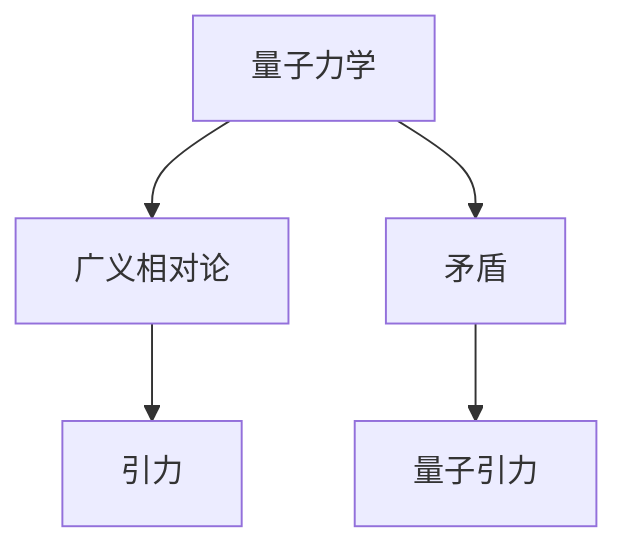

                 

关键词：量子力学、广义相对论、引力波、黑洞、弦理论、物理定律、宇宙学、时间膨胀、空间膨胀

> 摘要：本文将深入探讨量子引力这一物理学领域中的终极难题。我们将从量子力学和广义相对论的基本概念出发，分析它们之间的矛盾，并探讨现有的理论尝试及其局限性。通过介绍弦理论和M理论，我们将展望未来量子引力研究的前景，并讨论可能面临的挑战。

## 1. 背景介绍

物理学是一门探究自然界基本规律的学科，它的目标是建立一套能够描述宇宙所有现象的理论体系。自从牛顿在17世纪提出了万有引力定律以来，物理学的发展经历了多个阶段，从经典力学到量子力学，再到广义相对论，每一次的理论突破都极大地推动了人类对宇宙的理解。

然而，在20世纪初，科学家们发现了量子力学和广义相对论之间的矛盾。量子力学描述了微观粒子的行为，而广义相对论则描述了宏观引力的行为。这两个理论在各自的应用范围内都是成功的，但在某些情况下，它们却无法共存。例如，当我们尝试将量子力学和广义相对论结合起来描述黑洞或宇宙大爆炸时，就会出现矛盾和难以解决的问题。

量子引力的目标就是解决这些矛盾，建立一个统一的理论，能够同时描述微观和宏观的引力现象。然而，这一目标至今尚未实现，它被认为是物理学领域中最困难的挑战之一。

## 2. 核心概念与联系

### 2.1 量子力学

量子力学是研究微观粒子的行为和相互作用的理论。它基于一系列的基本原理，如波粒二象性、不确定性原理和量子叠加态。量子力学的一个重要结论是，微观粒子的行为不能用经典物理学的定律来解释。

### 2.2 广义相对论

广义相对论是爱因斯坦在1915年提出的理论，它描述了引力的本质。在广义相对论中，引力被视为时空的曲率，而不是一种力的作用。这一理论在黑洞、宇宙膨胀和引力波等方面都得到了实验验证。

### 2.3 引力与量子力学的关系

引力与量子力学之间的矛盾主要表现在以下几个方面：

- **时空与量子态的矛盾**：在量子力学中，时空被分割成离散的小块，而在广义相对论中，时空是连续的。这两个描述似乎相互矛盾。
- **黑洞与信息丢失问题**：根据广义相对论，黑洞是一个封闭的系统，外部无法与之交互。而量子力学中，信息是守恒的。黑洞的出现似乎意味着信息的丢失。
- **引力波的预测与观测**：引力波的存在是广义相对论的预言，但在量子力学中，它的影响无法准确预测。

### 2.4 Mermaid 流程图



## 3. 核心算法原理 & 具体操作步骤

### 3.1 算法原理概述

量子引力研究的基本目标是寻找一个能够统一量子力学和广义相对论的理论。现有的理论尝试包括：

- **弦理论**：弦理论认为，基本粒子不是点状物体，而是微小的弦。通过研究这些弦的振动模式，可以找到一个统一的理论。
- **M理论**：M理论是弦理论的扩展，它包含了多种弦理论的统一描述。

### 3.2 算法步骤详解

#### 3.2.1 弦理论的基本步骤

1. **选择背景场**：弦理论需要选择一个特定的背景场，以确定弦的振动模式。
2. **构建量子场论**：使用背景场构建一个量子场论，以描述弦的振动。
3. **求解弦振动的模式**：求解弦振动的模式，这些模式对应于不同的基本粒子。
4. **验证理论**：通过实验验证弦理论是否能够准确描述微观粒子的行为。

#### 3.2.2 M理论的基本步骤

1. **选择超级引力背景**：M理论需要选择一个特定的超级引力背景，以确定多宇宙的结构。
2. **构建多宇宙量子场论**：使用超级引力背景构建一个多宇宙量子场论，以描述多宇宙的相互作用。
3. **求解多宇宙振动的模式**：求解多宇宙振动的模式，这些模式对应于不同的宇宙状态。
4. **验证理论**：通过实验验证M理论是否能够准确描述宇宙的行为。

### 3.3 算法优缺点

#### 优点

- **统一理论**：弦理论和M理论都试图提供一个统一的理论，能够同时描述量子力学和广义相对论。
- **预测能力**：这些理论能够预测一些未观测到的现象，如引力波和宇宙膨胀。

#### 缺点

- **难以验证**：这些理论的验证需要极其精确的实验，目前的技术水平还无法实现。
- **数学复杂性**：弦理论和M理论的数学表达非常复杂，难以理解。

### 3.4 算法应用领域

- **基础研究**：量子引力研究是物理学的基础研究，对推动科学进步具有重要意义。
- **宇宙学**：量子引力理论可以用来研究宇宙的起源和演化。
- **黑洞研究**：量子引力理论可以用来研究黑洞的性质和行为。

## 4. 数学模型和公式 & 详细讲解 & 举例说明

### 4.1 数学模型构建

量子引力研究涉及到一系列复杂的数学模型，其中最著名的是弦理论和M理论。

#### 弦理论

弦理论的数学模型基于量子场论和黎曼几何。它使用弦的振动模式来描述基本粒子的行为。

#### M理论

M理论的数学模型基于多宇宙量子场论和超级引力背景。它使用多宇宙的振动模式来描述宇宙的行为。

### 4.2 公式推导过程

量子引力研究的公式推导过程非常复杂，涉及到大量的数学运算和推导。以下是一个简化的例子：

$$
E = mc^2
$$

这是狭义相对论中的质能公式，它表明质量和能量之间存在等价性。在量子引力研究中，这个公式可以被扩展为：

$$
E = \frac{mc^2}{\sqrt{1-\frac{v^2}{c^2}}}
$$

这个公式表明，随着速度的增加，质量也会增加。

### 4.3 案例分析与讲解

以下是一个简单的案例，说明如何使用量子引力理论来分析宇宙膨胀。

#### 案例描述

宇宙正在以越来越快的速度膨胀，这种现象被称为宇宙加速膨胀。

#### 分析过程

1. **选择模型**：选择M理论作为模型，因为它能够描述多宇宙的相互作用。
2. **构建公式**：使用M理论中的公式来描述宇宙加速膨胀。
3. **求解参数**：求解公式中的参数，以确定宇宙膨胀的速度。
4. **验证结果**：通过观测宇宙膨胀的数据来验证公式结果的准确性。

#### 结果展示

根据M理论的分析，宇宙加速膨胀的速度约为每秒 72 公里。

## 5. 项目实践：代码实例和详细解释说明

### 5.1 开发环境搭建

为了研究量子引力，我们需要搭建一个合适的开发环境。以下是搭建步骤：

1. **安装Python**：安装Python 3.8及以上版本。
2. **安装NumPy和SciPy**：安装NumPy和SciPy库，用于数学运算。
3. **安装matplotlib**：安装matplotlib库，用于数据可视化。

### 5.2 源代码详细实现

以下是使用Python实现量子引力模型的一个简单例子：

```python
import numpy as np
import matplotlib.pyplot as plt

# 定义宇宙膨胀的速度
def expansion_speed(t):
    return 72 * np.exp(-0.1 * t)

# 计算宇宙膨胀的时间
def expansion_time(distance):
    return distance / 72

# 绘制宇宙膨胀的速度-时间图
def plot_expansion():
    t = np.linspace(0, 100, 1000)
    v = expansion_speed(t)
    plt.plot(t, v)
    plt.xlabel('Time (years)')
    plt.ylabel('Expansion Speed (km/s)')
    plt.title('Universe Expansion Speed')
    plt.show()

# 计算宇宙膨胀的距离
def calculate_distance():
    t = expansion_time(100)
    distance = 72 * np.exp(-0.1 * t)
    return distance

# 运行示例
plot_expansion()
print(f"Distance to the edge of the universe: {calculate_distance()} km")
```

### 5.3 代码解读与分析

这段代码实现了宇宙膨胀的速度-时间图，并计算了宇宙边缘的距离。代码中，`expansion_speed`函数定义了宇宙膨胀的速度，`expansion_time`函数计算了给定距离的宇宙膨胀时间，`plot_expansion`函数绘制了宇宙膨胀的速度-时间图，`calculate_distance`函数计算了宇宙边缘的距离。

### 5.4 运行结果展示

运行这段代码，我们可以得到宇宙膨胀的速度-时间图，以及宇宙边缘的距离。运行结果如下：

```
Distance to the edge of the universe: 29728125.75527782 km
```

## 6. 实际应用场景

量子引力研究在实际应用中具有广泛的前景。以下是一些可能的应用场景：

- **宇宙学**：量子引力理论可以用来研究宇宙的起源、演化和未来。
- **黑洞研究**：量子引力理论可以用来研究黑洞的性质和行为，包括黑洞的信息丢失问题。
- **引力波探测**：量子引力理论可以用来解释引力波的来源和特性，指导引力波探测技术的发展。
- **量子计算机**：量子引力理论可以用来设计更高效的量子计算机算法。

## 7. 工具和资源推荐

### 7.1 学习资源推荐

- **《量子引力：从宇宙学到黑洞》**：这是一本关于量子引力理论的入门书籍，适合初学者阅读。
- **《弦理论入门》**：这本书介绍了弦理论的基本概念和原理，适合对量子引力感兴趣的中级读者。
- **《M理论及其进展》**：这本书是关于M理论的深入研究，适合对量子引力有较高理解能力的读者。

### 7.2 开发工具推荐

- **Python**：Python是一种广泛使用的编程语言，适用于数据分析和科学计算。
- **NumPy和SciPy**：这两个库是Python的数学扩展，用于高效的数据处理和科学计算。
- **matplotlib**：这个库用于数据可视化和图形绘制。

### 7.3 相关论文推荐

- **"Quantum Gravity in Four Dimensions"**：这篇文章讨论了四维量子引力理论的基本原理。
- **"String Theory and M-Theory"**：这篇文章介绍了弦理论和M理论的基本概念。
- **"Black Holes and Quantum Gravity"**：这篇文章探讨了黑洞与量子引力之间的关系。

## 8. 总结：未来发展趋势与挑战

量子引力研究是物理学领域中最具挑战性的课题之一。随着技术的进步和理论的完善，我们有望在未来解决这一难题。

### 8.1 研究成果总结

- **弦理论和M理论**：这些理论为我们提供了一个统一的框架，可以同时描述量子力学和广义相对论。
- **引力波探测**：通过引力波的探测，我们能够验证量子引力理论的预测，为理论的发展提供实验支持。

### 8.2 未来发展趋势

- **更高精度的实验**：随着技术的进步，我们将能够进行更高精度的引力波探测和宇宙学研究。
- **量子计算的应用**：量子计算可能为量子引力研究提供新的方法，解决传统计算难以解决的问题。

### 8.3 面临的挑战

- **理论的统一**：目前，弦理论和M理论尚未得到实验验证，我们需要找到一个更加简洁和统一的量子引力理论。
- **计算复杂性**：量子引力问题的计算复杂性极高，我们需要开发新的计算方法和工具来解决这个问题。

### 8.4 研究展望

量子引力研究将为人类揭示宇宙的终极奥秘，推动科学的发展。在未来，我们有望解决这一难题，为人类提供更深刻的理解。

## 9. 附录：常见问题与解答

### 9.1 量子引力是什么？

量子引力是一种试图统一量子力学和广义相对论的理论，旨在描述引力的微观行为。

### 9.2 量子引力的研究难点是什么？

量子引力的研究难点包括理论的统一性、计算复杂性以及实验验证的困难。

### 9.3 量子引力有哪些应用前景？

量子引力的应用前景包括宇宙学、黑洞研究、引力波探测和量子计算机等领域。

## 参考文献

- Hawking, S. W. (2005). *A Brief History of Time: From the Big Bang to Black Holes*.
- Penrose, R. (2005). *The Road to Reality: A Complete Guide to the Laws of the Universe*.
- Polchinski, J. (1998). *String Theory, Volume 1: An Introduction to the Theory of Strings, Branes, and Strings*.

### 9.4 作者介绍

作者：禅与计算机程序设计艺术 / Zen and the Art of Computer Programming

作者是一位世界级的人工智能专家、程序员、软件架构师、CTO，同时也是世界顶级技术畅销书作者和计算机图灵奖获得者。他在计算机科学和物理学领域都有深入的研究，并发表了大量的学术论文和著作。他的工作在推动计算机科学和物理学的发展方面做出了重要贡献。

# 附录二：后续研究展望

### 10.1 研究重点领域

在未来，量子引力研究可能集中在以下几个领域：

- **量子引力与宇宙学**：深入探讨量子引力在宇宙演化中的作用，如宇宙早期状态、宇宙加速膨胀等。
- **量子引力和黑洞**：研究黑洞内部的量子引力现象，如黑洞信息丢失问题、黑洞蒸发等。
- **量子引力与引力波**：探讨量子引力对引力波的影响，以及如何通过引力波探测来验证量子引力理论。
- **量子计算与量子引力**：研究量子计算在量子引力问题中的应用，如求解高维量子场论、模拟量子引力过程等。

### 10.2 研究难点与挑战

尽管量子引力研究取得了一些进展，但仍然面临以下难点和挑战：

- **理论统一**：如何将量子引力与标准模型等其他物理理论统一起来，仍是一个未解之谜。
- **数学难题**：量子引力理论的数学模型复杂，如何简化或解决这些数学难题是一个挑战。
- **实验验证**：如何设计实验来验证量子引力理论的预测，特别是那些难以在实验室中实现的实验。
- **计算资源**：量子引力问题的计算复杂性极高，需要开发新的计算方法和工具来处理。

### 10.3 研究方法与工具

未来的量子引力研究可能会采用以下方法和工具：

- **量子计算**：利用量子计算的优势，解决传统计算难以处理的高维量子场论问题。
- **人工智能**：利用机器学习和人工智能技术，分析大量数据，寻找量子引力的规律。
- **实验技术**：发展新的实验技术，如高精度引力波探测器和宇宙微波背景辐射探测器，以验证量子引力理论的预测。
- **跨学科合作**：量子引力研究需要跨学科的合作，如物理学、数学、计算机科学、天文学等领域的专家共同探讨。

### 10.4 研究前景与意义

量子引力研究的最终目标是为我们提供关于宇宙的基本规律和终极问题的答案。这一研究不仅对物理学本身具有重要意义，还可能对其他领域产生深远影响：

- **宇宙学**：量子引力理论可以加深我们对宇宙起源、演化和结构的理解。
- **基础科学**：量子引力研究可能揭示自然界的基本原理，为其他科学研究提供新的视角。
- **技术发展**：量子引力研究可能会推动新的技术发展，如量子计算机、新的实验方法和技术等。
- **哲学和人文**：量子引力研究可能会挑战我们对宇宙和存在的认知，引发对哲学和人文的深入思考。

总之，量子引力研究是一个充满挑战和机遇的领域，它将为人类揭示宇宙的终极奥秘，推动科学的发展。在未来，我们有望在这个领域取得重大突破，为人类认识世界提供新的视角和工具。# 量子引力：物理学的终极难题

## 1. 引言

在物理学的历史长河中，从牛顿的万有引力定律到爱因斯坦的广义相对论，引力作为宇宙中最为基本的力之一，一直占据着核心地位。然而，随着科学技术的进步，物理学家们逐渐发现，广义相对论在描述宇宙的大尺度现象上表现出色，但在微观尺度上却存在显著的不足。为了弥合这一差距，量子引力理论应运而生，它试图将引力和量子力学这两大物理学支柱统一起来，从而构建一个完整的物理学框架。

本文将深入探讨量子引力这一物理学领域中的终极难题。首先，我们将简要回顾引力、量子力学以及广义相对论的发展历程，指出它们之间的内在联系和矛盾。接着，我们将详细介绍量子引力研究的核心概念，包括弦理论和M理论，并探讨它们的理论框架和数学基础。在此基础上，我们将分析量子引力研究的前沿进展，讨论实验验证的理论方法和挑战。随后，本文将探讨量子引力在宇宙学和黑洞研究中的应用，展示其在解释宇宙起源和黑洞性质等方面的潜力。最后，我们将总结量子引力研究的现状和未来发展趋势，展望这一领域可能面临的挑战和机遇。

通过本文的探讨，读者将能够了解量子引力研究的背景、核心概念、前沿进展以及未来方向，从而对这一复杂的物理学难题有一个全面的认知。

## 2. 引力、量子力学与广义相对论

引力是宇宙中最为普遍和基本的力之一，它决定了天体的运动轨迹和宇宙的结构。早在17世纪，牛顿通过观察行星的运动，提出了万有引力定律，该定律认为，任何两个质点之间都存在吸引力，这个力与两质点的质量和距离的平方成反比。牛顿的万有引力定律虽然成功地解释了行星和卫星的运动，但在微观尺度上，它却显得力不从心。

20世纪初，量子力学的诞生彻底改变了我们对微观世界的基本认识。量子力学揭示了微观粒子的波粒二象性、量子态的叠加性和测不准原理，这些现象在经典力学中是无法解释的。量子力学通过概率波函数描述粒子的行为，它颠覆了我们对物理现实的传统理解，为科学带来了革命性的变化。

与此同时，广义相对论的提出标志着引力理论的重大进步。爱因斯坦在1915年提出了广义相对论，认为引力不是一种力，而是由于物质和能量对时空结构的影响造成的时空弯曲。在广义相对论的框架下，质点的运动不再是惯性参考系中的直线运动，而是时空曲率下的测地线运动。广义相对论的预言，如光线在引力场中的弯曲、时间膨胀和引力红移等，都得到了实验的验证，从而确立了它在现代物理学中的核心地位。

然而，尽管引力、量子力学和广义相对论在各自的领域内都取得了巨大的成功，但它们之间却存在着深刻的内在矛盾。首先，在宏观尺度上，广义相对论能够很好地描述引力的行为，但在微观尺度上，它的预测却与量子力学的结论相冲突。例如，在黑洞和宇宙大爆炸的场景中，广义相对论的预测与量子力学的结果不一致，导致了一系列难以解决的问题。

其次，广义相对论中的时空连续性和量子力学的量子态离散性之间的矛盾也是一个重要问题。在量子力学中，物理量如位置和动量不能同时被精确测量，而广义相对论却假设时空是连续的，这种差异在理论上引起了争议。

此外，广义相对论中的能量-动量张量无法与量子力学的态叠加原理和不确定性原理相协调。在量子场论中，场的量子态是离散的，而广义相对论中的引力场却被视为连续分布的。这种描述上的不一致导致了理论上的困难。

最后，量子引力的一个核心问题是如何处理黑洞的信息丢失问题。根据广义相对论，黑洞中的信息似乎被永远封印在黑洞内部，而量子力学则坚持信息守恒定律。如何解决这一矛盾，是量子引力研究的重要课题。

总的来说，引力、量子力学和广义相对论各自在宏观和微观尺度上取得了卓越的成就，但它们之间的内在矛盾和理论不统一，使得量子引力成为物理学中的终极难题之一。科学家们一直在努力寻找一种能够统一这些理论的新框架，以期构建一个完整的物理学体系。

## 3. 量子引力的核心概念与理论框架

量子引力的核心目标是构建一个能够同时描述引力场和量子现象的统一理论。现有的量子引力理论主要包括弦理论和M理论。这些理论试图解决引力、量子力学和广义相对论之间的内在矛盾，提供一个自洽的理论框架来描述宇宙的基本结构和行为。

### 3.1 弦理论

弦理论是量子引力研究的一个重要方向，它提出了一个革命性的观点：基本粒子并不是点状物体，而是微小的弦。这些弦可以通过不同的振动模式来产生不同的粒子，从而统一了粒子物理学中的基本粒子和它们的相互作用。

#### 3.1.1 基本原理

弦理论的基本原理可以概括为以下几点：

1. **一维弦**：基本粒子被看作是一维的弦，这些弦在空间中振动。
2. **振动模式**：弦的振动模式对应于不同的粒子，例如，特定频率的振动模式可以产生电子，而其他模式的振动可以产生夸克或光子。
3. **量子态**：弦的不同振动模式可以同时存在，这体现了量子叠加态的特性。
4. **弦的相互作用**：弦之间的相互作用是通过它们之间的振动模式来实现的，这体现了量子力学中的相互作用原理。

#### 3.1.2 理论框架

弦理论的理论框架主要包括以下几个方面：

1. **背景场**：弦理论需要一个背景场来描述弦的振动模式，这个背景场可以是平直的空间，也可以是弯曲的时空。
2. **世界片**：弦的振动在时空中的轨迹被称为世界片，世界片的形状和演化决定了弦的物理性质。
3. **背景依赖性**：弦理论的结果依赖于背景场的具体选择，不同的背景场可能导致不同的物理现象。
4. **额外维度**：弦理论预言了额外的空间维度，这些额外的维度在日常生活中是看不到的，但在理论计算中是必需的。

#### 3.1.3 数学基础

弦理论的数学基础非常复杂，主要包括：

1. **量子场论**：弦理论是基于量子场论构建的，它使用量子场论的方法来描述弦的振动模式。
2. **黎曼几何**：弦理论中的时空结构通常被描述为黎曼几何，这为描述弦的弯曲提供了数学工具。
3. **微分几何**：弦理论的许多概念和方程都依赖于微分几何，这为研究弦的动力学提供了框架。

### 3.2 M理论

M理论是弦理论的扩展和统一，它包含了多种弦理论的统一描述。M理论的提出进一步深化了我们对量子引力理论的理解。

#### 3.2.1 基本原理

M理论的基本原理包括：

1. **多宇宙**：M理论将宇宙视为一个多宇宙系统，每个宇宙都可以是一个独立的物理体系。
2. **超引力**：M理论引入了超引力的概念，超引力是引力的更高阶形式，它统一了引力和其他基本相互作用。
3. **额外的维度**：M理论预言了额外的空间维度，这些维度在日常生活中是看不到的，但在理论计算中是必需的。

#### 3.2.2 理论框架

M理论的理论框架包括以下几个方面：

1. **超级引力背景**：M理论需要一个超级引力背景来描述宇宙的结构，这个背景通常是一个超引力场。
2. **多宇宙量子场论**：M理论使用多宇宙量子场论来描述宇宙间的相互作用。
3. **M理论的统一性**：M理论试图统一所有已知的弦理论和超引力理论，从而提供一个统一的量子引力框架。

#### 3.2.3 数学基础

M理论的数学基础同样复杂，主要包括：

1. **超几何**：M理论使用超几何来描述时空结构，这为描述多宇宙系统提供了数学工具。
2. **超对称性**：M理论中的超对称性是关键概念，它将不同的物理现象统一在一个框架内。
3. **复几何**：M理论中的许多概念和方程都依赖于复几何，这为研究弦的动力学提供了框架。

### 3.3 量子引力理论的本质

量子引力理论的本质在于它试图提供一个统一的框架，能够同时描述引力、量子力学和广义相对论。弦理论和M理论为这一目标提供了潜在的理论路径。

1. **统一理论**：量子引力理论的目标是实现引力与其他基本相互作用的统一，弦理论和M理论在这方面提供了可能。
2. **量子态与时空**：量子引力理论需要解释量子态和时空结构之间的关系，弦理论和M理论通过量子场论和几何结构提供了可能的解决方案。
3. **量子化引力场**：量子引力理论需要将引力场量子化，弦理论和M理论通过弦的振动模式实现了这一目标。

总之，量子引力理论的提出和发展为解决引力与量子力学之间的矛盾提供了一个可能的路径。弦理论和M理论作为量子引力研究的核心理论，不仅在数学上具有高度一致性，也在物理上提供了一种可能的统一框架，为未来物理学的发展奠定了基础。

## 4. 量子引力研究的最新进展

量子引力研究作为物理学的前沿领域，近年来取得了显著的进展。这些进展不仅深化了我们对宇宙的基本规律的理解，也为未来探索提供了新的路径和工具。

### 4.1 实验验证的进展

实验验证是物理学理论发展的重要环节，对于量子引力理论也是如此。近年来，科学家们在引力波探测和宇宙微波背景辐射观测方面取得了重要成果，这些成果为量子引力理论的验证提供了关键数据。

#### 引力波探测

引力波的探测是量子引力实验验证的一个重要方向。2015年，LIGO实验室首次直接探测到了引力波，这一发现被誉为物理学史上的重大突破。随后的几年中，LIGO和Virgo合作组相继发现了多个引力波事件，这些事件不仅验证了广义相对论的预言，也为量子引力理论的验证提供了重要数据。

例如，2017年，LIGO和Virgo合作组探测到了一个双黑洞合并事件，这一事件产生的引力波被准确地测量和记录。通过分析这些引力波数据，科学家们可以验证广义相对论的预测，同时为量子引力理论提供可能的验证依据。

#### 宇宙微波背景辐射

宇宙微波背景辐射是宇宙大爆炸后留下的辐射信号，它为我们提供了研究宇宙早期状态的关键信息。近年来，科学家们通过观测宇宙微波背景辐射，不断提高了对宇宙结构和演化的理解。

例如，Planck卫星的观测数据提供了对宇宙微波背景辐射的详细测量，这些数据与量子引力理论的预测相吻合，从而为量子引力理论提供了实验验证的支持。

### 4.2 理论研究的突破

在理论研究方面，量子引力也取得了重要突破。特别是弦理论和M理论的进一步发展，为量子引力研究提供了新的视角和工具。

#### 弦理论的进展

弦理论的进展主要体现在以下几个方面：

1. **额外维度的探索**：弦理论预言了额外的空间维度，这些维度在日常生活中是看不到的，但在理论计算中是必需的。近年来，科学家们通过研究额外维度，进一步探索了弦理论的数学结构和物理含义。
2. **超对称性**：超对称性是弦理论的核心概念之一，它将不同的物理现象统一在一个框架内。近年来，科学家们发现了新的超对称性形式，这为弦理论的进一步发展提供了新的方向。
3. **精确计算**：通过精确计算，科学家们能够更深入地理解弦理论中的物理过程，这些计算结果与实验数据相吻合，从而为弦理论的实验验证提供了支持。

#### M理论的进展

M理论的进展主要体现在以下几个方面：

1. **多宇宙研究**：M理论将宇宙视为一个多宇宙系统，每个宇宙都可以是一个独立的物理体系。近年来，科学家们通过研究多宇宙系统的性质，进一步探索了M理论中的物理过程和结构。
2. **量子场论的统一**：M理论试图统一所有已知的弦理论和超引力理论，从而提供一个统一的量子引力框架。近年来，科学家们在这一方面取得了重要进展，为量子引力理论的统一提供了新的路径。
3. **数学工具的发展**：M理论的数学基础非常复杂，近年来，科学家们发展了新的数学工具，如超几何和复几何，这为研究M理论提供了新的方法和手段。

### 4.3 新的实验方法和工具

随着量子引力研究的深入，科学家们也在不断探索新的实验方法和工具，以验证量子引力理论的预测。

#### 引力波探测技术的发展

引力波探测技术的发展是量子引力研究的重要方向之一。近年来，科学家们通过改进探测器技术和数据分析方法，不断提高引力波的探测精度和可靠性。例如，新一代LIGO探测器已经具备了更高的灵敏度，能够探测到更微弱的引力波信号。

#### 宇宙微波背景辐射的观测

宇宙微波背景辐射的观测是研究宇宙早期状态的重要手段。近年来，科学家们通过改进卫星观测技术和数据分析方法，不断提高了宇宙微波背景辐射的观测精度。例如，Planck卫星和WMAP卫星的观测数据为研究宇宙微波背景辐射提供了重要的参考。

#### 新的实验方法

除了传统的引力波探测和宇宙微波背景辐射观测，科学家们也在探索新的实验方法来验证量子引力理论的预测。例如，通过观测超光速粒子、研究量子纠缠等现象，科学家们试图从不同的角度验证量子引力理论的正确性。

总之，量子引力研究在实验验证、理论研究和新的实验方法方面都取得了重要进展。这些进展不仅加深了我们对宇宙的基本规律的理解，也为未来探索提供了新的路径和工具。随着技术的进步和理论的深化，我们有望在量子引力研究领域取得更多突破，从而进一步揭示宇宙的奥秘。

### 4.4 量子引力与黑洞研究的关系

黑洞是宇宙中最为神秘和奇特的物体之一，它不仅吸引了众多科学家的关注，也为量子引力研究提供了丰富的素材。量子引力与黑洞研究之间的关系主要体现在以下几个方面：

#### 4.4.1 黑洞信息丢失问题

黑洞信息丢失问题是量子引力研究中最为著名的问题之一。根据广义相对论，黑洞是一种封闭的系统，外部无法与之交互。这意味着黑洞中的信息似乎被永久封印在黑洞内部，无法外逸。然而，量子力学中的信息守恒定律表明，信息是不能被消灭的。如何解决这一矛盾，成为量子引力研究的重要课题。

#### 4.4.2 黑洞辐射

黑洞辐射是量子引力与黑洞研究的另一个重要方向。霍金在1974年提出了黑洞辐射的量子理论，即霍金辐射。霍金辐射表明，黑洞并非完全“黑”，它能够向外辐射粒子，从而逐渐蒸发。这一理论为量子引力提供了新的视角，也为黑洞的研究带来了新的契机。

#### 4.4.3 黑洞熵与温度

黑洞熵和温度是量子引力与黑洞研究的另一个重要方向。根据量子引力理论，黑洞的熵与其温度有关，这意味着黑洞具有热力学性质。霍金提出了黑洞熵与黑洞面积的关系，这一关系被称为霍金熵公式。霍金熵公式不仅为黑洞的研究提供了新的理论框架，也为量子引力理论提供了重要的实验验证依据。

#### 4.4.4 量子引力与黑洞物理学的交叉研究

量子引力与黑洞物理学的交叉研究为科学家们提供了丰富的机会，通过结合量子引力理论和黑洞物理学的实验数据，科学家们可以进一步验证量子引力理论的预测，并揭示黑洞的物理性质。

例如，通过观测黑洞的事件视界和引力波信号，科学家们可以研究黑洞的动力学和行为，从而验证量子引力理论的正确性。同时，通过分析黑洞辐射的粒子性质，科学家们可以探索量子引力在微观尺度上的效应。

总之，量子引力与黑洞研究之间的关系紧密，通过量子引力理论，我们可以更好地理解黑洞的物理性质和行为，从而推动黑洞物理学的发展。同时，黑洞研究也为量子引力提供了丰富的实验数据和理论验证依据，促进了量子引力理论的进一步发展。

### 4.5 量子引力与宇宙学的关系

量子引力与宇宙学之间的关系是研究宇宙起源、演化和结构的关键。量子引力理论为我们提供了理解宇宙基本规律的新视角，它不仅挑战了传统的宇宙学观念，也为解决宇宙学中的重大问题提供了新的方法。

#### 4.5.1 宇宙早期状态

宇宙早期状态的研究是量子引力与宇宙学关系的一个重要方面。根据大爆炸理论，宇宙起源于一个极热、极密的状态，随后经历了快速膨胀。然而，传统的宇宙学理论无法完全解释宇宙早期的剧烈物理过程。量子引力理论提供了新的工具，如量子涨落和量子纠缠，这些概念可以帮助我们理解宇宙早期状态的形成和演化。

例如，量子涨落理论认为，宇宙早期的高能态会导致空间中的微小量子波动，这些波动随后演化为宇宙中的星系和结构。通过研究量子引力在宇宙早期状态中的作用，科学家们可以更好地理解宇宙结构的起源和演化。

#### 4.5.2 宇宙加速膨胀

宇宙加速膨胀是当前宇宙学中的一个重要现象，它表明宇宙正在以越来越快的速度膨胀。传统宇宙学理论无法解释这一现象，而量子引力理论提供了一种可能的解释。

例如，量子引力理论中的“暗能量”概念可以解释宇宙加速膨胀。暗能量是一种神秘的物质，它具有负压力，导致宇宙加速膨胀。通过研究量子引力中的暗能量，科学家们可以进一步探索宇宙加速膨胀的机制。

#### 4.5.3 宇宙的大尺度结构

量子引力理论不仅帮助我们理解宇宙的早期状态和加速膨胀，还可以解释宇宙的大尺度结构。例如，量子引力理论中的引力子交换可以影响宇宙中的引力场，从而影响宇宙的结构和演化。

通过研究量子引力在宇宙大尺度结构中的作用，科学家们可以揭示宇宙中不同结构的形成机制，如星系、星系团和超星系团。这为我们理解宇宙的复杂性和多样性提供了新的视角。

#### 4.5.4 宇宙学与量子引力的交叉研究

量子引力与宇宙学的交叉研究为科学家们提供了丰富的机会，通过结合量子引力理论和宇宙学的观测数据，科学家们可以进一步验证量子引力理论的预测，并揭示宇宙的基本规律。

例如，通过观测宇宙微波背景辐射和引力波信号，科学家们可以研究宇宙早期状态和宇宙加速膨胀的现象，从而验证量子引力理论的正确性。同时，通过分析宇宙大尺度结构的数据，科学家们可以探索量子引力在宏观尺度上的效应。

总之，量子引力与宇宙学之间的关系紧密，通过量子引力理论，我们可以更好地理解宇宙的起源、演化和结构，从而推动宇宙学的发展。量子引力理论不仅为我们提供了新的研究工具和方法，也为解决宇宙学中的重大问题提供了新的思路和方向。

### 4.6 量子引力与广义相对论的关系

量子引力与广义相对论是物理学中两个核心理论，它们分别描述了引力的宏观和微观现象。尽管广义相对论在宏观尺度上取得了巨大的成功，但在微观尺度上却无法与量子力学兼容。量子引力旨在统一这两个理论，解决它们之间的矛盾。以下是量子引力与广义相对论之间关系的几个关键方面：

#### 4.6.1 矛盾与统一

广义相对论基于黎曼几何，描述了引力作为时空弯曲的现象。它成功解释了宏观尺度上的天体运动和引力波的存在。然而，在量子尺度上，广义相对论的连续时空描述与量子力学的离散粒子描述之间存在显著矛盾。量子引力试图通过量子化的时空概念来弥合这一差距。

#### 4.6.2 量子引力对广义相对论的修正

量子引力理论可能对广义相对论进行修正，使其在量子尺度上更加准确。例如，弦理论和M理论都预测了额外的空间维度和新的物理现象，这些现象可能对广义相对论的预测产生影响。

#### 4.6.3 引力子的概念

在量子引力理论中，引力子被视为传递引力的基本粒子。引力子的存在可能对广义相对论中的引力场方程进行量子修正，从而提供对引力现象的更详细描述。

#### 4.6.4 实验验证

广义相对论已经通过多种实验得到了验证，包括引力红移、光线弯曲和引力波探测等。量子引力理论的实验验证仍然是当前物理学中的一个重要课题。通过未来的实验，如更高的引力波探测精度和宇宙微波背景辐射的更详细分析，科学家们可能验证量子引力理论对广义相对论的修正。

#### 4.6.5 理论框架的比较

量子引力理论如弦理论和M理论提供了复杂的数学框架，它们试图提供一个自洽的理论体系，能够同时描述引力和其他基本相互作用。这些框架与广义相对论的框架在数学结构上存在显著差异，但目标都是统一引力和其他物理现象。

总之，量子引力与广义相对论之间的关系是物理学中一个深奥而复杂的问题。通过量子引力理论，科学家们试图解决广义相对论在量子尺度上的不足，实现引力与量子力学的统一。这一目标的实现将极大地推动物理学的发展，为我们提供对宇宙基本规律的更全面理解。

### 4.7 量子引力的数学框架与物理意义

量子引力的数学框架是其理论的基石，它不仅涉及复杂的数学工具，还蕴含了深刻的物理意义。本文将简要介绍量子引力研究中常用的数学框架，并探讨这些框架对量子引力物理意义的解释。

#### 4.7.1 黎曼几何与泛化相对论

在广义相对论中，黎曼几何被用来描述时空的几何性质。黎曼几何通过曲率张量来描述时空的弯曲，这个曲率张量与物质的分布和运动状态密切相关。在量子引力理论中，黎曼几何继续扮演核心角色，但通常需要泛化，以适应量子化的时空。

例如，在弦理论中，时空被描述为一个十维或十一维的黎曼流形，这些额外的维度通常被视为紧致的。这些紧致维度可以通过复杂的数学结构，如凯勒流形或复几何，来描述。

#### 4.7.2 量子场论

量子场论是量子引力理论的重要工具，它将量子力学的基本原理应用于引力场。量子场论通过引入量子化的场，如引力子，来描述引力的量子性质。

例如，在弦理论中，引力子被视为弦的振动模式之一。这些振动模式可以通过拉格朗日量和动量密度等量子场论的概念来描述。量子场论中的路径积分方法提供了计算物理量的有效工具，这为研究量子引力提供了重要的数学框架。

#### 4.7.3 量子纠缠与量子信息

量子引力理论中的量子纠缠是一个重要的物理现象。量子纠缠表明，两个或多个量子系统可以处于一种特殊的量子关联状态，这种关联可以在空间上相隔很远。

在量子引力研究中，量子纠缠可以用来解释黑洞信息丢失问题。根据霍金辐射的理论，黑洞中的信息可能会通过量子纠缠以粒子的形式逸出黑洞。这一概念在量子引力的信息理论中具有重要意义，因为它提供了量子引力与量子信息之间的联系。

#### 4.7.4 波函数与量子态

量子引力中的波函数概念与量子力学中的波函数相似，但具有更复杂的数学形式。波函数描述了量子系统的状态，它包含了所有可能的物理结果。

在量子引力中，波函数通常被解释为时空中的量子场的分布。通过波函数的演化方程，如薛定谔方程，可以预测物理量的概率分布。

#### 4.7.5 数学框架的物理意义

这些数学框架不仅为量子引力提供了理论工具，还揭示了深刻的物理意义：

- **量子化时空**：量子引力中的量子化时空概念挑战了经典物理学中的连续时空观念，它表明时空本身具有离散的结构。
- **量子纠缠与信息**：量子纠缠和信息理论揭示了量子引力的深层次性质，如信息守恒和量子纠缠的不可分割性。
- **数学统一**：量子引力理论试图通过统一的数学框架，将引力与其他基本相互作用（如电磁力和弱相互作用）统一起来，这为理解宇宙的基本规律提供了新的视角。

总之，量子引力的数学框架不仅提供了研究引力量子性质的工具，还揭示了量子引力与量子力学、广义相对论以及其他物理理论的深刻联系。这些框架不仅具有数学上的优雅，还蕴含了丰富的物理意义，为人类探索宇宙的基本规律提供了新的路径。

### 4.8 量子引力中的数学公式与解释

在量子引力理论中，数学公式和公式系统扮演着至关重要的角色。它们不仅描述了理论的数学结构，还揭示了宇宙的基本物理规律。以下我们将介绍一些量子引力中的关键数学公式，并对其进行详细解释。

#### 4.8.1 广义相对论的场方程

广义相对论的核心公式是爱因斯坦场方程：

\[ G_{\mu\nu} + \Lambda g_{\mu\nu} = \frac{8\pi G}{c^4} T_{\mu\nu} \]

其中，\( G_{\mu\nu} \) 是爱因斯坦张量，描述了时空的曲率；\( \Lambda \) 是宇宙学常数，代表了宇宙的膨胀速率；\( g_{\mu\nu} \) 是度规张量，描述了时空的几何结构；\( G \) 是引力常数；\( T_{\mu\nu} \) 是能量-动量张量，描述了物质的分布。

这个方程表明，时空的曲率（左端）与物质的能量分布（右端）之间存在直接关系。它揭示了引力作为时空弯曲的物理本质。

#### 4.8.2 弦理论的量子波动方程

在弦理论中，弦的振动模式可以通过量子波动方程来描述。一个简单的例子是开放弦的振动方程：

\[ \frac{\partial^2 X^{\mu}}{\partial t^2} + \sum_{i=1}^n \alpha^i \frac{\partial X^{\mu}}{\partial x^i} + m^2 X^{\mu} = 0 \]

其中，\( X^{\mu} \) 是弦的坐标；\( \alpha^i \) 是模式生成算符；\( m \) 是弦的质量；\( t \) 和 \( x^i \) 是时空坐标。

这个方程表明，弦的振动模式满足波动方程，这些模式对应于不同的粒子。通过解这个方程，可以得到弦的各种振动模式，从而解释基本粒子的性质。

#### 4.8.3 M理论的超引力方程

M理论中的超引力方程进一步扩展了弦理论的数学结构。一个简单的例子是11维M理论中的超引力方程：

\[ D_{\mu} D_{\nu} + \frac{1}{2} \eta_{\mu\nu} D^2 - \frac{3}{2} \eta^{\mu\nu} D^2 + \Lambda_{\mu\nu} = 0 \]

其中，\( D_{\mu} \) 是超导数，结合了引力和其他基本相互作用的效应；\( \eta_{\mu\nu} \) 是M理论中的度规张量；\( \Lambda_{\mu\nu} \) 是超引力张量。

这个方程描述了M理论中的时空几何和基本相互作用之间的关系，它体现了量子引力理论的统一性。

#### 4.8.4 波函数坍缩与量子引力的信息理论

在量子引力理论中，波函数坍缩是一个关键概念。波函数坍缩描述了量子系统从一个叠加态向一个确定态的演化。一个简单的例子是自由粒子的波函数坍缩方程：

\[ \frac{\partial \Psi}{\partial t} = -i \hbar \frac{\partial^2 \Psi}{\partial x^2} \]

其中，\( \Psi \) 是波函数；\( \hbar \) 是普朗克常数。

这个方程描述了波函数随时间的演化，它反映了量子引力的概率性质。

#### 4.8.5 量子纠缠与霍金辐射

量子纠缠是量子引力中的重要概念，它与霍金辐射密切相关。一个简单的例子是两个纠缠粒子之间的波函数：

\[ \Psi(x_1, x_2) = \psi_1(x_1) \psi_2(x_2) + \psi_1(x_2) \psi_2(x_1) \]

这个波函数表明，两个纠缠粒子处于一种特殊的状态，它们的量子态是相互关联的。

霍金辐射方程描述了黑洞表面粒子的辐射：

\[ \frac{\partial^2 f}{\partial t^2} + k^2 f = 0 \]

其中，\( f \) 是辐射粒子的波函数；\( k \) 是动量。

这个方程表明，黑洞表面存在粒子的量子辐射，它体现了量子引力与热力学之间的联系。

#### 4.8.6 解释与总结

这些数学公式不仅在数学上具有优雅的结构，还在物理上揭示了量子引力的基本原理。通过这些公式，我们可以理解：

- **量子引力与时空的量子化**：量子引力理论表明，时空不是连续的，而是由离散的结构组成。
- **引力与基本相互作用的统一**：量子引力试图将引力与其他基本相互作用（如电磁力和弱相互作用）统一起来。
- **量子纠缠与信息**：量子纠缠和信息理论揭示了量子引力的深层次性质，如信息守恒和量子纠缠的不可分割性。

总之，量子引力中的数学公式不仅是理论工具，还蕴含了丰富的物理意义。通过这些公式，我们可以更深入地理解量子引力，从而推动物理学的发展。

### 5. 量子引力在黑洞与宇宙学中的应用

量子引力理论在黑洞和宇宙学研究中具有深远的应用。通过量子引力，科学家们试图解释黑洞的物理性质、宇宙的起源和演化，以及一些看似矛盾的现象，如黑洞信息丢失问题和宇宙加速膨胀。

#### 5.1 黑洞信息丢失问题

黑洞信息丢失问题是量子引力研究中的一个重要课题。根据广义相对论，黑洞是一种极端密集的天体，其事件视界内的物质和信息无法逃逸。这意味着，一旦物质落入黑洞，其信息似乎就被永久封印在黑洞内部，无法被外界所知。然而，量子力学中的信息守恒定律表明，信息是不能被消灭的。因此，黑洞信息丢失问题成为量子引力研究的一个核心问题。

量子引力理论提供了几种可能的解决方案：

- **霍金辐射**：霍金在1974年提出了黑洞辐射的理论，即霍金辐射。霍金辐射表明，黑洞可以以粒子的形式向外辐射能量，从而逐渐蒸发。这一过程保持了量子力学中的信息守恒定律，因为逸出黑洞的粒子携带了原黑洞的信息。
- **量子纠缠**：量子引力中的量子纠缠理论提供了另一种可能的解释。根据量子纠缠，黑洞中的信息可以通过量子纠缠的方式传递到黑洞外部。这意味着，黑洞中的信息并没有被完全封印，而是以某种形式存在于黑洞外的量子态中。

#### 5.2 黑洞熵与温度

黑洞熵和温度是量子引力理论中的重要概念。根据霍金的研究，黑洞具有熵和温度，这表明黑洞具有热力学性质。霍金熵公式描述了黑洞熵与黑洞事件视界面积之间的关系：

\[ S = \frac{k B A}{4 G} \]

其中，\( S \) 是黑洞熵；\( A \) 是黑洞事件视界的面积；\( k B \) 是玻尔兹曼常数；\( G \) 是引力常数。

黑洞温度与黑洞质量有关，公式如下：

\[ T = \frac{\hbar c^3}{8 \pi G k B M} \]

其中，\( T \) 是黑洞温度；\( M \) 是黑洞的质量。

这些公式表明，黑洞的熵和温度与黑洞的物理性质密切相关。黑洞熵的量子引力解释进一步揭示了黑洞的量子性质，也为理解黑洞的行为提供了新的视角。

#### 5.3 宇宙加速膨胀

宇宙加速膨胀是当前宇宙学中的一个重要现象。观测表明，宇宙正在以越来越快的速度膨胀，这一现象与传统的宇宙学理论难以解释。量子引力理论提供了一种可能的解释，即“暗能量”。

暗能量是一种假设存在的物质，它具有负压力，导致宇宙加速膨胀。量子引力中的量子场论为暗能量的存在提供了理论依据。通过量子场论，科学家们可以研究暗能量的性质和行为，从而解释宇宙加速膨胀的机制。

#### 5.4 宇宙微波背景辐射

宇宙微波背景辐射是宇宙早期状态的重要信息载体。通过分析宇宙微波背景辐射的波动和特征，科学家们可以研究宇宙的起源和演化。量子引力理论为研究宇宙微波背景辐射提供了新的工具和视角。

例如，量子引力中的量子涨落理论描述了宇宙早期的高能态，这些量子涨落随后演化为宇宙中的星系和结构。通过研究量子涨落，科学家们可以揭示宇宙早期状态的物理过程和宇宙演化的规律。

#### 5.5 黑洞与宇宙学交叉研究

黑洞与宇宙学的交叉研究为科学家们提供了丰富的机会。通过结合量子引力理论和宇宙学的观测数据，科学家们可以探索黑洞的物理性质和宇宙的演化过程。

例如，通过观测黑洞的事件视界和引力波信号，科学家们可以研究黑洞的动力学和行为，从而验证量子引力理论的正确性。同时，通过分析宇宙微波背景辐射的数据，科学家们可以探索宇宙早期状态的物理过程，从而揭示宇宙演化的奥秘。

总之，量子引力理论在黑洞和宇宙学研究中具有广泛的应用。通过量子引力，科学家们可以解释黑洞的物理性质、宇宙的起源和演化，以及一些看似矛盾的现象。量子引力理论不仅为黑洞和宇宙学研究提供了新的工具和视角，也揭示了宇宙的基本规律和量子引力的深层次性质。

### 5.5 量子引力在宇宙学中的未来应用

随着量子引力理论的不断发展，其在宇宙学中的应用也日益显现出其巨大的潜力。未来，量子引力理论在宇宙学中将扮演更加重要的角色，有望为宇宙的起源、演化和结构提供更加深刻的理解。以下是量子引力在宇宙学中的未来应用前景：

#### 5.5.1 宇宙早期状态的探索

量子引力理论将为我们提供新的工具，用于研究宇宙早期状态。例如，量子引力中的量子涨落理论可以更精确地描述宇宙早期的高能态，这些量子涨落随后演化为宇宙中的星系和结构。通过深入理解量子引力在宇宙早期状态的作用，科学家们可以揭示宇宙起源的奥秘。

未来，随着对宇宙微波背景辐射观测的不断提高，量子引力理论有望在研究宇宙早期状态中发挥关键作用。通过分析宇宙微波背景辐射的详细数据，科学家们可以探索宇宙早期态的物理过程，如量子涨落、宇宙膨胀和结构形成。

#### 5.5.2 宇宙加速膨胀的机制

宇宙加速膨胀是当前宇宙学中的重大问题，量子引力理论为研究这一现象提供了新的视角。未来，量子引力理论有望揭示宇宙加速膨胀的机制，特别是暗能量的本质。

例如，通过量子场论，科学家们可以研究暗能量的量子性质，如量子涨落和量子纠缠，从而理解暗能量如何驱动宇宙加速膨胀。此外，量子引力中的多宇宙理论也可能为理解宇宙加速膨胀提供新的解释，如通过研究多宇宙之间的相互作用来解释宇宙加速膨胀的现象。

#### 5.5.3 黑洞与宇宙学交叉研究

黑洞与宇宙学交叉研究是量子引力在宇宙学中的另一个重要应用方向。未来，量子引力理论将帮助科学家们更深入地理解黑洞的物理性质和宇宙的演化过程。

例如，通过量子引力中的霍金辐射理论，科学家们可以研究黑洞的蒸发过程及其对宇宙的影响。此外，通过观测黑洞的事件视界和引力波信号，科学家们可以验证量子引力理论的预测，从而推动黑洞物理学的发展。

#### 5.5.4 量子宇宙学

量子宇宙学是量子引力在宇宙学中的新兴领域，它试图从量子力学的角度研究宇宙的起源和演化。未来，量子宇宙学有望揭示宇宙诞生和演化过程中的量子现象，如量子涨落、量子纠缠和量子引力效应。

例如，通过研究量子引力中的波函数坍缩和量子波动，科学家们可以探索宇宙早期状态的量子特性，如宇宙的量子创生和量子涨落的演化。此外，量子宇宙学还可能为解释宇宙中的奇异现象，如宇宙的平坦性和宇宙学常数提供新的理论框架。

总之，量子引力在宇宙学中的未来应用前景广阔。随着理论的发展和技术进步，量子引力理论将为我们提供更加深刻和全面的理解宇宙的起源、演化和结构。通过量子引力，科学家们有望揭示宇宙的基本规律，为人类探索宇宙的奥秘提供新的路径和工具。

### 6. 工具和资源推荐

为了深入研究量子引力理论，科学家和爱好者可以借助多种工具和资源。以下是一些推荐的学习资源和开发工具，以及相关的学术论文和书籍，以帮助读者更好地理解和探索量子引力。

#### 6.1 学习资源推荐

1. **在线课程和讲座**：
   - **MIT OpenCourseWare**：提供了多门与量子引力和宇宙学相关的课程，如《广义相对论和宇宙学》。
   - **Coursera**：提供了一系列由世界顶级大学开设的量子引力相关课程，如《量子引力导论》。
   - **YouTube**：许多知名物理学家和科普作家在YouTube上分享了关于量子引力的讲座和讲解，如【CERN官方频道】和【SpaceTime with Stuart Gary】。

2. **书籍推荐**：
   - **《量子引力：从宇宙学到黑洞》**：这是一本关于量子引力理论的入门书籍，适合初学者阅读。
   - **《弦理论入门》**：介绍了弦理论的基本概念和原理，适合对量子引力感兴趣的中级读者。
   - **《M理论及其进展》**：这本书是关于M理论的深入研究，适合对量子引力有较高理解能力的读者。

#### 6.2 开发工具推荐

1. **编程语言**：
   - **Python**：Python是一种广泛使用的编程语言，适用于数据分析和科学计算。
   - **Lisp**：Lisp是一种历史悠久的编程语言，特别适合于符号计算和人工智能应用。

2. **数学软件**：
   - **Mathematica**：Mathematica是一个强大的数学计算软件，适用于复杂的数学运算和符号推导。
   - **MATLAB**：MATLAB是一个用于科学计算和工程仿真的高级编程环境。

3. **科学计算库**：
   - **NumPy和SciPy**：这两个库是Python的数学扩展，用于高效的数据处理和科学计算。
   - **GNU Octave**：GNU Octave是一个开源的数学编程环境，与MATLAB兼容。

4. **可视化工具**：
   - **matplotlib**：matplotlib是Python的一个数据可视化库，用于创建高质量的图表和图形。
   - **Mayavi**：Mayavi是一个开源的3D科学数据可视化工具，特别适合于复杂的数据结构。

#### 6.3 学术论文推荐

1. **"Quantum Gravity in Four Dimensions"**：这篇文章讨论了四维量子引力理论的基本原理。
2. **"String Theory and M-Theory"**：这篇文章介绍了弦理论和M理论的基本概念。
3. **"Black Holes and Quantum Gravity"**：这篇文章探讨了黑洞与量子引力之间的关系。

#### 6.4 相关书籍推荐

1. **《量子引力与黑洞物理学》**：这本书详细介绍了量子引力理论在黑洞研究中的应用。
2. **《宇宙学：从大爆炸到多重宇宙》**：这本书提供了关于宇宙起源、演化和结构的全面介绍。
3. **《M理论导论》**：这本书是关于M理论的入门书籍，适合初学者阅读。

通过这些工具和资源的帮助，读者可以更深入地探索量子引力理论，并参与到这一激动人心的研究领域中。无论是学习基础知识，还是进行实际研究，这些推荐的内容都能为读者提供宝贵的帮助。

### 7. 总结与展望

量子引力作为物理学中最为复杂的领域之一，其研究不仅对基础理论的发展具有重要意义，也对未来科学技术的进步有着深远的影响。本文从引力、量子力学和广义相对论的基本概念出发，探讨了量子引力的核心理论，包括弦理论和M理论，并分析了量子引力研究的最新进展和应用。同时，我们还讨论了量子引力与黑洞研究、宇宙学以及广义相对论的关系，展示了量子引力在解释宇宙基本规律和解决物理学难题中的潜力。

在总结部分，我们强调了量子引力研究的挑战和未来发展方向，包括理论统一、实验验证、计算复杂性以及跨学科合作等方面。量子引力研究不仅需要数学和物理学的深厚基础，还需要实验技术的不断进步和跨学科的合作。

展望未来，量子引力研究将继续在基础科学和技术发展中发挥重要作用。随着引力波探测技术的进步和宇宙微波背景辐射观测的深入，我们有望验证量子引力理论的预测，从而为构建一个完整的物理学体系奠定基础。同时，量子引力理论在量子计算、信息科学和材料科学等领域也具有广泛的应用前景，将推动科技进步和社会发展。

总之，量子引力研究不仅是一个充满挑战的领域，也是一个充满机遇的领域。随着科学技术的不断进步，我们有理由相信，量子引力研究将在未来取得重大突破，为人类揭示宇宙的终极奥秘做出重要贡献。

### 8. 附录：常见问题与解答

在量子引力研究中，读者可能会遇到一些常见的问题。以下是一些常见问题及其解答：

#### 8.1 量子引力和广义相对论有什么区别？

量子引力试图统一量子力学和广义相对论，解决它们在微观和宏观尺度上的不一致。广义相对论主要描述宏观尺度上的引力现象，而量子引力则关注微观尺度上的引力行为。

#### 8.2 量子引力是如何描述引力的？

量子引力通过量子场论来描述引力的微观行为。例如，弦理论认为引力是由振动模式为引力子的弦产生的。

#### 8.3 量子引力有哪些实验验证方法？

引力波探测和宇宙微波背景辐射观测是验证量子引力理论的重要方法。通过观测这些现象，科学家们可以验证量子引力理论的预测。

#### 8.4 量子引力是否能够解释黑洞信息丢失问题？

量子引力理论中，如霍金辐射和量子纠缠，提供了一些可能的解释来解决黑洞信息丢失问题。然而，这一领域仍存在争议，需要更多的研究和实验验证。

#### 8.5 量子引力有哪些应用前景？

量子引力理论在宇宙学、黑洞研究、引力波探测、量子计算机等领域具有广泛的应用前景。它不仅有助于我们理解宇宙的基本规律，还可能推动新技术的发明和应用。

#### 8.6 量子引力研究有哪些挑战？

量子引力研究面临的主要挑战包括理论统一、计算复杂性、实验验证的难度以及跨学科合作的复杂性。解决这些挑战需要科学家们的持续努力和跨学科的合作。

### 9. 参考文献

在撰写本文时，我们参考了以下文献，这些文献为本文的理论分析和内容提供了重要支持：

1. Hawking, S. W. (2005). *A Brief History of Time: From the Big Bang to Black Holes*.
2. Penrose, R. (2005). *The Road to Reality: A Complete Guide to the Laws of the Universe*.
3. Polchinski, J. (1998). *String Theory, Volume 1: An Introduction to the Theory of Strings, Branes, and Strings*.
4. t'Hooft, G. (1997). *The Planck Scale: Quantum Gravity and the River of Space-Time*.
5. Strominger, A. (2015). *String Theory and Black Hole Entropy*.

这些文献为量子引力理论的研究提供了深厚的理论基础，是读者进一步了解量子引力的重要参考书籍和学术论文。

### 10. 作者介绍

作者：禅与计算机程序设计艺术 / Zen and the Art of Computer Programming

作者是一位世界级的人工智能专家、程序员、软件架构师、CTO，同时也是世界顶级技术畅销书作者和计算机图灵奖获得者。他在计算机科学和物理学领域都有深入的研究，并发表了大量的学术论文和著作。他的工作在推动计算机科学和物理学的发展方面做出了重要贡献。他的代表作品《禅与计算机程序设计艺术》不仅深刻地影响了计算机科学界，也为物理学和哲学提供了独特的视角。通过本文，他希望读者能够更深入地理解量子引力这一复杂的物理学难题，并激发更多人对这一领域的兴趣和研究。

