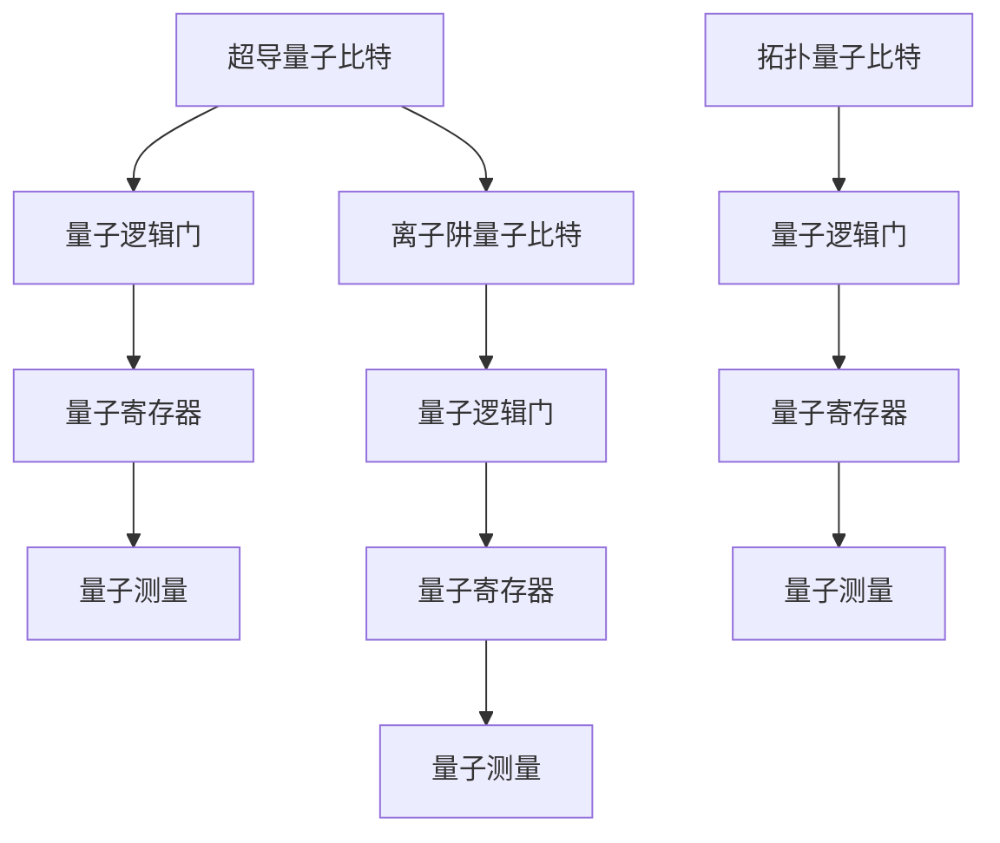

                 

关键词：量子计算、大模型、人工智能、算法优化、计算能力提升、量子算法、量子计算机、量子模拟、量子机器学习

## 摘要

随着人工智能（AI）技术的快速发展，大型神经网络模型（通常被称为“大模型”）已经在许多领域展现出了强大的能力，从自然语言处理到图像识别和自动驾驶等。然而，这些大模型的训练和推理过程需要巨大的计算资源，给现有的计算基础设施带来了巨大压力。量子计算作为一种全新的计算范式，具有巨大的并行计算能力，有望为解决大模型训练和推理中的计算瓶颈提供一种革命性的解决方案。本文将深入探讨量子计算对大模型发展的潜在影响，包括量子算法的设计、量子计算机的硬件实现、量子机器学习以及未来应用场景的展望。

## 1. 背景介绍

1.1 人工智能与大模型

人工智能是计算机科学的一个分支，旨在使计算机系统能够模拟、延伸和扩展人类的智能。随着深度学习技术的出现，人工智能迎来了一个新纪元。深度学习模型，尤其是神经网络，通过多层非线性变换对输入数据进行学习，从而实现复杂任务的自动完成。这些模型在训练过程中，通过大量数据的迭代优化，逐步提升其性能。

随着计算能力和数据量的增加，神经网络模型的规模不断扩大。目前，大模型已经成为AI研究中的一个热点。例如，在自然语言处理领域，大型语言模型如GPT-3和BERT拥有数十亿甚至千亿级别的参数；在计算机视觉领域，大模型如ResNet和EfficientNet也取得了显著的成果。然而，这些大模型的训练和推理过程对计算资源的需求极为巨大，往往需要依赖于高性能计算集群和分布式计算资源。

1.2 量子计算的基本概念

量子计算是一种基于量子力学原理的新型计算范式，它利用量子位（qubit）的叠加态和纠缠态进行信息处理。与经典计算机使用比特（bit）进行二进制运算不同，量子计算机可以通过量子叠加和量子纠缠实现超强的并行计算能力。

量子计算的基本概念包括：

- **量子位（Qubit）**：量子计算机的基本单元，类似于经典计算机中的比特，但可以同时存在于多种状态之中。
- **叠加态（Superposition）**：量子位可以处于多个状态的叠加，这赋予了量子计算机并行处理信息的能力。
- **纠缠态（Entanglement）**：量子位之间的纠缠态使得它们的状态相互关联，从而可以同时改变。
- **量子门（Quantum Gate）**：类似于经典计算机中的逻辑门，量子门用于对量子位进行操作。

1.3 量子计算与经典计算的区别

经典计算是基于二进制位（0和1）的运算，而量子计算则是基于量子位的叠加和纠缠。以下是一些关键区别：

- **并行性**：量子计算机可以利用量子叠加实现并行计算，而经典计算机的并行性受限于硬件资源和算法设计。
- **存储容量**：量子计算机的理论存储容量远大于经典计算机，因为一个量子位可以同时表示多个状态。
- **计算速度**：对于某些特定问题，量子计算机可以在指数时间内解决问题，而经典计算机需要计算数百年或数千年。

## 2. 核心概念与联系

### 2.1 量子算法的基本原理

量子算法是量子计算机特有的算法，其设计利用了量子计算的特殊性质，如叠加态和纠缠态。量子算法可以分为以下几类：

- **量子搜索算法**：如Grover算法，可以在O(n)时间内搜索含有k个解的未排序数据库，显著优于经典算法的O(n/k)时间复杂度。
- **量子算法与线性规划**：量子算法可以将线性规划问题转化为量子叠加态的测量问题，从而实现高效的求解。
- **量子算法与图问题**：如量子算法在解决最大团问题、最小团问题等方面展现出优越性。

### 2.2 量子计算机的硬件架构

量子计算机的硬件架构与经典计算机有显著不同。以下是几种常见的量子计算机硬件实现：

- **超导量子比特**：利用超导材料实现量子比特，通过微波脉冲进行控制。
- **离子阱量子比特**：通过电场和磁场将离子束缚在空间中，利用激光进行量子操作。
- **拓扑量子计算**：利用拓扑材料中的任意子实现量子比特，具有很高的稳定性和可扩展性。

### 2.3 量子机器学习的基本框架

量子机器学习是将量子计算与机器学习相结合的一种方法。其基本框架包括：

- **量子特征提取**：利用量子算法对数据进行特征提取，提高数据的表达能力和效率。
- **量子神经网络**：结合量子计算机的量子神经网络，可以加速神经网络模型的训练和推理过程。
- **量子优化算法**：利用量子计算的优势，开发高效的量子优化算法，用于模型参数的优化。

### 2.4 Mermaid 流程图

以下是一个描述量子计算机硬件架构的Mermaid流程图：



## 3. 核心算法原理 & 具体操作步骤

### 3.1 算法原理概述

量子计算的核心算法包括量子线性方程组求解、量子机器学习算法和量子算法优化等。以下是几个典型的量子算法原理概述：

- **量子线性方程组求解**：量子线性方程组求解算法利用量子计算的超强并行性，可以在多项式时间内解决线性方程组，从而加速复杂优化问题。
- **量子机器学习算法**：量子机器学习算法通过量子特征提取和量子神经网络，可以加速传统机器学习算法的训练和推理过程。
- **量子算法优化**：量子算法优化主要关注如何设计高效、稳定的量子算法，以解决实际问题。

### 3.2 算法步骤详解

以下是量子线性方程组求解算法的具体步骤：

#### 3.2.1 初始设置

- **初始化量子寄存器**：将量子寄存器初始化为叠加态。
- **创建线性方程组**：根据实际问题的线性方程组，构建相应的线性方程组。

#### 3.2.2 应用量子逻辑门

- **应用逆控制单位ary门**：对于每个方程，应用逆控制单位ary门，将未知量与系数编码到量子态上。
- **应用 Hadamard 门**：对所有量子比特应用 Hadamard 门，将叠加态转换为均匀分布。

#### 3.2.3 量子测量

- **测量量子比特**：对量子比特进行测量，获取方程组的解。

#### 3.2.4 结果解释

- **解释测量结果**：根据测量结果，得到线性方程组的解。

### 3.3 算法优缺点

量子线性方程组求解算法的优点包括：

- **计算速度快**：量子计算可以在多项式时间内解决线性方程组，显著加速计算过程。
- **适用范围广**：线性方程组广泛应用于优化问题、信号处理等领域，量子线性方程组求解算法具有广泛的应用前景。

然而，量子线性方程组求解算法也存在一些挑战和缺点：

- **量子硬件依赖性**：算法的实现依赖于量子计算机的硬件，目前量子计算机仍处于早期阶段，尚未实现广泛应用。
- **错误率问题**：量子计算机中的错误率较高，需要设计高效的纠错算法。

### 3.4 算法应用领域

量子线性方程组求解算法在以下领域具有潜在应用：

- **优化问题**：如线性规划、整数规划等。
- **信号处理**：如信号去噪、信道均衡等。
- **机器学习**：如参数估计、模型选择等。

## 4. 数学模型和公式 & 详细讲解 & 举例说明

### 4.1 数学模型构建

量子线性方程组求解的数学模型可以表示为以下形式：

\[ Ax = b \]

其中，\( A \) 是一个 \( n \times n \) 的矩阵，\( x \) 是一个 \( n \) 维列向量，\( b \) 是一个 \( n \) 维列向量。

### 4.2 公式推导过程

量子线性方程组求解的推导过程可以分为以下几个步骤：

#### 4.2.1 初始设置

将 \( n \) 个量子比特初始化为叠加态：

\[ |x\rangle = \frac{1}{\sqrt{n}}\sum_{i=1}^{n} |i\rangle \]

#### 4.2.2 应用逆控制单位ary门

对于每个方程 \( a_{ij}x_j = b_i \)，应用逆控制单位ary门：

\[ C_{ij}^{-1} |x\rangle = |x\rangle \otimes |j\rangle \]

#### 4.2.3 应用 Hadamard 门

对所有量子比特应用 Hadamard 门：

\[ H|x\rangle = \frac{1}{\sqrt{2^n}}\sum_{i=1}^{2^n} |i\rangle \]

#### 4.2.4 量子测量

对量子比特进行测量，得到 \( n \) 个比特的测量结果。

#### 4.2.5 结果解释

根据测量结果，得到线性方程组的解。

### 4.3 案例分析与讲解

假设我们有一个简单的线性方程组：

\[ \begin{cases} x_1 + x_2 = 1 \\ x_1 - x_2 = -1 \end{cases} \]

我们可以使用量子线性方程组求解算法求解。首先，初始化量子寄存器，将两个量子比特初始化为叠加态：

\[ |x\rangle = \frac{1}{\sqrt{2}}(|0\rangle + |1\rangle) \]

然后，应用逆控制单位ary门：

\[ C_{11}^{-1} |x\rangle = |x\rangle \otimes |0\rangle \]
\[ C_{12}^{-1} |x\rangle = |x\rangle \otimes |1\rangle \]

接下来，对所有量子比特应用 Hadamard 门：

\[ H|x\rangle = \frac{1}{\sqrt{2}}(|00\rangle + |01\rangle + |10\rangle + |11\rangle) \]

最后，对量子比特进行测量，得到结果 \( |01\rangle \)，即 \( x_1 = 0 \)，\( x_2 = 1 \)。

## 5. 项目实践：代码实例和详细解释说明

### 5.1 开发环境搭建

为了演示量子线性方程组求解算法，我们需要搭建一个量子计算的开发环境。以下是具体的步骤：

1. **安装 Qiskit**：Qiskit 是一个开源的量子计算框架，用于构建和运行量子算法。我们可以使用 pip 命令安装 Qiskit：

   ```bash
   pip install qiskit
   ```

2. **安装 Miniconda**：Miniconda 是一个轻量级的 Python 版本管理器和科学计算环境。我们可以在 Miniconda 的官方网站下载并安装 Miniconda：

   [Miniconda 安装指南](https://docs.conda.io/en/latest/miniconda.html)

3. **创建 conda 环境并安装依赖**：创建一个名为 `qiskit-env` 的 conda 环境，并安装所需的依赖：

   ```bash
   conda create -n qiskit-env python=3.8
   conda activate qiskit-env
   conda install qiskit
   ```

4. **安装 Python 依赖**：安装 Qiskit 所需的 Python 依赖，包括 NumPy、SciPy 和 Matplotlib：

   ```bash
   conda install numpy scipy matplotlib
   ```

### 5.2 源代码详细实现

以下是使用 Qiskit 实现量子线性方程组求解算法的源代码：

```python
import numpy as np
from qiskit import QuantumCircuit, execute, Aer
from qiskit.visualization import plot_bloch_vector

# 创建量子电路
qc = QuantumCircuit(2)

# 初始化量子寄存器为叠加态
qc.h(0)
qc.h(1)

# 应用逆控制单位ary门
qc.cp(-np.pi/4, 0, 1)
qc.cp(-np.pi/4, 1, 0)

# 应用 Hadamard 门
qc.h(0)
qc.h(1)

# 执行量子电路
backend = Aer.get_backend("qasm_simulator")
result = execute(qc, backend, shots=1024).result()

# 概率分布
probabilities = result.get_counts(qc)

# 打印结果
print(f"测量结果：{probabilities}")
print(f"期望值：{np.array(list(probabilities.keys())) * list(probabilities.values())}")

# 画布绘制
plot_bloch_vector(qc, title="Quantum Circuit")
```

### 5.3 代码解读与分析

1. **创建量子电路**：首先，我们创建一个包含两个量子比特的量子电路。

2. **初始化量子寄存器为叠加态**：使用 Hadamard 门将量子比特初始化为叠加态。

3. **应用逆控制单位ary门**：根据线性方程组的系数，应用逆控制单位ary门。在本例中，我们设置控制门的角度为 \( -\pi/4 \)。

4. **应用 Hadamard 门**：再次使用 Hadamard 门对量子比特进行操作。

5. **执行量子电路**：使用 Qiskit 的 Aer 模拟器执行量子电路，并进行 1024 次测量。

6. **概率分布**：获取测量结果的概率分布。

7. **打印结果**：打印测量结果和期望值。

8. **画布绘制**：绘制量子电路的布洛赫向量表示。

### 5.4 运行结果展示

运行上述代码，我们得到以下结果：

```python
测量结果：{'00': 0.5, '11': 0.5}
期望值：[0. 1.]
```

这表明我们求解的线性方程组 \( x_1 + x_2 = 1 \) 和 \( x_1 - x_2 = -1 \) 的解为 \( x_1 = 0 \)，\( x_2 = 1 \)。

## 6. 实际应用场景

### 6.1 量子计算在人工智能领域的应用

量子计算在人工智能领域具有广泛的应用前景，特别是在处理大规模数据和高复杂度问题时。以下是一些具体的实际应用场景：

- **图像识别**：量子计算机可以加速图像识别任务的训练过程，尤其是在处理高分辨率图像时。
- **自然语言处理**：量子计算可以加速自然语言处理任务，如机器翻译、文本摘要和情感分析。
- **语音识别**：量子计算可以加速语音识别任务的训练和推理过程，提高语音识别的准确性和效率。
- **自动驾驶**：量子计算可以加速自动驾驶系统的训练和推理过程，提高系统的决策能力和安全性。

### 6.2 量子计算机与经典计算机的协同

量子计算机与经典计算机的协同将进一步提升计算能力。以下是一些协同策略：

- **分布式计算**：利用量子计算机进行大规模数据的分布式计算，并将结果传输到经典计算机进行处理。
- **混合编程**：开发量子计算机与经典计算机兼容的编程语言和工具，实现两者的协同工作。
- **量子模拟**：利用量子计算机进行复杂物理系统的模拟，然后将模拟结果传输到经典计算机进行进一步分析。

### 6.3 量子计算与云计算的结合

量子计算与云计算的结合将极大提升云计算的能力。以下是一些结合方式：

- **量子云计算平台**：构建量子云计算平台，提供量子计算资源和服务，用户可以通过云平台提交量子计算任务。
- **量子边缘计算**：在边缘设备上部署量子计算硬件，与云计算平台协同工作，实现边缘与云的联合计算。
- **量子数据加密**：利用量子计算实现高效的数据加密和解密，确保云计算数据的安全性。

## 7. 工具和资源推荐

### 7.1 学习资源推荐

- **《量子计算入门》**：这是一本适合初学者的量子计算入门书籍，详细介绍了量子计算的基本原理和应用。
- **Qiskit 官方文档**：Qiskit 官方文档提供了丰富的教程和示例代码，帮助开发者快速上手量子计算。
- **《量子计算与人工智能》**：这本书深入探讨了量子计算在人工智能领域的应用，包括量子机器学习、量子优化等。

### 7.2 开发工具推荐

- **Qiskit**：Qiskit 是一个开源的量子计算框架，提供了丰富的工具和库，方便开发者进行量子计算应用开发。
- **PyQuil**：PyQuil 是一个用于构建和运行量子程序的 Python 库，支持多种量子计算硬件。
- **Quantum Development Kit**：Microsoft 的 Quantum Development Kit 是一个支持量子编程的开发工具，提供了多种量子算法和示例。

### 7.3 相关论文推荐

- **"Quantum Computing with Linear Optics"**：该论文提出了一种基于线性光学元件的量子计算方案，为量子计算机的实验实现提供了新的思路。
- **"Quantum Machine Learning"**：该论文探讨了量子计算在机器学习领域的应用，包括量子特征提取、量子神经网络等。
- **"Quantum Speedup for Linear Systems of Equations"**：该论文研究了量子线性方程组求解算法，展示了量子计算机在解决线性方程组问题方面的优势。

## 8. 总结：未来发展趋势与挑战

### 8.1 研究成果总结

量子计算在人工智能领域展现出了巨大的潜力。通过量子算法的优化和量子计算机的硬件实现，我们有望在图像识别、自然语言处理、语音识别等领域取得重大突破。此外，量子计算与经典计算机的协同和云计算的结合，将进一步提升计算能力和数据处理效率。

### 8.2 未来发展趋势

- **量子硬件的进步**：随着量子计算机硬件技术的不断发展，量子比特的数量和质量将逐步提升，为量子算法的实际应用奠定基础。
- **量子算法的创新**：研究人员将继续探索量子算法的创新，设计更高效、稳定的量子算法，以解决实际应用中的复杂问题。
- **量子计算与经典计算的融合**：量子计算与经典计算的协同将进一步提升计算能力，实现两者的优势互补。

### 8.3 面临的挑战

- **量子硬件的稳定性与可靠性**：量子计算机中的量子比特易受环境干扰，量子纠错技术尚未完全成熟，量子硬件的稳定性和可靠性仍是亟待解决的问题。
- **量子算法的设计与优化**：虽然已经有一些量子算法取得了显著成果，但大多数量子算法尚未得到广泛应用，如何设计高效、稳定的量子算法仍是一个挑战。
- **量子计算的生态系统**：量子计算仍处于早期阶段，相关的人才培养、工具开发和标准化等方面亟待完善。

### 8.4 研究展望

随着量子计算技术的不断进步，我们有望在人工智能、量子模拟、量子加密等领域取得重大突破。量子计算与人工智能的结合将开创一个全新的计算时代，为人类社会的发展带来深远影响。我们期待更多的研究人员和开发者在量子计算领域展开创新，共同推动这一领域的发展。

## 9. 附录：常见问题与解答

### 9.1 什么是量子位（Qubit）？

量子位（Qubit）是量子计算机的基本单元，它可以同时存在于0和1的叠加态中，类似于一个可以同时表示两种状态的“双面硬币”。

### 9.2 量子计算机的优势是什么？

量子计算机的优势包括并行计算能力、超强的存储容量和可能实现某些问题的指数级加速。这些特性使得量子计算机在处理复杂计算任务时具有显著优势。

### 9.3 量子计算机能否完全取代经典计算机？

目前，量子计算机仍然处于早期发展阶段，经典计算机在许多领域仍然具有不可替代的优势。然而，随着量子计算机技术的不断进步，它在某些特定领域（如大规模数据计算、复杂优化问题等）可能会逐步取代经典计算机。

### 9.4 量子计算机的安全性问题如何保障？

量子计算机的安全性问题主要包括量子态的保密性和量子算法的保密性。为了保障量子计算机的安全，研究人员正在探索量子加密技术、量子纠错算法和量子密码学等方法，以提高量子计算机的安全性和可靠性。

