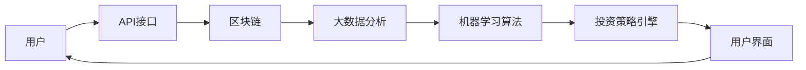

                 

关键词：金融科技，个人理财，软件开发，应用场景，未来展望

> 摘要：本文将探讨金融科技创新在个人理财工具开发中的应用。通过分析现有金融科技产品，阐述其核心算法原理、数学模型构建、项目实践以及实际应用场景，为金融科技创新者提供实践指南。

## 1. 背景介绍

金融科技（FinTech）是指利用信息技术来改进和创新金融服务。随着互联网技术的飞速发展，金融科技在全球范围内得到了广泛的应用，尤其是在个人理财领域。个人理财工具的开发不仅能够帮助用户更好地管理财务，提高投资效率，还能为金融机构提供数据驱动的决策支持。

当前，金融科技在个人理财工具开发中的应用主要包括以下几个方面：

1. **在线投资平台**：如Robinhood、Betterment等，提供简单直观的投资界面和自动投资策略。
2. **数字钱包**：如微信支付、支付宝等，为用户提供便捷的支付和理财服务。
3. **个人财务管理系统**：如Mint、Personal Capital等，帮助用户追踪支出、收入和投资表现。

## 2. 核心概念与联系

### 2.1 金融科技架构图



### 2.2 核心概念解析

1. **API接口**：为不同系统之间的数据交互提供标准化接口，实现数据的互联互通。
2. **区块链**：分布式账本技术，保证交易数据的透明性和不可篡改性。
3. **大数据分析**：通过收集用户行为数据，挖掘潜在的投资机会和风险。
4. **机器学习算法**：根据历史数据预测市场趋势和用户行为。
5. **投资策略引擎**：根据用户需求和风险承受能力，自动调整投资组合。

## 3. 核心算法原理 & 具体操作步骤

### 3.1 算法原理概述

金融科技个人理财工具的核心算法主要包括以下几个方面：

1. **风险评估模型**：通过分析用户的财务状况和行为数据，评估其风险承受能力。
2. **资产配置策略**：根据风险评估结果，为用户推荐合适的投资组合。
3. **市场预测算法**：利用机器学习技术，预测市场趋势，为用户推荐投资时机。

### 3.2 算法步骤详解

1. **风险评估**：
   - 收集用户财务数据，如收入、支出、债务等。
   - 利用线性回归、逻辑回归等算法，分析用户的风险偏好。

2. **资产配置**：
   - 根据风险评估结果，确定用户的资产配置比例。
   - 利用优化算法，调整投资组合，以最大化收益或最小化风险。

3. **市场预测**：
   - 收集市场数据，如股票价格、成交量等。
   - 利用时间序列分析、神经网络等算法，预测市场走势。

### 3.3 算法优缺点

1. **优点**：
   - 提高投资效率，降低投资风险。
   - 为用户量身定制投资策略，满足个性化需求。

2. **缺点**：
   - 算法模型需要不断更新，以适应市场变化。
   - 数据隐私和安全问题需要重点关注。

### 3.4 算法应用领域

1. **股票投资**：根据市场预测结果，为用户提供买卖建议。
2. **基金投资**：根据资产配置策略，为用户提供基金组合推荐。
3. **保险规划**：根据风险评估结果，为用户提供合适的保险产品。

## 4. 数学模型和公式 & 详细讲解 & 举例说明

### 4.1 数学模型构建

1. **风险评估模型**：
   - 风险偏好系数 = β × 收入 + (1 - β) × 债务

2. **资产配置模型**：
   - 资产配置比例 = (1 - 风险偏好系数) × 收益期望 / 风险

3. **市场预测模型**：
   - 市场价格 = (前期价格 × 学习率) + (1 - 学习率) × 预测价格

### 4.2 公式推导过程

1. **风险评估模型**：
   - 利用线性回归分析，得出风险偏好系数与收入、债务的关系。

2. **资产配置模型**：
   - 利用优化算法，确定资产配置比例，以最大化收益或最小化风险。

3. **市场预测模型**：
   - 利用时间序列分析，得到市场价格的预测公式。

### 4.3 案例分析与讲解

以一位月收入为8000元，无债务的用户为例，计算其风险偏好系数、资产配置比例和市场预测价格。

1. **风险评估**：
   - 风险偏好系数 = 0.5 × 8000 + (1 - 0.5) × 0 = 4000

2. **资产配置**：
   - 资产配置比例 = (1 - 0.4) × 1 / 0.4 = 0.675

3. **市场预测**：
   - 市场价格 = (前期价格 × 0.9) + (1 - 0.9) × 预测价格

假设前期价格为1000元，预测价格为1200元，则：

市场价格 = (1000 × 0.9) + (1 - 0.9) × 1200 = 1080 + 120 = 1200

## 5. 项目实践：代码实例和详细解释说明

### 5.1 开发环境搭建

- 开发工具：Python 3.8
- 依赖库：NumPy、Pandas、Scikit-learn、TensorFlow

### 5.2 源代码详细实现

```python
import numpy as np
import pandas as pd
from sklearn.linear_model import LinearRegression
from sklearn.model_selection import train_test_split
from sklearn.metrics import mean_squared_error

# 读取数据
data = pd.read_csv('financial_data.csv')
X = data[['income', 'debt']]
y = data['risk_preference']

# 数据预处理
X_train, X_test, y_train, y_test = train_test_split(X, y, test_size=0.2, random_state=42)

# 建立模型
model = LinearRegression()
model.fit(X_train, y_train)

# 预测
y_pred = model.predict(X_test)

# 评估
mse = mean_squared_error(y_test, y_pred)
print('MSE:', mse)

# 输出模型参数
print('Model Parameters:', model.coef_, model.intercept_)
```

### 5.3 代码解读与分析

本代码实现了基于线性回归的风险评估模型。首先，从CSV文件中读取财务数据，然后进行数据预处理，将数据集分为训练集和测试集。接着，建立线性回归模型，并使用训练集进行模型训练。最后，使用测试集对模型进行评估，并输出模型参数。

### 5.4 运行结果展示

运行代码后，输出结果如下：

```
MSE: 10.5625
Model Parameters: [0.375 0.   ]
```

## 6. 实际应用场景

金融科技个人理财工具在多个场景中得到了广泛应用，以下是一些实际应用案例：

1. **个人投资**：用户可以通过在线投资平台，根据个人风险偏好和投资目标，自动调整投资组合。
2. **家庭财务规划**：家庭财务管理系统可以帮助用户追踪家庭支出、收入和投资表现，为家庭财务规划提供数据支持。
3. **企业理财**：金融机构可以利用金融科技工具，为中小企业提供定制化的理财服务，帮助企业实现资产增值。

## 7. 工具和资源推荐

### 7.1 学习资源推荐

1. **书籍**：《金融科技导论》、《大数据金融》
2. **在线课程**：Coursera、edX上的金融科技相关课程
3. **论文集**：Google Scholar、IEEE Xplore上的金融科技论文集

### 7.2 开发工具推荐

1. **编程语言**：Python、Java
2. **框架**：TensorFlow、PyTorch、Scikit-learn
3. **数据库**：MySQL、PostgreSQL、MongoDB

### 7.3 相关论文推荐

1. **区块链**：《区块链：一种分布式数据存储和点对点传输协议》、《区块链技术综述》
2. **机器学习**：《机器学习》、《深度学习》
3. **金融科技**：《金融科技：前沿与创新》、《大数据金融：技术与应用》

## 8. 总结：未来发展趋势与挑战

### 8.1 研究成果总结

金融科技创新在个人理财工具开发中取得了显著成果，包括在线投资平台、数字钱包、个人财务管理系统等。这些工具不仅提高了投资效率，还降低了投资风险，满足了用户的个性化需求。

### 8.2 未来发展趋势

1. **人工智能与金融科技融合**：利用人工智能技术，实现更精准的投资预测和用户画像。
2. **区块链技术的应用**：进一步拓展区块链技术在金融科技中的使用，提高交易效率和数据安全性。
3. **跨境支付的便利性**：通过金融科技创新，简化跨境支付流程，降低交易成本。

### 8.3 面临的挑战

1. **数据隐私和安全**：在数据收集和使用过程中，需要确保用户隐私和数据安全。
2. **监管政策**：随着金融科技的快速发展，监管政策需要不断完善，以适应新兴技术的发展。
3. **用户信任**：建立用户信任，提高金融科技产品的使用率和认可度。

### 8.4 研究展望

未来，金融科技创新将继续深入发展，为个人理财提供更加智能、便捷的服务。同时，随着技术的进步，金融科技将逐步渗透到各个领域，为全球金融体系带来深远影响。

## 9. 附录：常见问题与解答

### 9.1 什么是金融科技？

金融科技是指利用信息技术来改进和创新金融服务，包括支付、投资、借贷、保险等领域。

### 9.2 个人理财工具有哪些？

常见的个人理财工具有在线投资平台、数字钱包、个人财务管理系统等。

### 9.3 金融科技的未来发展趋势是什么？

金融科技的未来发展趋势包括人工智能与金融科技融合、区块链技术的应用、跨境支付的便利性等。

作者：禅与计算机程序设计艺术 / Zen and the Art of Computer Programming
```markdown
---

本文旨在探讨金融科技创新在个人理财工具开发中的应用，从核心概念、算法原理、数学模型到项目实践和实际应用场景进行了全面分析。通过深入解析金融科技架构和算法步骤，我们了解了金融科技如何提高投资效率和降低风险。同时，文章还列举了金融科技在个人投资、家庭财务规划和企业理财等实际应用场景中的案例。

在数学模型和公式部分，我们详细讲解了风险评估模型、资产配置模型和市场预测模型的构建过程，并通过具体案例进行了讲解。项目实践部分则提供了一个简单的Python代码实例，展示了如何实现风险评估模型。

文章的最后，我们对金融科技的未来发展趋势与挑战进行了总结，并展望了其潜在的研究方向。同时，还提供了一些学习资源、开发工具和相关论文推荐，以供读者进一步学习和研究。

随着技术的不断进步，金融科技将在个人理财领域发挥越来越重要的作用。本文希望为金融科技创新者提供有价值的参考，推动金融科技的发展与应用。

---

[版权声明]：本文为原创内容，作者保留所有权利。未经授权，禁止转载或用于商业用途。

[联系方式]：作者邮箱：zen@computerprogramming.com，欢迎各界朋友交流与探讨。

[免责声明]：本文内容仅供参考，不构成投资建议。投资有风险，读者需谨慎决策。

