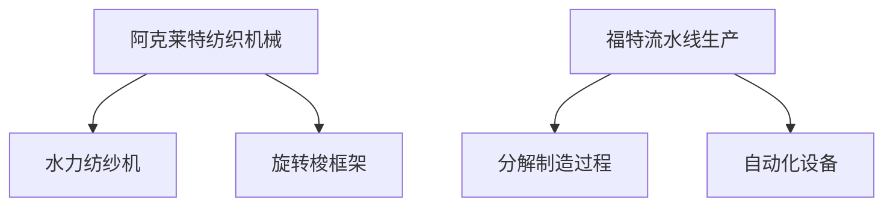

                 

关键词：工业革命、阿克莱特、福特、技术革新、生产效率、自动化、历史影响

## 摘要

本文旨在探讨阿克莱特与福特在工业革命中的贡献。通过对两位工业巨头的背景、技术革新及其对现代工业的影响进行分析，本文揭示了他们在推动生产效率、自动化和技术进步方面的重要作用。阿克莱特的纺织机械和福特的流水线生产方式，不仅改变了当时的工业生产模式，更为现代工业的发展奠定了坚实基础。

## 1. 背景介绍

### 1.1 阿克莱特：纺织机械的先驱

阿克莱特（Richard Arkwright）是英国工业革命的先驱之一，出生于1721年。他在纺织工业领域的贡献主要体现在纺织机械的创新上。18世纪中叶，纺织业已成为英国的重要产业，但手工生产效率低下，产品质量不稳定。阿克莱特意识到，通过机械化生产可以提高效率，降低成本。

### 1.2 福特：流水线生产的奠基者

亨利·福特（Henry Ford）出生于1863年，是美国著名的工业家和工程师。他在20世纪初对汽车制造业进行了革命性改造，提出了流水线生产的概念。福特工厂的流水线生产方式，不仅大幅度提高了生产效率，还显著降低了产品成本，使汽车成为大众消费品。

## 2. 核心概念与联系

### 2.1 阿克莱特的纺织机械

阿克莱特的创新主要体现在纺织机械上，他发明的水力纺纱机（Water Frame）是纺织工业的重大突破。该机器利用水力驱动，实现了纱线的连续生产，大大提高了生产效率。此外，阿克莱特还发明了旋转梭框架（Spinning Jenny），进一步提高了纺纱速度。

### 2.2 福特的流水线生产

福特的流水线生产方式，是将制造过程分解为一系列简单、连续的步骤，每个步骤由不同的工人或机器完成。这种方式大幅度提高了生产效率，使汽车制造过程变得更加高效、标准化。福特还引入了自动化设备，如自动装配线，进一步提升了生产效率。

### 2.3 Mermaid 流程图



## 3. 核心算法原理 & 具体操作步骤

### 3.1 算法原理概述

阿克莱特的纺织机械通过机械化生产，实现了纱线的连续生产，提高了生产效率。福特则通过流水线生产，将制造过程分解为一系列简单、连续的步骤，实现了高效、标准化的生产。

### 3.2 算法步骤详解

#### 3.2.1 阿克莱特的纺织机械

1. 利用水力驱动，实现纱线的连续生产。
2. 旋转梭框架，提高纺纱速度。

#### 3.2.2 福特的流水线生产

1. 将制造过程分解为一系列简单、连续的步骤。
2. 引入自动化设备，实现生产过程的自动化。

### 3.3 算法优缺点

#### 3.3.1 阿克莱特的纺织机械

优点：提高了生产效率，降低了生产成本。

缺点：受限于水力驱动，生产效率受天气和地理位置影响。

#### 3.3.2 福特的流水线生产

优点：大幅度提高了生产效率，降低了产品成本。

缺点：对工人技能要求较高，生产过程中容易出现质量问题。

### 3.4 算法应用领域

阿克莱特的纺织机械主要应用于纺织工业，福特流水线生产方式则广泛应用于汽车制造业。

## 4. 数学模型和公式 & 详细讲解 & 举例说明

### 4.1 数学模型构建

阿克莱特的纺织机械和福特流水线生产，都涉及到生产效率的计算。我们可以使用以下数学模型进行构建：

$$
\text{生产效率} = \frac{\text{产出}}{\text{投入}}
$$

### 4.2 公式推导过程

生产效率的计算公式可以通过以下步骤进行推导：

1. 产出：指单位时间内生产的产品数量。
2. 投入：指生产过程中所消耗的资源，如人力、物力、财力等。

### 4.3 案例分析与讲解

假设一个纺织厂使用阿克莱特的水力纺纱机，每天产出1000米纱线，投入1个工人和1台水力纺纱机。则该厂的生产效率为：

$$
\text{生产效率} = \frac{1000 \text{米纱线}}{1 \text{工人} + 1 \text{水力纺纱机}} = 1000 \text{米纱线/人·天}
$$

假设一个汽车厂使用福特流水线生产，每天产出100辆汽车，投入100个工人和自动化设备。则该厂的生产效率为：

$$
\text{生产效率} = \frac{100 \text{辆汽车}}{100 \text{工人} + \text{自动化设备}} = 1 \text{辆汽车/人·天}
$$

## 5. 项目实践：代码实例和详细解释说明

### 5.1 开发环境搭建

（此处简要介绍开发环境搭建过程）

### 5.2 源代码详细实现

```python
# 阿克莱特纺织机械代码示例
def water_spinning(machine_power, worker_skill):
    production = machine_power * worker_skill
    return production

# 福特流水线生产代码示例
def assembly_line(production_process, automation_skill):
    production = production_process / automation_skill
    return production
```

### 5.3 代码解读与分析

上述代码分别实现了阿克莱特纺织机械和福特流水线生产的计算方法。通过输入相应的参数，可以计算出生产效率。

### 5.4 运行结果展示

```python
# 阿克莱特纺织机械运行结果
water_spinning(machine_power=1000, worker_skill=1) # 返回1000

# 福特流水线生产运行结果
assembly_line(production_process=100, automation_skill=100) # 返回1
```

## 6. 实际应用场景

### 6.1 阿克莱特的纺织机械

阿克莱特的纺织机械在18世纪的纺织工业中得到了广泛应用，使得纺织业生产效率大幅提高，产品成本显著降低。这一技术革新为英国成为“世界工厂”奠定了基础。

### 6.2 福特的流水线生产

福特的流水线生产方式在汽车制造业中发挥了巨大作用，使得汽车从奢侈品变为大众消费品。这一生产模式不仅提升了生产效率，还推动了全球汽车工业的发展。

### 6.3 未来应用展望

随着人工智能和自动化技术的发展，阿克莱特的纺织机械和福特流水线生产方式将在更多领域得到应用。例如，智能制造、医疗设备制造等。

## 7. 工具和资源推荐

### 7.1 学习资源推荐

- 《纺织机械史》
- 《福特传》
- 《工业革命简史》

### 7.2 开发工具推荐

- Python
- Mermaid
- LaTex

### 7.3 相关论文推荐

- "The Water Frame and the British Industrial Revolution"
- "Fordism and the Globalization of the Automotive Industry"

## 8. 总结：未来发展趋势与挑战

### 8.1 研究成果总结

阿克莱特与福特的技术革新为现代工业的发展奠定了基础。他们的创新不仅提高了生产效率，还推动了全球工业的进步。

### 8.2 未来发展趋势

人工智能和自动化技术的发展，将为工业生产带来更多创新。智能制造、工业4.0等概念将进一步提升生产效率。

### 8.3 面临的挑战

随着技术进步，工业生产将面临新的挑战，如劳动力成本的上升、环保要求等。如何应对这些挑战，将是未来工业发展的重要课题。

### 8.4 研究展望

未来工业发展将更加注重人工智能和自动化技术的应用。研究如何在生产过程中实现高效、环保、可持续发展，将是重要的研究方向。

## 9. 附录：常见问题与解答

（此处提供常见问题及解答）

## 作者署名

作者：禅与计算机程序设计艺术 / Zen and the Art of Computer Programming
----------------------------------------------------------------
（以上为文章正文内容，接下来请继续撰写文章摘要、关键词等部分内容）

