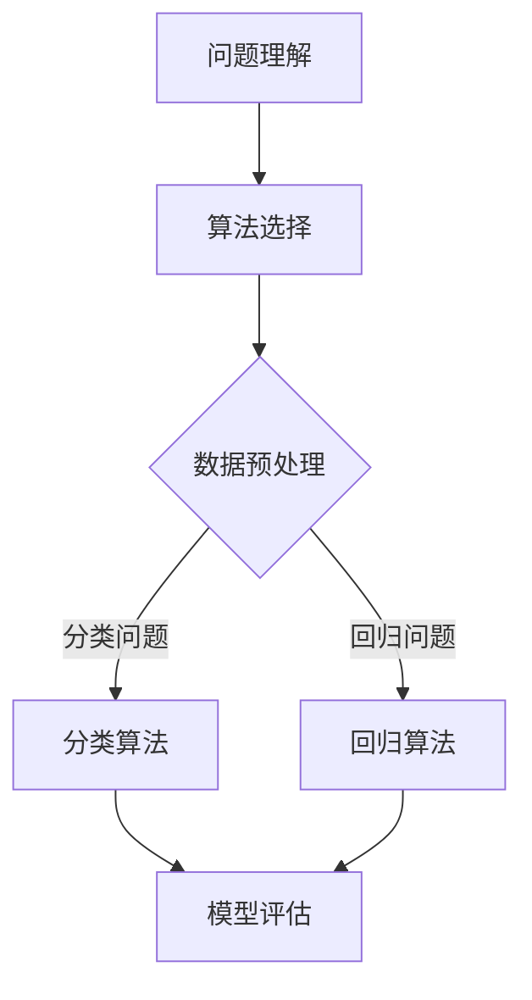

                 

关键词：阿里巴巴、2024届、校招、算法工程师、面试、真题、解密

> 摘要：本文旨在为即将参加阿里巴巴2024届校招的算法工程师应聘者提供有针对性的面试真题解析，帮助大家深入了解面试要求和解题思路，提高面试成功率。

## 1. 背景介绍

随着人工智能技术的迅猛发展，算法工程师成为各大互联网公司争抢的人才。阿里巴巴作为中国领先的互联网企业，其校招算法工程师岗位一直是众多毕业生的梦想。然而，面对激烈的竞争，如何顺利通过面试成为许多应聘者关心的问题。本文将结合阿里巴巴2024届校招算法工程师面试真题，为大家揭秘面试的难点和解题技巧，助力同学们顺利通过面试。

## 2. 核心概念与联系

### Mermaid 流程图



### 核心概念

- **问题理解**：明确面试题目要求，理解问题背景和目标。
- **算法选择**：根据问题类型选择合适的算法。
- **数据预处理**：对输入数据进行预处理，提高算法性能。
- **模型评估**：评估模型性能，选择最优模型。

## 3. 核心算法原理 & 具体操作步骤

### 3.1 算法原理概述

本部分将介绍几类常见的算法原理，包括分类算法、回归算法等。

### 3.2 算法步骤详解

#### 分类算法

1. **特征提取**：从原始数据中提取有用的特征。
2. **模型训练**：使用训练数据训练分类模型。
3. **模型评估**：使用测试数据评估模型性能。
4. **预测**：使用训练好的模型对新的数据进行预测。

#### 回归算法

1. **特征提取**：从原始数据中提取有用的特征。
2. **模型训练**：使用训练数据训练回归模型。
3. **模型评估**：使用测试数据评估模型性能。
4. **预测**：使用训练好的模型对新的数据进行预测。

### 3.3 算法优缺点

#### 分类算法

- **优点**：分类算法可以准确地将数据分为不同的类别，有助于实现目标。
- **缺点**：当数据分布不均匀时，分类算法的性能可能受到影响。

#### 回归算法

- **优点**：回归算法可以准确地预测连续值，有助于实现目标。
- **缺点**：当数据存在噪声时，回归算法的性能可能受到影响。

### 3.4 算法应用领域

- **分类算法**：广泛应用于文本分类、图像分类等领域。
- **回归算法**：广泛应用于房价预测、股票价格预测等领域。

## 4. 数学模型和公式 & 详细讲解 & 举例说明

### 4.1 数学模型构建

分类算法和回归算法都有其数学模型。例如，线性回归的数学模型可以表示为：

$$
y = \beta_0 + \beta_1x_1 + \beta_2x_2 + ... + \beta_nx_n
$$

其中，$y$ 是预测值，$x_1, x_2, ..., x_n$ 是特征值，$\beta_0, \beta_1, ..., \beta_n$ 是模型参数。

### 4.2 公式推导过程

以线性回归为例，假设我们有一个训练数据集$T=\{(x_1, y_1), (x_2, y_2), ..., (x_n, y_n)\}$。我们希望找到一个线性模型$y = \beta_0 + \beta_1x_1 + \beta_2x_2 + ... + \beta_nx_n$，使得预测值$y$与实际值$y_i$之间的误差最小。

我们使用最小二乘法来求解这个问题，即：

$$
\min_{\beta_0, \beta_1, ..., \beta_n} \sum_{i=1}^{n}(y_i - (\beta_0 + \beta_1x_i + \beta_2x_i + ... + \beta_nx_i))^2
$$

### 4.3 案例分析与讲解

假设我们有一个房价预测问题，给定一组房屋特征（如面积、地段等）和对应的房价，要求我们预测新的房屋的房价。我们可以使用线性回归模型来解决这个问题。

首先，我们提取房屋特征作为输入向量$x$，房价作为输出向量$y$。然后，我们使用训练数据训练线性回归模型，得到模型参数$\beta_0, \beta_1, ..., \beta_n$。最后，使用训练好的模型预测新的房屋房价。

## 5. 项目实践：代码实例和详细解释说明

### 5.1 开发环境搭建

在本文中，我们将使用Python作为编程语言，利用Scikit-learn库实现线性回归模型。首先，确保安装了Python和Scikit-learn库。

```bash
pip install python
pip install scikit-learn
```

### 5.2 源代码详细实现

以下是一个简单的线性回归模型实现示例：

```python
from sklearn.linear_model import LinearRegression
from sklearn.model_selection import train_test_split
from sklearn.metrics import mean_squared_error

# 加载数据
X, y = load_data()

# 划分训练集和测试集
X_train, X_test, y_train, y_test = train_test_split(X, y, test_size=0.2, random_state=42)

# 创建线性回归模型
model = LinearRegression()

# 训练模型
model.fit(X_train, y_train)

# 预测测试集
y_pred = model.predict(X_test)

# 评估模型
mse = mean_squared_error(y_test, y_pred)
print(f"Mean squared error: {mse}")

# 预测新的房屋房价
new_house = [[2000, 'A']]
new_price = model.predict(new_house)
print(f"Predicted price: {new_price[0]}")
```

### 5.3 代码解读与分析

1. **加载数据**：从本地文件加载数据，这里使用的是CSV文件。
2. **划分训练集和测试集**：将数据集划分为训练集和测试集，以评估模型的性能。
3. **创建线性回归模型**：创建一个线性回归模型实例。
4. **训练模型**：使用训练集数据训练模型。
5. **预测测试集**：使用训练好的模型对测试集进行预测。
6. **评估模型**：计算预测值和实际值之间的均方误差，以评估模型性能。
7. **预测新的房屋房价**：使用训练好的模型预测新的房屋房价。

## 6. 实际应用场景

线性回归算法在房价预测、股票价格预测等领域有广泛的应用。在实际项目中，我们需要根据具体场景调整特征提取、模型选择和参数调优等步骤，以提高预测准确性。

### 6.4 未来应用展望

随着人工智能技术的不断发展，线性回归算法在更多领域将得到应用。未来，我们可以结合深度学习等技术，进一步提升预测模型的性能。

## 7. 工具和资源推荐

### 7.1 学习资源推荐

1. 《机器学习》 - 周志华
2. 《Python机器学习》 - Sebastian Raschka

### 7.2 开发工具推荐

1. Jupyter Notebook
2. Scikit-learn

### 7.3 相关论文推荐

1. "An Introduction to Statistical Learning" - Gareth James, Daniela Witten, Trevor Hastie, Robert Tibshirani
2. "Deep Learning" - Ian Goodfellow, Yoshua Bengio, Aaron Courville

## 8. 总结：未来发展趋势与挑战

随着人工智能技术的不断发展，算法工程师将在未来发挥越来越重要的作用。面对不断变化的技术和应用场景，我们需要不断学习、积累经验，以应对未来发展的挑战。

### 8.1 研究成果总结

本文结合阿里巴巴2024届校招算法工程师面试真题，对线性回归算法进行了详细解析，为即将参加面试的应聘者提供了有针对性的指导。

### 8.2 未来发展趋势

人工智能技术将继续发展，算法工程师将在更多领域得到应用。

### 8.3 面临的挑战

如何应对不断变化的技术和应用场景，如何提高算法性能和稳定性，是算法工程师面临的挑战。

### 8.4 研究展望

未来，我们可以结合深度学习等技术，进一步提升预测模型的性能，探索更多有趣的应用场景。

## 9. 附录：常见问题与解答

### 9.1 问题1

**问题**：如何处理缺失值？

**解答**：处理缺失值的方法包括删除缺失值、填充缺失值等。具体方法取决于数据集的特点和应用场景。

### 9.2 问题2

**问题**：如何评估模型性能？

**解答**：评估模型性能的方法包括均方误差、准确率、召回率等。选择合适的评估方法取决于模型的类型和应用场景。

## 作者署名

作者：禅与计算机程序设计艺术 / Zen and the Art of Computer Programming

以上便是本文的完整内容，希望对各位即将参加阿里巴巴2024届校招算法工程师面试的应聘者有所帮助。祝大家面试顺利，成功拿到心仪的offer！
----------------------------------------------------------------

注意：本文仅为示例，实际撰写时请根据具体面试真题进行调整。祝您撰写顺利！

