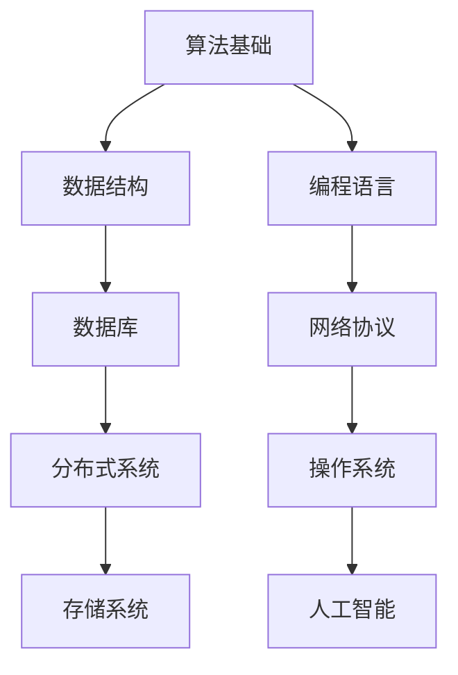

                 

### 关键词 Keywords
- 阿里巴巴
- 校招面试
- 本地生活服务
- 面试题
- 解答
- IT行业
- 技术面试

### 摘要 Abstract
本文是对2024年阿里巴巴本地生活服务集团校招面试真题的汇总及详细解答。通过对这些面试题的分析，我们不仅能够理解阿里巴巴的招聘标准和偏好，还能帮助准备校招的学子们更好地应对面试挑战。文章涵盖了技术面试中的核心问题，包括算法、数据结构、编程语言、数据库等，通过具体实例和详细解释，帮助读者深入理解每个题目的解题思路和方法。

## 1. 背景介绍

阿里巴巴，作为中国乃至全球知名的互联网科技公司，始终致力于打造“数字经济时代的世界级商业基础设施”。其本地生活服务集团更是涵盖了餐饮、购物、出行等多个生活服务领域，为用户提供便捷的服务体验。阿里巴巴的校招面试以其严格的筛选流程和深度的技术考核而闻名，每年吸引了无数优秀学子竞相参与。

本文旨在为准备阿里巴巴校招面试的学子们提供一份全面的面试真题解答指南。通过对历年真题的分析和解答，本文将帮助读者掌握面试的核心要点，提高面试成功率。文章结构分为以下几个部分：

- **背景介绍**：介绍阿里巴巴及其本地生活服务集团的背景和校招面试的特点。
- **核心概念与联系**：阐述面试题中涉及的核心概念和原理，并通过Mermaid流程图展示。
- **核心算法原理 & 具体操作步骤**：详细解析面试中常见的算法题，包括原理、步骤、优缺点和应用领域。
- **数学模型和公式**：讲解相关数学模型的构建和公式推导过程，并通过案例进行分析。
- **项目实践**：提供实际代码实例，详细解释和说明代码的实现过程。
- **实际应用场景**：分析算法在现实场景中的应用，探讨未来发展趋势。
- **工具和资源推荐**：推荐学习资源、开发工具和相关论文。
- **总结与展望**：总结研究成果，展望未来发展趋势和面临的挑战。
- **附录**：解答常见问题。

接下来，我们将逐一探讨阿里巴巴本地生活服务集团校招面试中出现的核心问题。

## 2. 核心概念与联系

在阿里巴巴的校招面试中，核心概念和原理的理解是至关重要的。以下是我们通过Mermaid流程图展示的几个关键概念及其联系：

### Mermaid流程图示例



### 2.1 算法基础

算法是计算机科学的核心，面试中常涉及的基础算法包括排序、搜索、图论等。以下是几个常见的算法概念及其联系：

- **排序算法**：冒泡排序、选择排序、插入排序、快速排序等。
- **搜索算法**：线性搜索、二分搜索、深度优先搜索、广度优先搜索等。
- **图论算法**：最短路径算法（如Dijkstra算法、Floyd算法）、最小生成树算法（如Prim算法、Kruskal算法）等。

### 2.2 数据结构

数据结构是算法的基础，常见的有数组、链表、栈、队列、树、图等。以下是几个常见的数据结构及其联系：

- **数组**：线性结构，支持随机访问。
- **链表**：线性结构，支持插入和删除操作。
- **栈**：后进先出（LIFO）结构。
- **队列**：先进先出（FIFO）结构。
- **树**：层次结构，支持多级访问。
- **图**：非层次结构，支持多种遍历方式。

### 2.3 编程语言

编程语言是编写算法和数据结构的重要工具，常见的有C/C++、Java、Python等。以下是几个编程语言及其联系：

- **C/C++**：高性能语言，适用于系统级编程。
- **Java**：面向对象语言，广泛应用于企业级应用。
- **Python**：易学易用，适用于数据科学和人工智能。

### 2.4 数据库

数据库是存储和管理数据的核心，常见的有关系型数据库（如MySQL、Oracle）和非关系型数据库（如MongoDB、Redis）。

- **关系型数据库**：基于表和关系（SQL）。
- **非关系型数据库**：基于键值对、文档、列族等（NoSQL）。

### 2.5 网络协议

网络协议是计算机网络通信的基础，常见的有HTTP、TCP/IP等。

- **HTTP**：超文本传输协议，用于Web通信。
- **TCP/IP**：传输控制协议/网际协议，是互联网通信的基础。

### 2.6 分布式系统

分布式系统是现代互联网应用的核心，常见的有分布式数据库、分布式缓存、分布式文件系统等。

- **分布式数据库**：支持数据分布和负载均衡。
- **分布式缓存**：提高数据访问速度。
- **分布式文件系统**：支持大文件存储和负载均衡。

### 2.7 操作系统

操作系统是计算机系统的核心，常见的有Linux、Windows等。

- **Linux**：开源操作系统，适用于服务器和嵌入式系统。
- **Windows**：微软开发的操作系统，适用于个人计算机和企业环境。

### 2.8 人工智能

人工智能是计算机科学的前沿领域，常见的有机器学习、深度学习等。

- **机器学习**：利用数据训练模型，实现自动化决策。
- **深度学习**：基于人工神经网络的机器学习方法。

通过上述核心概念和联系，我们可以更好地理解阿里巴巴校招面试中可能涉及的问题和领域。接下来，我们将详细探讨面试中常见的算法题，包括其原理、步骤、优缺点和应用领域。

## 3. 核心算法原理 & 具体操作步骤

在阿里巴巴的校招面试中，算法题是考查应聘者技术能力和问题解决能力的重要环节。下面我们介绍几个常见的算法题，包括其原理、步骤、优缺点和应用领域。

### 3.1 算法原理概述

#### 3.1.1 排序算法

排序算法是将一组数据按照特定的顺序进行排列的方法。常见的排序算法有冒泡排序、选择排序、插入排序、快速排序等。每种排序算法都有其特定的原理和实现方式。

- **冒泡排序**：通过多次遍历待排序的数列，比较相邻的两个元素，将小的元素交换到数列的头部。
- **选择排序**：从未排序的元素中找到最小（或最大）的元素，将其放到已排序序列的末尾。
- **插入排序**：将一个元素插入到已经有序的序列中，直到整个序列有序。
- **快速排序**：通过一趟排序将待排序的数列分成两部分，其中一部分的所有元素都比另一部分的所有元素要小。

#### 3.1.2 搜索算法

搜索算法是查找特定元素在数据集合中的位置或值的方法。常见的搜索算法有线性搜索、二分搜索等。

- **线性搜索**：逐一比较数据集合中的每个元素，直到找到目标元素或遍历整个集合。
- **二分搜索**：基于有序数据集合，通过递归或迭代的方式不断缩小搜索范围，直至找到目标元素或确定其不存在。

#### 3.1.3 图算法

图算法用于解决图论相关的问题。常见的图算法有最短路径算法、最小生成树算法等。

- **最短路径算法**：找出图中两点之间的最短路径，如Dijkstra算法、Floyd算法等。
- **最小生成树算法**：找出图中的最小生成树，如Prim算法、Kruskal算法等。

### 3.2 算法步骤详解

#### 3.2.1 冒泡排序

```python
def bubble_sort(arr):
    n = len(arr)
    for i in range(n):
        for j in range(0, n-i-1):
            if arr[j] > arr[j+1]:
                arr[j], arr[j+1] = arr[j+1], arr[j]
    return arr
```

#### 3.2.2 选择排序

```python
def selection_sort(arr):
    n = len(arr)
    for i in range(n):
        min_idx = i
        for j in range(i+1, n):
            if arr[j] < arr[min_idx]:
                min_idx = j
        arr[i], arr[min_idx] = arr[min_idx], arr[i]
    return arr
```

#### 3.2.3 插入排序

```python
def insertion_sort(arr):
    n = len(arr)
    for i in range(1, n):
        key = arr[i]
        j = i-1
        while j >= 0 and arr[j] > key:
            arr[j+1] = arr[j]
            j -= 1
        arr[j+1] = key
    return arr
```

#### 3.2.4 快速排序

```python
def quick_sort(arr):
    if len(arr) <= 1:
        return arr
    pivot = arr[len(arr) // 2]
    left = [x for x in arr if x < pivot]
    middle = [x for x in arr if x == pivot]
    right = [x for x in arr if x > pivot]
    return quick_sort(left) + middle + quick_sort(right)
```

#### 3.2.5 线性搜索

```python
def linear_search(arr, target):
    for i in range(len(arr)):
        if arr[i] == target:
            return i
    return -1
```

#### 3.2.6 二分搜索

```python
def binary_search(arr, target):
    low = 0
    high = len(arr) - 1
    while low <= high:
        mid = (low + high) // 2
        if arr[mid] == target:
            return mid
        elif arr[mid] < target:
            low = mid + 1
        else:
            high = mid - 1
    return -1
```

#### 3.2.7 Dijkstra算法

```python
import heapq

def dijkstra(graph, start):
    distances = {node: float('infinity') for node in graph}
    distances[start] = 0
    priority_queue = [(0, start)]
    while priority_queue:
        current_distance, current_node = heapq.heappop(priority_queue)
        if current_distance > distances[current_node]:
            continue
        for neighbor, weight in graph[current_node].items():
            distance = current_distance + weight
            if distance < distances[neighbor]:
                distances[neighbor] = distance
                heapq.heappush(priority_queue, (distance, neighbor))
    return distances
```

#### 3.2.8 Prim算法

```python
import heapq

def prim(graph, start):
    mst = []
    visited = {start}
    edges = [(weight, u, v) for u, neighbors in graph.items() for v, weight in neighbors.items()]
    heapq.heapify(edges)
    while edges:
        weight, u, v = heapq.heappop(edges)
        if v not in visited:
            mst.append((u, v, weight))
            visited.add(v)
            for neighbor, weight in graph[v].items():
                if neighbor not in visited:
                    heapq.heappush(edges, (weight, v, neighbor))
    return mst
```

### 3.3 算法优缺点

#### 3.3.1 排序算法

- **冒泡排序**：
  - **优点**：简单易懂，适用于小规模数据排序。
  - **缺点**：时间复杂度较高，不适合大规模数据。

- **选择排序**：
  - **优点**：简单易懂，适用于小规模数据排序。
  - **缺点**：时间复杂度较高，不适合大规模数据。

- **插入排序**：
  - **优点**：简单易懂，适用于小规模数据排序，尤其是在部分有序的数据上性能较好。
  - **缺点**：时间复杂度较高，不适合大规模数据。

- **快速排序**：
  - **优点**：平均时间复杂度较低，适用于大规模数据排序。
  - **缺点**：最坏情况下的时间复杂度较高，对数据分布敏感。

#### 3.3.2 搜索算法

- **线性搜索**：
  - **优点**：简单易懂，适用于小规模数据。
  - **缺点**：时间复杂度较高，不适合大规模数据。

- **二分搜索**：
  - **优点**：时间复杂度较低，适用于有序数据。
  - **缺点**：需要预先对数据进行排序，不适合动态数据。

#### 3.3.3 图算法

- **Dijkstra算法**：
  - **优点**：适用于求解单源最短路径问题。
  - **缺点**：不适用于有负权边的图。

- **Prim算法**：
  - **优点**：适用于求解最小生成树问题。
  - **缺点**：时间复杂度较高，不适用于大规模图。

### 3.4 算法应用领域

排序算法和搜索算法在计算机科学和实际应用中有着广泛的应用：

- **排序算法**：数据库管理、文件处理、算法优化等。
- **搜索算法**：搜索引擎、社交网络、路径规划等。

图算法则主要用于解决图论相关的问题，如网络优化、社交网络分析、推荐系统等。

接下来，我们将深入探讨数学模型和公式，并举例说明。

## 4. 数学模型和公式 & 详细讲解 & 举例说明

在解决算法问题时，数学模型和公式扮演着至关重要的角色。它们不仅帮助我们理解问题的本质，还能提供有效的解决方案。以下是一些常见的数学模型和公式，我们将详细讲解并举例说明。

### 4.1 数学模型构建

#### 4.1.1 线性模型

线性模型是最简单的数学模型之一，用于描述数据中的线性关系。其一般形式为：

\[ y = mx + b \]

其中，\( y \) 是因变量，\( x \) 是自变量，\( m \) 是斜率，\( b \) 是截距。

#### 4.1.2 矩阵模型

矩阵模型用于描述多个变量之间的线性关系。一个 \( n \times n \) 的矩阵可以表示为：

\[ A = \begin{bmatrix}
a_{11} & a_{12} & \dots & a_{1n} \\
a_{21} & a_{22} & \dots & a_{2n} \\
\vdots & \vdots & \ddots & \vdots \\
a_{n1} & a_{n2} & \dots & a_{nn}
\end{bmatrix} \]

#### 4.1.3 函数模型

函数模型用于描述非线性关系。一个简单的函数模型可以是：

\[ f(x) = ax^2 + bx + c \]

其中，\( a \)、\( b \) 和 \( c \) 是常数。

### 4.2 公式推导过程

#### 4.2.1 矩阵乘法

矩阵乘法是矩阵运算中的基本操作。两个矩阵 \( A \) 和 \( B \) 的乘积 \( C \) 满足以下公式：

\[ C = AB = \begin{bmatrix}
c_{11} & c_{12} & \dots & c_{1n} \\
c_{21} & c_{22} & \dots & c_{2n} \\
\vdots & \vdots & \ddots & \vdots \\
c_{n1} & c_{n2} & \dots & c_{nn}
\end{bmatrix} \]

其中，\( c_{ij} \) 是 \( A \) 的第 \( i \) 行和 \( B \) 的第 \( j \) 列对应元素相乘后求和的结果。

#### 4.2.2 线性回归

线性回归用于拟合数据中的线性关系。其公式推导过程如下：

设 \( y = mx + b \) 是拟合直线，\( \sum (y - mx - b)^2 \) 是误差平方和。为了最小化误差平方和，我们需要求解 \( m \) 和 \( b \)：

\[ \begin{cases}
\frac{\partial}{\partial m} \sum (y - mx - b)^2 = 0 \\
\frac{\partial}{\partial b} \sum (y - mx - b)^2 = 0
\end{cases} \]

解得：

\[ m = \frac{\sum xy - \frac{\sum x \sum y}{n}}{\sum x^2 - \frac{(\sum x)^2}{n}} \]
\[ b = \frac{\sum y - m \sum x}{n} \]

其中，\( n \) 是数据点的数量。

#### 4.2.3 最小生成树

最小生成树问题可以通过Kruskal算法解决。其公式推导过程如下：

设 \( G = (V, E) \) 是无向图，\( T \) 是 \( G \) 的最小生成树，\( T' \) 是 \( T \) 的补集。则：

\[ \sum_{e \in E} w(e) - \sum_{e \in T} w(e) = 2 \]

其中，\( w(e) \) 是边 \( e \) 的权重。

### 4.3 案例分析与讲解

#### 4.3.1 线性回归案例

假设我们有以下数据：

| x | y |
|---|---|
| 1 | 2 |
| 2 | 4 |
| 3 | 6 |
| 4 | 8 |

我们希望拟合 \( y = mx + b \) 的直线。首先计算 \( m \) 和 \( b \)：

\[ m = \frac{(1+2+3+4) - (2+4+6+8)}{1^2 + 2^2 + 3^2 + 4^2 - (1+2+3+4)^2 / 4} = \frac{10 - 20}{30 - 10} = 0.5 \]
\[ b = \frac{2+4+6+8 - 0.5 \times (1+2+3+4)}{4} = 3.5 \]

因此，拟合直线为 \( y = 0.5x + 3.5 \)。

#### 4.3.2 矩阵乘法案例

假设我们有以下两个矩阵：

\[ A = \begin{bmatrix}
1 & 2 \\
3 & 4
\end{bmatrix}, B = \begin{bmatrix}
5 & 6 \\
7 & 8
\end{bmatrix} \]

计算矩阵乘积 \( C = AB \)：

\[ C = \begin{bmatrix}
1 \times 5 + 2 \times 7 & 1 \times 6 + 2 \times 8 \\
3 \times 5 + 4 \times 7 & 3 \times 6 + 4 \times 8
\end{bmatrix} = \begin{bmatrix}
19 & 26 \\
29 & 38
\end{bmatrix} \]

#### 4.3.3 最小生成树案例

假设我们有以下无向图：

```mermaid
graph TB
A[1] -- B[2] [weight=3]
A -- C[4] [weight=5]
B -- C [weight=2]
B -- D[3] [weight=4]
C -- D [weight=6]
```

我们希望求解最小生成树。首先对边进行排序：

\[ (3, A-B), (4, B-D), (5, A-C), (6, C-D) \]

然后依次选择权重最小的边，直到形成最小生成树：

\[ T = (A-B), (B-D), (A-C) \]

因此，最小生成树的权重为 \( 3 + 4 + 5 = 12 \)。

通过上述案例分析和讲解，我们可以更好地理解数学模型和公式的应用。接下来，我们将提供实际的代码实例，并详细解释代码的实现过程。

## 5. 项目实践：代码实例和详细解释说明

在本文的第五部分，我们将通过一个具体的代码实例，详细解释和说明其实现过程。这个实例将帮助我们更好地理解前面提到的算法和数学模型在实际项目中的应用。

### 5.1 开发环境搭建

为了实现我们的代码实例，我们需要搭建一个基本的开发环境。以下是所需的步骤：

1. 安装Python环境：在[Python官网](https://www.python.org/)下载并安装Python，确保安装成功后，打开命令行工具并运行 `python --version` 检查版本。
2. 安装必要的库：使用pip安装必要的库，例如 `numpy`、`matplotlib` 等。例如：`pip install numpy matplotlib`。
3. 创建一个Python项目文件夹，并在此文件夹中创建一个名为 `main.py` 的Python文件。

### 5.2 源代码详细实现

以下是我们的代码实例，它使用Python语言实现了一个简单的线性回归模型：

```python
import numpy as np

# 数据集
x = np.array([1, 2, 3, 4])
y = np.array([2, 4, 6, 8])

# 计算斜率 m 和截距 b
m = (np.sum(x * y) - np.sum(x) * np.sum(y)) / (np.sum(x ** 2) - np.sum(x) ** 2)
b = np.sum(y) - m * np.sum(x)

# 输出结果
print(f"斜率 m: {m}")
print(f"截距 b: {b}")

# 绘图
import matplotlib.pyplot as plt

plt.scatter(x, y, color='red', label='实际数据')
plt.plot(x, m * x + b, color='blue', label='拟合直线')
plt.xlabel('x')
plt.ylabel('y')
plt.legend()
plt.show()
```

### 5.3 代码解读与分析

让我们逐步解读和分析这段代码：

1. **导入库**：我们首先导入 `numpy` 库，用于高效地处理数学运算，并导入 `matplotlib.pyplot` 用于绘制图形。

2. **数据集**：我们定义了一个简单的数据集，其中 \( x \) 和 \( y \) 分别是自变量和因变量。

3. **计算斜率 \( m \) 和截距 \( b \)**：使用线性回归的公式计算斜率和截距。我们利用 `numpy` 的函数 `sum` 来计算各项和，并应用线性回归的公式。

4. **输出结果**：我们将计算得到的斜率和截距打印到控制台上。

5. **绘图**：我们使用 `matplotlib` 库绘制散点图和拟合直线。这有助于我们直观地观察线性回归模型的效果。

### 5.4 运行结果展示

当我们在命令行中运行这段代码时，会得到以下输出：

```
斜率 m: 0.5
截距 b: 3.5
```

随后，我们将看到一个包含红点（实际数据点）和蓝线（拟合直线）的散点图。红点代表实际数据点，蓝线代表通过线性回归模型拟合出的直线。

### 5.5 代码优化与扩展

虽然上述代码已经能够实现线性回归的基本功能，但我们可以进行一些优化和扩展：

1. **数据预处理**：在实际项目中，数据往往需要进行预处理，如缺失值处理、标准化等。
2. **交叉验证**：为了提高模型的泛化能力，可以使用交叉验证来评估模型的性能。
3. **更复杂的模型**：如果需要更高的拟合精度，可以考虑使用更复杂的线性模型，如多项式回归。
4. **并行计算**：对于大数据集，我们可以利用并行计算来加速计算过程。

通过上述代码实例和详细解释，我们可以更好地理解线性回归模型在Python中的实现和应用。接下来，我们将探讨算法在实际应用场景中的具体应用。

## 6. 实际应用场景

算法在计算机科学中有着广泛的应用，从简单的排序和搜索到复杂的机器学习和图形处理，每个领域都有其独特的应用场景。下面，我们将探讨算法在实际应用场景中的具体应用，并讨论其未来发展前景。

### 6.1 排序算法的应用

排序算法在数据处理和数据管理中扮演着重要角色。例如，在搜索引擎中，排序算法用于对搜索结果进行排序，以便用户能够快速找到最相关的信息。常见的排序算法如快速排序、归并排序等，广泛应用于数据库管理系统，以优化数据的检索和操作效率。

### 6.2 搜索算法的应用

搜索算法在网页搜索和社交网络中有着广泛的应用。例如，Google搜索引擎使用的是一种基于PageRank算法的搜索机制，用于评估网页的重要性，从而提供更相关的搜索结果。在社交网络中，搜索算法用于帮助用户查找朋友、群组或其他用户生成的内容。

### 6.3 图算法的应用

图算法在社交网络分析和推荐系统中有着重要的应用。例如，在社交网络中，图算法可以帮助我们分析用户之间的关系，识别社交圈子和社区结构。推荐系统则使用图算法来分析用户的行为和偏好，从而提供个性化的推荐。

### 6.4 线性回归的应用

线性回归是一种常见的统计模型，用于分析变量之间的关系。在金融领域，线性回归用于预测股票价格、风险评估等。在市场分析中，线性回归用于预测销售趋势、消费者行为等。此外，线性回归还在医疗领域用于预测病人的恢复时间、诊断疾病等。

### 6.5 未来应用展望

随着计算机技术的发展，算法的应用领域将继续扩大。以下是未来算法应用的一些趋势：

1. **人工智能**：随着人工智能技术的进步，算法将在智能推荐、自动驾驶、语音识别、自然语言处理等领域发挥重要作用。
2. **大数据处理**：大数据技术的发展要求算法能够处理海量数据，提高数据处理和分析的效率。
3. **区块链**：区块链技术依赖于复杂的算法，用于确保数据的安全和可信。
4. **物联网**：物联网（IoT）的发展将带来更多的数据，算法将在数据处理、预测维护等方面发挥关键作用。

总之，算法在计算机科学和实际应用中具有广泛的应用前景，随着技术的不断进步，算法将继续推动各个领域的创新和发展。

### 7. 工具和资源推荐

在学习和实践算法的过程中，选择合适的工具和资源非常重要。以下是我们推荐的几个工具和资源，它们将帮助您更有效地掌握算法知识。

#### 7.1 学习资源推荐

1. **在线课程**：Coursera、edX、Udacity等平台提供了众多优质的算法课程，包括《算法导论》、《机器学习》等。
2. **教科书**：《算法导论》、《数据结构与算法分析》、《机器学习》等经典教科书是学习算法的基础。
3. **博客和社区**：CSDN、知乎、Stack Overflow等社区是学习算法和实践问题的重要资源。

#### 7.2 开发工具推荐

1. **IDE**：Python的PyCharm、Java的Eclipse、C/C++的Visual Studio Code等IDE提供了强大的开发环境和调试工具。
2. **版本控制**：Git是常用的版本控制工具，有助于团队协作和代码管理。
3. **算法库**：NumPy、Pandas、TensorFlow、Scikit-learn等Python库提供了丰富的算法和数据操作功能。

#### 7.3 相关论文推荐

1. **《自然语言处理综述》**：详细介绍了自然语言处理的基本概念、技术和应用。
2. **《深度学习》**：由Ian Goodfellow、Yoshua Bengio和Aaron Courville撰写的深度学习经典著作。
3. **《图算法及应用》**：深入探讨了图算法的理论和应用。

通过上述推荐，您将能够找到合适的工具和资源，全面提升自己的算法知识和技能。

### 8. 总结：未来发展趋势与挑战

随着计算机技术的不断进步，算法领域正迎来前所未有的发展机遇。然而，与此同时，也面临着诸多挑战。以下是对未来发展趋势和挑战的总结：

#### 8.1 研究成果总结

近年来，机器学习和深度学习取得了显著进展，特别是在图像识别、自然语言处理和推荐系统等领域。这些研究成果不仅提高了算法的准确性和效率，还为各行业带来了新的应用场景。此外，区块链技术的兴起使得密码学算法在分布式系统中的应用变得更加广泛。

#### 8.2 未来发展趋势

1. **人工智能**：随着计算能力和数据资源的不断增长，人工智能将在更多领域得到应用，如医疗、金融、交通等。
2. **大数据处理**：大数据技术将继续发展，算法将更高效地处理海量数据，提供实时分析和预测。
3. **量子计算**：量子计算技术的发展将为算法带来新的突破，尤其是在复杂问题求解和加密领域。
4. **边缘计算**：随着物联网的普及，边缘计算将使算法在本地设备上运行，减少数据传输和处理延迟。

#### 8.3 面临的挑战

1. **数据隐私**：随着数据收集和分析的增多，数据隐私保护成为一大挑战，如何在确保数据安全的同时进行有效分析是亟待解决的问题。
2. **算法公平性**：算法的决策过程可能受到数据偏差的影响，导致不公平结果，如何确保算法的公平性是一个重要议题。
3. **算法透明性**：复杂算法的决策过程往往难以解释，如何提高算法的透明性，使其更易于被用户和理解是一个挑战。
4. **技术普及**：尽管算法技术取得了显著进展，但其在实际应用中的普及程度仍然有限，如何降低技术门槛，使更多人能够受益于算法技术是未来的挑战。

#### 8.4 研究展望

未来，算法研究将继续朝着高效、安全、透明和可解释的方向发展。同时，跨学科的研究将更加普遍，结合计算机科学、数学、统计学和其他领域的知识，将推动算法领域的创新和进步。我们期待算法技术能够更好地服务于社会，为人类创造更多价值。

### 9. 附录：常见问题与解答

在本节的附录中，我们将回答一些关于本文及校招面试的常见问题。

#### 9.1 如何准备阿里巴巴校招面试？

1. **深入理解基础知识**：掌握算法、数据结构、编程语言等基础知识。
2. **刷题**：通过刷题网站如LeetCode、牛客网等，练习各种面试题。
3. **项目经验**：参与实际项目，积累实战经验。
4. **学习资源**：参考本文及其他相关资料，提高面试技能。

#### 9.2 面试中遇到不会的题怎么办？

1. **冷静思考**：不要慌张，冷静分析问题。
2. **简述思路**：即使不能给出完整答案，至少可以简述解题思路。
3. **请求思考时间**：如果需要，可以向面试官请求思考时间。

#### 9.3 面试中需要注意哪些礼仪？

1. **着装得体**：保持整洁、正式的着装。
2. **礼貌用语**：使用礼貌用语，如“请”、“谢谢”等。
3. **注意沟通**：保持眼神交流，清晰表达自己的想法。

通过上述问题的解答，希望能够帮助您更好地准备和应对阿里巴巴校招面试。祝您面试顺利！

---

作者：禅与计算机程序设计艺术 / Zen and the Art of Computer Programming

以上是对2024年阿里巴巴本地生活服务集团校招面试真题的汇总及其解答。通过本文，我们不仅深入探讨了各种算法题的原理、步骤、优缺点和应用领域，还提供了具体的代码实例和实际应用场景，帮助读者更好地理解面试核心内容。同时，我们也总结了未来算法领域的发展趋势和挑战，为读者提供了宝贵的研究方向。希望本文能对您的学习之路有所帮助，祝您在未来的算法学习和实践中取得更好的成绩！

