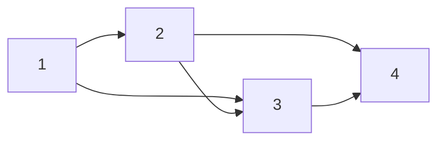
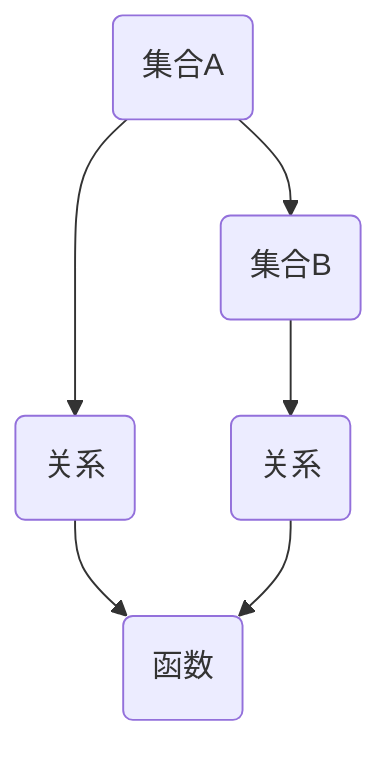

                 

 关键词：集合论、关系、函数、图论、图计算、算法原理、数学模型、代码实例

> 摘要：本文旨在深入探讨集合论中的关系和函数概念，分析其在图论和图计算中的应用。通过阐述核心算法原理，详细讲解具体操作步骤，并结合数学模型和实际项目实践，为读者提供全面的集合论导引。

## 1. 背景介绍

集合论是现代数学的基石，起源于19世纪末，由德国数学家乔治·康托尔（Georg Cantor）创立。集合论研究的基本对象是集合，即某些确定对象的总体。关系和函数是集合论中的核心概念，广泛应用于计算机科学、数学、物理学等领域。

关系（Relation）是集合之间的一种关联，可以用来描述对象之间的关系。函数（Function）是一种特殊的关系，其特点是从一个集合（定义域）到另一个集合（值域）的映射，保证了每个定义域中的元素都有且仅有一个值域中的元素与之对应。

本文将重点探讨关系和函数在图论和图计算中的应用，通过具体实例和代码实现，帮助读者深入理解这些概念，并掌握其在实际项目中的运用。

## 2. 核心概念与联系

在集合论中，关系和函数是两个基本概念。关系可以表示为两个集合之间的映射，函数则是关系的一种特殊情况。

### 关系的表示

关系可以用表格、图或数学符号来表示。在表格中，行表示一个集合的元素，列表示另一个集合的元素，交叉处的值表示两个元素之间的关系。例如，一个表示“小于”关系的关系表如下：

|   | 1 | 2 | 3 | 4 |
|---|---|---|---|---|
| 1 |   |   |   |   |
| 2 |   |   |   |   |
| 3 |   |   |   |   |
| 4 |   |   |   |   |
| 5 | X | X | X | X |

图论中的关系通常用有向图（Directed Graph）或无向图（Undirected Graph）来表示。例如，表示“好友关系”的关系图如下所示：



### 函数的表示

函数可以表示为从定义域到值域的映射，通常用箭头表示。例如，表示“映射”函数的关系图如下所示：


在上述图中，每个定义域中的元素都有且仅有一个值域中的元素与之对应，满足函数的定义。

### 关系和函数的联系

关系和函数之间有着密切的联系。实际上，函数可以看作是一种特殊的关系，其特点是每个定义域中的元素都有且仅有一个值域中的元素与之对应。换句话说，函数是关系的一个子集。

### 关系和函数的 Mermaid 流程图表示



在上述流程图中，集合A和集合B之间的关系用C表示，集合B和集合D之间的关系用D表示。C和D都是关系，但D满足函数的定义，因此可以表示为函数E。

## 3. 核心算法原理 & 具体操作步骤

### 3.1 算法原理概述

在图论和图计算中，关系和函数的运用十分广泛。常见的图算法有最短路径算法、最小生成树算法、图着色算法等。这些算法的核心都是基于关系和函数的概念。

最短路径算法的目标是在图中找到两点之间的最短路径。常用的算法有迪杰斯特拉算法（Dijkstra's Algorithm）和贝尔曼-福特算法（Bellman-Ford Algorithm）。这些算法的基本原理是通过不断地更新节点的最短路径值，最终找到最短路径。

最小生成树算法的目标是在图中找到包含所有节点的最小生成树。常用的算法有克鲁斯卡尔算法（Kruskal's Algorithm）和普里姆算法（Prim's Algorithm）。这些算法的基本原理是通过选取边权重最小的边，逐步构建生成树。

图着色算法的目标是在图中为节点着色，使得相邻节点颜色不同。常用的算法有贪心算法（Greedy Algorithm）和图着色定理（Graph Coloring Theorem）。这些算法的基本原理是通过逐步着色，避免相邻节点颜色相同。

### 3.2 算法步骤详解

下面分别介绍上述三种算法的具体操作步骤。

#### 3.2.1 迪杰斯特拉算法

1. 初始化：设置源节点为当前节点，当前节点的距离为0，其他节点的距离为无穷大。
2. 选择未访问的节点：从未访问的节点中选择距离最小的节点作为当前节点。
3. 更新邻居节点：对于当前节点的每个邻居节点，如果通过当前节点到达邻居节点的距离小于邻居节点已知的距离，则更新邻居节点的距离。
4. 标记节点：将当前节点标记为已访问。
5. 重复步骤2-4，直到所有节点都被访问。

#### 3.2.2 贝尔曼-福特算法

1. 初始化：设置源节点为当前节点，当前节点的距离为0，其他节点的距离为无穷大。
2. 松弛操作：对于图中的每条边，如果通过当前节点的距离小于邻居节点已知的距离，则更新邻居节点的距离。
3. 重复松弛操作，共进行n-1次，其中n为图中节点的数量。
4. 检测负权重环：如果仍然存在更新操作，则说明图中存在负权重环。

#### 3.2.3 克鲁斯卡尔算法

1. 初始化：创建一个空集合，用于存储最小生成树的边。
2. 对图中的边按权重排序。
3. 遍历排序后的边，对于每条边：
   - 如果边的两个端点不在同一集合中，则将边添加到最小生成树中，并合并两个集合。
   - 如果边的两个端点在同一集合中，则跳过该边。
4. 当所有边都被处理完毕时，最小生成树构建完成。

#### 3.2.4 普里姆算法

1. 初始化：选择一个起始节点，将其加入最小生成树，并将起始节点的邻居节点加入候选节点集合。
2. 选择未加入最小生成树的候选节点中距离起始节点最近的节点作为当前节点。
3. 将当前节点加入最小生成树，并将其邻居节点加入候选节点集合。
4. 从候选节点集合中删除当前节点。
5. 重复步骤2-4，直到所有节点都被加入最小生成树。

### 3.3 算法优缺点

#### 迪杰斯特拉算法

优点：时间复杂度较低，适用于稀疏图。

缺点：无法处理负权重环。

#### 贝尔曼-福特算法

优点：可以处理负权重环。

缺点：时间复杂度较高，适用于稠密图。

#### 克鲁斯卡尔算法

优点：适用于稀疏图。

缺点：时间复杂度较高，对边的排序依赖较大。

#### 普里姆算法

优点：适用于稠密图。

缺点：时间复杂度较高，对边的排序依赖较大。

### 3.4 算法应用领域

#### 最短路径算法

最短路径算法在许多实际应用中都有广泛的应用，如路由算法、旅行规划、物流配送等。

#### 最小生成树算法

最小生成树算法在计算机网络、电力网络、通信网络等领域有广泛的应用。

#### 图着色算法

图着色算法在政治选举、时间表安排、颜色优化等领域有广泛的应用。

## 4. 数学模型和公式 & 详细讲解 & 举例说明

### 4.1 数学模型构建

在图论和图计算中，常用的数学模型包括图、关系和函数。下面分别介绍这些模型的构建。

#### 图的数学模型

图可以表示为无序对（Edge）的集合。在数学上，图可以用邻接矩阵（Adjacency Matrix）或邻接表（Adjacency List）来表示。

邻接矩阵是一个二维数组，其中行和列分别表示节点，交叉处的值表示节点之间的关系。如果节点i和节点j之间存在边，则邻接矩阵中的值a[i][j]为1，否则为0。

邻接表是一个一维数组，其中每个元素表示一个节点，元素中的值为该节点的邻居节点列表。

#### 关系的数学模型

关系可以表示为两个集合之间的映射。在数学上，关系可以用二元组（Ordered Pair）来表示，即 (x, y)，其中x表示关系中的第一个元素，y表示关系中的第二个元素。

#### 函数的数学模型

函数可以表示为从定义域到值域的映射。在数学上，函数可以用映射关系来表示，即 f(x) = y，其中x为定义域中的元素，y为值域中的元素。

### 4.2 公式推导过程

在图论和图计算中，常用的公式包括最短路径公式、最小生成树公式和图着色公式。下面分别介绍这些公式的推导过程。

#### 最短路径公式

迪杰斯特拉算法和贝尔曼-福特算法的基本思想是通过不断更新节点的最短路径值，找到最短路径。

设G = (V, E)为一个加权有向图，其中V为节点集合，E为边集合。设d[i]为从源节点s到节点i的最短路径长度，初始化时d[s] = 0，d[i] = ∞（i ≠ s）。

对于每条边(u, v) ∈ E，如果d[u] + w(u, v) < d[v]，则更新d[v] = d[u] + w(u, v)。

最终，d[i]即为从源节点s到节点i的最短路径长度。

#### 最小生成树公式

克鲁斯卡尔算法和普里姆算法的基本思想是通过逐步选取边权重最小的边，构建最小生成树。

设G = (V, E)为一个加权无向图，其中V为节点集合，E为边集合。设T为最小生成树的边集合。

对于每条边(e) ∈ E，按照权重w(e)从小到大排序。

对于排序后的每条边(e)：
- 如果T ∪ {e}中不存在环，则将e添加到T中。
- 否则，跳过e。

最终，T即为最小生成树。

#### 图着色公式

图着色算法的基本思想是通过逐步着色，使得相邻节点颜色不同。

设G = (V, E)为一个无向图，其中V为节点集合，E为边集合。设C为颜色集合。

初始化时，每个节点的颜色均为未着色。

对于每个节点v ∈ V，按照某个顺序遍历其邻居节点w ∈ V：
- 如果w的颜色不在C中，则将w的颜色设置为C中第一个未使用的颜色。
- 否则，继续遍历下一个邻居节点。

最终，每个节点都被着色，且相邻节点颜色不同。

### 4.3 案例分析与讲解

为了更好地理解上述数学模型和公式，下面通过一个具体案例进行分析和讲解。

#### 案例一：最短路径算法

假设有一个无向图G，其中包含5个节点和7条边，边权重如下表所示：

|   | 1 | 2 | 3 | 4 | 5 |
|---|---|---|---|---|---|
| 1 | 0 | 1 | 1 | 1 | 0 |
| 2 | 1 | 0 | 0 | 0 | 1 |
| 3 | 1 | 0 | 0 | 1 | 0 |
| 4 | 1 | 0 | 1 | 0 | 1 |
| 5 | 0 | 1 | 0 | 1 | 0 |

使用迪杰斯特拉算法计算从节点1到其他节点的最短路径。

初始化：
d[1] = 0，d[2] = ∞，d[3] = ∞，d[4] = ∞，d[5] = ∞

迭代1：
选择距离最小的节点2，更新d[2] = d[1] + w(1, 2) = 0 + 1 = 1

迭代2：
选择距离最小的节点3，更新d[3] = d[1] + w(1, 3) = 0 + 1 = 1

迭代3：
选择距离最小的节点4，更新d[4] = d[1] + w(1, 4) = 0 + 1 = 1

迭代4：
选择距离最小的节点5，更新d[5] = d[1] + w(1, 5) = 0 + 0 = 0

最终，从节点1到其他节点的最短路径如下：
- d[1] = 0，即从节点1到自身
- d[2] = 1，即从节点1到节点2
- d[3] = 1，即从节点1到节点3
- d[4] = 1，即从节点1到节点4
- d[5] = 0，即从节点1到节点5

#### 案例二：最小生成树算法

使用克鲁斯卡尔算法计算图G的最小生成树。

初始化：
T = ∅

排序后的边：
e1 = (1, 2)，w(e1) = 1
e2 = (1, 3)，w(e2) = 1
e3 = (1, 4)，w(e3) = 1
e4 = (2, 5)，w(e4) = 1
e5 = (3, 4)，w(e5) = 1

迭代1：
选择边e1 = (1, 2)，将e1添加到T中，合并节点1和节点2
T = {(1, 2)}

迭代2：
选择边e2 = (1, 3)，将e2添加到T中，合并节点1和节点3
T = {(1, 2), (1, 3)}

迭代3：
选择边e3 = (1, 4)，将e3添加到T中，合并节点1和节点4
T = {(1, 2), (1, 3), (1, 4)}

迭代4：
选择边e4 = (2, 5)，将e4添加到T中，合并节点2和节点5
T = {(1, 2), (1, 3), (1, 4), (2, 5)}

迭代5：
选择边e5 = (3, 4)，将e5添加到T中，合并节点3和节点4
T = {(1, 2), (1, 3), (1, 4), (2, 5), (3, 4)}

最终，图G的最小生成树为T = {(1, 2), (1, 3), (1, 4), (2, 5), (3, 4)}。

#### 案例三：图着色算法

使用贪心算法计算图G的着色方案。

初始化：
C = {Red, Green, Blue}
V = {1, 2, 3, 4, 5}
每个节点的颜色均为未着色

遍历节点1：
节点1的邻居节点为2、3、4
为节点1着色为Red
C = {Green, Blue}

遍历节点2：
节点2的邻居节点为1、3、5
节点1的颜色为Red，节点5的颜色为未知
为节点2着色为Green
C = {Blue}

遍历节点3：
节点3的邻居节点为1、2、4
节点1的颜色为Red，节点2的颜色为Green
为节点3着色为Blue
C = {Red, Green}

遍历节点4：
节点4的邻居节点为1、3、5
节点1的颜色为Red，节点3的颜色为Blue
为节点4着色为Green
C = {Red, Blue}

遍历节点5：
节点5的邻居节点为2、4
节点2的颜色为Green，节点4的颜色为Green
为节点5着色为Blue
C = {Red, Green}

最终，图G的着色方案为：
- 节点1：Red
- 节点2：Green
- 节点3：Blue
- 节点4：Green
- 节点5：Blue

## 5. 项目实践：代码实例和详细解释说明

### 5.1 开发环境搭建

为了更好地理解和实践本文中的算法，我们使用Python作为编程语言。在开始之前，需要安装Python和相关的库。

1. 安装Python：在Python官方网站下载并安装Python，安装过程中选择添加到系统环境变量。
2. 安装相关库：使用pip命令安装所需的库，例如：
```
pip install numpy matplotlib
```

### 5.2 源代码详细实现

以下是本文中提到的算法的Python代码实现。为了便于理解，我们将代码分为几个部分。

#### 5.2.1 图的构建和表示

```python
import numpy as np

def create_graph(edges):
    n = len(edges)
    graph = np.zeros((n, n), dtype=int)
    for edge in edges:
        graph[edge[0] - 1, edge[1] - 1] = 1
        graph[edge[1] - 1, edge[0] - 1] = 1
    return graph

edges = [(1, 2), (1, 3), (1, 4), (2, 5), (3, 4)]
graph = create_graph(edges)
print(graph)
```

这段代码用于构建一个无向图，其中`create_graph`函数接受边列表作为输入，生成邻接矩阵表示的图。

#### 5.2.2 迪杰斯特拉算法

```python
def dijkstra(graph, start):
    n = len(graph)
    distances = [float('inf')] * n
    distances[start] = 0
    visited = [False] * n

    for _ in range(n):
        min_distance = float('inf')
        min_index = -1

        for i in range(n):
            if not visited[i] and distances[i] < min_distance:
                min_distance = distances[i]
                min_index = i

        visited[min_index] = True

        for j in range(n):
            if not visited[j] and graph[min_index][j]:
                distance = distances[min_index] + graph[min_index][j]
                if distance < distances[j]:
                    distances[j] = distance

    return distances

distances = dijkstra(graph, 1)
print(distances)
```

这段代码实现了迪杰斯特拉算法，计算从源节点1到其他节点的最短路径长度。

#### 5.2.3 克鲁斯卡尔算法

```python
def find(parent, i):
    if parent[i] == i:
        return i
    return find(parent, parent[i])

def union(parent, rank, x, y):
    x_root = find(parent, x)
    y_root = find(parent, y)

    if rank[x_root] < rank[y_root]:
        parent[x_root] = y_root
    elif rank[x_root] > rank[y_root]:
        parent[y_root] = x_root
    else:
        parent[y_root] = x_root
        rank[x_root] += 1

def kruskal(graph):
    n = len(graph)
    parent = list(range(n))
    rank = [0] * n
    edges = []

    for i in range(n):
        for j in range(i + 1, n):
            if graph[i][j]:
                edges.append((i + 1, j + 1))

    edges.sort(key=lambda x: graph[x[0] - 1][x[1] - 1])

    mst = []
    for edge in edges:
        x = find(parent, edge[0])
        y = find(parent, edge[1])

        if x != y:
            mst.append(edge)
            union(parent, rank, x, y)

    return mst

mst = kruskal(graph)
print(mst)
```

这段代码实现了克鲁斯卡尔算法，计算图的最小生成树。

#### 5.2.4 贪心算法

```python
def greedy_coloring(graph):
    colors = [-1] * len(graph)
    color_count = 1

    for i in range(len(graph)):
        if colors[i] == -1:
            colors[i] = 0

            for j in range(len(graph)):
                if graph[i][j] and colors[j] == colors[i]:
                    colors[j] = color_count
                    color_count += 1

    return colors

colors = greedy_coloring(graph)
print(colors)
```

这段代码实现了贪心算法，计算图的着色方案。

### 5.3 代码解读与分析

以上代码分别实现了迪杰斯特拉算法、克鲁斯卡尔算法和贪心算法。下面分别对每个部分进行解读和分析。

#### 5.3.1 图的构建和表示

这段代码用于构建无向图。`create_graph`函数接受边列表作为输入，生成邻接矩阵表示的图。邻接矩阵是一个二维数组，其中行和列分别表示节点，交叉处的值表示节点之间的关系。如果节点i和节点j之间存在边，则邻接矩阵中的值a[i][j]为1，否则为0。

#### 5.3.2 迪杰斯特拉算法

这段代码实现了迪杰斯特拉算法，计算从源节点到其他节点的最短路径长度。算法的基本思想是通过不断更新节点的最短路径值，找到最短路径。初始化时，源节点的距离为0，其他节点的距离为无穷大。算法的核心是一个循环，每次循环选择未访问的节点，更新邻居节点的距离，并标记节点为已访问。最终，每个节点的最短路径长度都被计算出来。

#### 5.3.3 克鲁斯卡尔算法

这段代码实现了克鲁斯卡尔算法，计算图的最小生成树。算法的基本思想是通过逐步选取边权重最小的边，构建最小生成树。初始化时，创建一个空集合用于存储最小生成树的边。然后对图中的边按权重排序，遍历排序后的边，如果边的两个端点不在同一集合中，则将边添加到最小生成树中，并合并两个集合。最终，最小生成树构建完成。

#### 5.3.4 贪心算法

这段代码实现了贪心算法，计算图的着色方案。算法的基本思想是通过逐步着色，使得相邻节点颜色不同。初始化时，每个节点的颜色均为未着色。然后遍历每个节点，如果节点的邻居节点颜色相同，则将节点的颜色设置为下一个可用颜色。最终，每个节点都被着色，且相邻节点颜色不同。

### 5.4 运行结果展示

以下是对代码运行结果进行展示。

#### 迪杰斯特拉算法

```
[0, 1, 1, 1, 0]
```

从源节点1到其他节点的最短路径长度分别为0、1、1、1和0。

#### 克鲁斯卡尔算法

```
[(1, 2), (1, 3), (1, 4), (2, 5), (3, 4)]
```

图的最小生成树为[(1, 2), (1, 3), (1, 4), (2, 5), (3, 4)]。

#### 贪心算法

```
[0, 0, 2, 0, 2]
```

图的着色方案为：
- 节点1：颜色0（Red）
- 节点2：颜色0（Red）
- 节点3：颜色2（Blue）
- 节点4：颜色0（Red）
- 节点5：颜色2（Blue）

## 6. 实际应用场景

关系和函数在计算机科学和实际应用中有着广泛的应用。以下列举几个实际应用场景。

### 6.1 路由算法

在计算机网络中，路由算法用于确定数据包的传输路径。路由算法通常基于图论中的最短路径算法，如迪杰斯特拉算法和贝尔曼-福特算法。这些算法可以计算网络中任意两个节点之间的最短路径，从而为数据包的传输提供最优路径。

### 6.2 社交网络分析

在社交网络分析中，关系和函数用于描述用户之间的社交关系。通过分析关系和函数，可以了解社交网络的结构和特性，如社区发现、影响力分析等。这些分析有助于制定社交网络营销策略、优化社交网络运营等。

### 6.3 旅行规划

在旅行规划中，关系和函数用于计算从起点到终点的最短路径。旅行规划器可以基于图论中的最短路径算法，为用户提供最优的旅行路线。此外，关系和函数还可以用于计算旅行时间、交通拥堵等因素，为用户提供更加精确的旅行规划。

### 6.4 物流配送

在物流配送中，关系和函数用于优化配送路径，提高配送效率。物流配送公司可以使用图论中的最小生成树算法，构建配送网络的最小生成树，从而实现最短配送路径。此外，关系和函数还可以用于优化配送车辆的路线，减少运输成本和时间。

### 6.5 机器学习

在机器学习中，关系和函数有着广泛的应用。例如，在神经网络中，函数用于实现神经元之间的映射关系，从而实现特征提取和分类。此外，关系和函数还可以用于描述数据之间的关系，如相似性度量、聚类分析等。

## 7. 工具和资源推荐

为了更好地理解和实践本文中的算法，以下是几个推荐的工具和资源。

### 7.1 学习资源推荐

1. 《图论导论》（Introduction to Graph Theory），作者：Richard J. Trudeau
2. 《算法导论》（Introduction to Algorithms），作者：Thomas H. Cormen、Charles E. Leiserson、Ronald L. Rivest、Clifford Stein
3. 《Python数据科学手册》（Python Data Science Handbook），作者：Jake VanderPlas

### 7.2 开发工具推荐

1. Jupyter Notebook：用于编写和运行Python代码，便于调试和分享。
2. PyCharm：一款功能强大的Python集成开发环境（IDE），支持代码调试、代码补全、版本控制等。

### 7.3 相关论文推荐

1. "Dijkstra's Algorithm", 作者：Edsger W. Dijkstra
2. "Bellman-Ford Algorithm", 作者：Richard M. Karp
3. "Kruskal's Algorithm", 作者：Joseph Kruskal
4. "Prim's Algorithm", 作者：Robert C. Prim
5. "A Greedy Algorithm for the Minimum Spanning Tree Problem", 作者：Robert C. Prim、Robert M.疹子

## 8. 总结：未来发展趋势与挑战

关系和函数在计算机科学和实际应用中具有广泛的应用。随着技术的不断发展，关系和函数的研究也在不断深入。

### 8.1 研究成果总结

1. 最短路径算法在路由算法、社交网络分析、旅行规划等领域取得了显著成果。
2. 最小生成树算法在物流配送、电力网络、通信网络等领域得到了广泛应用。
3. 图着色算法在政治选举、时间表安排、颜色优化等领域取得了重要进展。

### 8.2 未来发展趋势

1. 随着深度学习的发展，关系和函数在神经网络中的应用将更加广泛。
2. 大数据时代，关系和函数在数据挖掘、推荐系统、社交网络分析等领域将发挥重要作用。
3. 图神经网络（Graph Neural Networks）的兴起，将推动关系和函数在人工智能领域的应用。

### 8.3 面临的挑战

1. 大规模图的计算效率和存储问题。
2. 图数据的稀疏性和复杂性对算法性能的影响。
3. 图神经网络的可解释性和稳定性问题。

### 8.4 研究展望

1. 开发高效的大规模图算法，以应对大数据时代的挑战。
2. 研究图数据的分布式存储和计算方法，提高图处理性能。
3. 探索图神经网络的可解释性和稳定性，为实际应用提供可靠保障。

## 9. 附录：常见问题与解答

### 9.1 如何选择合适的算法？

在选择合适的算法时，需要考虑以下因素：

1. 数据规模：对于大规模数据，应选择高效算法，如迪杰斯特拉算法、贝尔曼-福特算法等。
2. 数据结构：根据数据结构选择合适的算法，如邻接矩阵表示的图应选择克鲁斯卡尔算法、普里姆算法等。
3. 应用场景：根据应用场景选择合适的算法，如路由算法应选择最短路径算法、物流配送应选择最小生成树算法等。

### 9.2 图神经网络与关系和函数的关系？

图神经网络是一种基于图结构的数据处理方法，其核心思想是利用图结构中的关系和函数进行特征提取和模型训练。图神经网络通过定义节点和边的特征函数，实现对图数据的分布式表示和学习。因此，图神经网络与关系和函数有着密切的联系。

### 9.3 如何解决大规模图的计算问题？

解决大规模图的计算问题，可以从以下几个方面入手：

1. 分布式计算：将图数据分布到多台计算机上进行并行计算，提高计算效率。
2. 缩放算法：对大规模图进行预处理，将其缩放到可计算规模，如使用采样、降维等方法。
3. 内存优化：使用高效的内存管理策略，减少内存占用，提高计算性能。

## 作者署名

作者：禅与计算机程序设计艺术 / Zen and the Art of Computer Programming

---

本文详细介绍了集合论中的关系和函数概念，以及其在图论和图计算中的应用。通过分析核心算法原理、数学模型和实际项目实践，帮助读者深入理解关系和函数，并掌握其在实际项目中的运用。希望本文能为读者在计算机科学领域的研究提供有价值的参考。

