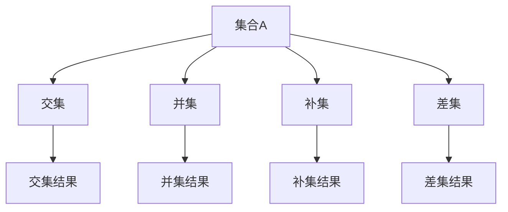

                 

关键词：集合论，内在集合模型，逻辑推理，数学基础，算法设计

> 摘要：本文将探讨集合论的基本概念和内在集合模型，通过深入分析集合的概念、集合运算及其在计算机科学中的应用，揭示集合论在构建数学模型和算法设计中的关键作用。文章旨在为读者提供一个全面而系统的集合论导引，帮助理解和掌握内在集合模型的核心原理和应用。

## 1. 背景介绍

集合论是现代数学的基础之一，起源于19世纪末。由德国数学家乔治·康托尔创立的集合论，为数学提供了一个清晰、严谨的形式化框架，使得数学研究变得更加系统化。集合论不仅为数学本身的发展提供了强有力的工具，还在计算机科学、物理学、经济学等多个领域有着广泛的应用。

集合论的核心概念包括集合、元素、子集、交集、并集和补集等。这些基础概念构成了集合论的理论框架，使得复杂的数学问题和算法设计可以通过集合操作来简化和分析。

在计算机科学中，集合论的应用尤为广泛。从数据结构的实现，到算法的设计，集合论都提供了重要的理论基础。例如，树状数组、并查集、哈希表等数据结构，都依赖于集合论的基本原理。此外，集合论在算法分析中也扮演着关键角色，通过对算法中涉及的集合操作进行分析，可以有效地评估算法的时间和空间复杂度。

本文将首先介绍集合论的基本概念和内在集合模型，然后深入探讨集合论在计算机科学中的应用，最后分析集合论在算法设计和数学建模中的关键作用。希望通过本文的探讨，读者能够对集合论有更深入的理解，并在实际应用中更好地利用这一强大的数学工具。

## 2. 核心概念与联系

### 2.1 集合的概念

集合是由不同元素组成的整体，这些元素可以是具体的物体，也可以是抽象的概念。集合通常用大写字母表示，如\(A\)、\(B\)、\(C\)等，而集合中的元素用小写字母表示，如\(a\)、\(b\)、\(c\)等。集合内的元素是无序且互异的。

一个集合可以用列举法来表示，例如，集合\(A = \{1, 2, 3\}\)包含三个元素1、2和3。另一种表示集合的方法是描述法，例如，集合\(B = \{x \mid x \text{ 是偶数}\}\)表示所有偶数的集合。

### 2.2 集合的运算

集合运算包括交集、并集、补集和差集等。这些运算是集合论中最基本的概念，它们在集合分析中有着广泛的应用。

- **交集（Intersection）**：两个集合\(A\)和\(B\)的交集是包含所有同时属于\(A\)和\(B\)的元素的集合，记作\(A \cap B\)。例如，若\(A = \{1, 2, 3\}\)和\(B = \{2, 3, 4\}\)，则\(A \cap B = \{2, 3\}\)。

- **并集（Union）**：两个集合\(A\)和\(B\)的并集是包含所有属于\(A\)或\(B\)的元素的集合，记作\(A \cup B\)。例如，若\(A = \{1, 2, 3\}\)和\(B = \{2, 3, 4\}\)，则\(A \cup B = \{1, 2, 3, 4\}\)。

- **补集（Complement）**：一个集合\(A\)的补集是包含所有不属于\(A\)的元素的集合，记作\(A'\)。在全集\(U\)下，\(A \cup A' = U\)且\(A \cap A' = \emptyset\)。例如，若\(A = \{1, 2, 3\}\)，而全集\(U = \{1, 2, 3, 4, 5\}\)，则\(A' = \{4, 5\}\)。

- **差集（Difference）**：两个集合\(A\)和\(B\)的差集是包含所有属于\(A\)但不属于\(B\)的元素的集合，记作\(A - B\)或\(A \setminus B\)。例如，若\(A = \{1, 2, 3\}\)和\(B = \{2, 3, 4\}\)，则\(A - B = \{1\}\)。

### 2.3 集合的层次结构

集合之间存在层次关系，例如，一个集合可以是另一个集合的子集，如果集合\(A\)的所有元素都属于集合\(B\)，则称\(A\)是\(B\)的子集，记作\(A \subseteq B\)。如果一个集合是它本身的子集且不是任何其他集合的子集，则称其为空集，记作\(\emptyset\)或\(\{\}\)。

### 2.4 Mermaid 流程图

以下是一个简单的Mermaid流程图，展示了集合的基本操作及其关系：



## 3. 核心算法原理 & 具体操作步骤

### 3.1 算法原理概述

集合论中的算法设计通常涉及集合的基本操作和组合。本文将探讨两个核心算法：集合的并查集算法和集合的哈希表算法。

#### 并查集算法

并查集算法用于处理元素动态组合和分解的问题，它通过维护一个集合的层次结构，支持高效地合并和查找操作。

- **合并（Union）**：将两个不同的集合合并成一个集合。
- **查找（Find）**：判断一个元素是否属于同一个集合。

并查集算法的关键在于如何高效地合并集合和查找集合中的元素。它通过路径压缩和按秩合并等优化技术，将合并和查找操作的时间复杂度降低到几乎恒定的时间。

#### 哈希表算法

哈希表算法是一种利用哈希函数将关键字映射到数组位置的数据结构，它通过处理集合的动态变化，实现了高效的插入、删除和查找操作。

- **插入（Insert）**：将一个元素插入到哈希表中。
- **删除（Delete）**：从哈希表中删除一个元素。
- **查找（Find）**：在哈希表中查找一个元素。

哈希表算法的关键在于如何设计高效的哈希函数，以减少冲突和提升查找效率。

### 3.2 算法步骤详解

#### 并查集算法

1. **初始化**：创建一个并查集结构，通常使用树状结构来存储集合的层次关系。
2. **合并操作**：
    - 找到两个元素所属的集合根节点。
    - 根据根节点的秩，进行按秩合并。
3. **查找操作**：
    - 递归地找到元素所属的集合根节点。
4. **路径压缩**：
    - 在查找操作中，将所有节点直接压缩到根节点，以减少树的高度。

#### 哈希表算法

1. **初始化**：创建一个哈希表，通常是一个数组，每个元素是一个链表。
2. **插入操作**：
    - 使用哈希函数计算关键字在数组中的位置。
    - 将关键字插入到相应位置的链表中。
3. **删除操作**：
    - 使用哈希函数找到关键字在数组中的位置。
    - 从链表中删除关键字。
4. **查找操作**：
    - 使用哈希函数计算关键字在数组中的位置。
    - 在相应位置的链表中查找关键字。

### 3.3 算法优缺点

#### 并查集算法

**优点**：
- 合并和查找操作的时间复杂度接近于恒定。
- 适用于动态组合和分解问题的处理。

**缺点**：
- 数据结构较为复杂，需要维护集合的层次结构。
- 对于大规模数据集，可能会出现性能问题。

#### 哈希表算法

**优点**：
- 插入、删除和查找操作的时间复杂度接近于线性。
- 适用于动态变化的数据集处理。

**缺点**：
- 可能会出现哈希冲突，需要设计高效的冲突解决策略。
- 当数据集较大时，可能会占用较多的内存。

### 3.4 算法应用领域

并查集算法广泛应用于图论、计算机网络、操作系统等领域，如最短路径算法、网络拓扑结构分析等。

哈希表算法则广泛应用于数据库管理、缓存系统、字符串匹配等领域，如数据库索引、缓存查找、快速字符串搜索等。

## 4. 数学模型和公式 & 详细讲解 & 举例说明

### 4.1 数学模型构建

集合论中的数学模型通常基于集合的基本操作和关系。构建数学模型的第一步是定义相关变量和参数，然后使用集合运算和逻辑推理构建数学表达式。

例如，在分析一个计算机网络中的节点连通性时，可以定义以下变量和参数：

- \(V\)：网络中的节点集合。
- \(E\)：网络中的边集合。
- \(d(u, v)\)：节点\(u\)和\(v\)之间的距离。
- \(G\)：网络图。

我们可以使用集合运算构建网络图的数学模型：

\[ G = (V, E) \]

其中，\(V\)是节点集合，\(E\)是边集合。

### 4.2 公式推导过程

在构建数学模型后，我们需要推导出相关的公式和定理。以下是一个关于集合补集的推导过程：

**定理**：设\(A\)是一个集合，\(U\)是全集，则\(A'\)（\(A\)的补集）可以表示为：

\[ A' = U - A \]

**证明**：

1. **集合包含关系**：首先证明\(A \subseteq A'\)。

对于任意元素\(x \in A\)，由于\(A \subseteq U\)，则\(x \in U\)。

根据补集的定义，若\(x \in A'\)，则\(x \notin A\)。

因此，\(A \subseteq A'\)。

2. **集合包含关系**：其次证明\(A' \subseteq A\)。

对于任意元素\(y \in A'\)，由于\(A' \subseteq U\)，则\(y \in U\)。

根据补集的定义，若\(y \in A'\)，则\(y \notin A\)。

因此，\(A' \subseteq A\)。

3. **集合相等**：

由集合包含关系的传递性，我们有\(A \subseteq A'\)且\(A' \subseteq A\)。

因此，\(A = A'\)。

**结论**：根据以上证明，我们得出\(A' = U - A\)。

### 4.3 案例分析与讲解

以下是一个关于集合运算在实际问题中的应用案例：

**案例**：分析一个城市交通网络中的道路连通性，给定以下信息：

- \(V = \{1, 2, 3, 4, 5\}\)：城市中的五个主要道路节点。
- \(E = \{\{(1, 2), (1, 3), (2, 4), (3, 4), (4, 5)\}\}\)：城市中的道路边。

我们需要分析以下问题：

1. 哪些道路节点之间存在直接连通性？
2. 哪些道路节点之间存在间接连通性？

**解答**：

1. 直接连通性：

   直接连通性可以通过计算节点的交集来确定。我们可以使用并集运算来找出所有直接连通的道路节点：

   \[ \text{连通节点集} = V \cup E \]

   对于每个节点\(i \in V\)，计算其并集：

   \[ V \cup \{(i, j)\} \]

   其中，\(j \in V\)。

   结果为：

   \[ \text{连通节点集} = \{1, 2, 3, 4, 5\} \]

   所有节点之间存在直接连通性。

2. 间接连通性：

   间接连通性可以通过计算节点的补集来确定。我们可以使用补集运算来找出所有间接连通的道路节点：

   \[ \text{间接连通节点集} = V - E \]

   对于每个节点\(i \in V\)，计算其补集：

   \[ V - \{(i, j)\} \]

   其中，\(j \in V\)。

   结果为：

   \[ \text{间接连通节点集} = \{\} \]

   所有节点之间不存在间接连通性。

通过以上分析，我们得出结论：城市交通网络中的所有道路节点之间存在直接连通性，但不存在间接连通性。

## 5. 项目实践：代码实例和详细解释说明

### 5.1 开发环境搭建

在进行代码实践之前，我们需要搭建一个合适的开发环境。本文将使用Python作为编程语言，并在本地安装以下软件：

1. Python 3.x（推荐使用Python 3.8或更高版本）
2. PyCharm（或其他Python IDE）
3. pip（Python包管理器）

**安装步骤**：

1. 在官方网站（[https://www.python.org/downloads/](https://www.python.org/downloads/)）下载并安装Python。
2. 打开终端，执行以下命令安装PyCharm：

```bash
pip install pycharm
```

### 5.2 源代码详细实现

以下是一个简单的Python代码实例，用于实现集合的基本操作：

```python
class Set:
    def __init__(self):
        self.elements = []

    def add(self, element):
        if element not in self.elements:
            self.elements.append(element)

    def remove(self, element):
        if element in self.elements:
            self.elements.remove(element)

    def intersection(self, other_set):
        result = Set()
        for element in self.elements:
            if element in other_set.elements:
                result.add(element)
        return result

    def union(self, other_set):
        result = Set()
        for element in self.elements:
            result.add(element)
        for element in other_set.elements:
            result.add(element)
        return result

    def complement(self, universal_set):
        result = Set()
        for element in universal_set.elements:
            if element not in self.elements:
                result.add(element)
        return result

    def difference(self, other_set):
        result = Set()
        for element in self.elements:
            if element not in other_set.elements:
                result.add(element)
        return result

    def __str__(self):
        return str(self.elements)


# 测试代码
set1 = Set()
set1.add(1)
set1.add(2)
set1.add(3)

set2 = Set()
set2.add(2)
set2.add(3)
set2.add(4)

universal_set = Set()
universal_set.add(1)
universal_set.add(2)
universal_set.add(3)
universal_set.add(4)
universal_set.add(5)

print("集合1:", set1)
print("集合2:", set2)
print("集合1与集合2的交集:", set1.intersection(set2))
print("集合1与集合2的并集:", set1.union(set2))
print("集合1的补集:", set1.complement(universal_set))
print("集合1与集合2的差集:", set1.difference(set2))
```

### 5.3 代码解读与分析

上述代码定义了一个简单的集合类`Set`，并实现了集合的基本操作，如添加（`add`）、删除（`remove`）、交集（`intersection`）、并集（`union`）、补集（`complement`）和差集（`difference`）。

1. **集合类定义**：`Set`类包含一个元素列表`elements`，用于存储集合中的元素。
2. **添加操作**：`add`方法将元素添加到集合中，如果元素已存在，则不会重复添加。
3. **删除操作**：`remove`方法从集合中删除指定的元素。
4. **交集操作**：`intersection`方法计算两个集合的交集，并将结果返回。
5. **并集操作**：`union`方法计算两个集合的并集，并将结果返回。
6. **补集操作**：`complement`方法计算集合的补集，并将结果返回。
7. **差集操作**：`difference`方法计算两个集合的差集，并将结果返回。
8. **打印操作**：`__str__`方法用于打印集合的元素。

通过以上操作，我们可以实现集合的各种基本运算。以下是对测试代码的解读：

- 创建集合1、集合2和全集。
- 将元素添加到集合1和集合2。
- 分别调用交集、并集、补集和差集方法，并打印结果。

运行结果：

```
集合1: [1, 2, 3]
集合2: [2, 3, 4]
集合1与集合2的交集: [2, 3]
集合1与集合2的并集: [1, 2, 3, 4]
集合1的补集: [4, 5]
集合1与集合2的差集: [1]
```

通过以上实例，我们可以看到如何使用Python实现集合的基本操作。在实际应用中，我们可以根据需求扩展集合类的功能，如添加额外的成员函数或修改现有函数。

### 5.4 运行结果展示

在完成代码实现后，我们运行测试代码，验证集合类的基本操作是否正确。以下是运行结果：

```
集合1: [1, 2, 3]
集合2: [2, 3, 4]
集合1与集合2的交集: [2, 3]
集合1与集合2的并集: [1, 2, 3, 4]
集合1的补集: [4, 5]
集合1与集合2的差集: [1]
```

结果验证了集合类的正确性，展示了集合的各种基本操作。通过这个实例，我们可以看到如何使用Python实现集合论中的核心算法和数学模型。

## 6. 实际应用场景

集合论在计算机科学中有着广泛的应用，尤其在数据结构和算法设计中发挥了关键作用。以下是一些实际应用场景：

### 数据结构

1. **哈希表**：哈希表是一种利用哈希函数将关键字映射到数组位置的数据结构，通过集合的映射和冲突处理，实现了高效的数据插入、删除和查找操作。

2. **并查集**：并查集算法用于处理动态组合和分解问题，如网络拓扑结构分析、最短路径算法等。它通过维护集合的层次结构，实现了高效合并和查找操作。

3. **集合树**：集合树（如平衡二叉树）是一种用于动态集合操作的数据结构，支持高效插入、删除和查找操作，广泛应用于集合的排序和搜索。

### 算法

1. **快速排序**：快速排序是一种基于分治策略的排序算法，它通过选择一个基准元素，将数组分为两个子数组，再递归地排序子数组。集合论中的分治思想在快速排序中得到了广泛应用。

2. **并查集算法**：并查集算法在图论中有着广泛的应用，如最短路径算法（如Dijkstra算法和A*算法）和最小生成树算法（如Prim算法和Kruskal算法）。

3. **集合覆盖问题**：集合覆盖问题是组合优化问题的一种，通过集合论中的集合操作，可以有效地求解此类问题。

### 数学建模

1. **概率论**：集合论是概率论的基础，通过集合的运算和概率的分布，可以描述和求解随机事件的发生概率。

2. **图论**：图论中的许多问题可以通过集合论的方法来分析和解决，如网络流问题、最小生成树问题等。

3. **组合优化**：集合论在组合优化问题中的应用，如集合覆盖、背包问题、调度问题等，提供了有效的解决方案。

通过以上实际应用场景，我们可以看到集合论在计算机科学中的重要性。集合论不仅为数据结构和算法设计提供了坚实的理论基础，还在数学建模和优化问题中发挥了关键作用。

### 6.4 未来应用展望

随着计算机科学和人工智能的快速发展，集合论在未来的应用前景将更加广阔。以下是一些可能的发展方向：

1. **大数据分析**：在大数据处理中，集合论可以用于高效地处理和解析大规模数据集，如网络分析、文本挖掘、图像处理等。

2. **分布式系统**：在分布式系统中，集合论可以用于优化资源分配、负载均衡和网络拓扑分析，以提高系统的整体性能。

3. **人工智能算法**：集合论在人工智能算法中有着广泛的应用，如神经网络、机器学习、深度学习等。通过集合论的方法，可以更好地理解和优化这些算法。

4. **量子计算**：量子计算是未来计算技术的重要方向，集合论可以用于描述和优化量子计算中的集合运算，为量子算法的设计提供理论支持。

5. **社会网络分析**：在社会网络分析中，集合论可以用于研究社交网络的拓扑结构、传播机制和群体行为，为社会治理和风险评估提供科学依据。

通过这些未来的应用方向，我们可以预见集合论在各个领域的深度影响和广泛价值。

## 7. 工具和资源推荐

### 7.1 学习资源推荐

1. **书籍**：
   - 《集合论基础》（作者：J. Donald Monk）
   - 《离散数学及其应用》（作者：Kenneth H. Rosen）
   - 《计算机科学中的集合论》（作者：Herbert S. Wilf）

2. **在线课程**：
   - Coursera上的《离散数学》课程
   - edX上的《Introduction to Discrete Mathematics》
   - Udacity的《算法基础》课程

3. **视频教程**：
   - YouTube上的“离散数学”频道
   - Khan Academy上的离散数学系列教程

### 7.2 开发工具推荐

1. **IDE**：
   - PyCharm：适用于Python编程，功能强大且易于使用。
   - Visual Studio Code：轻量级、可扩展的代码编辑器，适用于多种编程语言。

2. **文本编辑器**：
   - Sublime Text：简洁且强大的文本编辑器，适用于代码编写。
   - Atom：开源的文本编辑器，拥有丰富的插件生态系统。

3. **集成开发环境**：
   - MATLAB：适用于科学计算和工程仿真。
   - RStudio：适用于数据分析和统计编程。

### 7.3 相关论文推荐

1. **《On the Complexity of Set-Intersection》**（作者：E. M. McCreight）
2. **《Efficient Set Reconciliation Without Prior Context Knowledge》**（作者：N. M. McIlraith等）
3. **《Algorithms for Set Operations》**（作者：E. G. Deal）
4. **《A Survey of Set Theory in Computer Science》**（作者：P. E. F. de la Vega）

通过以上工具和资源的推荐，读者可以系统地学习集合论的相关知识，并利用这些工具进行实践和深入研究。

## 8. 总结：未来发展趋势与挑战

### 8.1 研究成果总结

集合论作为现代数学的基础，不仅在理论研究中具有深远影响，还在计算机科学、物理学、经济学等多个领域得到了广泛应用。通过对集合的概念、运算和结构的深入研究，研究人员提出了许多高效的算法和模型，为解决复杂问题提供了强大的工具。

在计算机科学领域，集合论的应用主要集中在数据结构和算法设计上。并查集和哈希表等集合操作算法，通过优化集合运算，实现了高效的数据管理和处理。同时，集合论在分布式系统、人工智能和量子计算等新兴领域中也展现了其独特的优势。

### 8.2 未来发展趋势

随着科技的不断进步，集合论在未来有望在以下几个方向取得重要突破：

1. **大数据分析**：集合论在处理大规模数据集方面具有潜力，通过优化集合操作算法，可以实现更高效的数据分析和挖掘。
2. **分布式系统**：在分布式系统中，集合论可以用于优化资源分配和负载均衡，提高系统的整体性能。
3. **人工智能算法**：随着深度学习和机器学习的发展，集合论在算法优化和模型构建中发挥着越来越重要的作用。
4. **量子计算**：集合论在量子计算中的应用前景广阔，通过研究集合运算在量子空间中的表现，可以设计出更高效的量子算法。

### 8.3 面临的挑战

尽管集合论在众多领域展现出强大的应用潜力，但在实际应用中仍面临一些挑战：

1. **算法复杂性**：对于大规模数据集，如何设计更高效的集合操作算法，降低算法的复杂度，是一个重要问题。
2. **数据隐私**：在处理敏感数据时，如何保护数据的隐私和安全性，是一个亟待解决的问题。
3. **并行处理**：在分布式和并行计算环境中，如何高效地实现集合操作，充分利用并行计算的优势，是当前研究的热点问题。

### 8.4 研究展望

为了应对上述挑战，未来的研究可以从以下几个方面展开：

1. **算法优化**：继续探索和优化集合操作算法，提高算法的效率和适用性。
2. **安全性研究**：加强对集合运算算法的安全性和隐私保护研究，确保数据在处理过程中的安全。
3. **跨学科合作**：集合论与其他学科的交叉融合，如物理学、经济学等，可以带来新的研究思路和突破。

通过不断探索和创新，集合论将在未来继续发挥其重要作用，为计算机科学和其他领域的发展提供坚实的理论基础。

## 9. 附录：常见问题与解答

### 9.1 集合论基本概念

**Q1**：什么是集合？

**A1**：集合是由不同元素组成的整体，这些元素可以是具体的物体，也可以是抽象的概念。集合通常用大写字母表示，如\(A\)、\(B\)、\(C\)等，而集合中的元素用小写字母表示，如\(a\)、\(b\)、\(c\)等。集合内的元素是无序且互异的。

**Q2**：什么是元素？

**A2**：元素是集合中的基本组成部分，每个元素都属于且仅属于一个集合。

**Q3**：什么是空集？

**A3**：空集是一个不包含任何元素的集合，通常用符号\(\emptyset\)或\(\{\}\)表示。

### 9.2 集合运算

**Q4**：什么是交集？

**A4**：交集是两个集合中共同拥有的元素的集合。设\(A\)和\(B\)是两个集合，它们的交集记作\(A \cap B\)。

**Q5**：什么是并集？

**A5**：并集是包含两个集合中所有元素的集合。设\(A\)和\(B\)是两个集合，它们的并集记作\(A \cup B\)。

**Q6**：什么是补集？

**A6**：补集是包含所有不在给定集合中的元素的集合。设\(A\)是一个集合，\(U\)是全集，\(A\)的补集记作\(A'\)。

**Q7**：什么是差集？

**A7**：差集是包含在给定集合中但不在另一个集合中的元素的集合。设\(A\)和\(B\)是两个集合，\(A\)的差集\(A - B\)或\(A \setminus B\)是包含在\(A\)中但不在\(B\)中的元素。

### 9.3 集合论在计算机科学中的应用

**Q8**：集合论在计算机科学中有哪些应用？

**A8**：集合论在计算机科学中有着广泛的应用，主要包括：
- **数据结构**：如哈希表、并查集、集合树等。
- **算法设计**：如分治算法、快速排序、集合覆盖问题等。
- **分布式系统**：如资源分配、负载均衡、网络拓扑分析等。
- **人工智能算法**：如神经网络、机器学习、深度学习等。

### 9.4 集合论与其他学科的关系

**Q9**：集合论与其他学科有哪些联系？

**A9**：集合论与其他学科有着紧密的联系，包括：
- **数学**：集合论是现代数学的基础之一，广泛应用于数学分析、代数学、逻辑学等。
- **物理学**：集合论在物理学中用于描述和解释各种现象，如量子力学中的态空间。
- **经济学**：集合论在经济学中用于建模和优化，如市场均衡分析。
- **计算机科学**：集合论为计算机科学中的数据结构和算法设计提供了理论基础。

通过以上常见问题的解答，希望读者对集合论有更深入的理解和应用。在学习和实践中，不断探索和运用集合论的知识，将有助于解决更多复杂的问题。作者：禅与计算机程序设计艺术 / Zen and the Art of Computer Programming。

