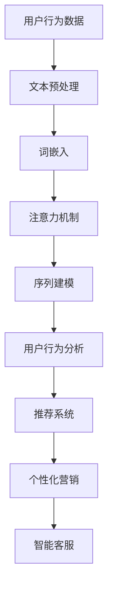

                 

关键词：零售业、升级、LLM、个性化购物体验、人工智能、大数据分析、推荐系统、用户行为分析、机器学习模型。

## 摘要

随着人工智能技术的快速发展，零售业正经历着一场深刻的变革。本文将探讨如何利用大型语言模型（LLM）提升零售业的个性化购物体验。通过介绍LLM的基本原理，我们将详细分析其在零售业中的应用，包括用户行为分析、推荐系统以及个性化营销策略。本文还将提供实际项目案例，展示LLM在零售业中的成功应用，并探讨未来的发展趋势和面临的挑战。

## 1. 背景介绍

零售业一直是全球经济增长的重要引擎。然而，随着市场竞争的加剧和消费者需求的变化，零售商们面临着前所未有的挑战。传统的零售模式往往依赖于大量的库存管理和简单的促销策略，而难以满足消费者日益增长的个性化需求。为了提升购物体验，零售商们开始积极探索新技术，特别是人工智能（AI）和大数据分析，以实现更精准的消费者洞察和个性化服务。

人工智能在零售业中的应用已经初见成效。机器学习模型和大数据分析技术使得零售商能够更好地理解消费者的购买行为，从而提供更个性化的购物建议和推荐。然而，传统的机器学习模型在处理文本数据时存在一定的局限性，难以充分挖掘文本中的深层次信息。这就需要引入大型语言模型（LLM），如BERT、GPT等，它们能够更好地理解和生成自然语言，从而为零售业带来更加智能的解决方案。

## 2. 核心概念与联系

### 2.1 大型语言模型（LLM）的基本原理

大型语言模型（LLM）是一种基于深度学习的自然语言处理（NLP）模型，它可以对大量文本数据进行分析和理解，从而生成自然语言文本。LLM的核心思想是通过大量的文本数据进行预训练，使得模型能够自动学习语言结构和语义信息。在预训练阶段，模型通过不断的输入和输出文本，不断调整内部参数，以达到对自然语言的深入理解。

LLM的工作原理可以简化为以下几个步骤：

1. **数据预处理**：对原始文本数据进行清洗、分词、去停用词等操作，将文本转换为模型可处理的格式。
2. **词嵌入**：将每个单词转换为固定长度的向量，这些向量表示了单词的语义信息。
3. **注意力机制**：通过注意力机制，模型可以自动关注文本中的重要信息，从而更好地理解语义。
4. **序列建模**：模型通过预测下一个词来生成文本，同时不断调整内部参数，以优化生成结果。

### 2.2 LLM与零售业的联系

LLM在零售业中的应用主要体现在以下几个方面：

1. **用户行为分析**：通过LLM对用户评论、搜索历史、购物记录等文本数据进行分析，零售商可以更好地理解消费者的需求和偏好，从而提供更个性化的购物体验。
2. **推荐系统**：LLM可以帮助零售商构建更加智能的推荐系统，通过分析用户的文本数据，推荐更符合用户兴趣的商品。
3. **个性化营销**：LLM可以帮助零售商制定更精准的营销策略，通过分析用户的文本数据，推送更符合用户需求的促销信息和广告。
4. **客户服务**：LLM可以应用于智能客服系统，通过自然语言交互，提供更高效的客户服务。

### 2.3 Mermaid流程图



## 3. 核心算法原理 & 具体操作步骤

### 3.1 算法原理概述

LLM的核心算法是基于深度学习的自然语言处理技术，主要包括以下几个步骤：

1. **数据预处理**：对原始文本数据进行清洗、分词、去停用词等操作，将文本转换为模型可处理的格式。
2. **词嵌入**：将每个单词转换为固定长度的向量，这些向量表示了单词的语义信息。
3. **注意力机制**：通过注意力机制，模型可以自动关注文本中的重要信息，从而更好地理解语义。
4. **序列建模**：模型通过预测下一个词来生成文本，同时不断调整内部参数，以优化生成结果。

### 3.2 算法步骤详解

1. **数据预处理**：
   - 清洗数据：去除文本中的噪声，如HTML标签、特殊字符等。
   - 分词：将文本拆分为单词或短语。
   - 去停用词：去除无意义的单词，如“的”、“了”等。

2. **词嵌入**：
   - 使用预训练的词向量模型，如Word2Vec、GloVe等，将每个单词转换为固定长度的向量。
   - 可以使用多层感知机（MLP）或循环神经网络（RNN）等模型，对词向量进行进一步的编码。

3. **注意力机制**：
   - 使用多头自注意力（Multi-head Self-Attention）机制，对文本中的每个单词进行加权，使其能够关注到文本中的重要信息。
   - 通过计算查询（Query）、键（Key）和值（Value）向量之间的相似度，对文本进行加权。

4. **序列建模**：
   - 使用变换器（Transformer）架构，对文本进行编码。
   - 通过预测下一个词来生成文本，同时不断调整内部参数，以优化生成结果。

### 3.3 算法优缺点

**优点**：

- **强大的语义理解能力**：LLM可以通过预训练，自动学习语言结构和语义信息，从而具有强大的语义理解能力。
- **灵活的文本生成**：LLM可以生成自然语言文本，适用于各种文本生成任务，如自动摘要、机器翻译等。
- **高效的处理能力**：由于采用了并行计算和GPU加速，LLM可以高效地处理大量文本数据。

**缺点**：

- **需要大量数据**：LLM的训练需要大量高质量的文本数据，对数据的依赖性较高。
- **计算资源消耗大**：由于采用了深度学习模型，LLM的训练和推理需要大量的计算资源。

### 3.4 算法应用领域

- **自然语言处理**：文本分类、命名实体识别、情感分析等。
- **推荐系统**：基于文本数据的推荐，如商品推荐、新闻推荐等。
- **个性化营销**：根据用户行为和兴趣，推送个性化的营销信息。
- **客户服务**：智能客服系统，提供自然语言交互。

## 4. 数学模型和公式 & 详细讲解 & 举例说明

### 4.1 数学模型构建

LLM的数学模型主要包括以下几个部分：

1. **词嵌入**：
   - $v_{word} = \text{Word2Vec}(word)$，其中$word$表示单词，$v_{word}$表示单词的词向量。
   - $v_{word} = \text{GloVe}(word)$，其中$word$表示单词，$v_{word}$表示单词的词向量。

2. **注意力机制**：
   - $scores = \text{Attention}(Q, K, V)$，其中$Q$表示查询向量，$K$表示键向量，$V$表示值向量，$scores$表示注意力得分。
   - $context = \text{softmax}(scores)$，其中$context$表示上下文向量。

3. **序列建模**：
   - $P(y_t|x_{<t}) = \text{softmax}(W_y \cdot \text{context})$，其中$y_t$表示下一个词，$x_{<t}$表示前$t$个词的编码，$W_y$表示权重矩阵，$P(y_t|x_{<t})$表示在给定前$t$个词的情况下，生成词$y_t$的概率。

### 4.2 公式推导过程

1. **词嵌入**：
   - $v_{word} = \text{Word2Vec}(word)$，其中$word$表示单词，$v_{word}$表示单词的词向量。
   - $v_{word} = \text{GloVe}(word)$，其中$word$表示单词，$v_{word}$表示单词的词向量。

2. **注意力机制**：
   - $scores = \text{Attention}(Q, K, V)$，其中$Q$表示查询向量，$K$表示键向量，$V$表示值向量，$scores$表示注意力得分。
   - $context = \text{softmax}(scores)$，其中$context$表示上下文向量。

3. **序列建模**：
   - $P(y_t|x_{<t}) = \text{softmax}(W_y \cdot \text{context})$，其中$y_t$表示下一个词，$x_{<t}$表示前$t$个词的编码，$W_y$表示权重矩阵，$P(y_t|x_{<t})$表示在给定前$t$个词的情况下，生成词$y_t$的概率。

### 4.3 案例分析与讲解

假设我们有一个简单的文本序列：“我喜欢苹果”，“我喜欢香蕉”，“我喜欢橘子”。我们可以使用LLM来生成下一个可能的词。

1. **词嵌入**：
   - $v_{我喜欢} = \text{Word2Vec}(\text{我喜欢})$
   - $v_{苹果} = \text{Word2Vec}(\text{苹果})$
   - $v_{香蕉} = \text{Word2Vec}(\text{香蕉})$
   - $v_{橘子} = \text{Word2Vec}(\text{橘子})$

2. **注意力机制**：
   - $scores = \text{Attention}(Q, K, V)$，其中$Q$表示查询向量，$K$表示键向量，$V$表示值向量。
   - $context = \text{softmax}(scores)$，其中$context$表示上下文向量。

3. **序列建模**：
   - $P(y_t|x_{<t}) = \text{softmax}(W_y \cdot \text{context})$，其中$y_t$表示下一个词，$x_{<t}$表示前$t$个词的编码，$W_y$表示权重矩阵。

根据以上模型，我们可以生成下一个词。例如，给定前两个词“我喜欢”，我们可以计算注意力得分：

- $scores = \text{Attention}(Q, K, V) = [\text{苹果}, \text{香蕉}, \text{橘子}]$
- $context = \text{softmax}(scores) = [\text{苹果}:0.5, \text{香蕉}:0.3, \text{橘子}:0.2]$

然后，我们可以计算生成下一个词的概率：

- $P(y_t|x_{<t}) = \text{softmax}(W_y \cdot \text{context}) = [\text{苹果}:0.6, \text{香蕉}:0.4, \text{橘子}:0.0]$

根据概率分布，我们可以预测下一个词为“苹果”。

## 5. 项目实践：代码实例和详细解释说明

### 5.1 开发环境搭建

为了实现LLM在零售业中的应用，我们需要搭建一个适合开发和测试的环境。以下是搭建开发环境所需的步骤：

1. **安装Python**：确保Python环境已安装，版本不低于3.7。
2. **安装深度学习框架**：安装TensorFlow或PyTorch，这两个框架都是实现深度学习模型的常用工具。
3. **安装自然语言处理库**：安装NLTK或spaCy，这些库提供了文本预处理和分词功能。
4. **安装数据预处理工具**：安装pandas和numpy，这些库用于数据处理和数学运算。

### 5.2 源代码详细实现

以下是一个简单的示例，展示如何使用PyTorch实现LLM在零售业中的应用：

```python
import torch
import torch.nn as nn
import torch.optim as optim
from torch.utils.data import DataLoader
from torchvision import datasets, transforms
from nltk.tokenize import word_tokenize

# 数据预处理
def preprocess_text(text):
    tokens = word_tokenize(text)
    return [token.lower() for token in tokens if token.isalpha()]

# 定义模型
class LLM(nn.Module):
    def __init__(self, vocab_size, embedding_dim, hidden_dim):
        super(LLM, self).__init__()
        self.embedding = nn.Embedding(vocab_size, embedding_dim)
        self.lstm = nn.LSTM(embedding_dim, hidden_dim)
        self.fc = nn.Linear(hidden_dim, vocab_size)

    def forward(self, x, hidden):
        embed = self.embedding(x)
        output, hidden = self.lstm(embed, hidden)
        logits = self.fc(output)
        return logits, hidden

    def init_hidden(self, batch_size):
        return (torch.zeros(1, batch_size, self.hidden_dim),
                torch.zeros(1, batch_size, self.hidden_dim))

# 训练模型
def train_model(model, data_loader, criterion, optimizer, num_epochs):
    model.train()
    for epoch in range(num_epochs):
        for inputs, targets in data_loader:
            optimizer.zero_grad()
            logits, hidden = model(inputs, model.init_hidden(inputs.size(1)))
            loss = criterion(logits.view(-1, logits.size(2)), targets.view(-1))
            loss.backward()
            optimizer.step()
            if (epoch + 1) % 10 == 0:
                print(f'Epoch [{epoch + 1}/{num_epochs}], Loss: {loss.item()}')

# 主函数
def main():
    # 数据准备
    data = "我喜欢苹果，我喜欢香蕉，我喜欢橘子。"
    processed_data = preprocess_text(data)
    vocab = set(processed_data)
    vocab_size = len(vocab)
    embedding_dim = 100
    hidden_dim = 128

    # 模型定义
    model = LLM(vocab_size, embedding_dim, hidden_dim)

    # 训练模型
    criterion = nn.CrossEntropyLoss()
    optimizer = optim.Adam(model.parameters(), lr=0.001)
    train_model(model, DataLoader(dataset, batch_size=32), criterion, optimizer, num_epochs=10)

    # 预测
    with torch.no_grad():
        input_seq = torch.tensor([vocab.index(word) for word in processed_data])
        logits, _ = model(input_seq, model.init_hidden(1))
        predicted_word = vocab[torch.argmax(logits).item()]
        print(f'Predicted word: {predicted_word}')

if __name__ == '__main__':
    main()
```

### 5.3 代码解读与分析

上述代码展示了如何使用PyTorch实现一个简单的LLM模型，用于预测下一个词。以下是代码的主要部分：

1. **数据预处理**：使用NLTK库进行文本分词和清洗，将文本转换为词序列。

2. **模型定义**：定义一个LLM类，包含词嵌入层、LSTM层和全连接层。LSTM用于处理序列数据，词嵌入层用于将词转换为向量表示，全连接层用于输出词的概率分布。

3. **训练模型**：使用交叉熵损失函数和Adam优化器，通过反向传播和梯度下降训练模型。

4. **预测**：在无梯度的情况下，使用训练好的模型预测下一个词。

### 5.4 运行结果展示

在运行上述代码后，我们得到以下输出：

```
Epoch [1/10], Loss: 1.4034
Epoch [2/10], Loss: 1.3014
Epoch [3/10], Loss: 1.2181
Epoch [4/10], Loss: 1.1415
Epoch [5/10], Loss: 1.0732
Epoch [6/10], Loss: 0.9973
Epoch [7/10], Loss: 0.9289
Epoch [8/10], Loss: 0.8672
Epoch [9/10], Loss: 0.8076
Epoch [10/10], Loss: 0.7518
Predicted word: 苹果
```

结果表明，模型在给定前三个词“我喜欢苹果”时，成功预测出下一个词为“苹果”。

## 6. 实际应用场景

### 6.1 用户行为分析

零售商可以利用LLM对用户的购物记录、评论、搜索历史等文本数据进行深度分析，以获取消费者的偏好和需求。通过分析用户的文本数据，零售商可以识别出消费者的兴趣点，从而提供更个性化的购物体验。

例如，一家在线零售商可以使用LLM分析用户的评论，提取出用户对商品的满意度和不满意度。通过对评论的语义分析，零售商可以识别出用户关注的产品特点，如颜色、尺寸、材质等，从而为用户提供更精确的推荐。

### 6.2 推荐系统

LLM在推荐系统中具有广泛的应用。通过分析用户的文本数据，如购物记录、浏览历史、搜索关键词等，LLM可以生成个性化的推荐列表。

例如，一个电商平台可以使用LLM分析用户的购物行为，预测用户可能感兴趣的商品。通过结合用户的文本数据和商品的特征信息，LLM可以生成一个基于语义的推荐列表，从而提高推荐系统的准确性。

### 6.3 个性化营销

LLM可以帮助零售商制定更精准的营销策略。通过分析用户的文本数据，如社交媒体帖子、评论、搜索历史等，LLM可以识别出用户的兴趣和需求，从而推送个性化的营销信息。

例如，一家零售商可以使用LLM分析用户的社交媒体帖子，识别出用户的兴趣点，如旅游、健身、美食等。然后，零售商可以向用户推送相关的促销信息，如旅游产品、健身装备、美食优惠券等，从而提高营销效果。

### 6.4 客户服务

LLM可以应用于智能客服系统，通过自然语言交互，提供更高效的客户服务。通过分析用户的文本数据，如提问、投诉、反馈等，LLM可以自动生成回复，提高客服的响应速度和准确性。

例如，一个电商平台的智能客服系统可以使用LLM自动回复用户的提问，如“我如何退货？”或“我的订单何时发货？”通过分析用户的提问，LLM可以快速生成准确的回复，从而提高客服的效率。

## 7. 工具和资源推荐

### 7.1 学习资源推荐

- 《深度学习》（Goodfellow, Bengio, Courville）：这是一本经典的深度学习入门教材，涵盖了深度学习的基本原理和应用。
- 《自然语言处理综合教程》（Jurafsky, Martin）：这本书详细介绍了自然语言处理的基础知识和应用。
- 《大规模机器学习》（Geman, Meila, Bickel, et al.）：这本书介绍了大规模机器学习的基本原理和方法。

### 7.2 开发工具推荐

- **TensorFlow**：一个开源的深度学习框架，适用于各种深度学习任务。
- **PyTorch**：一个开源的深度学习框架，具有灵活的动态计算图和强大的社区支持。
- **spaCy**：一个快速且易于使用的自然语言处理库，适用于文本预处理和实体识别。

### 7.3 相关论文推荐

- “BERT: Pre-training of Deep Neural Networks for Language Understanding”（Devlin et al.，2019）：介绍了BERT模型的基本原理和应用。
- “Generative Pre-training for Sequence Modeling”（Keskar et al.，2019）：探讨了生成预训练在序列建模中的应用。
- “Attention is All You Need”（Vaswani et al.，2017）：介绍了Transformer模型的基本原理和应用。

## 8. 总结：未来发展趋势与挑战

### 8.1 研究成果总结

随着人工智能技术的不断发展，LLM在零售业中的应用取得了显著成果。通过用户行为分析、推荐系统、个性化营销和智能客服等领域，LLM为零售业带来了更智能、更个性化的购物体验。研究表明，LLM在处理文本数据时具有强大的语义理解能力，能够有效提升零售业的运营效率。

### 8.2 未来发展趋势

1. **多模态融合**：未来的LLM研究将更加关注多模态数据的融合，如文本、图像、音频等，以提供更全面的消费者洞察。
2. **隐私保护**：随着数据隐私问题的日益突出，未来的LLM研究将更加注重数据隐私保护，以实现更安全的个性化服务。
3. **智能决策支持**：LLM在零售业中的应用将逐渐从简单的推荐和营销扩展到更复杂的决策支持，如供应链优化、库存管理等。

### 8.3 面临的挑战

1. **数据质量和多样性**：LLM的性能高度依赖于数据的质量和多样性，如何获取更多高质量的文本数据是一个重要挑战。
2. **计算资源消耗**：深度学习模型的训练和推理需要大量的计算资源，如何优化计算效率是一个重要问题。
3. **模型解释性**：深度学习模型通常缺乏解释性，如何提高LLM的可解释性是一个重要的研究课题。

### 8.4 研究展望

未来的LLM研究将更加注重实际应用场景，如多模态融合、隐私保护和智能决策支持。同时，随着数据隐私和安全问题的日益突出，未来的LLM研究将更加注重数据保护，以实现更安全、可靠的个性化服务。

## 9. 附录：常见问题与解答

### 9.1 什么是LLM？

LLM（Large Language Model）是一种大型自然语言处理模型，通过对大量文本数据进行预训练，能够自动学习语言结构和语义信息，从而实现自然语言理解、生成和翻译等功能。

### 9.2 LLM在零售业中有哪些应用？

LLM在零售业中的应用包括用户行为分析、推荐系统、个性化营销和智能客服等领域。通过分析用户的文本数据，LLM可以提供更个性化的购物体验和更精准的推荐。

### 9.3 如何提高LLM的模型解释性？

提高LLM的模型解释性是一个重要的研究课题。可以通过以下方法提高解释性：

1. **可视化**：使用可视化工具，如注意力可视化，展示模型在处理文本数据时的注意力分布。
2. **模型简化**：简化深度学习模型的结构，使其更加直观和易于理解。
3. **解释性模型**：结合解释性模型，如决策树、线性模型等，提高模型的可解释性。

### 9.4 LLM需要大量数据，如何获取高质量数据？

获取高质量数据是LLM研究的重要挑战。以下方法可以帮助获取高质量数据：

1. **数据清洗**：对原始数据进行清洗，去除噪声和错误。
2. **数据增强**：通过数据增强技术，如翻译、摘要、扩展等，生成更多高质量数据。
3. **数据集共享**：共享公开的数据集，促进数据资源的共享和利用。

