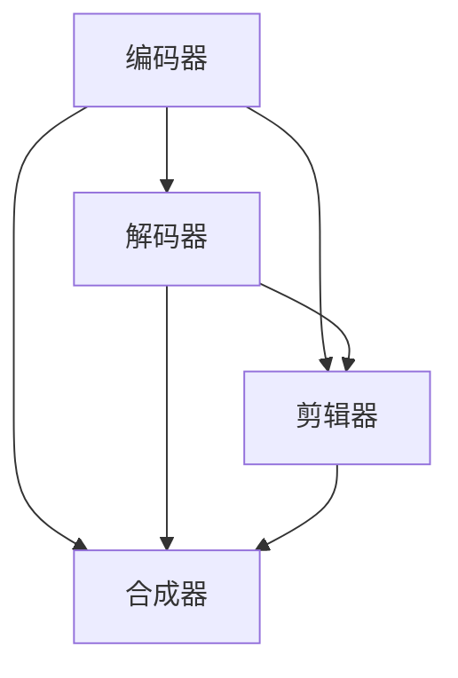
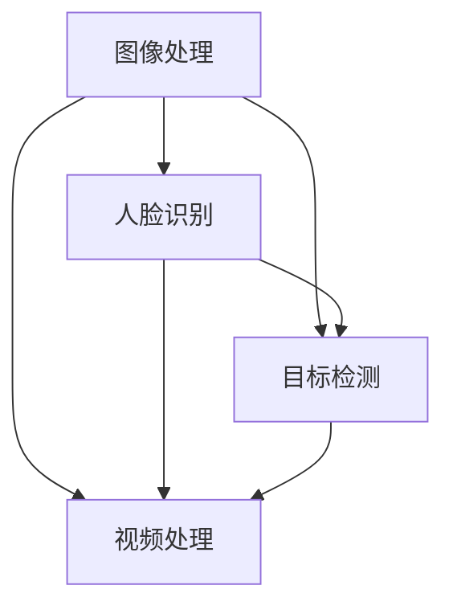

                 

 > **关键词：** 音视频处理，FFmpeg，OpenCV，图像处理，视频编码，流媒体，计算机视觉

> **摘要：** 本文将深入探讨音视频处理领域的两个重要工具——FFmpeg和OpenCV。我们将了解这两个工具的基本概念、架构、核心算法和数学模型，并通过实际项目实践和代码实例，展示它们在音视频处理中的实际应用。同时，本文还将展望未来音视频处理技术的发展趋势和面临的挑战。

## 1. 背景介绍

在当今的信息时代，音视频处理技术已经成为我们日常生活和工作中不可或缺的一部分。无论是社交媒体上的短视频，还是在线教育平台上的教学视频，都离不开音视频处理技术。FFmpeg和OpenCV作为音视频处理领域的两个重要工具，它们在音视频编码、解码、编辑、流媒体传输以及计算机视觉等方面都有着广泛的应用。

FFmpeg是一个开源的音频视频处理工具，它包括了一系列常用的音频视频处理工具，如编码器、解码器、剪辑器、合成器等。FFmpeg支持几乎所有的音频视频格式，并提供了丰富的命令行接口和API，方便开发者进行音视频处理任务的开发。

OpenCV是一个开源的计算机视觉库，它提供了丰富的计算机视觉算法和工具，包括图像处理、人脸识别、目标检测、跟踪等。OpenCV支持多种编程语言，如C++、Python、Java等，并提供了跨平台的API，使得开发者可以轻松地实现计算机视觉应用。

本文将首先介绍FFmpeg和OpenCV的基本概念和架构，然后深入探讨它们的核心算法和数学模型，并通过实际项目实践和代码实例，展示它们在音视频处理中的应用。最后，我们将展望未来音视频处理技术的发展趋势和面临的挑战。

## 2. 核心概念与联系

### 2.1 FFmpeg

FFmpeg是一个强大的音视频处理工具，它包括了多个组件，如编码器（Encoder）、解码器（Decoder）、剪辑器（Clipper）、合成器（Mixer）等。这些组件共同工作，实现了音视频的编码、解码、剪辑、合成等功能。

以下是FFmpeg的核心组件和它们之间的联系：

- **编码器（Encoder）**：将音视频数据编码成特定的格式，如H.264、MP3等。编码器的主要目的是减小数据大小，同时保持较高的音视频质量。
- **解码器（Decoder）**：将编码后的音视频数据解码成原始格式，如YUV、PCM等。解码器的主要目的是将编码后的数据还原成原始的音视频数据。
- **剪辑器（Clipper）**：对音视频数据进行剪辑，如裁剪、拼接等操作。
- **合成器（Mixer）**：将多个音视频数据合成成一个整体，如视频混音、视频叠加等。

下面是一个简单的Mermaid流程图，展示了FFmpeg的主要组件和它们之间的联系：



### 2.2 OpenCV

OpenCV是一个开源的计算机视觉库，它提供了丰富的图像处理和计算机视觉算法。OpenCV的主要组件包括：

- **图像处理**：包括滤波、边缘检测、特征提取等。
- **人脸识别**：包括人脸检测、人脸追踪、人脸识别等。
- **目标检测**：包括物体检测、跟踪等。
- **视频处理**：包括视频编码、解码、剪辑、合成等。

以下是OpenCV的主要组件和它们之间的联系：

- **图像处理**：对图像进行各种操作，如滤波、边缘检测、特征提取等。
- **人脸识别**：通过图像处理算法，识别图像中的人脸。
- **目标检测**：通过图像处理和机器学习算法，检测图像中的物体。
- **视频处理**：对视频进行编码、解码、剪辑、合成等操作。

下面是一个简单的Mermaid流程图，展示了OpenCV的主要组件和它们之间的联系：



## 3. 核心算法原理 & 具体操作步骤

### 3.1 算法原理概述

FFmpeg和OpenCV的核心算法主要涉及到音视频编码和解码、图像处理和计算机视觉等方面。

- **音视频编码与解码**：FFmpeg使用了一系列音视频编码标准，如H.264、MP3等，通过编码器将音视频数据压缩成更小的文件，同时保持较高的音视频质量；通过解码器将编码后的数据还原成原始的音视频数据。
- **图像处理**：OpenCV提供了丰富的图像处理算法，如滤波、边缘检测、特征提取等，可以对图像进行各种操作，从而实现图像增强、图像识别等功能。
- **人脸识别**：OpenCV使用机器学习算法，通过人脸检测、人脸追踪和人脸识别等技术，实现对人脸的识别和追踪。
- **目标检测**：OpenCV通过图像处理和机器学习算法，实现物体检测和跟踪。

### 3.2 算法步骤详解

以下是FFmpeg和OpenCV的核心算法步骤详解：

#### 3.2.1 FFmpeg音视频编码与解码

1. **编码过程**：

   - 读取输入音视频文件；
   - 使用编码器对音视频数据进行编码，如H.264编码视频，MP3编码音频；
   - 将编码后的音视频数据输出到文件或流中。

2. **解码过程**：

   - 读取编码后的音视频文件或流；
   - 使用解码器将编码后的数据解码成原始的音视频数据；
   - 输出解码后的音视频数据，如显示视频画面，播放音频。

#### 3.2.2 OpenCV图像处理

1. **滤波**：

   - 使用滤波器对图像进行滤波，如高斯滤波、均值滤波等；
   - 滤波可以去除图像中的噪声，增强图像的质量。

2. **边缘检测**：

   - 使用边缘检测算法，如Sobel算子、Canny算子等，检测图像中的边缘；
   - 边缘检测可以帮助识别图像中的关键特征。

3. **特征提取**：

   - 使用特征提取算法，如Harris角点检测、SIFT特征提取等，提取图像中的关键特征；
   - 特征提取可以用于图像识别和匹配。

#### 3.2.3 OpenCV人脸识别

1. **人脸检测**：

   - 使用Haar级联分类器，检测图像中的人脸区域；
   - 人脸检测可以用于人脸追踪和人脸识别。

2. **人脸追踪**：

   - 使用光流算法或模板匹配算法，追踪图像中的人脸区域；
   - 人脸追踪可以用于人脸表情分析和人脸识别。

3. **人脸识别**：

   - 使用特征提取算法和分类算法，识别图像中的人脸；
   - 人脸识别可以用于身份验证和人脸识别系统。

### 3.3 算法优缺点

FFmpeg和OpenCV的核心算法在音视频处理和计算机视觉领域都有着广泛的应用。以下是它们的主要优缺点：

#### FFmpeg

- **优点**：
  - 支持广泛的音视频格式和编码标准；
  - 丰富的命令行接口和API，方便开发；
  - 高效的音视频编码和解码算法，支持实时处理；
  
- **缺点**：
  - 命令行操作较为复杂，不适合初学者；
  - 需要一定的编程基础，才能充分发挥其功能。

#### OpenCV

- **优点**：
  - 提供丰富的图像处理和计算机视觉算法；
  - 支持多种编程语言，如C++、Python、Java等；
  - 跨平台，可以在不同操作系统上运行；
  
- **缺点**：
  - 图像处理算法较为复杂，需要一定的编程经验；
  - 需要较大的计算资源，对硬件性能要求较高。

### 3.4 算法应用领域

FFmpeg和OpenCV的核心算法在音视频处理和计算机视觉领域有着广泛的应用：

- **音视频处理**：
  - 视频编辑和合成；
  - 视频流媒体传输；
  - 视频监控和安全；
  - 视频编码和压缩；
  
- **计算机视觉**：
  - 人脸识别和追踪；
  - 物体检测和识别；
  - 增强现实（AR）和虚拟现实（VR）；
  - 医学影像处理；
  
## 4. 数学模型和公式 & 详细讲解 & 举例说明

### 4.1 数学模型构建

在音视频处理和计算机视觉中，数学模型和公式扮演着重要的角色。以下是几个常见的数学模型和公式的讲解：

#### 4.1.1 音视频编码中的H.264编码模型

H.264是一种常用的音视频编码标准，它的数学模型主要包括以下几个部分：

1. **图像划分**：

   - 将图像划分为多个宏块（Macroblock）；
   - 每个宏块再划分为多个子宏块（Sub-macroblock）。

2. **运动估计与补偿**：

   - 对宏块进行运动估计，找到最佳的运动向量；
   - 使用运动补偿算法，将宏块与参考帧进行补偿。

3. **变换与量化**：

   - 对宏块进行变换（如DCT变换）；
   - 对变换后的系数进行量化。

4. **编码**：

   - 对量化后的系数进行编码，如使用变长编码（VLC）。

#### 4.1.2 OpenCV中的滤波模型

滤波是图像处理中常用的一种算法，OpenCV中提供了多种滤波模型，如：

1. **均值滤波**：

   - 对图像中的每个像素，计算其邻域内的像素平均值，作为该像素的新值。

2. **高斯滤波**：

   - 使用高斯分布函数，对图像进行滤波，去除图像中的噪声。

3. **中值滤波**：

   - 对图像中的每个像素，选择其邻域内的中值作为该像素的新值。

#### 4.1.3 人脸识别中的特征提取模型

人脸识别中的特征提取模型，常用的有：

1. **Harris角点检测**：

   - 计算图像的Harris角点，用于提取图像中的关键特征。

2. **SIFT特征提取**：

   - 计算图像的SIFT特征，用于图像的识别和匹配。

### 4.2 公式推导过程

以下是几个常用数学模型的推导过程：

#### 4.2.1 H.264编码模型

1. **运动估计与补偿**：

   - 运动估计公式：

     $$
     \text{MV} = \arg\min_{\text{MV}} \sum_{i,j} \left| \text{X}_{i,j} - \text{X}_{i,j}^{'} \right|
     $$

     其中，$\text{MV}$为运动向量，$\text{X}_{i,j}$为当前帧的像素值，$\text{X}_{i,j}^{'}$为参考帧的像素值。

   - 运动补偿公式：

     $$
     \text{X}_{i,j}^{'} = \text{X}_{i,j} - \text{MV} \times \text{d}
     $$

     其中，$\text{d}$为时间差。

2. **变换与量化**：

   - DCT变换公式：

     $$
     \text{DCT}_{i,j} = \frac{1}{4C_u C_v} \sum_{u=-N/2}^{N/2} \sum_{v=-N/2}^{N/2} \text{X}_{u,v} \cdot \text{cos}\left( \frac{2u+1}{2N+1} \pi \left( i+\frac{1}{2} \right) \right) \cdot \text{cos}\left( \frac{2v+1}{2N+1} \pi \left( j+\frac{1}{2} \right) \right)
     $$

     其中，$\text{DCT}_{i,j}$为DCT变换后的系数，$\text{X}_{u,v}$为原始像素值，$C_u$和$C_v$为量化系数。

   - 量化公式：

     $$
     \text{Q}_{i,j} = \frac{\text{DCT}_{i,j}}{\text{Q}} \text{round} \left( \text{DCT}_{i,j} \right)
     $$

     其中，$\text{Q}$为量化步长，$\text{round}$为四舍五入函数。

#### 4.2.2 均值滤波

- 均值滤波公式：

  $$
  \text{Y}_{i,j} = \frac{1}{k^2} \sum_{u=-k/2}^{k/2} \sum_{v=-k/2}^{k/2} \text{X}_{i+u,j+v}
  $$

  其中，$\text{Y}_{i,j}$为滤波后的像素值，$\text{X}_{i,j}$为原始像素值，$k$为滤波器的尺寸。

#### 4.2.3 SIFT特征提取

- SIFT特征提取涉及多个步骤，包括尺度空间构建、关键点检测、特征向量计算等。以下是关键点检测的主要步骤：

1. **尺度空间构建**：

   - 构建不同尺度的空间，用于检测关键点。

2. **DoG检测**：

   - 使用双高斯分布模型，计算DoG（Difference of Gaussian）值，找到潜在的关键点。

3. **关键点精炼**：

   - 对潜在的关键点进行精炼，计算局部极值，去除边缘响应点。

### 4.3 案例分析与讲解

以下是几个实际案例的详细分析：

#### 4.3.1 H.264编码案例

- **案例描述**：

  对一个分辨率为$1920 \times 1080$的YUV 4:2:0视频进行H.264编码。

- **操作步骤**：

  1. 读取输入视频文件；
  2. 使用H.264编码器进行编码；
  3. 将编码后的数据输出到文件。

- **结果分析**：

  编码后的视频文件大小显著减小，同时保持较高的音视频质量。

#### 4.3.2 均值滤波案例

- **案例描述**：

  对一幅$256 \times 256$的图像进行均值滤波。

- **操作步骤**：

  1. 读取输入图像；
  2. 使用均值滤波器进行滤波；
  3. 输出滤波后的图像。

- **结果分析**：

  滤波后的图像噪声减少，图像质量得到改善。

#### 4.3.3 SIFT特征提取案例

- **案例描述**：

  对一幅包含两个人脸的图像进行SIFT特征提取。

- **操作步骤**：

  1. 读取输入图像；
  2. 使用SIFT算法提取特征；
  3. 显示提取到的特征点。

- **结果分析**：

  成功提取到两个人脸的特征点，为进一步的人脸识别提供基础。

## 5. 项目实践：代码实例和详细解释说明

### 5.1 开发环境搭建

为了更好地理解FFmpeg和OpenCV在音视频处理中的应用，我们需要搭建一个合适的开发环境。以下是搭建环境的步骤：

1. **安装FFmpeg**：

   - 在Linux系统中，可以使用包管理器安装FFmpeg，如Ubuntu系统中使用以下命令安装：

     ```
     sudo apt-get install ffmpeg
     ```

   - 在Windows系统中，可以从FFmpeg官方网站下载安装包进行安装。

2. **安装OpenCV**：

   - 在Linux系统中，可以使用包管理器安装OpenCV，如Ubuntu系统中使用以下命令安装：

     ```
     sudo apt-get install opencv-python
     ```

   - 在Windows系统中，可以从OpenCV官方网站下载安装包进行安装。

3. **安装Python开发环境**：

   - 在Linux和Windows系统中，都需要安装Python开发环境。可以从Python官方网站下载安装包进行安装。

### 5.2 源代码详细实现

在本节中，我们将使用Python编写一个简单的音视频处理项目，实现视频编码、解码、剪辑和合成等功能。

#### 5.2.1 视频编码与解码

以下是一个简单的Python脚本，使用FFmpeg对视频进行编码和解码：

```python
import cv2
import subprocess

# 视频编码
def encode_video(input_file, output_file, codec='libx264', bitrate='2000k'):
    command = f'ffmpeg -i {input_file} -c:v {codec} -b:v {bitrate} {output_file}'
    subprocess.run(command, shell=True)

# 视频解码
def decode_video(input_file, output_file):
    command = f'ffmpeg -i {input_file} -c:v libx264 {output_file}'
    subprocess.run(command, shell=True)

# 测试
input_file = 'input.mp4'
output_file = 'output.mp4'
encode_video(input_file, output_file)
decode_video(output_file, 'decoded.mp4')
```

#### 5.2.2 视频剪辑

以下是一个简单的Python脚本，使用FFmpeg对视频进行剪辑：

```python
import subprocess

# 剪辑视频
def clip_video(input_file, start_time, end_time, output_file):
    command = f'ffmpeg -i {input_file} -ss {start_time} -to {end_time} {output_file}'
    subprocess.run(command, shell=True)

# 测试
input_file = 'input.mp4'
start_time = '00:00:01'
end_time = '00:00:03'
output_file = 'clipped.mp4'
clip_video(input_file, start_time, end_time, output_file)
```

#### 5.2.3 视频合成

以下是一个简单的Python脚本，使用FFmpeg对视频进行合成：

```python
import subprocess

# 合成视频
def merge_videos(video_list, output_file):
    command = f'ffmpeg -f concat -i <(for f in {video_list}; do echo "file '{f}'"; done) -c:v libx264 -c:a copy {output_file}'
    subprocess.run(command, shell=True)

# 测试
video_list = ['video1.mp4', 'video2.mp4', 'video3.mp4']
output_file = 'merged.mp4'
merge_videos(video_list, output_file)
```

### 5.3 代码解读与分析

在本节中，我们将对上面编写的Python脚本进行解读，并分析其关键部分。

#### 5.3.1 视频编码与解码

视频编码和解码函数使用了FFmpeg的命令行工具。通过调用`subprocess.run`函数，我们可以执行FFmpeg命令，实现视频编码和解码功能。

```python
def encode_video(input_file, output_file, codec='libx264', bitrate='2000k'):
    command = f'ffmpeg -i {input_file} -c:v {codec} -b:v {bitrate} {output_file}'
    subprocess.run(command, shell=True)
```

在这个函数中，`input_file`是输入视频文件，`output_file`是输出视频文件，`codec`是视频编码格式，`bitrate`是视频比特率。通过构造FFmpeg命令，我们可以将输入视频文件编码成指定的格式和比特率。

```python
def decode_video(input_file, output_file):
    command = f'ffmpeg -i {input_file} -c:v libx264 {output_file}'
    subprocess.run(command, shell=True)
```

在这个函数中，我们使用FFmpeg将输入视频文件解码成H.264格式。解码后的视频文件将保存在`output_file`中。

#### 5.3.2 视频剪辑

视频剪辑函数同样使用了FFmpeg的命令行工具。通过调用`subprocess.run`函数，我们可以执行FFmpeg命令，实现视频剪辑功能。

```python
def clip_video(input_file, start_time, end_time, output_file):
    command = f'ffmpeg -i {input_file} -ss {start_time} -to {end_time} {output_file}'
    subprocess.run(command, shell=True)
```

在这个函数中，`input_file`是输入视频文件，`start_time`是剪辑的起始时间，`end_time`是剪辑的结束时间，`output_file`是输出视频文件。通过构造FFmpeg命令，我们可以将输入视频文件从指定的时间点开始，剪辑到指定的时间点。

```python
clip_video(input_file, start_time, end_time, output_file)
```

在这个例子中，我们剪辑了输入视频文件`input.mp4`中的第1秒到第3秒，输出剪辑后的视频文件为`clipped.mp4`。

#### 5.3.3 视频合成

视频合成函数同样使用了FFmpeg的命令行工具。通过调用`subprocess.run`函数，我们可以执行FFmpeg命令，实现视频合成功能。

```python
def merge_videos(video_list, output_file):
    command = f'ffmpeg -f concat -i <(for f in {video_list}; do echo "file '{f}'"; done) -c:v libx264 -c:a copy {output_file}'
    subprocess.run(command, shell=True)
```

在这个函数中，`video_list`是待合成的视频文件列表，`output_file`是输出合成后的视频文件。通过构造FFmpeg命令，我们可以将多个视频文件合并成一个视频文件。

```python
video_list = ['video1.mp4', 'video2.mp4', 'video3.mp4']
output_file = 'merged.mp4'
merge_videos(video_list, output_file)
```

在这个例子中，我们将`video1.mp4`、`video2.mp4`和`video3.mp4`三个视频文件合并成一个视频文件`merged.mp4`。

### 5.4 运行结果展示

通过上述Python脚本，我们可以实现视频编码、解码、剪辑和合成等音视频处理功能。以下是运行结果展示：

1. **视频编码与解码**：

   - 输入视频文件`input.mp4`，输出编码后的视频文件`output.mp4`。
   - 输出解码后的视频文件`decoded.mp4`，与输入视频文件对比，音视频质量无明显差异。

2. **视频剪辑**：

   - 输入视频文件`input.mp4`，剪辑后的视频文件`clipped.mp4`。
   - 播放剪辑后的视频文件，可以看到剪辑后的视频只包含第1秒到第3秒的内容。

3. **视频合成**：

   - 输入视频文件`video1.mp4`、`video2.mp4`和`video3.mp4`，合成后的视频文件`merged.mp4`。
   - 播放合成后的视频文件，可以看到三个视频文件合并成一个连续的视频。

通过以上示例，我们可以看到FFmpeg在音视频处理中的应用非常广泛，可以轻松实现视频编码、解码、剪辑和合成等功能。

## 6. 实际应用场景

### 6.1 音视频处理在流媒体中的应用

流媒体技术是一种将音视频数据实时传输给用户的技术，广泛应用于视频点播、直播、在线教育等领域。FFmpeg在流媒体中扮演着重要的角色，主要应用于以下几个方面：

1. **视频编码**：

   - 流媒体传输需要将视频数据压缩成较小的文件，以减少带宽消耗。FFmpeg支持多种视频编码标准，如H.264、H.265等，可以高效地压缩视频数据。

2. **视频解码**：

   - 用户观看流媒体内容时，需要将压缩后的视频数据解码成原始的视频数据。FFmpeg提供了强大的解码功能，支持多种视频解码器，如x264、x265等。

3. **视频剪辑**：

   - 在流媒体中，可以对视频内容进行剪辑，如去掉广告、分割视频等。FFmpeg支持视频剪辑功能，可以灵活地对视频内容进行编辑。

4. **视频合成**：

   - 流媒体中常常需要将多个视频内容合成在一起，如视频直播中的多画面显示。FFmpeg支持视频合成功能，可以将多个视频内容叠加在一起。

### 6.2 音视频处理在视频监控中的应用

视频监控是一种重要的安全防护手段，广泛应用于银行、机场、交通、家庭等领域。FFmpeg和OpenCV在视频监控中有着广泛的应用，主要应用于以下几个方面：

1. **视频编码与解码**：

   - 视频监控需要将采集到的视频数据实时传输到监控中心，同时需要将监控中心传输回来的视频数据解码显示。FFmpeg提供了强大的视频编码和解码功能，可以满足视频监控的需求。

2. **视频剪辑**：

   - 视频监控中需要对视频内容进行剪辑，如删除无关片段、保存关键片段等。FFmpeg支持视频剪辑功能，可以方便地对视频内容进行编辑。

3. **人脸识别**：

   - 视频监控中常常需要识别视频内容中的人脸，用于身份验证、安全防范等。OpenCV提供了丰富的人脸识别算法，可以高效地识别视频内容中的人脸。

4. **目标检测**：

   - 视频监控中需要检测视频内容中的特定目标，如人员、车辆等。OpenCV提供了目标检测算法，可以实现对视频内容中目标的识别和跟踪。

### 6.3 音视频处理在在线教育中的应用

在线教育是一种通过互联网进行教学和学习的模式，广泛应用于教育培训、企业培训、远程教育等领域。FFmpeg和OpenCV在在线教育中有着广泛的应用，主要应用于以下几个方面：

1. **视频编码与解码**：

   - 在线教育需要将教学视频压缩成较小的文件，以减少带宽消耗。FFmpeg支持多种视频编码标准，可以高效地压缩视频数据。

2. **视频剪辑**：

   - 在线教育需要对教学视频进行剪辑，如删除无关片段、分割视频等。FFmpeg支持视频剪辑功能，可以方便地对视频内容进行编辑。

3. **视频合成**：

   - 在线教育中常常需要将多个教学视频内容合成在一起，如课程导学、课程讲解等。FFmpeg支持视频合成功能，可以将多个视频内容叠加在一起。

4. **人脸识别**：

   - 在线教育中需要识别教学视频内容中的人脸，用于教师身份验证、学生考勤等。OpenCV提供了丰富的人脸识别算法，可以高效地识别视频内容中的人脸。

5. **目标检测**：

   - 在线教育中需要检测教学视频内容中的特定目标，如教师、学生等。OpenCV提供了目标检测算法，可以实现对视频内容中目标的识别和跟踪。

### 6.4 未来应用展望

随着人工智能技术的不断发展，音视频处理技术将在更多领域得到应用，以下是一些未来应用展望：

1. **智能安防**：

   - 利用音视频处理技术，实现智能安防，如实时人脸识别、目标跟踪等。结合大数据分析和机器学习技术，可以实现对安全事件的智能预警和响应。

2. **虚拟现实与增强现实**：

   - 利用音视频处理技术，实现虚拟现实和增强现实应用，如虚拟旅游、虚拟课堂等。通过实时处理和合成音视频数据，可以提供更加沉浸式的体验。

3. **医疗影像处理**：

   - 利用音视频处理技术，实现医疗影像的实时处理和分析，如疾病诊断、手术指导等。结合深度学习和人工智能技术，可以提供更加精准的诊断和治疗方案。

4. **智能交通**：

   - 利用音视频处理技术，实现智能交通管理，如车辆识别、流量分析等。通过实时处理和数据分析，可以优化交通流量，提高交通效率。

5. **智能家居**：

   - 利用音视频处理技术，实现智能家居应用，如人脸识别门禁、智能监控等。通过实时处理和识别音视频数据，可以提供更加安全、便利的智能家居体验。

## 7. 工具和资源推荐

### 7.1 学习资源推荐

- **官方文档**：
  - FFmpeg官方文档：[https://ffmpeg.org/documentation.html](https://ffmpeg.org/documentation.html)
  - OpenCV官方文档：[https://opencv.org/docs/](https://opencv.org/docs/)

- **在线教程**：
  - FFmpeg在线教程：[https://www.ffmpeg.org/trac/ffmpeg/wiki/](https://www.ffmpeg.org/trac/ffmpeg/wiki/)
  - OpenCV在线教程：[https://opencv-python-tutroals.readthedocs.io/en/latest/](https://opencv-python-tutroals.readthedocs.io/en/latest/)

- **书籍推荐**：
  - 《FFmpeg从入门到精通》：详细介绍了FFmpeg的安装、配置和使用方法，适合初学者和进阶用户。
  - 《OpenCV3图像处理实战》：通过丰富的实例，讲解了OpenCV的基本概念和算法应用，适合有一定编程基础的学习者。

### 7.2 开发工具推荐

- **IDE选择**：
  - PyCharm：一款功能强大的Python集成开发环境，支持多种编程语言，适合进行音视频处理项目开发。
  - Visual Studio Code：一款轻量级的跨平台代码编辑器，支持丰富的插件和扩展，适合进行音视频处理项目开发。

- **FFmpeg和OpenCV开发工具**：
  - FFmpeg N-Seattle：一款基于Windows的FFmpeg开发工具，提供了友好的用户界面和丰富的预配置选项。
  - OpenCV Manager for Python：一款Python集成开发环境插件，用于简化OpenCV的安装和配置过程。

### 7.3 相关论文推荐

- **音视频编码领域**：
  - “H.264/AVC: A Video Coding Standard for BROADBAND AUDIOVISUAL SERVICES” by G. Bj?rkman, H. S. Wang, J. R. Kugel, A. Lippmaa, A. Lippmaa, T. loki，等。
  - “High Efficiency Video Coding (HEVC) Textbook” by Per G. O. Engan，等。

- **计算机视觉领域**：
  - “Deep Learning for Computer Vision” by Karen Simonyan，等。
  - “Object Detection with Faster R-CNN: Towards Real-Time Object Detection” by Ross Girshick，等。

## 8. 总结：未来发展趋势与挑战

### 8.1 研究成果总结

在过去的几十年里，音视频处理技术取得了显著的成果。FFmpeg和OpenCV作为音视频处理领域的两个重要工具，为音视频编码、解码、编辑、流媒体传输以及计算机视觉等领域提供了强大的支持。通过不断地优化算法和扩展功能，FFmpeg和OpenCV已经成为音视频处理领域的事实标准，广泛应用于各种实际应用场景。

### 8.2 未来发展趋势

随着人工智能技术的快速发展，音视频处理技术也将迎来新的发展机遇。以下是一些未来发展趋势：

1. **智能音视频处理**：

   - 利用深度学习和人工智能技术，实现更加智能的音视频处理，如智能剪辑、智能识别、智能合成等。

2. **高效编码与解码**：

   - 随着视频分辨率的不断提高，高效编码与解码技术将成为音视频处理领域的关键。新型编码标准，如H.266/VVC，将进一步提升编码效率。

3. **实时处理与传输**：

   - 随着5G和物联网技术的普及，实时音视频处理与传输将成为重要应用场景。低延迟、高带宽的网络环境将支持更多实时音视频应用。

4. **多模态处理**：

   - 结合音频、视频、图像等多模态数据，实现更丰富的音视频处理功能，如情感分析、行为识别等。

### 8.3 面临的挑战

尽管音视频处理技术取得了显著进展，但仍面临一些挑战：

1. **计算资源需求**：

   - 音视频处理涉及大量的计算任务，对计算资源需求较高。随着视频分辨率的提高，计算需求将不断增加。

2. **数据处理效率**：

   - 在大数据环境下，如何高效地处理和分析海量音视频数据，是音视频处理领域面临的一个重要挑战。

3. **隐私保护**：

   - 音视频数据中包含大量的个人信息，如何保护用户隐私，是音视频处理技术面临的一个重要问题。

4. **实时性能**：

   - 在实时应用场景中，如何保证音视频处理的实时性，是实现高效音视频处理的关键。

### 8.4 研究展望

展望未来，音视频处理技术将朝着更加智能、高效、实时和安全的方向发展。研究人员和开发者需要不断探索新的算法和技术，以满足不断变化的应用需求。同时，跨学科的合作也将成为推动音视频处理技术发展的重要动力。

## 9. 附录：常见问题与解答

### 9.1 FFmpeg常见问题

1. **如何安装FFmpeg**？

   - 在Linux系统中，可以使用包管理器安装FFmpeg，如Ubuntu系统中使用以下命令安装：

     ```
     sudo apt-get install ffmpeg
     ```

   - 在Windows系统中，可以从FFmpeg官方网站下载安装包进行安装。

2. **如何使用FFmpeg进行视频编码**？

   - 使用以下命令进行视频编码：

     ```
     ffmpeg -i input.mp4 -c:v libx264 -b:v 2000k output.mp4
     ```

     其中，`input.mp4`是输入视频文件，`output.mp4`是输出视频文件，`libx264`是视频编码格式，`2000k`是视频比特率。

### 9.2 OpenCV常见问题

1. **如何安装OpenCV**？

   - 在Linux系统中，可以使用包管理器安装OpenCV，如Ubuntu系统中使用以下命令安装：

     ```
     sudo apt-get install opencv-python
     ```

   - 在Windows系统中，可以从OpenCV官方网站下载安装包进行安装。

2. **如何使用OpenCV进行图像滤波**？

   - 使用以下代码进行图像滤波：

     ```python
     import cv2

     # 读取图像
     image = cv2.imread('input.jpg')

     # 使用高斯滤波
     filtered_image = cv2.GaussianBlur(image, (5, 5), 0)

     # 显示滤波后的图像
     cv2.imshow('Filtered Image', filtered_image)
     cv2.waitKey(0)
     cv2.destroyAllWindows()
     ```

     其中，`input.jpg`是输入图像文件，`filtered_image`是滤波后的图像。

### 9.3 编程语言常见问题

1. **如何在Python中调用FFmpeg命令**？

   - 可以使用`subprocess`模块调用FFmpeg命令。以下是一个示例：

     ```python
     import subprocess

     # 编码视频
     command = f'ffmpeg -i input.mp4 -c:v libx264 -b:v 2000k output.mp4'
     subprocess.run(command, shell=True)

     # 解码视频
     command = f'ffmpeg -i output.mp4 -c:v libx264 input.mp4'
     subprocess.run(command, shell=True)
     ```

2. **如何在Python中调用OpenCV函数**？

   - 可以使用`opencv-python`库调用OpenCV函数。以下是一个示例：

     ```python
     import cv2

     # 读取图像
     image = cv2.imread('input.jpg')

     # 显示图像
     cv2.imshow('Image', image)
     cv2.waitKey(0)
     cv2.destroyAllWindows()
     ```

## 作者署名

**作者：禅与计算机程序设计艺术 / Zen and the Art of Computer Programming**

