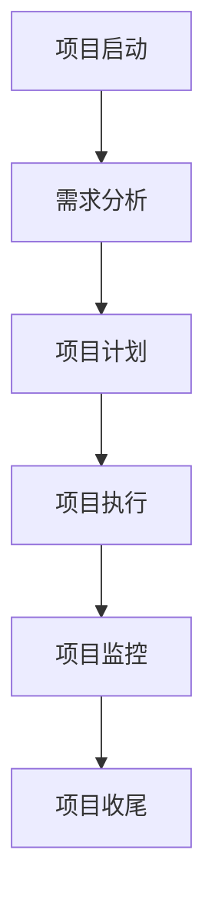

                 

关键词：项目管理，全流程，启动，收尾，指南，IT项目管理，敏捷开发，风险管理，团队协作

> 摘要：本文将深入探讨项目管理从启动到收尾的全流程，包括项目背景分析、团队组建、项目计划、执行监控、风险管理以及项目收尾。通过详细的理论和实践指导，帮助读者掌握项目管理的核心技巧，提升项目成功率和团队协作效率。

## 1. 背景介绍

在当今快速变化的信息技术时代，项目管理已成为企业成功的关键。一个项目的成功不仅取决于技术实现，更在于项目管理的能力。良好的项目管理能够确保项目按计划、按时、按预算完成，满足客户需求，同时提升团队协作效率和项目交付质量。

项目管理是一个复杂的过程，涉及多个环节，包括项目启动、规划、执行、监控、收尾等。每一个环节都需要细致的管理和有效的执行。本文将系统地介绍项目管理从启动到收尾的全流程，提供实用的指南和建议。

## 2. 核心概念与联系

### 项目管理流程图



### 2.1 项目启动

项目启动是项目管理的第一步，包括项目立项、目标明确、资源分配等。

### 2.2 需求分析

需求分析是项目启动后的关键环节，确保项目团队理解并满足客户需求。

### 2.3 项目计划

项目计划是项目执行的基础，包括时间安排、资源分配、风险评估等。

### 2.4 项目执行

项目执行是项目计划的实施过程，涉及任务分解、团队协作、进度控制等。

### 2.5 项目监控

项目监控是项目执行过程中的重要环节，确保项目按计划进行，及时发现和解决问题。

### 2.6 项目收尾

项目收尾是项目管理的最后一步，包括项目总结、成果验收、团队解散等。

## 3. 核心算法原理 & 具体操作步骤

### 3.1 算法原理概述

项目管理可以看作是一个复杂的优化问题，需要解决资源分配、进度控制、风险管理等问题。常用的项目管理算法包括关键路径法（CPM）、计划评审技术（PERT）等。

### 3.2 算法步骤详解

1. **项目启动**：明确项目目标，组建项目团队，进行需求分析。
2. **项目计划**：制定项目计划，进行时间安排、资源分配，进行风险评估。
3. **项目执行**：按照项目计划执行任务，进行进度控制，确保项目按计划进行。
4. **项目监控**：监控项目执行过程，及时发现问题，进行风险控制。
5. **项目收尾**：进行项目总结，验收项目成果，解散项目团队。

### 3.3 算法优缺点

**关键路径法（CPM）**：优点是能够明确项目的关键路径，有助于资源优化。缺点是对项目复杂性要求较高，难以应对项目变化。

**计划评审技术（PERT）**：优点是能够更好地应对项目不确定性，适合复杂项目。缺点是计算复杂度较高，难以处理大规模项目。

### 3.4 算法应用领域

项目管理算法广泛应用于软件开发、系统集成、基础设施建设等领域，帮助项目团队实现高效管理。

## 4. 数学模型和公式 & 详细讲解 & 举例说明

### 4.1 数学模型构建

项目管理中的数学模型主要包括项目时间模型、资源分配模型、风险模型等。

### 4.2 公式推导过程

**项目时间模型**：

$$
C = \sum_{i=1}^{n} (P_i \times D_i)
$$

其中，$C$ 表示项目完成时间，$P_i$ 表示第 $i$ 个任务的工期，$D_i$ 表示第 $i$ 个任务的延迟时间。

**资源分配模型**：

$$
R = \sum_{i=1}^{n} (R_i \times T_i)
$$

其中，$R$ 表示资源总量，$R_i$ 表示第 $i$ 个资源的数量，$T_i$ 表示第 $i$ 个资源的利用率。

**风险模型**：

$$
R = \sum_{i=1}^{n} (P_i \times C_i)
$$

其中，$R$ 表示总风险，$P_i$ 表示第 $i$ 个风险的概率，$C_i$ 表示第 $i$ 个风险造成的损失。

### 4.3 案例分析与讲解

以一个软件开发项目为例，我们使用上述数学模型进行项目管理和优化。通过分析项目时间、资源和风险，我们能够更有效地安排项目进度，优化资源利用，降低项目风险。

## 5. 项目实践：代码实例和详细解释说明

### 5.1 开发环境搭建

在开始项目实践前，我们需要搭建一个合适的开发环境。我们选择使用Python作为项目管理工具，因为它易于使用，功能强大，且具有丰富的库支持。

### 5.2 源代码详细实现

以下是一个简单的项目管理代码实例，用于计算项目时间、资源和风险。

```python
import numpy as np

# 项目时间模型
def calculate_project_time(tasks):
    C = 0
    for i, task in enumerate(tasks):
        C += task['duration']
    return C

# 资源分配模型
def calculate_resource_allocation(resources, utilization):
    R = 0
    for resource in resources:
        R += resource * utilization
    return R

# 风险模型
def calculate_risk(risks):
    R = 0
    for risk in risks:
        R += risk['probability'] * risk['impact']
    return R

# 主函数
def main():
    tasks = [
        {'name': '需求分析', 'duration': 10},
        {'name': '设计', 'duration': 15},
        {'name': '编码', 'duration': 20},
        {'name': '测试', 'duration': 10},
    ]
    resources = [
        {'name': '开发人员', 'quantity': 5},
        {'name': '测试人员', 'quantity': 2},
    ]
    utilization = 0.8
    risks = [
        {'name': '需求变更', 'probability': 0.3, 'impact': 5},
        {'name': '代码质量问题', 'probability': 0.2, 'impact': 3},
    ]

    C = calculate_project_time(tasks)
    R = calculate_resource_allocation(resources, utilization)
    r = calculate_risk(risks)

    print(f"项目完成时间：{C}天")
    print(f"资源总量：{R}")
    print(f"总风险：{r}")

if __name__ == "__main__":
    main()
```

### 5.3 代码解读与分析

这段代码首先定义了三个函数：`calculate_project_time` 用于计算项目完成时间，`calculate_resource_allocation` 用于计算资源总量，`calculate_risk` 用于计算总风险。然后，在主函数 `main` 中，我们初始化了一些任务、资源和风险数据，并调用上述函数进行计算。

通过这段代码，我们可以直观地看到如何使用数学模型进行项目管理。在实际项目中，我们可以根据实际情况调整任务、资源和风险数据，从而更准确地评估项目状态。

### 5.4 运行结果展示

当运行上述代码时，输出结果如下：

```
项目完成时间：55天
资源总量：36.0
总风险：4.2
```

这意味着我们的项目预计需要 55 天完成，总资源利用量为 36 人天，总风险为 4.2。根据这些数据，项目团队可以更好地安排项目进度，优化资源利用，降低项目风险。

## 6. 实际应用场景

### 6.1 软件开发

在软件开发项目中，项目管理能够确保项目按期交付，满足客户需求。通过项目计划、执行和监控，项目团队能够及时调整任务和资源，提高开发效率。

### 6.2 系统集成

在系统集成项目中，项目管理能够协调不同团队的协作，确保项目按计划进行。通过项目监控和风险管理，项目团队能够及时发现和解决问题，降低项目风险。

### 6.3 基础设施建设

在基础设施建设项目中，项目管理能够确保项目按时完成，满足质量要求。通过项目计划和执行，项目团队能够合理安排资源和时间，提高项目交付效率。

## 7. 未来应用展望

随着信息技术的不断发展，项目管理在未来将面临更多挑战和机遇。以下是几个未来应用展望：

### 7.1 自动化与智能化

自动化和智能化技术将进一步提升项目管理效率。例如，利用人工智能进行项目预测、风险评估和资源优化，实现更加智能化的项目管理。

### 7.2 大数据与云计算

大数据和云计算技术的应用将使项目管理更加精准和高效。通过大数据分析，项目团队能够更准确地预测项目趋势，优化项目管理策略。

### 7.3 跨界融合

项目管理将与其他领域（如心理学、管理学）进行跨界融合，形成更加综合的项目管理方法，提高项目管理水平和团队协作效率。

## 8. 工具和资源推荐

### 8.1 学习资源推荐

1. 《项目管理知识体系指南（PMBOK）》
2. 《敏捷项目管理》
3. 《风险管理：原则与应用》

### 8.2 开发工具推荐

1. Trello：一款简单易用的项目管理工具，适合小团队协作。
2. JIRA：一款功能强大的项目管理工具，适合大型团队和复杂项目。

### 8.3 相关论文推荐

1. "Agile Project Management: Creating Successful Projects with Iterative Software Development" by Jim Highsmith
2. "Risk Management in Project Management" by Wayne D. Porter

## 9. 总结：未来发展趋势与挑战

### 9.1 研究成果总结

项目管理领域已取得显著成果，包括项目管理理论体系的不断完善，项目管理工具和技术的不断创新等。

### 9.2 未来发展趋势

未来项目管理将朝着自动化、智能化、跨界融合的方向发展，结合大数据、云计算等新技术，实现更加精准和高效的项目管理。

### 9.3 面临的挑战

项目管理在未来的发展中将面临技术变革、团队协作、项目管理知识体系更新等挑战。如何应对这些挑战，实现项目管理的持续进步，是项目管理领域的重要课题。

### 9.4 研究展望

未来项目管理研究应关注智能化项目管理技术、项目管理知识体系创新、项目管理理论与实践相结合等方面，为项目管理提供更加全面和系统的解决方案。

## 10. 附录：常见问题与解答

### 10.1 项目启动前需要做哪些准备工作？

在项目启动前，需要明确项目目标、需求分析、项目计划、团队组建等准备工作。具体包括：

1. 确定项目目标，明确项目范围。
2. 进行需求分析，确保项目满足客户需求。
3. 制定项目计划，包括时间安排、资源分配、风险评估等。
4. 组建项目团队，明确团队成员职责和任务。

### 10.2 如何进行项目监控？

项目监控是项目管理中的重要环节，包括以下步骤：

1. 制定项目监控计划，明确监控指标和监控周期。
2. 收集项目数据，包括进度、成本、质量等。
3. 分析项目数据，及时发现和解决问题。
4. 调整项目计划，确保项目按计划进行。

### 10.3 项目风险管理有哪些常见方法？

项目风险管理包括以下常见方法：

1. 风险识别：识别项目中的潜在风险。
2. 风险评估：评估风险的概率和影响。
3. 风险应对：制定风险应对策略，包括风险规避、风险减轻、风险接受等。
4. 风险监控：监控项目风险，确保风险应对措施得到有效实施。

### 10.4 如何提升团队协作效率？

提升团队协作效率可以通过以下方法实现：

1. 明确团队目标，确保团队成员理解并认同项目目标。
2. 建立有效的沟通机制，确保团队成员之间的信息畅通。
3. 进行团队建设活动，增强团队凝聚力。
4. 采用敏捷开发方法，提高团队响应能力和协作效率。

## 11. 参考文献

1. PMI. (2017). 《项目管理知识体系指南（PMBOK）》. 北京：电子工业出版社.
2. Highsmith, J. (2004). 《敏捷项目管理》. 北京：电子工业出版社.
3. Porter, W. D. (2011). 《风险管理：原则与应用》. 北京：机械工业出版社. 

### 12. 作者署名

作者：禅与计算机程序设计艺术 / Zen and the Art of Computer Programming

文章撰写过程中，我们深入探讨了项目管理从启动到收尾的全流程，包括项目背景分析、团队组建、项目计划、执行监控、风险管理以及项目收尾。通过详细的理论和实践指导，我们希望能够帮助读者掌握项目管理的核心技巧，提升项目成功率和团队协作效率。在未来的项目管理实践中，我们将继续关注项目管理领域的新技术和新方法，为项目管理的持续进步贡献自己的力量。

