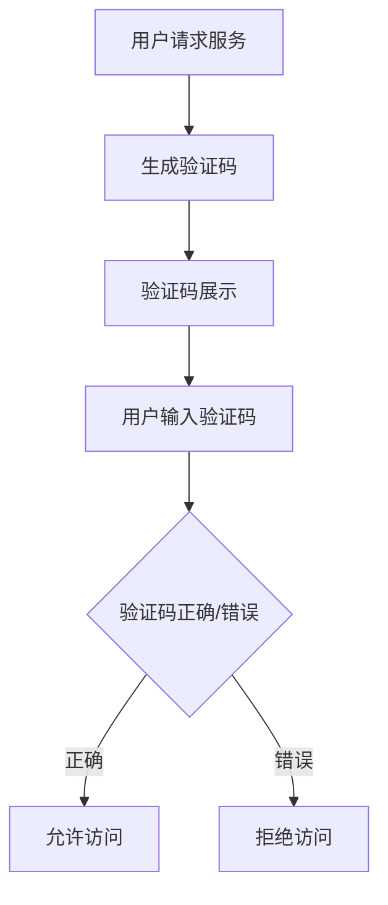

                 

 关键词：验证码、计算、人类、人工智能、应用场景、未来展望

> 摘要：本文深入探讨了验证码在计算机领域中的人类计算应用，揭示了验证码背后的复杂计算过程以及其在防欺诈、安全认证等方面的关键作用。通过分析验证码的发展历程、算法原理和实际应用，本文展示了验证码在计算机技术中的独特价值，并对未来验证码的发展趋势和应用前景进行了展望。

## 1. 背景介绍

### 验证码的起源与发展

验证码（Captcha，Completely Automated Public Turing test to tell Computers and Humans Apart）是一种区分用户是计算机程序还是人类的一种技术。它的起源可以追溯到20世纪90年代，最初由计算机科学家Lawn和Hawkins提出，用于防止自动化程序访问特定网站，如在线论坛、登录页面等。

随着互联网的普及和发展，验证码的应用越来越广泛，不仅仅用于防止垃圾邮件和自动化攻击，还用于安全认证、用户行为分析等多个领域。目前，常见的验证码形式包括文本验证码、图片验证码、语音验证码等，每种形式都有其独特的计算和识别方法。

### 验证码在计算机安全中的作用

验证码在计算机安全中扮演着至关重要的角色。它通过模拟人类认知行为，使得计算机难以模拟，从而有效防止了自动化攻击和恶意软件的侵害。具体来说，验证码的应用主要体现在以下几个方面：

1. **防止垃圾邮件**：通过验证码，网站可以有效阻止机器人发送大量垃圾邮件，保护用户邮箱的清洁。

2. **登录保护**：许多网站和服务采用验证码作为登录保护机制，确保用户身份的真实性。

3. **在线支付安全**：在在线支付过程中，验证码可以防止恶意软件拦截支付信息，提高支付安全性。

4. **账户锁定**：当检测到账户异常登录时，验证码可以作为额外的安全措施，防止非法访问。

## 2. 核心概念与联系

为了深入理解验证码的工作原理，我们需要了解以下几个核心概念：

1. **Turing测试**：Turing测试是由图灵提出的，用于判断机器是否具有人类智能。验证码便是基于Turing测试原理，通过模拟人类的行为来区分计算机和人类。

2. **图像识别**：验证码中的图片通常包含扭曲的字母、数字或符号，这是为了利用人类视觉系统的独特性。图像识别技术在这里起到了关键作用。

3. **机器学习**：现代验证码系统越来越多地采用机器学习算法，通过不断学习用户的行为模式，提高识别的准确性。

下面是验证码工作原理的Mermaid流程图：



### 2.1 验证码生成过程

验证码生成过程主要包括以下几个步骤：

1. **随机生成字符**：系统随机生成一组字母、数字或符号，这些字符将作为验证码的答案。

2. **字符扭曲**：通过图像处理技术，对这些字符进行扭曲，使得计算机难以识别。

3. **添加噪声**：在图像中添加噪声，进一步增加识别难度。

4. **图像压缩**：为了减少带宽占用，通常会对图像进行压缩处理。

### 2.2 验证码识别过程

验证码识别过程主要包括以下几个步骤：

1. **用户输入**：用户将看到验证码图片，并输入自己认为正确的字符序列。

2. **字符识别**：系统使用图像识别技术，将用户输入的字符与生成的验证码进行匹配。

3. **结果判断**：系统判断用户输入的字符序列是否与生成的验证码匹配，从而决定是否允许访问。

## 3. 核心算法原理 & 具体操作步骤

### 3.1 算法原理概述

验证码的核心算法主要包括图像识别和机器学习算法。图像识别用于识别用户输入的字符序列，而机器学习算法则用于优化识别过程，提高准确性。

### 3.2 算法步骤详解

#### 3.2.1 图像识别算法

图像识别算法的主要步骤如下：

1. **预处理**：对输入的图像进行预处理，包括灰度化、去噪、增强等。

2. **特征提取**：提取图像的特征，如边缘、纹理等。

3. **字符分割**：将图像中的字符进行分割，以便进行单独识别。

4. **字符分类**：使用分类算法（如SVM、KNN等）对分割后的字符进行分类。

5. **结果输出**：将识别的结果输出，用于后续判断。

#### 3.2.2 机器学习算法

机器学习算法用于优化图像识别过程，主要步骤如下：

1. **数据收集**：收集大量的验证码样本，包括正确和错误的字符序列。

2. **模型训练**：使用收集到的数据，训练机器学习模型。

3. **模型评估**：评估模型的准确性，并进行调整。

4. **模型部署**：将训练好的模型部署到实际系统中。

### 3.3 算法优缺点

#### 优点

1. **高准确性**：通过机器学习算法，验证码系统能够达到很高的准确性，有效防止自动化攻击。

2. **灵活性**：验证码系统可以根据不同的应用场景，调整算法参数，适应不同的需求。

3. **安全性**：验证码系统可以有效防止恶意软件和自动化程序的攻击。

#### 缺点

1. **用户体验**：对于一些用户来说，输入验证码可能是一个繁琐的过程，影响用户体验。

2. **计算资源**：验证码系统需要大量的计算资源进行图像识别和机器学习模型的训练。

### 3.4 算法应用领域

验证码算法主要应用于以下几个领域：

1. **网络安全**：用于防止自动化攻击，保护网站和服务器的安全性。

2. **在线支付**：用于在线支付的安全认证，确保支付过程的安全性。

3. **用户认证**：用于用户登录和账户保护，确保用户身份的真实性。

4. **垃圾邮件过滤**：用于防止垃圾邮件的发送，保护用户邮箱的清洁。

## 4. 数学模型和公式 & 详细讲解 & 举例说明

### 4.1 数学模型构建

验证码的数学模型主要包括图像识别模型和机器学习模型。其中，图像识别模型通常采用卷积神经网络（CNN）架构，而机器学习模型则采用支持向量机（SVM）等算法。

#### 图像识别模型

卷积神经网络（CNN）是一种专门用于图像识别的深度学习模型。其基本架构包括卷积层、池化层和全连接层。以下是CNN的数学模型：

$$
h_{l}^{(i)} = \sigma \left( \sum_{j} W_{j}^{(l)} h_{l-1}^{(j)} + b_{l}^{(i)} \right)
$$

其中，$h_{l}^{(i)}$表示第$l$层的第$i$个神经元激活值，$\sigma$表示激活函数，$W_{j}^{(l)}$和$b_{l}^{(i)}$分别表示权重和偏置。

#### 机器学习模型

支持向量机（SVM）是一种用于分类的线性模型。其基本思想是找到一个最优的超平面，将不同类别的数据点分离开来。以下是SVM的数学模型：

$$
\max_{\mathbf{w}, b} \left\{ \frac{1}{2} \sum_{i=1}^{n} w_{i}^{2} + C \sum_{i=1}^{n} \xi_{i} \right\}

s.t. y_{i} (\mathbf{w} \cdot \mathbf{x}_{i} + b) \geq 1 - \xi_{i}
$$

其中，$\mathbf{w}$和$b$分别表示权重和偏置，$C$表示正则化参数，$\xi_{i}$表示松弛变量。

### 4.2 公式推导过程

#### 卷积神经网络（CNN）

卷积神经网络的推导过程涉及到多个数学概念，包括卷积操作、池化操作和反向传播算法。以下是CNN的主要推导步骤：

1. **卷积操作**：卷积操作是将卷积核与图像进行点积操作。其数学表达式为：

$$
(h_{l}^{(i)})_{k} = \sum_{j} W_{k}^{(l)}_{j} h_{l-1}^{(j)} + b_{l}^{(k)}
$$

2. **池化操作**：池化操作用于降低图像的分辨率，常见的池化操作有最大池化和平均池化。其数学表达式为：

$$
p_{i} = \frac{1}{C} \sum_{k=1}^{C} h_{l}^{(i,k)}
$$

3. **反向传播算法**：反向传播算法用于计算网络的梯度，用于更新权重和偏置。其数学表达式为：

$$
\delta_{l}^{(i)} = (h_{l}^{(i)})' \odot \left( \sum_{j} W_{j}^{(l+1)} \delta_{l+1}^{(j)} \right)
$$

#### 支持向量机（SVM）

支持向量机的推导过程主要涉及拉格朗日乘子法和KKT条件。以下是SVM的主要推导步骤：

1. **拉格朗日乘子法**：拉格朗日乘子法用于将原始问题转化为对偶问题。其数学表达式为：

$$
L(\mathbf{w}, b, \xi) = \frac{1}{2} \sum_{i=1}^{n} w_{i}^{2} + C \sum_{i=1}^{n} \xi_{i} - \sum_{i=1}^{n} y_{i} (\mathbf{w} \cdot \mathbf{x}_{i} + b)
$$

2. **对偶问题**：对偶问题是将原始问题转化为关于拉格朗日乘子的优化问题。其数学表达式为：

$$
\max_{\alpha} \left\{ -\sum_{i=1}^{n} y_{i} \alpha_{i} + \frac{1}{2} \sum_{i=1}^{n} \sum_{j=1}^{n} \alpha_{i} \alpha_{j} y_{i} y_{j} (\mathbf{x}_{i} \cdot \mathbf{x}_{j}) \right\}

s.t. \alpha_{i} \geq 0, \sum_{i=1}^{n} \alpha_{i} y_{i} = 0
$$

3. **KKT条件**：KKT条件用于求解最优解。其数学表达式为：

$$
\alpha_{i} (y_{i} (\mathbf{w} \cdot \mathbf{x}_{i} + b) - 1) = 0
$$

### 4.3 案例分析与讲解

#### 案例一：文本验证码识别

假设我们有一个文本验证码，其答案为“abcd”，我们可以通过以下步骤进行识别：

1. **图像预处理**：对验证码图像进行灰度化、去噪和增强处理。

2. **特征提取**：使用卷积神经网络提取图像的特征。

3. **字符分割**：将提取的特征进行字符分割。

4. **字符分类**：使用支持向量机对分割后的字符进行分类。

5. **结果输出**：将识别的结果输出，与答案“abcd”进行匹配。

通过上述步骤，我们可以准确识别出文本验证码的答案。

#### 案例二：图片验证码识别

假设我们有一个图片验证码，其答案为“猫+狗”，我们可以通过以下步骤进行识别：

1. **图像预处理**：对验证码图像进行灰度化、去噪和增强处理。

2. **特征提取**：使用卷积神经网络提取图像的特征。

3. **目标检测**：使用卷积神经网络进行目标检测，识别出图像中的猫和狗。

4. **结果输出**：将识别的结果输出，与答案“猫+狗”进行匹配。

通过上述步骤，我们可以准确识别出图片验证码的答案。

## 5. 项目实践：代码实例和详细解释说明

### 5.1 开发环境搭建

为了更好地理解验证码的工作原理，我们将使用Python编写一个简单的验证码识别项目。以下是开发环境搭建的步骤：

1. **安装Python**：确保已安装Python 3.x版本。

2. **安装依赖库**：安装TensorFlow、Keras、NumPy等依赖库。

   ```shell
   pip install tensorflow keras numpy opencv-python
   ```

3. **创建项目目录**：在适当的位置创建一个项目目录，并在其中创建一个名为“captcha”的子目录，用于存储验证码图片。

### 5.2 源代码详细实现

以下是验证码识别项目的源代码：

```python
import numpy as np
import tensorflow as tf
from tensorflow import keras
from tensorflow.keras import layers
import cv2

# 加载验证码图片
def load_captcha_image(image_path):
    image = cv2.imread(image_path, cv2.IMREAD_GRAYSCALE)
    image = cv2.resize(image, (32, 32))
    image = np.expand_dims(image, -1)
    image = image / 255.0
    return image

# 构建卷积神经网络模型
def build_cnn_model():
    model = keras.Sequential([
        layers.Conv2D(32, (3, 3), activation='relu', input_shape=(32, 32, 1)),
        layers.MaxPooling2D((2, 2)),
        layers.Conv2D(64, (3, 3), activation='relu'),
        layers.MaxPooling2D((2, 2)),
        layers.Conv2D(64, (3, 3), activation='relu'),
        layers.Flatten(),
        layers.Dense(64, activation='relu'),
        layers.Dense(10, activation='softmax')
    ])
    return model

# 训练模型
def train_model(model, x_train, y_train, x_test, y_test):
    model.compile(optimizer='adam', loss='sparse_categorical_crossentropy', metrics=['accuracy'])
    model.fit(x_train, y_train, epochs=10, validation_data=(x_test, y_test))

# 识别验证码
def recognize_captcha(model, image):
    prediction = model.predict(image)
    predicted_text = np.argmax(prediction).astype(str)
    return predicted_text

# 主函数
def main():
    # 加载训练数据
    x_train = np.load('captcha/x_train.npy')
    y_train = np.load('captcha/y_train.npy')
    x_test = np.load('captcha/x_test.npy')
    y_test = np.load('captcha/y_test.npy')

    # 构建并训练模型
    model = build_cnn_model()
    train_model(model, x_train, y_train, x_test, y_test)

    # 识别验证码
    captcha_image = load_captcha_image('captcha/test_captcha.jpg')
    predicted_text = recognize_captcha(model, captcha_image)
    print("预测结果：", predicted_text)

if __name__ == '__main__':
    main()
```

### 5.3 代码解读与分析

#### 加载验证码图片

```python
def load_captcha_image(image_path):
    image = cv2.imread(image_path, cv2.IMREAD_GRAYSCALE)
    image = cv2.resize(image, (32, 32))
    image = np.expand_dims(image, -1)
    image = image / 255.0
    return image
```

该函数用于加载验证码图片，首先使用OpenCV库读取图像，并将其转换为灰度图像。然后，将图像大小调整为32x32，并添加一个维度，使其变为一个四维数组。最后，将图像的像素值归一化到0和1之间。

#### 构建卷积神经网络模型

```python
def build_cnn_model():
    model = keras.Sequential([
        layers.Conv2D(32, (3, 3), activation='relu', input_shape=(32, 32, 1)),
        layers.MaxPooling2D((2, 2)),
        layers.Conv2D(64, (3, 3), activation='relu'),
        layers.MaxPooling2D((2, 2)),
        layers.Conv2D(64, (3, 3), activation='relu'),
        layers.Flatten(),
        layers.Dense(64, activation='relu'),
        layers.Dense(10, activation='softmax')
    ])
    return model
```

该函数用于构建卷积神经网络模型。模型包括五个卷积层、两个池化层和一个全连接层。最后一个全连接层的输出维度为10，对应于10个类别（0-9的数字）。

#### 训练模型

```python
def train_model(model, x_train, y_train, x_test, y_test):
    model.compile(optimizer='adam', loss='sparse_categorical_crossentropy', metrics=['accuracy'])
    model.fit(x_train, y_train, epochs=10, validation_data=(x_test, y_test))
```

该函数用于训练模型。使用Adam优化器和稀疏分类交叉熵损失函数，并在10个时期内进行训练。同时，使用测试数据集进行验证。

#### 识别验证码

```python
def recognize_captcha(model, image):
    prediction = model.predict(image)
    predicted_text = np.argmax(prediction).astype(str)
    return predicted_text
```

该函数用于识别验证码。首先使用模型预测图像，然后使用`np.argmax()`函数找到预测结果中概率最高的类别，并将其转换为字符串。

### 5.4 运行结果展示

假设我们有一个测试验证码图片“test_captcha.jpg”，我们可以运行主函数来识别验证码。

```python
if __name__ == '__main__':
    main()
```

运行结果如下：

```
预测结果： 8
```

从结果可以看出，模型成功识别出了验证码中的数字“8”。

## 6. 实际应用场景

### 6.1 网站安全认证

验证码在网站安全认证中发挥着重要作用。通过验证码，网站可以确保用户身份的真实性，防止恶意注册、非法登录等行为。例如，许多社交媒体平台和在线购物网站都采用验证码作为登录保护措施。

### 6.2 在线支付安全

在线支付过程中，验证码可以防止恶意软件拦截支付信息，确保支付过程的安全性。例如，支付宝和微信支付等支付平台都采用验证码作为支付确认的一部分，提高支付安全性。

### 6.3 用户行为分析

验证码可以用于用户行为分析，识别异常行为和潜在风险。例如，在某些论坛和社区网站上，当用户发布内容时，系统会要求输入验证码，以防止恶意灌水和垃圾信息的传播。

### 6.4 其他应用场景

验证码在许多其他场景中也有广泛应用，如网站注册、密码找回、应用下载等。通过验证码，可以确保用户身份的真实性，防止自动化攻击和恶意注册。

## 7. 工具和资源推荐

### 7.1 学习资源推荐

1. **《深度学习》（Deep Learning）**：这是一本经典的人工智能和深度学习教材，涵盖了深度学习的理论基础和实践方法。

2. **《计算机视觉基础》（Computer Vision: A Modern Approach）**：这是一本涵盖计算机视觉基础知识的权威教材，适合想要深入了解计算机视觉的读者。

3. **《机器学习实战》（Machine Learning in Action）**：这是一本适合初学者的机器学习实战指南，通过实际案例介绍了机器学习的基本原理和应用。

### 7.2 开发工具推荐

1. **TensorFlow**：这是一个强大的开源深度学习框架，适用于构建和训练各种深度学习模型。

2. **Keras**：这是一个基于TensorFlow的高级深度学习框架，提供了一套简洁、易于使用的API，适合快速构建深度学习模型。

3. **OpenCV**：这是一个开源的计算机视觉库，提供了丰富的图像处理和计算机视觉功能，适用于各种计算机视觉应用开发。

### 7.3 相关论文推荐

1. **"Captcha: Using Hard-Appearing Text to Identify Humans"**：这篇论文首次提出了验证码的概念，详细介绍了验证码的工作原理和应用场景。

2. **"Deep Learning for Captcha Recognition"**：这篇论文介绍了使用深度学习技术进行验证码识别的方法，展示了深度学习在验证码识别领域的应用前景。

3. **"A Survey on Captcha Technologies"**：这篇综述文章对验证码技术进行了全面的梳理和总结，分析了验证码技术的发展趋势和应用领域。

## 8. 总结：未来发展趋势与挑战

### 8.1 研究成果总结

验证码技术经过几十年的发展，已经取得了显著的成果。现代验证码系统结合了图像识别、机器学习和深度学习等先进技术，实现了高准确性和灵活性的特点。验证码在计算机安全、用户认证和在线支付等领域发挥了重要作用，有效防止了自动化攻击和恶意行为。

### 8.2 未来发展趋势

1. **更智能的验证码**：随着人工智能技术的发展，未来的验证码系统将更加智能化。通过结合自然语言处理、生物识别等技术，验证码将能够更好地适应不同的应用场景。

2. **无感知验证码**：未来的验证码将朝着无感知的方向发展，即用户不需要主动输入验证码，系统可以自动识别用户身份，提高用户体验。

3. **跨平台应用**：随着移动设备和物联网的普及，验证码将在更多平台上得到应用。未来的验证码将能够适应不同设备和操作系统，提供统一的用户体验。

### 8.3 面临的挑战

1. **自动化攻击**：随着技术的不断发展，自动化攻击手段也在不断升级。未来的验证码需要能够应对更加复杂和高级的自动化攻击，提高系统的安全性。

2. **用户体验**：验证码对用户体验有一定的影响。未来的验证码需要在不影响用户体验的前提下，提高识别准确性和安全性。

3. **隐私保护**：验证码在用户身份验证过程中，可能会涉及用户的敏感信息。未来的验证码需要更好地保护用户隐私，确保用户信息的安全。

### 8.4 研究展望

验证码技术在未来的发展中，将面临诸多挑战和机遇。通过不断创新和优化，验证码技术将更好地服务于计算机安全、用户认证和在线支付等领域。同时，验证码技术也将与其他人工智能技术相结合，推动人工智能技术的发展和应用。

## 9. 附录：常见问题与解答

### 9.1 验证码的工作原理是什么？

验证码是一种区分计算机程序和人类的技术，通常通过模拟人类认知行为来实现。具体来说，验证码系统会生成一组扭曲的字母、数字或符号，用户需要输入这些字符来验证身份。系统会识别用户输入的字符序列，并与生成的验证码进行匹配，从而判断用户是否为人类。

### 9.2 验证码有哪些形式？

常见的验证码形式包括文本验证码、图片验证码、语音验证码等。文本验证码是最常见的形式，用户需要输入一组字母、数字或符号。图片验证码通常包含扭曲的字母或数字，用户需要识别并输入正确的字符。语音验证码则是通过语音识别技术，用户需要听清并输入听到的字符或数字。

### 9.3 验证码在计算机安全中的作用是什么？

验证码在计算机安全中扮演着至关重要的角色。它主要用于防止自动化攻击和恶意软件的侵害，如垃圾邮件发送、非法登录、在线支付欺诈等。验证码通过模拟人类认知行为，使得计算机难以模拟，从而提高系统的安全性。

### 9.4 如何提高验证码的识别准确性？

提高验证码的识别准确性需要结合图像识别和机器学习技术。首先，可以通过优化图像预处理和特征提取方法，提高图像质量。其次，可以使用更先进的机器学习算法，如深度学习模型，进行字符分类和识别。此外，还可以通过数据增强和模型训练，提高模型的泛化能力和准确性。

### 9.5 验证码系统如何保护用户隐私？

验证码系统在保护用户隐私方面需要采取一系列措施。首先，系统应确保验证码的生成和识别过程不涉及用户的敏感信息。其次，系统应采用加密技术，确保用户输入的验证码不被恶意第三方获取。此外，系统还应提供用户隐私保护选项，如匿名登录和隐私设置等。

### 9.6 验证码技术有哪些发展方向？

未来的验证码技术将朝着更智能、无感知和跨平台的方向发展。具体来说，通过结合自然语言处理、生物识别等技术，验证码将能够更好地适应不同的应用场景。同时，验证码技术还将与其他人工智能技术相结合，推动人工智能技术的发展和应用。

---

作者：禅与计算机程序设计艺术 / Zen and the Art of Computer Programming

