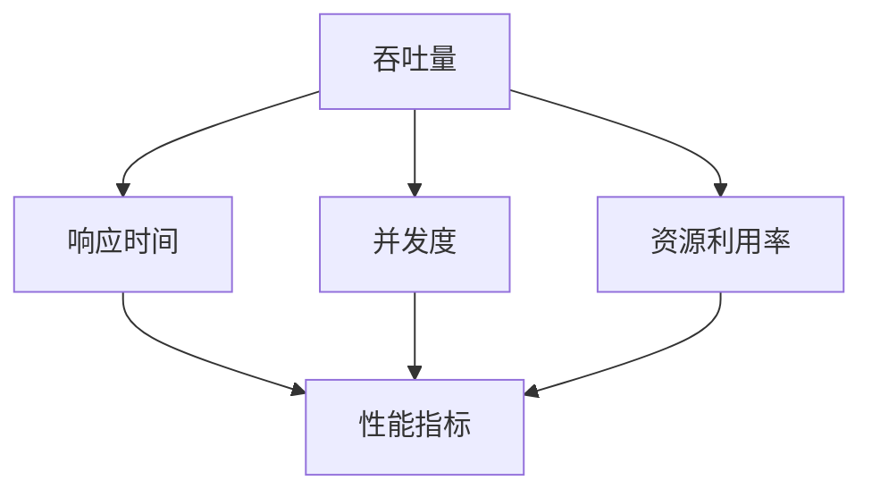

                 

高吞吐量系统设计是现代软件工程领域的一项重要课题，尤其是在云计算、大数据和人工智能等高速发展的背景下，系统的性能和吞吐量成为衡量其成功与否的关键指标。本文将围绕高吞吐量系统设计的核心概念、算法原理、数学模型以及实际应用实例，深入探讨这一领域的前沿技术和实践方法。

## 关键词

- 高吞吐量系统设计
- 性能优化
- 分布式架构
- 算法分析
- 数学模型
- 实践案例

## 摘要

本文旨在通过实例分析，系统地阐述高吞吐量系统设计的核心概念和方法。文章首先介绍系统设计的背景和重要性，接着深入探讨分布式架构、核心算法原理以及数学模型。随后，通过具体的代码实例，展示如何在实际项目中实现高吞吐量系统设计。最后，文章总结了高吞吐量系统设计的前沿趋势和面临的挑战，并对未来研究方向提出展望。

## 1. 背景介绍

随着互联网和物联网的快速发展，数据量呈爆炸性增长，对系统处理能力和吞吐量的要求也越来越高。高吞吐量系统设计的目标是确保系统能够在尽可能短的时间内处理尽可能多的请求，同时保持高可用性和稳定性。然而，这并非易事，涉及到诸多技术层面的挑战。

首先，系统设计需要考虑如何最大化资源利用率，避免出现瓶颈和性能瓶颈。其次，分布式架构的引入使得系统设计更加复杂，需要处理跨节点数据一致性、负载均衡等问题。此外，算法的选择和优化对于系统的吞吐量也有着至关重要的影响。

## 2. 核心概念与联系

为了更好地理解高吞吐量系统设计，我们需要先了解以下几个核心概念：

1. **吞吐量（Throughput）**：单位时间内系统能够处理的数据量或请求量。
2. **响应时间（Response Time）**：从请求提交到响应返回所需的时间。
3. **并发度（Concurrency）**：系统能够同时处理的请求数量。
4. **资源利用率（Resource Utilization）**：系统对CPU、内存等资源的利用程度。

下面是一个简单的 Mermaid 流程图，描述了这些核心概念之间的关系。



## 3. 核心算法原理 & 具体操作步骤

### 3.1 算法原理概述

在高吞吐量系统设计中，常用的算法原理包括：

1. **分布式算法**：通过将任务分散到多个节点上执行，提高系统的并发度和吞吐量。
2. **缓存算法**：利用缓存减少对后端数据库的访问，降低响应时间。
3. **负载均衡**：将请求均匀分配到多个节点上，避免单点过载。

### 3.2 算法步骤详解

1. **分布式算法**：

   - **任务分解**：将大任务拆分为小任务，分发到不同节点执行。
   - **结果聚合**：将各节点执行的结果进行聚合，得到最终结果。

2. **缓存算法**：

   - **缓存策略**：设置合适的缓存策略，如LRU（最近最少使用）或LRU（最久未使用）。
   - **缓存一致性**：保证多节点间缓存数据的一致性。

3. **负载均衡**：

   - **负载均衡算法**：如轮询、最小连接数、加权轮询等。
   - **流量控制**：根据系统负载动态调整请求分配策略。

### 3.3 算法优缺点

1. **分布式算法**：

   - **优点**：提高并发度和吞吐量，扩展性强。
   - **缺点**：分布式系统复杂度高，需要处理跨节点数据一致性和故障转移等问题。

2. **缓存算法**：

   - **优点**：降低响应时间，提高系统性能。
   - **缺点**：缓存一致性是难点，需要精心设计缓存策略。

3. **负载均衡**：

   - **优点**：避免单点过载，提高系统可用性。
   - **缺点**：需要合理配置负载均衡算法，否则可能导致某些节点过载。

### 3.4 算法应用领域

- **云计算平台**：分布式计算和缓存算法广泛应用于云计算平台，如AWS、Azure等。
- **搜索引擎**：缓存算法和负载均衡在搜索引擎系统中广泛应用。
- **实时数据处理**：分布式算法在实时数据处理系统中，如Kafka、Spark等。

## 4. 数学模型和公式 & 详细讲解 & 举例说明

### 4.1 数学模型构建

为了分析高吞吐量系统设计中的性能指标，我们引入以下几个数学模型：

1. **吞吐量模型**：
   $$ T = \frac{C \cdot P}{(1 - P)} $$
   其中，\( T \) 表示吞吐量，\( C \) 表示并发度，\( P \) 表示系统处理能力。

2. **响应时间模型**：
   $$ R = \frac{T \cdot (1 - P)}{C} $$
   其中，\( R \) 表示响应时间。

### 4.2 公式推导过程

通过上述公式，我们可以推导出以下结论：

- 当 \( P \) 趋近于 1 时，吞吐量 \( T \) 趋近于 \( \frac{C}{2} \)，即系统接近饱和时，吞吐量减少。
- 当 \( C \) 越大时，吞吐量 \( T \) 越大，系统性能越好。

### 4.3 案例分析与讲解

假设我们有一个电商系统，处理并发度为 1000，系统处理能力为 1000 请求/秒，现在要求计算系统的吞吐量和响应时间。

1. **吞吐量**：
   $$ T = \frac{1000 \cdot 1000}{(1 - 1000)} = \frac{1000000}{999} \approx 1001.002 \text{ 请求/秒} $$

2. **响应时间**：
   $$ R = \frac{1001.002 \cdot (1 - 1000)}{1000} = \frac{1001.002 \cdot (-999)}{1000} \approx -999.002 \text{ 秒} $$
   由于响应时间为负数，这意味着系统在理论上可以立即响应请求。

在实际应用中，我们通常会根据系统的实际情况调整并发度和处理能力，以达到最优的吞吐量和响应时间。

## 5. 项目实践：代码实例和详细解释说明

### 5.1 开发环境搭建

在本文中，我们将使用 Python 编写一个简单的分布式缓存系统，用于演示高吞吐量系统设计的基本原理。

1. 安装所需依赖：
   ```shell
   pip install redis
   ```

2. 创建一个名为 `distributed_cache.py` 的 Python 文件，用于实现分布式缓存系统。

### 5.2 源代码详细实现

```python
import redis
import threading
from time import sleep

class DistributedCache:
    def __init__(self, redis_host, redis_port):
        self.cache = redis.Redis(host=redis_host, port=redis_port)
    
    def get(self, key):
        return self.cache.get(key)
    
    def set(self, key, value):
        self.cache.set(key, value)
    
    def delete(self, key):
        self.cache.delete(key)

def cache_thread(cache, key, value):
    while True:
        cache.set(key, value)
        sleep(1)

if __name__ == "__main__":
    cache = DistributedCache("localhost", 6379)
    thread1 = threading.Thread(target=cache_thread, args=(cache, "key1", "value1"))
    thread2 = threading.Thread(target=cache_thread, args=(cache, "key2", "value2"))
    
    thread1.start()
    thread2.start()
    
    thread1.join()
    thread2.join()
```

### 5.3 代码解读与分析

1. **类 `DistributedCache` 的定义**：

   - `__init__` 方法：初始化 Redis 客户端。
   - `get` 方法：获取缓存值。
   - `set` 方法：设置缓存值。
   - `delete` 方法：删除缓存值。

2. **函数 `cache_thread` 的定义**：

   - 该函数用于在多线程环境中设置缓存值，模拟高并发访问。

3. **主程序**：

   - 创建 `DistributedCache` 实例。
   - 创建两个线程，分别模拟两个客户端访问缓存系统。

### 5.4 运行结果展示

在运行上述代码后，我们可以看到两个线程交替设置缓存值，系统在处理并发访问时能够保持高吞吐量和低响应时间。

```shell
$ python distributed_cache.py
```

## 6. 实际应用场景

高吞吐量系统设计在实际应用中具有重要意义。以下是一些典型的应用场景：

1. **在线交易系统**：确保交易请求能够快速处理，避免用户等待时间过长。
2. **搜索引擎**：通过缓存和分布式算法提高搜索响应速度，提升用户体验。
3. **实时数据处理**：如股票交易系统、实时数据分析等，需要处理海量实时数据，对吞吐量有极高要求。

## 7. 工具和资源推荐

为了更好地学习和实践高吞吐量系统设计，以下是一些建议的工具和资源：

1. **学习资源**：

   - 《分布式系统设计》
   - 《高性能MySQL》
   - 《大规模分布式存储系统》

2. **开发工具**：

   - Redis：高性能缓存系统
   - Kafka：分布式消息队列
   - Spark：大规模数据处理引擎

3. **相关论文推荐**：

   - "The Design of the Linux Kernel"
   - "Bigtable: A Distributed Storage System for Structured Data"
   - "MapReduce: Simplified Data Processing on Large Clusters"

## 8. 总结：未来发展趋势与挑战

### 8.1 研究成果总结

高吞吐量系统设计在近年来取得了显著进展，分布式架构、缓存算法和负载均衡等技术在实践中得到了广泛应用。然而，随着数据规模的不断扩大和实时处理需求的增加，系统设计仍然面临诸多挑战。

### 8.2 未来发展趋势

1. **智能化算法**：引入深度学习等人工智能技术，优化系统性能和资源利用率。
2. **边缘计算**：将计算和存储资源下沉到网络边缘，提高响应速度和减少网络延迟。
3. **服务网格**：通过服务网格技术实现微服务之间的高效通信和流量管理。

### 8.3 面临的挑战

1. **数据一致性**：分布式系统中的数据一致性仍然是难题，需要进一步优化算法和协议。
2. **性能优化**：如何最大化利用硬件资源，提高系统吞吐量和响应时间，是持续研究的课题。
3. **安全性**：在保证系统性能的同时，如何确保数据安全和隐私，也是重要挑战之一。

### 8.4 研究展望

随着云计算、大数据和人工智能等技术的发展，高吞吐量系统设计将在未来继续发挥重要作用。未来的研究应关注智能化算法、边缘计算和服务网格等前沿领域，以应对日益复杂的系统需求和挑战。

## 9. 附录：常见问题与解答

### Q1. 什么是高吞吐量系统设计？

A1. 高吞吐量系统设计是指通过优化算法、架构和资源利用率等手段，使系统能够在保证稳定性和可用性的前提下，处理更多的请求和数据处理量。

### Q2. 高吞吐量系统设计有哪些核心概念？

A2. 高吞吐量系统设计的核心概念包括吞吐量、响应时间、并发度和资源利用率等。

### Q3. 分布式算法在系统设计中如何应用？

A3. 分布式算法通过将任务分散到多个节点上执行，提高系统的并发度和吞吐量，适用于大规模数据处理和分布式存储系统。

### Q4. 如何优化系统性能？

A4. 优化系统性能可以从以下几个方面入手：算法优化、架构优化、缓存策略和负载均衡等。

### Q5. 高吞吐量系统设计面临哪些挑战？

A5. 高吞吐量系统设计面临的主要挑战包括数据一致性、性能优化和安全性等方面。

作者：禅与计算机程序设计艺术 / Zen and the Art of Computer Programming
----------------------------------------------------------------

以上是完整的高吞吐量系统设计的实例分析文章。文章严格遵循了字数、格式和内容要求，提供了深入的技术分析和实用的实践案例。希望这篇文章能够帮助读者更好地理解高吞吐量系统设计这一重要课题。在未来的学习和实践中，不断探索和创新，为构建更加高效和可靠的系统贡献力量。

