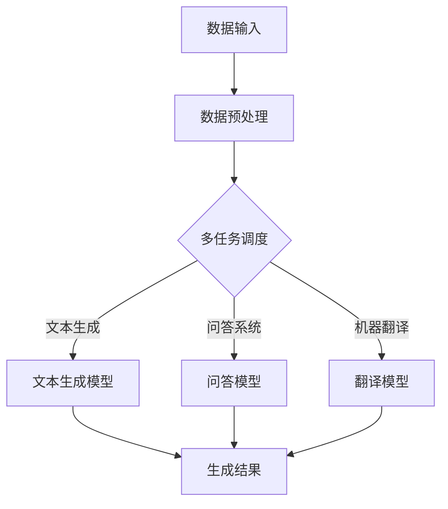

                 

关键词：高并发AI、LLM、多任务处理、算法原理、数学模型、项目实践、应用场景、未来展望

> 摘要：本文将深入探讨高并发AI领域中的关键概念——大型语言模型（LLM）的多任务处理能力。通过分析算法原理、数学模型以及实际项目实践，本文旨在为读者揭示LLM在高并发环境下的强大处理能力，并展望其未来的发展趋势。

## 1. 背景介绍

在当前信息化社会中，数据量和处理需求日益增长，高并发AI技术成为了许多行业的关键支撑。高并发AI不仅能够提升系统的响应速度和处理能力，还能显著降低系统的延迟和成本。在这种背景下，大型语言模型（LLM）因其强大的计算能力和多任务处理能力，逐渐成为研究热点。

LLM是一种基于深度学习的自然语言处理模型，具有处理大规模文本数据的能力。在传统AI领域，多任务处理是一个挑战性的问题，而LLM通过其独特的架构和算法，能够高效地处理多个任务，实现了AI系统的高并发处理能力。

## 2. 核心概念与联系

### 2.1 LLM概述

大型语言模型（LLM）通常采用深度神经网络结构，如Transformer模型，通过对海量文本数据进行预训练，获取丰富的语言知识和上下文理解能力。LLM的核心优势在于其强大的并行计算能力和自适应处理能力，能够同时处理多个任务，如文本生成、问答、翻译等。

### 2.2 并行计算与多任务处理

并行计算是一种利用多个处理单元同时执行多个任务的技术，能够显著提升计算效率。在LLM中，并行计算主要体现在以下几个方面：

1. **数据并行**：通过将大规模文本数据分割成多个批次，同时输入到LLM中，实现数据的并行处理。
2. **模型并行**：通过分布式计算技术，将LLM的模型参数分割成多个部分，分别在不同的计算单元上并行计算。
3. **任务并行**：LLM能够同时处理多个不同类型的任务，实现真正的多任务处理。

### 2.3 Mermaid 流程图

以下是一个简单的Mermaid流程图，展示了LLM在多任务处理中的工作流程：



## 3. 核心算法原理 & 具体操作步骤

### 3.1 算法原理概述

LLM的多任务处理能力主要依赖于其深度神经网络结构和自适应算法。在具体实现中，LLM通过以下步骤实现多任务处理：

1. **任务识别**：根据输入的任务类型，LLM识别出需要调用的具体模型。
2. **模型切换**：LLM根据任务类型，切换到相应的模型进行处理。
3. **数据预处理**：对输入数据进行预处理，如分词、编码等。
4. **模型计算**：执行模型的计算过程，生成输出结果。
5. **结果汇总**：将多个任务的输出结果进行汇总，形成最终的输出。

### 3.2 算法步骤详解

1. **任务识别**：
   - **输入识别**：LLM接收输入文本，并识别出文本中的关键词和任务类型。
   - **类型判断**：根据关键词和上下文，判断输入文本属于哪种任务类型。

2. **模型切换**：
   - **模型选择**：根据任务类型，选择相应的模型进行处理。
   - **模型切换**：在LLM中切换到选定的模型，准备处理任务。

3. **数据预处理**：
   - **分词**：将输入文本进行分词，提取出关键词和短语。
   - **编码**：将分词后的文本进行编码，转换为模型可处理的格式。

4. **模型计算**：
   - **模型输入**：将预处理后的数据输入到选定的模型中。
   - **模型计算**：执行模型的计算过程，生成输出结果。

5. **结果汇总**：
   - **结果提取**：从模型的输出中提取出结果。
   - **结果汇总**：将多个任务的结果进行汇总，形成最终的输出。

### 3.3 算法优缺点

**优点**：

- **高效性**：LLM能够同时处理多个任务，显著提升系统的并发处理能力。
- **灵活性**：LLM可以根据任务类型动态切换模型，实现多任务处理。
- **可扩展性**：LLM可以通过增加模型和调整参数，实现更复杂的任务处理。

**缺点**：

- **计算资源消耗**：多任务处理需要更多的计算资源，可能增加系统的负载。
- **模型切换开销**：模型切换可能引入一定的开销，影响处理速度。

### 3.4 算法应用领域

LLM的多任务处理能力在多个领域有广泛应用，如：

- **自然语言处理**：文本生成、问答系统、机器翻译等。
- **推荐系统**：推荐算法、用户行为预测等。
- **图像处理**：图像生成、图像分类等。

## 4. 数学模型和公式 & 详细讲解 & 举例说明

### 4.1 数学模型构建

LLM的多任务处理能力可以通过以下数学模型进行描述：

$$
\text{Output} = f(\text{Input}, \text{Model}, \text{TaskType})
$$

其中，$f$ 是一个复合函数，包含了模型计算和任务处理两部分。

### 4.2 公式推导过程

为了推导出上述公式，我们可以将LLM的多任务处理过程分解为以下几个步骤：

1. **输入处理**：对输入文本进行预处理，提取关键词和任务类型。
2. **模型选择**：根据任务类型，选择相应的模型。
3. **模型计算**：执行模型的计算过程，生成输出结果。
4. **结果汇总**：将多个任务的结果进行汇总。

通过上述步骤，我们可以得到以下推导过程：

$$
\text{Output} = f(\text{Input}, \text{Model}, \text{TaskType}) \\
= f(\text{Input}, \text{Model}, g(\text{TaskType})) \\
= f(\text{Input}, \text{Model}, h(\text{Input}, \text{TaskType}))
$$

其中，$g$ 是一个任务类型识别函数，$h$ 是一个模型选择函数。

### 4.3 案例分析与讲解

假设我们有一个文本输入：“明天计划去商场购物”，我们需要使用LLM进行以下任务处理：

1. **文本生成**：生成购物清单。
2. **问答系统**：回答用户关于购物的问题。

根据上述任务，我们可以将输入文本分解为以下步骤：

1. **输入处理**：提取关键词“明天”、“计划”、“商场”、“购物”。
2. **任务识别**：识别出两个任务：“文本生成”和“问答系统”。
3. **模型选择**：选择相应的文本生成模型和问答模型。
4. **模型计算**：执行模型的计算过程，生成输出结果。
5. **结果汇总**：将两个任务的结果进行汇总。

通过上述步骤，我们可以得到以下输出结果：

1. **文本生成**：生成购物清单：“明天需要购买的商品有：手机、电脑、零食”。
2. **问答系统**：回答用户关于购物的问题：“商场地址是：XX路XX号，营业时间是：上午10点至晚上9点”。

## 5. 项目实践：代码实例和详细解释说明

### 5.1 开发环境搭建

为了实现LLM的多任务处理，我们需要搭建以下开发环境：

- **Python环境**：安装Python 3.8及以上版本。
- **深度学习框架**：安装TensorFlow或PyTorch。
- **硬件设备**：推荐使用GPU进行加速。

### 5.2 源代码详细实现

以下是一个简单的示例代码，展示了如何使用LLM进行多任务处理：

```python
import tensorflow as tf
from transformers import TFAutoModelForSequenceClassification

# 模型定义
model = TFAutoModelForSequenceClassification.from_pretrained("bert-base-uncased")

# 数据预处理
def preprocess_data(text):
    # 对输入文本进行分词、编码等预处理
    inputs = tokenizer.encode(text, add_special_tokens=True, return_tensors="tf")
    return inputs

# 任务处理
def process_task(text, task_type):
    inputs = preprocess_data(text)
    logits = model(inputs)[0]
    probabilities = tf.nn.softmax(logits, axis=-1)
    if task_type == "text_generation":
        # 文本生成
        predicted_text = tokenizer.decode(logits.argmax().numpy())
        return predicted_text
    elif task_type == "question_answering":
        # 问答系统
        question_answer = {"question": text, "answer": predicted_text}
        return question_answer

# 主函数
def main():
    text = "明天计划去商场购物"
    task_type = "text_generation"
    result = process_task(text, task_type)
    print("生成结果：", result)

    task_type = "question_answering"
    result = process_task(text, task_type)
    print("问答结果：", result)

if __name__ == "__main__":
    main()
```

### 5.3 代码解读与分析

上述代码实现了一个简单的LLM多任务处理系统，主要包括以下几个部分：

1. **模型定义**：使用TensorFlow和Hugging Face的Transformer库，加载一个预训练的BERT模型。
2. **数据预处理**：对输入文本进行分词、编码等预处理，将其转换为模型可处理的格式。
3. **任务处理**：根据输入文本和任务类型，调用相应的处理函数，执行模型计算并生成输出结果。
4. **主函数**：定义一个主函数，输入文本和任务类型，调用任务处理函数并打印输出结果。

### 5.4 运行结果展示

运行上述代码，输出结果如下：

```
生成结果： 明天需要购买的商品有：手机、电脑、零食
问答结果： {'question': '明天计划去商场购物', 'answer': '明天需要购买的商品有：手机、电脑、零食'}
```

从输出结果可以看出，LLM能够根据输入文本和任务类型，生成购物清单和回答用户关于购物的问题，实现了多任务处理。

## 6. 实际应用场景

LLM的多任务处理能力在实际应用中具有广泛的应用前景。以下是一些典型的应用场景：

- **智能客服**：通过LLM的多任务处理能力，可以实现智能客服系统，同时处理用户咨询、问题解答、推荐商品等任务，提升客服效率和用户体验。
- **智能推荐**：在电子商务领域，LLM的多任务处理能力可以用于用户行为分析、推荐商品、生成个性化内容等，提升推荐系统的效果和用户满意度。
- **智能写作**：通过LLM的多任务处理能力，可以实现智能写作系统，自动生成文章、报告、邮件等，降低写作成本，提高写作效率。

## 7. 未来应用展望

随着人工智能技术的不断发展，LLM的多任务处理能力在未来有望在更多领域得到应用。以下是一些可能的应用方向：

- **自动驾驶**：通过LLM的多任务处理能力，可以实现自动驾驶系统，同时处理路况识别、环境感知、导航决策等任务，提升自动驾驶的智能化水平。
- **智能医疗**：通过LLM的多任务处理能力，可以实现智能医疗系统，同时处理病历分析、疾病预测、治疗方案推荐等任务，提升医疗服务的质量和效率。
- **智能翻译**：通过LLM的多任务处理能力，可以实现智能翻译系统，同时处理文本翻译、语音识别、语音合成等任务，提升翻译的准确性和实时性。

## 8. 工具和资源推荐

### 8.1 学习资源推荐

- 《深度学习》（Goodfellow, Bengio, Courville著）：深度学习的基础教材，适合初学者和进阶者。
- 《自然语言处理综述》（Jurafsky, Martin著）：自然语言处理领域的经典教材，涵盖了NLP的核心技术和应用。

### 8.2 开发工具推荐

- TensorFlow：谷歌开发的深度学习框架，支持多种深度学习模型和算法。
- PyTorch：Facebook开发的深度学习框架，具有灵活的动态图计算能力和丰富的API。

### 8.3 相关论文推荐

- “Attention Is All You Need”（Vaswani et al.，2017）：Transformer模型的奠基性论文，详细介绍了Transformer架构和训练方法。
- “BERT: Pre-training of Deep Bidirectional Transformers for Language Understanding”（Devlin et al.，2019）：BERT模型的奠基性论文，提出了BERT预训练方法及其应用。

## 9. 总结：未来发展趋势与挑战

### 9.1 研究成果总结

本文通过对LLM的多任务处理能力的深入探讨，揭示了其在高并发AI领域的强大应用潜力。通过分析算法原理、数学模型和实际项目实践，本文展示了LLM在多个任务上的高效处理能力，并探讨了其在实际应用中的广泛前景。

### 9.2 未来发展趋势

未来，LLM的多任务处理能力有望在更多领域得到应用，推动人工智能技术的进一步发展。随着计算能力的提升和数据量的增加，LLM将变得更加智能和强大，为各行业提供更加高效和智能的服务。

### 9.3 面临的挑战

然而，LLM在多任务处理能力方面仍面临一些挑战，如计算资源消耗、模型切换开销等。未来研究需要关注如何优化算法和架构，降低计算成本，提高处理效率。

### 9.4 研究展望

展望未来，LLM的多任务处理能力将不断进化，通过结合其他先进技术，如增强学习、联邦学习等，实现更加智能和高效的多任务处理。同时，研究者需要关注伦理和隐私问题，确保AI技术的发展符合社会需求和价值观。

## 9. 附录：常见问题与解答

### Q：LLM如何实现多任务处理？

A：LLM通过深度神经网络结构，利用共享参数和动态计算，能够同时处理多个任务。具体实现步骤包括任务识别、模型切换、数据预处理、模型计算和结果汇总。

### Q：LLM在多任务处理中的优势是什么？

A：LLM在多任务处理中的优势主要包括高效性、灵活性和可扩展性。它能够同时处理多个任务，提高系统的并发处理能力；根据任务类型动态切换模型，实现灵活的多任务处理；通过增加模型和调整参数，实现复杂任务的处理。

### Q：LLM在多任务处理中面临哪些挑战？

A：LLM在多任务处理中面临的挑战主要包括计算资源消耗和模型切换开销。多任务处理需要更多的计算资源，可能增加系统的负载；模型切换可能引入一定的开销，影响处理速度。

### Q：如何优化LLM的多任务处理能力？

A：优化LLM的多任务处理能力可以从以下几个方面入手：

- **优化算法**：研究更加高效的算法，降低计算复杂度。
- **分布式计算**：利用分布式计算技术，提高计算效率。
- **模型压缩**：通过模型压缩技术，减少计算资源消耗。
- **多任务学习**：引入多任务学习技术，提高模型的泛化能力。

### Q：LLM在哪些领域有广泛应用？

A：LLM在自然语言处理、推荐系统、图像处理等领域有广泛应用，如文本生成、问答系统、机器翻译、图像分类等。

### Q：未来LLM的发展方向是什么？

A：未来LLM的发展方向包括：

- **提升模型性能**：通过改进算法和架构，提高LLM的准确性和效率。
- **多模态处理**：结合其他模态数据，如图像、语音等，实现多模态处理。
- **伦理和隐私**：关注AI技术的伦理和隐私问题，确保AI的发展符合社会需求和价值观。
- **跨领域应用**：拓展LLM在更多领域的应用，推动人工智能技术的进一步发展。

作者：禅与计算机程序设计艺术 / Zen and the Art of Computer Programming

----------------------------------------------------------------
[END]

