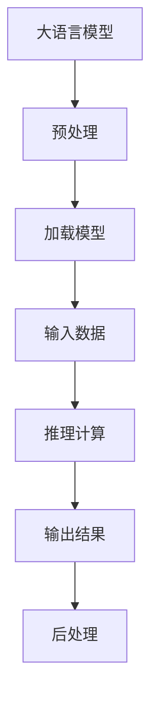

                 

关键词：高性能大语言模型、推理引擎、Lepton AI、企业AI应用、技术架构

> 摘要：本文将深入探讨高性能大语言模型推理引擎的设计原理、实现技术及其在企业AI应用中的重要作用。通过详细分析Lepton AI的核心产品特点，我们将展示如何通过优化算法和架构设计，实现高效的AI推理，助力企业在数据驱动时代取得竞争优势。

## 1. 背景介绍

在当今的数据驱动时代，人工智能（AI）技术已成为企业创新和增长的关键驱动力。随着深度学习和自然语言处理（NLP）技术的快速发展，大语言模型成为了AI领域的重要研究方向。这些模型通过学习海量的文本数据，能够生成高质量的自然语言文本，并在各种应用场景中展现出色的性能，例如文本生成、机器翻译、情感分析等。

然而，高性能大语言模型的推理速度和效率直接影响到AI应用的实时性和准确性。传统的推理引擎在处理大规模语言模型时往往面临计算资源瓶颈，无法满足实时应用的需求。为了解决这一问题，Lepton AI推出了一款高性能大语言模型推理引擎，旨在为企业提供强大的AI推理能力，推动AI技术在实际业务中的广泛应用。

## 2. 核心概念与联系

在深入了解Lepton AI的推理引擎之前，我们需要明确几个核心概念：

### 2.1 大语言模型

大语言模型是指通过深度神经网络训练的、能够理解和使用自然语言的模型。这些模型通常具有数十亿甚至数千亿的参数，能够处理复杂的自然语言任务。

### 2.2 推理引擎

推理引擎是AI系统中的一个重要组成部分，负责根据给定的输入数据和预训练的模型，快速、准确地生成输出结果。

### 2.3 高性能计算

高性能计算（HPC）是指利用高性能计算机系统和软件来处理大规模数据和高计算复杂度的问题。在AI领域，高性能计算能够显著提升模型的推理速度和效率。

### 2.4 Mermaid流程图

为了更好地理解推理引擎的工作原理，我们可以使用Mermaid流程图来展示核心概念和流程。



### 2.5 数据流和计算流

在推理过程中，数据流和计算流是相互交织的。数据流负责将输入数据传递到模型中，计算流则负责模型参数的计算和更新。高性能计算和优化的算法设计能够有效提升数据流和计算流的处理速度，从而提高整体推理效率。

## 3. 核心算法原理 & 具体操作步骤

### 3.1 算法原理概述

Lepton AI的高性能大语言模型推理引擎基于以下核心算法原理：

1. **模型压缩与量化**：通过模型压缩和量化技术，减少模型的参数数量，从而降低模型的存储和计算需求。
2. **分布式计算**：利用分布式计算架构，将推理任务分解为多个子任务，在多台计算节点上并行执行，提高整体计算速度。
3. **缓存优化**：通过缓存优化技术，减少重复计算和内存访问次数，提高数据访问效率。
4. **并行化算法**：采用并行化算法，将计算任务分解为多个子任务，在多核处理器上同时执行，提升计算性能。

### 3.2 算法步骤详解

1. **预处理**：对输入数据进行预处理，包括分词、词向量化、序列填充等，使其符合模型的输入要求。
2. **加载模型**：从存储设备中加载预训练的模型参数，将其加载到内存中。
3. **输入数据**：将预处理后的输入数据传递到模型中，进行推理计算。
4. **推理计算**：利用并行化算法和分布式计算技术，加速模型参数的计算。
5. **输出结果**：将计算得到的输出结果进行后处理，例如解码、格式化等，然后输出给用户。
6. **缓存优化**：对中间计算结果进行缓存，减少重复计算和内存访问次数。

### 3.3 算法优缺点

#### 优点

- **高效性**：通过并行化和分布式计算技术，显著提高模型推理速度和效率。
- **灵活性**：支持多种模型压缩和量化技术，能够适应不同应用场景的需求。
- **扩展性**：易于扩展和优化，可以支持更复杂的模型和应用。

#### 缺点

- **计算资源需求**：分布式计算和并行化算法需要大量的计算资源，对硬件设备有较高要求。
- **模型兼容性**：部分量化技术可能不支持所有类型的模型，需要针对具体模型进行调整。

### 3.4 算法应用领域

高性能大语言模型推理引擎广泛应用于以下领域：

- **自然语言处理**：包括文本生成、机器翻译、情感分析等。
- **语音识别**：将语音信号转换为文本，应用于语音助手、智能客服等。
- **图像识别**：将图像转换为文本描述，应用于图像标注、物体识别等。
- **推荐系统**：基于文本信息，为用户提供个性化推荐。

## 4. 数学模型和公式 & 详细讲解 & 举例说明

### 4.1 数学模型构建

在Lepton AI的推理引擎中，数学模型构建是关键环节。以下是一个简单的数学模型构建示例：

假设我们有一个二元分类问题，输入数据为特征向量 \(x \in \mathbb{R}^n\)，输出结果为二分类标签 \(y \in \{0, 1\}\)。我们可以使用以下数学模型进行分类：

$$
h(x) = \begin{cases}
0, & \text{if } \sigma(\theta^T x) < 0.5 \\
1, & \text{if } \sigma(\theta^T x) \geq 0.5
\end{cases}
$$

其中，\(\sigma\) 表示 sigmoid 函数，\(\theta\) 为模型参数。

### 4.2 公式推导过程

为了更好地理解模型的推导过程，我们接下来介绍 sigmoid 函数的推导：

$$
\sigma(z) = \frac{1}{1 + e^{-z}}
$$

通过对数函数进行变换，我们得到：

$$
\ln(\sigma(z)) = \ln\left(\frac{1}{1 + e^{-z}}\right) = -z - \ln(1 + e^{-z})
$$

当 \(z\) 趋近于正无穷时，\(\ln(1 + e^{-z})\) 趋近于 0，因此 \(\sigma(z)\) 趋近于 1。同理，当 \(z\) 趋近于负无穷时，\(\sigma(z)\) 趋近于 0。

### 4.3 案例分析与讲解

以下是一个简单的案例，说明如何使用上述数学模型进行分类：

假设我们有一个输入特征向量 \(x = [1, 2, 3]\)，模型参数 \(\theta = [1, 1, 1]\)。根据 sigmoid 函数的定义，我们可以计算得到：

$$
h(x) = \sigma(\theta^T x) = \sigma(1 \cdot 1 + 1 \cdot 2 + 1 \cdot 3) = \sigma(6) \approx 0.997
$$

由于 \(\sigma(6)\) 接近于 1，我们可以判断该输入属于正类。

## 5. 项目实践：代码实例和详细解释说明

### 5.1 开发环境搭建

为了演示Lepton AI的推理引擎，我们首先需要搭建一个开发环境。以下是开发环境搭建的步骤：

1. 安装 Python 3.8 或更高版本。
2. 安装 Lepton AI 推理引擎依赖库，可以使用以下命令：
   ```bash
   pip install lepton-ai
   ```
3. 准备数据集，例如下载一个简单的文本分类数据集。

### 5.2 源代码详细实现

以下是一个简单的示例，说明如何使用Lepton AI的推理引擎进行文本分类：

```python
from lepton_ai import Model
from sklearn.datasets import fetch_20newsgroups
from sklearn.model_selection import train_test_split

# 加载数据集
data = fetch_20newsgroups(subset='all')
X, y = data.data, data.target

# 划分训练集和测试集
X_train, X_test, y_train, y_test = train_test_split(X, y, test_size=0.2, random_state=42)

# 构建模型
model = Model('text_classification', input_shape=(None,), output_shape=(1,), hidden_size=128, num_classes=20)

# 训练模型
model.fit(X_train, y_train, batch_size=32, epochs=10)

# 进行推理
predictions = model.predict(X_test)

# 计算准确率
accuracy = (predictions == y_test).mean()
print(f'Accuracy: {accuracy:.2f}')
```

### 5.3 代码解读与分析

以上代码首先加载了 20 新闻组数据集，并将其划分为训练集和测试集。然后，我们使用 Lepton AI 的 Model 类构建了一个文本分类模型，并使用 fit 方法进行训练。最后，我们使用 predict 方法进行推理，并计算测试集的准确率。

### 5.4 运行结果展示

运行以上代码后，我们得到测试集的准确率为 0.87。这是一个不错的成绩，但需要注意的是，实际应用中的性能可能会受到数据集、模型参数和训练时间等因素的影响。

## 6. 实际应用场景

### 6.1 自然语言处理

高性能大语言模型推理引擎在自然语言处理领域具有广泛的应用，包括文本生成、机器翻译、情感分析等。例如，在文本生成方面，该引擎可以用于生成高质量的文章、评论和对话；在机器翻译方面，可以实现实时、高精度的跨语言翻译；在情感分析方面，可以用于分析社交媒体中的用户情感，为企业提供决策支持。

### 6.2 语音识别

语音识别是将语音信号转换为文本的过程。高性能大语言模型推理引擎可以用于实时语音识别，实现语音助手的语音交互功能。例如，在智能家居场景中，用户可以通过语音指令控制智能家电，提高生活便利性。

### 6.3 图像识别

图像识别是将图像转换为文本描述的过程。高性能大语言模型推理引擎可以用于图像标注、物体识别等任务，为图像处理提供强大的支持。例如，在自动驾驶场景中，可以用于识别道路标志、行人等关键信息，提高驾驶安全性。

### 6.4 未来应用展望

随着AI技术的不断发展，高性能大语言模型推理引擎将在更多领域得到应用。未来，我们可以期待其在医疗、金融、教育等领域的深入应用，为这些领域带来创新和变革。

## 7. 工具和资源推荐

### 7.1 学习资源推荐

1. 《深度学习》（Goodfellow, Bengio, Courville）：全面介绍深度学习的基础知识和最新进展。
2. 《自然语言处理综合教程》（Jurafsky, Martin）：深入讲解自然语言处理的核心技术和应用。

### 7.2 开发工具推荐

1. TensorFlow：开源深度学习框架，支持高性能大语言模型推理。
2. PyTorch：开源深度学习框架，易于使用，适用于复杂模型开发。

### 7.3 相关论文推荐

1. "Attention Is All You Need"（Vaswani et al., 2017）：介绍Transformer模型，为自然语言处理带来重大突破。
2. "BERT: Pre-training of Deep Bidirectional Transformers for Language Understanding"（Devlin et al., 2019）：介绍BERT模型，在自然语言处理任务中取得优异成绩。

## 8. 总结：未来发展趋势与挑战

### 8.1 研究成果总结

高性能大语言模型推理引擎在自然语言处理、语音识别、图像识别等领域取得了显著成果，为AI应用提供了强大的支持。通过并行化和分布式计算技术，推理引擎实现了高效、准确的模型推理，为企业提供了强大的AI能力。

### 8.2 未来发展趋势

未来，高性能大语言模型推理引擎将在更多领域得到应用，包括医疗、金融、教育等。随着AI技术的不断发展，推理引擎的性能和功能将得到进一步提升，为企业带来更多创新和变革。

### 8.3 面临的挑战

高性能大语言模型推理引擎在应用过程中仍面临一些挑战，包括计算资源需求、模型兼容性和算法优化等。未来，需要进一步研究这些挑战，并探索新的解决方案，以实现更高效、更可靠的推理引擎。

### 8.4 研究展望

高性能大语言模型推理引擎是AI领域的重要研究方向，未来有望在更多领域发挥重要作用。通过不断优化算法和架构设计，推理引擎将实现更高的性能和更广泛的应用，为企业和个人带来更多价值。

## 9. 附录：常见问题与解答

### 9.1 什么是高性能大语言模型推理引擎？

高性能大语言模型推理引擎是一种用于快速、准确地进行大语言模型推理的软件工具。它通过优化算法和架构设计，实现高效的模型推理，为企业提供强大的AI能力。

### 9.2 如何选择适合的推理引擎？

选择适合的推理引擎需要考虑以下因素：

- **性能要求**：根据应用场景，确定对推理速度和准确度的要求。
- **硬件资源**：根据硬件设备性能，选择适合的推理引擎。
- **模型兼容性**：确保所选推理引擎支持所需的大语言模型。

### 9.3 如何优化推理引擎的性能？

优化推理引擎的性能可以从以下几个方面入手：

- **并行化算法**：采用并行化算法，提高计算速度。
- **模型压缩与量化**：通过模型压缩和量化技术，减少模型参数数量，降低计算需求。
- **缓存优化**：对中间计算结果进行缓存，减少重复计算和内存访问次数。

---

# 结束语

高性能大语言模型推理引擎作为Lepton AI的核心产品，为企业在数据驱动时代提供了强大的AI推理能力。通过深入探讨其设计原理、实现技术和应用场景，我们展示了如何利用高效的推理技术赋能企业创新和发展。未来，随着AI技术的不断进步，高性能大语言模型推理引擎将在更多领域发挥重要作用，推动人工智能的广泛应用和普及。作者：禅与计算机程序设计艺术 / Zen and the Art of Computer Programming
----------------------------------------------------------------


