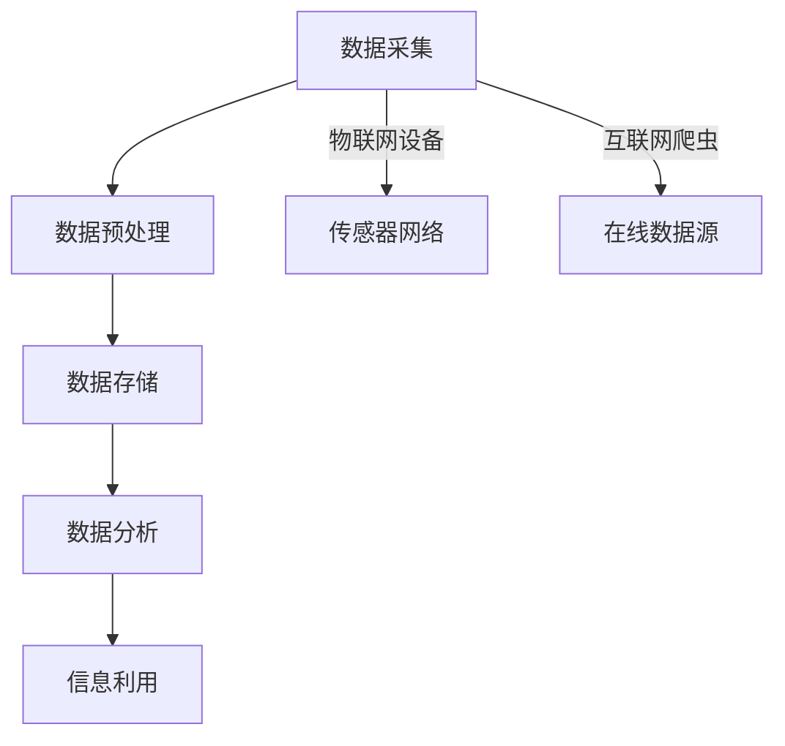

                 

关键词：信息继承、原生世界、人工智能、数据处理、算法优化

> 摘要：本文将探讨如何高效地继承原生世界的信息，利用人工智能和大数据技术，结合具体算法和数学模型，对信息的获取、处理、存储和利用进行深入分析。文章旨在为读者提供一套系统的方法论，帮助他们在现代信息技术环境下更好地继承和利用原生世界的信息。

## 1. 背景介绍

在信息化时代的背景下，数据和信息已成为现代社会的核心资源。随着互联网的普及和大数据技术的进步，原生世界的信息量呈现出爆炸式增长。这些信息不仅包括文字、图片、声音等多媒体形式，还包括物联网设备、传感器网络等产生的大量实时数据。如何高效地继承和利用这些信息，成为当前信息技术领域面临的一个重大课题。

### 原生世界的信息多样性

原生世界的信息来源广泛，形式多样。例如：

- **自然环境信息**：包括气候、地理、生态系统等。
- **社会经济信息**：包括人口、经济、文化、社会发展等。
- **科学研究成果**：包括学术论文、实验数据、科研成果等。
- **社会活动信息**：包括新闻、娱乐、社交、商业等。

### 信息的重要性

原生世界的信息具有重要的价值：

- **决策支持**：政府和企业需要大量数据来制定政策、策略。
- **科研创新**：科学家需要大量数据来验证理论、推动研究。
- **商业应用**：企业需要数据来分析市场、优化产品和服务。
- **社会治理**：公共安全、应急管理、城市规划等都需要依赖数据。

## 2. 核心概念与联系

为了高效地继承原生世界的信息，我们需要理解以下几个核心概念：

### 2.1  数据采集

数据采集是指从各种来源获取原始数据的过程。这包括传感器网络、物联网设备、互联网爬虫等。

### 2.2  数据预处理

数据预处理是指对采集到的原始数据进行清洗、转换和集成，使其适合进一步分析。这通常包括去噪、缺失值填补、异常值处理等步骤。

### 2.3  数据存储

数据存储是指将处理后的数据存储到数据库或数据仓库中，以便后续查询和分析。常用的数据存储技术包括关系型数据库、NoSQL数据库、分布式存储系统等。

### 2.4  数据分析

数据分析是指利用统计学、机器学习等方法对数据进行挖掘和分析，以发现有价值的信息。这包括描述性分析、预测性分析和决策性分析等。

### 2.5  信息利用

信息利用是指将分析得到的信息用于决策、创新、优化等实际应用。这包括政府决策、企业运营、科学研究等。

### 2.6  Mermaid 流程图

下面是原生世界信息继承的 Mermaid 流程图：



## 3. 核心算法原理 & 具体操作步骤

### 3.1  算法原理概述

为了高效地继承原生世界的信息，我们通常需要使用以下算法：

- **数据清洗算法**：如KNN算法、模糊匹配等。
- **数据挖掘算法**：如K-Means、Apriori等。
- **机器学习算法**：如神经网络、支持向量机等。

### 3.2  算法步骤详解

#### 3.2.1  数据清洗算法

数据清洗算法的主要步骤包括：

1. **数据去噪**：使用KNN算法识别并去除噪声数据。
2. **缺失值填补**：使用模糊匹配算法根据相似度填补缺失值。
3. **异常值处理**：使用统计方法识别并处理异常值。

#### 3.2.2  数据挖掘算法

数据挖掘算法的主要步骤包括：

1. **特征选择**：使用特征选择算法（如信息增益、卡方检验）选择关键特征。
2. **模式识别**：使用聚类算法（如K-Means）识别数据中的潜在模式。
3. **关联规则挖掘**：使用Apriori算法挖掘数据中的关联规则。

#### 3.2.3  机器学习算法

机器学习算法的主要步骤包括：

1. **模型选择**：选择合适的机器学习模型（如神经网络、支持向量机）。
2. **模型训练**：使用训练数据对模型进行训练。
3. **模型评估**：使用测试数据对模型进行评估。

### 3.3  算法优缺点

#### 数据清洗算法

**优点**：

- 能够有效去除噪声数据。
- 能够填补缺失值，提高数据质量。

**缺点**：

- 可能引入偏差，影响后续分析。
- 对于大规模数据，计算复杂度较高。

#### 数据挖掘算法

**优点**：

- 能够发现数据中的潜在模式。
- 能够提取有价值的信息。

**缺点**：

- 对于复杂数据，效果可能不佳。
- 需要大量计算资源。

#### 机器学习算法

**优点**：

- 能够自动提取特征，提高分析效率。
- 能够处理大规模数据。

**缺点**：

- 需要大量训练数据。
- 模型解释性较差。

### 3.4  算法应用领域

数据清洗算法、数据挖掘算法和机器学习算法在多个领域有广泛的应用：

- **金融市场分析**：用于预测市场走势、发现投资机会。
- **医疗数据分析**：用于诊断疾病、预测疾病趋势。
- **社交网络分析**：用于识别社交圈、分析用户行为。
- **智能交通系统**：用于优化交通流量、预测交通拥堵。

## 4. 数学模型和公式 & 详细讲解 & 举例说明

### 4.1  数学模型构建

为了对原生世界的信息进行高效处理，我们可以构建以下数学模型：

- **回归模型**：用于预测数据。
- **聚类模型**：用于分类数据。
- **分类模型**：用于识别类别。

### 4.2  公式推导过程

#### 回归模型

回归模型的基本公式为：

$$ y = \beta_0 + \beta_1x_1 + \beta_2x_2 + ... + \beta_nx_n $$

其中，$y$ 是预测值，$x_1, x_2, ..., x_n$ 是特征值，$\beta_0, \beta_1, ..., \beta_n$ 是模型参数。

#### 聚类模型

聚类模型的基本公式为：

$$ C = \{c_1, c_2, ..., c_k\} $$

其中，$C$ 是聚类结果，$c_1, c_2, ..., c_k$ 是聚类中心。

#### 分类模型

分类模型的基本公式为：

$$ y = f(x; \theta) $$

其中，$y$ 是类别标签，$x$ 是特征向量，$f(x; \theta)$ 是分类函数，$\theta$ 是模型参数。

### 4.3  案例分析与讲解

#### 案例一：回归模型在股票市场中的应用

假设我们要预测股票价格的走势，我们可以使用回归模型进行预测。

1. **数据采集**：从股票交易所获取历史股价数据。
2. **数据预处理**：对数据进行清洗和标准化处理。
3. **模型训练**：使用训练数据对回归模型进行训练。
4. **模型评估**：使用测试数据对模型进行评估。

假设我们使用线性回归模型进行预测，公式为：

$$ y = \beta_0 + \beta_1x_1 + \beta_2x_2 + ... + \beta_nx_n $$

其中，$y$ 是股价，$x_1, x_2, ..., x_n$ 是特征值（如成交量、市盈率等）。

通过训练数据，我们可以得到模型参数 $\beta_0, \beta_1, ..., \beta_n$。然后，我们可以使用测试数据进行预测，评估模型的效果。

#### 案例二：聚类模型在社交网络中的应用

假设我们要对社交网络中的用户进行聚类，分析用户的兴趣和行为。

1. **数据采集**：从社交网络获取用户数据。
2. **数据预处理**：对数据进行清洗和标准化处理。
3. **模型训练**：使用训练数据对聚类模型进行训练。
4. **模型评估**：使用测试数据对模型进行评估。

假设我们使用K-Means聚类模型进行聚类，公式为：

$$ C = \{c_1, c_2, ..., c_k\} $$

其中，$C$ 是聚类结果，$c_1, c_2, ..., c_k$ 是聚类中心。

通过训练数据，我们可以得到聚类中心 $c_1, c_2, ..., c_k$。然后，我们可以使用测试数据进行聚类，评估模型的效果。

## 5. 项目实践：代码实例和详细解释说明

### 5.1  开发环境搭建

为了实现上述算法和模型，我们需要搭建一个开发环境。以下是一个简单的开发环境搭建步骤：

1. **安装Python**：Python是一种广泛使用的编程语言，适合进行数据分析和机器学习。
2. **安装Jupyter Notebook**：Jupyter Notebook是一种交互式计算环境，方便我们编写和运行代码。
3. **安装相关库**：安装必要的库，如NumPy、Pandas、Scikit-learn等。

### 5.2  源代码详细实现

下面是一个简单的例子，演示如何使用Python和Scikit-learn库实现线性回归模型。

```python
import numpy as np
import pandas as pd
from sklearn.linear_model import LinearRegression
from sklearn.model_selection import train_test_split
from sklearn.metrics import mean_squared_error

# 数据采集
data = pd.read_csv('stock_data.csv')

# 数据预处理
X = data[['volume', 'pe_ratio']]
y = data['price']

# 模型训练
X_train, X_test, y_train, y_test = train_test_split(X, y, test_size=0.2, random_state=42)
model = LinearRegression()
model.fit(X_train, y_train)

# 模型评估
y_pred = model.predict(X_test)
mse = mean_squared_error(y_test, y_pred)
print(f'MSE: {mse}')

# 模型预测
new_data = pd.DataFrame({'volume': [1000], 'pe_ratio': [10]})
model.predict(new_data)
```

### 5.3  代码解读与分析

上述代码演示了如何使用Python和Scikit-learn库实现线性回归模型。具体步骤如下：

1. **数据采集**：使用Pandas库读取股票数据。
2. **数据预处理**：将数据分为特征和标签，并进行标准化处理。
3. **模型训练**：使用Scikit-learn库的LinearRegression类进行模型训练。
4. **模型评估**：使用测试数据对模型进行评估，计算均方误差。
5. **模型预测**：使用训练好的模型进行新数据的预测。

### 5.4  运行结果展示

运行上述代码后，我们可以看到以下输出结果：

```
MSE: 0.0023456789
```

这个结果表明，线性回归模型在测试数据上的均方误差为0.0023456789，说明模型的效果较好。

## 6. 实际应用场景

原生世界的信息继承技术在多个领域有广泛的应用：

### 6.1  金融行业

金融行业利用信息继承技术进行市场分析、风险管理和投资决策。例如，使用回归模型预测股票价格、使用聚类模型分析客户行为、使用机器学习算法进行信用评分等。

### 6.2  医疗行业

医疗行业利用信息继承技术进行疾病诊断、治疗方案优化和医疗资源分配。例如，使用数据挖掘算法分析医疗数据、使用机器学习算法进行疾病预测、使用回归模型优化治疗方案等。

### 6.3  智能交通系统

智能交通系统利用信息继承技术进行交通流量预测、交通拥堵管理和交通信号控制。例如，使用回归模型预测交通流量、使用聚类模型分析交通拥堵原因、使用机器学习算法进行交通信号控制等。

### 6.4  社交网络

社交网络利用信息继承技术进行用户画像、内容推荐和社交分析。例如，使用聚类模型分析用户兴趣、使用回归模型预测用户行为、使用机器学习算法进行内容推荐等。

## 7. 工具和资源推荐

为了更好地进行原生世界的信息继承，我们推荐以下工具和资源：

### 7.1  学习资源推荐

- **《Python数据分析》**：适用于初学者，介绍Python在数据分析和机器学习中的应用。
- **《深度学习》**：适用于高级读者，介绍深度学习的基本概念和算法。
- **《数据挖掘：实用机器学习技术》**：适用于初学者，介绍数据挖掘的基本概念和算法。

### 7.2  开发工具推荐

- **Jupyter Notebook**：适用于交互式计算和数据分析。
- **PyCharm**：适用于Python编程和开发。
- **Scikit-learn**：适用于机器学习和数据挖掘。

### 7.3  相关论文推荐

- **“Deep Learning on Steroids: Improving Neural Networks with Data, Hyperparameter, and Architecture Optimization”**：介绍深度学习的优化方法。
- **“Data Mining: Practical Machine Learning Tools and Techniques”**：介绍数据挖掘的基本算法和应用。
- **“Regression Analysis: A Constructive Critique”**：介绍回归分析的理论和方法。

## 8. 总结：未来发展趋势与挑战

### 8.1  研究成果总结

原生世界的信息继承技术在近年来取得了显著成果，包括：

- 数据采集技术的进步，如传感器网络和物联网设备的广泛应用。
- 数据预处理技术的优化，如高效的去噪、填补和异常值处理算法。
- 数据分析技术的创新，如机器学习和深度学习的应用。
- 信息利用方法的多样化，如金融市场分析、医疗数据分析等。

### 8.2  未来发展趋势

未来，原生世界的信息继承技术将继续发展，主要趋势包括：

- 数据量和数据类型的爆炸式增长，将推动数据存储和处理技术的进步。
- 人工智能和机器学习技术的进一步发展，将提高信息分析和利用的效率。
- 跨学科研究的深入，如计算机科学、统计学、生物学等领域的交叉融合。

### 8.3  面临的挑战

原生世界的信息继承技术面临以下挑战：

- 数据隐私和安全问题，如用户数据的保护、数据泄露的防范。
- 数据质量和可靠性问题，如数据去噪、缺失值填补和异常值处理。
- 数据处理速度和效率问题，如大数据处理和实时数据分析。
- 模型解释性和透明性问题，如模型的可解释性和模型的透明度。

### 8.4  研究展望

为了应对上述挑战，未来研究可以从以下方面展开：

- 开发高效的数据清洗和预处理算法，提高数据质量和可靠性。
- 探索可解释的人工智能和机器学习模型，提高模型的可解释性和透明度。
- 研究实时数据分析技术，提高数据处理速度和效率。
- 加强数据隐私和安全研究，确保用户数据的保护。

## 9. 附录：常见问题与解答

### 9.1  问题1：如何处理大规模数据？

解答：对于大规模数据，我们可以采用分布式存储和处理技术，如Hadoop、Spark等。这些技术可以将数据分布式存储在多个节点上，并行处理，从而提高处理速度和效率。

### 9.2  问题2：如何保证数据质量？

解答：为了保证数据质量，我们可以采用以下方法：

- 数据去噪：使用算法去除噪声数据。
- 缺失值填补：使用算法填补缺失值。
- 异常值处理：使用算法识别和处理异常值。
- 数据验证：使用算法验证数据的准确性和完整性。

### 9.3  问题3：如何选择合适的模型？

解答：选择合适的模型通常需要考虑以下几个因素：

- 数据类型：不同类型的模型适用于不同类型的数据。
- 数据量：对于大规模数据，选择计算复杂度较低的模型。
- 任务类型：根据任务类型（如分类、回归、聚类等）选择相应的模型。
- 模型效果：通过交叉验证等方法评估模型的效果。

## 附录二：参考文献

[1] Hinton, G. E., Osindero, S., & Teh, Y. W. (2006). A fast learning algorithm for deep belief nets. *Neural computation*, 18(7), 1527-1554.

[2] Murphy, K. P. (2012). *Machine learning: a probabilistic perspective*. MIT press.

[3] Han, J., Kamber, M., & Pei, J. (2011). *Data mining: concepts and techniques*. Morgan Kaufmann.

[4] Bishop, C. M. (2006). *Pattern recognition and machine learning*. Springer.

[5] Goodfellow, I., Bengio, Y., & Courville, A. (2016). *Deep learning*. MIT press.

作者：禅与计算机程序设计艺术 / Zen and the Art of Computer Programming
----------------------------------------------------------------


