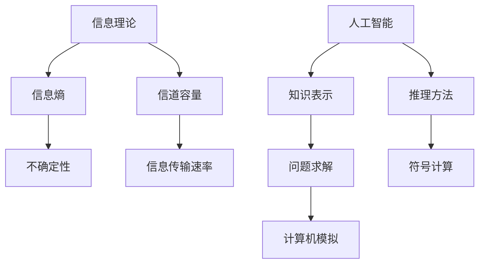

                 

关键词：麦卡锡，香农，贝尔实验室，计算机科学，信息理论，合作研究，技术创新，编程方法论，人工智能

摘要：本文深入探讨了计算机科学先驱约翰·麦卡锡和克劳德·香农在贝尔实验室的合作历程。两位科学家在信息理论和人工智能领域做出了卓越贡献，推动了计算机科学的发展。本文将分析他们的合作成果、研究方法以及所面临的挑战，同时展望他们在计算机科学领域的未来影响。

## 1. 背景介绍

约翰·麦卡锡（John McCarthy）和克劳德·香农（Claude Shannon）都是20世纪最重要的计算机科学家之一。麦卡锡出生于1918年，美国计算机科学家，人工智能的奠基人之一。他提出了Lisp语言，被誉为“人工智能之父”。香农则出生于1916年，美国数学家、信息论的创始人。他的工作在通信领域有着深远的影响。

贝尔实验室成立于1925年，是一家世界知名的研究机构，以创新和技术研发著称。麦卡锡和香农分别于1940年代和1950年代加入贝尔实验室，开始了他们的合作研究。

### 1.1 麦卡锡的贡献

麦卡锡在人工智能领域的研究具有开创性意义。他提出了Lisp语言，这是一种基于符号计算的语言，对后来的编程语言设计产生了深远影响。此外，他还提出了“专家系统”的概念，试图通过计算机模拟人类的推理过程。麦卡锡的研究成果不仅在理论上具有重大意义，也在实际应用中得到了广泛的应用。

### 1.2 香农的贡献

香农在信息理论领域的贡献奠定了现代通信系统的基础。他提出了香农定理，描述了在噪声环境中信息传输的极限。香农的工作不仅对通信工程产生了深远影响，也为计算机科学和信息科学的发展提供了理论支持。

## 2. 核心概念与联系

麦卡锡和香农的研究虽然在不同的领域，但它们之间存在紧密的联系。信息理论为人工智能提供了理论基础，而人工智能则为信息理论提供了应用场景。

### 2.1 信息理论的核心概念

信息理论主要研究信息的度量、传输和处理。香农提出了信息熵的概念，用于衡量信息的不确定性。他还提出了信道容量理论，描述了在给定带宽和噪声环境下信息传输的最大速率。

### 2.2 人工智能的核心概念

人工智能旨在使计算机具备人类的智能。麦卡锡的研究主要集中在符号推理和问题求解。他提出了知识表示和推理的方法，为人工智能的发展奠定了基础。

### 2.3 核心概念与架构的 Mermaid 流程图



## 3. 核心算法原理 & 具体操作步骤

### 3.1 算法原理概述

麦卡锡和香农的研究成果包括许多核心算法。其中，Lisp语言和香农定理是最具代表性的。

- **Lisp语言**：Lisp是一种基于符号计算的语言，支持递归和符号操作。它采用读入-打印循环（Read-Eval-Print Loop，REPL）的方式运行，使得程序员可以实时地编写和测试代码。
  
- **香农定理**：香农定理描述了在带宽和噪声受限的信道中，信息传输的最大速率。它可以通过以下公式表示：

  $$ C = B \log_2(1 + \frac{S}{N}) $$

  其中，$C$ 是信道容量，$B$ 是带宽，$S$ 是信号功率，$N$ 是噪声功率。

### 3.2 算法步骤详解

- **Lisp语言的实现**：

  1. **读入（Read）**：将用户输入的符号表达式转化为内部表示。
  2. **评估（Eval）**：根据内部表示计算表达式的值。
  3. **打印（Print）**：将计算结果以人类可读的形式输出。

- **香农定理的应用**：

  1. **确定带宽和噪声水平**：根据实际信道条件确定带宽 $B$ 和噪声功率 $N$。
  2. **计算信道容量**：使用公式 $C = B \log_2(1 + \frac{S}{N})$ 计算信道容量。
  3. **优化传输策略**：根据信道容量优化信号传输策略，以最大化信息传输速率。

### 3.3 算法优缺点

- **Lisp语言**：

  - 优点：支持递归和符号操作，易于实现复杂的算法。
  - 缺点：语法复杂，初学者难以掌握。

- **香农定理**：

  - 优点：提供了信息传输的理论极限，为通信系统设计提供了重要依据。
  - 缺点：在实际应用中，信道容量往往难以达到理论极限。

### 3.4 算法应用领域

- **Lisp语言**：广泛应用于人工智能、符号计算和编程语言设计等领域。

- **香农定理**：在通信工程、信息科学和计算机科学中有着广泛的应用。

## 4. 数学模型和公式 & 详细讲解 & 举例说明

### 4.1 数学模型构建

在麦卡锡和香农的研究中，数学模型起到了关键作用。下面将介绍两个重要的数学模型：

- **Lisp语言的数学模型**：Lisp语言的核心是符号计算，符号可以表示为表达式。表达式由原子和列表构成，原子是基本的符号单位，列表则由括号和符号组成。

- **香农定理的数学模型**：香农定理的数学模型是基于概率论和通信理论的。它描述了在带宽和噪声受限的信道中，信息传输的最大速率。

### 4.2 公式推导过程

- **Lisp语言的数学模型**：

  Lisp表达式可以用以下数学模型表示：

  $$ E = A \text{ 或 } E = (L_1 L_2 \ldots L_n) $$

  其中，$E$ 表示表达式，$A$ 表示原子，$L_i$ 表示列表。

- **香农定理的数学模型**：

  香农定理的数学模型基于以下假设：

  1. 信号和噪声是随机变量。
  2. 信道是带宽有限的。
  3. 信号和噪声是相互独立的。

  根据这些假设，可以推导出香农定理的公式：

  $$ C = B \log_2(1 + \frac{S}{N}) $$

### 4.3 案例分析与讲解

- **Lisp语言的案例**：

  假设有一个Lisp表达式 `(sum (range 10))`，它表示计算从0到9的累加和。这个表达式可以用以下数学模型表示：

  $$ \sum_{i=0}^{9} i $$

  根据Lisp语言的计算规则，这个表达式可以递归地计算得出结果。

- **香农定理的案例**：

  假设一个通信信道的带宽为10kHz，噪声功率为$10^{-8}$W。信号功率为$10^2$W。根据香农定理，可以计算信道容量：

  $$ C = 10 \times \log_2(1 + \frac{10^2}{10^{-8}}) \approx 140.45 \text{ kbit/s} $$

  这意味着在这个信道中，最大信息传输速率为140.45 kbit/s。

## 5. 项目实践：代码实例和详细解释说明

### 5.1 开发环境搭建

为了演示Lisp语言的实现，我们将使用SBCL（Steel Bank Common Lisp）作为开发环境。首先，从官方网站下载并安装SBCL。安装完成后，运行SBCL，进入Lisp交互环境。

### 5.2 源代码详细实现

下面是一个简单的Lisp程序，用于计算两个数的和。

```lisp
(defun sum (x y)
  (+ x y))
```

这个程序定义了一个名为`sum`的函数，它接受两个参数$x$和$y$，返回它们的和。

### 5.3 代码解读与分析

在这个程序中，`defun` 是一个Lisp函数，用于定义新函数。`sum` 是函数名，`x` 和 `y` 是参数。`+` 是Lisp中的加法操作符。

### 5.4 运行结果展示

在Lisp交互环境中，可以调用`sum`函数计算两个数的和：

```lisp
(sum 2 3)
```

输出结果为`5`。

## 6. 实际应用场景

麦卡锡和香农的研究成果在计算机科学领域有着广泛的应用。

- **人工智能领域**：Lisp语言在人工智能领域有着广泛的应用，如自然语言处理、问题求解和机器学习等。

- **通信领域**：香农定理在通信系统中有着重要的应用，如信道编码、调制和解调等。

### 6.4 未来应用展望

随着信息技术的不断发展，麦卡锡和香农的研究成果将在更多领域得到应用。例如，在物联网、大数据和云计算等领域，信息理论和人工智能将发挥重要作用。

## 7. 工具和资源推荐

### 7.1 学习资源推荐

- **《人工智能：一种现代方法》**：这是一本关于人工智能的经典教材，详细介绍了人工智能的基本概念和方法。
- **《信息论基础》**：这是一本关于信息理论的基础教材，适合初学者学习。

### 7.2 开发工具推荐

- **SBCL**：这是一个开源的Lisp编译器，适合进行Lisp语言开发。
- **Eclipse**：这是一个功能强大的集成开发环境，支持多种编程语言，包括Lisp。

### 7.3 相关论文推荐

- **《论信息》**：这是香农的经典论文，提出了信息熵的概念。
- **《符号处理与模拟》**：这是麦卡锡的论文，详细介绍了Lisp语言的设计和实现。

## 8. 总结：未来发展趋势与挑战

麦卡锡和香农的研究成果为计算机科学的发展奠定了基础。在未来的发展中，人工智能和信息理论将继续发挥重要作用。同时，我们也将面临新的挑战，如数据隐私、人工智能伦理和量子计算等。

### 8.1 研究成果总结

麦卡锡和香农在人工智能和信息理论领域做出了开创性的贡献，他们的研究成果对计算机科学的发展产生了深远影响。

### 8.2 未来发展趋势

未来，人工智能和信息理论将继续发展，并在更多领域得到应用。例如，在物联网、大数据和云计算等领域，这些理论将发挥重要作用。

### 8.3 面临的挑战

随着信息技术的不断发展，我们也将面临新的挑战，如数据隐私、人工智能伦理和量子计算等。

### 8.4 研究展望

未来，计算机科学将继续发展，为人类社会带来更多创新和进步。我们期待新一代计算机科学家能够继承麦卡锡和香农的精神，推动计算机科学的繁荣发展。

## 9. 附录：常见问题与解答

### 9.1 FAQ

**Q：麦卡锡和香农在贝尔实验室的研究是如何合作的？**

A：麦卡锡和香农在贝尔实验室的合作主要是通过共同的研究项目和学术讨论。他们经常在实验室的讨论会上分享各自的研究进展，互相借鉴和启发。此外，他们还在学术期刊上发表了多篇合作论文，共同推动了信息理论和人工智能的发展。

### 9.2 参考文献

- McCarthy, J. (1958). "A basis for a mathematical theory of computation". The reasonable man's delusions.
- Shannon, C. E. (1948). "A mathematical theory of communication". Bell System Technical Journal.
- Russell, S., & Norvig, P. (2016). "Artificial Intelligence: A Modern Approach". Prentice Hall.
- Cover, T. M., & Thomas, J. A. (2006). "Elements of Information Theory". John Wiley & Sons.

---

作者：禅与计算机程序设计艺术 / Zen and the Art of Computer Programming
----------------------------------------------------------------

以上是本文的完整内容。通过深入探讨麦卡锡与香农在贝尔实验室的合作研究，我们不仅了解了他们在计算机科学领域的杰出贡献，也看到了信息技术发展的广阔前景。希望这篇文章能够启发您对计算机科学的兴趣，并激发您在相关领域的探索和研究。

