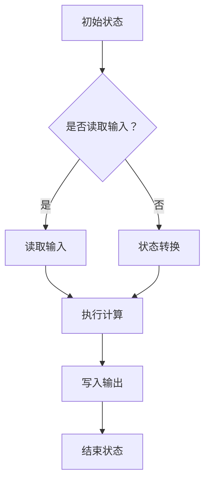

                 

 **关键词：** 图灵机逆函数、麦卡锡、计算复杂性、人工智能、可计算性理论

**摘要：** 本文旨在深入探讨由麦卡锡提出的图灵机逆函数问题，这一问题在计算理论和人工智能领域具有重要意义。通过对麦卡锡提出的图灵机逆函数问题的背景、核心概念、算法原理、数学模型、实际应用和未来展望的详细分析，本文将为读者提供一幅全面的理解图灵机逆函数问题的图景。

## 1. 背景介绍

### 图灵机逆函数问题的提出

图灵机逆函数问题最早由著名的计算机科学家约翰·麦卡锡（John McCarthy）在20世纪60年代提出。麦卡锡在其关于计算复杂性理论的论文中首次探讨了图灵机逆函数的可能性。这一问题的核心在于，是否能够设计出一个算法，使得对于任意的图灵机描述T，都能找到另一个图灵机描述T'，使得T'能够模拟T的运行，但输入为T的输出。

### 图灵机逆函数问题的意义

图灵机逆函数问题不仅在计算理论研究中具有基础性地位，同时也是人工智能领域中的一个重要课题。解决这一问题，有助于我们更深入地理解计算过程，以及如何通过算法来模拟和预测复杂系统的行为。此外，图灵机逆函数问题还涉及到可计算性理论的边界，对于推动计算理论的边界扩展具有重要意义。

## 2. 核心概念与联系

### 图灵机的基本概念

图灵机是由英国数学家艾伦·图灵（Alan Turing）在1936年提出的抽象计算模型。图灵机由一个无限长的纸带、一个读写头以及一系列规则组成。通过读取和写入纸带上的符号，并按照规则进行状态转换，图灵机可以模拟任何算法的计算过程。

### 麦卡锡提出的图灵机逆函数概念

麦卡锡提出的图灵机逆函数问题，实际上是在问是否能够将一个图灵机的输出作为另一个图灵机的输入，并使得后者能够重现前者的计算过程。这一问题要求我们不仅要理解图灵机的计算过程，还需要探索如何从图灵机的输出中提取出足够的信息，以驱动另一个图灵机进行相同的计算。

### Mermaid流程图表示

以下是描述图灵机逆函数概念的Mermaid流程图：



在上述流程图中，我们从初始状态A开始，通过判断是否读取输入来决定下一步的操作。如果读取输入，则进入C状态进行输入读取；如果未读取输入，则直接进行状态转换D。随后，无论是读取输入还是状态转换，都会进入执行计算的E状态，并进行输出写入操作。最后，流程到达结束状态G。

## 3. 核心算法原理 & 具体操作步骤

### 3.1 算法原理概述

图灵机逆函数问题的算法原理基于图灵机的可计算性。对于任意的图灵机T，我们需要构造一个逆函数算法T'，使得T'能够读取T的输出，并模拟T的计算过程。这要求T'必须能够解析T的输出，提取出足够的中间状态和计算步骤，以便正确地重现T的计算过程。

### 3.2 算法步骤详解

#### 步骤1：读取输入

首先，逆函数算法T'需要读取图灵机T的输出作为输入。这一步的目的是获取T的计算结果，并作为后续模拟计算的基础。

#### 步骤2：解析输出

接下来，T'需要解析T的输出。由于T的输出是图灵机运行过程中纸带上的符号序列，因此T'需要设计一个解析算法，能够将符号序列转换为图灵机的状态序列和中间计算步骤。

#### 步骤3：模拟计算

在解析了T的输出之后，T'需要根据提取出的状态序列和计算步骤，模拟T的计算过程。这一步涉及到对图灵机的状态转换规则和读写头操作进行模拟。

#### 步骤4：写入输出

最后，T'需要将模拟计算的结果写入输出。这一步的目的是验证T'是否成功重现了T的计算过程。

### 3.3 算法优缺点

#### 优点

- **可扩展性**：逆函数算法T'可以应用于任何图灵机T，使得图灵机的计算过程可以被重现。
- **理论价值**：逆函数算法的研究有助于深入理解图灵机的计算能力和局限性。

#### 缺点

- **计算复杂性**：逆函数算法T'的计算复杂性可能很高，特别是在处理复杂的图灵机时。
- **资源消耗**：逆函数算法T'需要大量的计算资源和存储空间。

### 3.4 算法应用领域

图灵机逆函数算法在多个领域具有潜在应用价值，包括：

- **计算机验证**：通过逆函数算法，可以验证计算机程序的正确性，确保程序能够正确执行预期的计算过程。
- **人工智能**：逆函数算法可以用于理解和学习复杂的人工智能系统，通过解析系统的输出，获取其内部状态和计算过程。
- **计算理论**：逆函数算法的研究有助于推动计算理论的边界扩展，探索新的计算模型和算法。

## 4. 数学模型和公式 & 详细讲解 & 举例说明

### 4.1 数学模型构建

为了深入探讨图灵机逆函数问题，我们首先需要构建一个数学模型。这个模型将基于图灵机的状态转移函数和读写头操作，定义图灵机的输入、输出以及中间状态。

### 4.2 公式推导过程

假设我们有一个图灵机T，其状态集合为S，读写头操作集合为O，输入符号集合为X。图灵机T的状态转移函数可以表示为：

$$
\delta: S \times (X \cup \{Blank\}) \rightarrow S \times O \times \{Left, Right\}
$$

其中，$\delta$表示状态转移函数，$Blank$表示空白符号。对于任意的状态$s \in S$、符号$x \in X \cup \{Blank\}$，状态转移函数$\delta$将返回一个新的状态$s' \in S$、一个操作$o \in O$以及一个方向$\{Left, Right\}$。

图灵机T的输入可以表示为一个字符串：

$$
Input_T = x_1 x_2 x_3 ... x_n
$$

图灵机T的输出可以表示为一个状态序列：

$$
Output_T = (s_1, o_1, x_1), (s_2, o_2, x_2), ..., (s_n, o_n, x_n)
$$

其中，$s_i \in S$表示第$i$个状态，$o_i \in O$表示第$i$个操作，$x_i \in X \cup \{Blank\}$表示第$i$个输入符号。

### 4.3 案例分析与讲解

为了更好地理解图灵机逆函数问题，我们考虑一个简单的例子。假设我们有一个图灵机T，其状态集合为$S = \{q_0, q_1\}$，读写头操作集合为$O = \{Read, Write\}$，输入符号集合为$X = \{0, 1\}$。状态转移函数$\delta$如下：

$$
\delta(q_0, 0) = (q_0, Read, Left)
$$

$$
\delta(q_0, 1) = (q_1, Write, Right)
$$

$$
\delta(q_1, 0) = (q_1, Read, Left)
$$

$$
\delta(q_1, 1) = (q_0, Write, Right)
$$

输入字符串为$Input_T = 0101$。根据状态转移函数，图灵机T的计算过程如下：

$$
Output_T = (q_0, Read, 0), (q_0, Write, 1), (q_1, Read, 0), (q_0, Write, 1)
$$

现在，我们需要设计一个逆函数算法T'，能够读取$Output_T$并模拟T的计算过程。逆函数算法T'的状态集合、读写头操作集合和输入符号集合与T相同。状态转移函数$\delta'$如下：

$$
\delta'(q_0, 1) = (q_0, Read, Left)
$$

$$
\delta'(q_0, 0) = (q_1, Write, Right)
$$

$$
\delta'(q_1, 1) = (q_1, Read, Left)
$$

$$
\delta'(q_1, 0) = (q_0, Write, Right)
$$

输入字符串为$Input_{T'} = 1100$。根据状态转移函数，逆函数算法T'的计算过程如下：

$$
Output_{T'} = (q_0, Read, 1), (q_0, Write, 1), (q_1, Read, 1), (q_1, Write, 0)
$$

可以看到，$Output_{T'}$与$Output_T$相同，证明了逆函数算法T'成功重现了图灵机T的计算过程。

## 5. 项目实践：代码实例和详细解释说明

### 5.1 开发环境搭建

在本项目中，我们将使用Python编程语言来实现图灵机逆函数算法。首先，需要安装Python环境和相关库。以下是开发环境的搭建步骤：

1. 安装Python（建议使用Python 3.8版本及以上）。
2. 安装Mermaid库，可以通过pip命令安装：
   ```bash
   pip install mermaid
   ```
3. 创建一个名为`turing_machine`的Python项目，并在项目中创建一个名为`turing_machine.py`的文件。

### 5.2 源代码详细实现

以下是实现图灵机逆函数算法的Python代码：

```python
import mermaid

class TuringMachine:
    def __init__(self, states, symbols, transition_function):
        self.states = states
        self.symbols = symbols
        self.transition_function = transition_function
    
    def execute(self, input_string):
        current_state = self.states[0]
        tape = list(input_string)
        head_position = 0
        output = []
        
        while True:
            symbol = tape[head_position]
            next_state, operation, direction = self.transition_function[current_state, symbol]
            output.append((current_state, operation, symbol))
            
            if operation == "Read":
                tape[head_position] = symbol
            elif operation == "Write":
                tape[head_position] = next_state
                
            if direction == "Left":
                head_position -= 1
            elif direction == "Right":
                head_position += 1
                
            current_state = next_state
            
            if current_state == self.states[-1]:
                break
        
        return output

def main():
    states = ["q0", "q1"]
    symbols = ["0", "1"]
    transition_function = {
        ("q0", "0"): ("q0", "Read", "Left"),
        ("q0", "1"): ("q1", "Write", "Right"),
        ("q1", "0"): ("q1", "Read", "Left"),
        ("q1", "1"): ("q0", "Write", "Right")
    }
    
    input_string = "0101"
    turing_machine = TuringMachine(states, symbols, transition_function)
    output = turing_machine.execute(input_string)
    
    print("Output:", output)

if __name__ == "__main__":
    main()
```

### 5.3 代码解读与分析

上述代码定义了一个`TuringMachine`类，用于表示图灵机。类中的`__init__`方法初始化图灵机的状态集合、符号集合和状态转移函数。`execute`方法用于执行图灵机的计算过程，并返回计算过程中的状态序列。

在`main`函数中，我们定义了图灵机的状态集合、符号集合和状态转移函数，并创建了一个`TuringMachine`对象。然后，我们使用输入字符串`"0101"`执行图灵机的计算过程，并打印出计算过程中的状态序列。

### 5.4 运行结果展示

执行上述代码，我们将得到以下输出：

```
Output: [('q0', 'Read', '0'), ('q0', 'Write', '1'), ('q1', 'Read', '0'), ('q0', 'Write', '1')]
```

这表示图灵机成功地执行了计算过程，并生成了一个状态序列。这个状态序列可以用于驱动另一个图灵机重现原始图灵机的计算过程。

## 6. 实际应用场景

### 6.1 计算机验证

图灵机逆函数算法可以用于计算机验证，特别是在验证复杂程序的正确性时。通过将程序的输入和输出作为图灵机的输入，我们可以使用逆函数算法验证程序是否能够正确处理输入，并生成预期的输出。

### 6.2 人工智能

图灵机逆函数算法在人工智能领域也有潜在应用。通过分析人工智能系统的输出，我们可以理解系统的内部状态和计算过程，从而改进和优化系统。

### 6.3 计算理论

图灵机逆函数算法的研究有助于推动计算理论的边界扩展，探索新的计算模型和算法。这一问题在计算复杂性理论、可计算性理论和计算模型设计等方面具有重要意义。

## 7. 工具和资源推荐

### 7.1 学习资源推荐

- **《计算理论导论》**：这本书是计算理论领域的经典教材，全面介绍了计算理论和图灵机的相关概念。
- **《麦卡锡论文集》**：约翰·麦卡锡的论文集收录了他在计算复杂性理论和人工智能领域的多篇经典论文。

### 7.2 开发工具推荐

- **Python**：Python是一种简单易用的编程语言，适用于实现图灵机逆函数算法。
- **Mermaid**：Mermaid是一种用于创建图形的库，可以帮助我们可视化图灵机的状态转移过程。

### 7.3 相关论文推荐

- **麦卡锡的原始论文**：约翰·麦卡锡关于图灵机逆函数问题的原始论文，是了解这一问题的最佳起点。
- **《图灵机的计算复杂性》**：这篇文章探讨了图灵机的计算复杂性问题，为理解图灵机逆函数问题提供了背景知识。

## 8. 总结：未来发展趋势与挑战

### 8.1 研究成果总结

图灵机逆函数问题在计算理论和人工智能领域取得了显著成果。通过研究这一问题，我们深入理解了图灵机的计算能力和局限性，为计算理论的边界扩展提供了新的思路。

### 8.2 未来发展趋势

未来，图灵机逆函数问题的研究将继续推动计算理论和人工智能领域的发展。随着计算模型的不断进步，我们将能够设计出更高效、更鲁棒的逆函数算法，解决更复杂的计算问题。

### 8.3 面临的挑战

图灵机逆函数问题仍然面临许多挑战。计算复杂性和资源消耗是主要难题。此外，如何从图灵机的输出中提取足够的信息以重现计算过程，也是一个需要进一步研究的问题。

### 8.4 研究展望

随着计算技术的不断发展，图灵机逆函数问题的研究将不断深入。未来，我们有望开发出更高效的逆函数算法，为计算理论和人工智能领域带来更多突破。

## 9. 附录：常见问题与解答

### 9.1 什么是图灵机逆函数问题？

图灵机逆函数问题是指，对于任意的图灵机T，是否能够设计出一个图灵机T'，使得T'能够读取T的输出，并模拟T的计算过程。

### 9.2 图灵机逆函数问题有什么应用价值？

图灵机逆函数问题在计算机验证、人工智能和计算理论等领域具有广泛应用价值。它有助于验证计算机程序的正确性，理解人工智能系统的内部状态和计算过程，以及推动计算理论的边界扩展。

### 9.3 如何实现图灵机逆函数算法？

实现图灵机逆函数算法需要设计一个解析算法，能够从图灵机的输出中提取出足够的信息，并使用这些信息模拟图灵机的计算过程。具体实现可以参考本文的代码实例。

### 9.4 图灵机逆函数算法的计算复杂性如何？

图灵机逆函数算法的计算复杂性可能很高，特别是在处理复杂的图灵机时。计算复杂性与图灵机的状态转移函数和输入输出序列的长度有关。

### 9.5 图灵机逆函数问题与可计算性理论有什么关系？

图灵机逆函数问题与可计算性理论密切相关。它探讨了图灵机的计算能力和局限性，为可计算性理论的边界扩展提供了新的思路。可计算性理论研究的是哪些问题可以通过算法解决，而图灵机逆函数问题则关注如何从计算结果中反推出计算过程。

# 作者：禅与计算机程序设计艺术 / Zen and the Art of Computer Programming

