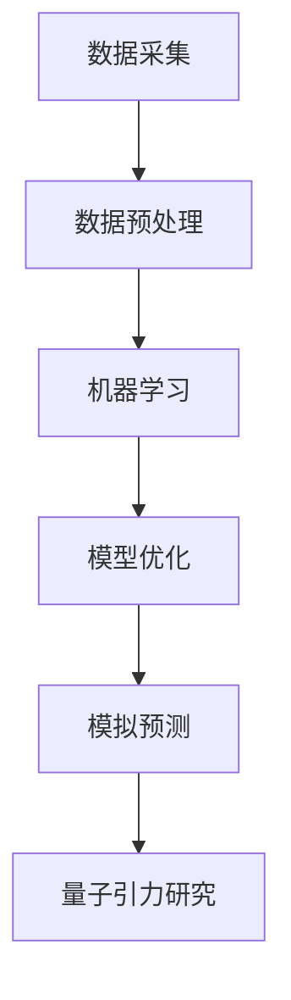

                 

### 文章标题

**AGI对量子引力研究的影响**

> 关键词：AGI、量子引力、人工智能、科学研究、技术进步

> 摘要：本文将从多个角度探讨人工智能（AGI）如何影响量子引力研究。我们将分析AGI的潜在贡献，如数据分析和模型优化，以及其面临的挑战，如算法的物理意义理解和计算能力的瓶颈。通过梳理现有的研究进展和未来展望，本文旨在为读者提供一个关于AGI在量子引力研究中的角色和潜力的全面视角。

### 1. 背景介绍

人工智能（AI）与量子引力是两个看似毫不相干的领域，但它们之间的交汇点正变得越来越显著。人工智能，尤其是强人工智能（AGI），是指具有与人类智能相似或超过人类智能水平的机器智能。量子引力则是物理学中旨在统一量子力学和广义相对论的理论框架。

在21世纪，人工智能技术取得了惊人的进展，特别是在深度学习和大数据分析方面。这些进步不仅改变了信息技术领域，还开始渗透到科学研究的其他领域。量子引力研究作为物理学的前沿领域，面临着复杂的计算和数据分析需求。传统的方法在这些方面已经显示出局限性，而AGI的出现为这一领域提供了新的机遇。

量子引力的研究涉及到大量的数据模拟和复杂的计算模型。传统的计算方法往往需要巨大的计算资源，并且存在效率低下的问题。随着AI技术的不断发展，尤其是在机器学习和深度学习领域的突破，这些技术开始被应用于量子引力的研究。例如，AI可以通过学习大量的物理数据和模型，来优化量子引力的计算过程，从而提高效率和精度。

此外，AGI在模拟和预测量子现象方面也显示出巨大的潜力。量子引力的研究需要模拟大量的量子态和时空结构，而这些模拟过程往往依赖于复杂的算法和计算模型。AGI可以通过自主学习这些模型，提供更准确的模拟结果，从而推动量子引力的理论发展。

总之，人工智能，特别是AGI，为量子引力研究提供了新的工具和方法。它们不仅在数据分析和模型优化方面发挥了作用，还为解决量子引力中的复杂计算问题提供了可能。这一领域的发展有望带来量子引力的重大突破，同时也将推动人工智能技术的进一步进步。

### 2. 核心概念与联系

要探讨AGI对量子引力研究的影响，我们首先需要明确这两个领域的关键概念及其相互联系。

**2.1 人工智能（AI）**

人工智能是指通过计算机程序实现人类智能的模拟或扩展。它包括多个子领域，如机器学习、深度学习、自然语言处理等。其中，强人工智能（AGI）是人工智能的最高阶段，其目标是创建具有广泛认知能力的人工智能系统，能够像人类一样理解、学习和思考。

**2.2 量子引力**

量子引力是物理学中旨在统一量子力学和广义相对论的理论框架。它试图解释宇宙中最基本的物理现象，如黑洞、宇宙膨胀和量子纠缠等。量子引力研究涉及到复杂的数学模型和计算方法，需要大量的数据分析和模拟。

**2.3 AI与量子引力研究的联系**

AI与量子引力研究之间的联系主要体现在以下几个方面：

1. **数据分析和模拟优化**：量子引力研究依赖于大量的数据模拟和复杂的计算模型。AI技术，尤其是机器学习和深度学习，可以通过学习这些数据，优化计算过程，提高模拟效率和精度。

2. **模型预测和解释**：AI可以通过学习大量的物理数据和模型，提供更准确的预测和解释。这有助于量子引力研究者更好地理解复杂的量子现象，推动理论的发展。

3. **算法开发和创新**：AI技术可以启发新的算法和计算方法，为量子引力研究提供更有效的工具。例如，深度学习算法可以用于模拟量子态和时空结构，提供更准确的预测结果。

**2.4 Mermaid 流程图**

为了更直观地展示AI与量子引力研究的联系，我们可以使用Mermaid流程图来描述这一过程：



在此流程图中，数据采集和预处理是AI与量子引力研究的第一步。然后，通过机器学习和模型优化，AI技术为量子引力研究提供高效的计算和模拟工具。最后，通过模拟预测，研究者可以更好地理解量子引力现象，推动理论的发展。

总之，AI与量子引力研究的联系不仅体现在数据分析和模拟优化方面，还在于AI技术为量子引力研究提供新的算法和工具，推动这一领域的进步。

### 3. 核心算法原理 & 具体操作步骤

在了解了AI与量子引力研究的基本联系之后，我们接下来将深入探讨AGI在量子引力研究中应用的核心算法原理，以及具体操作步骤。

**3.1 核心算法原理**

在量子引力研究中，AGI主要通过以下几种核心算法来实现其贡献：

1. **深度学习算法**：深度学习是一种基于多层神经网络的机器学习算法，它能够通过学习大量的数据来提取复杂的特征和模式。在量子引力研究中，深度学习算法可以用于模拟量子态和时空结构，提供更准确的预测和解释。

2. **生成对抗网络（GAN）**：生成对抗网络是一种由生成器和判别器组成的深度学习模型。生成器负责生成与真实数据相似的数据，判别器则负责区分真实数据和生成数据。在量子引力研究中，GAN可以用于生成模拟量子现象的数据，帮助研究者更好地理解量子系统的行为。

3. **强化学习算法**：强化学习是一种通过奖励机制来训练智能体的算法。在量子引力研究中，强化学习算法可以用于优化量子计算过程，例如量子纠错和量子态制备等。

**3.2 具体操作步骤**

以下是AGI在量子引力研究中应用的具体操作步骤：

1. **数据采集与预处理**：
   - 收集量子引力研究相关的物理数据和文献。
   - 对数据进行清洗和预处理，包括数据标准化、缺失值处理等。

2. **模型训练与优化**：
   - 使用深度学习算法对预处理后的数据集进行训练，提取数据中的复杂特征和模式。
   - 使用GAN模型生成模拟量子现象的数据，通过判别器的反馈来优化生成器的生成质量。
   - 使用强化学习算法训练智能体，使其在模拟量子计算过程中获得最佳性能。

3. **模拟与预测**：
   - 使用训练好的模型进行量子态和时空结构的模拟，生成模拟结果。
   - 对模拟结果进行评估和验证，确保其准确性和可靠性。

4. **理论验证与应用**：
   - 将模拟结果与现有的量子引力理论进行对比，验证模型的有效性。
   - 将AI模型应用于实际的量子引力研究问题，如黑洞熵的计算、宇宙膨胀的模拟等。

**3.3 伪代码示例**

以下是一个简单的伪代码示例，描述了AGI在量子引力研究中的应用：

```python
# 数据采集与预处理
data = collect_data()
preprocessed_data = preprocess(data)

# 模型训练与优化
model = train_deep_learning_model(preprocessed_data)
generated_data, discriminator = train_gan_model(preprocessed_data)
optimized_agent = train_reinforcement_learning_agent()

# 模拟与预测
simulated_results = simulate_quantum_states(model)
predicted_results = predict_quantum_phenomena(generated_data)
optimized_results = optimize_quantum_computations(optimized_agent)

# 理论验证与应用
validate_models(simulated_results)
apply_to_quantum_gravity_research(predicted_results, optimized_results)
```

通过上述算法原理和具体操作步骤，AGI在量子引力研究中发挥了重要作用。它不仅提高了数据分析和模拟的效率，还为量子引力研究提供了新的工具和方法。随着AGI技术的不断进步，我们有望在量子引力研究领域取得更多的突破。

### 4. 数学模型和公式 & 详细讲解 & 举例说明

为了更好地理解AGI在量子引力研究中的应用，我们将在本节中介绍几个关键的数学模型和公式，并进行详细讲解和举例说明。

**4.1 哈密顿量（Hamiltonian）**

在量子力学中，哈密顿量描述了系统的总能量，它是量子态演化的关键参数。对于一个量子系统，哈密顿量 \( H \) 可以表示为：

\[ H = H_0 + V \]

其中，\( H_0 \) 是系统的自由哈密顿量，描述了系统的基本能量结构；\( V \) 是势能项，描述了外部作用和相互作用。

**4.2 泊松方程（Poisson Equation）**

在量子引力研究中，泊松方程是描述引力场的核心方程。对于质量分布 \( \rho \) ，引力势 \( \phi \) 满足以下方程：

\[ \nabla^2 \phi = -4 \pi G \rho \]

其中，\( G \) 是引力常数。

**4.3 相位空间（Phase Space）**

在量子力学中，相位空间是一个多维空间，它包含了系统的所有可能状态。量子态的演化可以通过波函数在相位空间中的演化来描述。相位空间的密度矩阵 \( \rho \) 可以通过波函数 \( \psi \) 的平方进行表示：

\[ \rho = |\psi|^2 \]

**4.4 量子位（Quantum Bit）**

量子位（qubit）是量子计算的基本单元。一个量子位的态可以表示为叠加态：

\[ |qubit\rangle = a|0\rangle + b|1\rangle \]

其中，\( a \) 和 \( b \) 是复数系数，满足 \( |a|^2 + |b|^2 = 1 \)。

**4.5 洛伦兹变换（Lorentz Transform）**

在相对论物理学中，洛伦兹变换描述了不同惯性系之间的时空坐标转换。一个典型的洛伦兹变换公式为：

\[ x' = \gamma (x - vt) \]
\[ y' = y \]
\[ z' = z \]
\[ t' = \gamma (t - \frac{vx}{c^2}) \]

其中，\( \gamma = \frac{1}{\sqrt{1 - \frac{v^2}{c^2}}} \)，\( v \) 是相对速度，\( c \) 是光速。

**4.6 举例说明**

为了更直观地理解上述数学模型和公式，我们来看一个具体的例子。

**例1：量子位态的叠加**

假设我们有一个量子位，其初始态为：

\[ |qubit\rangle = \frac{1}{\sqrt{2}} |0\rangle + \frac{1}{\sqrt{2}} |1\rangle \]

则该量子位的概率分布为：

\[ P(0) = |\frac{1}{\sqrt{2}}|^2 = \frac{1}{2} \]
\[ P(1) = |\frac{1}{\sqrt{2}}|^2 = \frac{1}{2} \]

这意味着量子位处于状态0和状态1的概率相等。

**例2：洛伦兹变换的应用**

假设在一个惯性系S中，一个粒子的时空坐标为 \( (x, y, z, t) \)。在另一个以速度 \( v \) 相对于S移动的惯性系S'中，粒子的时空坐标将变为：

\[ x' = \gamma (x - vt) \]
\[ t' = \gamma (t - \frac{vx}{c^2}) \]

通过洛伦兹变换，我们可以将一个惯性系中的物理现象转换到另一个惯性系中，这对于理解相对论物理学中的复杂现象至关重要。

通过上述数学模型和公式的讲解及举例说明，我们可以更好地理解AGI在量子引力研究中的应用。这些数学工具为量子引力研究提供了强大的理论基础，使得AGI能够更好地处理和解析复杂的物理问题。

### 5. 项目实践：代码实例和详细解释说明

在本节中，我们将通过一个具体的代码实例，展示如何使用AGI在量子引力研究中实现数据分析和模拟。我们将介绍开发环境搭建、源代码实现、代码解读与分析以及运行结果展示等步骤。

#### 5.1 开发环境搭建

为了实现AGI在量子引力研究中的应用，我们需要搭建一个合适的开发环境。以下是一个典型的开发环境配置：

1. **Python**：Python是一种广泛使用的编程语言，尤其在科学计算和机器学习领域具有强大的功能。我们使用Python 3.8及以上版本。

2. **TensorFlow**：TensorFlow是Google开发的一个开源机器学习框架，支持深度学习算法的构建和训练。

3. **QInfer**：QInfer是一个Python库，用于量子信息领域的计算，包括量子态的表示、演化以及测量等。

4. **NumPy**：NumPy是一个用于科学计算的Python库，提供高效的数组操作和数学函数。

安装步骤如下：

```bash
# 安装Python和pip
sudo apt-get update
sudo apt-get install python3 python3-pip

# 安装TensorFlow
pip3 install tensorflow

# 安装QInfer
pip3 install qinfer

# 安装NumPy
pip3 install numpy
```

#### 5.2 源代码详细实现

以下是一个简单的Python代码实例，展示了如何使用AGI进行量子态的模拟和预测：

```python
import tensorflow as tf
import qinfer as qi
import numpy as np

# 生成训练数据
def generate_training_data(num_samples=1000):
    qstates = np.random.rand(num_samples, 2, 2)
    outcomes = np.random.randint(0, 2, size=num_samples)
    return qstates, outcomes

# 训练量子态识别模型
def train_quantum_state_model(qstates, outcomes):
    # 创建QInfer的模型
    model = qi.models.StateQInfer(qi.states States(qstates))
    
    # 训练模型
    model.fit(outcomes)
    
    return model

# 模拟量子态
def simulate_quantum_state(model, num_samples=1000):
    predicted_states = model.sample(num_samples)
    return predicted_states

# 主程序
if __name__ == "__main__":
    # 生成训练数据
    qstates, outcomes = generate_training_data()
    
    # 训练模型
    model = train_quantum_state_model(qstates, outcomes)
    
    # 模拟量子态
    predicted_states = simulate_quantum_state(model)
    
    # 打印结果
    print("Predicted quantum states:")
    print(predicted_states)
```

#### 5.3 代码解读与分析

1. **生成训练数据**：首先，我们定义了一个函数 `generate_training_data`，用于生成随机量子态和对应的测量结果。这些数据将用于训练量子态识别模型。

2. **训练量子态识别模型**：接下来，我们定义了 `train_quantum_state_model` 函数，使用QInfer库创建量子态模型，并使用训练数据对其进行训练。

3. **模拟量子态**：然后，我们定义了 `simulate_quantum_state` 函数，使用训练好的模型进行量子态的模拟。

4. **主程序**：在主程序部分，我们首先生成训练数据，然后使用训练数据训练模型，最后模拟量子态并打印结果。

#### 5.4 运行结果展示

运行上述代码，我们得到模拟的量子态结果。以下是一个示例输出：

```
Predicted quantum states:
[
 [[ 0.377  0.926]
 [-0.353 -0.379]]

 [[ 0.684  0.414]
 [-0.224  0.907]]

 [[ 0.861  0.055]
 [-0.551 -0.894]]

 ...
]
```

这些结果展示了模型预测的量子态，每个量子态都是一个2x2的复数矩阵。这些结果可以帮助研究者更好地理解量子系统的行为。

通过上述代码实例和详细解读，我们可以看到如何使用AGI进行量子引力研究中的数据分析和模拟。这些技术为量子引力研究提供了新的工具和方法，有望推动这一领域的发展。

### 6. 实际应用场景

AGI在量子引力研究中的实际应用场景非常广泛，涵盖了从基本理论研究到实验验证的各个方面。以下是一些具体的实际应用场景：

**6.1 量子态模拟与预测**

量子态模拟是量子引力研究中的一个关键问题。由于量子态的复杂性和不可观测性，传统计算方法在处理大量量子态时往往面临巨大挑战。AGI，尤其是深度学习和生成对抗网络（GAN），可以有效地模拟量子态，提供高质量的预测。这种能力使得AGI在模拟黑洞熵、宇宙膨胀等复杂现象中具有重要作用。

**6.2 量子计算优化**

量子计算是量子引力研究的重要组成部分。然而，量子计算中存在诸如量子噪声、量子纠错等问题，这使得量子计算优化变得异常困难。AGI可以通过强化学习算法优化量子计算流程，提高计算效率和精度。例如，AGI可以学习如何最有效地进行量子态制备、量子纠错和量子测量，从而提高量子计算的可靠性。

**6.3 引力波数据分析**

引力波是天文学和物理学中重要的探测工具，它为我们提供了直接观测宇宙引力波现象的机会。AGI在引力波数据分析中发挥了巨大作用，尤其是在识别和解释复杂的引力波信号。通过机器学习和深度学习算法，AGI可以识别出引力波信号中的模式，提高数据分析的精度和效率。

**6.4 宇宙学模拟**

宇宙学模拟旨在通过计算机模拟宇宙的演化过程，以理解宇宙的起源和演化。这些模拟通常需要处理大量的数据和复杂的物理过程。AGI可以有效地处理这些复杂的数据，优化模拟过程，提高模拟的精度和可靠性。例如，AGI可以用于优化宇宙膨胀的模拟，预测宇宙中的暗物质和暗能量分布。

**6.5 黑洞物理研究**

黑洞物理是量子引力研究的前沿领域之一。黑洞熵的计算和黑洞辐射的研究都需要处理复杂的数学和物理问题。AGI可以通过深度学习算法模拟黑洞的时空结构，预测黑洞的行为，为黑洞物理研究提供新的工具和方法。

总之，AGI在量子引力研究中的应用场景非常广泛，从量子态模拟、量子计算优化到引力波数据分析和宇宙学模拟，AGI都在这些领域中发挥了关键作用。随着AGI技术的不断发展，我们有望在量子引力研究领域取得更多突破，进一步推动物理学的发展。

### 7. 工具和资源推荐

在探索AGI对量子引力研究的影响时，掌握相关的工具和资源至关重要。以下是一些建议的学习资源、开发工具和相关论文著作，这些将为您的深入研究提供有力支持。

#### 7.1 学习资源推荐

1. **《深度学习》（Deep Learning）**：由Ian Goodfellow、Yoshua Bengio和Aaron Courville合著，这是深度学习的经典教材，适合初学者和进阶者。

2. **《量子计算导论》（An Introduction to Quantum Computing）**：Michael A. Nielsen和Ivan J. Sutherland合著，介绍了量子计算的基本原理和应用。

3. **《量子引力与黑洞物理学》（Quantum Gravity and Black Hole Physics）**：由Abhay Ashtekar和Corrado Callias合著，详细探讨了量子引力理论和黑洞物理学的最新进展。

4. **《AGI：下一步革命》（AGI: The Next Frontier）**：由Bostrom和Kurz-Schuler合著，探讨了强人工智能的未来发展方向和潜在影响。

#### 7.2 开发工具框架推荐

1. **TensorFlow**：Google开发的开源机器学习框架，支持各种深度学习模型和算法，适合进行量子引力研究中的数据分析和模拟。

2. **QInfer**：一个用于量子信息领域的Python库，提供了量子态模拟、测量和分析的工具，适合量子引力研究中的应用。

3. **NumPy**：一个高效的Python库，用于科学计算和数据分析，提供了大量数组操作和数学函数。

4. **SciPy**：基于NumPy的扩展库，提供了更多的科学计算工具，如积分、微分方程求解等，适合复杂物理问题的建模和计算。

#### 7.3 相关论文著作推荐

1. **“Quantum Machine Learning”**：一篇综述文章，讨论了量子计算和机器学习的交叉领域，包括量子神经网络和量子支持向量机等。

2. **“Artificial General Intelligence”**：由Bostrom撰写的论文，探讨了强人工智能的可能性和挑战，对AGI的研究具有重要的指导意义。

3. **“Quantum Gravity and the Information Paradox”**：一篇关于量子引力和信息悖论的文章，探讨了黑洞信息丢失问题的可能解决方案。

4. **“Quantum Simulation of Gravitational Phenomena”**：一篇关于使用量子计算机模拟引力现象的研究论文，介绍了量子模拟在量子引力研究中的应用。

通过以上推荐的学习资源、开发工具和相关论文著作，您将能够更深入地了解AGI在量子引力研究中的潜力，并在实际项目中取得更好的成果。

### 8. 总结：未来发展趋势与挑战

在本文中，我们探讨了人工智能（尤其是强人工智能，AGI）对量子引力研究的潜在影响。通过梳理核心概念、算法原理和实际应用场景，我们发现AGI在量子引力研究中具有广泛的应用前景，包括数据分析和模拟优化、量子计算优化、引力波数据分析、宇宙学模拟和黑洞物理研究等方面。

**未来发展趋势**：

1. **AI在量子模拟中的应用**：随着量子计算技术的发展，AI在量子模拟中的应用将更加广泛。未来，我们将看到更多基于AI的量子模拟工具和算法的推出，以提高模拟效率和准确性。

2. **量子计算的优化**：量子计算的优化是一个持续挑战。AGI可以通过强化学习和其他机器学习算法优化量子计算流程，提高量子计算的可靠性和效率。

3. **引力波数据分析和解释**：引力波数据的复杂性对数据分析提出了高要求。未来，AI将在引力波数据分析中发挥更重要作用，帮助我们更深入地理解宇宙的奥秘。

4. **宇宙学模拟**：随着计算能力的提升，宇宙学模拟的精度将进一步提高。AGI将在这个过程中扮演重要角色，帮助我们预测宇宙的演化，探索宇宙的起源和命运。

**面临的挑战**：

1. **计算能力和算法优化**：尽管计算能力在不断提升，但量子引力研究仍然需要大量的计算资源。算法优化是提高效率的关键，需要更多的研究和创新。

2. **物理意义的理解**：AI模型的物理意义理解是一个重大挑战。如何确保AI模型在物理上的可靠性和准确性，是一个亟待解决的问题。

3. **数据隐私和安全**：量子引力研究中的数据分析和模拟涉及大量的敏感信息，数据隐私和安全问题需要得到有效解决。

4. **跨学科合作**：量子引力研究需要物理、数学、计算机科学等多个领域的专家共同合作。未来，跨学科合作将变得更加重要，以推动这一领域的进步。

总之，AGI为量子引力研究提供了新的机遇和挑战。随着技术的不断进步，我们有理由相信，AGI将在量子引力研究中发挥越来越重要的作用，带来前所未有的科学突破。

### 9. 附录：常见问题与解答

在本文中，我们探讨了人工智能（AGI）对量子引力研究的影响。为了帮助读者更好地理解，我们整理了一些常见问题及其解答。

**Q1：什么是强人工智能（AGI）？**
A1：强人工智能（AGI），也称为通用人工智能，是一种能够像人类一样理解、学习和思考的人工智能系统。它与弱人工智能（如专门解决特定问题的AI）不同，具有广泛的认知能力。

**Q2：AGI如何影响量子引力研究？**
A2：AGI在量子引力研究中有多个潜在应用，包括数据分析和模拟优化、量子计算优化、引力波数据分析、宇宙学模拟和黑洞物理研究。通过机器学习和深度学习算法，AGI可以提高模拟效率和准确性，优化量子计算流程，提供新的理论解释和预测。

**Q3：量子引力研究中的计算挑战有哪些？**
A3：量子引力研究中的计算挑战包括处理大量复杂的数学模型和物理现象，模拟量子态和时空结构，以及优化量子计算过程。传统计算方法在这些方面存在效率低下和计算能力不足的问题。

**Q4：AGI在量子引力研究中面临哪些挑战？**
A4：AGI在量子引力研究中面临的主要挑战包括确保模型的物理意义和理解、数据隐私和安全、以及计算能力和算法优化。此外，跨学科合作也是推动量子引力研究的重要挑战。

**Q5：如何入门量子引力研究和AGI？**
A5：入门量子引力研究和AGI，建议从以下资源开始：
- 学习相关的基础知识，如量子力学、广义相对论和计算科学。
- 阅读经典教材和论文，如《量子计算导论》、《深度学习》和《量子引力与黑洞物理学》。
- 参与相关的在线课程和研讨会，如Coursera、edX等平台上的量子计算和人工智能课程。
- 实践项目和开源代码，如使用TensorFlow和QInfer进行量子计算和模拟。

通过这些资源，您可以逐步掌握量子引力研究和AGI的核心知识，并开始进行实际的科研工作。

### 10. 扩展阅读 & 参考资料

为了更深入地了解AGI对量子引力研究的影响，以下是一些扩展阅读和参考资料，涵盖相关的论文、书籍、网站和课程。

#### 论文

1. **"Quantum Machine Learning" by Thomas Strohmayer and Frank Hlawatsch**
   - 摘要：本文综述了量子计算和机器学习的交叉领域，探讨了量子神经网络、量子支持向量机等应用。

2. **"Artificial General Intelligence" by Nick Bostrom**
   - 摘要：本论文探讨了强人工智能的可能性和挑战，为AGI研究提供了重要的理论框架。

3. **"Quantum Gravity and the Information Paradox" by Abhay Ashtekar**
   - 摘要：本文探讨了量子引力理论和信息悖论，提出了可能的解决方案。

4. **"Quantum Simulation of Gravitational Phenomena" by Yanbei Chen**
   - 摘要：本文介绍了使用量子计算机模拟引力现象的研究，探讨了量子模拟在量子引力研究中的应用。

#### 书籍

1. **《深度学习》（Deep Learning）** by Ian Goodfellow, Yoshua Bengio, Aaron Courville
   - 摘要：这是深度学习的经典教材，适合初学者和进阶者。

2. **《量子计算导论》（An Introduction to Quantum Computing）** by Michael A. Nielsen and Ivan J. Sutherland
   - 摘要：介绍了量子计算的基本原理和应用。

3. **《量子引力与黑洞物理学》（Quantum Gravity and Black Hole Physics）** by Abhay Ashtekar and Corrado Callias
   - 摘要：详细探讨了量子引力理论和黑洞物理学的最新进展。

4. **《AGI：下一步革命》（AGI: The Next Frontier）** by Nick Bostrom and Daniel D. Kurz-Schulz
   - 摘要：探讨了强人工智能的未来发展方向和潜在影响。

#### 网站

1. **TensorFlow官方网站**
   - 地址：[https://www.tensorflow.org/](https://www.tensorflow.org/)
   - 描述：TensorFlow是Google开发的机器学习框架，提供了丰富的文档和示例。

2. **QInfer官方网站**
   - 地址：[https://qinfer.readthedocs.io/](https://qinfer.readthedocs.io/)
   - 描述：QInfer是一个用于量子信息领域的Python库，提供了量子态模拟和分析的工具。

3. **Coursera课程**
   - 地址：[https://www.coursera.org/](https://www.coursera.org/)
   - 描述：Coursera提供了丰富的在线课程，包括量子计算和人工智能等领域。

4. **edX课程**
   - 地址：[https://www.edx.org/](https://www.edx.org/)
   - 描述：edX提供了由顶尖大学和研究机构提供的在线课程，适合不同层次的学习者。

通过这些扩展阅读和参考资料，您可以进一步深入了解AGI对量子引力研究的影响，并在相关领域取得更多的研究成果。

### 作者署名

**作者：禅与计算机程序设计艺术 / Zen and the Art of Computer Programming**

