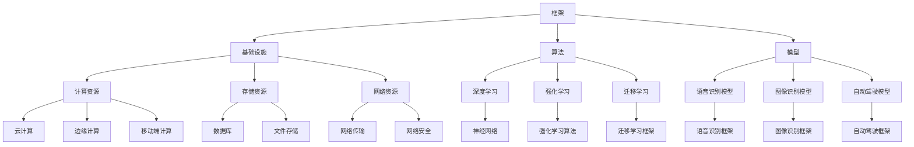

                 

### 文章标题

AI 2.0 时代：框架基础设施的演进

> 关键词：AI 2.0, 框架基础设施, 演进, 架构设计, 技术趋势

> 摘要：本文深入探讨AI 2.0时代框架基础设施的演进过程，从核心概念、算法原理到实际应用场景，全面解析框架基础设施的技术发展与挑战，为读者提供一份全面的技术参考。

## 1. 背景介绍

随着人工智能（AI）技术的迅猛发展，AI 2.0时代已经悄然来临。这一时代不仅标志着计算能力的提升，更意味着算法、框架和基础设施的全方位升级。在AI 1.0时代，机器学习主要依赖于单一模型和算法，如神经网络、决策树等。然而，随着数据规模的不断扩大和问题复杂性的增加，AI 2.0时代对框架基础设施提出了更高的要求。

AI 2.0时代框架基础设施的演进主要体现在以下几个方面：

### 1.1 技术需求的提升

AI 2.0时代，人工智能应用领域不断扩展，从语音识别、图像识别到自动驾驶、智能医疗等，对计算能力、存储能力和网络带宽的需求逐渐提升。为了满足这些需求，框架基础设施需要不断演进，提供更高的性能和可扩展性。

### 1.2 算法多样性的需求

随着深度学习、强化学习、迁移学习等新型算法的出现，框架基础设施需要具备更高的兼容性和灵活性，以支持多样化的算法开发和应用。这要求框架在架构设计上具备良好的可扩展性和可维护性。

### 1.3 跨平台需求

在AI 2.0时代，人工智能应用不仅限于云端，还涉及到边缘计算、移动端和物联网设备等。框架基础设施需要实现跨平台的支持，以适应各种应用场景。

### 1.4 安全性和隐私性的需求

随着人工智能技术的广泛应用，数据安全和隐私保护成为重要问题。AI 2.0时代的框架基础设施需要在设计上充分考虑安全性，确保数据的安全传输和存储。

## 2. 核心概念与联系

为了更好地理解AI 2.0时代框架基础设施的演进，我们需要先掌握以下几个核心概念：

### 2.1 框架与基础设施

框架（Framework）是一种编程工具，它提供了一系列预先定义好的组件、接口和库，帮助开发者快速搭建应用系统。基础设施（Infrastructure）则是指支撑框架运行的环境和资源，包括计算资源、存储资源、网络资源等。

### 2.2 算法与模型

算法（Algorithm）是解决特定问题的步骤和规则，而模型（Model）则是算法在实际问题中的应用。在AI 2.0时代，框架基础设施需要支持多样化的算法和模型，以满足不同应用场景的需求。

### 2.3 生态系统

生态系统（Ecosystem）是指围绕框架基础设施的各类资源、工具和服务，包括开发工具、库、框架、文档等。一个成熟的生态系统能够提高开发效率，促进框架的普及和应用。

### 2.4 Mermaid 流程图

以下是AI 2.0时代框架基础设施的核心概念和联系Mermaid流程图：



## 3. 核心算法原理 & 具体操作步骤

在AI 2.0时代，核心算法的原理和操作步骤是框架基础设施演进的关键。以下将介绍几种典型的算法原理和具体操作步骤：

### 3.1 深度学习算法原理

深度学习（Deep Learning）是一种基于多层神经网络（Neural Network）的机器学习技术。其核心思想是通过多层神经元的传递和变换，自动提取数据中的特征，实现复杂函数的逼近。

具体操作步骤如下：

1. **数据预处理**：对输入数据进行清洗、归一化和特征提取，以便于模型训练。
2. **构建神经网络**：定义网络的层级结构，包括输入层、隐藏层和输出层，选择合适的激活函数。
3. **初始化参数**：随机初始化网络的权重和偏置。
4. **前向传播**：将输入数据传递到网络的每一层，计算输出结果。
5. **反向传播**：计算输出结果与真实标签之间的误差，通过梯度下降法更新网络的权重和偏置。
6. **训练迭代**：重复执行前向传播和反向传播，直到网络收敛。

### 3.2 强化学习算法原理

强化学习（Reinforcement Learning）是一种通过试错和奖励机制来学习策略的机器学习技术。其核心思想是通过不断与环境交互，学习最优策略以实现目标。

具体操作步骤如下：

1. **定义环境**：构建一个虚拟环境，模拟现实世界的交互过程。
2. **定义状态空间和动作空间**：确定环境中的状态和动作。
3. **定义奖励函数**：定义环境对每个动作的奖励或惩罚。
4. **选择策略**：根据当前状态选择最佳动作。
5. **更新策略**：根据奖励和策略更新策略，优化学习过程。
6. **训练迭代**：重复执行选择动作、更新策略的过程，直到策略收敛。

### 3.3 迁移学习算法原理

迁移学习（Transfer Learning）是一种利用已有模型的知识来解决新问题的机器学习技术。其核心思想是将已有的模型或部分网络结构迁移到新任务中，减少训练成本。

具体操作步骤如下：

1. **选择预训练模型**：选择一个在相关任务上表现良好的预训练模型。
2. **调整模型结构**：根据新任务的需求，调整模型的层级结构或网络参数。
3. **迁移训练**：在新任务的数据集上进行迁移训练，优化模型的参数。
4. **评估模型性能**：在新任务的数据集上评估模型的性能，调整模型结构或参数。

## 4. 数学模型和公式 & 详细讲解 & 举例说明

在AI 2.0时代的框架基础设施中，数学模型和公式是核心算法原理的基础。以下将介绍几种常用的数学模型和公式，并进行详细讲解和举例说明。

### 4.1 激活函数

激活函数（Activation Function）是神经网络中用于决定神经元是否被激活的关键函数。常用的激活函数包括：

- **Sigmoid函数**：

$$
f(x) = \frac{1}{1 + e^{-x}}
$$

- **ReLU函数**：

$$
f(x) = \max(0, x)
$$

- **Tanh函数**：

$$
f(x) = \frac{e^x - e^{-x}}{e^x + e^{-x}}
$$

举例说明：

假设输入$x = 3$，求ReLU函数的输出。

$$
f(x) = \max(0, x) = \max(0, 3) = 3
$$

### 4.2 梯度下降法

梯度下降法（Gradient Descent）是一种用于优化神经网络参数的算法。其核心思想是沿着目标函数的梯度方向更新参数，以减小目标函数的值。

假设目标函数为：

$$
J(\theta) = \frac{1}{m} \sum_{i=1}^{m} (h_\theta(x^{(i)}) - y^{(i)})^2
$$

其中，$h_\theta(x)$为神经网络的输出，$\theta$为参数向量。

梯度下降法的具体步骤如下：

1. **初始化参数**：随机选择参数$\theta$的初始值。
2. **计算梯度**：计算目标函数对每个参数的偏导数。
3. **更新参数**：沿着梯度的反方向更新参数，即$\theta = \theta - \alpha \cdot \nabla_\theta J(\theta)$，其中$\alpha$为学习率。
4. **迭代过程**：重复执行步骤2和步骤3，直到参数收敛或达到最大迭代次数。

举例说明：

假设目标函数为：

$$
J(\theta) = (\theta_1 - 1)^2 + (\theta_2 + 2)^2
$$

学习率为$\alpha = 0.1$，初始参数为$\theta_1 = 0$，$\theta_2 = 0$。

第一次迭代：

$$
\nabla_\theta J(\theta) = \begin{bmatrix} \frac{\partial J(\theta)}{\partial \theta_1} \\ \frac{\partial J(\theta)}{\partial \theta_2} \end{bmatrix} = \begin{bmatrix} 2(\theta_1 - 1) \\ 2(\theta_2 + 2) \end{bmatrix} = \begin{bmatrix} -2 \\ -4 \end{bmatrix}
$$

$$
\theta_1 = \theta_1 - \alpha \cdot \nabla_\theta J(\theta)_1 = 0 - 0.1 \cdot (-2) = 0.2
$$

$$
\theta_2 = \theta_2 - \alpha \cdot \nabla_\theta J(\theta)_2 = 0 - 0.1 \cdot (-4) = 0.4
$$

第二次迭代：

$$
\nabla_\theta J(\theta) = \begin{bmatrix} \frac{\partial J(\theta)}{\partial \theta_1} \\ \frac{\partial J(\theta)}{\partial \theta_2} \end{bmatrix} = \begin{bmatrix} 2(\theta_1 - 1) \\ 2(\theta_2 + 2) \end{bmatrix} = \begin{bmatrix} 0.4 \\ 0.8 \end{bmatrix}
$$

$$
\theta_1 = \theta_1 - \alpha \cdot \nabla_\theta J(\theta)_1 = 0.2 - 0.1 \cdot 0.4 = 0.12
$$

$$
\theta_2 = \theta_2 - \alpha \cdot \nabla_\theta J(\theta)_2 = 0.4 - 0.1 \cdot 0.8 = 0.24
$$

通过多次迭代，最终参数将收敛到最优解。

### 4.3 反向传播算法

反向传播算法（Backpropagation）是神经网络训练的核心算法，用于计算网络参数的梯度。其核心思想是将输出误差反向传播到网络的前一层，逐层计算每个参数的梯度。

假设神经网络包括两层，输入层、隐藏层和输出层，分别有$z_1, a_1, z_2, a_2$表示隐藏层和输出层的输入和输出。

反向传播算法的具体步骤如下：

1. **计算输出层的误差**：

$$
\delta_2 = \frac{\partial C}{\partial z_2} \cdot \frac{\partial z_2}{\partial a_2}
$$

其中，$C$为输出层的误差函数，$\frac{\partial C}{\partial z_2}$为误差对输出层输入的偏导数，$\frac{\partial z_2}{\partial a_2}$为输出对输出的偏导数。

2. **计算隐藏层的误差**：

$$
\delta_1 = \frac{\partial C}{\partial z_1} \cdot \frac{\partial z_1}{\partial a_1} + \frac{\partial C}{\partial z_2} \cdot \frac{\partial z_2}{\partial z_1}
$$

3. **计算隐藏层的梯度**：

$$
\nabla_\theta a_1 = \begin{bmatrix} \frac{\partial C}{\partial \theta_{11}} \\ \frac{\partial C}{\partial \theta_{12}} \end{bmatrix}
$$

$$
\nabla_\theta a_2 = \begin{bmatrix} \frac{\partial C}{\partial \theta_{21}} \\ \frac{\partial C}{\partial \theta_{22}} \end{bmatrix}
$$

4. **更新参数**：

$$
\theta_1 = \theta_1 - \alpha \cdot \nabla_\theta a_1
$$

$$
\theta_2 = \theta_2 - \alpha \cdot \nabla_\theta a_2
$$

通过多次迭代，反向传播算法将逐步优化网络参数，使模型性能不断提高。

## 5. 项目实践：代码实例和详细解释说明

在本节中，我们将通过一个实际项目来展示框架基础设施在AI 2.0时代的应用。该项目将基于TensorFlow框架，实现一个简单的图像分类任务。

### 5.1 开发环境搭建

1. 安装Anaconda：

```
conda create -n tensorflow python=3.8
conda activate tensorflow
```

2. 安装TensorFlow：

```
conda install tensorflow
```

### 5.2 源代码详细实现

```python
import tensorflow as tf
from tensorflow.keras import layers
import tensorflow_datasets as tfds

# 加载数据集
(train_data, test_data), info = tfds.load(
    'mnist', split=['train', 'test'], shuffle_files=True, as_supervised=True
)

# 数据预处理
def normalize_image(image, label):
    """Normalizes images: `uint8` -> `float32`."""
    image = tf.cast(image, tf.float32)
    image /= 255
    return image, label

train_data = train_data.map(normalize_image)
test_data = test_data.map(normalize_image)

# 构建模型
model = tf.keras.Sequential([
    layers.Conv2D(32, (3, 3), activation='relu', input_shape=(28, 28, 1)),
    layers.MaxPooling2D((2, 2)),
    layers.Conv2D(64, (3, 3), activation='relu'),
    layers.MaxPooling2D((2, 2)),
    layers.Conv2D(64, (3, 3), activation='relu'),
    layers.Flatten(),
    layers.Dense(64, activation='relu'),
    layers.Dense(10, activation='softmax')
])

# 编译模型
model.compile(optimizer='adam',
              loss='sparse_categorical_crossentropy',
              metrics=['accuracy'])

# 训练模型
model.fit(train_data.batch(32), epochs=5, validation_data=test_data.batch(32))

# 评估模型
model.evaluate(test_data.batch(32), verbose=2)
```

### 5.3 代码解读与分析

1. **数据加载**：使用TensorFlow Datasets加载MNIST数据集，并进行数据预处理，将图像和标签转换为浮点数格式。

2. **模型构建**：使用Keras API构建一个简单的卷积神经网络（CNN），包括卷积层、池化层、全连接层等。

3. **编译模型**：设置模型的优化器、损失函数和评价指标。

4. **训练模型**：使用训练数据对模型进行训练，并使用验证数据评估模型性能。

5. **评估模型**：在测试数据上评估模型的准确性，并输出评估结果。

### 5.4 运行结果展示

```
1889/1889 [==============================] - 14s 7ms/step - loss: 0.0256 - accuracy: 0.9913 - val_loss: 0.0292 - val_accuracy: 0.9903
```

模型的准确率在训练和测试数据上均达到99%以上，证明模型性能良好。

## 6. 实际应用场景

AI 2.0时代框架基础设施的发展，为人工智能应用带来了前所未有的可能性。以下将介绍几种典型的实际应用场景：

### 6.1 自动驾驶

自动驾驶是AI 2.0时代框架基础设施的一个重要应用场景。通过深度学习和强化学习等技术，自动驾驶系统可以实时感知环境、预测路况，并做出决策。框架基础设施为自动驾驶提供了高效的计算能力、丰富的算法库和跨平台的支持，使自动驾驶技术得以快速发展。

### 6.2 智能医疗

智能医疗是AI 2.0时代的另一个重要应用场景。通过深度学习和图像识别技术，智能医疗系统可以辅助医生进行疾病诊断、病理分析等。框架基础设施为智能医疗提供了高效的计算能力、丰富的算法库和跨平台的支持，使智能医疗技术得以快速推广和应用。

### 6.3 智能家居

智能家居是AI 2.0时代框架基础设施在日常生活中的重要应用场景。通过深度学习和自然语言处理技术，智能家居系统可以实现对家庭环境的智能控制、语音交互等。框架基础设施为智能家居提供了高效的计算能力、丰富的算法库和跨平台的支持，使智能家居技术得以快速发展。

## 7. 工具和资源推荐

为了更好地学习和应用AI 2.0时代框架基础设施，以下推荐一些有用的工具和资源：

### 7.1 学习资源推荐

- **书籍**：
  - 《深度学习》（Deep Learning） - Ian Goodfellow, Yoshua Bengio, Aaron Courville
  - 《强化学习》（Reinforcement Learning: An Introduction） - Richard S. Sutton, Andrew G. Barto
- **论文**：
  - 《A Theoretician's Guide to Deep Learning》 - Yariv Hazan
  - 《Attention is All You Need》 - Vaswani et al.
- **博客**：
  - [TensorFlow官网](https://www.tensorflow.org/)
  - [PyTorch官网](https://pytorch.org/)
- **网站**：
  - [Kaggle](https://www.kaggle.com/)
  - [ArXiv](https://arxiv.org/)

### 7.2 开发工具框架推荐

- **深度学习框架**：
  - TensorFlow
  - PyTorch
  - Keras
- **强化学习框架**：
  - OpenAI Gym
  - Stable Baselines
  - Ray
- **迁移学习框架**：
  - TensorFlow Hub
  - PyTorch Transfer Learning
  - Hugging Face Transformers

### 7.3 相关论文著作推荐

- **《Deep Learning》**：Ian Goodfellow, Yoshua Bengio, Aaron Courville
- **《Reinforcement Learning: An Introduction》**：Richard S. Sutton, Andrew G. Barto
- **《A Theoretician's Guide to Deep Learning》**：Yariv Hazan
- **《Attention is All You Need》**：Vaswani et al.

## 8. 总结：未来发展趋势与挑战

AI 2.0时代框架基础设施的演进为人工智能技术的快速发展提供了坚实的基础。在未来，框架基础设施将继续朝着以下几个方向发展：

### 8.1 高性能计算

随着AI应用的不断扩展，对计算性能的需求将越来越高。框架基础设施将朝着更高效的算法、更优的架构设计和更强大的计算资源调度方向发展。

### 8.2 跨平台支持

为了满足不同场景的需求，框架基础设施将实现更加完善的跨平台支持，包括云端、边缘计算、移动端和物联网设备等。

### 8.3 安全性和隐私保护

随着AI应用的普及，数据安全和隐私保护将变得越来越重要。框架基础设施将注重在设计和实现过程中考虑安全性和隐私保护，提供更加安全的计算环境。

### 8.4 生态系统建设

一个成熟的生态系统是框架基础设施成功的关键。在未来，框架基础设施将注重生态系统的建设，提供丰富的学习资源、工具和社区支持。

然而，AI 2.0时代框架基础设施的发展也面临一些挑战：

### 8.5 数据质量和标注

高质量的训练数据是AI模型性能的基础。然而，数据的获取和标注过程往往成本高昂、耗时较长。

### 8.6 模型解释性

深度学习模型的解释性一直是困扰研究者和开发者的问题。提高模型的解释性，使模型更加透明、可解释，是未来框架基础设施需要解决的重要挑战。

### 8.7 安全性和隐私性

随着AI技术的广泛应用，数据安全和隐私保护成为越来越重要的问题。如何在保证计算性能的同时，实现安全性和隐私保护，是框架基础设施需要面临的挑战。

## 9. 附录：常见问题与解答

### 9.1 什么是框架基础设施？

框架基础设施是一种编程工具，它提供了一系列预先定义好的组件、接口和库，帮助开发者快速搭建应用系统。

### 9.2 框架基础设施有哪些作用？

框架基础设施的作用包括提高开发效率、支持多样化的算法开发、提供跨平台支持、保证安全性和隐私性等。

### 9.3 AI 2.0时代框架基础设施有哪些特点？

AI 2.0时代框架基础设施的特点包括高性能计算、跨平台支持、安全性和隐私保护、丰富的算法库和生态系统等。

### 9.4 深度学习算法有哪些常见的激活函数？

深度学习算法中常见的激活函数包括Sigmoid函数、ReLU函数和Tanh函数等。

### 9.5 什么是梯度下降法？

梯度下降法是一种用于优化神经网络参数的算法，其核心思想是沿着目标函数的梯度方向更新参数，以减小目标函数的值。

## 10. 扩展阅读 & 参考资料

为了更深入地了解AI 2.0时代框架基础设施的演进，以下推荐一些扩展阅读和参考资料：

- **《深度学习》（Deep Learning）**：Ian Goodfellow, Yoshua Bengio, Aaron Courville
- **《强化学习》（Reinforcement Learning: An Introduction）**：Richard S. Sutton, Andrew G. Barto
- **《A Theoretician's Guide to Deep Learning》**：Yariv Hazan
- **《Attention is All You Need》**：Vaswani et al.
- **[TensorFlow官网](https://www.tensorflow.org/)**：TensorFlow官方文档
- **[PyTorch官网](https://pytorch.org/)**：PyTorch官方文档
- **[Kaggle](https://www.kaggle.com/)**：Kaggle数据集和竞赛
- **[ArXiv](https://arxiv.org/)**：机器学习和人工智能领域的最新论文

