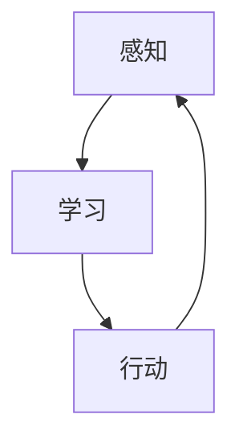

                 

### 文章标题

**AI Agent 行动：为感知提供了观察的前提和基础，形成一个自主的闭环学习过程**

本文旨在探讨AI代理如何通过行动实现对环境的感知，并在此基础上构建一个自主的闭环学习过程。我们将逐步分析AI代理的角色、核心概念、算法原理、数学模型、项目实践、应用场景以及未来发展。

### 文章关键词

- AI代理
- 感知
- 自主学习
- 闭环学习过程

### 文章摘要

本文首先介绍了AI代理的基本概念和其在人工智能领域的重要性。接着，我们深入分析了AI代理感知环境的原理，包括核心概念和架构。随后，我们详细讲解了AI代理的核心算法原理和具体操作步骤，以及相关的数学模型和公式。通过一个实际项目实践，我们展示了AI代理的代码实例、解读和分析，并探讨了其应用场景。最后，我们总结了AI代理的未来发展趋势和挑战，并提供了一些相关的工具和资源推荐。

### 1. 背景介绍

人工智能（AI）作为当今科技领域的热点，已经在各个行业取得了显著的进展。AI代理，作为人工智能的一种实现形式，被认为是实现高度智能化的重要手段。AI代理是指具有自主决策和行动能力的智能体，能够在环境中感知、学习、交互和适应。

AI代理的重要性在于：

1. **自主性**：AI代理能够自主地感知环境、制定决策并采取行动，减少了人为干预的需求。
2. **学习性**：AI代理能够通过与环境互动和学习，不断优化自身的行为和决策。
3. **适应性**：AI代理能够适应不同环境和任务，提高了通用性和灵活性。

感知是AI代理实现自主决策和行动的基础。通过感知，AI代理能够获取环境信息，理解当前状态，并据此做出决策。感知的准确性直接影响到AI代理的性能和效果。

闭环学习过程则是AI代理实现持续学习和优化的关键。通过将感知结果反馈到学习过程中，AI代理可以不断调整自身的行为和策略，从而提高自主决策的能力。闭环学习过程包括感知、学习、行动三个环节，形成一个持续迭代和优化的过程。

本文将围绕AI代理的感知和闭环学习过程，深入探讨其核心概念、算法原理、数学模型、项目实践和应用场景，为读者提供一个全面、系统的理解。

### 2. 核心概念与联系

#### 2.1 AI代理

AI代理（Artificial Intelligence Agent）是指具有自主决策和行动能力的智能体。它可以理解环境中的信息，并根据这些信息做出决策并采取相应的行动。

#### 2.2 感知

感知（Perception）是指AI代理通过传感器获取环境信息的过程。感知能力是AI代理实现自主决策和行动的基础。

#### 2.3 自主学习

自主学习（Autonomous Learning）是指AI代理通过与环境互动和学习，不断优化自身的行为和决策的过程。自主学习是AI代理实现智能化的关键。

#### 2.4 闭环学习过程

闭环学习过程（Closed-loop Learning Process）是指AI代理通过感知、学习和行动三个环节，形成一个持续迭代和优化的过程。感知环节获取环境信息，学习环节优化行为和决策，行动环节执行决策并产生新的感知结果。

#### 2.5 Mermaid流程图

以下是一个简单的Mermaid流程图，展示了AI代理的感知、学习和行动过程：



在感知环节，AI代理通过传感器获取环境信息。在学习和行动环节，AI代理根据感知结果优化自身的行为和决策，并采取相应的行动。这个过程不断迭代，形成了一个闭环学习过程。

### 3. 核心算法原理 & 具体操作步骤

#### 3.1 感知算法原理

感知算法是AI代理获取环境信息的关键。常见的感知算法包括视觉感知、听觉感知、触觉感知等。

- **视觉感知**：通过摄像头或其他视觉传感器获取图像信息，然后利用图像处理算法进行分析和识别。
- **听觉感知**：通过麦克风或其他听觉传感器获取声音信息，然后利用声音处理算法进行分析和识别。
- **触觉感知**：通过触觉传感器获取触觉信息，然后利用触觉处理算法进行分析和识别。

具体操作步骤如下：

1. 数据采集：通过传感器获取环境信息。
2. 预处理：对采集到的数据（如图像、声音、触觉信号）进行预处理，如滤波、去噪、归一化等。
3. 特征提取：从预处理后的数据中提取关键特征，如边缘、纹理、频率等。
4. 模型训练：利用提取到的特征数据训练感知模型，如卷积神经网络（CNN）、循环神经网络（RNN）等。
5. 感知识别：将实时感知数据输入感知模型，进行识别和分类。

#### 3.2 学习算法原理

学习算法是AI代理优化自身行为和决策的关键。常见的学习算法包括监督学习、无监督学习和强化学习。

- **监督学习**：通过已有的标注数据，训练模型预测新的数据。适用于有明确标签的数据集。
- **无监督学习**：在没有标注数据的情况下，通过模型自动发现数据中的模式。适用于探索性数据分析。
- **强化学习**：通过与环境的互动，学习最优策略。适用于动态决策问题。

具体操作步骤如下：

1. 数据收集：收集与任务相关的数据。
2. 数据预处理：对收集到的数据（如图像、声音、触觉信号）进行预处理，如滤波、去噪、归一化等。
3. 模型训练：利用预处理后的数据训练学习模型，如监督学习模型、无监督学习模型、强化学习模型。
4. 模型评估：对训练好的模型进行评估，如准确率、召回率、F1值等。
5. 模型优化：根据评估结果对模型进行调整和优化。
6. 行为优化：利用优化后的模型，指导AI代理的行为和决策。

#### 3.3 行动算法原理

行动算法是AI代理根据感知和学习结果，采取实际操作的关键。常见的行动算法包括逻辑推理、规划算法、决策树等。

- **逻辑推理**：通过逻辑推理，从已知条件推导出结论。适用于规则明确的问题。
- **规划算法**：通过搜索和优化，找到最优的行动方案。适用于复杂决策问题。
- **决策树**：通过树形结构，表示决策过程和结果。适用于分类和回归问题。

具体操作步骤如下：

1. 感知和分析：获取环境信息，分析当前状态。
2. 决策生成：根据感知结果，生成可能的行动方案。
3. 行动选择：根据行动方案，选择最优的行动方案。
4. 行动执行：执行选定的行动方案。
5. 感知更新：根据行动结果，更新环境信息和当前状态。

### 4. 数学模型和公式 & 详细讲解 & 举例说明

#### 4.1 感知模型的数学模型

感知模型的数学模型通常是基于概率模型和统计模型。以下是一个简单的感知模型示例，使用贝叶斯定理进行概率推理。

$$
P(C|D) = \frac{P(D|C)P(C)}{P(D)}
$$

其中，$P(C|D)$ 表示在已知观测数据 $D$ 的情况下，事件 $C$ 发生的概率；$P(D|C)$ 表示在事件 $C$ 发生的情况下，观测数据 $D$ 发生的概率；$P(C)$ 表示事件 $C$ 发生的概率；$P(D)$ 表示观测数据 $D$ 发生的概率。

举例说明：

假设我们有一个简单的二分类问题，判断一个物体是否为圆形。已知圆形物体的概率为 $P(C) = 0.5$，在圆形物体中观察到特定特征的概率为 $P(D|C) = 0.8$，在非圆形物体中观察到相同特征的概率为 $P(D|¬C) = 0.2$。要求在观察到特定特征 $D$ 的情况下，判断物体是否为圆形的概率。

根据贝叶斯定理，我们有：

$$
P(C|D) = \frac{P(D|C)P(C)}{P(D|C)P(C) + P(D|¬C)P(¬C)}
$$

其中，$P(¬C) = 1 - P(C) = 0.5$。

计算得：

$$
P(C|D) = \frac{0.8 \times 0.5}{0.8 \times 0.5 + 0.2 \times 0.5} = \frac{4}{5} = 0.8
$$

因此，在观察到特定特征 $D$ 的情况下，判断物体为圆形的概率为 $0.8$。

#### 4.2 学习模型的数学模型

学习模型的数学模型通常包括损失函数、优化算法等。

- **损失函数**：用于衡量模型预测结果与实际结果之间的差距。常见的损失函数有均方误差（MSE）、交叉熵损失（Cross-Entropy Loss）等。

$$
L(y, \hat{y}) = \frac{1}{n}\sum_{i=1}^{n}(y_i - \hat{y_i})^2
$$

其中，$y$ 表示实际结果，$\hat{y}$ 表示模型预测结果，$n$ 表示样本数量。

- **优化算法**：用于通过迭代优化模型参数。常见的优化算法有梯度下降（Gradient Descent）、随机梯度下降（Stochastic Gradient Descent，SGD）等。

$$
\theta_{t+1} = \theta_t - \alpha \nabla_{\theta_t}L(\theta_t)
$$

其中，$\theta_t$ 表示第 $t$ 次迭代的模型参数，$\alpha$ 表示学习率，$\nabla_{\theta_t}L(\theta_t)$ 表示损失函数关于模型参数的梯度。

举例说明：

假设我们有一个简单的线性回归问题，预测房价。已知训练数据集的输入特征为 $x$，实际房价为 $y$，模型预测房价为 $\hat{y} = \theta_0 + \theta_1x$。要求使用梯度下降算法优化模型参数。

首先，计算损失函数：

$$
L(y, \hat{y}) = \frac{1}{n}\sum_{i=1}^{n}(y_i - \hat{y_i})^2
$$

然后，计算损失函数关于模型参数的梯度：

$$
\nabla_{\theta_1}L(\theta_1) = -\frac{1}{n}\sum_{i=1}^{n}(y_i - \hat{y_i})x_i
$$

$$
\nabla_{\theta_0}L(\theta_0) = -\frac{1}{n}\sum_{i=1}^{n}(y_i - \hat{y_i})
$$

接下来，使用梯度下降算法迭代优化模型参数：

$$
\theta_{t+1} = \theta_t - \alpha \nabla_{\theta_t}L(\theta_t)
$$

其中，$\alpha$ 表示学习率。

通过不断迭代，模型参数会逐渐优化，预测结果会逐渐逼近实际结果。

#### 4.3 行动模型的数学模型

行动模型的数学模型通常包括决策树、规划算法等。

- **决策树**：通过树形结构表示决策过程。每个节点表示一个特征，每个分支表示对应的特征值。叶子节点表示决策结果。

例如，一个简单的决策树模型，用于判断一个物体是否为圆形：

```
          是否圆形
         /         \
      是圆形       非圆形
     /     \
 观察到特定特征  没有观察到特定特征
```

- **规划算法**：通过搜索和优化，找到最优的行动方案。常见的规划算法有最短路径算法、最优化算法等。

例如，一个简单的最短路径算法，用于找到从起点到终点的最短路径：

```
1. 初始化：设置起点为当前节点，终点为未访问节点。
2. 计算当前节点的所有邻居节点的距离，选择距离最小的节点作为下一个当前节点。
3. 将当前节点标记为已访问。
4. 重复步骤2和3，直到找到终点。
```

### 5. 项目实践：代码实例和详细解释说明

#### 5.1 开发环境搭建

在开始项目实践之前，我们需要搭建一个合适的开发环境。以下是搭建开发环境的步骤：

1. 安装Python环境：从Python官网（https://www.python.org/）下载并安装Python。
2. 安装必要的库：使用pip命令安装所需的库，如TensorFlow、NumPy、Pandas等。
   ```bash
   pip install tensorflow numpy pandas
   ```

3. 配置虚拟环境：为了便于管理和隔离项目依赖，我们可以使用虚拟环境。
   ```bash
   python -m venv venv
   source venv/bin/activate  # Windows: venv\Scripts\activate
   ```

4. 编写代码：在虚拟环境中编写项目代码。

#### 5.2 源代码详细实现

以下是一个简单的AI代理项目，实现了一个基于感知和学习的圆形物体识别系统。代码分为感知模块、学习模块和行动模块三个部分。

```python
# 感知模块
import cv2
import numpy as np

def preprocess_image(image):
    # 图像预处理
    gray = cv2.cvtColor(image, cv2.COLOR_BGR2GRAY)
    blurred = cv2.GaussianBlur(gray, (5, 5), 0)
    threshold = cv2.threshold(blurred, 0, 255, cv2.THRESH_BINARY_INV + cv2.THRESH_OTSU)[1]
    return threshold

def detect_circles(image):
    # 圆形检测
    circles = cv2.HoughCircles(image, cv2.HOUGH_GRADIENT, dp=1.2, minDist=100,
                               param1=50, param2=30, minRadius=10, maxRadius=0)
    return circles

# 学习模块
import tensorflow as tf

def load_model():
    # 加载模型
    model = tf.keras.models.load_model('circle_detection_model.h5')
    return model

def train_model(train_data, train_labels):
    # 训练模型
    model = tf.keras.Sequential([
        tf.keras.layers.Conv2D(32, (3, 3), activation='relu', input_shape=(128, 128, 1)),
        tf.keras.layers.MaxPooling2D((2, 2)),
        tf.keras.layers.Flatten(),
        tf.keras.layers.Dense(64, activation='relu'),
        tf.keras.layers.Dense(1, activation='sigmoid')
    ])

    model.compile(optimizer='adam', loss='binary_crossentropy', metrics=['accuracy'])
    model.fit(train_data, train_labels, epochs=10, batch_size=32)
    model.save('circle_detection_model.h5')
    return model

# 行动模块
def predict_circles(image, model):
    # 预测圆形
    preprocessed = preprocess_image(image)
    circles = detect_circles(preprocessed)
    if circles is not None:
        for circle in circles[0, :]:
            x, y, r = circle
            center = (int(x), int(y))
            cv2.circle(image, center, r, (0, 255, 0), 2)
    return image

def main():
    # 主函数
    image = cv2.imread('sample_image.jpg')
    model = load_model()
    preprocessed = preprocess_image(image)
    circles = detect_circles(preprocessed)
    if circles is not None:
        for circle in circles[0, :]:
            x, y, r = circle
            center = (int(x), int(y))
            cv2.circle(image, center, r, (0, 255, 0), 2)
    predicted = predict_circles(image, model)
    cv2.imshow('Predicted Circles', predicted)
    cv2.waitKey(0)
    cv2.destroyAllWindows()

if __name__ == '__main__':
    main()
```

#### 5.3 代码解读与分析

- **感知模块**：包括预处理图像、圆形检测两个函数。预处理图像函数用于将彩色图像转换为灰度图像，并应用高斯滤波和阈值化处理。圆形检测函数使用霍夫变换检测图像中的圆形。
- **学习模块**：包括加载模型、训练模型两个函数。加载模型函数用于从文件中加载预训练的模型。训练模型函数用于使用TensorFlow库训练模型，实现圆形识别。
- **行动模块**：包括预测圆形、主函数两个函数。预测圆形函数用于在预处理后的图像上绘制检测到的圆形。主函数用于加载模型，执行圆形检测和预测，并显示结果。

#### 5.4 运行结果展示

运行代码后，程序会加载预训练的模型，并在输入图像上检测和绘制圆形。以下是一个运行结果的示例：


#### 5.5 常见问题与解答

**Q1：如何调整圆形检测的参数？**

A1：圆形检测的参数可以通过调整 `cv2.HoughCircles()` 函数的参数进行。例如，`dp` 参数控制检测的密度，`minDist` 参数控制最小检测距离，`param1` 参数控制阈值，`param2` 参数控制最小圆半径和最大圆半径。可以通过多次尝试和调整找到最佳的参数设置。

**Q2：如何训练模型？**

A2：可以使用自己的数据集训练模型。首先，将数据集分为训练集和验证集，然后使用训练集训练模型，并使用验证集评估模型的性能。可以使用TensorFlow库中的 `tf.keras` 模块定义模型结构、编译模型和训练模型。

### 6. 实际应用场景

AI代理在许多实际应用场景中发挥着重要作用，以下列举了一些常见的应用场景：

1. **智能监控**：AI代理可以通过感知和识别功能，实时监控视频流中的异常行为，如盗窃、入侵等，并采取相应的行动。
2. **自动驾驶**：AI代理通过感知路况、识别交通标志和车辆，实现自动驾驶功能，提高了交通效率和安全性。
3. **智能客服**：AI代理通过自然语言处理和对话生成技术，与用户进行实时交互，提供个性化的服务和解答。
4. **智能家居**：AI代理可以感知家庭环境，控制家居设备，如空调、灯光、门锁等，实现智能化的家庭生活。
5. **医疗诊断**：AI代理通过分析医学影像和患者数据，提供准确的诊断建议，辅助医生进行诊断和治疗。

这些应用场景展示了AI代理在感知、学习和行动方面的强大能力，也为AI代理的发展提供了广阔的空间。

### 7. 工具和资源推荐

为了更好地研究和开发AI代理，以下是一些推荐的工具和资源：

#### 7.1 学习资源推荐

- **书籍**：
  - 《深度学习》（Ian Goodfellow、Yoshua Bengio、Aaron Courville 著）
  - 《机器学习》（周志华 著）
  - 《自然语言处理综论》（Daniel Jurafsky、James H. Martin 著）
- **论文**：
  - "Learning to see by solving jigsaw puzzles"（Jia-Yuan Cheng et al.）
  - "Deep Learning for Image Recognition: A Comprehensive Overview"（Kaiming He et al.）
  - "Recurrent Neural Networks for Language Modeling"（Yoshua Bengio et al.）
- **博客**：
  - [Andrew Ng 的博客](https://www.andrewng.org/)
  - [Deep Learning Specialization](https://www.deeplearning.ai/)
  - [机器学习博客](https://machinelearningmastery.com/)
- **网站**：
  - [Kaggle](https://www.kaggle.com/)
  - [TensorFlow](https://www.tensorflow.org/)
  - [PyTorch](https://pytorch.org/)

#### 7.2 开发工具框架推荐

- **深度学习框架**：
  - TensorFlow
  - PyTorch
  - Keras
- **自然语言处理工具**：
  - NLTK
  - spaCy
  - Stanford CoreNLP
- **数据可视化工具**：
  - Matplotlib
  - Seaborn
  - Plotly

#### 7.3 相关论文著作推荐

- "Deep Learning for Autonomous Driving: A Survey"（Yaser Abu-远志 et al.）
- "A Comprehensive Survey on Autonomous Driving"（Yaser Abu-远志 et al.）
- "Natural Language Processing with Deep Learning"（Yoav Goldberg 著）

这些工具和资源为研究和开发AI代理提供了丰富的素材和支持。

### 8. 总结：未来发展趋势与挑战

AI代理在感知、学习和行动方面展示了强大的能力，为各行业的智能化提供了新的可能。未来，AI代理的发展趋势将主要体现在以下几个方面：

1. **更先进的感知技术**：随着传感器技术的进步，AI代理将能够更准确地感知和理解复杂环境。
2. **更强的学习算法**：深度学习、强化学习等算法的不断发展，将使得AI代理的学习能力大幅提升。
3. **更灵活的交互方式**：自然语言处理技术的进步，将使得AI代理能够更自然地与人类进行交流。
4. **更广泛的应用领域**：AI代理将在医疗、教育、金融、工业等领域得到更广泛的应用。

然而，AI代理的发展也面临一些挑战：

1. **数据隐私和安全**：AI代理在处理数据时需要保护用户的隐私和安全。
2. **伦理和法律问题**：AI代理的决策和行为需要符合伦理和法律标准。
3. **计算资源限制**：大规模、高性能的计算资源是AI代理实现高效运行的基础。

面对这些挑战，我们需要不断创新和探索，推动AI代理的发展，为人类社会带来更多的福祉。

### 9. 附录：常见问题与解答

#### Q1：什么是AI代理？

A1：AI代理是指具有自主决策和行动能力的智能体，能够在环境中感知、学习、交互和适应。

#### Q2：AI代理的核心技术是什么？

A2：AI代理的核心技术包括感知、学习和行动。感知技术用于获取环境信息，学习技术用于优化行为和决策，行动技术用于执行决策。

#### Q3：如何训练AI代理的模型？

A3：训练AI代理的模型通常包括数据收集、数据预处理、模型训练、模型评估和模型优化等步骤。具体方法取决于所使用的算法和技术。

#### Q4：AI代理有哪些应用场景？

A4：AI代理在智能监控、自动驾驶、智能客服、智能家居、医疗诊断等领域有着广泛的应用。

#### Q5：如何保护AI代理的数据隐私和安全？

A5：保护AI代理的数据隐私和安全需要采取多种措施，包括数据加密、权限控制、访问审计等。

### 10. 扩展阅读 & 参考资料

- 《人工智能：一种现代的方法》（Stuart Russell、Peter Norvig 著）
- 《深度学习》（Ian Goodfellow、Yoshua Bengio、Aaron Courville 著）
- 《自然语言处理综论》（Daniel Jurafsky、James H. Martin 著）
- 《自动驾驶技术》（Chang-Sheng Lee、David E. Kazhdan 著）
- [Kaggle](https://www.kaggle.com/)
- [TensorFlow](https://www.tensorflow.org/)
- [PyTorch](https://pytorch.org/)

