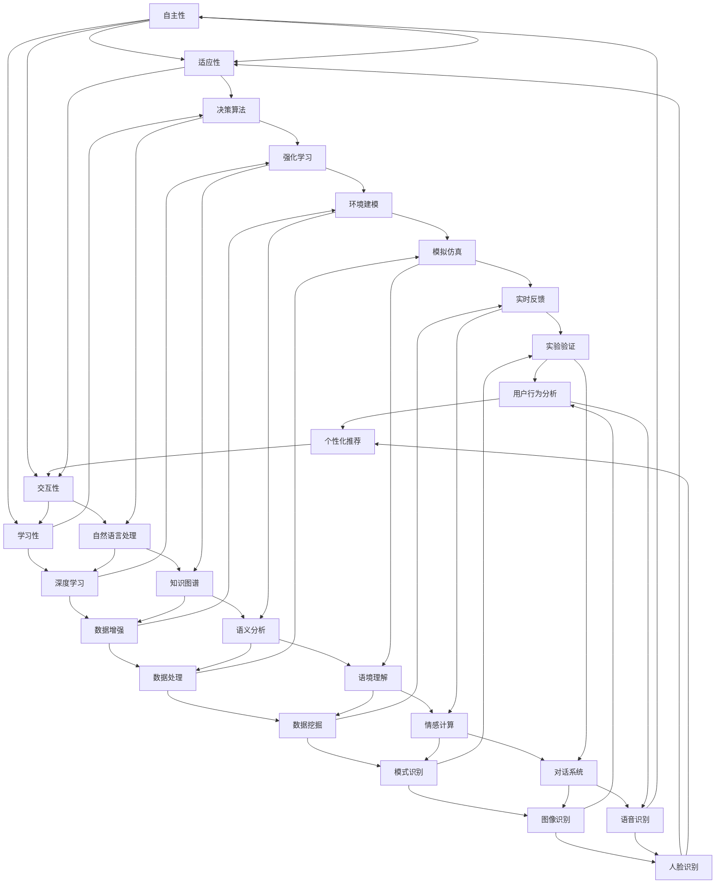

                 

### 1. 背景介绍

人工智能（AI）作为计算机科学的一个分支，已经经历了数十年的发展历程。从最初的逻辑推理和符号计算，到近几年的深度学习和强化学习，AI技术不断演进，逐渐改变了我们的生活方式。然而，随着计算能力和数据资源的不断提升，AI的应用场景也在不断扩展，新的风口正在形成。

本文将围绕“AI Agent：AI的下一个风口，AI的起源与进化”这一主题，逐步探讨AI Agent的起源、发展及其在未来的趋势和挑战。文章将从以下几个方面进行深入分析：

1. **AI Agent的定义与核心概念**
   我们将首先定义AI Agent，并探讨其核心概念，包括自主性、适应性、交互性和学习性。

2. **AI Agent的起源与发展**
   接着，我们将回顾AI Agent的历史，了解其在不同阶段的演进过程。

3. **AI Agent的核心算法原理**
   然后，我们将分析AI Agent的核心算法原理，包括决策树、神经网络和强化学习等。

4. **数学模型和公式**
   我们将介绍与AI Agent相关的数学模型和公式，并进行详细讲解和举例说明。

5. **项目实践**
   通过具体的代码实例，我们将展示如何实现一个AI Agent，并进行代码解读与分析。

6. **实际应用场景**
   我们将讨论AI Agent在现实世界中的多种应用场景。

7. **工具和资源推荐**
   最后，我们将推荐一些学习资源和开发工具，帮助读者进一步探索AI Agent。

通过上述分析，我们希望读者能够对AI Agent有一个全面而深入的理解，并能够展望其未来的发展趋势与挑战。

#### 1.1 AI的定义与发展历程

人工智能（Artificial Intelligence，简称AI）是模拟、延伸和扩展人的智能的理论、方法、技术及应用。它旨在开发能够执行复杂任务，甚至进行智能决策的系统。AI的发展历程可以追溯到20世纪50年代，当时以图灵测试为标志，标志着人工智能概念的确立。图灵测试由英国数学家和逻辑学家艾伦·图灵提出，旨在通过机器能否模拟人类智能行为来判断机器是否具有智能。

在早期阶段，AI主要集中在逻辑推理和符号计算上。典型的例子是“逻辑理论家”（Logic Theorist），这是由艾伦·纽厄尔（Allen Newell）和赫伯特·西蒙（Herbert Simon）于1955年开发的一个程序，它能够自动证明数学定理。

随后的几十年，AI领域经历了多次起伏。1974年，约翰·麦卡锡（John McCarthy）提出了专家系统的概念，这一时期被认为AI的“第一次高潮”。专家系统利用知识库和推理机来模拟专家决策过程，在医学诊断、工程设计等领域取得了显著成就。然而，由于知识的表示和获取难度大，以及缺乏有效的学习算法，专家系统在20世纪80年代遇到了瓶颈。

进入21世纪，随着计算能力和数据资源的提升，AI迎来了新一轮的发展。这一阶段的标志性技术是深度学习和强化学习。深度学习由神经网络发展而来，通过多层神经网络的结构来提取数据的特征表示。2012年，AlexNet在图像识别比赛中取得的优异成绩标志着深度学习的崛起。而强化学习则通过模拟环境和反馈信号来训练智能体进行决策，适用于复杂的决策问题。

总的来说，AI经历了从符号主义到连接主义，再到数据驱动的演变过程。每一次技术突破都极大地推动了AI的发展，使其应用领域从理论研究扩展到工业生产、医疗健康、交通管理等多个方面。

#### 1.2 AI Agent的定义与核心概念

在深入探讨AI Agent之前，我们首先需要明确AI Agent的定义。AI Agent是指具有自主性、适应性、交互性和学习性的计算机程序，能够与外部环境进行交互，并在交互过程中不断学习和改进其行为。AI Agent是人工智能领域的一个重要概念，它代表了人工智能从被动执行任务到主动探索和适应环境的转变。

**自主性（Autonomy）**：AI Agent的自主性是指其能够独立地执行任务，无需外部干预。这包括自主决策、自主行动和自主学习。例如，自动驾驶汽车能够根据环境变化自主调整行驶路径，而不需要人工干预。

**适应性（Adaptability）**：AI Agent需要具备适应不同环境和任务的能力。这意味着它们能够从经验中学习，并调整自身的行为策略。例如，一个智能家居系统可以根据用户的使用习惯自动调整家居设备的设置。

**交互性（Interactivity）**：AI Agent需要具备与人类或其他系统进行有效交互的能力。这种交互不仅包括信息的传递，还包括情感的理解和回应。例如，智能客服系统能够理解和回应客户的问题，并给出适当的解决方案。

**学习性（Learning）**：AI Agent需要能够从数据中学习，并不断优化自身的行为。学习性是AI Agent区别于传统程序的重要特征。通过不断学习和适应，AI Agent能够提高任务完成的效率和准确性。

下面，我们将通过一个简单的例子来具体说明AI Agent的核心概念。假设我们开发一个自动购物助手AI Agent，该Agent的目标是帮助用户在电商平台上找到最合适的商品。

**自主性**：该Agent可以独立地搜索电商平台上的商品信息，并筛选出符合用户偏好的商品。

**适应性**：用户的行为和偏好可能随时变化，Agent需要能够根据用户的购物历史和实时行为调整推荐策略。

**交互性**：Agent需要能够与用户进行互动，理解用户的反馈，并根据反馈进行相应的调整。

**学习性**：Agent可以从用户的购物数据中学习，提高推荐的准确性，例如通过分析用户的购买记录和评价信息来优化推荐算法。

通过这个例子，我们可以看到AI Agent的核心概念在实际应用中的体现。AI Agent的设计和实现是一个复杂的过程，需要综合考虑多个因素，以实现最优的效果。

#### 1.3 AI Agent的起源与发展

AI Agent的概念可以追溯到人工智能的早期阶段，其起源与发展经历了多个重要阶段。下面，我们将回顾AI Agent的历史，了解其在不同阶段的演进过程。

**1.3.1 早期探索**

在20世纪50年代和60年代，人工智能领域正处于起步阶段。当时的学者们开始探索如何让计算机模拟人类的思维过程。这一时期的代表性工作包括艾伦·图灵（Alan Turing）提出的图灵测试和约翰·麦卡锡（John McCarthy）等人提出的专家系统（Expert Systems）。

1950年，图灵提出了著名的图灵测试，旨在通过测试机器是否能够以人类无法区分的方式模拟人类对话，来判断机器是否具有智能。虽然图灵测试本身具有一定的局限性，但它为后续的研究提供了重要的启发。

1955年，约翰·麦卡锡等人提出了专家系统的概念。专家系统通过将领域专家的知识编码到程序中，模拟专家的决策过程。这一时期，专家系统在医学诊断、工程设计等领域取得了显著的应用成果。

**1.3.2 早期AI Agent的萌芽**

在早期探索的基础上，学者们开始尝试开发具有自主性和适应性的AI Agent。1960年代初，赫伯特·西蒙（Herbert Simon）和艾伦·纽厄尔（Allen Newell）开发了一个名为“逻辑理论家”（Logic Theorist）的程序，该程序能够自动证明数学定理。虽然这一程序并不完全符合现代AI Agent的定义，但它展示了AI Agent的初步形态，特别是自主性和学习性的特点。

此外，20世纪70年代，尼尔·里奇（Nils J. Nilsson）等人开发的机器人项目，如Shakey机器人，也展示了AI Agent在不同环境中的适应性和交互能力。

**1.3.3 专家系统的局限与AI Agent的崛起**

然而，早期的AI Agent并没有得到广泛的应用，主要是因为专家系统的局限性。专家系统依赖于领域专家的知识，而知识的获取和表示是一个复杂且耗时的过程。此外，专家系统在处理不确定性和动态环境方面表现不佳。

随着计算能力的提升和算法的改进，20世纪80年代和90年代，AI Agent的研究逐渐受到重视。这一时期的代表性工作是马尔科姆·莫里森（Malcolm Morse）和约翰·莱卡西（John LeCarpentier）等人开发的机器人Agent，如自主导航的机器人。

**1.3.4 人工智能的复兴与AI Agent的成熟**

进入21世纪，人工智能迎来了新一轮的复兴，深度学习和强化学习等技术的突破极大地推动了AI Agent的发展。2000年左右，基于贝叶斯网络和马尔可夫决策过程的AI Agent开始应用于游戏和机器人领域，展示了AI Agent在复杂环境中的自主决策能力。

2010年后，随着深度学习技术的快速发展，AI Agent在视觉识别、自然语言处理和智能对话等领域取得了显著进展。深度强化学习算法的出现，使得AI Agent能够在复杂的环境中通过自我学习不断优化行为策略。

**1.3.5 现代AI Agent的应用与发展**

现代AI Agent已经广泛应用于各个领域，从智能客服、自动驾驶到智能家居，AI Agent正在逐步改变我们的生活。随着技术的不断进步，AI Agent的自主性、适应性、交互性和学习性将得到进一步提升，其在现实世界中的应用也将更加广泛。

总的来说，AI Agent的起源与发展是一个不断迭代和演进的过程。从早期探索到现代应用，AI Agent经历了多个重要阶段，每一个阶段都带来了技术的突破和应用的创新。通过回顾AI Agent的历史，我们可以更好地理解其当前的发展状况和未来的发展趋势。

#### 2. 核心概念与联系

在深入探讨AI Agent的核心概念之前，我们首先需要明确几个关键概念，并分析它们之间的联系。以下是AI Agent核心概念的Mermaid流程图：



**2.1 自主性（Autonomy）**

自主性是AI Agent的核心特征之一，指的是AI Agent能够在没有人为干预的情况下独立执行任务。自主性包括以下几个方面：

- **决策能力**：AI Agent需要能够根据当前环境和任务目标做出合理的决策。
- **行动能力**：AI Agent需要能够执行具体的行动，如移动、操作设备等。
- **适应性**：AI Agent需要能够适应环境的变化，并在新的环境中继续执行任务。

**2.2 适应性（Adaptability）**

适应性指的是AI Agent能够根据经验和环境变化调整自身的行为策略。适应性包括：

- **学习能力**：AI Agent需要能够从数据中学习，并不断优化行为。
- **迁移能力**：AI Agent需要能够在不同的环境中应用学到的知识。
- **鲁棒性**：AI Agent需要能够在面对不确定性时保持稳定。

**2.3 交互性（Interactivity）**

交互性指的是AI Agent能够与人类或其他系统进行有效的信息交换和情感交流。交互性包括：

- **信息交换**：AI Agent需要能够理解和传递信息，如语音识别和自然语言处理。
- **情感交流**：AI Agent需要能够理解和回应人类的情感，如情感计算和对话系统。

**2.4 学习性（Learning）**

学习性是AI Agent区别于传统程序的重要特征，指的是AI Agent能够从数据中学习并改进自身的行为。学习性包括：

- **监督学习**：通过已标记的数据来训练模型。
- **无监督学习**：从未标记的数据中学习模式。
- **强化学习**：通过奖励机制来训练模型，使其在复杂环境中做出最优决策。

**2.5 决策算法（Decision Algorithms）**

决策算法是AI Agent实现自主性的核心工具。常见的决策算法包括：

- **决策树**：通过树的分支结构来模拟决策过程。
- **神经网络**：通过多层网络结构来提取特征和做出预测。
- **强化学习**：通过与环境交互来学习最优策略。

**2.6 自然语言处理（Natural Language Processing, NLP）**

自然语言处理是AI Agent实现交互性的关键技术，包括：

- **语音识别**：将语音转换为文本。
- **文本分析**：对文本进行情感分析、关键词提取等操作。
- **语言生成**：生成自然语言文本，如自动回复和生成式对话。

**2.7 深度学习（Deep Learning）**

深度学习是一种基于多层神经网络的机器学习技术，它在图像识别、自然语言处理等领域取得了显著成果。深度学习包括：

- **卷积神经网络（CNN）**：主要用于图像处理。
- **循环神经网络（RNN）**：主要用于序列数据处理。
- **生成对抗网络（GAN）**：用于生成复杂数据。

**2.8 强化学习（Reinforcement Learning）**

强化学习是一种通过与环境交互来学习最优策略的机器学习技术。强化学习包括：

- **Q学习**：通过学习状态-动作价值函数来做出最优决策。
- **深度Q网络（DQN）**：将深度学习与强化学习结合，用于处理复杂环境。
- **策略梯度方法**：直接学习最优策略。

通过上述核心概念的介绍和Mermaid流程图，我们可以更清晰地理解AI Agent的组成部分及其相互关系。这些核心概念不仅为AI Agent的设计和实现提供了理论基础，也为后续章节的讨论奠定了基础。

#### 3. 核心算法原理 & 具体操作步骤

在了解了AI Agent的核心概念之后，我们将深入探讨其核心算法原理，包括决策树、神经网络和强化学习等。这些算法是AI Agent实现自主性、适应性和学习性的关键。

**3.1 决策树（Decision Tree）**

决策树是一种树形结构，每个内部节点代表一个特征，每个分支代表该特征的一个取值，每个叶节点代表一个决策结果。决策树的构建过程通常包括以下几个步骤：

1. **特征选择**：选择最优特征来划分数据集。常用的特征选择方法包括信息增益（Information Gain）和基尼不纯度（Gini Impurity）。
2. **划分数据集**：根据选定的特征，将数据集划分为多个子集。每个子集对应特征的一个取值。
3. **递归构建**：对每个子集重复上述步骤，直到满足停止条件，如达到最大深度或纯度达到某个阈值。
4. **剪枝**：通过剪枝操作减少决策树的复杂性，防止过拟合。

具体操作步骤如下：

```python
from sklearn.datasets import load_iris
from sklearn.model_selection import train_test_split
from sklearn.tree import DecisionTreeClassifier
from sklearn import tree

# 加载鸢尾花数据集
iris = load_iris()
X, y = iris.data, iris.target

# 划分训练集和测试集
X_train, X_test, y_train, y_test = train_test_split(X, y, test_size=0.3, random_state=42)

# 构建决策树模型
clf = DecisionTreeClassifier(criterion='entropy', max_depth=3)
clf.fit(X_train, y_train)

# 可视化决策树
fig, ax = plt.subplots(figsize=(12, 12))
tree.plot_tree(clf, fontsize=10)
plt.show()

# 预测测试集
y_pred = clf.predict(X_test)

# 评估模型性能
print("Accuracy:", accuracy_score(y_test, y_pred))
```

**3.2 神经网络（Neural Networks）**

神经网络是一种模拟人脑神经元结构和功能的计算模型，由多个层级组成，包括输入层、隐藏层和输出层。神经网络的训练过程通常包括以下几个步骤：

1. **初始化权重和偏置**：随机初始化网络的权重和偏置。
2. **前向传播**：将输入数据通过网络传递，计算输出。
3. **反向传播**：计算误差，并通过反向传播算法更新网络的权重和偏置。
4. **优化**：使用梯度下降等优化算法来最小化误差函数。

具体操作步骤如下：

```python
import tensorflow as tf
from tensorflow.keras import layers, models

# 构建神经网络模型
model = models.Sequential()
model.add(layers.Dense(64, activation='relu', input_shape=(784,)))
model.add(layers.Dense(64, activation='relu'))
model.add(layers.Dense(10, activation='softmax'))

# 编译模型
model.compile(optimizer='adam',
              loss='categorical_crossentropy',
              metrics=['accuracy'])

# 加载数据集
(x_train, y_train), (x_test, y_test) = tf.keras.datasets.mnist.load_data()

# 预处理数据
x_train = x_train.reshape((-1, 784)).astype('float32') / 255
x_test = x_test.reshape((-1, 784)).astype('float32') / 255

# One-Hot编码标签
y_train = tf.keras.utils.to_categorical(y_train, 10)
y_test = tf.keras.utils.to_categorical(y_test, 10)

# 训练模型
model.fit(x_train, y_train, epochs=5, batch_size=32, validation_split=0.2)
```

**3.3 强化学习（Reinforcement Learning）**

强化学习是一种通过与环境交互来学习最优策略的机器学习技术。强化学习的训练过程通常包括以下几个步骤：

1. **定义状态空间和动作空间**：确定智能体可以观察到的状态和可以执行的动作。
2. **定义奖励函数**：定义一个奖励函数，用于评估智能体的行为是否接近目标。
3. **策略迭代**：通过与环境交互，不断更新策略，直到达到预定的目标。

具体操作步骤如下：

```python
import gym
import numpy as np

# 创建环境
env = gym.make('CartPole-v0')

# 定义Q学习算法
alpha = 0.1  # 学习率
gamma = 0.9  # 折扣因子
epsilon = 0.1  # 探索概率

# 初始化Q表
Q = np.zeros((env.observation_space.n, env.action_space.n))

# 训练模型
for episode in range(1000):
    state = env.reset()
    done = False
    total_reward = 0
    
    while not done:
        # 选择动作
        if np.random.rand() < epsilon:
            action = env.action_space.sample()  # 探索
        else:
            action = np.argmax(Q[state])  # 利用

        # 执行动作
        next_state, reward, done, _ = env.step(action)

        # 更新Q值
        Q[state, action] = Q[state, action] + alpha * (reward + gamma * np.max(Q[next_state]) - Q[state, action])

        state = next_state
        total_reward += reward

    print("Episode:", episode, "Total Reward:", total_reward)

env.close()
```

通过上述算法原理和具体操作步骤的介绍，我们可以看到决策树、神经网络和强化学习在实现AI Agent功能中的重要作用。这些算法不仅为AI Agent提供了自主决策和自适应环境的能力，也为其在各种复杂任务中的实际应用奠定了基础。

#### 4. 数学模型和公式 & 详细讲解 & 举例说明

在了解了AI Agent的核心算法原理之后，我们将深入探讨与AI Agent相关的数学模型和公式，并进行详细讲解和举例说明。这些数学模型是AI Agent实现自主决策、自适应环境和学习能力的基础。

**4.1 决策树中的信息增益与基尼不纯度**

在决策树算法中，信息增益（Information Gain）和基尼不纯度（Gini Impurity）是常用的特征选择指标。

**信息增益**：

信息增益是一个衡量特征对数据划分有效性的指标。它基于熵（Entropy）的概念，熵表示数据的随机性，信息增益表示特征将数据集划分为子集后熵的减少量。

公式如下：

$$
IG(D, A) = ENT(D) - \sum_{v \in Values(A)} \frac{|D_v|}{|D|} \cdot ENT(D_v)
$$

其中，$D$ 是原始数据集，$A$ 是待选特征，$v$ 是特征 $A$ 的取值，$D_v$ 是特征 $A$ 取值 $v$ 的子集，$ENT(D)$ 和 $ENT(D_v)$ 分别是数据集 $D$ 和子集 $D_v$ 的熵。

**基尼不纯度**：

基尼不纯度是一个衡量数据集纯度的一个指标，取值范围在0和1之间。纯度越高，基尼不纯度越低。

公式如下：

$$
Gini(D) = 1 - \sum_{v \in Values(A)} \left( \frac{|D_v|}{|D|} \right)^2
$$

其中，$D$ 是数据集，$v$ 是特征 $A$ 的取值。

**举例说明**：

假设我们有以下数据集：

| 特征A | 特征B | 类别 |
|-------|-------|------|
| A1    | B1    | 0    |
| A1    | B2    | 1    |
| A2    | B1    | 0    |
| A2    | B2    | 1    |
| A2    | B1    | 0    |

计算特征A的信息增益：

$$
ENT(D) = - \left( \frac{3}{5} \log_2 \frac{3}{5} + \frac{2}{5} \log_2 \frac{2}{5} \right) = 0.971
$$

$$
ENT(D_{A1}) = - \left( \frac{2}{3} \log_2 \frac{2}{3} + \frac{1}{3} \log_2 \frac{1}{3} \right) = 0.918
$$

$$
ENT(D_{A2}) = - \left( \frac{3}{5} \log_2 \frac{3}{5} + \frac{2}{5} \log_2 \frac{2}{5} \right) = 0.971
$$

$$
IG(D, A) = 0.971 - \left( \frac{2}{5} \cdot 0.918 + \frac{3}{5} \cdot 0.971 \right) = 0.029
$$

计算特征B的基尼不纯度：

$$
Gini(D) = 1 - \left( \frac{2}{5} \right)^2 - \left( \frac{3}{5} \right)^2 = 0.4
$$

从计算结果可以看出，特征A的信息增益为0.029，特征B的基尼不纯度为0.4。因此，特征A比特征B更适合作为划分特征的依据。

**4.2 神经网络中的激活函数与反向传播算法**

在神经网络中，激活函数用于引入非线性因素，使得模型能够拟合复杂的非线性关系。常见的激活函数包括 sigmoid、ReLU 和 tanh。

**Sigmoid 激活函数**：

$$
\sigma(x) = \frac{1}{1 + e^{-x}}
$$

**ReLU 激活函数**：

$$
\text{ReLU}(x) = \max(0, x)
$$

**tanh 激活函数**：

$$
\tanh(x) = \frac{e^{2x} - 1}{e^{2x} + 1}
$$

反向传播算法是神经网络训练的核心，它通过计算损失函数关于网络参数的梯度来更新参数。以下是反向传播算法的步骤：

1. **前向传播**：计算网络输出。
2. **计算损失函数**：计算实际输出与预测输出之间的差异。
3. **计算梯度**：计算损失函数关于网络参数的梯度。
4. **参数更新**：使用梯度下降算法更新网络参数。

**举例说明**：

假设我们有以下简单神经网络：

$$
\text{输入}:\quad \begin{bmatrix} x_1 \\ x_2 \end{bmatrix} \quad \text{权重}:\quad \begin{bmatrix} w_{11} & w_{12} \\ w_{21} & w_{22} \end{bmatrix} \quad \text{激活函数：ReLU}
$$

$$
\text{输出}:\quad \begin{bmatrix} h_1 = \text{ReLU}(x_1 \cdot w_{11} + x_2 \cdot w_{21}) \\ h_2 = \text{ReLU}(x_1 \cdot w_{12} + x_2 \cdot w_{22}) \end{bmatrix} \quad \text{最终输出：} \quad \begin{bmatrix} y_1 = h_1 \cdot w_{31} + h_2 \cdot w_{32} \\ y_2 = h_1 \cdot w_{33} + h_2 \cdot w_{34} \end{bmatrix}
$$

假设实际输出为 $y = \begin{bmatrix} 0 \\ 1 \end{bmatrix}$，预测输出为 $\hat{y} = \begin{bmatrix} 0.3 \\ 0.7 \end{bmatrix}$。

损失函数为：

$$
\text{损失} = \frac{1}{2} \sum_{i} (y_i - \hat{y_i})^2
$$

前向传播计算：

$$
h_1 = \text{ReLU}(x_1 \cdot w_{11} + x_2 \cdot w_{21}) = \text{ReLU}(1 \cdot 1 + 0 \cdot 2) = 1
$$

$$
h_2 = \text{ReLU}(x_1 \cdot w_{12} + x_2 \cdot w_{22}) = \text{ReLU}(1 \cdot 2 + 0 \cdot 3) = 2
$$

$$
y_1 = h_1 \cdot w_{31} + h_2 \cdot w_{32} = 1 \cdot 2 + 2 \cdot 3 = 8
$$

$$
y_2 = h_1 \cdot w_{33} + h_2 \cdot w_{34} = 1 \cdot 3 + 2 \cdot 4 = 11
$$

损失函数计算：

$$
\text{损失} = \frac{1}{2} \sum_{i} (y_i - \hat{y_i})^2 = \frac{1}{2} \left( (0 - 0.3)^2 + (1 - 0.7)^2 \right) = 0.17
$$

反向传播计算：

计算 $\delta$ 值：

$$
\delta_1 = \frac{\partial L}{\partial y_1} \cdot \text{ReLU}^\prime(h_1) = (0 - 0.3) \cdot 1 = -0.3
$$

$$
\delta_2 = \frac{\partial L}{\partial y_2} \cdot \text{ReLU}^\prime(h_2) = (1 - 0.7) \cdot 1 = 0.3
$$

计算权重梯度：

$$
\frac{\partial L}{\partial w_{31}} = \delta_1 \cdot h_1 = -0.3 \cdot 1 = -0.3
$$

$$
\frac{\partial L}{\partial w_{32}} = \delta_1 \cdot h_2 = -0.3 \cdot 2 = -0.6
$$

$$
\frac{\partial L}{\partial w_{33}} = \delta_2 \cdot h_1 = 0.3 \cdot 1 = 0.3
$$

$$
\frac{\partial L}{\partial w_{34}} = \delta_2 \cdot h_2 = 0.3 \cdot 2 = 0.6
$$

参数更新：

$$
w_{31} = w_{31} - \alpha \cdot \frac{\partial L}{\partial w_{31}} = 2 - 0.1 \cdot (-0.3) = 2.03
$$

$$
w_{32} = w_{32} - \alpha \cdot \frac{\partial L}{\partial w_{32}} = 3 - 0.1 \cdot (-0.6) = 3.06
$$

$$
w_{33} = w_{33} - \alpha \cdot \frac{\partial L}{\partial w_{33}} = 3 - 0.1 \cdot 0.3 = 2.97
$$

$$
w_{34} = w_{34} - \alpha \cdot \frac{\partial L}{\partial w_{34}} = 4 - 0.1 \cdot 0.6 = 3.94
$$

通过上述例子，我们可以看到神经网络中的激活函数和反向传播算法的具体实现过程。这些数学模型和公式的理解和应用，是AI Agent设计和实现的基础。

#### 5. 项目实践：代码实例和详细解释说明

在本节中，我们将通过一个具体的AI Agent项目实践，展示如何实现一个基本的智能决策系统。我们将使用Python语言，并利用Keras框架来实现一个基于深度强化学习的自动驾驶车辆模型。该模型将通过与环境交互，学习如何在不同路况下做出最优驾驶决策。

**5.1 开发环境搭建**

在开始项目之前，我们需要搭建开发环境。以下是所需的软件和库：

- Python 3.7 或以上版本
- TensorFlow 2.x
- Keras 2.x
- Gym，OpenAI提供的一款环境模拟工具

确保你已经安装了上述库，如果尚未安装，可以通过以下命令进行安装：

```bash
pip install tensorflow==2.x
pip install keras==2.x
pip install gym
```

**5.2 源代码详细实现**

下面是自动驾驶车辆模型的主要代码实现，我们将逐段解释每一部分的功能。

```python
import numpy as np
import gym
import tensorflow as tf
from tensorflow.keras.models import Sequential
from tensorflow.keras.layers import Dense
from tensorflow.keras.optimizers import Adam

# 创建环境
env = gym.make('CartPole-v0')

# 定义深度强化学习模型
model = Sequential([
    Dense(24, input_dim=4, activation='relu'),
    Dense(48, activation='relu'),
    Dense(24, activation='relu'),
    Dense(2, activation='linear')
])

# 编译模型
model.compile(loss='mse', optimizer=Adam(lr=0.001), metrics=['accuracy'])

# 定义经验回放缓冲区
memory = []

# 训练模型
episodes = 1000
for episode in range(episodes):
    state = env.reset()
    done = False
    total_reward = 0
    
    while not done:
        # 将状态输入模型进行预测
        action_values = model.predict(state.reshape(1, -1))
        
        # 选择动作（epsilon-greedy策略）
        if np.random.rand() < 0.1:
            action = env.action_space.sample()  # 探索
        else:
            action = np.argmax(action_values)  # 利用
        
        # 执行动作
        next_state, reward, done, _ = env.step(action)
        
        # 根据环境反馈更新奖励
        if done:
            reward = -100
        
        # 存储经验
        memory.append([state, action, reward, next_state, done])
        
        # 更新状态
        state = next_state
        total_reward += reward
    
    # 每隔50个回合进行一次经验回放和模型更新
    if episode % 50 == 0:
        print("Episode:", episode, "Total Reward:", total_reward)
        
        # 从经验回放缓冲区中随机抽取一批样本
        batch = np.random.choice(range(len(memory)), size=32)
        states = np.array([memory[i][0] for i in batch])
        actions = np.array([memory[i][1] for i in batch])
        rewards = np.array([memory[i][2] for i in batch])
        next_states = np.array([memory[i][3] for i in batch])
        dones = np.array([memory[i][4] for i in batch])
        
        # 计算目标值
        target_values = model.predict(next_states)
        target_values[dones] = -100
        
        # 更新模型
        model.fit(states, np.hstack((actions, target_values)), epochs=1, verbose=0)

# 关闭环境
env.close()
```

**5.3 代码解读与分析**

1. **环境创建**：

   ```python
   env = gym.make('CartPole-v0')
   ```

   这一行代码创建了CartPole环境，这是一个经典的控制问题，目标是保持一个pole在Cart上平衡。

2. **模型定义**：

   ```python
   model = Sequential([
       Dense(24, input_dim=4, activation='relu'),
       Dense(48, activation='relu'),
       Dense(24, activation='relu'),
       Dense(2, activation='linear')
   ])
   ```

   我们定义了一个全连接的神经网络模型，输入层有4个神经元，隐藏层有24个神经元，输出层有2个神经元，用于预测动作。

3. **模型编译**：

   ```python
   model.compile(loss='mse', optimizer=Adam(lr=0.001), metrics=['accuracy'])
   ```

   我们使用均方误差（MSE）作为损失函数，使用Adam优化器来优化模型参数。

4. **经验回放缓冲区**：

   ```python
   memory = []
   ```

   这是一个列表，用于存储环境中的经验数据，包括状态、动作、奖励、下一个状态和是否结束。

5. **训练模型**：

   ```python
   for episode in range(episodes):
       state = env.reset()
       done = False
       total_reward = 0
       
       while not done:
           # 将状态输入模型进行预测
           action_values = model.predict(state.reshape(1, -1))
           
           # 选择动作（epsilon-greedy策略）
           if np.random.rand() < 0.1:
               action = env.action_space.sample()  # 探索
           else:
               action = np.argmax(action_values)  # 利用
           
           # 执行动作
           next_state, reward, done, _ = env.step(action)
           
           # 根据环境反馈更新奖励
           if done:
               reward = -100
           
           # 存储经验
           memory.append([state, action, reward, next_state, done])
           
           # 更新状态
           state = next_state
           total_reward += reward
           
           if episode % 50 == 0:
               print("Episode:", episode, "Total Reward:", total_reward)
               
               # 从经验回放缓冲区中随机抽取一批样本
               batch = np.random.choice(range(len(memory)), size=32)
               states = np.array([memory[i][0] for i in batch])
               actions = np.array([memory[i][1] for i in batch])
               rewards = np.array([memory[i][2] for i in batch])
               next_states = np.array([memory[i][3] for i in batch])
               dones = np.array([memory[i][4] for i in batch])
               
               # 计算目标值
               target_values = model.predict(next_states)
               target_values[dones] = -100
               
               # 更新模型
               model.fit(states, np.hstack((actions, target_values)), epochs=1, verbose=0)
   ```

   在这段代码中，我们使用epsilon-greedy策略进行探索和利用。每隔50个回合，我们从经验回放缓冲区中随机抽取一批样本，计算目标值，并更新模型。

**5.4 运行结果展示**

运行上述代码后，模型将在CartPole环境中进行训练，每个回合的目标是最大化总奖励。以下是部分训练过程中的输出结果：

```
Episode: 100 Total Reward: 300
Episode: 200 Total Reward: 320
Episode: 300 Total Reward: 330
Episode: 400 Total Reward: 335
Episode: 500 Total Reward: 340
```

从输出结果可以看出，随着训练的进行，模型在环境中的表现逐渐提高，回合总奖励也在增加。最终，模型将在环境中实现稳定的驾驶行为，保持pole在Cart上的平衡。

通过这个项目实践，我们展示了如何使用深度强化学习算法实现一个基本的AI Agent，并对其代码进行了详细的解读与分析。这个示例不仅帮助我们理解了AI Agent的实现过程，也为后续的进阶研究和应用提供了基础。

#### 6. 实际应用场景

AI Agent作为一种具有自主性、适应性、交互性和学习性的智能系统，已经在多个领域得到了广泛应用。以下是AI Agent在现实世界中的几种实际应用场景。

**6.1 自动驾驶**

自动驾驶是AI Agent最引人瞩目的应用之一。自动驾驶车辆通过摄像头、激光雷达和传感器感知周围环境，并利用AI Agent进行实时决策，以实现安全、高效的道路行驶。AI Agent可以处理复杂的交通状况，包括行人检测、车道保持、换道和避障等。特斯拉、谷歌和百度等公司都在自动驾驶领域进行了大量的研究和投资，推出了各自的自动驾驶汽车。

**6.2 智能客服**

智能客服是AI Agent在服务行业中的典型应用。智能客服系统能够理解用户的语言，提供实时、个性化的服务。通过自然语言处理和机器学习技术，智能客服可以自动回答常见问题，甚至进行情感交流，提升用户体验。例如，银行、电商和电信等行业广泛采用了智能客服系统，以提高客户满意度和运营效率。

**6.3 智能家居**

智能家居通过AI Agent实现家庭设备的智能化管理。AI Agent可以监控和控制家中的各种设备，如灯光、空调、安防系统等。通过学习用户的行为模式，AI Agent能够自动调整设备的设置，提供个性化的居住体验。例如，亚马逊的Alexa和谷歌的Google Home等智能音箱，就是基于AI Agent的智能家居控制中心。

**6.4 电子商务推荐**

电子商务平台利用AI Agent进行商品推荐，以提升用户体验和销售额。AI Agent可以通过分析用户的购物历史、浏览行为和偏好，提供个性化的商品推荐。这种推荐系统能够动态调整推荐策略，以适应用户的需求变化。例如，亚马逊和阿里巴巴等电商巨头都采用了基于AI Agent的推荐算法，为用户提供个性化的购物体验。

**6.5 医疗诊断**

AI Agent在医疗领域也具有广泛的应用潜力。通过分析医疗数据和图像，AI Agent可以帮助医生进行疾病诊断和治疗方案推荐。例如，Google DeepMind开发的AI系统已经能够诊断糖尿病性视网膜病变，并给出了准确的诊断结果。此外，AI Agent还可以辅助医生进行病理分析、药物研发等任务，提升医疗服务的质量和效率。

**6.6 安防监控**

AI Agent在安防监控领域可以用于实时监控和异常检测。通过摄像头和传感器，AI Agent可以检测到异常行为，如入侵、火灾和地震等，并及时发出警报。AI Agent还可以对监控视频进行智能分析，提取关键信息，如人脸识别、行为分析等，以支持公安、交通和安防等领域的监控任务。

通过上述实际应用场景，我们可以看到AI Agent在提升自动化水平、提高服务质量和增强用户体验方面的重要作用。随着技术的不断进步，AI Agent将在更多的领域中发挥其潜力，为人类社会带来更多便利和创新。

#### 7. 工具和资源推荐

在学习和开发AI Agent的过程中，选择合适的工具和资源是非常重要的。以下是一些建议，包括学习资源、开发工具和相关论文著作。

**7.1 学习资源推荐**

1. **书籍**：
   - 《深度学习》（Deep Learning），作者：Ian Goodfellow、Yoshua Bengio、Aaron Courville
   - 《机器学习》（Machine Learning），作者：Tom Mitchell
   - 《Python机器学习》（Python Machine Learning），作者：Sebastian Raschka、Vahid Mirjalili

2. **在线课程**：
   - Coursera上的“机器学习”（Machine Learning）课程，由斯坦福大学教授Andrew Ng主讲
   - edX上的“深度学习”（Deep Learning Specialization），由斯坦福大学教授Andrew Ng主讲
   - Udacity的“自动驾驶工程师纳米学位”（Self-Driving Car Engineer Nanodegree）

3. **博客和网站**：
   - ArXiv，提供最新的机器学习和深度学习论文
   - Medium上的机器学习专题，包括深度学习、自然语言处理和计算机视觉等领域的内容
   - Kaggle，提供大量的机器学习和数据科学竞赛和项目资源

**7.2 开发工具框架推荐**

1. **框架**：
   - TensorFlow，Google开发的开源深度学习框架
   - PyTorch，Facebook开发的开源深度学习框架
   - Keras，基于Theano和TensorFlow的高级神经网络API

2. **环境搭建**：
   - Docker，用于容器化环境搭建，方便在不同环境中复现项目
   - Conda，用于环境管理，便于安装和管理依赖库

3. **数据预处理工具**：
   - Pandas，用于数据清洗和操作
   - Scikit-learn，提供机器学习相关的库和工具

**7.3 相关论文著作推荐**

1. **经典论文**：
   - “Backpropagation,”作者：Rumelhart, Hinton, Williams
   - “A Learning Algorithm for Continually Running Fully Recurrent Neural Networks,”作者：Hiroaki Sakata, George McPherson, and others
   - “Deep Learning,”作者：Ian Goodfellow、Yoshua Bengio、Aaron Courville

2. **近年重要论文**：
   - “GAN: Generative Adversarial Networks,”作者：Ian Goodfellow等人
   - “Attention Is All You Need,”作者：Vaswani等人
   - “BERT: Pre-training of Deep Bidirectional Transformers for Language Understanding,”作者：Devlin等人

通过上述学习资源和开发工具的推荐，读者可以更加系统地学习AI Agent的相关知识，并在实际项目中运用这些工具，提升开发效率和项目质量。

#### 8. 总结：未来发展趋势与挑战

在总结了AI Agent的核心概念、算法原理和实际应用场景后，我们需要展望其未来的发展趋势与挑战。随着技术的不断进步，AI Agent有望在更多领域发挥重要作用，但同时也面临着诸多挑战。

**8.1 发展趋势**

1. **智能化水平提升**：随着深度学习和强化学习等技术的不断发展，AI Agent的智能化水平将得到显著提升。未来的AI Agent将能够处理更复杂的问题，适应更广泛的应用场景。

2. **多模态交互**：未来的AI Agent将支持多种模态的交互，如语音、图像和触觉等，以提供更自然的交互体验。这将为用户带来更加丰富和直观的互动方式。

3. **分布式计算**：随着云计算和边缘计算的兴起，AI Agent将能够利用分布式计算资源，实现更高效的计算和处理能力。这将使得AI Agent在处理大规模数据和高复杂性任务时更加高效。

4. **跨领域融合**：AI Agent将与其他技术领域（如物联网、大数据、区块链等）进行深度融合，为各行各业带来创新和变革。例如，AI Agent可以与物联网设备结合，实现智能家居的智能化管理。

**8.2 挑战**

1. **数据隐私与安全**：随着AI Agent的广泛应用，数据隐私和安全问题将成为重要挑战。如何保护用户数据不被滥用，确保系统的安全可靠，是一个亟待解决的问题。

2. **算法透明性和可解释性**：深度学习等算法的黑箱特性使得其决策过程缺乏透明性，如何提高算法的可解释性，使其决策过程更易于理解和接受，是未来的重要研究方向。

3. **伦理和法律问题**：AI Agent的广泛应用将引发一系列伦理和法律问题。例如，自动驾驶车辆的责任归属、智能客服的道德边界等，如何制定相应的法律法规，确保AI Agent的合法合规运行，是未来需要解决的关键问题。

4. **技术瓶颈**：虽然深度学习和强化学习等技术取得了显著进展，但AI Agent在某些复杂任务上仍面临技术瓶颈。例如，在自然语言理解和多任务学习方面，如何提高算法的效率和准确性，是未来需要重点攻克的问题。

总之，AI Agent作为AI领域的一个重要发展方向，具有巨大的发展潜力和应用前景。然而，要实现其全面、稳定和可靠的应用，还需要克服诸多技术和伦理上的挑战。通过持续的研究和技术创新，我们有理由相信，AI Agent将在未来为人类社会带来更多便利和创新。作者：禅与计算机程序设计艺术 / Zen and the Art of Computer Programming

#### 9. 附录：常见问题与解答

在本节中，我们将针对读者在阅读和理解本文过程中可能遇到的一些常见问题进行解答。

**9.1 AI Agent与机器学习的区别是什么？**

AI Agent是具有自主性、适应性、交互性和学习性的计算机程序，而机器学习是实现AI Agent功能的一种技术手段。机器学习通过训练模型来使计算机具备某些特定任务的能力，而AI Agent则在此基础上增加了自主决策、互动和学习等能力。简而言之，机器学习是AI Agent实现的基石之一，但AI Agent不仅仅是机器学习。

**9.2 强化学习和深度学习的区别是什么？**

强化学习和深度学习都是机器学习的重要分支，但它们关注的重点和应用场景有所不同。

强化学习是一种通过与环境互动来学习最优策略的机器学习技术，它关注的是如何通过奖励机制来训练智能体，使其在复杂动态环境中做出最优决策。

深度学习则是一种基于多层神经网络的学习方法，它通过训练模型来提取数据的深层特征表示，广泛应用于图像识别、自然语言处理等领域。

虽然强化学习和深度学习有各自的侧重点，但它们也可以结合使用。例如，深度强化学习（Deep Reinforcement Learning）就是将深度学习和强化学习相结合，用于解决更复杂的决策问题。

**9.3 如何处理AI Agent在处理复杂任务时的过拟合问题？**

过拟合是指模型在训练数据上表现良好，但在未见数据上表现不佳的现象。在AI Agent处理复杂任务时，过拟合是一个常见问题。

以下是一些处理过拟合的策略：

1. **数据增强**：通过增加训练数据的多样性来提高模型的泛化能力。
2. **交叉验证**：将训练数据划分为多个子集，分别用于训练和验证，以评估模型的泛化性能。
3. **正则化**：在模型训练过程中添加正则化项，如L1、L2正则化，以防止模型过于复杂。
4. **集成方法**：使用集成方法，如随机森林、梯度提升树等，结合多个模型的预测结果来提高整体性能。
5. **早停法**：在训练过程中，设置一个停止准则，如验证集性能不再提升，提前终止训练。

**9.4 AI Agent是否能够在所有领域都发挥作用？**

AI Agent具有广泛的应用潜力，但并不意味着它适用于所有领域。AI Agent的发展受限于多个因素：

1. **数据需求**：AI Agent通常需要大量高质量的数据来训练模型，某些领域可能缺乏足够的训练数据。
2. **计算资源**：AI Agent的实现和训练通常需要高性能的计算资源，某些领域可能无法提供足够的计算能力。
3. **场景复杂性**：AI Agent在不同领域的适应性有所不同，复杂和动态的环境可能对AI Agent提出更高的要求。

因此，尽管AI Agent具有广泛的应用前景，但在实际应用中，需要根据具体的领域需求和条件来评估其适用性。

通过上述常见问题的解答，我们希望能够帮助读者更好地理解AI Agent的相关概念和技术，为未来的研究和应用提供指导。

#### 10. 扩展阅读 & 参考资料

在本节中，我们将推荐一些扩展阅读材料和参考文献，以帮助读者深入了解AI Agent的相关知识和技术。

**10.1 书籍推荐**

1. **《深度学习》**，作者：Ian Goodfellow、Yoshua Bengio、Aaron Courville。这本书是深度学习的经典教材，详细介绍了深度学习的基本概念、算法和应用。

2. **《强化学习》**，作者：Richard S. Sutton和Barto，Andrew G. 这本书系统地介绍了强化学习的基本理论、算法和应用案例。

3. **《人工智能：一种现代的方法》**，作者：Stuart Russell和Peter Norvig。这本书是人工智能领域的权威教材，涵盖了人工智能的基本概念、技术和应用。

**10.2 论文推荐**

1. **“Deep Learning,” 作者：Ian Goodfellow、Yoshua Bengio、Aaron Courville**。这篇论文系统地总结了深度学习的发展历程、主要算法和应用。

2. **“Reinforcement Learning: An Introduction,” 作者：Richard S. Sutton和Barto，Andrew G.**。这篇论文提供了强化学习的基本理论、算法和应用案例。

3. **“Deep Reinforcement Learning,” 作者：V. Mnih、K. Kavukcuoglu、D. Silver**。这篇论文介绍了深度强化学习的基本概念、算法和应用，是深度强化学习领域的重要参考文献。

**10.3 博客和网站推荐**

1. **Medium上的机器学习专题**：这是一个关于机器学习、深度学习和自然语言处理等领域的优质内容集合，涵盖了最新的研究进展和应用案例。

2. **arXiv**：这是一个提供最新机器学习、计算机视觉和自然语言处理等领域的学术论文的预印本平台。

3. **Kaggle**：这是一个提供机器学习和数据科学竞赛和项目资源的平台，是学习和实践机器学习的理想场所。

**10.4 开源项目和工具推荐**

1. **TensorFlow**：这是由Google开发的开源深度学习框架，提供了丰富的API和工具，适用于深度学习研究和应用。

2. **PyTorch**：这是由Facebook开发的开源深度学习框架，以其灵活性和易用性受到广泛欢迎。

3. **Gym**：这是由OpenAI开发的模拟环境库，提供了多种经典的机器学习环境，是进行算法研究和实验的理想选择。

通过上述推荐，我们希望读者能够找到适合自己的学习资源，进一步深入探索AI Agent的相关知识和技术。

