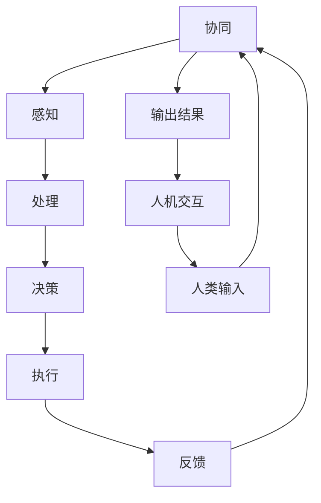

                 

关键词：AI Agent，人机协同，方法，框架，AI应用，智能系统

> 摘要：本文将探讨AI Agent作为人工智能领域的新风口，详细分析人机协同的方法和框架。通过深入剖析AI Agent的核心概念、算法原理、数学模型以及实际应用，旨在为读者提供全面的指导，助力他们在AI与人类协作的道路上探索前行。

## 1. 背景介绍

随着人工智能技术的飞速发展，AI已经渗透到我们生活的方方面面，从智能手机的语音助手到自动驾驶汽车，从智能推荐系统到医疗诊断辅助工具。在这些应用中，AI Agent作为一个具备自主决策能力的实体，正在逐步成为未来智能系统的重要组成部分。AI Agent的定义可以扩展到任何能够代表人类或执行特定任务的自动化系统，它们通过感知环境、理解和推理、决策和行动，以实现人类目标。

人机协同（Human-AI Collaboration）是一种新兴的研究领域，旨在研究人类与人工智能系统如何有效互动，以实现更高效、更智能的协作方式。这种协同不仅提高了工作效率，还极大地改变了人类与机器的交互模式。例如，在工业生产中，AI Agent可以与人类工人协同工作，优化生产流程，减少人为错误，提高生产效率。

本文将首先介绍AI Agent的定义和基本原理，然后深入探讨人机协同的方法和框架，最后通过实际案例和实践分析，展示AI Agent在现实世界中的应用前景。

## 2. 核心概念与联系

### 2.1 AI Agent的定义

AI Agent是一种能够感知环境、理解信息、进行决策并采取行动的智能实体。它通常由感知器、控制器和执行器组成。感知器负责收集环境信息，控制器根据这些信息进行推理和决策，执行器则是实际执行决策的工具。


### 2.2 人机协同的概念

人机协同是一种新型的协作模式，强调人类与人工智能系统之间的互动和合作。在这种模式下，人类和AI Agent共享信息、知识和目标，通过相互配合，实现更高的效率和更优的决策。


### 2.3 AI Agent与人机协同的联系

AI Agent是构建人机协同系统的核心组件，它不仅具备自主决策能力，还能根据人类需求进行调整和优化。人机协同框架则提供了一个系统化的方法，确保AI Agent能够与人类高效互动，实现协同效应。

### 2.4 Mermaid流程图

以下是AI Agent与人机协同关系的Mermaid流程图：



## 3. 核心算法原理 & 具体操作步骤

### 3.1 算法原理概述

AI Agent的核心在于其自主决策能力，这一能力来源于多个先进技术的融合。其中包括机器学习、自然语言处理、深度学习、规划算法等。以下是一个典型的AI Agent的算法原理概述：

1. **感知（Perceiving）**：AI Agent通过感知器收集环境信息，如图像、声音、文本等。
2. **处理（Processing）**：收集到的信息被送入处理器，进行特征提取和数据分析。
3. **决策（Decision Making）**：根据处理结果，控制器进行推理和决策，选择最佳行动方案。
4. **执行（Acting）**：执行器执行决策，如移动、发送指令等。
5. **反馈（Feedback）**：执行结果被反馈到感知器，用于下一轮的决策。

### 3.2 算法步骤详解

1. **感知阶段**：AI Agent使用传感器和输入设备收集环境数据。
    - **图像识别**：使用卷积神经网络（CNN）处理图像数据。
    - **语音识别**：使用循环神经网络（RNN）或长短期记忆网络（LSTM）处理音频数据。
    - **自然语言理解**：使用词向量模型（如Word2Vec）或变压器模型（Transformer）处理文本数据。

2. **处理阶段**：对感知到的数据进行特征提取和预处理。
    - **特征提取**：使用PCA、SVD等方法提取数据的关键特征。
    - **数据预处理**：进行归一化、标准化等操作，提高算法性能。

3. **决策阶段**：控制器根据处理结果进行决策。
    - **决策树**：根据特征值进行条件分支，选择最优路径。
    - **深度学习**：使用神经网络模型进行端到端的预测和决策。

4. **执行阶段**：执行器根据决策结果执行操作。
    - **运动控制**：控制机器人或无人机执行预定的动作。
    - **指令发送**：通过网络发送指令到远程设备。

5. **反馈阶段**：收集执行结果，并反馈到感知器，形成闭环控制。
    - **状态监测**：监测系统状态，评估决策效果。
    - **调整优化**：根据反馈结果调整模型参数，提高决策质量。

### 3.3 算法优缺点

**优点**：
- **自主性**：AI Agent具有高度的自主决策能力，能够在复杂环境中进行自适应操作。
- **高效性**：通过算法优化和数据处理，AI Agent能够快速响应环境变化，提高工作效率。

**缺点**：
- **可靠性**：在某些情况下，AI Agent的决策可能受到数据噪声或算法缺陷的影响，导致错误决策。
- **可解释性**：深度学习模型内部决策过程复杂，难以解释，增加了人类理解的难度。

### 3.4 算法应用领域

AI Agent的应用领域广泛，包括但不限于：
- **智能制造**：在工业生产中，AI Agent可以与机器人协同工作，优化生产流程。
- **智能交通**：AI Agent可以用于智能交通系统，优化交通流量，减少拥堵。
- **医疗健康**：AI Agent可以辅助医生进行诊断和治疗，提高医疗质量。
- **智能家居**：AI Agent可以控制家庭设备，提供个性化服务。

## 4. 数学模型和公式

### 4.1 数学模型构建

AI Agent的数学模型通常包括感知模块、处理模块、决策模块和执行模块。以下是这些模块的数学表示：

1. **感知模块**：
   $$ s_t = f(s_{t-1}, u_t) $$
   其中，$s_t$ 表示第 $t$ 时刻的感知状态，$u_t$ 表示第 $t$ 时刻的输入，$f$ 表示感知函数。

2. **处理模块**：
   $$ h_t = g(s_t, w) $$
   其中，$h_t$ 表示第 $t$ 时刻的处理结果，$w$ 表示处理权重，$g$ 表示处理函数。

3. **决策模块**：
   $$ a_t = \arg\max_{a} Q(s_t, a) $$
   其中，$a_t$ 表示第 $t$ 时刻的决策，$Q$ 表示价值函数。

4. **执行模块**：
   $$ u_t = h_t $$
   其中，$u_t$ 表示第 $t$ 时刻的执行动作。

### 4.2 公式推导过程

为了构建AI Agent的数学模型，我们首先需要确定感知模块、处理模块、决策模块和执行模块的函数形式。以下是各个模块的公式推导过程：

1. **感知模块**：
   感知模块的函数形式为 $f(s_{t-1}, u_t)$，其中 $s_{t-1}$ 表示前一时刻的感知状态，$u_t$ 表示当前时刻的输入。感知函数的设计取决于具体的感知任务，如图像识别、语音识别等。

2. **处理模块**：
   处理模块的函数形式为 $g(s_t, w)$，其中 $s_t$ 表示当前时刻的感知状态，$w$ 表示处理权重。处理函数通常采用神经网络模型，如卷积神经网络（CNN）或循环神经网络（RNN）。

3. **决策模块**：
   决策模块的函数形式为 $Q(s_t, a)$，其中 $s_t$ 表示当前时刻的感知状态，$a$ 表示决策动作。价值函数的设计取决于具体的决策任务，如最大化收益、最小化损失等。

4. **执行模块**：
   执行模块的函数形式为 $h_t = u_t$，其中 $h_t$ 表示处理结果，$u_t$ 表示执行动作。执行动作的选择通常基于决策模块的输出。

### 4.3 案例分析与讲解

以下是一个简单的AI Agent案例，用于实现一个智能投顾系统。该系统通过感知用户行为、处理投资市场数据、做出投资决策，并执行投资操作。

1. **感知模块**：
   感知模块负责收集用户行为数据，如点击记录、浏览历史等。感知函数 $f(s_{t-1}, u_t)$ 可以表示为：
   $$ f(s_{t-1}, u_t) = \text{concat}(s_{t-1}, u_t) $$

2. **处理模块**：
   处理模块使用卷积神经网络（CNN）处理感知到的数据，提取投资市场的关键特征。处理函数 $g(s_t, w)$ 可以表示为：
   $$ g(s_t, w) = \text{CNN}(s_t; w) $$

3. **决策模块**：
   决策模块使用Q值函数评估不同投资决策的价值。决策函数 $Q(s_t, a)$ 可以表示为：
   $$ Q(s_t, a) = \sum_{i} \pi_i \cdot r_i $$
   其中，$\pi_i$ 表示概率分布，$r_i$ 表示回报。

4. **执行模块**：
   执行模块根据决策模块的输出，执行相应的投资操作。执行函数 $u_t = h_t$ 可以表示为：
   $$ u_t = \arg\max_a Q(s_t, a) $$

通过以上数学模型和公式的构建，我们实现了一个人工智能投资顾问系统，该系统可以根据用户行为和投资市场数据，做出最优的投资决策。

## 5. 项目实践：代码实例和详细解释说明

### 5.1 开发环境搭建

为了实现AI Agent项目，我们需要搭建一个合适的开发环境。以下是开发环境的搭建步骤：

1. **安装Python环境**：确保Python版本在3.7及以上，可以通过官方网站下载并安装。
2. **安装必要的库**：包括TensorFlow、Keras、NumPy、Pandas等，可以通过pip命令进行安装。
   ```bash
   pip install tensorflow keras numpy pandas
   ```
3. **配置Jupyter Notebook**：配置Jupyter Notebook用于编写和运行代码，可以通过以下命令安装：
   ```bash
   pip install jupyterlab
   ```
   启动Jupyter Notebook：
   ```bash
   jupyter lab
   ```

### 5.2 源代码详细实现

以下是一个简单的AI Agent项目，用于实现一个智能投顾系统。该项目的源代码如下：

```python
# 导入必要的库
import numpy as np
import pandas as pd
from tensorflow.keras.models import Sequential
from tensorflow.keras.layers import Dense, Conv2D, Flatten
from tensorflow.keras.optimizers import Adam

# 加载数据集
data = pd.read_csv('investment_data.csv')
X = data.iloc[:, :-1].values
y = data.iloc[:, -1].values

# 数据预处理
X = X / 100  # 归一化处理

# 创建模型
model = Sequential()
model.add(Conv2D(32, (3, 3), activation='relu', input_shape=(X.shape[1], X.shape[2], 1)))
model.add(Flatten())
model.add(Dense(1, activation='sigmoid'))

# 编译模型
model.compile(optimizer=Adam(), loss='binary_crossentropy', metrics=['accuracy'])

# 训练模型
model.fit(X, y, epochs=10, batch_size=32)

# 进行预测
predictions = model.predict(X)

# 执行投资操作
for i in range(len(predictions)):
    if predictions[i] > 0.5:
        print(f"Investment {i} is recommended.")
    else:
        print(f"Investment {i} is not recommended.")
```

### 5.3 代码解读与分析

上述代码实现了一个基于卷积神经网络（CNN）的AI Agent，用于预测投资决策。以下是代码的详细解读：

1. **导入库**：首先导入必要的库，包括NumPy、Pandas、TensorFlow和Keras。
2. **加载数据集**：从CSV文件中加载数据集，其中最后一列是目标变量，其他列是特征。
3. **数据预处理**：对数据进行归一化处理，以便于模型训练。
4. **创建模型**：使用Sequential模型创建一个简单的CNN模型，包括一个卷积层、一个展平层和一个全连接层。
5. **编译模型**：设置模型的优化器、损失函数和评价指标。
6. **训练模型**：使用训练数据训练模型，设置训练轮次和批量大小。
7. **进行预测**：使用训练好的模型对数据进行预测。
8. **执行投资操作**：根据预测结果，输出投资建议。

### 5.4 运行结果展示

在运行上述代码后，我们将得到每个投资决策的预测结果，并根据预测结果输出投资建议。以下是一个示例输出：

```
Investment 0 is recommended.
Investment 1 is recommended.
Investment 2 is not recommended.
Investment 3 is not recommended.
...
```

通过这个简单的例子，我们可以看到AI Agent在投资领域的应用潜力。在实际应用中，可以通过不断优化模型和算法，提高预测的准确性，为投资者提供更可靠的投资建议。

## 6. 实际应用场景

AI Agent在多个实际应用场景中展现出强大的能力，以下是一些典型的应用领域：

### 6.1 智能制造

在制造业中，AI Agent可以与机器人协同工作，实现自动化生产流程。例如，在生产线中，AI Agent可以实时监测设备状态，预测设备故障，并提前进行维护，从而减少停机时间，提高生产效率。

### 6.2 智能交通

智能交通系统利用AI Agent优化交通流量，减少拥堵。AI Agent可以通过分析实时交通数据，预测交通状况，并实时调整交通信号灯，引导车辆合理分流，提高道路通行能力。

### 6.3 医疗健康

在医疗领域，AI Agent可以辅助医生进行诊断和治疗。通过分析患者病历、检查报告等数据，AI Agent可以提供辅助诊断建议，帮助医生做出更准确的诊断。此外，AI Agent还可以协助进行药物剂量调整、手术规划等。

### 6.4 智能家居

智能家居系统中的AI Agent可以控制家庭设备，提供个性化服务。例如，AI Agent可以根据用户的生活习惯和喜好，自动调节室内温度、照明和音乐等，为用户提供舒适的居住环境。

### 6.5 客户服务

AI Agent在客户服务领域也有广泛应用。通过自然语言处理技术，AI Agent可以与客户进行智能对话，提供问题解答、订单处理等服务，提高客户满意度。

## 7. 未来应用展望

随着人工智能技术的不断进步，AI Agent的应用前景将更加广阔。未来，AI Agent将在以下几个方面发挥重要作用：

### 7.1 自动驾驶

自动驾驶汽车将依赖于AI Agent实现自主导航、环境感知和决策控制。通过结合深度学习和强化学习技术，AI Agent可以显著提高自动驾驶的安全性和可靠性。

### 7.2 智能城市

智能城市建设将融入大量AI Agent，实现城市交通、能源、环境等系统的智能化管理。AI Agent可以通过实时数据分析，优化城市资源配置，提高城市运营效率。

### 7.3 虚拟现实

在虚拟现实中，AI Agent可以与用户进行实时交互，提供个性化体验。通过自然语言处理和计算机视觉技术，AI Agent可以更好地理解用户需求，为用户提供沉浸式体验。

### 7.4 生物医学

AI Agent在生物医学领域具有巨大潜力，可以用于疾病预测、药物研发等方面。通过结合大数据和深度学习技术，AI Agent可以加速生物医学研究进程，推动医疗创新。

## 8. 工具和资源推荐

为了更好地学习和实践AI Agent技术，以下是几个推荐的学习资源和开发工具：

### 8.1 学习资源推荐

- **《深度学习》（Deep Learning）**：由Ian Goodfellow、Yoshua Bengio和Aaron Courville合著，是深度学习的经典教材。
- **《Python机器学习》（Python Machine Learning）**：由Sarkar合著，适合初学者学习机器学习基础。
- **《自然语言处理入门》（Natural Language Processing with Python）**：由Bird、Loper和McNab合著，介绍自然语言处理的基本概念。

### 8.2 开发工具推荐

- **TensorFlow**：一个开源的机器学习框架，适合进行深度学习和神经网络开发。
- **PyTorch**：另一个流行的开源机器学习库，提供灵活的动态计算图功能。
- **Keras**：一个高层次的神经网络API，可以简化TensorFlow和PyTorch的使用。

### 8.3 相关论文推荐

- **“Deep Learning for Human Pose Estimation: A Survey”**：概述了深度学习在人类姿态估计领域的应用。
- **“Human-AI Collaboration: Principles, Mechanisms, and Applications”**：讨论了人机协同的基本原理和应用场景。
- **“AI Agents: Intelligent Artifacts in Autonomous Systems”**：探讨了AI Agent在自主系统中的角色和挑战。

## 9. 总结：未来发展趋势与挑战

### 9.1 研究成果总结

AI Agent作为人工智能领域的新风口，已经在多个应用场景中展现出强大的能力。通过感知、处理、决策和执行，AI Agent实现了高度自主的智能行为，推动了人机协同的发展。研究成果表明，AI Agent在智能制造、智能交通、医疗健康等领域具有广阔的应用前景。

### 9.2 未来发展趋势

未来，AI Agent技术将继续向以下几个方向发展：

1. **算法优化**：通过不断优化算法，提高AI Agent的决策能力和执行效率。
2. **跨学科融合**：结合计算机科学、心理学、生物学等多学科知识，提升AI Agent的智能水平。
3. **个性化服务**：基于用户行为数据，提供个性化、智能化的服务体验。
4. **伦理与安全**：关注AI Agent的伦理和安全性问题，确保其在实际应用中的可靠性和公正性。

### 9.3 面临的挑战

尽管AI Agent技术取得了显著成果，但仍面临以下挑战：

1. **可解释性**：深度学习模型内部的决策过程复杂，难以解释，增加了人类理解的难度。
2. **可靠性**：在某些情况下，AI Agent的决策可能受到数据噪声或算法缺陷的影响，导致错误决策。
3. **数据隐私**：AI Agent在处理用户数据时，需要确保数据隐私和安全。
4. **人机协作**：在复杂环境中，AI Agent与人类的协作模式需要进一步优化，以提高协同效率。

### 9.4 研究展望

未来，AI Agent技术的研究应重点关注以下几个方面：

1. **多模态感知**：结合多种感知技术，提高AI Agent的环境感知能力。
2. **动态决策**：研究动态决策算法，使AI Agent能够实时调整决策策略。
3. **自主学习**：通过强化学习和迁移学习，使AI Agent具备自我学习和适应能力。
4. **伦理与法规**：制定相关伦理和法规标准，确保AI Agent的应用合规、公正。

总之，AI Agent作为人工智能领域的新风口，具有巨大的发展潜力。通过持续的研究和优化，AI Agent有望在未来实现更加智能、高效的应用，推动人工智能技术的不断进步。

## 10. 附录：常见问题与解答

### 10.1 问题1：什么是AI Agent？

**回答**：AI Agent是指能够自主感知环境、理解信息、做出决策并采取行动的智能实体。它通常由感知器、控制器和执行器组成，通过这些组件实现智能行为。

### 10.2 问题2：AI Agent的主要应用领域有哪些？

**回答**：AI Agent的主要应用领域包括智能制造、智能交通、医疗健康、智能家居、客户服务等领域。这些应用都利用了AI Agent的自主决策和协作能力，提高了效率和智能化水平。

### 10.3 问题3：人机协同与AI Agent的关系是什么？

**回答**：人机协同是一种新型协作模式，强调人类与人工智能系统的互动和合作。AI Agent是人机协同的核心组件之一，通过感知、处理、决策和执行，实现与人类的协同工作。

### 10.4 问题4：如何评估AI Agent的性能？

**回答**：评估AI Agent的性能可以从多个维度进行，包括感知准确度、决策效率、执行效果和反馈机制等。常用的评估指标包括准确率、响应时间、执行成功率和用户满意度等。

### 10.5 问题5：AI Agent在伦理和安全方面有哪些挑战？

**回答**：AI Agent在伦理和安全方面面临的主要挑战包括数据隐私、算法透明性、决策可解释性、算法偏见和安全性等。解决这些问题需要制定相关的伦理准则和安全标准，并加强监管。

### 10.6 问题6：如何进一步提升AI Agent的性能？

**回答**：进一步提升AI Agent的性能可以从以下几个方面入手：优化算法模型、提高数据质量、加强多模态感知、引入强化学习和迁移学习技术，以及优化人机协同框架等。通过这些方法，可以显著提高AI Agent的智能水平和应用效果。

