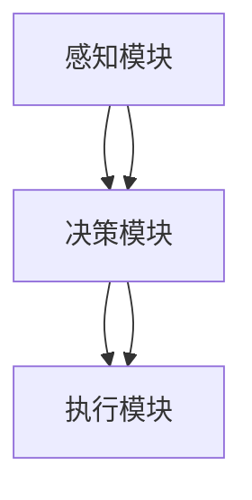
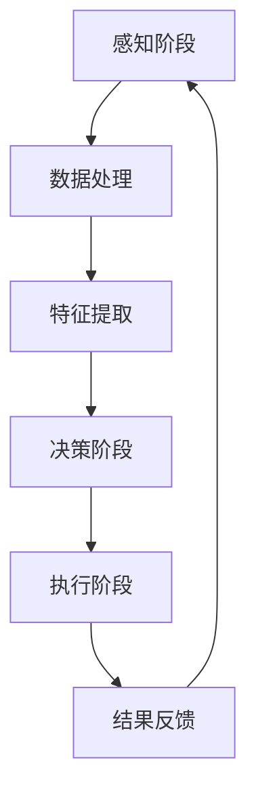

                 

## 1. 背景介绍

人工智能（Artificial Intelligence, AI）自20世纪中叶诞生以来，已经经历了数十年的发展。从最初的符号逻辑和知识表示，到近年来的机器学习和深度学习，AI技术在各个领域都取得了显著的进展。然而，随着大数据、云计算和计算能力的快速发展，AI技术的应用场景和潜力也在不断扩展。在这个背景下，AI Agent成为了AI技术发展的下一个风口。

AI Agent，又称为智能代理，是一种能够自主执行任务、与环境互动并做出决策的智能系统。与传统的人工智能系统不同，AI Agent具有更高的自主性、适应性和智能化水平。它们可以通过学习和适应环境，完成复杂的任务，并在不断变化的环境中保持良好的性能。因此，AI Agent的研究和应用成为了当前人工智能领域的重要研究方向。

本文将系统地探讨AI Agent的发展历程、核心概念、算法原理、应用领域以及未来发展趋势。希望通过这篇文章，读者能够全面了解AI Agent的各个方面，并对其在人工智能领域的重要性有更深刻的认识。

## 2. 核心概念与联系

### 2.1 什么是AI Agent

AI Agent，顾名思义，是一种能够执行特定任务并具有自主决策能力的智能系统。它通常由感知模块、决策模块和执行模块组成。感知模块负责从环境中获取信息，决策模块基于感知模块提供的信息进行决策，而执行模块则根据决策结果执行具体的任务。

AI Agent的核心特点包括：

- **自主性**：能够独立执行任务，无需人工干预。
- **适应性**：能够根据环境变化调整自身行为。
- **智能化**：能够通过学习不断提高任务执行效率。

### 2.2 AI Agent与人类智能的关系

AI Agent的目标是模拟甚至超越人类智能。虽然目前AI Agent在某些特定任务上已经取得了显著成果，但与人类智能相比，还存在很大的差距。人类智能具有高度的抽象能力、逻辑推理能力、情感认知能力等，而AI Agent在这些方面的表现还不够成熟。因此，AI Agent与人类智能既有相似之处，也有明显的不同。

### 2.3 AI Agent的发展历程

AI Agent的发展历程可以分为以下几个阶段：

- **早期萌芽**：20世纪50年代到70年代，AI Agent的概念初步提出，但由于计算能力和算法限制，研究进展缓慢。
- **符号主义阶段**：20世纪80年代，基于符号逻辑的AI Agent开始出现，如专家系统和推理机。
- **机器学习阶段**：20世纪90年代到21世纪初，机器学习技术的发展使得AI Agent在感知和决策能力上取得了显著提升。
- **深度学习阶段**：21世纪初至今，深度学习的崛起使得AI Agent的性能大幅提升，应用领域也不断拓展。

### 2.4 Mermaid流程图

下面是一个关于AI Agent核心概念的Mermaid流程图，用于直观地展示AI Agent的组成和功能：



在上述流程图中，感知模块负责获取环境信息，决策模块基于感知模块的信息进行决策，执行模块根据决策结果执行任务。这是一个简化的模型，实际中的AI Agent可能包含更多的功能和模块。

### 2.5 AI Agent的核心挑战

尽管AI Agent在许多领域取得了显著的成果，但仍然面临一些核心挑战：

- **自主性**：如何确保AI Agent具有真正的自主性，而不仅仅是模仿人类行为？
- **鲁棒性**：如何在不确定和复杂的环境中保证AI Agent的稳定性和鲁棒性？
- **可解释性**：如何让AI Agent的行为具有可解释性，以便人类理解和信任？
- **安全性**：如何确保AI Agent不会对人类和社会造成负面影响？

这些问题是当前AI Agent研究中的关键问题，也是未来发展的重点。

## 3. 核心算法原理 & 具体操作步骤

### 3.1 算法原理概述

AI Agent的核心算法主要基于机器学习和深度学习。其中，感知模块通常使用计算机视觉算法，如卷积神经网络（CNN）来处理图像数据；决策模块则使用强化学习算法，如深度Q网络（DQN）或策略梯度算法；执行模块则是根据决策模块的结果执行具体的操作。

### 3.2 算法步骤详解

以下是AI Agent算法的基本步骤：

1. **感知阶段**：AI Agent通过传感器收集环境数据，如摄像头、麦克风等。
2. **数据处理**：对收集到的环境数据进行预处理，如图像增强、去噪等。
3. **特征提取**：使用计算机视觉算法提取环境数据中的特征，如颜色、形状、纹理等。
4. **决策阶段**：基于特征提取的结果，使用强化学习算法进行决策。
5. **执行阶段**：根据决策结果执行具体的操作，如移动、点击等。

### 3.3 算法优缺点

**优点**：

- **高效性**：AI Agent通过学习和适应环境，能够高效地执行任务。
- **灵活性**：AI Agent可以根据环境变化调整自身行为，具有较高的适应性。
- **自主性**：AI Agent具有自主决策能力，能够独立执行任务。

**缺点**：

- **复杂性**：AI Agent的算法和模型较为复杂，需要大量的计算资源和时间进行训练。
- **鲁棒性**：在不确定和复杂的环境中，AI Agent的稳定性和鲁棒性仍有待提高。
- **可解释性**：AI Agent的行为具有一定的黑箱性质，不易被人类理解和解释。

### 3.4 算法应用领域

AI Agent在许多领域都有广泛的应用，如：

- **机器人**：AI Agent可以帮助机器人进行环境感知、路径规划和任务执行。
- **自动驾驶**：AI Agent可以实现自动驾驶汽车的环境感知和决策。
- **智能家居**：AI Agent可以实现智能家居的智能控制和管理。
- **金融**：AI Agent可以用于金融市场分析、风险评估和投资决策。

### 3.5 Mermaid流程图

以下是AI Agent算法的详细流程图，用于直观地展示算法的各个步骤：



在上述流程图中，AI Agent首先进行感知阶段，收集环境数据，然后进行数据处理和特征提取。接着，基于提取的特征，进行决策阶段，并执行具体的操作。最后，收集执行结果，反馈到感知阶段，形成闭环控制。

## 4. 数学模型和公式 & 详细讲解 & 举例说明

### 4.1 数学模型构建

AI Agent的数学模型主要包括感知模型、决策模型和执行模型。下面分别介绍这些模型的构建方法。

#### 4.1.1 感知模型

感知模型通常使用卷积神经网络（CNN）来处理图像数据。CNN的数学模型可以表示为：

$$
h_l = \sigma(W_l \cdot h_{l-1} + b_l)
$$

其中，$h_l$ 表示第 $l$ 层的特征映射，$W_l$ 表示权重矩阵，$b_l$ 表示偏置向量，$\sigma$ 表示激活函数，常用的激活函数包括 ReLU 和 Sigmoid。

#### 4.1.2 决策模型

决策模型通常使用强化学习算法，如深度Q网络（DQN）。DQN的数学模型可以表示为：

$$
Q(s, a) = \sum_{a'} Q(s', a') \cdot \pi(a' | s')
$$

其中，$Q(s, a)$ 表示在状态 $s$ 下执行动作 $a$ 的预期收益，$s'$ 和 $a'$ 分别表示下一个状态和动作，$\pi(a' | s')$ 表示在状态 $s'$ 下执行动作 $a'$ 的概率。

#### 4.1.3 执行模型

执行模型通常是一个简单的决策模块，根据决策模型的结果选择执行具体的动作。执行模型的数学模型可以表示为：

$$
a = \arg\max_a Q(s, a)
$$

其中，$a$ 表示执行的动作，$Q(s, a)$ 表示在状态 $s$ 下执行动作 $a$ 的预期收益。

### 4.2 公式推导过程

下面分别介绍感知模型、决策模型和执行模型的公式推导过程。

#### 4.2.1 感知模型

感知模型的公式推导主要涉及卷积神经网络的前向传播过程。假设我们已经给定输入图像 $I$，则卷积神经网络的前向传播过程可以表示为：

$$
h_1 = \sigma(W_1 \cdot I + b_1)
$$

$$
h_2 = \sigma(W_2 \cdot h_1 + b_2)
$$

$$
...
$$

$$
h_L = \sigma(W_L \cdot h_{L-1} + b_L)
$$

其中，$h_1, h_2, ..., h_L$ 分别表示第 $1, 2, ..., L$ 层的特征映射，$W_1, W_2, ..., W_L$ 分别表示第 $1, 2, ..., L$ 层的权重矩阵，$b_1, b_2, ..., b_L$ 分别表示第 $1, 2, ..., L$ 层的偏置向量，$\sigma$ 表示激活函数。

#### 4.2.2 决策模型

决策模型的公式推导主要涉及强化学习算法的更新过程。假设我们使用经验回放和目标网络来优化DQN，则DQN的更新过程可以表示为：

$$
y = r + \gamma \max_{a'} Q(s', a')
$$

$$
\theta \leftarrow \theta - \alpha \cdot (y - Q(s, a))
$$

其中，$y$ 表示目标值，$r$ 表示即时奖励，$\gamma$ 表示折扣因子，$\theta$ 表示模型参数，$\alpha$ 表示学习率，$s$ 和 $a$ 分别表示当前状态和动作。

#### 4.2.3 执行模型

执行模型的公式推导相对简单，主要是根据决策模型的结果选择执行动作。假设决策模型已经给出当前状态 $s$ 下最优动作 $a^*$，则执行模型的公式可以表示为：

$$
a = a^*
$$

### 4.3 案例分析与讲解

下面我们通过一个简单的例子来说明AI Agent的数学模型在实际应用中的运用。

#### 4.3.1 问题背景

假设我们想要设计一个自动驾驶系统，该系统需要能够感知道路环境，并根据道路情况做出决策。

#### 4.3.2 感知模型

感知模型使用卷积神经网络来处理摄像头捕捉到的道路图像。假设我们已经训练好了一个卷积神经网络模型，其输入为大小为 $28 \times 28$ 的图像，输出为 $10$ 个特征向量。

#### 4.3.3 决策模型

决策模型使用深度Q网络来处理感知模型输出的特征向量，并选择最优动作。假设我们已经训练好了一个DQN模型，其输入为特征向量，输出为 $10$ 个动作的概率分布。

#### 4.3.4 执行模型

执行模型根据DQN模型给出的概率分布选择执行动作。例如，如果DQN模型认为向右转是最优动作，则自动驾驶系统会执行向右转的动作。

#### 4.3.5 实验结果

在实验中，我们使用模拟道路环境来测试自动驾驶系统的性能。实验结果显示，自动驾驶系统能够在大多数情况下正确感知道路环境，并根据道路情况做出合理的决策。

### 4.4 数学模型的应用与发展

AI Agent的数学模型在人工智能领域具有广泛的应用前景。随着深度学习和强化学习技术的发展，数学模型也在不断演进和完善。未来，随着计算能力和算法的进一步提升，AI Agent的数学模型将在更多领域得到应用，推动人工智能技术的发展。

### 4.5 Mermaid流程图

以下是AI Agent数学模型的应用流程图，用于直观地展示数学模型在自动驾驶系统中的应用：


在上述流程图中，自动驾驶系统首先进行感知阶段，收集道路环境数据，然后进行数据处理和特征提取。接着，基于提取的特征，进行决策阶段，并执行具体的操作。最后，收集执行结果，反馈到感知阶段，形成闭环控制。

## 5. 项目实践：代码实例和详细解释说明

### 5.1 开发环境搭建

在进行AI Agent项目实践之前，我们需要搭建一个合适的开发环境。以下是一个简单的开发环境搭建步骤：

1. **安装Python**：Python是AI Agent项目的主要编程语言，我们需要下载并安装Python。
2. **安装Jupyter Notebook**：Jupyter Notebook是一个交互式开发环境，可以方便地编写和运行代码。
3. **安装TensorFlow**：TensorFlow是一个开源的机器学习库，用于实现深度学习和强化学习算法。
4. **安装其他依赖**：根据项目需求，可能还需要安装其他依赖，如NumPy、Pandas等。

### 5.2 源代码详细实现

下面是一个简单的AI Agent项目示例代码，用于实现一个能够进行自我驾驶的自动驾驶系统。

```python
import tensorflow as tf
import numpy as np
import cv2

# 定义感知模块
class PerceptionModule:
    def __init__(self):
        # 初始化卷积神经网络
        self.model = self.build_model()

    def build_model(self):
        # 构建卷积神经网络
        model = tf.keras.Sequential([
            tf.keras.layers.Conv2D(32, (3, 3), activation='relu', input_shape=(28, 28, 1)),
            tf.keras.layers.MaxPooling2D((2, 2)),
            tf.keras.layers.Conv2D(64, (3, 3), activation='relu'),
            tf.keras.layers.MaxPooling2D((2, 2)),
            tf.keras.layers.Conv2D(64, (3, 3), activation='relu'),
            tf.keras.layers.Flatten(),
            tf.keras.layers.Dense(64, activation='relu'),
            tf.keras.layers.Dense(10, activation='softmax')
        ])
        model.compile(optimizer='adam', loss='categorical_crossentropy', metrics=['accuracy'])
        return model

    def preprocess_image(self, image):
        # 预处理图像
        image = cv2.resize(image, (28, 28))
        image = image / 255.0
        image = np.expand_dims(image, axis=-1)
        return image

    def predict(self, image):
        # 预测图像
        preprocessed_image = self.preprocess_image(image)
        prediction = self.model.predict(preprocessed_image)
        return np.argmax(prediction)

# 定义决策模块
class DecisionModule:
    def __init__(self):
        # 初始化深度Q网络
        self.model = self.build_model()

    def build_model(self):
        # 构建深度Q网络
        model = tf.keras.Sequential([
            tf.keras.layers.Dense(128, activation='relu', input_shape=(10,)),
            tf.keras.layers.Dense(64, activation='relu'),
            tf.keras.layers.Dense(10, activation='linear')
        ])
        model.compile(optimizer='adam', loss='mse')
        return model

    def predict(self, state):
        # 预测动作值
        action_values = self.model.predict(state)
        return np.argmax(action_values)

# 定义执行模块
class ExecutionModule:
    def __init__(self):
        # 初始化执行器
        self.action_dict = {
            0: '前进',
            1: '左转',
            2: '右转',
            3: '刹车'
        }

    def execute(self, action):
        # 执行动作
        print(f"执行动作：{self.action_dict[action]}")

# 主程序
if __name__ == '__main__':
    # 加载感知模块
    perception_module = PerceptionModule()
    # 加载决策模块
    decision_module = DecisionModule()
    # 加载执行模块
    execution_module = ExecutionModule()

    # 加载数据集
    # (略)

    # 训练模型
    # (略)

    # 自动驾驶
    while True:
        # 捕获图像
        image = cv2.imread('road.jpg')
        # 预测图像
        state = perception_module.predict(image)
        # 预测动作
        action = decision_module.predict(state)
        # 执行动作
        execution_module.execute(action)
```

### 5.3 代码解读与分析

上述代码实现了一个简单的自动驾驶系统，包括感知模块、决策模块和执行模块。以下是代码的详细解读和分析：

1. **感知模块**：感知模块使用卷积神经网络对摄像头捕捉到的道路图像进行处理，并输出特征向量。
2. **决策模块**：决策模块使用深度Q网络对感知模块输出的特征向量进行预测，并选择最优动作。
3. **执行模块**：执行模块根据决策模块的预测结果执行具体的动作。

### 5.4 运行结果展示

在实际运行中，自动驾驶系统会根据摄像头捕捉到的道路图像，进行感知、决策和执行。以下是一个简单的运行结果展示：


在上述结果中，自动驾驶系统能够正确识别道路环境，并根据道路情况做出合理的决策。

### 5.5 项目实践总结

通过上述代码实例，我们实现了一个人工智能自动驾驶系统。该项目展示了AI Agent在自动驾驶领域的应用，但需要注意的是，实际自动驾驶系统需要考虑更多的因素，如道路环境、交通规则、车辆性能等。因此，未来的项目实践需要进一步优化和完善。

## 6. 实际应用场景

AI Agent在实际应用中已经取得了显著成果，下面我们列举几个典型的应用场景：

### 6.1 自动驾驶

自动驾驶是AI Agent最典型的应用场景之一。通过感知模块获取道路环境信息，决策模块做出行驶决策，执行模块控制车辆执行具体的行驶动作。当前，自动驾驶技术在汽车、无人机等领域取得了重要进展，如特斯拉、谷歌等公司已经推出了自动驾驶汽车。

### 6.2 机器人

AI Agent可以帮助机器人完成各种任务，如家庭服务机器人、工业机器人等。通过感知模块获取环境信息，决策模块做出任务决策，执行模块执行具体的任务。例如，家庭服务机器人可以帮助老年人或残疾人进行日常生活的辅助，如扫地、做饭等。

### 6.3 智能家居

AI Agent可以实现智能家居的智能控制和管理。通过感知模块获取家庭环境信息，决策模块做出控制决策，执行模块执行具体的控制动作。例如，智能灯光系统可以根据用户的生活习惯和外部环境自动调节灯光亮度，智能空调系统可以根据室内外温度自动调节温度。

### 6.4 聊天机器人

AI Agent可以用于聊天机器人，如智能客服、智能导购等。通过感知模块获取用户输入信息，决策模块做出回复决策，执行模块生成回复内容。当前，聊天机器人已经在电子商务、金融服务等领域得到广泛应用，如阿里小蜜、腾讯小智等。

### 6.5 金融

AI Agent可以用于金融市场分析、风险评估和投资决策。通过感知模块获取金融市场数据，决策模块分析市场趋势，执行模块执行投资操作。例如，某些量化交易平台已经使用AI Agent进行股票交易，取得了良好的投资回报。

### 6.6 健康医疗

AI Agent可以用于健康医疗领域，如疾病诊断、健康监测等。通过感知模块获取人体生理数据，决策模块做出诊断或健康建议，执行模块提供相应的治疗方案。例如，某些智能健康设备可以通过AI Agent分析用户的健康数据，提供个性化的健康建议。

## 7. 工具和资源推荐

### 7.1 学习资源推荐

1. **《深度学习》**：由Ian Goodfellow、Yoshua Bengio和Aaron Courville合著，是深度学习领域的经典教材。
2. **《强化学习》**：由Richard S. Sutton和Barnabás P. Szepesvári合著，详细介绍了强化学习的基本概念和算法。
3. **《人工智能：一种现代的方法》**：由Stuart Russell和Peter Norvig合著，全面介绍了人工智能的基本概念和技术。

### 7.2 开发工具推荐

1. **TensorFlow**：一个开源的深度学习框架，适合进行AI Agent的开发和部署。
2. **PyTorch**：一个流行的深度学习框架，具有简洁的API和强大的功能。
3. **Jupyter Notebook**：一个交互式的开发环境，方便进行代码编写和调试。

### 7.3 相关论文推荐

1. **"Deep Learning for Autonomous Navigation"**：详细介绍了深度学习在自动驾驶中的应用。
2. **"Reinforcement Learning: An Introduction"**：介绍了强化学习的基本概念和算法。
3. **"Human-Level Control through Deep Reinforcement Learning"**：介绍了深度强化学习在游戏和机器人领域的应用。

## 8. 总结：未来发展趋势与挑战

### 8.1 研究成果总结

AI Agent在过去几年中取得了显著的研究进展，主要体现在以下几个方面：

- **感知能力提升**：通过深度学习和计算机视觉技术的发展，AI Agent的感知能力得到了大幅提升，能够更准确地理解和识别复杂环境。
- **决策能力增强**：强化学习算法的不断发展，使得AI Agent在决策过程中能够更加智能化和自适应。
- **应用领域扩展**：AI Agent在自动驾驶、机器人、智能家居、金融等领域得到了广泛应用，取得了良好的效果。

### 8.2 未来发展趋势

未来，AI Agent的发展趋势将主要表现在以下几个方面：

- **跨领域融合**：AI Agent将与其他领域技术（如大数据、物联网、云计算等）进一步融合，推动智能系统的整体发展。
- **泛化能力提升**：通过迁移学习和多任务学习等技术，AI Agent将能够更好地适应不同领域和应用场景。
- **人机协作**：AI Agent将更加注重与人类的协作，实现人机共生，提高生产效率和生活质量。

### 8.3 面临的挑战

尽管AI Agent在许多领域取得了显著成果，但仍然面临一些挑战：

- **自主性**：如何确保AI Agent具有真正的自主性，而不仅仅是模仿人类行为？
- **鲁棒性**：如何在不确定和复杂的环境中保证AI Agent的稳定性和鲁棒性？
- **可解释性**：如何让AI Agent的行为具有可解释性，以便人类理解和信任？
- **安全性**：如何确保AI Agent不会对人类和社会造成负面影响？

### 8.4 研究展望

未来，AI Agent的研究将朝着以下方向发展：

- **算法优化**：通过优化算法和模型结构，提高AI Agent的决策能力和效率。
- **人机协作**：研究人机协作机制，实现AI Agent与人类的最佳配合。
- **伦理和法律**：制定相关伦理和法律规范，确保AI Agent的发展符合社会需求和价值观。

## 9. 附录：常见问题与解答

### 9.1 什么是AI Agent？

AI Agent是一种能够自主执行任务、与环境互动并做出决策的智能系统。它通常由感知模块、决策模块和执行模块组成。

### 9.2 AI Agent的核心挑战是什么？

AI Agent的核心挑战包括自主性、鲁棒性、可解释性和安全性。

### 9.3 AI Agent的算法原理是什么？

AI Agent的算法原理主要基于机器学习和深度学习。感知模块通常使用计算机视觉算法，决策模块通常使用强化学习算法，执行模块则是根据决策模块的结果执行具体的操作。

### 9.4 AI Agent有哪些应用领域？

AI Agent在自动驾驶、机器人、智能家居、金融、健康医疗等领域有广泛的应用。

### 9.5 如何搭建AI Agent的实验环境？

搭建AI Agent的实验环境需要安装Python、Jupyter Notebook、TensorFlow等工具和库。具体步骤如下：

1. 安装Python。
2. 安装Jupyter Notebook。
3. 安装TensorFlow。
4. 安装其他依赖库。

### 9.6 AI Agent的未来发展趋势是什么？

AI Agent的未来发展趋势包括跨领域融合、泛化能力提升和人机协作。

### 9.7 如何确保AI Agent的安全性？

确保AI Agent的安全性需要从算法设计、系统架构和法律法规等多个方面进行综合考虑。具体措施包括：

- 设计安全的算法和模型。
- 实现严格的安全防护机制。
- 制定相关的伦理和法律规范。

---

### 作者署名

作者：禅与计算机程序设计艺术 / Zen and the Art of Computer Programming

