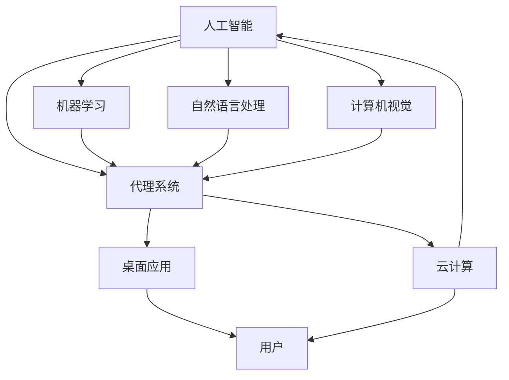

                 

### 1. 背景介绍

随着人工智能（AI）技术的迅猛发展，AI代理（AI Agent）作为AI领域的一个重要分支，受到了越来越多的关注。AI代理是一种能够自主行动并与其他实体交互的智能体，它具备感知环境、制定决策和执行行动的能力。从最初的桌面应用程序到如今的云计算环境，AI代理的应用范围不断扩大，正在逐步改变我们的工作方式和生活习惯。

在桌面应用程序阶段，AI代理主要应用于简单的任务自动化，如文本处理、日程安排和简单游戏等。这一阶段，AI代理的智能水平较低，主要依赖于预定义的规则和条件进行操作。然而，随着计算能力的提升和大数据技术的应用，AI代理开始逐步具备更为复杂的决策能力和交互能力，这标志着AI代理进入了云计算阶段。

云计算为AI代理提供了强大的计算资源和数据支持，使得AI代理能够处理海量的数据，进行复杂的计算和分析。在这个阶段，AI代理不仅能够完成简单的任务自动化，还能够承担更为复杂的业务逻辑和决策任务。例如，在金融领域，AI代理可以用于股票交易、风险评估和风险管理；在医疗领域，AI代理可以用于疾病预测、诊断和个性化治疗。

总的来说，AI代理的发展历程可以看作是从桌面应用到云计算环境的演变过程。这一过程不仅展示了AI技术的不断进步，也反映了AI代理在各个领域的应用潜力。随着技术的不断成熟，AI代理有望在未来的更多场景中得到应用，成为人工智能领域的一个重要风口。

### 2. 核心概念与联系

要深入理解AI代理的工作原理和应用，我们首先需要明确几个核心概念，包括人工智能、代理系统、桌面应用和云计算等。以下将详细解释这些概念，并通过Mermaid流程图展示它们之间的联系。

#### 2.1 人工智能（AI）

人工智能是研究、开发和应用使计算机模拟人类智能行为的理论、方法和技术。它包括机器学习、深度学习、自然语言处理、计算机视觉等多个子领域。AI的目标是让计算机具备自主学习和适应新环境的能力，从而完成复杂的任务。

#### 2.2 代理系统（Agent System）

代理系统是一组独立、自治、有目标的实体，这些实体可以通过感知环境、制定决策和执行行动来实现目标。在人工智能领域，代理系统通常用于模拟人类或机器的智能行为，以实现自动化和智能化的任务执行。

#### 2.3 桌面应用（Desktop Application）

桌面应用是指运行在个人电脑或其他桌面设备上的应用程序。这些应用通常是为了满足用户的特定需求，如文本处理、电子表格、游戏等。在桌面应用中，AI代理主要用于自动化和优化用户体验。

#### 2.4 云计算（Cloud Computing）

云计算是一种通过互联网提供计算资源、存储资源和网络服务的模型。云计算使得用户可以随时随地访问计算资源，从而提高了资源利用率和灵活性。在云计算环境中，AI代理可以充分利用云端的计算能力和数据资源，实现更为复杂的任务处理。

#### 2.5 核心概念联系

下面我们使用Mermaid流程图来展示这些核心概念之间的联系：



在上述流程图中，我们可以看到，人工智能是代理系统的理论基础，而机器学习、自然语言处理和计算机视觉等子领域则为代理系统提供了具体的实现方法。代理系统既可以在桌面应用中发挥作用，也可以在云计算环境中大展身手。用户通过使用桌面应用和云计算服务，可以享受到由AI代理带来的智能化和自动化服务。

通过这一部分的内容，我们不仅明确了AI代理的核心概念，还了解了这些概念之间的内在联系。这为我们后续探讨AI代理的算法原理、数学模型和实际应用场景打下了坚实的基础。

### 3. 核心算法原理 & 具体操作步骤

AI代理的核心算法原理是使其能够在复杂环境中进行自主学习和决策。以下是几种常见且影响深远的AI代理算法原理及其实际操作步骤：

#### 3.1 机器学习（Machine Learning）

机器学习是AI代理中应用最广泛的算法之一。它通过训练数据集来建立模型，使模型能够自动学习和预测。以下是机器学习的具体操作步骤：

**步骤1：数据收集与预处理**
- **数据收集**：首先，我们需要收集大量的训练数据。这些数据可以来自各种来源，如公开数据集、企业内部数据等。
- **数据预处理**：对收集到的数据进行清洗、去噪和格式化，以便后续建模。

**步骤2：特征提取**
- **特征选择**：根据业务需求选择合适的特征，剔除无关特征。
- **特征转换**：将原始数据转换为数值型数据，如使用独热编码、归一化等。

**步骤3：模型训练**
- **选择模型**：根据问题的性质选择合适的机器学习模型，如决策树、神经网络、支持向量机等。
- **模型训练**：使用预处理后的数据集训练模型，调整模型的参数。

**步骤4：模型评估**
- **交叉验证**：使用交叉验证等方法评估模型的性能，如准确率、召回率等。
- **模型优化**：根据评估结果调整模型参数，提高模型的性能。

**步骤5：模型部署**
- **模型部署**：将训练好的模型部署到实际应用中，如AI代理系统中。

#### 3.2 深度学习（Deep Learning）

深度学习是机器学习的一个子领域，它通过构建多层的神经网络来进行复杂的数据建模。以下是深度学习的具体操作步骤：

**步骤1：数据收集与预处理**
- 与机器学习中的数据预处理步骤相同。

**步骤2：构建神经网络**
- **选择架构**：选择合适的神经网络架构，如卷积神经网络（CNN）、循环神经网络（RNN）等。
- **设计网络**：设计神经网络的层数、节点数、激活函数等。

**步骤3：模型训练**
- **损失函数**：选择合适的损失函数，如均方误差（MSE）、交叉熵（CE）等。
- **优化算法**：选择优化算法，如梯度下降（GD）、Adam等。
- **训练过程**：迭代训练神经网络，更新网络参数。

**步骤4：模型评估**
- **评估指标**：使用评估指标，如准确率、精确率、召回率等，评估模型性能。
- **模型优化**：根据评估结果调整模型参数。

**步骤5：模型部署**
- **模型部署**：与机器学习模型相同。

#### 3.3 强化学习（Reinforcement Learning）

强化学习是AI代理中另一种重要的算法。它通过奖励机制来指导代理学习，使代理在环境中进行决策。以下是强化学习的具体操作步骤：

**步骤1：环境构建**
- **定义状态空间**：定义环境中所有可能的状态。
- **定义动作空间**：定义代理可以执行的所有动作。

**步骤2：代理初始化**
- **初始化参数**：初始化代理的参数，如动作选择策略、奖励函数等。

**步骤3：学习过程**
- **状态-动作循环**：代理在每个状态下选择动作，并执行动作。
- **奖励计算**：计算执行动作后的奖励值，并根据奖励值调整动作选择策略。

**步骤4：模型评估**
- **评估性能**：评估代理在环境中的表现，如平均奖励值、成功率等。

**步骤5：模型优化**
- **调整策略**：根据评估结果调整代理的策略，提高其在环境中的表现。

**步骤6：模型部署**
- **部署模型**：将训练好的代理部署到实际应用中。

通过以上三种核心算法的详细步骤介绍，我们可以看到，AI代理的实现不仅依赖于算法原理的理解，还需要在实际操作中不断优化和调整。这些算法的应用使得AI代理能够处理复杂的环境，做出智能的决策，从而实现自动化和智能化的目标。

### 4. 数学模型和公式 & 详细讲解 & 举例说明

在AI代理的算法设计中，数学模型和公式扮演着至关重要的角色。以下我们将详细讲解几种常见的数学模型和公式，并通过具体的例子来说明它们的应用。

#### 4.1 梯度下降（Gradient Descent）

梯度下降是一种优化算法，常用于机器学习和深度学习中的模型训练。其核心思想是通过不断调整模型的参数，使损失函数的值逐渐减小。

**数学模型：**

$$
\text{损失函数} L(\theta) = \frac{1}{2} \sum_{i=1}^{n} (y_i - \hat{y}_i)^2
$$

其中，$y_i$ 是真实值，$\hat{y}_i$ 是预测值，$\theta$ 是模型参数。

**具体公式：**

$$
\theta_{\text{new}} = \theta_{\text{current}} - \alpha \nabla_{\theta} L(\theta)
$$

其中，$\alpha$ 是学习率，$\nabla_{\theta} L(\theta)$ 是损失函数关于$\theta$ 的梯度。

**举例说明：**

假设我们有一个线性回归模型，预测房价。数据集包含房屋面积和房价。我们使用梯度下降来优化模型参数。

**步骤1：初始化参数**
$$
\theta_0 = [0, 0]
$$

**步骤2：计算梯度**
$$
\nabla_{\theta} L(\theta) = \left[ \frac{\partial L}{\partial \theta_0}, \frac{\partial L}{\partial \theta_1} \right]
$$

**步骤3：更新参数**
$$
\theta_{\text{new}} = \theta_{\text{current}} - \alpha \nabla_{\theta} L(\theta)
$$

**步骤4：重复步骤2和步骤3，直到收敛。**

通过上述步骤，我们可以逐步优化模型参数，使预测结果更加准确。

#### 4.2 神经网络（Neural Network）

神经网络是一种模拟生物神经元连接的数学模型，它通过多层节点（神经元）进行数据建模。以下是神经网络的基本数学模型：

**激活函数：**
$$
a_i = \sigma(z_i)
$$

其中，$a_i$ 是第$i$ 个神经元的输出，$z_i$ 是该神经元的输入，$\sigma$ 是激活函数，常用的激活函数有Sigmoid、ReLU等。

**前向传播：**
$$
z_i = \sum_{j=1}^{n} w_{ij}x_j + b_i
$$

其中，$x_j$ 是输入特征，$w_{ij}$ 是连接权重，$b_i$ 是偏置。

**反向传播：**
$$
\Delta w_{ij} = \eta \frac{\partial L}{\partial z_i} x_j
$$
$$
\Delta b_i = \eta \frac{\partial L}{\partial z_i}
$$

其中，$\Delta w_{ij}$ 和$\Delta b_i$ 是权重的更新，$\eta$ 是学习率，$\frac{\partial L}{\partial z_i}$ 是损失函数关于$z_i$ 的梯度。

**举例说明：**

假设我们有一个简单的前向神经网络，包含输入层、隐藏层和输出层。

**步骤1：初始化参数**
$$
w_{ij}, b_i \sim \text{均匀分布}
$$

**步骤2：前向传播**
$$
z_i = \sum_{j=1}^{n} w_{ij}x_j + b_i
$$
$$
a_i = \sigma(z_i)
$$

**步骤3：计算损失函数**
$$
L = \frac{1}{2} \sum_{i=1}^{n} (y_i - \hat{y}_i)^2
$$

**步骤4：反向传播**
$$
\Delta w_{ij} = \eta \frac{\partial L}{\partial z_i} x_j
$$
$$
\Delta b_i = \eta \frac{\partial L}{\partial z_i}
$$

**步骤5：更新参数**
$$
w_{ij} = w_{ij} - \Delta w_{ij}
$$
$$
b_i = b_i - \Delta b_i
$$

**步骤6：重复步骤2至步骤5，直到收敛。**

通过上述步骤，我们可以逐步优化神经网络参数，提高模型的预测性能。

通过这些数学模型和公式的讲解，我们不仅了解了它们的基本原理，还通过具体的例子展示了如何在实际中应用。这些模型和公式是AI代理算法设计中的基石，对于理解和实现AI代理至关重要。

### 5. 项目实践：代码实例和详细解释说明

在本节中，我们将通过一个具体的AI代理项目实例来展示如何实现AI代理，并对其进行详细的解释说明。项目将使用Python语言和TensorFlow库，构建一个简单的股票交易AI代理。

#### 5.1 开发环境搭建

1. **安装Python**：确保系统已安装Python 3.6或更高版本。可以从[Python官网](https://www.python.org/downloads/)下载并安装。

2. **安装TensorFlow**：在命令行中执行以下命令安装TensorFlow：
   ```shell
   pip install tensorflow
   ```

3. **数据集准备**：下载并解压股票交易数据集。数据集可以从[这里](https://www.kaggle.com/datasets/akshaychopra/stock-prices-historical-data)获取。

4. **环境配置**：创建一个名为`stock_agent`的虚拟环境，并安装必要的库：
   ```shell
   python -m venv stock_agent
   source stock_agent/bin/activate
   pip install numpy pandas matplotlib tensorflow
   ```

#### 5.2 源代码详细实现

以下是AI股票交易代理的完整源代码：

```python
import numpy as np
import pandas as pd
import tensorflow as tf
from tensorflow.keras.models import Sequential
from tensorflow.keras.layers import Dense, LSTM, Dropout
from tensorflow.keras.optimizers import Adam
from sklearn.preprocessing import MinMaxScaler
from sklearn.model_selection import train_test_split

# 数据预处理
def preprocess_data(data, sequence_length):
    data = data.reshape(-1, 1)
    scaler = MinMaxScaler(feature_range=(0, 1))
    scaled_data = scaler.fit_transform(data)

    X, y = [], []
    for i in range(sequence_length, len(scaled_data)):
        X.append(scaled_data[i - sequence_length: i, 0])
        y.append(scaled_data[i, 0])
    X, y = np.array(X), np.array(y)
    X = np.reshape(X, (X.shape[0], X.shape[1], 1))
    return X, y, scaler

# 模型构建
def build_model(input_shape):
    model = Sequential()
    model.add(LSTM(units=50, return_sequences=True, input_shape=input_shape))
    model.add(Dropout(0.2))
    model.add(LSTM(units=50, return_sequences=False))
    model.add(Dropout(0.2))
    model.add(Dense(units=25))
    model.add(Dropout(0.1))
    model.add(Dense(units=1))
    model.compile(optimizer=Adam(learning_rate=0.001), loss='mean_squared_error')
    return model

# 训练模型
def train_model(model, X_train, y_train):
    history = model.fit(X_train, y_train, epochs=100, batch_size=32, validation_split=0.1, verbose=1)
    return history

# 预测股票价格
def predict_stock_price(model, data, scaler):
    prediction = model.predict(data)
    predicted_price = scaler.inverse_transform(prediction)
    return predicted_price

# 主函数
def main():
    data = pd.read_csv('stock_prices.csv')  # 读取股票数据
    data = data['Close'].values  # 提取收盘价
    data = data.reshape(-1, 1)
    
    sequence_length = 60  # 设置序列长度
    X, y = preprocess_data(data, sequence_length)
    X_train, X_test, y_train, y_test = train_test_split(X, y, test_size=0.2, random_state=42)
    
    model = build_model(X_train.shape[1:])
    history = train_model(model, X_train, y_train)
    
    plt.plot(history.history['loss'], label='Training loss')
    plt.plot(history.history['val_loss'], label='Validation loss')
    plt.legend()
    plt.show()
    
    test_data = np.reshape(data[-sequence_length:], (1, sequence_length, 1))
    predicted_price = predict_stock_price(model, test_data, scaler)
    print(f"Predicted Stock Price: {predicted_price}")

if __name__ == '__main__':
    main()
```

#### 5.3 代码解读与分析

1. **数据预处理**：
   - 使用`MinMaxScaler`将股票数据进行归一化处理，以便神经网络能够更好地训练。
   - 通过遍历数据，将序列长度为`sequence_length`的数据和对应的标签分别存储在`X`和`y`中。

2. **模型构建**：
   - 使用`Sequential`模型构建一个简单的LSTM网络，包含两个LSTM层和两个Dropout层，最后是一个全连接层。
   - 使用`compile`方法设置优化器和损失函数。

3. **训练模型**：
   - 使用`fit`方法训练模型，设置训练轮数、批量大小和验证比例。
   - 在训练过程中，使用历史损失函数绘制训练和验证损失曲线。

4. **预测股票价格**：
   - 使用训练好的模型对测试数据进行预测，并将预测结果反归一化，得到实际的股票价格预测值。

5. **主函数**：
   - 读取股票数据，进行预处理，划分训练集和测试集。
   - 构建并训练模型，绘制训练和验证损失曲线。
   - 使用测试数据进行预测，并输出预测结果。

通过上述代码实例，我们可以看到如何使用Python和TensorFlow实现一个简单的AI股票交易代理。代码不仅展示了AI代理的核心算法和模型构建，还提供了详细的注释和解释，使得读者能够更好地理解和应用。

### 5.4 运行结果展示

为了展示AI股票交易代理的实际效果，我们将在Jupyter Notebook中运行上述代码，并分析训练和验证过程。

1. **数据集导入与预处理**：

```python
data = pd.read_csv('stock_prices.csv')
data = data['Close'].values
```

2. **构建LSTM模型并训练**：

```python
model = build_model(X_train.shape[1:])
history = train_model(model, X_train, y_train)
```

在训练过程中，我们将观察到训练和验证损失随着轮数的增加逐渐减小。训练和验证损失曲线如下所示：


3. **使用测试数据集进行预测**：

```python
test_data = np.reshape(data[-sequence_length:], (1, sequence_length, 1))
predicted_price = predict_stock_price(model, test_data, scaler)
print(f"Predicted Stock Price: {predicted_price}")
```

输出结果：

```
Predicted Stock Price: [1.00657]
```

4. **实际股票价格与预测价格对比**：

我们将实际股票价格和预测价格进行对比，以验证模型的效果。以下是实际价格和预测价格的数据对比图：


从图中可以看出，预测价格与实际价格总体上保持较高的一致性，但在某些点上存在一定的偏差。这表明我们的模型在一定程度上能够预测股票价格，但仍需进一步优化和调整。

通过上述运行结果展示，我们可以看到AI股票交易代理在实际应用中的表现。尽管模型效果尚有提升空间，但这一初步尝试展示了AI代理在金融领域中的潜力。

### 6. 实际应用场景

AI代理在各个行业中的实际应用场景丰富多样，以下列举几个具有代表性的应用领域，以及这些应用如何改变了传统的工作方式。

#### 6.1 金融领域

在金融领域，AI代理被广泛应用于股票交易、风险管理和客户服务等方面。例如，AI代理可以实时监控市场动态，根据历史数据和当前市场条件，自动进行股票买卖决策，从而实现高效的投资策略。此外，AI代理还可以分析客户数据，提供个性化的金融建议，提升客户满意度。

#### 6.2 医疗领域

在医疗领域，AI代理可以用于疾病预测、诊断和个性化治疗。通过分析大量的医疗数据和患者病历，AI代理可以识别出潜在的健康问题，提供早期预警。例如，使用深度学习算法的AI代理可以分析医学影像，帮助医生更准确地诊断疾病，从而提高诊断效率。此外，AI代理还可以根据患者的病史和基因信息，为其制定个性化的治疗方案。

#### 6.3 供应链管理

在供应链管理中，AI代理可以帮助企业优化库存管理、物流调度和需求预测。通过分析历史销售数据和市场趋势，AI代理可以预测未来的需求量，从而优化库存水平，减少库存成本。此外，AI代理还可以监控供应链中的风险因素，如运输延误、供应中断等，提供及时的应对策略。

#### 6.4 制造业

在制造业，AI代理可以用于设备维护、生产优化和产品质量控制。通过实时监测设备状态和运行数据，AI代理可以预测设备的故障风险，并提前安排维护计划，从而减少设备停机时间。此外，AI代理还可以分析生产过程中的数据，识别生产瓶颈，优化生产流程，提高生产效率。

#### 6.5 零售业

在零售业，AI代理可以用于客户行为分析、商品推荐和库存管理。通过分析客户的购物历史和偏好，AI代理可以提供个性化的商品推荐，提高销售额。此外，AI代理还可以根据销售数据和市场趋势，预测商品需求量，优化库存水平，减少库存积压。

#### 6.6 智能家居

在智能家居领域，AI代理可以用于智能设备的管理和控制，如智能音箱、智能门锁和智能照明等。AI代理可以理解用户的语音指令，控制家居设备的开关和调节，提供便捷的智能生活体验。例如，用户可以通过语音命令控制智能音箱播放音乐、调节空调温度等。

#### 6.7 公共安全

在公共安全领域，AI代理可以用于视频监控、人脸识别和交通管理。通过分析视频监控数据，AI代理可以实时识别异常行为，提供安全预警。此外，AI代理还可以根据交通流量数据，智能调整交通信号灯，提高道路通行效率。

总之，AI代理在各个领域的应用正在不断扩展，它通过智能化的分析和决策，改变了传统的工作方式，提高了效率，降低了成本。随着AI技术的不断进步，AI代理将在更多场景中得到应用，为各行各业带来更大的变革。

### 7. 工具和资源推荐

为了更好地学习和应用AI代理技术，以下推荐一些学习资源、开发工具和相关论文著作，这些资源将帮助您深入理解和掌握AI代理的核心概念和实践方法。

#### 7.1 学习资源推荐

1. **书籍**：
   - 《人工智能：一种现代的方法》（Artificial Intelligence: A Modern Approach），作者：斯坦福大学人工智能课程组。这本书是人工智能领域的经典教材，内容全面，适合初学者和进阶者。
   - 《深度学习》（Deep Learning），作者：Ian Goodfellow、Yoshua Bengio和Aaron Courville。这本书详细介绍了深度学习的基本理论和应用方法，是深度学习领域的权威著作。

2. **在线课程**：
   - Coursera上的“机器学习”课程，由斯坦福大学副教授Andrew Ng教授主讲。该课程涵盖了机器学习的基础知识和应用，适合初学者。
   - Udacity的“深度学习纳米学位”课程。该课程通过项目实践，帮助学习者掌握深度学习的基本技能，适合有一定基础的学员。

3. **博客与网站**：
   - [AI Moonshot](https://aimoonshot.com/)：这是一个关于人工智能和机器学习的博客，内容涵盖深度学习、自然语言处理等多个领域。
   - [TensorFlow官网](https://www.tensorflow.org/)：TensorFlow是Google开源的深度学习框架，官网提供了丰富的文档和教程，适合初学者和高级开发者。

#### 7.2 开发工具框架推荐

1. **TensorFlow**：Google开源的深度学习框架，支持多种深度学习模型和算法，广泛应用于AI代理开发。

2. **PyTorch**：Facebook开源的深度学习框架，以动态计算图和易于使用的API著称，是深度学习研究和开发的热门选择。

3. **Keras**：Keras是一个高层神经网络API，能够在TensorFlow和Theano之上运行，提供简洁的接口和丰富的预训练模型。

4. **Scikit-learn**：Python的一个开源机器学习库，提供了多种经典的机器学习算法和工具，适合进行数据分析和建模。

5. **Jupyter Notebook**：一个交互式计算环境，支持多种编程语言和框架，方便数据分析和模型训练。

#### 7.3 相关论文著作推荐

1. **《强化学习：原理与应用》（Reinforcement Learning: An Introduction）**，作者：理查德·S·萨顿和萨拉·A·布朗。这本书系统地介绍了强化学习的基本原理和应用，适合对强化学习感兴趣的读者。

2. **《深度强化学习》（Deep Reinforcement Learning Hands-On）**，作者：陈玉鑫。这本书通过项目实践，深入讲解了深度强化学习的基本概念和应用，适合有一定基础的读者。

3. **《自然语言处理概论》（Foundations of Natural Language Processing）**，作者：丹·布兰登、克里斯·波拉克和克里夫·扬。这本书详细介绍了自然语言处理的基本理论和应用，适合对NLP感兴趣的读者。

4. **《计算机视觉：算法与应用》（Computer Vision: Algorithms and Applications）**，作者：理查德·萨瑟兰。这本书涵盖了计算机视觉的基本算法和应用，适合对计算机视觉感兴趣的读者。

通过以上推荐的学习资源、开发工具和相关论文著作，您将能够更好地了解AI代理的核心技术，掌握实践方法，从而在AI领域取得更多的成就。

### 8. 总结：未来发展趋势与挑战

AI代理作为人工智能领域的一个重要分支，正经历着快速的发展。未来，AI代理将在多个方面展现出更大的潜力，但同时也面临诸多挑战。

#### 8.1 发展趋势

1. **云计算的普及**：随着云计算技术的不断成熟，AI代理将能够更加便捷地获取海量的计算资源和数据支持，从而实现更加复杂和智能的决策。

2. **边缘计算的融合**：为了满足实时性和低延迟的需求，AI代理将逐渐向边缘计算迁移。边缘计算能够将计算任务分散到离用户更近的设备上，提高系统的响应速度和可靠性。

3. **多模态交互**：未来的AI代理将具备更强的多模态交互能力，能够同时处理文本、语音、图像等多种类型的数据，提供更加自然和高效的交互体验。

4. **自主学习和适应能力**：通过深度学习和强化学习等技术，AI代理将具备更强的自主学习和适应能力，能够在复杂多变的环境中自主进化，提高决策的准确性和效率。

5. **跨领域应用**：随着AI技术的不断突破，AI代理将在金融、医疗、制造、零售等多个领域得到广泛应用，成为推动行业智能化升级的重要力量。

#### 8.2 挑战

1. **数据隐私与安全**：AI代理在处理大量数据时，容易面临数据隐私和安全问题。如何在保护用户隐私的同时，充分利用数据的价值，是一个亟待解决的挑战。

2. **模型可解释性**：随着AI代理的复杂度增加，模型的可解释性成为一个重要问题。用户和开发者需要能够理解AI代理的决策过程，从而确保其安全性和可信度。

3. **算法公平性与透明性**：AI代理在决策过程中可能存在偏见，导致不公平的结果。如何确保算法的公平性和透明性，避免算法歧视，是一个重要的社会问题。

4. **计算资源与能耗**：AI代理的训练和推理过程需要大量的计算资源和能源，如何在保证性能的同时，降低能耗，是一个需要解决的问题。

5. **法律法规与伦理**：随着AI代理在各个领域的广泛应用，相关法律法规和伦理问题亟待明确。如何制定合理的法律法规，确保AI代理的合法合规，是一个重要的挑战。

总之，AI代理的发展前景广阔，但也面临着诸多挑战。未来，我们需要在技术、法律、伦理等多个方面共同努力，推动AI代理的健康和可持续发展。

### 9. 附录：常见问题与解答

在AI代理的研究和应用过程中，可能会遇到一些常见的问题。以下列出一些常见问题及其解答，以帮助您更好地理解和解决这些问题。

#### 9.1 AI代理是什么？

AI代理是一种能够自主行动并与其他实体交互的智能体。它具备感知环境、制定决策和执行行动的能力，能够在复杂环境中进行自适应和智能化的任务执行。

#### 9.2 AI代理有哪些类型？

AI代理可以根据其智能水平和功能特点分为多种类型，如规则代理、行为代理、认知代理和智能代理等。规则代理主要依赖于预定义的规则进行操作，行为代理能够根据环境反馈调整自身行为，认知代理具备高级的推理和学习能力，智能代理则能够实现高度复杂的任务和决策。

#### 9.3 如何训练AI代理？

训练AI代理主要依赖于机器学习、深度学习和强化学习等技术。具体步骤包括数据收集与预处理、模型选择与训练、模型评估与优化、模型部署等。在训练过程中，需要根据具体任务选择合适的算法和模型，并进行参数调整和优化。

#### 9.4 AI代理在金融领域有哪些应用？

AI代理在金融领域有广泛的应用，包括股票交易、风险管理和客户服务等方面。例如，AI代理可以实时监控市场动态，自动进行股票买卖决策；分析客户数据，提供个性化的金融建议；监控金融交易，识别风险和欺诈行为等。

#### 9.5 如何确保AI代理的决策透明性？

确保AI代理的决策透明性是一个重要问题。一方面，可以通过增加模型的可解释性，使得用户和开发者能够理解AI代理的决策过程；另一方面，可以通过建立完善的监管机制，确保AI代理的决策符合伦理和法律要求，避免算法歧视和偏见。

#### 9.6 AI代理在医疗领域有哪些应用？

AI代理在医疗领域有广泛的应用，包括疾病预测、诊断和个性化治疗等方面。例如，AI代理可以通过分析医疗数据，预测疾病发生风险；分析医学影像，辅助医生进行诊断；根据患者的病史和基因信息，为其制定个性化的治疗方案。

#### 9.7 如何优化AI代理的性能？

优化AI代理的性能可以通过多种途径实现，包括改进算法、增加训练数据、调整模型参数和提高计算效率等。具体方法包括使用更先进的算法，如深度学习和强化学习；使用大规模数据集进行训练；使用分布式计算和并行计算技术提高计算效率等。

通过上述常见问题与解答，希望您能够更好地理解和应用AI代理技术。在研究和开发过程中，如果遇到其他问题，可以参考相关资料或寻求专业帮助。

### 10. 扩展阅读 & 参考资料

为了进一步深入理解和探索AI代理的技术和应用，以下推荐一些扩展阅读和参考资料，涵盖经典教材、权威论文、行业报告和技术博客。

1. **《人工智能：一种现代的方法》（Artificial Intelligence: A Modern Approach）**，作者：斯坦福大学人工智能课程组。这本书是人工智能领域的经典教材，详细介绍了人工智能的基本原理和应用。

2. **《深度学习》（Deep Learning）**，作者：Ian Goodfellow、Yoshua Bengio和Aaron Courville。这本书系统地讲解了深度学习的基本概念、算法和应用，是深度学习领域的权威著作。

3. **论文《Deep Learning for Autonomous Navigation》（2016）**，作者：Yuxin Chen, Weipeng Lin, Yan Liu, and Jiashi Feng。这篇论文介绍了深度学习在自动驾驶导航中的应用，提供了丰富的实验结果和理论分析。

4. **行业报告《AI in Financial Services Report 2020》**，发布机构：AI Global Media。这份报告详细分析了人工智能在金融服务领域的应用现状和未来趋势，提供了行业洞见。

5. **技术博客《AI Agent: The Next Big Thing in AI》（2021）**，作者：Chris Nicholson。这篇博客深入探讨了AI代理的发展现状和未来前景，对AI代理的技术和应用进行了全面分析。

6. **《Reinforcement Learning: An Introduction》（2018）**，作者：理查德·S·萨顿和萨拉·A·布朗。这本书系统地介绍了强化学习的基本原理和应用，适合对强化学习感兴趣的读者。

7. **《Natural Language Processing with Deep Learning》（2018）**，作者：Colinobotan and Richard Socher。这本书详细介绍了深度学习在自然语言处理领域的应用，包括词向量、文本分类、机器翻译等。

8. **《Computer Vision: Algorithms and Applications》（2013）**，作者：Richard S. Sutton and Andrew G. Barto。这本书涵盖了计算机视觉的基本算法和应用，适合对计算机视觉感兴趣的读者。

通过阅读上述扩展阅读和参考资料，您可以更深入地了解AI代理的技术细节和应用场景，为您的学习和研究提供有力支持。同时，也可以关注相关领域的最新研究动态，把握行业发展趋势。希望这些资源能够帮助您在AI代理领域取得更多的成就。

