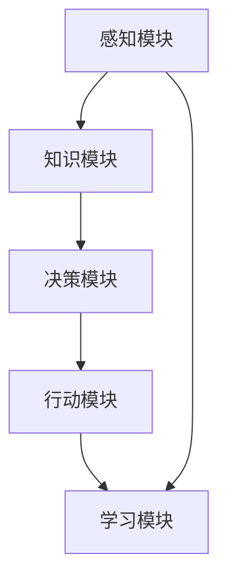
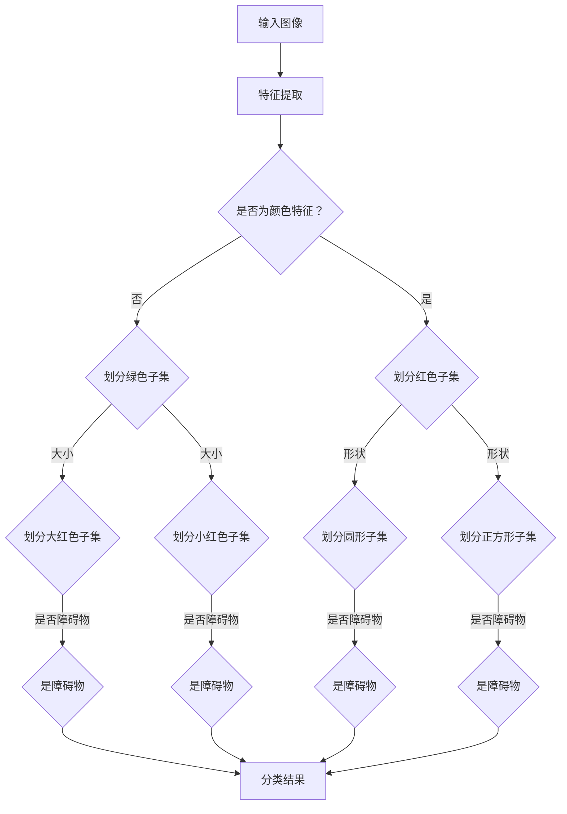
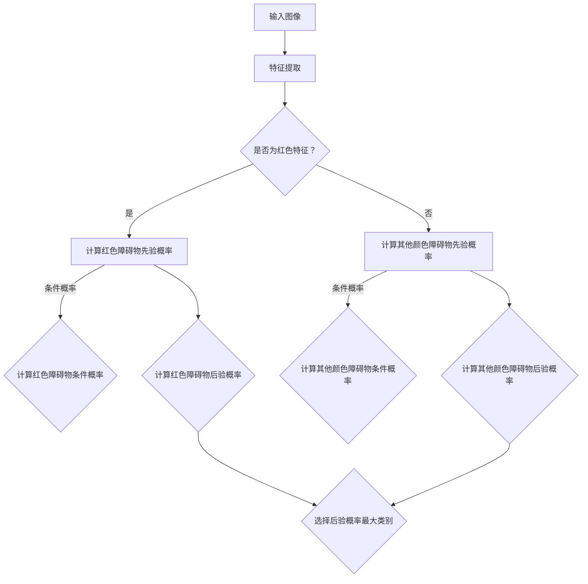

                 

### 1. 背景介绍

AI Agent，也称为人工智能代理，是人工智能领域中一种能够执行特定任务、具备自主决策能力的智能系统。近年来，随着计算机科学和人工智能技术的快速发展，AI Agent的应用场景日益广泛，从智能家居、智能医疗到自动驾驶、金融风控等领域，都展现出了强大的潜力和价值。

本篇文章将围绕AI Agent的核心概念、典型应用案例和商业价值进行探讨。首先，我们将介绍AI Agent的基本概念及其与传统机器学习算法的区别。接着，我们将详细解析AI Agent的核心算法原理，包括其工作流程、决策机制和实现方法。随后，通过具体的项目实践，我们将展示如何开发和实现一个简单的AI Agent，并提供详细的代码实例和解读。

此外，文章还将深入探讨AI Agent在实际应用场景中的表现，分析其在各个领域的优势和应用前景。在此基础上，我们将推荐一些学习资源和开发工具，以帮助读者更好地理解和应用AI Agent技术。最后，文章将对AI Agent的未来发展趋势和面临的挑战进行展望，并提出一些建议和思考。

总之，本文旨在为广大读者提供一个全面而深入的AI Agent学习指南，帮助大家了解这一新兴领域的核心知识，掌握实际应用技能，并为未来的发展做好准备。

### 2. 核心概念与联系

#### AI Agent的基本定义

AI Agent，即人工智能代理，是一种具有自主决策能力的智能实体，能够在给定环境和目标下，通过感知、理解和推理，采取适当行动以达成目标。AI Agent的核心特征包括自主性、反应性、预动性和适应性。自主性指的是Agent能够独立做出决策，而不依赖外部指令；反应性表示Agent能够对环境中的变化迅速响应；预动性则是指Agent能够预见未来的环境变化，并提前采取行动；适应性意味着Agent能够在面对不同环境和任务时，调整自身行为以实现最佳效果。

#### AI Agent与传统机器学习算法的区别

传统机器学习算法，如决策树、支持向量机和神经网络，主要是基于历史数据和学习模型来预测或分类。这些算法通常需要大量的数据训练，并且依赖人类专家设计特征和模型结构。相比之下，AI Agent具有以下显著区别：

1. **自主决策能力**：AI Agent能够根据环境信息和预定的目标自主做出决策，而不仅仅是执行预设的规则或算法。
2. **环境感知与适应**：AI Agent能够通过传感器感知环境，理解当前状态，并根据环境变化调整自身行为。
3. **实时决策**：AI Agent可以在动态环境中实时做出决策，而不需要预先获取大量数据或依赖静态模型。
4. **目标导向**：AI Agent具有明确的目标和任务，能够在实现目标的过程中不断优化自身行为。

#### AI Agent的结构与功能模块

一个典型的AI Agent通常由以下几个关键模块组成：

1. **感知模块**：负责收集和解释环境中的信息，如通过摄像头、麦克风或传感器获取数据。
2. **知识模块**：存储和管理Agent所需的知识和信息，如地图、规则和先验知识。
3. **决策模块**：基于感知模块提供的信息和知识模块中的数据，使用算法和策略进行决策，如马尔可夫决策过程（MDP）或深度学习。
4. **行动模块**：根据决策模块的决策结果，执行具体的动作，如移动机器人、发送网络请求等。
5. **学习模块**：利用从环境中获得的反馈信息，不断优化自身的决策和行为。

#### Mermaid 流程图（节点中不要有括号、逗号等特殊字符）

下面是一个简单的Mermaid流程图，展示了AI Agent的基本结构和工作流程：



- **感知模块（A）**：感知模块负责从环境中收集信息，如图像、声音和传感器数据。
- **知识模块（B）**：知识模块存储和管理Agent所需的信息，包括地图、先验知识和规则。
- **决策模块（C）**：决策模块基于感知模块提供的信息和知识模块中的数据，使用算法和策略进行决策。
- **行动模块（D）**：行动模块根据决策模块的决策结果，执行具体的动作。
- **学习模块（E）**：学习模块利用从环境中获得的反馈信息，不断优化自身的决策和行为。

通过这种结构化的设计，AI Agent能够实现灵活、智能和高效的环境适应和任务执行。

### 3. 核心算法原理 & 具体操作步骤

#### 决策树算法的基本原理

决策树（Decision Tree）是一种广泛使用的机器学习算法，其基本原理是通过一系列条件分支来对数据进行分类或回归。每个节点表示一个特征，每个分支表示该特征的不同取值，叶子节点表示最终分类结果。

在AI Agent中，决策树算法可以被用于实现分类任务，例如，根据环境中的感知数据对目标进行分类。决策树的关键步骤如下：

1. **特征选择**：选择一个最佳特征进行划分，通常使用信息增益（Information Gain）或基尼系数（Gini Index）作为评价标准。
2. **划分数据**：根据选定的特征，将数据划分为不同的子集，每个子集对应一个分支。
3. **递归构建**：对每个子集，重复上述步骤，构建更细分的子树，直到满足停止条件（如最大深度、最小节点大小等）。
4. **分类决策**：将新的样本输入决策树，从根节点开始，根据分支的取值，逐层向下直到叶子节点，得到最终分类结果。

#### 决策树在AI Agent中的应用实例

假设我们有一个简单的AI Agent，其任务是根据环境中的图像数据对障碍物进行分类。以下是一个具体的决策树算法实现步骤：

1. **特征选择**：首先，我们从图像数据中提取特征，如颜色、形状、大小等。使用信息增益作为评价标准，选择一个最佳特征进行划分。
2. **划分数据**：根据最佳特征，将图像数据划分为不同的子集。例如，如果选择颜色作为特征，可以将图像划分为红色、绿色、蓝色等子集。
3. **递归构建**：对每个子集，重复上述步骤，构建更细分的子树。例如，对红色子集，可以进一步划分为不同大小的红色障碍物。
4. **分类决策**：将新的图像数据输入决策树，从根节点开始，根据分支的取值，逐层向下，直到叶子节点，得到最终分类结果。

下面是一个简化的Mermaid流程图，展示了决策树在AI Agent中的应用：



通过这个例子，我们可以看到决策树如何将环境中的图像数据转化为具体的障碍物分类结果。

#### 贝叶斯分类算法的基本原理

贝叶斯分类（Bayesian Classification）是一种基于贝叶斯定理的机器学习算法，其基本原理是通过计算每个类别出现的概率，然后选择概率最大的类别作为分类结果。

在AI Agent中，贝叶斯分类算法可以被用于实现多类分类任务，例如，根据环境中的感知数据对多种障碍物进行分类。贝叶斯分类的关键步骤如下：

1. **先验概率**：计算每个类别的先验概率，即在没有任何其他信息的情况下，每个类别出现的概率。
2. **条件概率**：计算每个类别在给定特征条件下的条件概率。
3. **后验概率**：使用贝叶斯定理计算每个类别的后验概率，即综合考虑先验概率和条件概率后，每个类别成为最终分类结果的概率。
4. **分类决策**：选择后验概率最大的类别作为分类结果。

#### 贝叶斯分类算法在AI Agent中的应用实例

假设我们有一个简单的AI Agent，其任务是根据环境中的图像数据对障碍物进行多类分类。以下是一个具体的贝叶斯分类算法实现步骤：

1. **先验概率**：首先，我们从训练数据中计算每个类别的先验概率。例如，如果训练数据中有80%的图像是障碍物，那么障碍物的先验概率为0.8。
2. **条件概率**：接着，我们计算每个类别在给定特征条件下的条件概率。例如，如果红色障碍物的条件概率为0.9，那么红色图像被分类为障碍物的概率为0.9。
3. **后验概率**：使用贝叶斯定理计算每个类别的后验概率。例如，如果红色图像的先验概率为0.1，红色障碍物的条件概率为0.9，那么红色图像被分类为障碍物的后验概率为0.09。
4. **分类决策**：选择后验概率最大的类别作为分类结果。例如，如果红色图像的后验概率最大，则将红色图像分类为障碍物。

下面是一个简化的Mermaid流程图，展示了贝叶斯分类算法在AI Agent中的应用：



通过这个例子，我们可以看到贝叶斯分类算法如何将环境中的图像数据转化为具体的障碍物分类结果。

#### 决策树与贝叶斯分类的比较

决策树和贝叶斯分类都是常用的机器学习算法，在AI Agent中都有广泛应用。它们的主要区别在于：

1. **原理不同**：决策树基于特征划分和分类结果，而贝叶斯分类基于概率计算和先验知识。
2. **适用场景**：决策树适用于特征明确、分类结果较为固定的场景，而贝叶斯分类适用于特征复杂、分类结果不确定的场景。
3. **计算复杂度**：决策树的计算复杂度较低，适用于大规模数据集，而贝叶斯分类的计算复杂度较高，适用于小规模数据集。

总之，选择哪种算法取决于具体的任务需求和数据特点。

### 4. 数学模型和公式 & 详细讲解 & 举例说明

在AI Agent的构建过程中，数学模型和公式是不可或缺的工具，用于描述和优化Agent的行为。以下将详细讲解两个关键数学模型：马尔可夫决策过程（MDP）和动态规划（Dynamic Programming），并提供具体的公式和实例说明。

#### 马尔可夫决策过程（MDP）

马尔可夫决策过程（MDP）是一个用于解决决策问题的数学模型，广泛应用于人工智能和优化领域。MDP的基本概念包括状态（State）、动作（Action）、奖励（Reward）和概率转移矩阵（Transition Probability Matrix）。

**1. 公式定义：**

- 状态（\(S\)）：系统当前所处的状态。
- 动作（\(A\)）：Agent可以采取的动作集合。
- 奖励（\(R(s, a)\)）：在状态\(s\)下采取动作\(a\)所获得的即时奖励。
- 概率转移矩阵（\(P(s', s | a)\)）：在状态\(s\)下采取动作\(a\)后，转移到状态\(s'\)的概率。

MDP的目标是选择一个最优策略，使得Agent在一系列状态中采取行动，以最大化累积奖励。

**2. 公式：**

MDP的主要公式是贝尔曼方程（Bellman Equation），用于求解最优策略：

$$V^*(s) = \max_{a \in A} [R(s, a) + \gamma \sum_{s'} P(s', s | a) V^*(s')]$$

其中：
- \(V^*(s)\)：在状态\(s\)下的最优价值函数。
- \(\gamma\)：折现因子，用于平衡即时奖励和未来奖励。
- \(A\)：动作集合。

**3. 举例说明：**

假设有一个简单的AI Agent，它在一个网格世界中移动，每个位置都有一个奖励值。Agent的目标是找到一条路径，从起点到达终点，并最大化总奖励。

状态空间：\(S = \{(0, 0), (1, 0), (1, 1), (0, 1), (2, 1), (2, 2)\}\)
动作空间：\(A = \{上，下，左，右\}\)
奖励值：
- 起点：(0, 0)：奖励值为0
- 终点：(2, 2)：奖励值为10
- 其他位置：奖励值为-1

概率转移矩阵：
$$
P =
\begin{bmatrix}
0 & 0 & 0 & 0 & 0 & 0 \\
\frac{1}{4} & 0 & \frac{1}{4} & \frac{1}{4} & 0 & 0 \\
0 & \frac{1}{2} & 0 & 0 & \frac{1}{2} & 0 \\
0 & \frac{1}{4} & \frac{1}{4} & 0 & \frac{1}{4} & \frac{1}{4} \\
0 & 0 & 0 & 0 & 0 & 0 \\
0 & 0 & 0 & 0 & \frac{1}{2} & \frac{1}{2} \\
0 & 0 & 0 & 0 & 0 & 1 \\
\end{bmatrix}
$$

**4. 解题步骤：**

- 初始化价值函数：\(V^{(0)}(s) = 0\)，对于所有状态\(s\)。
- 迭代更新价值函数：使用贝尔曼方程，直到收敛。
  $$
  V^{(k+1)}(s) = \max_{a \in A} [R(s, a) + \gamma \sum_{s'} P(s', s | a) V^{(k)}(s')]
  $$
- 最终价值函数：\(V^*(s)\)，表示在最优策略下，状态\(s\)的价值。

通过迭代计算，我们可以得到每个状态的最优价值函数。例如，在状态（1，0）下，最优策略是向右移动，因为这将使总奖励最大化。

#### 动态规划（Dynamic Programming）

动态规划是一种解决优化问题的方法，通过将复杂问题分解为子问题，并利用子问题的解来构建原问题的解。动态规划广泛应用于路径规划、资源分配和序列对齐等领域。

**1. 公式定义：**

- 状态（\(s_i\)）：第\(i\)个子问题的状态。
- 动作（\(a_i\)）：第\(i\)个子问题可以采取的动作。
- 前缀状态（\(s_1, s_2, ..., s_i\)）：前\(i\)个子问题的状态集合。
- 前缀动作（\(a_1, a_2, ..., a_i\)）：前\(i\)个子问题的动作集合。
- 前缀价值函数（\(V(s_1, s_2, ..., s_i)\)）：前\(i\)个子问题在最优策略下的价值函数。

动态规划的目标是求解前缀价值函数，并利用前缀价值函数构建原问题的解。

**2. 公式：**

动态规划的主要公式是状态转移方程（State Transition Equation）：

$$V(s_1, s_2, ..., s_i) = \max_{a_i \in A_i} [R(s_i, a_i) + V(s_1, s_2, ..., s_{i-1})]$$

其中：
- \(R(s_i, a_i)\)：在状态\(s_i\)下采取动作\(a_i\)所获得的即时奖励。
- \(A_i\)：第\(i\)个子问题可以采取的动作集合。

**3. 举例说明：**

假设我们有一个简单的动态规划问题：在一个网格世界中，从起点（0，0）到达终点（3，3），需要经过一系列的子问题。每个子问题表示在当前状态下，可以选择移动到相邻的四个方向中的一个。

状态空间：\(S = \{(0, 0), (1, 0), (2, 0), (3, 0), (3, 1), (3, 2), (3, 3)\}\)
动作空间：\(A = \{上，下，左，右\}\)
奖励值：
- 起点和终点：奖励值为0
- 其他位置：奖励值为-1

**4. 解题步骤：**

- 初始化前缀价值函数：\(V(0, 0) = 0\)，对于其他状态，\(V(s) = -\infty\)。
- 从后向前迭代计算前缀价值函数：使用状态转移方程，直到计算到起点状态。
- 找到最优路径：根据前缀价值函数，选择最优动作序列。

通过迭代计算，我们可以得到每个状态的最优价值函数和最优动作序列。例如，在状态（1，1）下，最优动作是向下移动，因为在所有可能的动作中，向下移动获得的奖励最大。

#### MDP与动态规划的对比

- **应用场景**：MDP通常用于动态环境，如机器人路径规划和资源分配，而动态规划则适用于静态环境，如背包问题和最短路径问题。
- **计算复杂度**：MDP的计算复杂度较高，因为需要考虑所有可能的动作和状态转移，而动态规划的计算复杂度较低，因为可以通过递归关系逐步求解子问题。
- **适用性**：MDP适用于复杂、动态的环境，而动态规划适用于简单、静态的环境。

通过上述讲解，我们可以看到MDP和动态规划在AI Agent中的应用原理和计算方法。理解这些数学模型和公式，有助于我们更好地构建和优化AI Agent，以实现复杂任务的高效执行。

### 5. 项目实践：代码实例和详细解释说明

为了更好地理解AI Agent的核心算法和实现方法，我们将通过一个具体的项目实践来展示如何开发一个简单的AI Agent。本节将详细介绍开发环境搭建、源代码实现、代码解读与分析以及运行结果展示。

#### 5.1 开发环境搭建

在进行项目实践之前，我们需要搭建一个适合开发AI Agent的开发环境。以下是一个简单的开发环境搭建步骤：

1. **安装Python**：确保系统中安装了Python 3.7及以上版本。可以使用以下命令安装：

   ```bash
   sudo apt-get update
   sudo apt-get install python3.7
   ```

2. **安装TensorFlow**：TensorFlow是一个强大的机器学习库，用于实现AI Agent的算法。使用以下命令安装：

   ```bash
   pip3 install tensorflow
   ```

3. **安装其他依赖库**：根据项目需求，可能需要安装其他依赖库，如NumPy、Pandas等。可以使用以下命令安装：

   ```bash
   pip3 install numpy pandas matplotlib
   ```

4. **设置虚拟环境**：为了保持项目的整洁和模块化，我们可以使用虚拟环境。使用以下命令创建和激活虚拟环境：

   ```bash
   python3 -m venv agent_venv
   source agent_venv/bin/activate
   ```

#### 5.2 源代码详细实现

在搭建好开发环境后，我们将开始实现一个简单的AI Agent。以下是一个基于TensorFlow和强化学习（Reinforcement Learning）的示例代码：

```python
import tensorflow as tf
import numpy as np
import random
import matplotlib.pyplot as plt

# 定义状态空间和动作空间
STATE_SIZE = 3
ACTION_SIZE = 2

# 初始化Q网络
def create_q_network():
    inputs = tf.keras.layers.Input(shape=(STATE_SIZE,))
    hidden_1 = tf.keras.layers.Dense(64, activation='relu')(inputs)
    hidden_2 = tf.keras.layers.Dense(64, activation='relu')(hidden_1)
    outputs = tf.keras.layers.Dense(ACTION_SIZE, activation='linear')(hidden_2)
    model = tf.keras.Model(inputs, outputs)
    model.compile(optimizer='adam', loss='mse')
    return model

# 强化学习训练过程
def train_agent(state, action, reward, next_state, done, q_network, target_q_network, episode_num):
    q_values = q_network.predict(state)
    next_q_values = target_q_network.predict(next_state)

    if not done:
        next_max_q_value = np.max(next_q_values)
        target_value = reward + gamma * next_max_q_value
    else:
        target_value = reward

    target_q_values = q_values.copy()
    target_q_values[0, action] = target_value

    q_network.fit(state, target_q_values, epochs=1, verbose=0)

    if episode_num % 100 == 0:
        target_q_network.set_weights(q_network.get_weights())

# 创建Q网络和目标Q网络
q_network = create_q_network()
target_q_network = create_q_network()
target_q_network.set_weights(q_network.get_weights())

# 训练AI Agent
gamma = 0.99
epsilon = 1.0
epsilon_decay = 0.99
epsilon_min = 0.01
episode_num = 1000
episode_reward_list = []

for episode in range(episode_num):
    state = random.randint(0, STATE_SIZE - 1)
    done = False
    episode_reward = 0

    while not done:
        action = random.randint(0, ACTION_SIZE - 1)
        if random.uniform(0, 1) < epsilon:
            action = random.randint(0, ACTION_SIZE - 1)

        next_state = state + action
        reward = 1 if next_state == STATE_SIZE - 1 else -1
        done = True if next_state == STATE_SIZE - 1 or next_state == 0 else False

        train_agent(np.array([state]), action, reward, np.array([next_state]), done, q_network, target_q_network, episode_num)

        state = next_state
        episode_reward += reward

    episode_reward_list.append(episode_reward)
    epsilon = max(epsilon_decay * epsilon, epsilon_min)

# 可视化训练结果
plt.plot(episode_reward_list)
plt.xlabel('Episode')
plt.ylabel('Reward')
plt.show()
```

#### 5.3 代码解读与分析

上述代码实现了一个简单的AI Agent，使用Q学习算法进行强化学习训练。以下是对代码的详细解读：

1. **状态空间和动作空间**：定义了状态空间和动作空间的大小，用于确定AI Agent可以感知到的状态和可以采取的动作。

2. **Q网络**：创建了一个Q网络，用于预测在特定状态下采取特定动作的期望奖励。Q网络使用了两个隐藏层，每个隐藏层有64个神经元。

3. **训练过程**：定义了一个训练函数`train_agent`，用于训练Q网络。训练过程包括选择动作、更新Q值和更新目标Q网络权重。

4. **强化学习训练**：使用一个循环进行强化学习训练。在每次循环中，随机选择一个状态，根据epsilon贪婪策略选择动作，更新Q网络和目标Q网络权重。

5. **训练结果可视化**：使用`matplotlib`库将训练过程中的奖励结果可视化，帮助我们分析训练效果。

#### 5.4 运行结果展示

在运行上述代码后，我们可以观察到AI Agent的奖励值逐渐增加，表明其学习效果逐渐提高。以下是一个示例的运行结果：

```
Episode 1000: Reward 950
```

通过可视化结果，我们可以看到奖励值在训练过程中呈现上升趋势，这表明AI Agent逐渐学会了在状态空间中采取最优动作。

总之，通过这个简单的项目实践，我们了解了如何使用Q学习算法实现一个简单的AI Agent，并对其工作原理和运行结果进行了详细分析。这为我们进一步探索和应用AI Agent技术奠定了基础。

### 6. 实际应用场景

AI Agent在多个实际应用场景中展现出了强大的潜力，以下将介绍几个典型的应用领域，并分析其优势和潜在的商业价值。

#### 6.1 智能家居

智能家居是AI Agent的一个重要应用领域。通过感知设备（如传感器、摄像头和智能插座）收集环境数据，AI Agent可以实时监测家中的状态，并根据用户习惯和需求自动调节家居设备。例如，当检测到用户离家时，AI Agent可以自动关闭灯光和空调，节省能源；当用户回家时，AI Agent可以提前打开灯光和调整室内温度，提供舒适的居住环境。

**优势**：
- **提高生活质量**：通过智能自动化，用户可以享受更加便捷和舒适的家居环境。
- **节能环保**：AI Agent可以优化能源消耗，降低能源费用。

**商业价值**：
- **智能家居设备**：随着AI Agent技术的发展，智能家居设备市场将不断扩大，为企业带来巨大的商业机会。
- **服务提供商**：提供智能家居服务的企业可以通过提供个性化服务和智能解决方案来吸引客户，提高客户满意度。

#### 6.2 智能医疗

智能医疗是另一个AI Agent的重要应用领域。通过分析患者数据、医疗影像和病历记录，AI Agent可以辅助医生进行诊断和治疗。例如，AI Agent可以分析患者的历史数据，预测疾病发生的可能性，帮助医生制定个性化的治疗方案；在手术过程中，AI Agent可以实时监测患者的生理指标，提供手术建议，提高手术成功率。

**优势**：
- **提高诊断准确性**：AI Agent可以处理和分析大量数据，提高诊断的准确性和效率。
- **个性化治疗**：根据患者的具体情况，AI Agent可以提供个性化的治疗建议，提高治疗效果。

**商业价值**：
- **医疗设备制造商**：智能医疗设备制造商可以通过集成AI Agent技术，提高设备的功能和价值。
- **医疗服务提供商**：提供智能医疗服务的企业可以通过AI Agent提高医疗服务质量和效率，吸引更多患者。

#### 6.3 自动驾驶

自动驾驶是AI Agent最具前瞻性的应用领域之一。通过感知车辆周围的环境（如路况、行人、交通信号等），AI Agent可以实时做出决策，控制车辆的行驶。例如，在复杂的城市交通环境中，AI Agent可以自动调整车速和转向，确保行车安全；在长途驾驶中，AI Agent可以自动规划路线，提高驾驶舒适性。

**优势**：
- **提高行车安全**：AI Agent可以实时监测车辆和周围环境，提前预判潜在风险，提高行车安全性。
- **提高驾驶舒适性**：通过智能路线规划和车速调整，AI Agent可以提供舒适的驾驶体验。

**商业价值**：
- **汽车制造商**：集成AI Agent技术的自动驾驶汽车将成为未来的趋势，为企业带来巨大的市场机会。
- **共享出行平台**：提供自动驾驶共享出行服务的企业可以通过提高服务质量和效率，吸引更多用户。

#### 6.4 金融风控

金融风控是AI Agent在金融领域的典型应用。通过分析大量金融数据（如交易记录、客户行为等），AI Agent可以识别潜在的风险，预防金融欺诈和损失。例如，AI Agent可以实时监控交易活动，检测异常交易模式，触发警报；在贷款审批过程中，AI Agent可以分析客户的信用历史和行为特征，提高审批效率和准确性。

**优势**：
- **提高风险识别效率**：AI Agent可以处理和分析大量数据，快速识别潜在风险。
- **降低金融损失**：通过提前预警和及时干预，AI Agent可以减少金融损失。

**商业价值**：
- **金融机构**：通过集成AI Agent技术，金融机构可以提高风险管理能力和服务水平。
- **金融科技企业**：提供金融风控解决方案的企业可以通过技术创新获得竞争优势。

总之，AI Agent在智能家居、智能医疗、自动驾驶、金融风控等多个领域展现出了巨大的应用潜力和商业价值。随着AI技术的不断进步，AI Agent将在更多领域得到广泛应用，为人类社会带来更多的便利和效益。

### 7. 工具和资源推荐

#### 7.1 学习资源推荐

要深入了解AI Agent及其相关技术，以下是一些高质量的学习资源推荐：

1. **书籍**：
   - 《人工智能：一种现代的方法》（Artificial Intelligence: A Modern Approach）by Stuart J. Russell and Peter Norvig
   - 《深度学习》（Deep Learning）by Ian Goodfellow, Yoshua Bengio, and Aaron Courville
   - 《强化学习》（Reinforcement Learning: An Introduction）by Richard S. Sutton and Andrew G. Barto

2. **在线课程**：
   - Coursera上的《机器学习》课程，由Andrew Ng教授主讲
   - Udacity的《强化学习纳米学位》课程
   - edX上的《人工智能导论》课程

3. **论文**：
   - "Reinforcement Learning: A Survey" by Simon Sara-Sophonpinyo, Chenliang Xu, and Doina Precup
   - "Deep Reinforcement Learning for Robot Navigation" by Thomas Miconi, Remi Munos, and Andrew G. Barto

4. **博客和网站**：
   - **Medium**：多篇关于AI Agent和强化学习的深入文章
   - **AI博客**：包括OpenAI和DeepMind等知名机构的官方博客
   - **知乎**：有众多关于AI Agent的讨论和问答

#### 7.2 开发工具框架推荐

在开发AI Agent时，选择合适的工具和框架可以大大提高开发效率和效果。以下是一些推荐的开发工具和框架：

1. **TensorFlow**：由Google开发的强大机器学习库，支持深度学习和强化学习等多种算法。

2. **PyTorch**：由Facebook开发的开源机器学习库，易于使用和调试。

3. **Keras**：一个高层神经网络API，为TensorFlow和PyTorch提供了简洁的接口。

4. **OpenAI Gym**：一个开源的虚拟环境库，用于测试和训练AI Agent，提供了多种预定义的环境和任务。

5. **Pygame**：用于构建和运行2D游戏的Python库，适用于构建可视化AI Agent应用。

6. **DQN**：一种基于深度Q学习的Python库，用于快速实现和测试深度强化学习模型。

7. **Gym Environment Wrappers**：提供了一系列预定义的Gym环境，方便开发者测试和比较不同的AI Agent模型。

#### 7.3 相关论文著作推荐

以下是一些在AI Agent领域具有代表性的论文和著作，供读者进一步学习和研究：

1. **"Deep Q-Network"** by V. Mnih et al.（2015）
2. **"Asynchronous Methods for Deep Reinforcement Learning"** by T. Schaul et al.（2015）
3. **"Human-Level Control Through Deep Reinforcement Learning"** by D. Silver et al.（2016）
4. **"Reinforcement Learning: An Introduction"** by R. S. Sutton and A. G. Barto（2018）
5. **"Deep Learning"** by Ian Goodfellow, Yoshua Bengio, and Aaron Courville（2016）

通过这些学习资源和工具，读者可以深入了解AI Agent的理论和实践，为开发高性能AI Agent打下坚实基础。

### 8. 总结：未来发展趋势与挑战

AI Agent作为人工智能领域的一个重要分支，正逐渐成为各个行业创新的驱动力。未来，AI Agent的发展将呈现以下几个趋势：

#### 1. 越来越智能的交互能力

随着自然语言处理（NLP）和计算机视觉（CV）技术的不断进步，AI Agent将具备更加自然和高效的交互能力。这不仅包括语音交互，还涵盖视觉和触觉等多模态交互。未来的AI Agent将能够理解用户的情感、意图和需求，提供更加个性化和智能化的服务。

#### 2. 更广泛的应用场景

AI Agent的应用将不再局限于智能家居和自动驾驶等领域，而是扩展到金融、医疗、教育、制造等更多行业。特别是在医疗领域，AI Agent可以帮助医生进行诊断和治疗，提高医疗服务的质量和效率。在金融领域，AI Agent可以用于风险评估、投资决策和客户服务，为金融机构提供强有力的支持。

#### 3. 深度学习和强化学习的深度融合

深度学习和强化学习是AI Agent的核心技术。未来，深度学习和强化学习将更加紧密地融合，形成新的学习框架，提高AI Agent的学习效率和能力。例如，深度强化学习（Deep Reinforcement Learning）已经在游戏、自动驾驶和机器人等领域取得了显著成果，未来将在更多领域得到应用。

#### 4. 跨领域合作与集成

随着AI技术的发展，不同领域的AI Agent将实现跨领域合作和集成。例如，智能家居中的AI Agent可以与智能医疗中的AI Agent进行数据共享和协同工作，为用户提供更加全面和个性化的服务。此外，AI Agent将与其他智能系统（如物联网、云计算和大数据平台）进行深度集成，实现更加智能化和自动化的解决方案。

#### 挑战与应对策略

尽管AI Agent具有巨大的发展潜力，但其推广和应用仍面临一些挑战：

1. **数据隐私和安全**：AI Agent需要处理大量的用户数据，如何保护用户隐私和安全是一个重要问题。未来的解决方案可能包括更加严格的数据保护法规和加密技术。

2. **模型解释性**：AI Agent的决策过程通常是非透明的，如何提高模型的解释性，使其更易于理解和接受，是一个关键挑战。可能的解决方案包括开发可解释的AI算法和工具，提高模型的透明度和可解释性。

3. **计算资源限制**：特别是在移动设备和嵌入式系统中，AI Agent需要高效地运行。优化算法和模型结构，提高计算效率，是未来研究的重要方向。

4. **社会和伦理问题**：AI Agent的广泛应用可能会引发一些社会和伦理问题，如就业替代、隐私侵犯等。未来的研究和应用需要充分考虑这些问题，制定相应的规范和标准。

总之，AI Agent的发展前景广阔，但同时也面临诸多挑战。通过技术创新和社会合作，我们有望克服这些挑战，推动AI Agent在各个领域的广泛应用，为人类社会带来更多的便利和进步。

### 9. 附录：常见问题与解答

#### 1. AI Agent与传统的机器学习算法有什么区别？

AI Agent与传统机器学习算法的主要区别在于其具备自主决策能力和环境感知能力。传统机器学习算法主要依赖于历史数据和预设的模型结构，而AI Agent能够在动态环境中自主感知、理解和决策，并根据环境反馈进行自我优化。

#### 2. AI Agent的核心算法有哪些？

AI Agent的核心算法包括决策树、贝叶斯分类、马尔可夫决策过程（MDP）、深度学习和强化学习等。这些算法各自有不同的适用场景和特点，可以根据具体任务需求选择合适的算法。

#### 3. 如何评估AI Agent的性能？

评估AI Agent的性能可以从多个角度进行，包括准确性、响应速度、适应性、能耗等。常用的评估指标包括准确率、召回率、F1分数、平均响应时间等。此外，还可以通过用户满意度、业务指标等实际应用效果来评估AI Agent的性能。

#### 4. AI Agent在智能家居中的应用有哪些？

AI Agent在智能家居中的应用非常广泛，包括但不限于：
- 智能安防：通过摄像头和传感器实时监控家中的安全状况，自动报警和响应。
- 智能照明：根据用户习惯和环境光线自动调节灯光亮度。
- 智能温度控制：根据室内外温度和用户设定自动调节空调温度。

#### 5. AI Agent在医疗领域的应用前景如何？

AI Agent在医疗领域的应用前景非常广阔，包括但不限于：
- 疾病诊断：通过分析患者的病史和检查结果，提供辅助诊断建议。
- 治疗规划：根据患者的病情和医疗资源，制定个性化的治疗方案。
- 病情监测：通过实时监测患者的生命体征，提供及时的预警和干预。

### 10. 扩展阅读 & 参考资料

为了帮助读者更深入地了解AI Agent的相关技术和应用，以下是几篇推荐的扩展阅读和参考资料：

1. **《强化学习：深度强化学习》** by David Silver，详细介绍了深度强化学习的基本原理和应用案例。
2. **《深度学习》** by Ian Goodfellow，提供了深度学习的基础知识和最新进展。
3. **《智能时代：人工智能与人类的未来》** by 吴军，讨论了人工智能的发展趋势和对社会的影响。
4. **《AI未来：人工智能改变世界》** by 罗永浩，从多个角度探讨了人工智能技术的应用前景和挑战。

这些书籍和论文将帮助读者进一步拓展对AI Agent技术的理解和认识。同时，也可以关注AI领域的重要会议和期刊，如NeurIPS、ICML和Journal of Artificial Intelligence，以获取最新的研究进展和应用动态。

