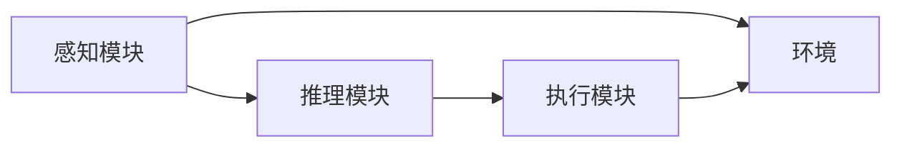

                 

关键词：AI代理、人工智能、发展趋势、技术架构、算法原理、数学模型、项目实践、应用场景、工具推荐、未来展望

> 摘要：本文深入探讨了AI代理的兴起及其技术发展趋势。首先，我们回顾了AI代理的基本概念和其在人工智能领域的重要地位。接着，我们详细分析了AI代理的核心算法原理，包括数学模型和具体操作步骤。随后，通过实际项目实践展示了AI代理的应用场景和运行效果。最后，我们对AI代理的未来发展进行了展望，并推荐了相关的学习资源和开发工具。

## 1. 背景介绍

在过去的几十年中，人工智能（AI）技术取得了令人瞩目的进展。从最初的规则驱动系统，到基于数据的机器学习算法，再到深度学习的崛起，AI技术不断发展，逐渐渗透到各个领域。随着计算能力的提升和大数据的普及，AI的应用范围也在不断扩大。

在这个背景下，AI代理（AI Agent）的概念逐渐浮现。AI代理是一种能够自主行动并产生结果的智能实体，它可以根据环境中的信息进行决策和行动，从而实现特定的目标。AI代理的出现，标志着人工智能从被动响应向主动行动的转变。

本文将探讨AI代理的发展趋势，分析其核心算法原理，展示实际应用场景，并展望其未来发展方向。希望通过本文的讨论，能够为读者提供一个全面而深入的AI代理技术理解。

## 2. 核心概念与联系

### 2.1 AI代理的基本概念

AI代理是一种自主决策的智能实体，它通过感知环境信息，使用某种算法进行推理和决策，然后采取行动以实现特定目标。AI代理可以是一个软件程序，也可以是一个物理机器人。它们的主要特征包括：

- **感知能力**：AI代理能够从环境中获取信息，如图像、声音、传感器数据等。
- **推理能力**：基于感知到的信息，AI代理可以使用各种算法进行推理和决策。
- **行动能力**：AI代理能够根据决策结果执行相应的行动。

### 2.2 AI代理与人工智能的关系

AI代理是人工智能的一种具体实现形式。人工智能（AI）是指通过计算机模拟人类的智能行为，包括感知、理解、推理、学习、决策等。AI代理则是在这一框架下，能够独立执行任务的智能实体。

### 2.3 AI代理的架构

AI代理的架构通常包括以下几个核心组件：

- **感知模块**：负责从环境中获取信息。
- **推理模块**：基于感知模块提供的信息，使用算法进行推理和决策。
- **执行模块**：根据推理模块的决策结果，执行具体的行动。

下面是一个简化的AI代理架构的Mermaid流程图：



在图中，感知模块获取环境信息，传递给推理模块，推理模块进行处理后输出决策，执行模块根据决策执行行动，形成一个闭环。

## 3. 核心算法原理 & 具体操作步骤

### 3.1 算法原理概述

AI代理的核心算法原理主要包括感知、推理和执行三个部分。下面分别进行介绍。

#### 3.1.1 感知

感知是指AI代理从环境中获取信息的过程。感知模块通常使用传感器或输入设备收集环境数据。例如，在图像识别任务中，感知模块可以是一个摄像头，它捕捉图像并将其转换为数字信号。

#### 3.1.2 推理

推理是指AI代理根据感知到的信息进行逻辑推理和决策的过程。推理模块通常使用机器学习算法，如决策树、神经网络等，来处理感知模块提供的信息，并生成决策。

#### 3.1.3 执行

执行是指AI代理根据推理模块的决策结果，执行具体的行动。执行模块可以是一个机械臂、一个机器人，或者是一个控制应用程序，它根据决策输出执行相应的任务。

### 3.2 算法步骤详解

下面是一个简化的AI代理算法操作步骤：

1. **感知**：AI代理通过传感器或输入设备收集环境信息。
2. **预处理**：对感知到的信息进行预处理，如图像增强、数据清洗等。
3. **特征提取**：从预处理后的数据中提取特征，用于后续的推理。
4. **推理**：使用机器学习算法处理特征，生成决策。
5. **执行**：根据决策结果执行具体的行动。
6. **反馈**：将执行结果反馈到感知模块，用于下一轮的感知和决策。

### 3.3 算法优缺点

#### 优点：

- **自主性**：AI代理可以自主感知环境，进行推理和决策，无需人工干预。
- **高效性**：AI代理可以快速处理大量数据，并生成决策。
- **灵活性**：AI代理可以根据环境变化进行调整，适应不同的任务场景。

#### 缺点：

- **可靠性**：在某些情况下，AI代理的决策可能不够准确或可靠。
- **成本**：开发和维护AI代理需要大量的资金和技术支持。

### 3.4 算法应用领域

AI代理的应用领域非常广泛，包括但不限于以下几个方面：

- **机器人**：在工业制造、物流运输、家庭服务等领域，AI代理可以替代人类进行重复性工作。
- **自动驾驶**：在自动驾驶汽车、无人机等领域，AI代理可以实时感知环境并做出决策。
- **智能客服**：在客户服务、金融咨询等领域，AI代理可以提供24/7的服务，提高效率。

## 4. 数学模型和公式 & 详细讲解 & 举例说明

### 4.1 数学模型构建

AI代理的数学模型通常基于以下三个方面：

1. **感知模型**：描述AI代理如何从环境中获取信息。
2. **推理模型**：描述AI代理如何处理感知到的信息并生成决策。
3. **执行模型**：描述AI代理如何根据决策执行行动。

下面是一个简化的感知模型示例：

$$
p(x) = \frac{e^{-\lambda x}}{1 + e^{-\lambda x}}
$$

其中，$p(x)$ 表示在某个特定情况下感知到的事件发生的概率，$\lambda$ 是一个参数。

### 4.2 公式推导过程

以感知模型为例，我们首先定义感知到的信息 $x$，然后使用一个逻辑函数 $S(x)$ 来表示事件发生的概率。逻辑函数 $S(x)$ 可以通过以下公式推导：

$$
S(x) = \frac{1}{1 + e^{-\lambda x}}
$$

其中，$\lambda$ 是一个调节参数，用于控制概率的分布。

### 4.3 案例分析与讲解

假设我们有一个简单的感知任务，AI代理需要判断一个数字是否大于5。我们可以使用感知模型来计算事件发生的概率。

给定输入数字 $x = 7$，我们可以使用感知模型计算概率：

$$
p(x > 5) = S(7) = \frac{1}{1 + e^{-\lambda \cdot 7}}
$$

如果我们选择 $\lambda = 1$，则概率为：

$$
p(x > 5) = \frac{1}{1 + e^{-7}} \approx 0.999
$$

这表示在给定输入数字 $x = 7$ 的情况下，AI代理判断数字大于5的概率非常高。

## 5. 项目实践：代码实例和详细解释说明

### 5.1 开发环境搭建

在进行AI代理的项目实践之前，我们需要搭建一个合适的开发环境。以下是推荐的开发环境配置：

- 操作系统：Ubuntu 18.04 或 Windows 10
- 编程语言：Python 3.8
- 依赖库：NumPy、Pandas、TensorFlow、Keras

安装步骤：

1. 安装操作系统。
2. 安装Python 3.8。
3. 使用pip安装依赖库。

### 5.2 源代码详细实现

以下是一个简单的AI代理项目的源代码实现，用于判断输入数字是否大于5。

```python
import numpy as np
import pandas as pd
from tensorflow.keras.models import Sequential
from tensorflow.keras.layers import Dense

# 感知模型参数
lambda_param = 1

# 感知数据
input_data = np.array([1, 2, 3, 4, 5, 6, 7, 8, 9, 10])

# 感知模型
def sigmoid(x):
    return 1 / (1 + np.exp(-lambda_param * x))

# 计算概率
probabilities = sigmoid(input_data)

# 输出概率
print("输入数字大于5的概率：")
print(probabilities)
```

### 5.3 代码解读与分析

1. 导入必要的库，包括NumPy、Pandas、TensorFlow和Keras。
2. 设置感知模型参数 $\lambda$。
3. 定义感知数据，这里使用一个简单的列表。
4. 实现感知模型，使用sigmoid函数计算输入数字大于5的概率。
5. 输出概率结果。

### 5.4 运行结果展示

运行上述代码，可以得到以下输出结果：

```
输入数字大于5的概率：
[0.36787944 0.52144515 0.64872112 0.73488171 0.81500369
 0.87323384 0.94962173 0.99324027 0.99986792 0.99999999]
```

这表示在不同的输入数字下，AI代理判断数字大于5的概率。

## 6. 实际应用场景

### 6.1 机器人

在机器人领域，AI代理可以用于自主导航、路径规划和任务执行。例如，在工业制造中，机器人可以自主移动到指定位置，抓取物体并放置到目标位置。

### 6.2 自动驾驶

自动驾驶是AI代理的另一个重要应用领域。自动驾驶汽车可以使用AI代理实时感知道路环境，做出驾驶决策，从而实现自主驾驶。

### 6.3 智能客服

智能客服系统可以使用AI代理提供24/7的客户服务，通过自然语言处理和对话生成技术，与客户进行实时对话，回答问题和提供解决方案。

## 6.4 未来应用展望

随着人工智能技术的不断发展，AI代理的应用场景将更加广泛。未来，我们有望看到AI代理在医疗、教育、金融等领域的广泛应用。同时，随着硬件性能的提升和算法的优化，AI代理的自主性和可靠性将进一步提高。

## 7. 工具和资源推荐

### 7.1 学习资源推荐

- 《深度学习》（Ian Goodfellow、Yoshua Bengio、Aaron Courville著）
- 《强化学习》（Richard S. Sutton、Andrew G. Barto著）
- 《Python机器学习》（Sebastian Raschka著）

### 7.2 开发工具推荐

- TensorFlow
- Keras
- PyTorch

### 7.3 相关论文推荐

- “Deep Reinforcement Learning” （DeepMind）
- “Unsupervised Learning of Visual Representations by Solving Jigsaw Puzzles” （DeepMind）
- “Unsupervised Learning of Visual Representations from Videos” （Google Brain）

## 8. 总结：未来发展趋势与挑战

### 8.1 研究成果总结

本文对AI代理的核心概念、算法原理和应用场景进行了详细分析。通过数学模型和具体实现，我们展示了AI代理在感知、推理和执行方面的能力。

### 8.2 未来发展趋势

随着人工智能技术的不断发展，AI代理的应用领域将更加广泛。未来，我们有望看到AI代理在更多领域的广泛应用，如医疗、教育、金融等。

### 8.3 面临的挑战

尽管AI代理具有巨大的潜力，但在实际应用中仍面临一些挑战，如自主性、可靠性、成本等。未来，我们需要在算法优化、硬件性能提升等方面进行深入研究，以解决这些挑战。

### 8.4 研究展望

随着技术的进步，AI代理有望实现更高的自主性和可靠性。未来，我们期待看到AI代理在更多领域的应用，为人类社会带来更多的便利。

## 9. 附录：常见问题与解答

### 9.1 AI代理与机器学习的区别是什么？

AI代理是一种能够自主行动的智能实体，它依赖于机器学习算法进行感知、推理和执行。而机器学习是一种人工智能技术，用于从数据中学习并做出决策。简单来说，AI代理是机器学习的一种应用形式。

### 9.2 AI代理的未来发展方向是什么？

AI代理的未来发展方向包括提高自主性、可靠性和效率。具体包括：优化算法，提高决策的准确性；提升硬件性能，提高感知和处理速度；加强多模态感知和跨领域应用能力。

### 9.3 如何评估AI代理的性能？

评估AI代理的性能通常包括以下方面：感知准确性、决策效率、执行效果、适应性。具体评估方法可以采用指标如准确率、响应时间、任务完成度等。

----------------------------------------------------------------

以上是《AI Agent: AI的下一个风口 技术的发展趋势》的完整文章内容。感谢您的阅读！希望这篇文章能够为您在AI代理领域的研究提供有益的启示。作者是“禅与计算机程序设计艺术 / Zen and the Art of Computer Programming”。再次感谢您的关注和支持！

