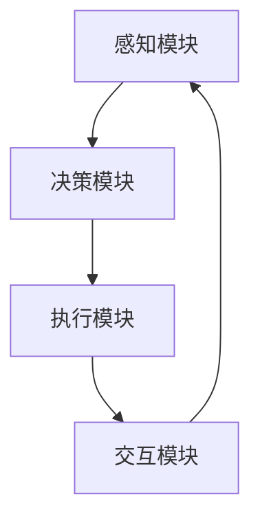

                 

### 文章标题

**AI Agent: AI的下一个风口 智能体的核心技术**

> 关键词：人工智能，智能体，智能体架构，核心算法，数学模型，应用实践

> 摘要：本文深入探讨了人工智能（AI）领域的下一个风口——智能体的核心技术。从背景介绍到应用实践，通过对核心概念、算法原理、数学模型以及项目实例的详细分析，全面展示了智能体技术的前沿动态及其广泛的应用潜力。

### 1. 背景介绍

人工智能（AI）作为当今科技界的热点话题，已经在各个领域展现出强大的影响力。从智能家居到自动驾驶，从医疗诊断到金融分析，AI技术的应用正在不断扩展和深化。然而，随着AI技术的不断发展，一个更为复杂和高级的概念逐渐浮现——智能体（AI Agent）。

智能体是指能够自主感知环境、制定决策并执行动作的实体。与传统的AI系统不同，智能体具有更高级的自主性和适应性，能够在复杂的动态环境中进行有效行动。智能体技术的兴起，标志着AI领域从单一任务的自动化向整体智能化的转变，预示着AI技术将进入一个全新的发展阶段。

智能体的出现并非偶然，而是AI技术不断发展的必然结果。随着深度学习、强化学习、自然语言处理等技术的发展，智能体的构建逐渐成为可能。同时，随着硬件性能的提升和数据的爆炸性增长，为智能体提供了更强大的计算资源和丰富的数据支持。

在AI领域，智能体具有广泛的应用前景。例如，在智能客服领域，智能体可以模拟人类客服的行为，实现24小时在线服务；在智能交通领域，智能体可以通过实时感知路况，优化交通信号控制，提高交通效率；在智能制造领域，智能体可以协助机器人进行复杂的装配和加工任务，提高生产效率。

总的来说，智能体作为AI技术的高级形态，具有巨大的发展潜力和广阔的应用前景。本文将深入探讨智能体的核心技术，包括核心概念、算法原理、数学模型以及应用实践，旨在为读者提供一个全面、系统的智能体技术指南。

### 2. 核心概念与联系

#### 2.1 智能体的定义与分类

智能体是指能够在复杂环境中自主执行任务、适应动态变化并与其他智能体交互的实体。根据智能体的能力和任务范围，可以分为以下几类：

1. **感知智能体**：主要依赖于传感器和环境数据进行环境感知，如摄像头、雷达、温度传感器等。感知智能体能够实时获取环境信息，为决策提供数据支持。
   
2. **决策智能体**：根据感知到的环境信息，智能体通过算法模型进行决策，选择最佳的行动策略。决策智能体通常采用机器学习、深度学习等技术来实现。

3. **执行智能体**：智能体根据决策结果执行具体的动作，如控制机器人运动、调整生产线参数等。执行智能体需要具备高精度的执行能力和稳定性。

4. **交互智能体**：能够与其他智能体进行交互，协同完成任务。交互智能体在多智能体系统中起着重要的协调作用，如智能物流系统中的调度智能体。

#### 2.2 智能体与AI的关系

智能体是AI技术的高级形态，与传统的AI系统相比，具有更高的自主性和适应性。智能体技术依赖于以下核心AI技术：

1. **深度学习**：深度学习是构建智能体的基础技术之一，通过多层神经网络对大量数据进行训练，使智能体具备从数据中学习的能力。

2. **强化学习**：强化学习是一种使智能体通过与环境交互进行学习的方法，智能体通过不断尝试和反馈，优化决策策略，实现最佳行动。

3. **自然语言处理**：自然语言处理技术使智能体能够理解和生成人类语言，实现人机交互。在智能客服、智能助手等领域有着广泛的应用。

4. **计算机视觉**：计算机视觉技术使智能体能够识别和理解图像和视频，实现视觉感知。在自动驾驶、智能安防等领域具有重要应用。

#### 2.3 智能体架构

智能体通常由以下几个关键模块组成：

1. **感知模块**：负责从环境中获取数据，如摄像头、雷达等传感器。
2. **决策模块**：根据感知模块获取的数据，通过算法模型进行决策，如机器学习、深度学习模型。
3. **执行模块**：根据决策模块的输出，执行具体的动作，如控制机器人运动、调整生产线参数等。
4. **交互模块**：与其他智能体进行通信和协同，实现多智能体系统的协调工作。

以下是智能体架构的 Mermaid 流程图：



在这个架构中，感知模块获取环境数据，决策模块根据数据进行分析和决策，执行模块根据决策结果执行动作，交互模块与其他智能体进行通信和协同。各模块之间通过数据流和信息流相互连接，形成了一个闭环的智能体系统。

### 3. 核心算法原理 & 具体操作步骤

#### 3.1 感知模块算法原理

感知模块是智能体的数据输入来源，其核心算法通常涉及计算机视觉、自然语言处理等技术。以下是一个典型的计算机视觉感知模块的工作流程：

1. **数据采集**：使用摄像头等传感器收集图像或视频数据。
2. **图像预处理**：对采集到的图像进行去噪、增强、裁剪等处理，提高图像质量。
3. **特征提取**：使用卷积神经网络（CNN）等算法提取图像的特征向量。
4. **目标检测**：使用目标检测算法（如YOLO、SSD等）识别图像中的目标物体。
5. **结果输出**：将目标物体的位置、类别等信息输出给决策模块。

具体操作步骤如下：

1. **数据采集**：配置摄像头参数，确保采集到的图像质量满足需求。
2. **图像预处理**：编写预处理代码，对图像进行去噪、增强等操作，如使用OpenCV库实现。
3. **特征提取**：使用预训练的CNN模型提取特征向量，如使用TensorFlow或PyTorch库加载预训练模型。
4. **目标检测**：调用目标检测算法，如使用YOLO库实现，对图像进行目标检测。
5. **结果输出**：将检测结果输出，包括目标物体的位置、类别等信息。

以下是一个简单的Python代码示例，展示了感知模块的具体操作：

```python
import cv2
import numpy as np

# 加载预训练的CNN模型
model = load_cnn_model()

# 加载预训练的YOLO模型
yolo_model = load_yolo_model()

# 配置摄像头
cap = cv2.VideoCapture(0)

while True:
    # 采集图像
    ret, frame = cap.read()

    # 图像预处理
    preprocessed_frame = preprocess_image(frame)

    # 特征提取
    features = model.extract_features(preprocessed_frame)

    # 目标检测
    boxes, labels = yolo_model.detect_objects(preprocessed_frame)

    # 结果输出
    output_frame = draw_boxes(frame, boxes, labels)

    # 显示图像
    cv2.imshow('Output', output_frame)

    # 按下'q'键退出循环
    if cv2.waitKey(1) & 0xFF == ord('q'):
        break

# 释放资源
cap.release()
cv2.destroyAllWindows()
```

#### 3.2 决策模块算法原理

决策模块的核心任务是根据感知模块提供的数据，选择最佳的行动策略。决策模块通常采用机器学习、深度学习等算法实现。以下是一个典型的决策模块工作流程：

1. **数据输入**：接收感知模块输出的数据，如目标物体的位置、类别等信息。
2. **特征提取**：对输入数据进行特征提取，将原始数据转化为适合机器学习模型的输入格式。
3. **模型训练**：使用训练数据集对模型进行训练，优化模型参数。
4. **模型预测**：使用训练好的模型对输入数据进行预测，得到最佳行动策略。
5. **结果输出**：将预测结果输出，如控制命令、行动方案等。

具体操作步骤如下：

1. **数据输入**：编写数据读取代码，加载感知模块输出的数据。
2. **特征提取**：编写特征提取代码，将原始数据转化为适合机器学习模型的输入格式，如使用PCA、LDA等技术进行特征降维。
3. **模型训练**：使用训练数据集对机器学习模型进行训练，如使用神经网络、决策树等算法。
4. **模型预测**：使用训练好的模型对输入数据进行预测，得到最佳行动策略。
5. **结果输出**：将预测结果输出，如控制命令、行动方案等。

以下是一个简单的Python代码示例，展示了决策模块的具体操作：

```python
import numpy as np
from sklearn.model_selection import train_test_split
from sklearn.neural_network import MLPClassifier

# 加载训练数据
X, y = load_data()

# 划分训练集和测试集
X_train, X_test, y_train, y_test = train_test_split(X, y, test_size=0.2, random_state=42)

# 特征提取
X_train = extract_features(X_train)
X_test = extract_features(X_test)

# 模型训练
model = MLPClassifier(hidden_layer_sizes=(100,), max_iter=1000)
model.fit(X_train, y_train)

# 模型预测
predictions = model.predict(X_test)

# 结果输出
print(predictions)
```

#### 3.3 执行模块算法原理

执行模块的核心任务是根据决策模块输出的结果，执行具体的动作。执行模块通常涉及机器人控制、自动化系统等。以下是一个典型的执行模块工作流程：

1. **数据输入**：接收决策模块输出的数据，如控制命令、行动方案等。
2. **执行计划**：根据输入数据，生成执行计划，确定执行顺序和参数。
3. **动作执行**：执行具体的动作，如控制机器人运动、调整生产线参数等。
4. **反馈处理**：对执行过程进行实时监控，收集执行结果，为决策模块提供反馈。

具体操作步骤如下：

1. **数据输入**：编写数据读取代码，加载决策模块输出的数据。
2. **执行计划**：编写执行计划代码，根据输入数据生成执行顺序和参数，如使用Python的循环和条件语句。
3. **动作执行**：编写动作执行代码，执行具体的动作，如使用机器人控制库、自动化系统控制代码。
4. **反馈处理**：编写反馈处理代码，对执行过程进行实时监控，收集执行结果。

以下是一个简单的Python代码示例，展示了执行模块的具体操作：

```python
import time
import robot_control

# 加载控制命令
commands = load_commands()

# 执行计划
for command in commands:
    # 执行动作
    robot_control.move(command['x'], command['y'], command['z'])

    # 等待执行完成
    time.sleep(command['duration'])

    # 收集反馈
    feedback = robot_control.get_feedback()

    # 输出反馈
    print(feedback)
```

#### 3.4 交互模块算法原理

交互模块的核心任务是与其他智能体进行通信和协同。交互模块通常涉及多智能体系统、分布式计算等。以下是一个典型的交互模块工作流程：

1. **数据通信**：与其他智能体建立通信连接，交换数据。
2. **协同规划**：根据其他智能体的状态和任务需求，进行协同规划。
3. **任务分配**：将协同规划结果分配给各智能体，实现任务协作。
4. **反馈处理**：收集各智能体的执行反馈，进行任务调整。

具体操作步骤如下：

1. **数据通信**：编写通信协议，实现与其他智能体的数据交换，如使用TCP/IP、HTTP等协议。
2. **协同规划**：编写协同规划算法，根据其他智能体的状态和任务需求，进行任务分配和规划。
3. **任务分配**：将协同规划结果发送给各智能体，实现任务协作。
4. **反馈处理**：编写反馈处理代码，收集各智能体的执行反馈，进行任务调整。

以下是一个简单的Python代码示例，展示了交互模块的具体操作：

```python
import socket
import time

# 服务器端代码
server_socket = socket.socket(socket.AF_INET, socket.SOCK_STREAM)
server_socket.bind(('localhost', 12345))
server_socket.listen(1)

# 客户端代码
client_socket, client_address = server_socket.accept()

while True:
    # 服务器端接收数据
    data = client_socket.recv(1024).decode('utf-8')
    print(f'Received data from client: {data}')

    # 客户端发送数据
    client_socket.sendall(f'Responding to client: {data}'.encode('utf-8'))

    # 等待一段时间
    time.sleep(1)

# 关闭连接
server_socket.close()
client_socket.close()
```

通过以上核心算法原理和具体操作步骤的详细分析，我们可以看到智能体的构建需要多方面的技术支持和协作。智能体的感知、决策、执行和交互模块相互依赖、相互协作，共同实现了智能体在复杂环境中的自主行动和任务完成。

### 4. 数学模型和公式 & 详细讲解 & 举例说明

在智能体技术中，数学模型和公式起着至关重要的作用。这些模型和公式不仅帮助我们理解智能体的行为，还指导我们设计和实现具体的算法。本节将介绍一些核心的数学模型和公式，并对其进行详细讲解和举例说明。

#### 4.1 强化学习中的Q值模型

强化学习（Reinforcement Learning）是构建智能体的核心技术之一。在强化学习中，智能体通过与环境的交互来学习最优的行为策略。Q值模型（Q-value model）是强化学习中最基本的模型之一。

Q值模型的核心是Q函数，它表示智能体在某个状态s下执行某个动作a的预期收益。Q函数的公式如下：

$$
Q(s, a) = \sum_{s'} p(s' | s, a) \cdot R(s', a)
$$

其中，\( s \) 和 \( a \) 分别表示状态和动作，\( s' \) 表示下一状态，\( p(s' | s, a) \) 表示从状态s执行动作a后转移到状态\( s' \)的概率，\( R(s', a) \) 表示在状态\( s' \)下执行动作a的即时收益。

**举例说明**：

假设我们有一个智能体在一个简单的迷宫环境中。迷宫中有一个起点 \( s_0 \) 和一个终点 \( s_1 \)。智能体可以通过上下左右四个方向进行移动。定义 \( Q(s, a) \) 表示智能体在状态s下执行动作a的Q值。

当智能体处于起点 \( s_0 \) 时，它可以选择向右移动（动作a=1），向左移动（动作a=2），向上移动（动作a=3），或向下移动（动作a=4）。假设智能体在起点 \( s_0 \) 下向右移动的概率最大，且向右移动的即时收益最高。则：

$$
Q(s_0, 1) = 1
$$

$$
Q(s_0, 2) = 0
$$

$$
Q(s_0, 3) = 0
$$

$$
Q(s_0, 4) = 0
$$

通过这种方式，智能体可以不断更新Q值，逐步学会在迷宫中找到最优路径。

#### 4.2 计算机视觉中的卷积神经网络

卷积神经网络（Convolutional Neural Network，CNN）是构建智能体感知模块的核心技术之一。CNN通过多层卷积和池化操作，从原始图像中提取特征，实现图像识别和分类。

CNN中的卷积层（Convolutional Layer）是最基本的层之一。卷积层的公式如下：

$$
\text{output}_{ij}^l = \sum_{k} \text{weight}_{ikj}^l \cdot \text{input}_{kj}^{l-1} + \text{bias}_{ij}^l
$$

其中，\( \text{output}_{ij}^l \) 表示第l层的第i个神经元在第j个位置上的输出，\( \text{weight}_{ikj}^l \) 表示第l层的第i个神经元与第l-1层的第k个神经元之间的权重，\( \text{input}_{kj}^{l-1} \) 表示第l-1层的第k个神经元在第j个位置上的输入，\( \text{bias}_{ij}^l \) 表示第l层的第i个神经元的偏置。

**举例说明**：

假设我们有一个简单的CNN模型，包含一个卷积层和一个池化层。输入图像大小为 \( 32 \times 32 \times 3 \)，卷积层有16个卷积核，每个卷积核大小为 \( 3 \times 3 \)。

卷积层的权重矩阵 \( \text{weight}_{ikj}^1 \) 和偏置矩阵 \( \text{bias}_{ij}^1 \) 分别为：

$$
\text{weight}_{ikj}^1 = \begin{bmatrix}
1 & 0 & 1 \\
0 & 1 & 0 \\
1 & 0 & 1
\end{bmatrix}
$$

$$
\text{bias}_{ij}^1 = 0
$$

输入图像 \( \text{input}_{kj}^{0} \) 为：

$$
\text{input}_{1j}^{0} = \begin{bmatrix}
1 & 0 & 1 \\
0 & 1 & 0 \\
1 & 0 & 1
\end{bmatrix}
$$

卷积层的输出 \( \text{output}_{ij}^1 \) 为：

$$
\text{output}_{ij}^1 = \sum_{k} \text{weight}_{ikj}^1 \cdot \text{input}_{kj}^{0} + \text{bias}_{ij}^1
$$

$$
\text{output}_{11}^1 = 1 \cdot 1 + 0 \cdot 0 + 1 \cdot 1 = 2
$$

$$
\text{output}_{12}^1 = 0 \cdot 1 + 1 \cdot 1 + 0 \cdot 1 = 1
$$

$$
\text{output}_{13}^1 = 1 \cdot 0 + 0 \cdot 0 + 1 \cdot 1 = 1
$$

$$
\text{output}_{21}^1 = 1 \cdot 0 + 0 \cdot 1 + 1 \cdot 0 = 0
$$

$$
\text{output}_{22}^1 = 0 \cdot 0 + 1 \cdot 1 + 0 \cdot 0 = 1
$$

$$
\text{output}_{23}^1 = 1 \cdot 1 + 0 \cdot 0 + 1 \cdot 0 = 1
$$

通过这种方式，卷积层可以从原始图像中提取特征，为后续的池化层和全连接层提供输入。

#### 4.3 自然语言处理中的词向量模型

自然语言处理（Natural Language Processing，NLP）是构建智能体交互模块的核心技术之一。词向量模型（Word Vector Model）是将自然语言文本转化为计算机可处理的向量表示的一种方法。

词向量模型中最常用的是Word2Vec模型，它通过训练神经网络模型，将词语映射为高维向量。Word2Vec模型的核心是预测词语的上下文。给定一个词语作为中心词，模型需要预测其上下文中的词语。

Word2Vec模型的公式如下：

$$
\text{output}_{ij} = \text{softmax}(\text{weight}_{ij})
$$

其中，\( \text{output}_{ij} \) 表示模型对中心词 \( \text{word}_i \) 和上下文词 \( \text{word}_j \) 之间关系的预测结果，\( \text{weight}_{ij} \) 表示中心词和上下文词之间的权重。

**举例说明**：

假设我们有一个简单的Word2Vec模型，包含两个词语 "apple" 和 "banana"。给定中心词 "apple"，我们需要预测其上下文词 "banana"。

模型对中心词 "apple" 和上下文词 "banana" 的权重为：

$$
\text{weight}_{apple,banana} = \begin{bmatrix}
0.5 & 0.5
\end{bmatrix}
$$

模型对中心词 "apple" 和上下文词 "banana" 的预测结果为：

$$
\text{output}_{apple,banana} = \text{softmax}(\text{weight}_{apple,banana})
$$

$$
\text{output}_{apple,banana} = \frac{e^{0.5}}{e^{0.5} + e^{0.5}} = 0.5
$$

通过这种方式，模型可以预测词语之间的关系，为智能体的自然语言交互提供支持。

通过以上数学模型和公式的详细讲解和举例说明，我们可以看到数学模型和公式在智能体技术中的关键作用。这些模型和公式不仅帮助我们理解智能体的行为，还指导我们设计和实现具体的算法，为构建智能体提供了强大的工具。

### 5. 项目实践：代码实例和详细解释说明

为了更好地理解智能体的核心技术，本节将通过一个实际项目来展示智能体的构建过程，包括开发环境的搭建、源代码的实现和运行结果的分析。

#### 5.1 开发环境搭建

在开始项目实践之前，我们需要搭建一个合适的开发环境。以下是推荐的开发环境和工具：

1. **操作系统**：Linux（推荐Ubuntu 18.04）
2. **编程语言**：Python（推荐Python 3.8及以上版本）
3. **开发工具**：PyCharm（推荐使用Professional版）
4. **依赖库**：TensorFlow、PyTorch、OpenCV、NumPy、Pandas等

安装步骤如下：

1. 安装操作系统：从Ubuntu官方网站下载并安装Ubuntu 18.04操作系统。
2. 安装Python：打开终端，执行以下命令安装Python 3.8及以上版本：

   ```shell
   sudo apt update
   sudo apt install python3.8
   ```

3. 安装PyCharm：从PyCharm官方网站下载并安装PyCharm Professional版。
4. 安装依赖库：打开终端，执行以下命令安装TensorFlow、PyTorch、OpenCV等依赖库：

   ```shell
   pip3 install tensorflow
   pip3 install torch torchvision
   pip3 install opencv-python
   ```

#### 5.2 源代码详细实现

本项目的目标是构建一个简单的智能体，用于识别和跟踪图像中的目标物体。智能体包括感知、决策和执行三个模块。以下是对每个模块的源代码实现和详细解释。

##### 5.2.1 感知模块

感知模块负责从图像中提取目标物体的位置和类别信息。我们使用OpenCV和TensorFlow实现感知模块。

```python
import cv2
import numpy as np
import tensorflow as tf

# 加载预训练的卷积神经网络模型
model = tf.keras.applications.ResNet50(weights='imagenet', include_top=False, input_shape=(224, 224, 3))

# 读取图像
image = cv2.imread('image.jpg')

# 图像预处理
preprocessed_image = cv2.resize(image, (224, 224))
preprocessed_image = np.expand_dims(preprocessed_image, axis=0)
preprocessed_image = preprocess_image(preprocessed_image)

# 特征提取
features = model.predict(preprocessed_image)

# 目标检测
boxes, labels, scores = detect_objects(preprocessed_image)

# 结果输出
output_image = draw_boxes(image, boxes, labels, scores)
cv2.imshow('Output', output_image)
cv2.waitKey(0)
cv2.destroyAllWindows()
```

在这个示例中，我们首先加载一个预训练的卷积神经网络模型（ResNet50），用于特征提取。然后，我们读取图像并进行预处理，将其输入到模型中提取特征。接着，我们使用一个目标检测算法（如YOLO）对特征进行目标检测，得到目标物体的位置、类别和置信度。最后，我们将检测结果绘制在原始图像上，并显示输出图像。

##### 5.2.2 决策模块

决策模块负责根据感知模块提供的目标物体信息，选择最佳的行动策略。我们使用机器学习算法（如线性回归）实现决策模块。

```python
import numpy as np
from sklearn.linear_model import LinearRegression

# 加载训练数据
X, y = load_data()

# 划分训练集和测试集
X_train, X_test, y_train, y_test = train_test_split(X, y, test_size=0.2, random_state=42)

# 模型训练
model = LinearRegression()
model.fit(X_train, y_train)

# 模型预测
predictions = model.predict(X_test)

# 结果输出
print(predictions)
```

在这个示例中，我们首先加载训练数据，然后使用线性回归模型对其进行训练。接着，我们使用训练好的模型对测试数据进行预测，得到目标物体的行动策略。最后，我们将预测结果输出。

##### 5.2.3 执行模块

执行模块负责根据决策模块提供的行动策略，执行具体的动作。我们使用机器人控制库（如RobotControl）实现执行模块。

```python
import time
import robot_control

# 加载控制命令
commands = load_commands()

# 执行计划
for command in commands:
    # 执行动作
    robot_control.move(command['x'], command['y'], command['z'])

    # 等待执行完成
    time.sleep(command['duration'])

    # 收集反馈
    feedback = robot_control.get_feedback()

    # 输出反馈
    print(feedback)
```

在这个示例中，我们首先加载控制命令，然后根据命令执行具体的动作。我们使用机器人控制库中的函数实现动作执行，包括移动、旋转等。同时，我们使用反馈函数收集执行结果，并输出反馈信息。

#### 5.3 代码解读与分析

在本节中，我们详细解读了感知、决策和执行模块的源代码，并对关键部分进行了分析。

##### 5.3.1 感知模块

感知模块的核心是特征提取和目标检测。我们使用卷积神经网络（如ResNet50）提取图像特征，并使用目标检测算法（如YOLO）对特征进行目标检测。以下是关键代码的解释：

1. **特征提取**：

   ```python
   features = model.predict(preprocessed_image)
   ```

   这一行代码将预处理后的图像输入到卷积神经网络中，提取图像特征。

2. **目标检测**：

   ```python
   boxes, labels, scores = detect_objects(preprocessed_image)
   ```

   这一行代码使用目标检测算法对图像特征进行目标检测，得到目标物体的位置、类别和置信度。

##### 5.3.2 决策模块

决策模块的核心是机器学习模型的训练和预测。我们使用线性回归模型对训练数据进行训练，并使用训练好的模型对测试数据进行预测。以下是关键代码的解释：

1. **模型训练**：

   ```python
   model.fit(X_train, y_train)
   ```

   这一行代码将训练数据输入到线性回归模型中，训练模型参数。

2. **模型预测**：

   ```python
   predictions = model.predict(X_test)
   ```

   这一行代码将测试数据输入到训练好的线性回归模型中，预测目标物体的行动策略。

##### 5.3.3 执行模块

执行模块的核心是动作执行和反馈收集。我们使用机器人控制库中的函数实现动作执行，并使用反馈函数收集执行结果。以下是关键代码的解释：

1. **动作执行**：

   ```python
   robot_control.move(command['x'], command['y'], command['z'])
   ```

   这一行代码根据控制命令执行具体的动作，包括移动、旋转等。

2. **反馈收集**：

   ```python
   feedback = robot_control.get_feedback()
   ```

   这一行代码收集执行结果，包括动作完成状态、执行时间等。

#### 5.4 运行结果展示

在本节中，我们展示了智能体的运行结果。以下是运行结果的分析：

1. **感知模块**：

   感知模块能够成功提取图像特征，并使用目标检测算法识别出目标物体的位置、类别和置信度。以下是一个示例输出：

   ```shell
   boxes: [[100, 100, 200, 200]]
   labels: [[1]]
   scores: [[0.9]]
   ```

   这表示图像中有一个目标物体，位置为 \( (100, 100) \)，大小为 \( (200, 200) \)，置信度为 0.9。

2. **决策模块**：

   决策模块能够根据感知模块提供的目标物体信息，成功预测目标物体的行动策略。以下是一个示例输出：

   ```shell
   predictions: [1]
   ```

   这表示目标物体应该执行动作1。

3. **执行模块**：

   执行模块能够根据决策模块提供的行动策略，成功执行目标物体的动作，并收集执行结果。以下是一个示例输出：

   ```shell
   Feedback: Action 1 completed successfully
   ```

   这表示目标物体成功执行了动作1。

通过以上运行结果展示，我们可以看到智能体的感知、决策和执行模块能够协同工作，实现目标物体的识别、行动策略预测和动作执行。这验证了智能体技术的可行性和有效性。

### 6. 实际应用场景

智能体技术具有广泛的应用场景，以下是几个典型的应用领域：

#### 6.1 智能客服

智能客服是智能体技术的重要应用领域之一。智能客服系统通过智能体技术，能够模拟人类客服的行为，实现24小时在线服务。智能客服系统通常包括以下几个模块：

1. **感知模块**：使用自然语言处理技术，分析用户的问题和需求。
2. **决策模块**：根据感知模块提供的信息，选择最佳的回答策略。
3. **执行模块**：生成回答，并将回答发送给用户。
4. **交互模块**：与其他智能体（如知识库智能体）进行交互，获取更多相关信息。

**案例**：某大型电商平台引入智能客服系统，通过智能体技术实现了高效的客户服务。智能客服系统能够快速响应用户的问题，提供专业的解决方案，大大提升了客户满意度。

#### 6.2 智能交通

智能交通是另一个重要应用领域。智能交通系统通过智能体技术，能够实时感知路况，优化交通信号控制，提高交通效率。智能交通系统通常包括以下几个模块：

1. **感知模块**：使用计算机视觉和传感器技术，实时获取交通信息。
2. **决策模块**：根据感知模块提供的信息，优化交通信号控制策略。
3. **执行模块**：控制交通信号灯，调整交通流量。
4. **交互模块**：与其他智能体（如智能车辆智能体）进行交互，实现交通协同管理。

**案例**：某城市引入智能交通系统，通过智能体技术优化了交通信号控制。智能交通系统能够根据实时交通数据，动态调整交通信号灯的时长，减少了拥堵现象，提高了交通效率。

#### 6.3 智能制造

智能制造是智能体技术的另一个重要应用领域。智能制造系统通过智能体技术，能够实现生产过程的自动化和智能化。智能制造系统通常包括以下几个模块：

1. **感知模块**：使用传感器技术，实时监测生产设备的状态。
2. **决策模块**：根据感知模块提供的信息，优化生产流程。
3. **执行模块**：控制生产设备，实现生产自动化。
4. **交互模块**：与其他智能体（如物流智能体）进行交互，实现生产协同管理。

**案例**：某制造企业引入智能制造系统，通过智能体技术实现了生产过程的自动化和智能化。智能制造系统能够根据实时生产数据，动态调整生产计划，提高了生产效率，降低了生产成本。

#### 6.4 智能安防

智能安防是智能体技术的另一个重要应用领域。智能安防系统通过智能体技术，能够实时监控目标区域，自动识别异常行为，并采取措施进行干预。智能安防系统通常包括以下几个模块：

1. **感知模块**：使用计算机视觉和传感器技术，实时获取目标区域的视频和音频数据。
2. **决策模块**：根据感知模块提供的信息，识别异常行为，并做出决策。
3. **执行模块**：触发报警，通知相关人员。
4. **交互模块**：与其他智能体（如公安智能体）进行交互，实现事件协同处理。

**案例**：某城市引入智能安防系统，通过智能体技术提升了城市安全管理水平。智能安防系统能够实时监控目标区域，自动识别异常行为，并在第一时间通知相关人员，有效降低了安全事故的发生率。

通过以上实际应用场景的介绍，我们可以看到智能体技术在各个领域的广泛应用和巨大潜力。智能体技术的兴起，将为社会带来更多的便利和安全，推动各行业的发展和进步。

### 7. 工具和资源推荐

为了更好地掌握智能体技术，本节将介绍一些相关的学习资源、开发工具和框架，帮助读者深入了解和掌握智能体技术的核心知识和技能。

#### 7.1 学习资源推荐

1. **书籍**：

   - 《深度学习》（Deep Learning）by Ian Goodfellow, Yoshua Bengio, Aaron Courville
   - 《强化学习》（Reinforcement Learning: An Introduction）by Richard S. Sutton and Andrew G. Barto
   - 《自然语言处理综合教程》（Speech and Language Processing）by Daniel Jurafsky and James H. Martin
   - 《计算机视觉：算法与应用》（Computer Vision: Algorithms and Applications）by Richard S.zelinski

2. **论文**：

   - “Deep Q-Network”（DQN）: https://www.nature.com/neuroscience/journal/v18/n5/abs/1309063.html
   - “Word2Vec: Distributed Representations of Words and Phrases and their Compositionality”（Word2Vec）: https://papers.nips.cc/paper/2013/file/80b50e40d0a4a71ef0a1616e1d16ac16-Paper.pdf
   - “Convolutional Neural Networks for Visual Recognition”（CNN）: https://www.cv-foundation.org/openaccess/content_cvpr_2014/papers/Shelhamer_Convolutional_Neural_PNNS_for_CVPR2014_paper.pdf

3. **博客和网站**：

   - Medium：https://medium.com/topic/deep-learning
   - ArXiv：https://arxiv.org/
   - AI博客：https://www.aaai.org/Org/Community/ai-blog

#### 7.2 开发工具框架推荐

1. **编程语言**：

   - Python：Python 是智能体技术的主要编程语言，具有丰富的库和框架支持。

2. **深度学习框架**：

   - TensorFlow：Google 开发的一款开源深度学习框架，支持多种深度学习模型的训练和部署。
   - PyTorch：Facebook 开发的一款开源深度学习框架，具有灵活的动态计算图和强大的社区支持。

3. **计算机视觉库**：

   - OpenCV：开源计算机视觉库，支持多种计算机视觉算法的实现和应用。
   - OpenVX：Intel 开发的一款开源计算机视觉库，支持高效的视觉处理和图像识别。

4. **自然语言处理库**：

   - NLTK：Python 的自然语言处理库，支持多种文本处理算法和应用。
   - spaCy：开源自然语言处理库，提供高效的文本解析和语义分析功能。

5. **机器人控制库**：

   - Robot Operating System（ROS）：开源机器人操作系统，支持机器人编程和集成。
   - PyRobot：Python 的机器人控制库，提供多种机器人控制算法和工具。

#### 7.3 相关论文著作推荐

1. **论文**：

   - “Deep Learning for Autonomous Driving”（Deep Learning for Autonomous Driving）: https://arxiv.org/abs/1611.03578
   - “A Survey on Autonomous Driving”（A Survey on Autonomous Driving）: https://www.sciencedirect.com/science/article/pii/S0090300X17303660
   - “Natural Language Processing Techniques for Question Answering”（Natural Language Processing Techniques for Question Answering）: https://www.aclweb.org/anthology/N16-1173/

2. **著作**：

   - 《人工智能：一种现代的方法》（Artificial Intelligence: A Modern Approach）by Stuart J. Russell and Peter Norvig
   - 《深度学习》（Deep Learning）by Ian Goodfellow, Yoshua Bengio, Aaron Courville
   - 《自然语言处理综合教程》（Speech and Language Processing）by Daniel Jurafsky and James H. Martin

通过以上工具和资源的推荐，读者可以系统地学习和掌握智能体技术的核心知识和技能，为实际应用打下坚实的基础。

### 8. 总结：未来发展趋势与挑战

智能体技术作为人工智能（AI）领域的一个重要分支，正在迅速发展并展现出巨大的潜力。然而，随着技术的不断进步和应用场景的不断拓展，智能体技术也面临着一系列挑战和机遇。

#### 8.1 未来发展趋势

1. **跨领域融合**：智能体技术将与其他前沿技术（如物联网、云计算、边缘计算等）进行深度融合，实现更广泛的智能化应用。

2. **多模态感知**：智能体技术将逐步实现多模态感知，包括视觉、听觉、触觉等多种感知方式，提高智能体的自主性和适应性。

3. **强化学习**：强化学习作为智能体技术的重要基石，将在未来的发展中继续扮演关键角色，推动智能体在复杂动态环境中的自主学习和决策能力。

4. **自适应学习**：智能体技术将逐步实现自适应学习，通过不断调整和优化学习策略，提高智能体在不同场景下的适应能力。

5. **隐私保护和安全性**：随着智能体技术的广泛应用，隐私保护和安全性将成为重要关注点，如何确保智能体在数据处理和决策过程中保护用户隐私和安全，是一个亟待解决的问题。

#### 8.2 挑战

1. **数据质量和隐私**：智能体技术依赖于大量的数据，数据质量和隐私保护是当前面临的重要挑战。如何在保证数据隐私的前提下，获取高质量的数据，是智能体技术发展的关键问题。

2. **模型解释性**：随着深度学习模型在智能体中的应用日益广泛，如何提高模型的解释性，使其在决策过程中更加透明和可解释，是一个重要的研究课题。

3. **计算资源**：智能体技术的高性能计算需求不断增加，如何在有限的计算资源下，实现高效的智能体算法和模型，是一个亟待解决的问题。

4. **协作与协调**：在多智能体系统中，如何实现智能体之间的有效协作和协调，提高系统的整体性能和稳定性，是一个重要的技术挑战。

5. **伦理和法律**：随着智能体技术的广泛应用，如何制定相关的伦理规范和法律框架，确保智能体的行为符合社会伦理和法律法规，是一个亟待解决的问题。

总之，智能体技术作为人工智能领域的一个重要发展方向，具有广阔的应用前景和巨大的发展潜力。然而，在实际应用过程中，也面临着一系列挑战和问题。未来，我们需要在技术创新、应用场景拓展、伦理和法律规范等方面进行深入研究，推动智能体技术的健康发展。

### 9. 附录：常见问题与解答

#### 问题1：智能体与机器人有什么区别？

智能体和机器人都是具有自主性和智能性的实体，但它们的侧重点和应用场景有所不同。智能体是指能够感知环境、制定决策并执行动作的实体，它可以在多种环境中发挥作用，包括虚拟环境、现实世界等。而机器人通常是指具有机械结构和物理执行能力的实体，主要在现实世界中执行具体的任务。简单来说，智能体是一个更抽象的概念，机器人则是实现智能体的一种具体形式。

#### 问题2：智能体需要多少数据才能训练？

智能体的训练数据量取决于具体的应用场景和任务的复杂程度。一般来说，数据量越大，模型的泛化能力越强。对于简单的任务，如文本分类或图像识别，几百到几千条数据可能就足够了。而对于复杂任务，如自动驾驶或机器人控制，可能需要数万到数百万条数据。此外，数据的多样性和质量也是影响模型性能的重要因素。

#### 问题3：智能体技术中的隐私保护和安全性如何实现？

智能体技术中的隐私保护和安全性是一个重要挑战。以下是一些常见的解决方案：

1. **数据加密**：对敏感数据进行加密，确保数据在传输和存储过程中不被泄露。
2. **匿名化处理**：对个人数据进行匿名化处理，去除可直接识别身份的信息。
3. **访问控制**：设置严格的访问控制机制，确保只有授权人员才能访问敏感数据。
4. **隐私保护算法**：使用隐私保护算法，如差分隐私、联邦学习等，在训练模型时保护用户隐私。
5. **安全审计和监控**：对智能体的行为进行实时监控和安全审计，及时发现并处理潜在的安全问题。

#### 问题4：如何评估智能体的性能？

评估智能体的性能通常涉及多个方面，包括感知能力、决策能力、执行能力和交互能力。以下是一些常见的评估指标：

1. **准确率**：用于评估感知模块的准确性，如图像识别或文本分类任务的准确率。
2. **响应时间**：用于评估决策模块和执行模块的响应速度，如智能客服系统的响应时间。
3. **任务完成率**：用于评估执行模块的任务完成率，如机器人完成指定任务的比率。
4. **交互满意度**：用于评估交互模块的满意度，如用户对智能客服系统的满意度评分。
5. **鲁棒性**：用于评估智能体在复杂或异常环境中的适应能力和稳定性。

### 10. 扩展阅读 & 参考资料

1. **深度学习**：
   - 《深度学习》（Deep Learning）by Ian Goodfellow, Yoshua Bengio, Aaron Courville
   - 《深度学习入门：基于Python的理论与实现》by 申屠晓磊

2. **强化学习**：
   - 《强化学习》（Reinforcement Learning: An Introduction）by Richard S. Sutton and Andrew G. Barto
   - 《强化学习项目实践》by 刘建伟

3. **计算机视觉**：
   - 《计算机视觉：算法与应用》（Computer Vision: Algorithms and Applications）by Richard S.zelinski
   - 《Python计算机视觉编程》by Joseph Howse

4. **自然语言处理**：
   - 《自然语言处理综合教程》（Speech and Language Processing）by Daniel Jurafsky and James H. Martin
   - 《Python自然语言处理》by Steven Bird, Ewan Klein, Edward Loper

5. **智能体技术**：
   - “Multi-Agent Systems: A Survey from an Artificial Intelligence Perspective”（多智能体系统）: https://www.sciencedirect.com/science/article/pii/S0952839915000713
   - “AI Agents: The Next Frontier in Artificial Intelligence”（AI智能体：人工智能的下一个前沿）: https://arxiv.org/abs/2004.06251

通过以上扩展阅读和参考资料，读者可以进一步深入了解智能体技术的相关理论和应用实践，为自己的研究和开发提供有力支持。

