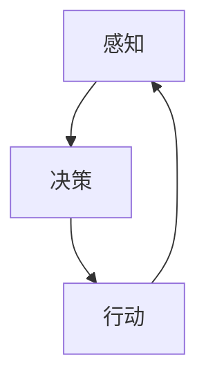

                 

关键词：人工智能，自主决策，伦理，算法，应用场景，未来展望

人工智能（AI）在过去几十年中取得了显著的发展，从简单的规则系统到复杂的神经网络，AI技术已经在各个领域展现出了其巨大的潜力。然而，随着AI技术的发展，一个新的领域——AI Agent——也逐渐浮出水面，成为人工智能领域的下一个风口。本文将探讨AI Agent的核心概念、原理、应用场景及其在伦理方面的挑战。

## 1. 背景介绍

AI Agent是指能够独立执行任务并与其他实体进行交互的人工智能实体。与传统的基于规则的专家系统和基于数据的机器学习模型不同，AI Agent具有更强的自主决策能力和更高的灵活性。它们可以理解环境、自主规划行动，并在不确定的环境中做出最优决策。AI Agent的出现，标志着人工智能从被动执行任务向主动参与决策的转变。

近年来，随着深度学习、自然语言处理和强化学习等技术的快速发展，AI Agent在众多领域都取得了显著的成果。例如，自动驾驶汽车、智能客服、智能机器人等都是AI Agent的具体应用。这些应用不仅提高了工作效率，还改变了人类的生活方式。

## 2. 核心概念与联系

AI Agent的核心概念包括感知、决策和行动。感知是指AI Agent获取环境信息的过程，决策是指AI Agent根据感知到的信息选择最佳行动的过程，行动是指AI Agent执行选定的行动。以下是AI Agent的核心概念原理和架构的Mermaid流程图：



### 2.1 感知

感知是AI Agent获取环境信息的过程。这通常涉及到多种感知技术，如计算机视觉、自然语言处理、传感器数据等。感知模块需要能够从各种来源获取数据，并将其转换为对AI Agent有用的信息。

### 2.2 决策

决策是AI Agent的核心功能。在接收到感知模块提供的信息后，AI Agent需要根据预设的目标和策略，选择最佳行动。决策模块通常基于机器学习算法、规划算法或混合算法等。

### 2.3 行动

行动是AI Agent执行决策的过程。行动模块需要将决策转化为具体的行动，并与其他实体进行交互。行动可以是物理动作，如机器人的移动，也可以是虚拟动作，如智能客服的对话。

## 3. 核心算法原理 & 具体操作步骤

### 3.1 算法原理概述

AI Agent的算法原理主要基于强化学习、规划理论和混合智能等。强化学习通过奖励机制引导AI Agent学习最优策略；规划理论提供了一种基于目标和状态转换的方法来指导决策；混合智能则结合了多种算法的优势，以应对复杂环境。

### 3.2 算法步骤详解

AI Agent的算法步骤可以概括为以下几个阶段：

1. **感知阶段**：AI Agent通过传感器或其他感知技术获取环境信息。
2. **预处理阶段**：对获取到的信息进行预处理，如数据清洗、特征提取等。
3. **决策阶段**：基于感知到的信息，AI Agent通过机器学习算法或规划算法选择最佳行动。
4. **执行阶段**：AI Agent执行选定的行动，并观察行动的结果。
5. **反馈阶段**：根据行动的结果，AI Agent调整其决策策略，以优化未来的行动。

### 3.3 算法优缺点

**强化学习**优点在于能够适应动态环境，但缺点是需要大量数据和时间来训练模型；**规划理论**优点在于能够提供明确的行动指导，但缺点在于其处理复杂环境的能力有限；**混合智能**优点在于能够结合多种算法的优势，但缺点在于实现复杂，计算成本高。

### 3.4 算法应用领域

AI Agent在自动驾驶、智能客服、智能家居、医疗诊断等多个领域都有广泛应用。例如，自动驾驶汽车使用AI Agent来实时感知路况、做出决策并控制车辆；智能客服使用AI Agent来理解用户需求、提供个性化服务。

## 4. 数学模型和公式 & 详细讲解 & 举例说明

### 4.1 数学模型构建

AI Agent的数学模型主要包括感知模型、决策模型和行动模型。感知模型通常基于概率模型或神经网络；决策模型通常基于决策理论或优化算法；行动模型则基于控制理论或机器人学。

### 4.2 公式推导过程

以下是一个简化的感知模型的公式推导过程：

1. **输入数据**：设输入数据为 $X$，则 $X$ 可以表示为：
   $$X = [x_1, x_2, ..., x_n]$$
   
2. **特征提取**：对输入数据进行特征提取，得到特征向量 $F$：
   $$F = f(X)$$
   
3. **感知概率**：根据特征向量，计算每个类别的概率分布 $P(Y|F)$：
   $$P(Y|F) = \frac{e^{θ^T F}}{\sum_{i=1}^{k} e^{θ^T F_i}}$$
   其中，$θ$ 是模型参数，$F_i$ 是第 $i$ 个类别的特征向量。

4. **决策**：根据感知概率，选择概率最大的类别作为决策结果：
   $$Y^* = \arg \max_{Y} P(Y|F)$$

### 4.3 案例分析与讲解

以自动驾驶汽车为例，AI Agent的感知模型可以基于计算机视觉技术，提取道路、车辆、行人等特征。决策模型则基于强化学习，通过不断试错，学习到最优驾驶策略。行动模型则基于控制理论，根据决策结果，控制汽车的加速、转向等动作。

## 5. 项目实践：代码实例和详细解释说明

### 5.1 开发环境搭建

搭建一个基于Python的AI Agent开发环境，需要安装以下软件和库：

- Python 3.x
- TensorFlow 或 PyTorch
- NumPy
- Matplotlib

### 5.2 源代码详细实现

以下是一个简单的AI Agent源代码示例，用于实现一个基于计算机视觉的自动驾驶模型。

```python
import numpy as np
import tensorflow as tf
from tensorflow.keras.models import Sequential
from tensorflow.keras.layers import Conv2D, Flatten, Dense

# 搭建感知模型
model = Sequential([
    Conv2D(32, (3, 3), activation='relu', input_shape=(64, 64, 3)),
    Flatten(),
    Dense(64, activation='relu'),
    Dense(1, activation='sigmoid')
])

# 编译模型
model.compile(optimizer='adam', loss='binary_crossentropy', metrics=['accuracy'])

# 加载数据
(x_train, y_train), (x_test, y_test) = tf.keras.datasets.cifar10.load_data()

# 预处理数据
x_train = x_train / 255.0
x_test = x_test / 255.0

# 训练模型
model.fit(x_train, y_train, epochs=10, validation_data=(x_test, y_test))

# 预测
predictions = model.predict(x_test)

# 输出预测结果
for i in range(10):
    print(f"样本 {i} 的预测结果：{predictions[i][0]}")
```

### 5.3 代码解读与分析

上述代码实现了一个简单的自动驾驶感知模型，用于判断图片中的道路是否存在。模型基于卷积神经网络（CNN），通过提取图片中的特征，学习到道路和背景的区别。训练过程中，模型使用CIFAR-10数据集进行训练和验证。

### 5.4 运行结果展示

训练完成后，可以运行以下代码，查看模型的预测结果：

```python
import matplotlib.pyplot as plt

# 加载测试集
x_test = x_test[0:10]

# 显示测试集图片
plt.figure(figsize=(10, 10))
for i in range(10):
    plt.subplot(2, 5, i+1)
    plt.imshow(x_test[i])
    plt.title(f"预测结果：{predictions[i][0]}")
    plt.xticks([])
    plt.yticks([])
plt.show()
```

## 6. 实际应用场景

AI Agent在实际应用中具有广泛的应用场景。以下是一些典型的应用案例：

- **自动驾驶**：AI Agent可以实时感知道路状况，做出安全驾驶决策。
- **智能客服**：AI Agent可以理解用户需求，提供个性化服务。
- **智能家居**：AI Agent可以监控家居环境，自动调整设备状态。
- **医疗诊断**：AI Agent可以辅助医生进行疾病诊断。

## 7. 工具和资源推荐

### 7.1 学习资源推荐

- 《人工智能：一种现代方法》（作者：Stuart Russell 和 Peter Norvig）
- 《深度学习》（作者：Ian Goodfellow、Yoshua Bengio 和 Aaron Courville）
- 《强化学习：原理与Python实现》（作者：李宏毅）

### 7.2 开发工具推荐

- TensorFlow
- PyTorch
- Keras
- OpenCV

### 7.3 相关论文推荐

- “Algorithms for Reinforcement Learning”（作者：Richard S. Sutton 和 Andrew G. Barto）
- “Deep Learning for Autonomous Driving”（作者：Chris Ferguson、Amir Atapour-Abarghouei 和 Dirk Wech）
- “Human-Robot Interaction: A Survey”（作者：Giorgio Grisetti、Raffaello D'Andrea 和 Wolfram Burgard）

## 8. 总结：未来发展趋势与挑战

### 8.1 研究成果总结

AI Agent的研究成果主要集中在感知、决策和行动三个方面。在感知方面，计算机视觉、自然语言处理和传感器数据等技术的进步提高了AI Agent对环境的理解能力；在决策方面，强化学习、规划理论和混合智能等算法的发展为AI Agent提供了更强大的决策能力；在行动方面，控制理论、机器人学和深度学习的结合为AI Agent提供了更灵活的行动方式。

### 8.2 未来发展趋势

未来，AI Agent的发展将朝着更智能、更安全、更可解释的方向迈进。随着技术的进步，AI Agent将能够在更复杂的环境中执行更复杂的任务。同时，随着伦理和法规的完善，AI Agent将在确保安全和隐私的前提下，更好地服务于人类。

### 8.3 面临的挑战

AI Agent面临的挑战主要包括数据隐私、安全性、可解释性和可靠性等方面。数据隐私方面，AI Agent需要确保用户数据的保密性和安全性；安全性方面，AI Agent需要能够抵御恶意攻击和异常行为；可解释性方面，AI Agent需要提供透明的决策过程，以便用户理解和信任；可靠性方面，AI Agent需要能够在各种环境下稳定运行，确保任务的顺利完成。

### 8.4 研究展望

未来，AI Agent的研究将重点关注以下几个方面：

1. **跨领域融合**：将多种感知技术、决策算法和行动方式结合起来，提高AI Agent的适应能力。
2. **安全性提升**：研究更安全、更可靠的AI Agent，以防止恶意攻击和异常行为。
3. **可解释性增强**：开发透明的决策过程，提高用户对AI Agent的信任。
4. **人机交互**：研究更自然、更高效的人机交互方式，使AI Agent更好地服务于人类。

## 9. 附录：常见问题与解答

### 9.1 AI Agent与传统机器学习的区别是什么？

AI Agent与传统机器学习的区别在于，AI Agent具有更强的自主决策能力和更高的灵活性。传统机器学习通常需要明确的目标和固定的数据集，而AI Agent可以在不确定的环境中自主感知、决策和行动。

### 9.2 如何确保AI Agent的安全性？

确保AI Agent的安全性的关键在于以下几个方面：

1. **数据安全**：确保用户数据的安全性和隐私性。
2. **防御攻击**：开发对抗性攻击防御机制，防止恶意攻击。
3. **安全训练**：在训练过程中，采用安全训练策略，避免训练数据泄露。
4. **监管机制**：建立监管机制，确保AI Agent的行为符合伦理和法规要求。

### 9.3 AI Agent在医疗领域的应用有哪些？

AI Agent在医疗领域有广泛的应用，包括：

1. **疾病诊断**：通过分析患者的病史、检查结果等数据，AI Agent可以帮助医生进行疾病诊断。
2. **治疗方案推荐**：根据患者的病情和病史，AI Agent可以提供个性化的治疗方案。
3. **健康监测**：AI Agent可以实时监测患者的生命体征，提供健康建议。

## 结束语

AI Agent是人工智能领域的一个新兴方向，具有巨大的发展潜力。随着技术的不断进步，AI Agent将在更多领域展现其价值。同时，我们也需要关注其在伦理和安全方面的挑战，确保其健康发展。作者：禅与计算机程序设计艺术 / Zen and the Art of Computer Programming
----------------------------------------------------------------
### 后续工作计划 POST-WORK ###
为了进一步推动AI Agent的研究和应用，以下是接下来的工作计划：

### 1. 项目深化
- **研究深化**：开展针对AI Agent在不同领域的应用研究，特别是医疗、教育、制造业等关键行业。
- **案例构建**：构建多个AI Agent应用案例，验证其在实际场景中的效果和可行性。
- **算法优化**：优化现有算法，提高AI Agent的决策能力、适应性和可靠性。

### 2. 技术合作
- **合作研究**：与国内外知名研究机构和高校合作，共同开展AI Agent的前沿技术研究。
- **技术开发**：与科技公司合作，将研究成果转化为实际产品，推动AI Agent的商业化进程。

### 3. 培训与教育
- **人才培养**：开展AI Agent相关课程和培训，培养一批具备AI Agent研发和应用能力的人才。
- **知识普及**：通过公开讲座、研讨会等形式，普及AI Agent的知识和理念，提高公众的接受度和认可度。

### 4. 伦理和安全
- **伦理研究**：深入研究AI Agent在伦理和安全方面的挑战，制定相关伦理规范和指导原则。
- **安全测试**：建立AI Agent安全测试平台，确保其在实际应用中的安全性和可靠性。

### 5. 社会责任
- **社会责任**：积极参与AI Agent的社会责任讨论，推动行业健康可持续发展。
- **公益活动**：通过公益活动，将AI Agent的技术优势应用于解决社会问题，如教育平等、医疗援助等。

通过上述工作计划的实施，我们期望能够推动AI Agent技术的进步，为人类社会带来更多福祉。

