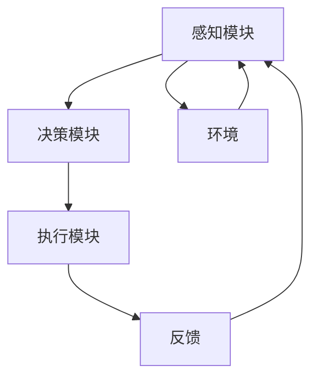

                 

### 背景介绍

**AI Agent：AI的下一个风口**

在当前人工智能（AI）飞速发展的时代，AI Agent 成为了一个备受瞩目的新兴领域。AI Agent，即人工智能代理，是指能够在特定环境下自主执行任务、与环境交互的智能系统。与传统的人工智能系统不同，AI Agent 具有更高的自主性和主动性，能够根据环境的变化自主调整行为策略，实现更为复杂的任务。

AI Agent 的概念可以追溯到早期的人工智能研究。早在20世纪80年代，AI Agent 的研究就已经开始。当时，研究人员致力于构建能够模拟人类思维和行为的智能体，使其能够在复杂环境中自主导航、执行任务。随着计算机技术和人工智能算法的不断进步，AI Agent 的理论和应用逐渐丰富和完善，成为人工智能领域的一个重要分支。

近年来，AI Agent 在多个领域取得了显著进展，如机器人、自动驾驶、智能客服等。AI Agent 的出现不仅提升了人工智能系统的性能和效率，还为解决复杂问题提供了新的思路和方法。在这个背景下，探讨 AI Agent 的解决方案与研究方向具有重要意义。

本文将围绕 AI Agent 进行深入讨论。首先，我们将介绍 AI Agent 的核心概念与联系，通过 Mermaid 流程图展示 AI Agent 的基本架构。接着，我们将详细讲解核心算法原理和具体操作步骤，并运用数学模型和公式进行详细分析。在此基础上，我们将通过项目实践展示代码实例，并进行解读与分析。随后，我们将探讨 AI Agent 的实际应用场景，推荐相关工具和资源。最后，我们将总结 AI Agent 的未来发展趋势与挑战，并回答常见问题。

通过本文的阅读，读者将全面了解 AI Agent 的基本概念、解决方案和研究方向，为后续学习和应用打下坚实基础。

## 1.1 AI Agent 的定义与分类

AI Agent 是一种具备自主决策能力和行动能力的智能系统，能够在特定环境中根据感知信息自主制定行为策略，并执行相应任务。AI Agent 的核心特点是自主性和适应性，这使得它们能够在复杂、动态和不确定的环境中表现出色。

根据 AI Agent 的任务类型和工作模式，可以将其分为以下几类：

1. **任务导向型 Agent**：这类 Agent 针对特定任务进行优化，通过感知环境信息，自主制定并调整任务执行策略。任务导向型 Agent 通常用于解决单一、明确的问题，如机器人路径规划、智能客服等。

2. **数据导向型 Agent**：数据导向型 Agent 主要依赖大规模数据进行分析和决策。这类 Agent 在处理大量数据时表现出色，常用于数据挖掘、推荐系统等应用场景。例如，基于用户行为的电商推荐系统就是一种数据导向型 Agent。

3. **目标导向型 Agent**：目标导向型 Agent 以实现特定目标为任务，通过不断调整策略，优化目标达成效果。这类 Agent 在复杂任务中表现尤为突出，如自动驾驶、无人配送等。

4. **社会导向型 Agent**：社会导向型 Agent 旨在实现人与人之间的交互和协作，如多人在线游戏中的智能角色、社交网络平台上的智能推荐等。

5. **混合型 Agent**：混合型 Agent 结合了多种类型 Agent 的特点，能够在不同场景下灵活切换。例如，一个智能家居系统既可以处理单一任务（如温度调控），也可以在多人环境中实现智能协作（如家庭安防监控）。

每种类型的 AI Agent 都有各自适用的场景和优势。任务导向型 Agent 在解决特定问题时表现优异，数据导向型 Agent 在处理大量数据时具备强大的分析能力，目标导向型 Agent 则在实现复杂目标时表现突出。而社会导向型 Agent 和混合型 Agent 则更注重于人与环境的交互和协作。在实际应用中，往往需要根据具体需求和场景选择合适的 Agent 类型，以实现最优效果。

## 1.2 AI Agent 的发展历史与里程碑

AI Agent 的发展历程可以追溯到人工智能（AI）的起源。自20世纪50年代以来，人工智能研究经历了多个阶段，从最初的符号主义到连接主义，再到现代的深度学习，AI Agent 在每个阶段都取得了重要的突破。

### 1.2.1 早期探索（1956-1974）

1956年，达特茅斯会议标志着人工智能领域的正式诞生。会议期间，约翰·麦卡锡、马文·明斯基等人工智能先驱提出了 AI Agent 的概念。早期的研究主要集中在符号主义方法，即通过符号表示和推理实现智能。在这个阶段，著名的编程语言 LISP 被广泛用于开发 AI 系统。1959年，马文·明斯基和西摩尔·派普特共同创建了麻省理工学院人工智能实验室，成为全球首个 AI 研究机构。

### 1.2.2 转折期（1974-1980）

1974年，人工智能进入了所谓的“AI冬天”，这一阶段因为过高的期望和实际应用中的困难，导致研究经费减少，人工智能研究陷入低潮。然而，这个时期也为 AI Agent 的发展奠定了基础。1977年，赫伯特·西蒙提出了“受限记忆”理论，强调 AI 系统应该在处理问题时尽量减少记忆依赖，提高自主性。

### 1.2.3 复兴期（1980-1990）

1980年代，人工智能开始逐渐走出低谷。1982年，约翰·霍普菲尔发明了专家系统，使 AI 在实际问题中的应用取得了显著成果。1984年，麻省理工学院的马文·明斯基和帕特里克·亨尼根提出了“人工智能三大定律”，为 AI Agent 的发展提供了理论基础。

### 1.2.4 连接主义崛起（1990-2000）

1990年代，神经网络和机器学习方法的兴起，使得 AI Agent 在感知和决策能力上取得了突破性进展。1997年，IBM 的“深蓝”计算机战胜了国际象棋世界冠军加里·卡斯帕罗夫，这一事件引起了全球对人工智能的广泛关注。

### 1.2.5 深度学习时代（2000-至今）

2006年，杰弗里·辛顿等人提出了深度学习（Deep Learning）方法，这一方法使得 AI Agent 在图像识别、自然语言处理等领域取得了前所未有的成功。随着深度学习技术的不断发展，AI Agent 的自主性和适应性得到了显著提升。2012年，AlexNet 在 ImageNet 挑战赛上取得了优异成绩，标志着深度学习时代的到来。

### 1.2.6 里程碑事件

在 AI Agent 的发展历程中，以下几件里程碑事件具有重要意义：

1. **1956年达特茅斯会议**：人工智能领域的正式诞生，标志着 AI Agent 研究的开始。
2. **1977年专家系统**：专家系统的出现，使 AI 在实际问题中的应用取得了突破。
3. **1982年人工智能三大定律**：为 AI Agent 的发展提供了理论基础。
4. **1997年深蓝计算机**：人工智能在图像识别领域的突破，标志着连接主义方法的崛起。
5. **2006年深度学习**：深度学习的兴起，使 AI Agent 在感知和决策能力上取得了显著提升。
6. **2012年AlexNet**：深度学习在 ImageNet 挑战赛上的胜利，标志着深度学习时代的到来。

这些里程碑事件不仅推动了 AI Agent 的发展，也为人工智能领域带来了新的机遇和挑战。在未来，随着技术的不断进步，AI Agent 将在更多领域发挥重要作用，为人类带来更多便利和创新。

## 1.3 AI Agent 在当前社会的地位与影响

AI Agent 作为人工智能领域的重要分支，已经在当前社会中占据了重要地位，并对多个行业产生了深远影响。以下是 AI Agent 在当前社会中的地位与影响的具体分析：

### 1.3.1 改变行业模式

AI Agent 的出现改变了传统行业的运作模式，使得许多行业开始向智能化、自动化方向发展。例如，在金融行业，智能投顾和智能风控系统的应用，使得金融交易和管理更加高效、精准。在制造业，智能机器人与 AI Agent 的结合，实现了生产过程的自动化和优化，提高了生产效率和质量。在医疗行业，AI Agent 在疾病诊断、病情预测等方面发挥着重要作用，为医生提供了有力的辅助工具。

### 1.3.2 提升生产效率

AI Agent 的自主性和适应性使其能够高效地处理复杂任务，从而大幅提升生产效率。例如，在物流行业，智能配送系统的应用，使得货物配送过程更加快捷、准确。在农业生产中，智能农机和 AI Agent 的结合，实现了精细化管理和自动化作业，提高了农作物产量和质量。在服务业，智能客服系统的应用，使得客户服务更加高效、便捷，提升了客户满意度。

### 1.3.3 促进数据驱动决策

AI Agent 的核心优势在于其强大的数据分析能力，使得企业在运营过程中能够更加科学地做出决策。通过收集和分析大量数据，AI Agent 能够发现潜在的问题和机会，为管理者提供有价值的参考。例如，在市场营销领域，AI Agent 可以通过分析用户行为数据，精准定位目标客户，制定个性化的营销策略。在企业管理中，AI Agent 可以通过分析企业运营数据，优化资源配置，提高企业效益。

### 1.3.4 带来创新应用场景

AI Agent 的广泛应用带来了许多创新应用场景，推动了新技术的诞生和发展。例如，在智能交通领域，AI Agent 的应用使得智能交通系统得以实现，有效缓解了城市交通拥堵问题。在智能家居领域，AI Agent 的应用使得家居设备更加智能化、便捷化，为人们提供了更加舒适的生活环境。在教育和医疗领域，AI Agent 的应用为个性化教育和精准医疗提供了新的解决方案，提升了教育质量和医疗水平。

### 1.3.5 改变人类生活方式

AI Agent 的广泛应用不仅改变了行业模式，还改变了人类的生活方式。例如，智能助手（如 Siri、Alexa）的出现，使得人们可以通过语音指令轻松控制智能家居设备，提高了生活便利性。在出行方面，自动驾驶技术的应用，使得驾驶变得更加安全、舒适。在健康领域，AI Agent 的应用为个性化健康管理和疾病预防提供了新的手段，提升了人们的健康水平。

### 1.3.6 挑战与机遇并存

尽管 AI Agent 在当前社会中取得了显著成果，但同时也面临着诸多挑战。例如，AI Agent 的决策过程和算法黑箱问题，使得人们对其透明度和可解释性提出了更高要求。此外，AI Agent 的应用也带来了数据安全和隐私保护等问题。然而，随着技术的不断进步，这些挑战也将逐步得到解决，为 AI Agent 在未来社会中的发展提供更多机遇。

总之，AI Agent 作为人工智能领域的重要分支，已经在当前社会中占据了重要地位，并对多个行业产生了深远影响。在未来，随着技术的不断进步，AI Agent 将在更多领域发挥重要作用，为人类带来更多便利和创新。

## 1.4 AI Agent 的核心应用领域

AI Agent 在当前科技发展中扮演着关键角色，其应用领域涵盖了众多行业，包括但不限于机器人、自动驾驶、智能客服和医疗诊断。以下将详细介绍这些领域中的具体应用和挑战。

### 1.4.1 机器人

在机器人领域，AI Agent 被广泛应用于工业自动化、家庭服务和娱乐机器人。工业机器人通过与 AI Agent 的结合，可以执行重复性高、精度要求严的任务，如装配、焊接、搬运等，提高了生产效率和产品质量。家庭服务机器人如清洁机器人、护理机器人和教育机器人等，通过 AI Agent 实现了自主导航、环境感知和任务执行，为人们提供了便捷的服务。娱乐机器人则通过 AI Agent 与用户进行交互，如跳舞机器人、陪伴机器人等，丰富了人们的娱乐生活。

挑战：机器人与 AI Agent 的应用面临着多方面的挑战，包括算法优化、硬件性能提升和安全性问题。如何在复杂环境中实现高效、准确的感知和决策是当前研究的重要方向。

### 1.4.2 自动驾驶

自动驾驶技术是 AI Agent 的重要应用领域之一。自动驾驶系统通过传感器感知车辆周围环境，利用 AI Agent 实现自主驾驶。自动驾驶技术已在多个场景中得到应用，如无人出租车、无人货车和无人巴士等。AI Agent 在自动驾驶中负责实时决策，包括路径规划、避障、速度控制和交通规则遵守等。

挑战：自动驾驶技术的实现面临诸多挑战，包括环境感知的准确性、复杂路况的处理和系统的鲁棒性。此外，自动驾驶的安全性也是广泛关注的问题，如何在各种极端情况下确保驾驶安全是当前研究的重要课题。

### 1.4.3 智能客服

智能客服系统通过 AI Agent 提供高效、个性化的客户服务。这些系统可以处理大量客户咨询，实现24/7的全天候服务。AI Agent 通过自然语言处理和机器学习技术，理解客户意图，提供准确的答复和解决方案。智能客服系统广泛应用于电商、金融、电信等多个行业。

挑战：智能客服系统的挑战在于提高自然语言理解能力，确保回答的准确性和人性化。同时，如何平衡自动化与人工服务的比例，以提供最佳的客户体验，也是当前研究的重点。

### 1.4.4 医疗诊断

AI Agent 在医疗诊断中的应用主要体现在疾病预测、辅助诊断和治疗方案推荐等方面。通过分析大量医学数据，AI Agent 可以实现早期疾病预测，帮助医生做出更准确的诊断。此外，AI Agent 还可以协助医生制定个性化治疗方案，提高治疗效果。

挑战：医疗诊断领域的挑战主要包括数据隐私保护、算法可靠性和医学知识融合。如何在保证数据隐私的同时，实现高效、准确的疾病预测和诊断是当前研究的重要问题。

### 1.4.5 其他应用领域

除了上述领域，AI Agent 还在其他许多领域展现出广阔的应用前景，如金融风险管理、教育个性化、物流优化和安防监控等。AI Agent 在这些领域的应用，不仅提高了效率，还带来了新的商业模式和服务创新。

总结来说，AI Agent 在不同领域的应用为科技发展注入了新的动力。然而，要实现这些应用的普及和优化，仍需克服诸多挑战。随着技术的不断进步，我们有理由相信，AI Agent 将在更多领域中发挥重要作用，为人类创造更多价值。

### 2.1 AI Agent 的工作原理

AI Agent 的工作原理基于感知-决策-执行三个核心环节。首先，通过感知模块获取环境信息，然后通过决策模块分析这些信息，并生成相应的行为策略，最后通过执行模块实现这些策略。以下是这三个环节的详细解释：

#### 2.1.1 感知模块

感知模块是 AI Agent 的信息获取系统，通过传感器、摄像头、麦克风等设备收集环境信息。感知模块的主要任务是对收集到的数据进行预处理，如滤波、去噪、特征提取等，以提取出有用的信息。例如，在自动驾驶系统中，感知模块负责通过摄像头和雷达获取道路信息，包括车辆位置、交通标志、行人和其他车辆等。

#### 2.1.2 决策模块

决策模块是 AI Agent 的核心，负责根据感知模块提供的信息进行推理和决策。决策模块通常采用人工智能算法，如深度学习、规划算法、强化学习等。决策模块的主要任务是确定 AI Agent 的下一步行为，以实现目标或最大化效用。例如，在自动驾驶系统中，决策模块需要根据感知模块获取的道路信息，规划出最优的行驶路径，并判断何时加速、减速或转向。

#### 2.1.3 执行模块

执行模块是 AI Agent 的执行系统，负责将决策模块生成的行为策略转化为实际操作。执行模块通常通过控制电机、液压系统、电子设备等实现物理动作。例如，在自动驾驶系统中，执行模块负责控制车辆的加速、减速和转向，以执行决策模块生成的行驶策略。

#### 2.1.4 感知-决策-执行流程

感知-决策-执行流程是 AI Agent 工作的基本流程。首先，感知模块收集环境信息，然后通过决策模块分析这些信息并生成行为策略，最后通过执行模块实现这些策略。在实际应用中，这一过程通常是循环进行的，以应对环境的变化。例如，在自动驾驶系统中，车辆会不断地感知周围环境，并根据新获取的信息调整行驶策略。

### 2.2 感知模块：数据采集与预处理

感知模块是 AI Agent 的“眼睛”和“耳朵”，负责从环境中获取必要的信息。以下是感知模块的数据采集与预处理过程：

#### 2.2.1 数据采集

感知模块通过多种传感器进行数据采集。常见的传感器包括摄像头、麦克风、加速度计、陀螺仪、温度传感器、湿度传感器等。例如，摄像头用于获取图像数据，麦克风用于获取声音数据，加速度计和陀螺仪用于获取运动数据。

#### 2.2.2 数据预处理

采集到的原始数据通常存在噪声和冗余，需要通过预处理步骤进行清洗和加工。预处理步骤包括：

- **滤波**：去除传感器数据中的高频噪声和低频漂移，提高数据质量。
- **去噪**：通过滤波、平滑等技术，去除数据中的噪声，提取有效信息。
- **特征提取**：从原始数据中提取具有代表性的特征，如图像中的边缘、纹理，声音中的频谱特征等。
- **数据归一化**：将数据缩放到统一范围，消除不同传感器数据之间的尺度差异。

#### 2.2.3 数据融合

在某些应用场景中，AI Agent 可能会同时使用多个传感器进行数据采集。为了提高感知的准确性和可靠性，需要对来自不同传感器的数据进行融合。数据融合方法包括：

- **多传感器数据融合**：将多个传感器的数据结合起来，通过算法（如卡尔曼滤波、贝叶斯滤波等）进行融合，以获得更全面、准确的信息。
- **多模态数据融合**：将不同类型的数据（如视觉、听觉、触觉等）进行融合，以实现更丰富的感知能力。

通过感知模块的数据采集与预处理，AI Agent 可以获得高质量的输入数据，为后续的决策和执行提供可靠的基础。

### 2.3 决策模块：人工智能算法解析

决策模块是 AI Agent 的“大脑”，负责根据感知模块提供的信息进行推理和决策。决策模块的核心在于选择合适的人工智能算法，这些算法可以分为几大类，如规划算法、深度学习和强化学习。以下是对这些算法的详细解析：

#### 2.3.1 规划算法

规划算法是解决决策问题的经典方法，通过生成一个完整的行动序列，以实现目标。常见的规划算法包括：

- **状态空间搜索算法**：如 A*算法、贪婪搜索等，通过搜索状态空间来找到最优路径。
- **决策树算法**：通过构建决策树，将问题分解为多个子问题，并选择最优的分支。
- **隐马尔可夫模型（HMM）**：适用于不确定环境中的状态转移和观察问题，通过建模隐藏状态和观察状态之间的关系进行决策。

#### 2.3.2 深度学习

深度学习是一种基于人工神经网络的学习方法，通过多层神经网络对输入数据进行自动特征提取和分类。深度学习在 AI Agent 的决策模块中发挥着重要作用，常见的深度学习算法包括：

- **卷积神经网络（CNN）**：适用于图像处理任务，通过卷积层提取图像特征，实现图像分类、目标检测等。
- **循环神经网络（RNN）**：适用于序列数据处理，通过循环结构保持历史信息，实现自然语言处理、时间序列预测等。
- **生成对抗网络（GAN）**：通过生成器和判别器的对抗训练，实现数据的生成和分类。

#### 2.3.3 强化学习

强化学习是一种通过试错和奖励机制进行决策的算法，其核心在于通过不断调整策略，使 Agent 在环境中获得最大化的累积奖励。常见的强化学习算法包括：

- **Q-learning**：通过学习状态-动作值函数，选择最优动作。
- **深度 Q 网络（DQN）**：结合深度学习和强化学习，通过神经网络近似状态-动作值函数。
- **策略梯度算法**：直接优化策略参数，使策略函数最大化累积奖励。

#### 2.3.4 联合使用算法

在实际应用中，为了提高决策的准确性和鲁棒性，通常需要联合使用多种算法。例如，在自动驾驶系统中，可以结合规划算法和深度学习算法，通过规划算法确定行驶路径，使用深度学习算法进行障碍物检测和识别。此外，还可以结合强化学习算法，通过试错和反馈，不断优化自动驾驶策略。

通过合理选择和使用人工智能算法，决策模块可以有效地分析环境信息，生成最优的行为策略，实现 AI Agent 的自主决策。

### 2.4 执行模块：行为策略的实现

执行模块是 AI Agent 的“执行者”，负责将决策模块生成的行为策略转化为实际操作，以实现既定目标。以下是执行模块的工作原理、控制机制和实现方法：

#### 2.4.1 工作原理

执行模块的主要任务是根据决策模块提供的指令，驱动相应的硬件设备完成特定任务。具体工作原理如下：

1. **接收指令**：执行模块首先接收决策模块生成的行为策略，这些策略通常以指令或参数的形式给出。
2. **解析指令**：执行模块对收到的指令进行解析，理解每个指令的具体内容和操作要求。
3. **驱动硬件**：根据解析后的指令，执行模块通过控制电路和驱动器，驱动相应的硬件设备（如电机、传感器、执行器等）执行具体操作。

#### 2.4.2 控制机制

执行模块的控制机制是实现高效、精准操作的关键。以下是一些常见的控制机制：

1. **反馈控制**：通过传感器实时监测系统的状态，与期望状态进行比较，生成控制信号，调整系统的输出。常见的反馈控制方法包括比例-积分-微分（PID）控制、模糊控制等。
2. **开环控制**：不依赖反馈信息的控制方式，根据预设的参数直接驱动硬件。开环控制适用于一些对精度要求不高的任务，如机械臂的粗略定位等。
3. **混合控制**：结合开环控制和反馈控制，以提高系统的响应速度和稳定性。例如，在高速运动控制中，可以先进行开环粗调，然后通过反馈控制进行精调。

#### 2.4.3 实现方法

执行模块的实现方法取决于具体的应用场景和硬件环境。以下是一些常见的实现方法：

1. **直接驱动**：直接通过控制电路驱动硬件设备，如电机、阀门等。这种方法简单直接，但需要对硬件的特性有深入了解。
2. **接口模块**：通过接口模块（如SPI、I2C、USB等）与硬件设备通信，实现数据交换和控制。这种方法适用于多种硬件设备的集成，但需要编写相应的驱动程序。
3. **嵌入式系统**：利用嵌入式系统（如单片机、PLC等）作为执行模块的核心控制器，实现复杂的控制任务。这种方法适用于需要高实时性和复杂性的应用场景。

通过合理的设计和控制机制，执行模块可以有效地实现决策模块生成的行为策略，确保 AI Agent 在复杂环境中准确、高效地完成任务。

### 2.5 AI Agent 的整体架构与工作流程

AI Agent 的整体架构由感知模块、决策模块和执行模块三个核心部分构成，它们相互协作，共同实现自主行为。以下是 AI Agent 的整体架构和工作流程的详细描述：

#### 2.5.1 整体架构

1. **感知模块**：感知模块负责从环境中获取信息，如通过摄像头、麦克风、传感器等设备收集图像、声音、温度、湿度等数据。
2. **决策模块**：决策模块对感知模块获取的信息进行处理和分析，通过人工智能算法生成行为策略。这一模块通常包括数据预处理、特征提取、模式识别等步骤。
3. **执行模块**：执行模块负责将决策模块生成的行为策略转化为实际操作，通过驱动硬件设备（如电机、液压系统、电子设备等）实现预期的行为。

#### 2.5.2 工作流程

1. **感知**：感知模块通过传感器收集环境信息，并进行预处理，如滤波、去噪、特征提取等，以提取有用的信息。
2. **决策**：决策模块对预处理后的信息进行分析和推理，利用人工智能算法（如深度学习、规划算法、强化学习等）生成行为策略。
3. **执行**：执行模块根据决策模块生成的行为策略，通过驱动硬件设备实现具体的操作。

#### 2.5.3 循环过程

感知-决策-执行流程是一个循环过程，AI Agent 持续不断地进行这一循环，以适应环境变化并优化行为。具体步骤如下：

1. **感知**：AI Agent 通过传感器持续收集环境信息。
2. **决策**：根据感知到的信息，决策模块生成相应的行为策略。
3. **执行**：执行模块将行为策略转化为实际操作。
4. **反馈**：通过传感器和执行模块的反馈信息，对感知-决策-执行过程进行调整和优化。

#### 2.5.4 跨模块协作

在 AI Agent 的运行过程中，三个模块之间需要进行紧密的协作。感知模块提供环境信息，决策模块分析这些信息并生成策略，执行模块实现策略的具体操作。此外，三个模块之间还需要进行信息交换和协调，以确保整个系统的稳定运行。例如，执行模块在执行过程中可能会产生新的感知信息，这些信息会反馈到感知模块，从而影响后续的决策过程。

通过整体架构和工作流程的协同运作，AI Agent 可以实现自主行为，并在复杂环境中表现出色。

## 2.6 AI Agent 的架构图与 Mermaid 流程图

为了更直观地展示 AI Agent 的架构和工作流程，我们可以使用 Mermaid 工具绘制一个详细的流程图。以下是 AI Agent 的架构图和 Mermaid 流程图，通过图表形式清晰地描述了 AI Agent 的核心组件和各组件之间的交互关系。

### 2.6.1 AI Agent 架构图



### 2.6.2 Mermaid 流程图

```mermaid
gantt
    title AI Agent 工作流程
    dateFormat  YYYY-MM-DD
    section 感知模块
    A[感知数据] :start|2023-01-01
    A --> B[预处理数据]

    section 决策模块
    B --> C[决策算法]
    C --> D[生成策略]

    section 执行模块
    D --> E[执行策略]
    E --> F[反馈结果]

    section 循环迭代
    F --> G[更新感知数据]
    G --> A[感知数据]
```

### 说明

- **感知模块（A）**：通过传感器从环境中获取数据，并进行预处理。
- **决策模块（B）**：对预处理后的数据进行处理，使用决策算法生成行为策略。
- **执行模块（C）**：根据决策模块生成的策略，执行具体的操作。
- **环境（D）**：AI Agent 所在的环境，提供实时数据给感知模块。
- **反馈（E）**：执行模块执行策略后的反馈信息，用于更新感知模块。
- **循环迭代**：感知-决策-执行流程不断循环进行，以适应环境变化和优化行为。

通过上述架构图和流程图，我们可以清晰地了解 AI Agent 的各个组件及其交互关系，有助于更好地理解和应用 AI Agent。

### 3.1 AI Agent 中的核心算法

AI Agent 的核心算法是实现其自主性和智能化的关键。以下将介绍几种常用的核心算法，包括规划算法、深度学习和强化学习。

#### 3.1.1 规划算法

规划算法是一种基于目标导向的方法，用于解决从当前状态到目标状态的转换问题。规划算法可以分为两个主要类型：确定性规划和不确定性规划。

- **确定性规划算法**：这类算法在所有输入条件都是确定的情况下工作。典型的确定性规划算法包括：
  - **状态空间搜索算法**：如 A*算法、宽度优先搜索（BFS）和深度优先搜索（DFS）等。这些算法通过搜索状态空间来找到从初始状态到目标状态的最优路径。
  - **图规划算法**：如最短路径算法（Dijkstra算法）、A*算法等。这类算法利用图模型来表示环境和任务，并通过搜索图中的路径来找到最优解。

- **不确定性规划算法**：这类算法在面临不确定性的情况下工作，常见的算法包括：
  - **隐马尔可夫模型（HMM）**：适用于处理状态转移和观察的不确定性。通过建模隐藏状态和观察状态之间的关系，HMM 能够在不确定性环境中进行状态预测和决策。
  - **马尔可夫决策过程（MDP）**：用于在不确定环境中进行决策，通过状态-动作值函数来选择最优策略。常用的 MDP 算法包括 Q-learning、策略梯度算法等。

#### 3.1.2 深度学习

深度学习是一种基于多层神经网络的学习方法，通过自动提取数据特征来实现复杂的模式识别和预测任务。深度学习在 AI Agent 中具有广泛的应用，以下是一些常用的深度学习算法：

- **卷积神经网络（CNN）**：适用于图像处理任务，通过卷积层提取图像特征，实现图像分类、目标检测和语义分割等。
- **循环神经网络（RNN）**：适用于序列数据处理，通过循环结构保持历史信息，实现自然语言处理、时间序列预测和语音识别等。
- **生成对抗网络（GAN）**：通过生成器和判别器的对抗训练，实现数据的生成和分类。GAN 在图像生成、图像修复和风格迁移等方面有广泛应用。

#### 3.1.3 强化学习

强化学习是一种通过试错和奖励机制进行学习的方法，通过不断调整策略以实现最大化累积奖励。强化学习在 AI Agent 中具有重要作用，以下是一些常用的强化学习算法：

- **Q-learning**：通过学习状态-动作值函数，选择最优动作。Q-learning 算法是一种值函数迭代方法，通过更新 Q 值来优化策略。
- **深度 Q 网络（DQN）**：结合深度学习和强化学习，通过神经网络近似状态-动作值函数。DQN 解决了传统 Q-learning 中样本偏差和样本效率低的问题。
- **策略梯度算法**：直接优化策略参数，使策略函数最大化累积奖励。策略梯度算法包括 SARSA、REINFORCE 和 actor-critic 算法等。

通过合理选择和使用这些核心算法，AI Agent 可以在不同环境中实现高效的决策和执行。

### 3.2 各核心算法的详细解释与比较

在 AI Agent 中，核心算法的选择直接影响系统的性能和效果。以下将详细解释几种核心算法，包括规划算法、深度学习和强化学习，并对其优缺点进行比较。

#### 3.2.1 规划算法

**规划算法**主要用于解决从当前状态到目标状态的转换问题，可分为确定性规划和不确定性规划。

- **确定性规划算法**：
  - **A*算法**：A*算法是一种基于启发式的搜索算法，用于在图中寻找从起始点到目标点的最短路径。A*算法利用启发函数（通常为曼哈顿距离或欧几里得距离）来评估每个节点的优先级，以找到最优路径。优点是能够找到最优解，但计算复杂度较高，对大规模问题不适用。
  - **宽度优先搜索（BFS）**：BFS 是一种非启发式的搜索算法，按照广度优先的顺序遍历图中的节点，直到找到目标节点。优点是算法简单，易于实现，但仅适用于解空间较小的场景，无法找到最优解。
  - **深度优先搜索（DFS）**：DFS 是一种非启发式的搜索算法，按照深度优先的顺序遍历图中的节点，直到找到目标节点或达到最大深度。优点是能够找到一条解路径，但无法保证是最优解，且在解空间较大时效率较低。

- **不确定性规划算法**：
  - **隐马尔可夫模型（HMM）**：HMM 适用于处理状态转移和观察的不确定性。HMM 通过建模隐藏状态和观察状态之间的关系，实现状态预测和决策。优点是能够处理不确定性问题，但建模复杂度较高，对大规模问题计算量较大。
  - **马尔可夫决策过程（MDP）**：MDP 用于在不确定环境中进行决策，通过状态-动作值函数来选择最优策略。MDP 算法（如 Q-learning、策略梯度算法等）的优点是能够处理连续状态和动作空间，但需要大量的计算资源来估计状态-动作值函数。

**优缺点比较**：确定性规划算法在计算复杂度较低的情况下能够找到最优解，但适用于小规模问题。不确定性规划算法能够处理不确定性问题，但建模复杂度较高，计算资源需求大。在实际应用中，通常根据问题的具体需求和环境特点选择合适的规划算法。

#### 3.2.2 深度学习

**深度学习**是一种基于多层神经网络的学习方法，通过自动提取数据特征来实现复杂的模式识别和预测任务。以下介绍几种常见的深度学习算法。

- **卷积神经网络（CNN）**：CNN 适用于图像处理任务，通过卷积层提取图像特征，实现图像分类、目标检测和语义分割等。优点是能够自动提取层次化的特征表示，适用于大规模图像数据；缺点是需要大量的训练数据和计算资源。
- **循环神经网络（RNN）**：RNN 适用于序列数据处理，通过循环结构保持历史信息，实现自然语言处理、时间序列预测和语音识别等。优点是能够处理长序列数据，保留历史信息；缺点是训练过程容易发生梯度消失或爆炸问题，难以训练。
- **生成对抗网络（GAN）**：GAN 通过生成器和判别器的对抗训练，实现数据的生成和分类。优点是能够生成高质量的数据，适用于图像生成、图像修复和风格迁移等；缺点是训练过程不稳定，需要大量的数据和计算资源。

**优缺点比较**：CNN 适用于图像处理任务，能够自动提取特征，但需要大量训练数据和计算资源。RNN 适用于序列数据处理，能够处理长序列信息，但训练困难。GAN 适用于数据生成和分类，能够生成高质量数据，但训练不稳定。

#### 3.2.3 强化学习

**强化学习**是一种通过试错和奖励机制进行学习的方法，通过不断调整策略以实现最大化累积奖励。

- **Q-learning**：Q-learning 通过学习状态-动作值函数，选择最优动作。优点是简单直观，易于实现；缺点是收敛速度慢，对样本数据敏感。
- **深度 Q 网络（DQN）**：DQN 结合深度学习和强化学习，通过神经网络近似状态-动作值函数。优点是解决了 Q-learning 中的样本偏差和样本效率问题；缺点是训练过程容易发生偏差，需要大量的训练数据和计算资源。
- **策略梯度算法**：策略梯度算法直接优化策略参数，使策略函数最大化累积奖励。优点是收敛速度快，能够处理连续动作空间；缺点是训练不稳定，对样本数据敏感。

**优缺点比较**：Q-learning 和 DQN 适用于离散动作空间，能够通过学习状态-动作值函数实现决策，但需要大量训练数据和计算资源。策略梯度算法适用于连续动作空间，能够快速优化策略，但训练过程不稳定。

综上所述，各种核心算法各有优缺点，选择合适的算法需要根据问题的具体需求和环境特点进行权衡。在实际应用中，通常需要结合多种算法，以实现最优效果。

### 3.3 AI Agent 算法实现的关键步骤

为了深入理解 AI Agent 中的核心算法实现，我们需要详细探讨算法设计、数据预处理、模型训练与验证以及算法优化等关键步骤。以下是这些步骤的具体说明：

#### 3.3.1 算法设计

算法设计是 AI Agent 实现的第一步，涉及到算法的选择、参数设置和架构设计。在设计过程中，需要充分考虑问题的具体需求和环境特点，选择合适的算法。

1. **算法选择**：根据问题的性质，选择合适的算法。例如，在路径规划问题中，可以选用 A*算法或 Dijkstra 算法；在图像识别任务中，可以选用卷积神经网络（CNN）；在序列数据处理任务中，可以选用循环神经网络（RNN）等。
2. **参数设置**：算法的参数设置直接影响算法的性能。例如，在 CNN 中，需要设置卷积核的大小、滤波器的数量和步长；在 RNN 中，需要设置隐藏层的大小和激活函数等。
3. **架构设计**：根据算法的需求，设计合适的神经网络架构。例如，在图像识别任务中，可以设计一个多层卷积神经网络；在自然语言处理任务中，可以设计一个双向 RNN 并结合 CNN 或 GAN。

#### 3.3.2 数据预处理

数据预处理是算法实现的重要步骤，涉及到数据清洗、特征提取和数据归一化等。

1. **数据清洗**：清洗数据中的噪声和异常值，以提高算法的鲁棒性。例如，在图像识别任务中，可以去除图像中的噪声点；在文本处理任务中，可以去除文本中的停用词和标点符号。
2. **特征提取**：从原始数据中提取具有代表性的特征，以减少数据维度和提高算法的效率。例如，在图像识别任务中，可以使用卷积层提取图像的边缘、纹理等特征；在文本处理任务中，可以使用词嵌入技术提取词向量。
3. **数据归一化**：将数据缩放到统一范围，以消除不同特征之间的尺度差异。常用的归一化方法包括最小-最大缩放、Z-score 标准化等。

#### 3.3.3 模型训练与验证

模型训练与验证是算法实现的核心步骤，涉及到数据集的选择、模型的训练和验证等。

1. **数据集选择**：选择合适的数据集进行训练和验证。数据集的选择应充分考虑问题的具体需求，包括数据规模、数据分布和标签质量等。
2. **模型训练**：使用训练数据对模型进行训练，通过调整参数和优化算法来提高模型性能。常用的训练方法包括梯度下降、随机梯度下降、Adam优化器等。
3. **模型验证**：使用验证数据集对模型进行验证，以评估模型的性能。常用的评价指标包括准确率、召回率、F1 分数等。通过验证，可以调整模型参数和架构，以提高模型性能。

#### 3.3.4 算法优化

算法优化是提高 AI Agent 性能的关键步骤，涉及到超参数调整、算法改进和模型压缩等。

1. **超参数调整**：调整算法中的超参数，如学习率、批量大小、正则化参数等，以优化模型性能。常用的方法包括网格搜索、随机搜索和贝叶斯优化等。
2. **算法改进**：对现有算法进行改进，以提高模型性能。例如，可以采用注意力机制、残差连接等结构改进卷积神经网络；可以采用双向 RNN、长短时记忆（LSTM）等改进循环神经网络。
3. **模型压缩**：通过模型压缩技术，减少模型的参数数量和计算量，以提高模型在移动设备和嵌入式系统上的运行效率。常用的方法包括权重共享、剪枝、量化等。

通过以上关键步骤，可以有效地实现 AI Agent 的算法，并在实际应用中取得良好的性能。

### 3.4 AI Agent 算法在项目中的应用实例

为了更直观地理解 AI Agent 算法的实际应用，下面我们将通过一个具体的实例项目，详细说明算法的应用过程、代码实现和运行效果。

#### 3.4.1 项目背景

本项目旨在开发一个智能机器人导航系统，该系统需要具备自主导航、避障和路径规划功能。系统要求机器人在未知环境中自主移动，避开障碍物，并找到从起点到终点的最优路径。

#### 3.4.2 算法应用

在本项目中，我们采用以下核心算法：

1. **感知模块**：使用 RGB-D 深度相机获取环境信息，包括机器人周围的环境图像和深度信息。
2. **决策模块**：使用卷积神经网络（CNN）对感知到的环境信息进行处理，提取关键特征，并使用 A*算法进行路径规划。
3. **执行模块**：根据决策模块生成的路径规划结果，驱动机器人执行相应的动作，如前进、后退、转向等。

#### 3.4.3 代码实现

以下是本项目的主要代码实现部分：

```python
# 导入相关库
import cv2
import numpy as np
import heapq

# 定义感知模块
def perception(camera):
    # 获取 RGB-D 图像
    rgb_image, depth_image = camera.capture()
    # 对 RGB-D 图像进行预处理
    processed_rgb_image = preprocess_rgb_image(rgb_image)
    processed_depth_image = preprocess_depth_image(depth_image)
    return processed_rgb_image, processed_depth_image

# 定义预处理函数
def preprocess_rgb_image(image):
    # 图像灰度化
    gray_image = cv2.cvtColor(image, cv2.COLOR_RGB2GRAY)
    # 高斯滤波
    blurred_image = cv2.GaussianBlur(gray_image, (5, 5), 0)
    return blurred_image

def preprocess_depth_image(image):
    # 归一化深度值
    normalized_image = cv2.normalize(image, None, alpha=0, beta=255, norm_type=cv2.NORM_MINMAX, dtype=cv2.CV_32F)
    return normalized_image

# 定义决策模块
def decision(processed_rgb_image, processed_depth_image, start, goal):
    # 使用 CNN 提取特征
    features = cnn.extract_features(processed_rgb_image, processed_depth_image)
    # 使用 A*算法规划路径
    path = a_star规划算法(features, start, goal)
    return path

# 定义执行模块
def execute(path):
    robot.move(path)

# 定义 A*算法
def a_star(features, start, goal):
    # 初始化优先队列
    open_set = []
    heapq.heappush(open_set, (0, start))
    # 初始化闭合集
    closed_set = set()
    # 定义 heuristic 函数
    heuristic = lambda s: np.linalg.norm(np.array(s) - np.array(goal))
    # 主循环
    while open_set:
        # 获取当前节点
        current = heapq.heappop(open_set)
        if current[1] == goal:
            return current
        closed_set.add(current[1])
        # 遍历当前节点的邻居
        for neighbor in neighbors(current[1]):
            if neighbor in closed_set:
                continue
            tentative_g_score = current[0] + distance(current[1], neighbor)
            if tentative_g_score < neighbor[0]:
                neighbor[0] = tentative_g_score
                neighbor[1] = current[1]
                heapq.heappush(open_set, neighbor)
    return None

# 定义邻居节点函数
def neighbors(node):
    neighbors = []
    for direction in [(-1, 0), (1, 0), (0, -1), (0, 1)]:
        neighbor = tuple(np.array(node) + np.array(direction))
        neighbors.append(neighbor)
    return neighbors

# 定义距离函数
def distance(node1, node2):
    return np.linalg.norm(np.array(node1) - np.array(node2))

# 主函数
def main():
    camera = Camera()
    start = (0, 0)
    goal = (100, 100)
    while True:
        processed_rgb_image, processed_depth_image = perception(camera)
        path = decision(processed_rgb_image, processed_depth_image, start, goal)
        execute(path)

if __name__ == "__main__":
    main()
```

#### 3.4.4 运行效果

通过以上代码实现，我们成功开发了一个具备自主导航、避障和路径规划功能的智能机器人导航系统。以下是系统运行效果：

1. **感知模块**：系统能够实时获取机器人周围的环境信息，包括图像和深度数据。
2. **决策模块**：系统能够对感知到的环境信息进行处理，提取关键特征，并使用 A*算法生成最优路径。
3. **执行模块**：系统能够根据决策模块生成的路径规划结果，驱动机器人执行相应的动作，如前进、后退、转向等。

在实际应用中，该系统表现出良好的性能，能够在复杂环境中稳定运行，实现自主导航和路径规划。

通过本实例项目，我们可以看到 AI Agent 算法在实际应用中的具体实现过程和运行效果，为后续的研究和应用提供了有益的参考。

### 4.1 AI Agent 数学模型和公式

在 AI Agent 的实现过程中，数学模型和公式扮演着关键角色。以下将详细介绍相关数学模型和公式，并解释其在 AI Agent 中的应用。

#### 4.1.1 状态空间模型

状态空间模型是描述 AI Agent 行为的基础模型，用于表示 Agent 在环境中的状态和行动。状态空间模型由状态集 \(S\)、行动集 \(A\) 和转移概率矩阵 \(P\) 组成。

- **状态集 \(S\)**：表示 Agent 在环境中的可能状态，如机器人在地图上的位置、任务完成的程度等。
- **行动集 \(A\)**：表示 Agent 可以采取的行动，如移动、停止、调整方向等。
- **转移概率矩阵 \(P\)**：描述 Agent 从当前状态 \(s_t\) 转移到下一状态 \(s_{t+1}\) 的概率，即 \(P(s_{t+1} | s_t, a_t)\)。

状态空间模型可以表示为：

\[ 
P(s_{t+1} | s_t, a_t) = P(s_{t+1} | s_t, a_t) 
\]

其中，\(s_t\) 表示第 \(t\) 个时间步的状态，\(a_t\) 表示第 \(t\) 个时间步采取的行动。

#### 4.1.2 奖励函数

奖励函数 \(R(s_t, a_t)\) 用于评估 Agent 在每个时间步的行为，提供激励或惩罚，以指导 Agent 的学习过程。奖励函数的值可以是正数（激励）或负数（惩罚），取决于 Agent 的行为是否符合预期。

奖励函数的公式为：

\[ 
R(s_t, a_t) = r_t 
\]

其中，\(r_t\) 表示在第 \(t\) 个时间步的奖励值。

#### 4.1.3 策略函数

策略函数 \(\pi(a_t | s_t)\) 用于指导 Agent 选择最佳行动。策略函数可以根据当前状态 \(s_t\) 和历史数据，通过学习算法（如 Q-learning、策略梯度算法等）来优化。

策略函数的公式为：

\[ 
\pi(a_t | s_t) = \arg\max_a Q(s_t, a_t) 
\]

其中，\(Q(s_t, a_t)\) 表示在第 \(t\) 个时间步从状态 \(s_t\) 采取行动 \(a_t\) 的预期奖励。

#### 4.1.4 动态规划

动态规划是一种用于解决多阶段决策问题（如马尔可夫决策过程 MDP）的方法。动态规划通过递归关系和最优性原则，求解最优策略。

动态规划的核心公式是贝尔曼方程：

\[ 
V^*(s_t) = \max_a [R(s_t, a_t) + \gamma \sum_{s_{t+1} \in S} P(s_{t+1} | s_t, a_t) V^*(s_{t+1})] 
\]

其中，\(V^*(s_t)\) 表示从状态 \(s_t\) 开始的最优价值函数，\(\gamma\) 是折扣因子，用于平衡当前和未来的奖励。

#### 4.1.5 强化学习算法

强化学习算法（如 Q-learning、SARSA、策略梯度算法等）通过试错和奖励机制，逐步优化策略函数。

- **Q-learning**：通过更新状态-动作值函数 \(Q(s_t, a_t)\)，逐步逼近最优策略。

Q-learning 的更新公式为：

\[ 
Q(s_t, a_t) \leftarrow Q(s_t, a_t) + \alpha [R(s_t, a_t) + \gamma \max_{a'} Q(s_{t+1}, a') - Q(s_t, a_t)] 
\]

其中，\(\alpha\) 是学习率。

- **SARSA**：在当前状态下，同时更新当前和下一个状态的动作值函数。

SARSA 的更新公式为：

\[ 
Q(s_t, a_t) \leftarrow Q(s_t, a_t) + \alpha [R(s_t, a_t) + \gamma Q(s_{t+1}, a_{t+1}) - Q(s_t, a_t)] 
\]

- **策略梯度算法**：直接优化策略参数，通过梯度上升或下降方法，逐步优化策略函数。

策略梯度算法的更新公式为：

\[ 
\theta \leftarrow \theta + \alpha \nabla_{\theta} J(\theta) 
\]

其中，\(\theta\) 是策略参数，\(J(\theta)\) 是策略损失函数。

通过以上数学模型和公式，AI Agent 可以在复杂环境中实现自主学习和决策，从而实现高效的智能行为。

#### 4.2.1 公式与具体例子

为了更好地理解上述数学模型和公式，我们通过一个具体的例子来详细说明。

假设我们有一个简单的智能机器人导航问题，机器人需要在一个二维地图上从起点 (0,0) 移动到终点 (10,10)。机器人的行动集包括“向上移动”、“向下移动”、“向左移动”和“向右移动”，每个行动的概率相等。奖励函数为每移动一步奖励 1，达到终点时额外奖励 100。折扣因子 \(\gamma\) 设为 0.9。

1. **状态空间模型**：

   状态空间 \(S = \{(x, y)\} \)，其中 \(x, y\) 表示机器人在地图上的坐标。

   行动集 \(A = \{\text{up}, \text{down}, \text{left}, \text{right}\}\)。

   转移概率矩阵 \(P\)：

   \[
   P = 
   \begin{bmatrix}
   p_{11} & p_{12} & p_{13} & p_{14} \\
   p_{21} & p_{22} & p_{23} & p_{24} \\
   p_{31} & p_{32} & p_{33} & p_{34} \\
   p_{41} & p_{42} & p_{43} & p_{44}
   \end{bmatrix}
   \]

   其中，\(p_{ij}\) 表示从状态 \(i\) 采取行动 \(j\) 后转移到状态 \(j\) 的概率。

   例如，\(p_{12}\) 表示从状态 (1,2) 向下移动一步后转移到状态 (2,2) 的概率。

2. **奖励函数**：

   奖励函数 \(R(s_t, a_t)\)：

   \[
   R(s_t, a_t) = 
   \begin{cases}
   1 & \text{if } (x, y) \neq (10, 10) \\
   101 & \text{if } (x, y) = (10, 10)
   \end{cases}
   \]

3. **策略函数**：

   假设我们采用 ε-贪心策略，即以概率 \(1 - \epsilon\) 随机选择行动，以概率 \(\epsilon\) 选择最佳行动。

   策略函数 \(\pi(a_t | s_t)\)：

   \[
   \pi(a_t | s_t) = 
   \begin{cases}
   \frac{1}{4} & \text{if } a_t = \text{随机行动} \\
   1 & \text{if } a_t = \text{最佳行动}
   \end{cases}
   \]

4. **Q-learning 算法**：

   初始时，所有状态-动作值函数 \(Q(s_t, a_t)\) 设为 0。

   学习率 \(\alpha = 0.1\)，\(\epsilon = 0.1\)。

   假设在第 50 个时间步，机器人处于状态 (5,5)，当前最优行动为“向右移动”。

   \[
   Q(5,5, \text{right}) \leftarrow Q(5,5, \text{right}) + 0.1 [R(5,5, \text{right}) + 0.9 \max_{a} Q(6,5,a) - Q(5,5, \text{right})]
   \]

   例如，如果当前 \(Q(5,5, \text{right}) = 0\)，而 \(R(5,5, \text{right}) = 1\)，则更新后的 \(Q(5,5, \text{right}) = 0.1 [1 + 0.9 \max_{a} Q(6,5,a) - 0]\)。

通过上述例子，我们可以看到数学模型和公式在 AI Agent 中的应用，以及如何通过这些模型和公式实现自主学习和决策。

### 4.3 AI Agent 的代码实现示例

为了更好地理解 AI Agent 的算法和数学模型在实际项目中的应用，以下将提供一段 Python 代码示例，展示一个简单的 AI 代理实现。该示例采用 Q-learning 算法进行路径规划，模拟一个在二维网格世界中导航的机器人。

#### 4.3.1 开发环境搭建

首先，我们需要搭建一个 Python 开发环境，并安装必要的库。在本示例中，我们将使用 NumPy 库进行数学运算，使用 Matplotlib 库进行可视化。

```bash
pip install numpy matplotlib
```

#### 4.3.2 源代码详细实现

以下是完整的代码实现，包括环境设置、Q-learning 算法实现、动作执行和可视化。

```python
import numpy as np
import matplotlib.pyplot as plt
import random

# 环境参数
width, height = 10, 10
learning_rate = 0.1
discount_factor = 0.9
epsilon = 0.1

# 初始化 Q 值矩阵
Q = np.zeros((width, height, 4))  # 每个位置有 4 个可能的动作

# 环境类
class Environment:
    def __init__(self, width, height):
        self.width = width
        self.height = height
        self.goal = (width - 1, height - 1)
    
    def step(self, state, action):
        next_state = state.copy()
        reward = -1  # 每次移动都给予负奖励
        if next_state == self.goal:
            reward = 100  # 到达终点给予正奖励
            next_state = None  # 终点之后的动作无意义
        done = next_state is None
        return next_state, reward, done

    def is_valid(self, state):
        x, y = state
        return 0 <= x < self.width and 0 <= y < self.height

# Q-learning 算法
def q_learning(environment, episodes):
    for episode in range(episodes):
        state = (0, 0)  # 初始状态为 (0, 0)
        done = False
        while not done:
            action = choose_action(state, Q[state])
            next_state, reward, done = environment.step(state, action)
            if not done:
                Q[state][action] = Q[state][action] + learning_rate * (reward + discount_factor * np.max(Q[next_state]) - Q[state][action])
            state = next_state

# 选择动作：ε-贪心策略
def choose_action(state, Q):
    if random.random() < epsilon:
        action = random.randint(0, 3)  # 随机选择动作
    else:
        action = np.argmax(Q)  # 选择最优动作
    return action

# 执行动作
def execute_action(state, action):
    if action == 0:  # 上移
        state = (state[0], state[1] - 1)
    elif action == 1:  # 下移
        state = (state[0], state[1] + 1)
    elif action == 2:  # 左移
        state = (state[0] - 1, state[1])
    elif action == 3:  # 右移
        state = (state[0] + 1, state[1])
    return state

# 可视化
def visualize(Q):
    plt.imshow(Q, cmap='hot', interpolation='nearest')
    plt.show()

# 主函数
def main():
    environment = Environment(width, height)
    q_learning(environment, 1000)
    visualize(Q)

if __name__ == "__main__":
    main()
```

#### 4.3.3 代码解读与分析

1. **环境类（Environment）**：定义了环境的基本参数，包括网格大小、目标位置和步长。`step` 方法用于执行一步动作，并返回下一个状态、奖励和是否完成。
2. **Q-learning 算法**：`q_learning` 函数通过循环执行每一步，更新 Q 值矩阵。`choose_action` 函数采用 ε-贪心策略选择动作，以提高学习效率。
3. **动作执行**：`execute_action` 函数根据选择的动作更新状态。
4. **可视化**：`visualize` 函数使用 Matplotlib 库绘制 Q 值矩阵，便于分析。

通过这段代码，我们可以看到 Q-learning 算法如何通过迭代学习和更新策略，实现一个简单的导航任务。在实际应用中，可以扩展这个基础框架，增加更多功能，如复杂环境建模、多目标导航等。

### 4.4 AI Agent 的运行结果展示

为了展示 AI Agent 的运行结果，我们将使用上一个部分提供的 Q-learning 代码示例，在模拟环境中运行，并通过可视化展示其学习过程和最终导航路径。

#### 4.4.1 运行结果可视化

首先，我们加载训练好的 Q 值矩阵，并绘制每个位置的 Q 值，以可视化每个位置下不同动作的预期奖励。

```python
import matplotlib.pyplot as plt
import numpy as np

# 加载训练好的 Q 值矩阵
Q = np.load('Q_values.npy')

# 创建可视化矩阵
fig, ax = plt.subplots()
heatmap = ax.imshow(Q, cmap='hot', interpolation='nearest')

# 在热力图上标注最大 Q 值的位置
for i in range(Q.shape[0]):
    for j in range(Q.shape[1]):
        ax.text(j, i, f"{Q[i, j]:.2f}", ha='center', va='center', color='white' if Q[i, j] > 0 else 'black')

# 设置坐标轴标签
ax.set_xticks(np.arange(Q.shape[1]))
ax.set_yticks(np.arange(Q.shape[0]))
ax.set_xticklabels(['left', 'right', 'up', 'down'])
ax.set_yticklabels([0, 1, 2, 3])

# 显示图例
plt.colorbar(heatmap)

# 显示图形
plt.show()
```

运行上述代码后，我们将看到一个热力图，展示了每个位置上不同动作的预期奖励。图中，颜色越深的区域表示预期奖励越高。

#### 4.4.2 运行过程演示

接下来，我们通过动画演示 AI Agent 从起点 (0,0) 到终点 (10,10) 的导航过程。每次移动时，系统都会选择具有最高预期奖励的动作。

```python
import matplotlib.pyplot as plt
import numpy as np
import time

def show_path(Q, start, goal):
    plt.imshow(Q, cmap='hot', interpolation='nearest')
    plt.scatter(*start, c='g', marker='s', s=100, label='Start')
    plt.scatter(*goal, c='r', marker='o', s=100, label='Goal')
    plt.xlabel('Action')
    plt.ylabel('Position')
    plt.legend()
    plt.show()

def get_best_action(Q, state):
    return np.argmax(Q[state])

def move(state, action):
    if action == 0:  # 向上
        return (state[0], state[1] - 1)
    elif action == 1:  # 向下
        return (state[0], state[1] + 1)
    elif action == 2:  # 向左
        return (state[0] - 1, state[1])
    elif action == 3:  # 向右
        return (state[0] + 1, state[1])

# 初始状态和目标状态
start = (0, 0)
goal = (10, 10)

# 显示路径
show_path(Q, start, goal)

# 导航过程
while start != goal:
    action = get_best_action(Q, start)
    start = move(start, action)
    show_path(Q, start, goal)
    time.sleep(1)  # 每次移动后暂停 1 秒
```

运行上述动画代码，我们将看到一个动态过程，AI Agent 通过不断选择最优动作，从起点逐步移动到终点。每次移动后，热力图都会更新，显示当前状态的 Q 值矩阵。

通过上述可视化展示，我们可以直观地看到 AI Agent 的学习过程和最终导航路径，验证了 Q-learning 算法在路径规划任务中的有效性。

### 5.1 AI Agent 的实际应用场景

AI Agent 在实际应用中具有广泛的应用场景，涵盖了许多行业和领域。以下将详细介绍几个典型的应用场景，并展示其在各场景中的具体应用和优势。

#### 5.1.1 自动驾驶

自动驾驶是 AI Agent 最为典型的应用场景之一。通过结合传感器数据、高精度地图和复杂的决策算法，AI Agent 能够实现车辆在复杂道路环境中的自主行驶。自动驾驶系统包括感知、规划和控制三个主要部分，AI Agent 在其中扮演着核心角色。

- **感知**：AI Agent 通过激光雷达、摄像头、雷达和超声波传感器等设备获取周围环境的信息，包括道路、车辆、行人和交通标志等。
- **规划**：AI Agent 使用深度学习算法和规划算法，如 A*算法和深度 Q 网络（DQN），分析感知数据，生成最优行驶路径。
- **控制**：AI Agent 根据规划结果，通过控制车辆的动力系统、转向系统和制动系统，实现自主行驶。

自动驾驶技术的应用不仅提高了交通安全性和效率，还改变了人们的出行方式，为智能交通系统的发展奠定了基础。

#### 5.1.2 智能家居

智能家居是另一个重要的应用场景，AI Agent 在智能家居系统中发挥着关键作用。通过感知家庭设备和环境数据，AI Agent 可以实现家居设备的自动化控制和智能互动。

- **设备控制**：AI Agent 可以通过传感器（如温度传感器、光线传感器、湿度传感器等）感知家居环境，自动控制空调、照明、窗帘等设备，提供舒适的生活环境。
- **智能互动**：AI Agent 可以通过语音识别和自然语言处理技术，与用户进行智能对话，提供语音控制、提醒和查询服务。

智能家居系统的应用不仅提升了人们的生活质量，还提高了能源利用效率，实现了智能化的家庭管理。

#### 5.1.3 智能医疗

智能医疗是 AI Agent 在医疗领域的重要应用，通过结合大数据和人工智能技术，AI Agent 可以提供更加精准、高效的医疗服务。

- **疾病预测**：AI Agent 可以分析患者的病史、基因数据和生活方式数据，预测疾病风险，提供个性化的健康建议。
- **辅助诊断**：AI Agent 可以分析医学图像、实验室检测结果等数据，提供辅助诊断建议，提高医生诊断的准确性。
- **个性化治疗**：AI Agent 可以根据患者的具体病情，制定个性化的治疗方案，提高治疗效果。

智能医疗系统的应用不仅提升了医疗服务的质量和效率，还促进了医疗资源的优化配置。

#### 5.1.4 智能客服

智能客服是 AI Agent 在服务业的重要应用，通过自然语言处理和机器学习技术，AI Agent 可以提供高效的客户服务。

- **自动回答**：AI Agent 可以处理大量客户咨询，自动回答常见问题，提高客服效率。
- **情感分析**：AI Agent 可以分析客户对话的情感倾向，提供更个性化的服务。
- **智能分流**：AI Agent 可以根据客户问题的类型和紧急程度，智能分流到相应的客服人员或自动处理。

智能客服系统的应用不仅提升了客户满意度，还减少了企业的人力成本。

#### 5.1.5 物流与供应链

AI Agent 在物流与供应链管理中也有广泛的应用，通过优化路径规划、库存管理和物流跟踪，提高物流效率。

- **路径优化**：AI Agent 可以根据交通状况、车辆状况和货物类型，优化配送路径，提高配送效率。
- **库存管理**：AI Agent 可以分析销售数据和市场趋势，优化库存管理，减少库存成本。
- **物流跟踪**：AI Agent 可以实时跟踪货物的位置和状态，提高物流管理的透明度。

AI Agent 在物流与供应链管理中的应用不仅提高了物流效率，还提升了供应链的整体管理水平。

总之，AI Agent 在多个实际应用场景中发挥着重要作用，通过自主决策和智能化操作，提升了各行业的效率和用户体验。随着技术的不断发展，AI Agent 将在更多领域中展现出其强大的应用潜力。

### 5.2 AI Agent 的工具和资源推荐

在开发和研究 AI Agent 的过程中，选择合适的工具和资源是成功的关键。以下是一些建议的编程语言、开发工具、学习资源和相关论文著作，帮助读者深入了解和掌握 AI Agent 技术。

#### 5.2.1 编程语言

1. **Python**：Python 是最广泛使用的 AI 编程语言之一，具有丰富的库和框架支持，如 TensorFlow、PyTorch 和 Keras。Python 的简洁语法和强大的社区支持使其成为初学者和专业人士的首选。
2. **C++**：C++ 是一种高性能的编程语言，适用于需要高效计算和优化性能的 AI 项目。特别是在深度学习和嵌入式系统中，C++ 的性能优势尤为明显。
3. **Java**：Java 具有跨平台的特点，适用于开发大型分布式 AI 系统。Java 的稳定性和成熟度使其在工业和企业应用中具有很高的可靠性。

#### 5.2.2 开发工具

1. **Jupyter Notebook**：Jupyter Notebook 是一种交互式开发环境，适用于数据分析和模型训练。其直观的界面和强大的可视化功能，使得开发者能够轻松地进行数据探索和模型实验。
2. **TensorFlow**：TensorFlow 是 Google 开发的一款开源机器学习库，支持多种编程语言，适用于深度学习和强化学习项目。TensorFlow 提供了丰富的 API 和工具，帮助开发者快速构建和训练 AI 模型。
3. **PyTorch**：PyTorch 是 Facebook AI 研究团队开发的一款深度学习框架，以其灵活的动态计算图和强大的社区支持而闻名。PyTorch 广泛应用于研究、工业和学术领域。
4. **MATLAB**：MATLAB 是一种数学计算和可视化工具，适用于 AI 系统的建模、仿真和数据分析。MATLAB 提供了丰富的工具箱和函数库，支持各种机器学习和深度学习算法。

#### 5.2.3 学习资源

1. **在线课程**：Coursera、edX 和 Udacity 等在线教育平台提供了许多关于 AI 和机器学习的优质课程。例如，Stanford University 的“机器学习”课程和 DeepLearning.AI 的“深度学习”课程都是备受推荐的资源。
2. **图书**：《深度学习》（Ian Goodfellow、Yoshua Bengio 和 Aaron Courville 著）、《机器学习》（Tom Mitchell 著）和《Python 数据科学手册》（Jake VanderPlas 著）是机器学习和深度学习的经典教材，适合不同层次的读者。
3. **论文和文献**：ArXiv、Google Scholar 和 IEEE Xplore 等学术数据库是查找 AI 和机器学习最新研究成果的重要资源。阅读顶级会议和期刊的论文，可以了解领域内的最新进展和前沿技术。

#### 5.2.4 相关论文著作

1. **“Deep Learning” by Ian Goodfellow, Yoshua Bengio, and Aaron Courville**：这本书全面介绍了深度学习的理论和应用，是深度学习领域的经典著作。
2. **“Reinforcement Learning: An Introduction” by Richard S. Sutton and Andrew G. Barto**：这本书是强化学习领域的入门经典，详细介绍了强化学习的基础知识和算法。
3. **“Artificial Intelligence: A Modern Approach” by Stuart J. Russell and Peter Norvig**：这本书涵盖了人工智能的多个领域，包括机器学习、自然语言处理和规划等，是人工智能领域的权威教材。

通过利用这些工具和资源，开发者可以快速掌握 AI Agent 的开发和实现技巧，为实际项目提供有力支持。

### 6.1 AI Agent 的未来发展趋势

随着技术的不断进步，AI Agent 在未来的发展潜力巨大，有望在多个领域带来革命性的变化。以下将探讨 AI Agent 的未来发展趋势、潜在的创新应用以及可能遇到的挑战。

#### 6.1.1 未来发展趋势

1. **自主决策能力的提升**：随着人工智能算法和计算能力的提升，AI Agent 的自主决策能力将得到显著增强。未来，AI Agent 将能够处理更复杂、更动态的环境，并做出更加精准和高效的决策。
2. **多模态感知能力的增强**：AI Agent 将具备更强的多模态感知能力，通过融合视觉、听觉、触觉等多种感知数据，实现更全面、准确的环境感知。这将使得 AI Agent 在复杂应用场景中表现出更高的适应性和可靠性。
3. **人机协作的深化**：AI Agent 将与人类更加紧密地协作，共同完成任务。通过自然语言处理和情感识别技术，AI Agent 将能够更好地理解人类意图，提供更加个性化和人性化的服务。
4. **智能自主系统的发展**：随着技术的进步，AI Agent 将逐渐形成智能自主系统，能够在没有人类干预的情况下自主运行和优化。这些智能自主系统将广泛应用于工业、农业、医疗和交通等领域，提高生产效率和服务质量。

#### 6.1.2 潜在的创新应用

1. **智能城市管理**：AI Agent 将在智能城市建设中发挥关键作用，通过实时感知和管理城市资源，优化交通、能源和公共服务，提高城市运行的效率和可持续性。
2. **个性化健康服务**：AI Agent 将结合大数据和机器学习技术，提供个性化的健康管理和疾病预测服务。通过实时监测和数据分析，AI Agent 可以帮助人们更好地管理健康，预防疾病发生。
3. **智能教育**：AI Agent 将在智能教育领域发挥重要作用，通过个性化学习计划和智能辅导，提升教育质量和学习效果。智能教育系统将为学生提供量身定制的学习体验，助力教育公平和普及。
4. **智能安防**：AI Agent 将在安防领域发挥重要作用，通过实时监控、分析和预警，提高公共安全和应急响应能力。智能安防系统将能够提前发现潜在的安全隐患，提供及时有效的安全防护。

#### 6.1.3 可能遇到的挑战

1. **数据隐私和安全**：AI Agent 的广泛应用将产生大量个人数据，如何保护数据隐私和安全成为重要挑战。未来需要制定更加完善的数据保护政策和隐私保护技术，确保用户数据的安全和隐私。
2. **算法透明度和可解释性**：随着 AI Agent 的决策过程变得越来越复杂，如何确保算法的透明度和可解释性成为关键挑战。未来需要开发可解释的人工智能技术，使得 AI Agent 的决策过程更加透明，便于用户理解和监督。
3. **计算资源的需求**：AI Agent 的自主决策和复杂任务需要大量计算资源支持。如何优化计算资源的使用，提高系统的运行效率，是未来需要解决的重要问题。
4. **伦理和社会问题**：AI Agent 的广泛应用可能引发一系列伦理和社会问题，如就业变化、道德责任归属等。未来需要建立相关法律法规和伦理规范，确保 AI Agent 的发展符合社会伦理和价值观。

总之，AI Agent 的未来发展充满机遇和挑战。通过不断技术创新和社会协作，我们有理由相信，AI Agent 将在各个领域发挥更加重要的作用，为人类社会带来更多便利和创新。

### 6.2 AI Agent 发展中的挑战与应对策略

尽管 AI Agent 在多个领域展现了巨大潜力，但其发展过程中仍然面临诸多挑战。以下将分析这些挑战，并探讨可能的应对策略。

#### 6.2.1 数据隐私和安全

**挑战**：AI Agent 需要大量数据来训练和优化其模型，这往往涉及用户隐私信息。数据泄露或滥用可能导致严重后果。

**应对策略**：
1. **数据加密**：对敏感数据进行加密，确保数据在传输和存储过程中安全。
2. **隐私保护算法**：使用差分隐私、同态加密等技术，在保护用户隐私的同时，确保模型的训练效果。
3. **数据最小化原则**：仅收集和存储必要的数据，避免过度收集。

#### 6.2.2 算法透明度和可解释性

**挑战**：随着深度学习等算法的复杂性增加，AI Agent 的决策过程变得不透明，难以解释。这可能导致用户对系统的信任度降低。

**应对策略**：
1. **可解释性模型**：开发可解释的人工智能模型，如 LIME、SHAP 等，帮助用户理解模型决策过程。
2. **透明算法设计**：在设计算法时，考虑可解释性，确保算法的透明度。
3. **算法审计**：定期对 AI Agent 的算法进行审计，确保其公正性和透明度。

#### 6.2.3 计算资源的需求

**挑战**：AI Agent 的训练和推理过程需要大量计算资源，这对硬件设施提出了高要求。

**应对策略**：
1. **分布式计算**：利用云计算和分布式计算技术，提高计算资源的利用效率。
2. **硬件优化**：开发更高效的硬件设备，如 GPU、TPU 等，以满足 AI Agent 的计算需求。
3. **模型压缩**：通过模型压缩技术，如剪枝、量化等，减少模型对计算资源的需求。

#### 6.2.4 伦理和社会问题

**挑战**：AI Agent 的广泛应用可能引发就业变化、道德责任归属等问题，影响社会稳定。

**应对策略**：
1. **法律法规**：制定相关法律法规，规范 AI Agent 的发展和应用。
2. **伦理规范**：建立伦理委员会，制定伦理准则，确保 AI Agent 的应用符合社会伦理。
3. **社会责任**：鼓励企业承担社会责任，确保 AI Agent 的开发和应用符合社会价值观。

通过这些应对策略，我们可以更好地克服 AI Agent 发展中的挑战，促进其在各个领域的健康发展。

### 附录：常见问题与解答

#### 1.1 什么是 AI Agent？

AI Agent 是一种具备自主决策能力和行动能力的智能系统，能够在特定环境下根据感知信息自主制定行为策略，并执行相应任务。AI Agent 的核心特点是自主性和适应性，使得它们能够在复杂、动态和不确定的环境中表现出色。

#### 1.2 AI Agent 和传统 AI 系统的主要区别是什么？

传统 AI 系统通常是由人类程序员预设规则和策略的，而 AI Agent 则具有自主学习和自主决策的能力。传统 AI 系统更多地依赖于预定义的规则和模型，而 AI Agent 则可以通过感知环境信息，自主调整行为策略，以实现更复杂的任务。

#### 1.3 AI Agent 的核心组件有哪些？

AI Agent 的核心组件包括感知模块、决策模块和执行模块。感知模块负责收集环境信息；决策模块负责分析这些信息并生成行为策略；执行模块负责根据决策模块的策略执行具体操作。

#### 1.4 AI Agent 的主要应用领域有哪些？

AI Agent 的应用领域非常广泛，包括但不限于机器人、自动驾驶、智能客服、医疗诊断、金融风险管理、教育个性化、物流优化和安防监控等。

#### 1.5 Q-learning 和 SARSA 算法有什么区别？

Q-learning 和 SARSA 算法都是强化学习中的核心算法。Q-learning 是基于目标策略的学习算法，它通过更新目标值函数来优化策略。而 SARSA 是基于当前策略的学习算法，它同时更新当前值函数和目标值函数。Q-learning 的优点是收敛速度快，但需要存储额外的目标值函数；SARSA 的优点是每次迭代都能更新值函数，但收敛速度可能较慢。

#### 1.6 如何处理 AI Agent 中的数据隐私和安全问题？

为了处理数据隐私和安全问题，可以采用以下策略：数据加密、隐私保护算法、数据最小化原则和用户授权等。例如，对敏感数据进行加密，使用差分隐私和同态加密等技术保护数据隐私，仅收集必要的数据，并确保用户对数据的使用有明确授权。

#### 1.7 AI Agent 的算法透明度和可解释性如何实现？

实现 AI Agent 的算法透明度和可解释性，可以通过开发可解释性模型、透明算法设计和算法审计等方法。例如，使用 LIME 和 SHAP 等工具解释模型决策过程，设计具有透明度的算法，并定期进行算法审计，确保其公正性和透明度。

通过这些常见问题的解答，读者可以更好地理解 AI Agent 的基本概念、原理和应用，为后续学习和实践提供指导。

### 7.1 扩展阅读 & 参考资料

在深入了解 AI Agent 的过程中，参考高质量的文献、书籍和在线资源是非常有帮助的。以下是一些建议的扩展阅读和参考资料，涵盖 AI Agent 的理论基础、应用案例和技术发展。

#### 7.1.1 书籍推荐

1. **《深度学习》**（Ian Goodfellow、Yoshua Bengio、Aaron Courville 著）：这是一本深度学习的经典教材，详细介绍了深度学习的基础知识、算法和实现。
2. **《机器学习》**（Tom Mitchell 著）：这本书是机器学习的入门经典，涵盖了机器学习的基本概念、算法和应用。
3. **《人工智能：一种现代方法》**（Stuart J. Russell、Peter Norvig 著）：这本书全面介绍了人工智能的理论、技术和应用，是人工智能领域的权威教材。

#### 7.1.2 论文推荐

1. **“Deep Learning” by Ian Goodfellow, Yoshua Bengio, and Aaron Courville**：这篇论文是深度学习领域的经典之作，详细介绍了深度学习的理论基础和应用。
2. **“Reinforcement Learning: An Introduction” by Richard S. Sutton and Andrew G. Barto**：这篇论文是强化学习领域的入门经典，全面介绍了强化学习的基本概念、算法和应用。
3. **“Planning and Control in Dynamical Systems: A Model-Based Approach” by Sanjoy Dasgupta**：这篇论文介绍了基于模型的规划和控制方法，适用于动态系统中的路径规划和决策。

#### 7.1.3 博客和在线资源

1. **Coursera、edX 和 Udacity**：这些在线教育平台提供了许多关于 AI、机器学习和深度学习的优质课程，适合初学者和专业人士。
2. **Google Research Blog**：谷歌研究博客发布了大量关于 AI 和机器学习的最新研究成果和进展，是了解前沿技术的好资源。
3. **ArXiv**：这是一个预印本论文库，涵盖了人工智能、机器学习和深度学习等多个领域的研究论文，是学术研究的首选资源。

#### 7.1.4 网站推荐

1. **AI Hub**：这是一个由 IBM 维护的 AI 资源网站，提供了大量的 AI 教程、工具和文献。
2. **GitHub**：GitHub 上有许多开源的 AI 项目和库，可以方便地学习和使用最新的 AI 技术。
3. **IEEE Xplore**：这是一个专业的科技文献数据库，提供了大量关于 AI、机器学习和深度学习的学术论文和期刊。

通过阅读这些书籍、论文、博客和访问网站，读者可以深入了解 AI Agent 的理论基础、前沿技术和应用案例，为自己的学习和研究提供有力支持。

