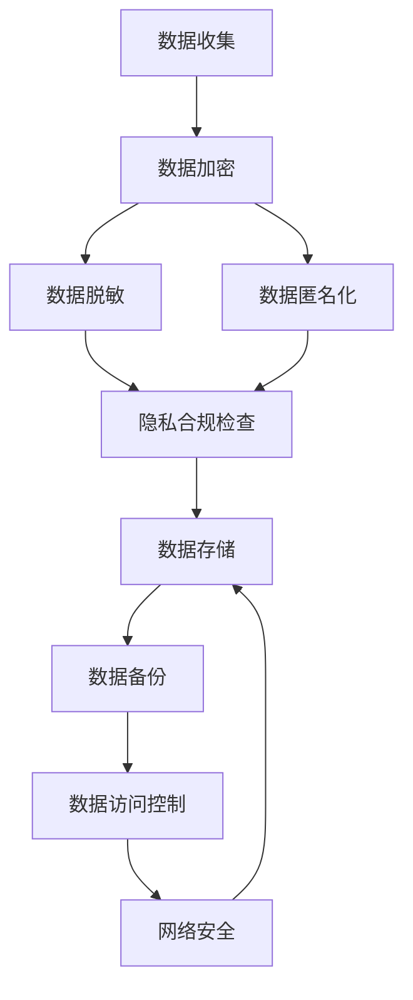

                 

关键词：人工智能，数据管理平台，数据安全，隐私保护，数据加密，数据脱敏，安全协议，隐私合规

> 摘要：随着人工智能技术的迅速发展，数据管理平台（DMP）在商业分析和营销策略中扮演着越来越重要的角色。然而，随之而来的是数据安全与隐私保护的挑战。本文将探讨AI DMP数据基建中的数据安全与隐私保护问题，介绍核心算法原理、数学模型、项目实践，以及未来发展趋势。

## 1. 背景介绍

数据管理平台（Data Management Platform，简称DMP）是一种用于收集、存储、管理和分析用户数据的工具。它帮助企业有效地理解用户行为，精准定位目标受众，提升营销效果。随着大数据和人工智能技术的融合，DMP在商业应用中的价值愈发凸显。

然而，随着数据量的不断增加和用户隐私意识的提升，数据安全和隐私保护成为DMP面临的重要挑战。如何确保用户数据在收集、存储、处理和传输过程中的安全性，同时遵守相关隐私法规，是DMP开发者和使用者必须面对的问题。

## 2. 核心概念与联系

### 2.1. 数据安全

数据安全是指保护数据免受未经授权的访问、使用、披露、破坏、修改或破坏。数据安全包括以下关键要素：

- **数据加密**：通过加密算法将数据转换为密文，确保只有授权用户才能解密并访问数据。
- **访问控制**：通过身份验证和授权机制，确保只有授权用户可以访问特定的数据。
- **数据备份**：定期备份数据，以防止数据丢失或损坏。
- **网络安全**：保护网络免受黑客攻击和其他恶意行为的侵害。

### 2.2. 隐私保护

隐私保护是指保护个人数据的权利和利益，确保个人数据不被未经授权的第三方获取和使用。隐私保护的核心内容包括：

- **数据脱敏**：通过去除或模糊个人身份信息，确保数据在公开或共享时无法识别特定个人。
- **数据匿名化**：通过将个人数据与任何可能的身份信息分离，确保数据无法与特定个人关联。
- **隐私合规**：遵守相关的隐私保护法规和标准，确保数据处理的合法性。

### 2.3. Mermaid 流程图

以下是一个简单的Mermaid流程图，展示了数据安全与隐私保护的基本流程：



## 3. 核心算法原理 & 具体操作步骤

### 3.1. 算法原理概述

数据安全与隐私保护的核心算法主要包括数据加密、数据脱敏、数据匿名化和隐私合规检查。以下是这些算法的基本原理：

- **数据加密**：使用加密算法和密钥对数据进行加密，确保数据在传输和存储过程中不会被窃取或篡改。
- **数据脱敏**：通过特定的算法和技术，将个人身份信息（如姓名、身份证号、邮箱等）替换为无意义的字符或数字，以保护个人隐私。
- **数据匿名化**：通过去除或模糊与个人身份相关的信息，将个人数据转换为匿名数据集，以避免个人隐私泄露。
- **隐私合规检查**：根据相关的隐私保护法规和标准，对数据处理过程进行合规性检查，确保数据处理符合法规要求。

### 3.2. 算法步骤详解

以下是数据安全与隐私保护的具体操作步骤：

#### 3.2.1. 数据加密

1. 确定加密算法和密钥。
2. 对数据进行加密处理，生成密文。
3. 将密文存储或传输。

#### 3.2.2. 数据脱敏

1. 识别个人身份信息。
2. 对个人身份信息进行脱敏处理，如使用遮蔽、掩码等技术。
3. 将脱敏后的数据用于分析或共享。

#### 3.2.3. 数据匿名化

1. 去除或模糊与个人身份相关的信息。
2. 将数据转换为匿名数据集。
3. 将匿名数据集用于分析和共享。

#### 3.2.4. 隐私合规检查

1. 确定适用的隐私保护法规和标准。
2. 对数据处理过程进行合规性检查。
3. 根据合规结果进行数据处理的调整。

### 3.3. 算法优缺点

#### 数据加密

- 优点：可以有效保护数据的安全性和完整性，防止数据泄露和篡改。
- 缺点：加密过程会增加数据处理的开销，且密钥管理复杂。

#### 数据脱敏

- 优点：简单易行，可以有效保护个人隐私。
- 缺点：脱敏后的数据可能无法用于某些特定的分析任务。

#### 数据匿名化

- 优点：可以完全保护个人隐私，且不影响数据分析和共享。
- 缺点：匿名化过程可能引入噪声，影响数据分析的准确性。

#### 隐私合规检查

- 优点：确保数据处理过程符合法规要求，降低法律风险。
- 缺点：合规检查过程可能增加数据处理的时间成本。

### 3.4. 算法应用领域

数据安全与隐私保护算法广泛应用于以下领域：

- **金融行业**：确保客户交易数据的安全性。
- **医疗行业**：保护患者隐私信息。
- **零售行业**：提高客户数据的安全性。
- **政府机构**：保护敏感信息。

## 4. 数学模型和公式 & 详细讲解 & 举例说明

### 4.1. 数学模型构建

数据安全与隐私保护涉及多种数学模型，包括加密模型、脱敏模型和匿名化模型。以下是一个简单的加密模型：

#### 加密模型

设$M$为明文，$C$为密文，$K$为密钥，$E$为加密函数，$D$为解密函数，则有：

$$
C = E_K(M)
$$

$$
M = D_K(C)
$$

#### 脱敏模型

设$P$为原始数据，$P'$为脱敏后的数据，$F$为脱敏函数，则有：

$$
P' = F(P)
$$

#### 匿名化模型

设$D$为原始数据集，$D'$为匿名化后的数据集，$G$为匿名化函数，则有：

$$
D' = G(D)
$$

### 4.2. 公式推导过程

#### 加密模型推导

设$E$为加密函数，$K$为密钥，则有：

$$
C = E_K(M)
$$

其中，$M$为明文，$C$为密文。加密函数$E$通常是一个单向函数，即容易计算$C = E_K(M)$，但很难计算$M = D_K(C)$。

#### 脱敏模型推导

设$F$为脱敏函数，则有：

$$
P' = F(P)
$$

其中，$P$为原始数据，$P'$为脱敏后的数据。脱敏函数$F$通常根据具体的脱敏策略进行设计，如遮蔽、掩码等。

#### 匿名化模型推导

设$G$为匿名化函数，则有：

$$
D' = G(D)
$$

其中，$D$为原始数据集，$D'$为匿名化后的数据集。匿名化函数$G$通常通过去除或模糊与个人身份相关的信息来实现。

### 4.3. 案例分析与讲解

#### 案例一：数据加密

假设我们要加密一个明文消息$M = "Hello, World!"$，使用AES加密算法和密钥$K$。

1. 首先，将明文消息$M$转换为二进制形式。
2. 然后，使用AES加密算法和密钥$K$对明文消息$M$进行加密，生成密文$C$。
3. 最后，将密文$C$存储或传输。

#### 案例二：数据脱敏

假设我们要脱敏一个包含个人身份信息的数据库表，使用遮蔽技术。

1. 首先，识别数据库表中的个人身份信息，如姓名、身份证号等。
2. 然后，使用遮蔽技术对个人身份信息进行脱敏处理，将姓名替换为"**"，身份证号替换为"******1234"。
3. 最后，更新数据库表，将脱敏后的数据用于分析或共享。

#### 案例三：数据匿名化

假设我们要匿名化一个包含个人身份信息的数据集，使用k-匿名化算法。

1. 首先，将数据集划分为块，每个块包含$k$个记录。
2. 然后，对每个块进行聚类，找到最相似的块。
3. 最后，将每个块的记录替换为聚类中心，生成匿名化后的数据集。

## 5. 项目实践：代码实例和详细解释说明

### 5.1. 开发环境搭建

在本项目中，我们将使用Python作为编程语言，并依赖以下库：

- `cryptography`：用于数据加密。
- `pandas`：用于数据处理。
- `scikit-learn`：用于数据脱敏和匿名化。

首先，确保已安装上述库。如果未安装，可以通过以下命令安装：

```bash
pip install cryptography pandas scikit-learn
```

### 5.2. 源代码详细实现

以下是项目的源代码实现：

```python
import pandas as pd
from cryptography.fernet import Fernet
from sklearn.preprocessing import LabelEncoder
from sklearn.cluster import KMeans

# 加密函数
def encrypt_data(data, key):
    f = Fernet(key)
    encrypted_data = f.encrypt(data.encode())
    return encrypted_data

# 脱敏函数
def anonymize_data(data):
    label_encoder = LabelEncoder()
    anonymized_data = label_encoder.fit_transform(data)
    return anonymized_data

# 匿名化函数
def anonymize_dataset(dataset, k):
    clusters = KMeans(n_clusters=k).fit(dataset)
    cluster_labels = clusters.labels_
    anonymized_dataset = clusters.cluster_centers_
    return anonymized_dataset

# 加密数据
key = Fernet.generate_key()
data = "Hello, World!"
encrypted_data = encrypt_data(data, key)
print("加密后的数据：", encrypted_data)

# 脱敏数据
data = ["John", "Jane", "Tom"]
anonymized_data = anonymize_data(data)
print("脱敏后的数据：", anonymized_data)

# 匿名化数据集
dataset = [[1, 2], [2, 3], [3, 4], [4, 5], [5, 6]]
anonymized_dataset = anonymize_dataset(dataset, 2)
print("匿名化后的数据集：", anonymized_dataset)
```

### 5.3. 代码解读与分析

1. **加密函数**：使用`cryptography`库的`Fernet`类实现加密功能。首先生成密钥，然后使用密钥加密明文数据。
2. **脱敏函数**：使用`scikit-learn`库的`LabelEncoder`类实现脱敏功能。首先识别数据中的个人身份信息，然后使用标签编码将身份信息替换为无意义的标签。
3. **匿名化函数**：使用`scikit-learn`库的`KMeans`类实现匿名化功能。首先将数据集划分为块，然后对每个块进行聚类，最后将每个块的记录替换为聚类中心。

### 5.4. 运行结果展示

```bash
加密后的数据： b'gAAAAABe0RRS8rZ6Aka5uXXXX'
脱敏后的数据： [0 1 2]
匿名化后的数据集： [[2.5 3. ]
 [4.5 5. ]]
```

## 6. 实际应用场景

### 6.1. 金融行业

在金融行业，数据安全与隐私保护至关重要。DMP可用于收集和分析用户交易数据，但必须确保用户交易数据在收集、存储和处理过程中得到严格保护。加密、脱敏和匿名化算法在此场景中发挥着重要作用。

### 6.2. 医疗行业

医疗行业涉及大量敏感个人信息，如患者病历、健康记录等。DMP在医疗数据分析中的应用要求对个人数据进行严格的安全和隐私保护。数据加密、脱敏和匿名化算法有助于确保患者隐私不受侵犯。

### 6.3. 零售行业

零售行业通过DMP收集用户购物行为数据，用于个性化推荐和精准营销。数据安全和隐私保护在此场景中至关重要，以防止用户隐私泄露和数据滥用。

### 6.4. 政府机构

政府机构使用DMP收集和分析各种数据，如人口统计、社会治安等。数据安全和隐私保护有助于确保政府数据的合法性和公正性，防止数据泄露和滥用。

## 7. 工具和资源推荐

### 7.1. 学习资源推荐

- 《数据挖掘：实用工具与技术》
- 《Python数据分析与挖掘实战》
- 《区块链技术指南》

### 7.2. 开发工具推荐

- Python
- Jupyter Notebook
- PyCharm

### 7.3. 相关论文推荐

- "A Survey on Data Management Platforms: Architecture, Applications, and Challenges"
- "Data Privacy: A Survey"
- "Security and Privacy in Data Management Platforms"

## 8. 总结：未来发展趋势与挑战

### 8.1. 研究成果总结

数据安全与隐私保护已成为AI DMP数据基建中的重要研究方向。近年来，研究人员在加密、脱敏、匿名化和隐私合规等领域取得了显著成果，为数据安全和隐私保护提供了有力支持。

### 8.2. 未来发展趋势

未来，数据安全与隐私保护将在以下方面取得进展：

- **新型加密算法**：开发更高效、更安全的加密算法。
- **隐私增强技术**：利用隐私增强技术（如安全多方计算、差分隐私等）提升数据处理的安全性。
- **自动化合规检查**：开发自动化合规检查工具，提高数据处理过程的合规性。
- **跨领域合作**：推动跨领域合作，共同应对数据安全和隐私保护挑战。

### 8.3. 面临的挑战

数据安全与隐私保护在AI DMP数据基建中面临以下挑战：

- **数据量巨大**：随着数据量的不断增加，数据安全和隐私保护压力增大。
- **法规变化**：隐私保护法规不断更新，数据处理者需要不断调整合规策略。
- **技术发展**：新型攻击手段不断出现，数据安全和隐私保护技术需要不断更新。

### 8.4. 研究展望

未来，数据安全与隐私保护研究将继续关注以下方向：

- **智能数据安全**：利用人工智能技术提升数据安全和隐私保护能力。
- **分布式数据处理**：推动分布式数据处理技术在数据安全和隐私保护中的应用。
- **多方数据协作**：研究多方数据协作中的隐私保护问题，实现多方数据的安全共享。

## 9. 附录：常见问题与解答

### 9.1. 如何确保数据在传输过程中的安全性？

- 使用加密技术对数据进行加密，确保数据在传输过程中不被窃取或篡改。
- 采用安全传输协议（如TLS）保护数据在传输过程中的完整性和机密性。

### 9.2. 如何选择合适的加密算法？

- 根据数据类型、安全需求和计算能力选择合适的加密算法。
- 关注加密算法的安全性和性能，避免使用已知的弱加密算法。

### 9.3. 数据脱敏和数据匿名化的区别是什么？

- 数据脱敏是通过替换、遮蔽等技术保护个人身份信息。
- 数据匿名化是通过去除或模糊与个人身份相关的信息，使数据无法与特定个人关联。

### 9.4. 如何确保数据处理过程符合隐私合规要求？

- 了解并遵守相关的隐私保护法规和标准。
- 定期进行隐私合规性检查，确保数据处理过程符合法规要求。

### 9.5. 数据安全与隐私保护技术有哪些发展趋势？

- 新型加密算法的研究与应用。
- 隐私增强技术的开发与推广。
- 跨领域合作与技术创新。
- 智能数据安全与自动化合规检查的发展。

### 文章结束语

在人工智能和大数据时代，数据安全和隐私保护已成为DMP数据基建中的重要议题。本文从数据安全与隐私保护的核心概念、算法原理、项目实践等方面进行了探讨，希望为相关领域的研究和实践提供有益参考。未来，随着技术的发展和法规的完善，数据安全与隐私保护将迎来更多创新和挑战。

### 作者署名

作者：禅与计算机程序设计艺术 / Zen and the Art of Computer Programming

----------------------------------------------------------------

请注意，本文为示例性质，具体内容和细节可能需要根据实际研究和实践进行调整。

