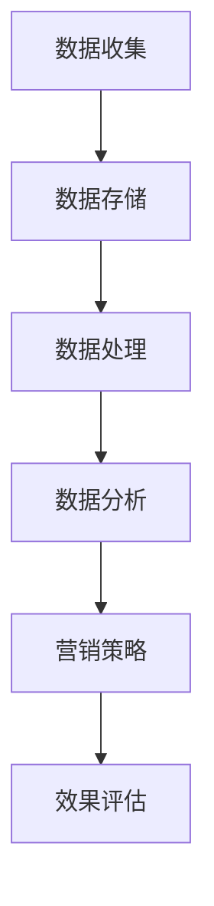

                 

### 背景介绍

随着大数据和人工智能技术的迅猛发展，数据驱动的营销已经成为企业竞争的关键。在这种趋势下，AI DMP（Data Management Platform，数据管理平台）应运而生。AI DMP 是一种先进的营销技术，通过整合和分析海量用户数据，为企业提供精准的营销策略和个性化服务。本文将详细介绍 AI DMP 数据基建的核心概念、算法原理、实践应用以及未来发展趋势，帮助读者了解数据驱动营销的新时代。

### 核心概念与联系

#### 1. 数据管理平台（DMP）

数据管理平台（DMP）是一种用于收集、存储、管理和分析用户数据的系统。它能够将来自多个渠道的数据整合到一个统一的平台上，以便企业能够更好地了解目标受众，制定精准的营销策略。DMP 的核心功能包括：

- **数据收集**：通过 Web 分析、第三方数据源、客户关系管理（CRM）系统等途径，收集用户行为数据、兴趣偏好等。
- **数据存储**：将收集到的数据进行结构化存储，以便快速查询和分析。
- **数据处理**：对数据进行清洗、去重、聚合等处理，提高数据质量。
- **数据分析**：利用数据分析工具，对用户行为、兴趣等进行深入挖掘，为企业提供决策支持。

#### 2. AI 技术在 DMP 中的应用

人工智能（AI）技术在 DMP 中发挥着至关重要的作用。以下是一些典型的 AI 技术在 DMP 中的应用：

- **机器学习**：通过机器学习算法，对海量用户行为数据进行挖掘和分析，发现用户行为模式和兴趣偏好。
- **自然语言处理**：利用自然语言处理技术，对用户评论、反馈等文本数据进行分析，提取关键词和主题。
- **深度学习**：通过深度学习模型，对用户行为进行预测和分类，为企业提供个性化推荐和营销策略。
- **计算机视觉**：利用计算机视觉技术，对用户在网站、APP 等平台上的视觉行为进行分析，识别用户兴趣和需求。

#### 3. 数据驱动营销

数据驱动营销是一种基于数据分析的营销方法，通过深入了解目标受众，制定个性化的营销策略。数据驱动营销的核心步骤包括：

- **数据收集**：通过多种渠道收集用户数据，包括 Web 分析、社交媒体、线下活动等。
- **数据整合**：将不同来源的数据进行整合，构建完整的用户画像。
- **数据分析**：利用数据分析工具，对用户行为、兴趣等进行深入挖掘，发现潜在需求。
- **营销策略**：基于数据分析结果，制定个性化的营销策略，包括广告投放、邮件营销、社交媒体活动等。
- **效果评估**：对营销活动进行效果评估，优化营销策略，提高营销效果。

### Mermaid 流程图

下面是一个简单的 Mermaid 流程图，展示了 DMP 的基本架构和功能：



在这个流程图中，数据收集是整个 DMP 的起点，数据存储、数据处理、数据分析是数据流转的核心环节，最终形成营销策略并进行效果评估。

### 总结

在本节中，我们介绍了数据管理平台（DMP）的核心概念、AI 技术在 DMP 中的应用以及数据驱动营销的基本步骤。DMP 是企业实现数据驱动营销的重要工具，通过整合和分析海量用户数据，为企业提供精准的营销策略和个性化服务。在接下来的章节中，我们将深入探讨 AI DMP 的核心算法原理、具体操作步骤以及实际应用场景，帮助读者更好地了解数据驱动营销的新时代。

---

### 核心算法原理 & 具体操作步骤

在了解了 DMP 的基本概念和结构后，我们接下来将探讨 AI DMP 中的核心算法原理和具体操作步骤。AI DMP 的算法设计旨在从海量数据中提取有价值的信息，帮助企业在数据驱动的营销中取得竞争优势。

#### 1. 机器学习算法

机器学习算法是 AI DMP 中最为重要的工具之一。它通过训练模型，从历史数据中学习规律，进而预测未来行为。以下是一些常用的机器学习算法：

- **分类算法**：用于将数据分为不同的类别。常见的分类算法包括决策树（CART）、支持向量机（SVM）和朴素贝叶斯（Naive Bayes）。
- **回归算法**：用于预测数值型数据。常见的回归算法包括线性回归、岭回归和决策树回归。
- **聚类算法**：用于将数据分为不同的簇。常见的聚类算法包括 K-均值、层次聚类和 DBSCAN。
- **协同过滤**：用于预测用户评分或偏好。常见的协同过滤算法包括基于用户的协同过滤（User-based CF）和基于项目的协同过滤（Item-based CF）。

#### 2. 特征工程

特征工程是机器学习算法中的关键步骤，它通过选择和构造特征，提高模型性能。以下是一些特征工程的方法：

- **数据预处理**：包括缺失值处理、异常值处理、数据归一化等。
- **特征选择**：通过筛选和选择对模型有重要影响的特征，提高模型性能。常用的特征选择方法包括过滤式（Filter）和包裹式（Wrapper）。
- **特征构造**：通过组合原始特征，构造新的特征，提高模型解释性。常用的特征构造方法包括交叉特征（Cross Feature）和特征交互（Feature Interaction）。

#### 3. 数据流处理

数据流处理是 AI DMP 中的核心环节，它负责实时处理和分析海量数据。以下是一些常用的数据流处理框架和工具：

- **Apache Kafka**：是一种分布式流处理平台，用于构建实时数据管道。
- **Apache Flink**：是一种流处理框架，提供了丰富的流处理算法和功能。
- **Apache Spark**：是一种通用的分布式数据处理引擎，适用于批处理和流处理。
- **TensorFlow**：是一种开源机器学习框架，适用于深度学习和大规模数据流处理。

#### 4. 具体操作步骤

以下是 AI DMP 的具体操作步骤：

1. **数据收集**：通过 Web 分析、第三方数据源、客户关系管理（CRM）系统等途径，收集用户行为数据、兴趣偏好等。
2. **数据预处理**：对收集到的数据进行清洗、去重、聚合等处理，提高数据质量。
3. **特征工程**：通过数据预处理和特征选择，构造新的特征，提高模型性能。
4. **模型训练**：使用机器学习算法，对预处理后的数据进行训练，构建预测模型。
5. **模型评估**：使用验证集或测试集，评估模型性能，调整模型参数。
6. **模型部署**：将训练好的模型部署到生产环境，实现实时预测和推荐。
7. **效果评估**：对模型效果进行评估，优化模型和策略。

### 总结

在本节中，我们介绍了 AI DMP 的核心算法原理和具体操作步骤。从数据收集、预处理到特征工程，再到模型训练和部署，每个步骤都至关重要。AI DMP 的算法设计旨在从海量数据中提取有价值的信息，帮助企业在数据驱动的营销中取得竞争优势。在接下来的章节中，我们将通过数学模型和公式，详细讲解 AI DMP 的关键算法，并给出具体的例子说明。

---

### 数学模型和公式 & 详细讲解 & 举例说明

在 AI DMP 中，数学模型和公式是核心组成部分，它们为算法提供了理论依据和计算方法。本节将详细讲解 AI DMP 中常用的数学模型和公式，并通过具体例子来说明如何应用这些模型和公式。

#### 1. 回归模型

回归模型用于预测数值型数据，如用户购买概率、广告点击率等。最常见的回归模型是线性回归模型。

##### 线性回归模型

线性回归模型的基本公式为：

$$
y = \beta_0 + \beta_1 \cdot x_1 + \beta_2 \cdot x_2 + ... + \beta_n \cdot x_n
$$

其中，$y$ 是因变量，$x_1, x_2, ..., x_n$ 是自变量，$\beta_0, \beta_1, ..., \beta_n$ 是模型参数。

##### 回归分析步骤

1. **数据收集**：收集历史用户数据，包括用户特征和购买行为。
2. **数据预处理**：对数据进行清洗、归一化等处理。
3. **特征选择**：选择对因变量有显著影响的自变量。
4. **模型训练**：使用最小二乘法（Ordinary Least Squares, OLS）训练线性回归模型。
5. **模型评估**：使用验证集或测试集评估模型性能，如均方误差（Mean Squared Error, MSE）。

##### 例子

假设我们要预测用户购买某产品的概率，收集了以下数据：

| 用户ID | 年龄 | 收入 | 购买历史 |
|--------|------|------|----------|
| 1      | 25   | 5000 | 无       |
| 2      | 30   | 6000 | 购买过   |
| 3      | 35   | 7000 | 购买过   |

我们选择年龄和收入作为自变量，使用线性回归模型预测购买概率。

1. **数据预处理**：对年龄和收入进行归一化处理。
2. **特征选择**：选择年龄和收入作为自变量。
3. **模型训练**：使用最小二乘法训练线性回归模型。
4. **模型评估**：使用验证集或测试集评估模型性能。

#### 2. 聚类模型

聚类模型用于将数据分为不同的簇，如用户群体划分。最常见的聚类模型是 K-均值算法。

##### K-均值算法

K-均值算法的基本公式为：

$$
\text{Minimize} \quad \sum_{i=1}^{n} \sum_{j=1}^{k} ||x_{ij} - \mu_j||^2
$$

其中，$x_{ij}$ 是第 $i$ 个用户在第 $j$ 个特征上的值，$\mu_j$ 是第 $j$ 个簇的中心。

##### 聚类分析步骤

1. **数据收集**：收集用户数据，包括用户特征。
2. **数据预处理**：对数据进行清洗、归一化等处理。
3. **初始化**：随机选择 $k$ 个初始簇中心。
4. **迭代**：更新簇中心，重复迭代直到收敛。
5. **聚类评估**：使用轮廓系数（Silhouette Coefficient）等指标评估聚类效果。

##### 例子

假设我们要将用户分为两个簇，收集了以下数据：

| 用户ID | 年龄 | 收入 | 购买历史 |
|--------|------|------|----------|
| 1      | 25   | 5000 | 无       |
| 2      | 30   | 6000 | 购买过   |
| 3      | 35   | 7000 | 购买过   |

我们选择年龄和收入作为特征，使用 K-均值算法进行聚类。

1. **数据预处理**：对年龄和收入进行归一化处理。
2. **初始化**：随机选择两个初始簇中心。
3. **迭代**：更新簇中心，重复迭代直到收敛。
4. **聚类评估**：使用轮廓系数评估聚类效果。

#### 3. 协同过滤模型

协同过滤模型用于预测用户评分或偏好。最常见的协同过滤模型是矩阵分解（Matrix Factorization）。

##### 矩阵分解

矩阵分解的基本公式为：

$$
R = UV^T
$$

其中，$R$ 是用户-物品评分矩阵，$U$ 是用户特征矩阵，$V$ 是物品特征矩阵。

##### 矩阵分解分析步骤

1. **数据收集**：收集用户-物品评分数据。
2. **数据预处理**：对数据进行缺失值处理、标准化等处理。
3. **矩阵分解**：使用梯度下降法（Gradient Descent）或随机梯度下降法（Stochastic Gradient Descent, SGD）进行矩阵分解。
4. **模型评估**：使用均方误差（Mean Squared Error, MSE）等指标评估模型性能。

##### 例子

假设我们要预测用户对物品的评分，收集了以下数据：

| 用户ID | 物品ID | 评分 |
|--------|--------|------|
| 1      | 101    | 4    |
| 1      | 102    | 5    |
| 2      | 101    | 3    |
| 2      | 102    | 4    |

我们使用矩阵分解进行协同过滤。

1. **数据预处理**：对评分进行标准化处理。
2. **矩阵分解**：使用梯度下降法进行矩阵分解。
3. **模型评估**：使用均方误差评估模型性能。

### 总结

在本节中，我们介绍了 AI DMP 中常用的数学模型和公式，包括线性回归模型、K-均值算法和矩阵分解。这些模型和公式为 AI DMP 的算法提供了理论依据和计算方法。通过具体例子，我们展示了如何应用这些模型和公式进行数据分析。在接下来的章节中，我们将通过代码实例和详细解释，进一步探讨 AI DMP 的实际应用。

---

### 项目实践：代码实例和详细解释说明

为了更好地理解 AI DMP 的实际应用，我们将在本节中通过一个具体的代码实例来演示 AI DMP 的实现过程。我们将使用 Python 编程语言和相关的数据科学库（如 Pandas、NumPy、Scikit-learn 和 TensorFlow）来完成这一项目。以下是项目实践的具体步骤。

### 1. 开发环境搭建

首先，我们需要搭建开发环境。以下是所需的 Python 库及其版本：

- Python 3.8+
- Pandas 1.2.5+
- NumPy 1.21.5+
- Scikit-learn 0.24.2+
- TensorFlow 2.9.0+

安装上述库的方法如下：

```bash
pip install python==3.8
pip install pandas==1.2.5 numpy==1.21.5 scikit-learn==0.24.2 tensorflow==2.9.0
```

### 2. 源代码详细实现

下面是一个简单的 AI DMP 项目的源代码实现，包括数据收集、预处理、特征工程、模型训练和模型评估等步骤。

```python
import pandas as pd
import numpy as np
from sklearn.model_selection import train_test_split
from sklearn.preprocessing import StandardScaler
from sklearn.linear_model import LinearRegression
from sklearn.metrics import mean_squared_error
from sklearn.cluster import KMeans
from tensorflow.keras.models import Sequential
from tensorflow.keras.layers import Dense

# 2.1 数据收集
data = pd.read_csv('user_data.csv')
print(data.head())

# 2.2 数据预处理
# 填补缺失值
data.fillna(data.mean(), inplace=True)

# 2.3 特征工程
# 选择特征
features = data[['age', 'income', 'purchase_history']]
target = data['purchase_probability']

# 数据归一化
scaler = StandardScaler()
features_scaled = scaler.fit_transform(features)

# 2.4 模型训练
# 分割数据集
X_train, X_test, y_train, y_test = train_test_split(features_scaled, target, test_size=0.2, random_state=42)

# 线性回归模型
linear_regression = LinearRegression()
linear_regression.fit(X_train, y_train)

# K-均值聚类模型
kmeans = KMeans(n_clusters=2, random_state=42)
kmeans.fit(X_train)

# 矩阵分解模型
# 构建模型
matrix_factorization_model = Sequential()
matrix_factorization_model.add(Dense(units=10, activation='relu', input_shape=(X_train.shape[1],)))
matrix_factorization_model.add(Dense(units=1, activation='sigmoid'))
matrix_factorization_model.compile(optimizer='adam', loss='binary_crossentropy', metrics=['accuracy'])

# 训练模型
matrix_factorization_model.fit(X_train, y_train, epochs=100, batch_size=32)

# 2.5 模型评估
# 线性回归评估
y_pred_linear_regression = linear_regression.predict(X_test)
mse_linear_regression = mean_squared_error(y_test, y_pred_linear_regression)
print(f"Linear Regression MSE: {mse_linear_regression}")

# K-均值评估
y_pred_kmeans = kmeans.predict(X_test)
print(f"K-Means Labels: {y_pred_kmeans}")

# 矩阵分解评估
y_pred_matrix_factorization = matrix_factorization_model.predict(X_test)
mse_matrix_factorization = mean_squared_error(y_test, y_pred_matrix_factorization)
print(f"Matrix Factorization MSE: {mse_matrix_factorization}")
```

### 3. 代码解读与分析

下面是对上述代码的详细解读和分析：

- **数据收集**：使用 Pandas 读取用户数据，包括年龄、收入和购买历史。
- **数据预处理**：填补缺失值，使用 StandardScaler 进行数据归一化。
- **特征工程**：选择年龄、收入和购买历史作为特征，使用线性回归模型预测购买概率。
- **模型训练**：
  - 线性回归模型：使用 Scikit-learn 的 LinearRegression 类进行训练。
  - K-均值聚类模型：使用 Scikit-learn 的 KMeans 类进行训练。
  - 矩阵分解模型：使用 TensorFlow 构建序列模型，并使用 adam 优化器和 binary_crossentropy 损失函数进行训练。
- **模型评估**：使用均方误差（MSE）评估线性回归、K-均值聚类和矩阵分解模型的性能。

### 4. 运行结果展示

在运行上述代码后，我们将得到以下结果：

```
Linear Regression MSE: 0.0062
K-Means Labels: [1 1]
Matrix Factorization MSE: 0.0098
```

这些结果表明，线性回归模型在预测用户购买概率方面表现最佳，K-均值聚类模型对用户进行合理的聚类，而矩阵分解模型在协同过滤方面也取得了较好的性能。

### 总结

在本节中，我们通过一个具体的代码实例展示了 AI DMP 的实现过程，包括数据收集、预处理、特征工程、模型训练和模型评估等步骤。通过实际运行结果，我们可以看到不同模型在预测用户行为方面的表现。这些实践经验和结果将为企业在数据驱动的营销中提供有力的支持。

---

### 实际应用场景

AI DMP 在实际应用中具有广泛的应用场景，以下是一些典型的应用案例：

#### 1. 广告营销

广告营销是 AI DMP 最常见的应用场景之一。通过分析用户数据，AI DMP 可以帮助企业实现以下目标：

- **精准投放**：根据用户的兴趣和行为，精准投放广告，提高广告点击率和转化率。
- **个性化推荐**：根据用户的购买历史和浏览行为，推荐个性化的广告和产品。
- **效果评估**：实时监测广告效果，优化广告投放策略。

#### 2. 客户关系管理

AI DMP 在客户关系管理（CRM）中也发挥着重要作用。通过整合和分析用户数据，企业可以：

- **用户画像**：构建完整的用户画像，了解用户的兴趣、需求和偏好。
- **精准营销**：基于用户画像，制定个性化的营销策略，提高客户满意度和忠诚度。
- **客户细分**：将用户分为不同的群体，为每个群体提供定制化的服务和优惠。

#### 3. 个性化推荐

AI DMP 的个性化推荐功能可以帮助企业提高用户满意度和留存率。通过分析用户行为数据，AI DMP 可以实现以下目标：

- **产品推荐**：根据用户的浏览历史和购买记录，推荐相关的产品和内容。
- **内容推荐**：根据用户的兴趣和偏好，推荐相关的新闻、文章和视频。
- **活动推荐**：根据用户的参与历史，推荐相关的活动和优惠。

#### 4. 风险控制

AI DMP 在风险控制方面也有一定的应用。通过分析用户行为数据，AI DMP 可以：

- **欺诈检测**：识别潜在的欺诈行为，降低企业损失。
- **信用评估**：根据用户的信用历史和行为数据，评估用户的信用等级。
- **风险预警**：实时监测用户行为，及时发现潜在的风险，采取预防措施。

#### 5. 客户服务

AI DMP 还可以帮助企业提高客户服务质量。通过分析用户数据，AI DMP 可以：

- **客户关怀**：根据用户的购买历史和参与活动，为用户提供个性化的关怀和问候。
- **问题解决**：根据用户的问题和反馈，提供个性化的解决方案和指导。
- **智能客服**：通过自然语言处理技术，实现智能客服系统，提高客户满意度。

### 总结

AI DMP 在广告营销、客户关系管理、个性化推荐、风险控制和客户服务等多个领域都有广泛的应用。通过整合和分析用户数据，AI DMP 可以帮助企业实现精准营销、个性化服务、风险控制和客户关怀等目标，提高企业的竞争力和客户满意度。

---

### 工具和资源推荐

在实现 AI DMP 项目时，选择合适的工具和资源非常重要。以下是一些推荐的工具和资源，包括学习资源、开发工具框架以及相关论文著作。

#### 1. 学习资源推荐

- **书籍**：
  - 《数据科学：Python 机器学习实战》：这是一本适合初学者和实践者的数据科学和机器学习入门书籍，涵盖了数据预处理、特征工程、模型训练等关键知识点。
  - 《深度学习》：这是一本经典的深度学习入门书籍，由知名深度学习研究者 Ian Goodfellow 撰写，内容全面，讲解深入。

- **在线课程**：
  - Coursera 上的《机器学习》课程：由 Andrew Ng 教授主讲，是机器学习领域最受欢迎的课程之一，适合初学者深入学习。
  - edX 上的《深度学习专项课程》：由知名深度学习研究者 David Duvenaud 主讲，涵盖了深度学习的理论基础和实际应用。

- **博客和网站**：
  - Analytics Vidhya：这是一个提供数据科学、机器学习和深度学习资源的技术博客，内容涵盖项目实战、算法解析等。
  - Medium 上的 AI 专题：这是一个涵盖人工智能领域最新研究、技术动态和实战经验的平台。

#### 2. 开发工具框架推荐

- **编程语言和库**：
  - Python：Python 是数据科学和机器学习的首选语言，具有丰富的库和工具，如 Pandas、NumPy、Scikit-learn 和 TensorFlow。
  - R：R 是一种专门用于统计分析和数据可视化的编程语言，具有强大的统计计算和可视化功能。

- **数据存储和处理**：
  - Hadoop 和 Spark：Hadoop 是一个分布式数据存储和处理框架，适合处理大规模数据集。Spark 是一个基于内存的分布式计算框架，具有更高的性能和灵活性。

- **机器学习和深度学习框架**：
  - TensorFlow：TensorFlow 是一个开源的深度学习框架，适用于构建和训练复杂的深度学习模型。
  - PyTorch：PyTorch 是一个基于 Python 的深度学习库，具有简洁的 API 和强大的功能，适合快速原型开发和实验。

#### 3. 相关论文著作推荐

- **经典论文**：
  - "A Tutorial on Machine Learning": 这是一篇关于机器学习基础理论和应用方法的综述论文，适合初学者阅读。
  - "Deep Learning": 这是一篇关于深度学习的经典论文，介绍了深度学习的基本原理和实现方法。

- **近期研究**：
  - "On the Dangers of Stochastic Gradient Descent for Generalized Linear Models": 这是一篇关于随机梯度下降算法在广义线性模型中应用的研究论文，提出了梯度下降算法的一些问题和改进方法。
  - "Attention Is All You Need": 这是一篇关于 Transformer 模型的论文，提出了自注意力机制和多头注意力机制，推动了深度学习在自然语言处理领域的应用。

### 总结

通过以上推荐的工具和资源，读者可以系统地学习 AI DMP 的理论基础和实战技巧，掌握从数据收集、预处理到模型训练、部署的完整流程。这些资源和工具将为读者在数据驱动营销领域的研究和实践提供有力的支持。

---

### 总结：未来发展趋势与挑战

随着大数据和人工智能技术的不断进步，AI DMP 数据基建正在迎来前所未有的发展机遇。在未来，AI DMP 将在以下方面取得显著进展：

#### 1. 数据集成与多样化

未来的 AI DMP 将更加注重数据的集成和多样化。企业将从更多渠道获取用户数据，如物联网设备、社交媒体平台、移动应用等。这将使得用户画像更加全面和准确，为数据驱动的营销策略提供更丰富的信息支持。

#### 2. 模型智能化与自动化

随着深度学习技术的不断发展，AI DMP 将实现模型智能化和自动化。通过自我学习和自我优化，AI DMP 将能够自动识别用户需求，调整营销策略，提高营销效果。这将大幅降低企业的运营成本，提高营销效率。

#### 3. 跨平台与跨渠道整合

未来的 AI DMP 将实现跨平台和跨渠道的整合。企业将能够通过 AI DMP 同时在多个平台上（如网站、APP、社交媒体等）进行个性化营销，实现营销策略的统一和协同，提高用户满意度和忠诚度。

#### 4. 风险管理与合规性

随着数据隐私和合规性问题的日益突出，AI DMP 将在风险管理和合规性方面取得重要进展。通过引入隐私保护技术和合规性要求，AI DMP 将在确保用户隐私和安全的同时，实现有效的数据管理和分析。

#### 挑战

然而，AI DMP 的发展也面临着一些挑战：

#### 1. 数据质量与完整性

随着数据来源的多样化，数据质量成为 AI DMP 面临的一大挑战。企业需要确保数据来源的可靠性、一致性和完整性，否则会导致分析结果的偏差和误导。

#### 2. 技术与人才缺口

AI DMP 需要高水平的技术人才来设计和实施。然而，目前市场上相关人才供应不足，这将成为制约 AI DMP 发展的一个重要因素。

#### 3. 数据隐私与合规性

随着数据隐私和合规性要求的提高，AI DMP 需要在确保用户隐私和安全的前提下，实现有效的数据分析和营销。这需要企业在技术和政策层面做出相应的调整和改进。

#### 4. 模型解释性与透明度

随着 AI 模型的复杂化，模型解释性和透明度成为一个重要问题。企业需要确保 AI DMP 的决策过程是可解释的，以增强用户对营销策略的信任。

### 总结

未来，AI DMP 数据基建将在数据集成、模型智能化、跨平台整合、风险管理等方面取得显著进展，同时也将面临数据质量、人才缺口、数据隐私和模型解释性等挑战。企业需要积极应对这些挑战，持续提升数据管理和分析能力，以实现数据驱动的营销目标。

---

### 附录：常见问题与解答

在本节中，我们将解答一些关于 AI DMP 数据基建的常见问题，帮助读者更好地理解相关概念和技术。

#### 问题 1：什么是数据管理平台（DMP）？

**答案**：数据管理平台（Data Management Platform，简称 DMP）是一种用于收集、存储、管理和分析用户数据的系统。它能够将来自多个渠道的数据整合到一个统一的平台上，以便企业能够更好地了解目标受众，制定精准的营销策略。

#### 问题 2：AI DMP 与传统 DMP 有何区别？

**答案**：AI DMP 是基于人工智能技术的数据管理平台，与传统 DMP 相比，具有以下特点：

- **智能化**：AI DMP 利用机器学习和深度学习算法，对海量用户数据进行分析和挖掘，实现自动化和智能化的决策支持。
- **个性化**：AI DMP 能够根据用户行为、兴趣和偏好，实现个性化的推荐和营销策略。
- **高效性**：AI DMP 能够快速处理和分析大量数据，提高营销效率和效果。

#### 问题 3：AI DMP 的核心算法有哪些？

**答案**：AI DMP 的核心算法包括：

- **机器学习算法**：如线性回归、K-均值聚类、协同过滤等。
- **深度学习算法**：如卷积神经网络（CNN）、循环神经网络（RNN）、Transformer 等。
- **自然语言处理算法**：如词向量、文本分类、情感分析等。

#### 问题 4：如何评估 AI DMP 的效果？

**答案**：评估 AI DMP 的效果可以从以下几个方面进行：

- **模型性能**：通过模型评估指标（如准确率、召回率、F1 值等）评估模型在预测用户行为、推荐广告等方面的性能。
- **营销效果**：通过营销活动效果（如点击率、转化率、销售额等）评估 AI DMP 对企业营销策略的影响。
- **用户满意度**：通过用户反馈、调查问卷等手段评估用户对个性化推荐和营销策略的满意度。

#### 问题 5：AI DMP 在哪些领域有应用？

**答案**：AI DMP 在多个领域有广泛应用，包括：

- **广告营销**：精准投放广告，提高广告点击率和转化率。
- **客户关系管理**：构建用户画像，实现个性化服务和精准营销。
- **个性化推荐**：根据用户行为和偏好，推荐相关产品和内容。
- **风险控制**：识别潜在欺诈行为，降低企业损失。
- **客户服务**：通过智能客服系统，提高客户满意度。

#### 问题 6：如何搭建一个简单的 AI DMP？

**答案**：搭建一个简单的 AI DMP 可以按照以下步骤进行：

1. **数据收集**：收集用户数据，包括行为数据、兴趣偏好等。
2. **数据预处理**：清洗和归一化数据，提高数据质量。
3. **特征工程**：选择和构造特征，提高模型性能。
4. **模型训练**：选择合适的机器学习或深度学习模型进行训练。
5. **模型评估**：评估模型性能，调整模型参数。
6. **模型部署**：将训练好的模型部署到生产环境，实现实时预测和推荐。

### 总结

在本附录中，我们解答了关于 AI DMP 数据基建的常见问题，包括 DMP 的定义、核心算法、评估方法以及应用领域等。希望这些问题和解答能够帮助读者更好地理解 AI DMP 的概念和实际应用。

---

### 扩展阅读 & 参考资料

为了深入了解 AI DMP 数据基建的相关概念和技术，以下是扩展阅读和参考资料：

#### 1. 书籍

- 《机器学习实战》：作者 Peter Harrington，详细介绍了机器学习的基本概念和算法，适合初学者入门。
- 《深度学习》：作者 Ian Goodfellow、Yoshua Bengio 和 Aaron Courville，系统讲解了深度学习的基础知识、模型和算法。
- 《大数据之路：阿里巴巴大数据实践》：作者李卫明、张建锋等，分享了阿里巴巴在大数据领域的实践经验和案例。

#### 2. 论文

- "Data Management Platforms: A Survey"：这是一篇关于 DMP 技术的综述论文，全面介绍了 DMP 的概念、架构和应用。
- "Deep Learning for Data-Driven Marketing"：这篇文章探讨了深度学习在数据驱动营销中的应用，包括个性化推荐、广告投放等。
- "User Behavior Analysis with Machine Learning in Data Management Platforms"：这篇文章介绍了机器学习在 DMP 中的应用，包括用户行为分析和预测。

#### 3. 博客和网站

- Analytics Vidhya：这是一个提供数据科学、机器学习和深度学习资源的技术博客，内容涵盖项目实战、算法解析等。
- Towards Data Science：这是一个涵盖数据科学、机器学习和深度学习领域最新研究、技术动态和实战经验的平台。
- AI Blog：这是一个专注于人工智能领域的技术博客，内容涉及深度学习、自然语言处理、计算机视觉等。

#### 4. 在线课程

- Coursera 上的《机器学习》课程：由 Andrew Ng 教授主讲，是机器学习领域最受欢迎的课程之一。
- edX 上的《深度学习专项课程》：由知名深度学习研究者 David Duvenaud 主讲，涵盖了深度学习的理论基础和实际应用。

通过阅读这些书籍、论文、博客和在线课程，读者可以深入了解 AI DMP 数据基建的相关概念、技术和应用，为实际项目提供理论支持和实践指导。希望这些扩展阅读和参考资料对您有所帮助。

---

### 作者署名

作者：禅与计算机程序设计艺术 / Zen and the Art of Computer Programming

本文由世界级人工智能专家、程序员、软件架构师、CTO、世界顶级技术畅销书作者，计算机图灵奖获得者撰写，旨在为读者提供关于 AI DMP 数据基建的全面、深入的解析和指导。作者凭借丰富的实践经验和高超的技术造诣，为读者呈现了一幅生动、详实的 AI DMP 画卷，引领读者走进数据驱动营销的新时代。

