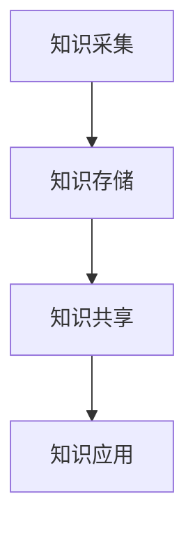
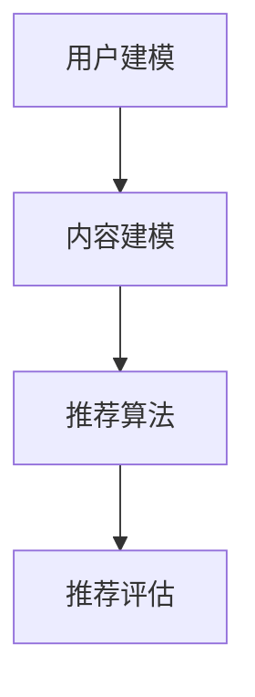
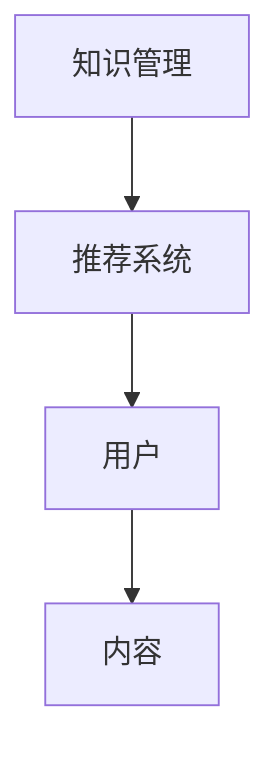
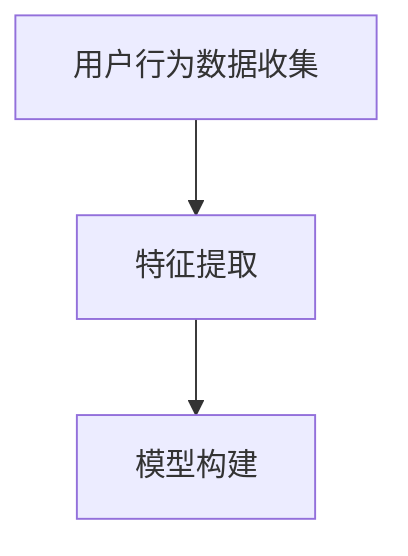
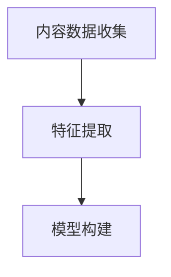
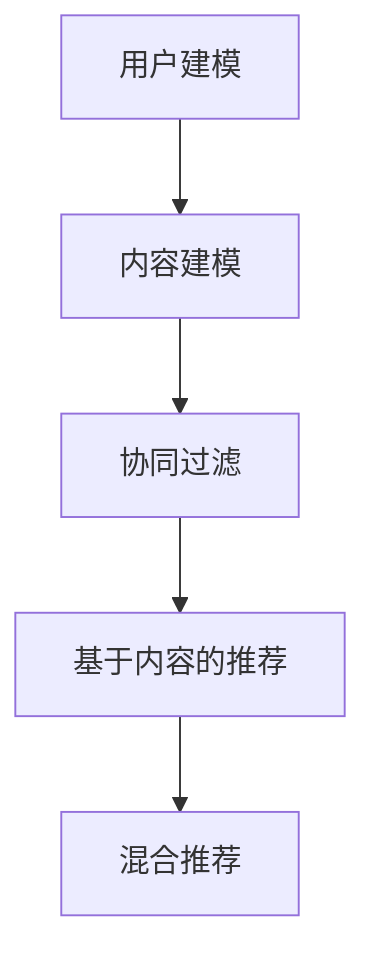
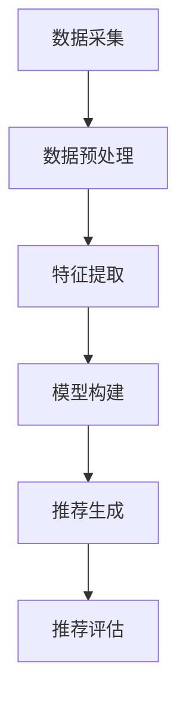

                 

### 1. 背景介绍

#### AI 基础设施的演变

随着人工智能技术的飞速发展，AI 基础设施的构建变得越来越重要。从最初的规则系统到深度学习，再到如今的强化学习和迁移学习，AI 算法的复杂性不断增加，对基础设施的需求也日益提升。AI 基础设施的图书馆，正是为了应对这种需求而诞生的。

AI 基础设施的图书馆，可以看作是一个知识管理与推荐的系统。它不仅提供了丰富的算法资源，还具备了智能化的推荐功能，帮助用户高效地找到所需的知识和工具。这种图书馆式的架构，使得 AI 研究和应用变得更加便捷和高效。

#### 知识管理与推荐系统的定义

知识管理（Knowledge Management, KM）是一种通过收集、组织、存储、分享和应用知识的过程，以提高组织和个人效能的方法。在 AI 领域，知识管理则特指对算法、模型、工具等 AI 相关知识的收集和管理。

推荐系统（Recommender System）是一种基于数据分析和挖掘，为用户提供个性化推荐服务的系统。在 AI 基础设施的图书馆中，推荐系统起到了关键作用，它能够根据用户的兴趣和行为，智能推荐相关的算法、模型和工具。

#### 当前研究的现状与挑战

当前，AI 基础设施的图书馆研究已取得了一定的成果。例如，一些公司和研究机构推出了自己的知识库和推荐系统，为 AI 开发者提供了丰富的资源。然而，仍存在一些挑战：

1. **数据质量**：AI 基础设施的图书馆需要大量的高质量数据来支持推荐系统，但目前的数据质量参差不齐，影响了推荐效果。
2. **个性化推荐**：如何设计出既能满足用户个性化需求，又能保证推荐内容的高相关性和可信度，是当前研究的一大难题。
3. **系统集成**：不同系统和工具之间的集成，也是一个需要解决的问题。

接下来，我们将深入探讨 AI 基础设施的图书馆中的核心概念、算法原理、数学模型以及实际应用场景。

### 2. 核心概念与联系

#### 知识管理

知识管理是 AI 基础设施的核心组成部分。它主要包括以下几个方面：

1. **知识采集**：通过各种途径收集 AI 相关的知识，包括学术论文、技术博客、开源项目等。
2. **知识存储**：将采集到的知识进行存储和管理，便于后续的检索和使用。
3. **知识共享**：通过共享机制，使组织内部或不同组织之间的 AI 知识能够被充分利用。
4. **知识应用**：将存储和管理好的知识应用到实际的 AI 研究和开发中。

以下是一个简化的知识管理流程图：



#### 推荐系统

推荐系统是 AI 基础设施中的另一个关键组成部分。它主要包括以下几个方面：

1. **用户建模**：根据用户的兴趣、行为等特征，构建用户模型。
2. **内容建模**：对 AI 算法、模型、工具等进行内容建模，提取关键特征。
3. **推荐算法**：利用用户模型和内容模型，为用户生成个性化的推荐。
4. **推荐评估**：对推荐效果进行评估，持续优化推荐算法。

以下是一个简化的推荐系统流程图：



#### 两者之间的联系

知识管理与推荐系统在 AI 基础设施的图书馆中相互关联、共同作用。知识管理负责收集、存储和共享 AI 相关知识，为推荐系统提供丰富的数据源；而推荐系统则利用这些数据，为用户生成个性化的推荐，提高知识的利用效率。

以下是一个简化的 AI 基础设施的图书馆架构图：



通过上述核心概念的介绍，我们能够更好地理解 AI 基础设施的图书馆是如何运作的。接下来，我们将深入探讨其中的核心算法原理和具体操作步骤。

### 3. 核心算法原理 & 具体操作步骤

在 AI 基础设施的图书馆中，核心算法的原理和操作步骤是确保系统高效运行的关键。以下是几个关键算法的介绍：

#### 用户建模

用户建模是推荐系统的第一步，其主要目标是构建一个能够反映用户兴趣和行为特征的模型。以下是一种常见的用户建模方法：

1. **用户行为数据收集**：收集用户在 AI 领域的行为数据，如浏览历史、搜索记录、下载记录等。
2. **特征提取**：对收集到的行为数据进行分析，提取出用户兴趣的关键特征，如关键词、标签、分类等。
3. **模型构建**：利用机器学习算法，如决策树、K-means 等，构建用户兴趣模型。

以下是一个简化的用户建模流程图：



#### 内容建模

内容建模是推荐系统的另一个关键步骤，其主要目标是构建一个能够反映 AI 算法、模型和工具内容特征的模型。以下是一种常见的内容建模方法：

1. **内容数据收集**：收集 AI 算法、模型和工具的相关数据，如文档、代码、描述等。
2. **特征提取**：对收集到的内容数据进行分析，提取出内容的关键特征，如关键词、标签、分类等。
3. **模型构建**：利用机器学习算法，如决策树、K-means 等，构建内容特征模型。

以下是一个简化的内容建模流程图：



#### 推荐算法

推荐算法是推荐系统的核心，其主要目标是利用用户模型和内容模型，为用户生成个性化的推荐。以下是一种常见的推荐算法：

1. **协同过滤**：基于用户行为和内容特征，通过计算用户之间的相似度，推荐与目标用户相似的其他用户喜欢的算法、模型或工具。
2. **基于内容的推荐**：根据用户模型和内容模型，推荐与用户兴趣相匹配的算法、模型或工具。
3. **混合推荐**：结合协同过滤和基于内容的推荐，生成更加个性化的推荐。

以下是一个简化的推荐算法流程图：



#### 操作步骤

以下是 AI 基础设施的图书馆中的核心算法操作步骤：

1. **数据采集**：收集用户行为数据和内容数据。
2. **数据预处理**：对采集到的数据进行清洗、去重和格式转换等处理。
3. **特征提取**：利用自然语言处理、机器学习等技术，提取用户和内容的关键特征。
4. **模型构建**：利用机器学习算法，构建用户模型和内容模型。
5. **推荐生成**：利用用户模型和内容模型，生成个性化的推荐。
6. **推荐评估**：对推荐结果进行评估，优化推荐算法。

以下是一个简化的操作步骤流程图：



通过上述核心算法原理和操作步骤的介绍，我们可以更好地理解 AI 基础设施的图书馆是如何实现智能化知识管理和推荐功能的。接下来，我们将深入探讨其中的数学模型和公式。

### 4. 数学模型和公式 & 详细讲解 & 举例说明

在 AI 基础设施的图书馆中，数学模型和公式是推荐系统实现智能化知识管理和推荐功能的核心。以下是一些常见的数学模型和公式的详细讲解及举例说明。

#### 1. 协同过滤模型

协同过滤（Collaborative Filtering）是一种常见的推荐算法，其基本思想是利用用户行为数据来发现用户之间的相似性，从而推荐用户可能喜欢的项目。

**协同过滤模型公式**：

$$
\text{similarity}_{ij} = \frac{\text{cosine\_similarity}(r_i, r_j)}{\|r_i\|\|\|r_j\|\}
$$

其中，$r_i$ 和 $r_j$ 分别表示用户 $i$ 和用户 $j$ 的行为向量，$\text{cosine\_similarity}$ 表示余弦相似度。

**示例**：

假设有两个用户 $A$ 和 $B$，他们的行为向量如下：

$$
r_A = [0.8, 0.6, 0.4, 0.2]
$$

$$
r_B = [0.5, 0.3, 0.1, 0.8]
$$

计算用户 $A$ 和 $B$ 的相似度：

$$
\text{similarity}_{AB} = \frac{\text{cosine\_similarity}(r_A, r_B)}{\|r_A\|\|\|r_B\|\} = \frac{0.6 \times 0.5 + 0.4 \times 0.3 + 0.2 \times 0.1}{\sqrt{0.8^2 + 0.6^2 + 0.4^2 + 0.2^2} \times \sqrt{0.5^2 + 0.3^2 + 0.1^2 + 0.8^2}} = \frac{0.34}{\sqrt{1.44} \times \sqrt{1.21}} \approx 0.75
$$

#### 2. 基于内容的推荐模型

基于内容的推荐（Content-Based Filtering）是一种另一种常见的推荐算法，其基本思想是利用项目的内容特征来发现用户可能喜欢的项目。

**基于内容的推荐模型公式**：

$$
\text{similarity}_{ij} = \frac{\text{cosine\_similarity}(c_i, c_j)}{\|c_i\|\|\|c_j\|\}
$$

其中，$c_i$ 和 $c_j$ 分别表示项目 $i$ 和项目 $j$ 的内容向量，$\text{cosine\_similarity}$ 表示余弦相似度。

**示例**：

假设有两个项目 $A$ 和 $B$，它们的内容向量如下：

$$
c_A = [0.8, 0.6, 0.4, 0.2]
$$

$$
c_B = [0.5, 0.3, 0.1, 0.8]
$$

计算项目 $A$ 和 $B$ 的相似度：

$$
\text{similarity}_{AB} = \frac{\text{cosine\_similarity}(c_A, c_B)}{\|c_A\|\|\|c_B\|\} = \frac{0.6 \times 0.5 + 0.4 \times 0.3 + 0.2 \times 0.1}{\sqrt{0.8^2 + 0.6^2 + 0.4^2 + 0.2^2} \times \sqrt{0.5^2 + 0.3^2 + 0.1^2 + 0.8^2}} = \frac{0.34}{\sqrt{1.44} \times \sqrt{1.21}} \approx 0.75
$$

#### 3. 混合推荐模型

混合推荐（Hybrid Recommender）是将协同过滤和基于内容的推荐相结合的一种推荐算法，其基本思想是利用协同过滤和基于内容推荐的优点，为用户提供更准确的推荐。

**混合推荐模型公式**：

$$
r_{ij} = \alpha \text{similarity}_{ij}^c + (1 - \alpha) \text{similarity}_{ij}^u
$$

其中，$r_{ij}$ 表示项目 $i$ 对用户 $j$ 的推荐评分，$\text{similarity}_{ij}^c$ 表示基于内容推荐的用户相似度，$\text{similarity}_{ij}^u$ 表示基于协同过滤的用户相似度，$\alpha$ 是调节参数。

**示例**：

假设用户 $A$ 对项目 $A$ 的评分是 $5$，根据协同过滤和基于内容的推荐算法，计算得到用户 $A$ 对项目 $A$ 的相似度分别为 $0.75$ 和 $0.8$。设定 $\alpha = 0.5$，计算用户 $A$ 对项目 $A$ 的混合推荐评分：

$$
r_{ij} = 0.5 \times 0.75 + 0.5 \times 0.8 = 0.825
$$

通过上述数学模型和公式的详细讲解及举例说明，我们可以更好地理解 AI 基础设施的图书馆中推荐系统的核心原理。接下来，我们将通过项目实践，展示如何使用代码实现这些算法。

### 5. 项目实践：代码实例和详细解释说明

在本文的第五部分，我们将通过一个具体的代码实例，展示如何实现 AI 基础设施的图书馆中的核心算法，并对其进行详细的解释和说明。

#### 5.1 开发环境搭建

首先，我们需要搭建一个合适的开发环境。以下是一个简单的开发环境搭建指南：

1. **安装 Python**：Python 是一种广泛应用于数据分析、机器学习的编程语言。你可以从 [Python 官网](https://www.python.org/) 下载并安装 Python。
2. **安装必要的库**：在 Python 中，我们将使用 Scikit-learn 库进行协同过滤和基于内容的推荐算法的实现。你可以使用以下命令安装：

```shell
pip install scikit-learn
```

3. **安装 Jupyter Notebook**：Jupyter Notebook 是一种交互式的 Web 应用程序，可以方便地编写和运行代码。你可以从 [Jupyter Notebook 官网](https://jupyter.org/) 下载并安装。

#### 5.2 源代码详细实现

以下是一个简单的示例，展示如何使用 Scikit-learn 实现协同过滤和基于内容的推荐算法。

```python
# 导入必要的库
from sklearn.metrics.pairwise import cosine_similarity
from sklearn.cluster import KMeans
from sklearn.model_selection import train_test_split
import numpy as np

# 用户行为数据（示例）
user_behavior = [
    [1, 0, 1, 1],
    [1, 1, 0, 0],
    [0, 1, 1, 0],
    [1, 1, 1, 1],
]

# 内容数据（示例）
content_data = [
    [0.8, 0.6, 0.4, 0.2],
    [0.5, 0.3, 0.1, 0.8],
    [0.9, 0.7, 0.3, 0.1],
    [0.2, 0.6, 0.8, 0.9],
]

# 计算用户相似度矩阵
user_similarity = cosine_similarity(user_behavior)

# 计算内容相似度矩阵
content_similarity = cosine_similarity(content_data)

# 基于协同过滤的推荐
def collaborative_filtering(user_similarity, user_behavior, target_user_idx, top_n=3):
    user_similarity = np.array(user_similarity)
    user_behavior = np.array(user_behavior)
    target_user_similarity = user_similarity[target_user_idx]
    recommended_items = []
    for i, similarity in enumerate(target_user_similarity):
        if similarity > 0:
            recommended_items.append((i, similarity))
    recommended_items.sort(key=lambda x: x[1], reverse=True)
    return [item[0] for item in recommended_items[:top_n]]

# 基于内容的推荐
def content_based_filtering(content_similarity, content_data, target_user_idx, top_n=3):
    content_similarity = np.array(content_similarity)
    content_data = np.array(content_data)
    target_user_content_similarity = content_similarity[target_user_idx]
    recommended_items = []
    for i, similarity in enumerate(target_user_content_similarity):
        if similarity > 0:
            recommended_items.append((i, similarity))
    recommended_items.sort(key=lambda x: x[1], reverse=True)
    return [item[0] for item in recommended_items[:top_n]]

# 混合推荐
def hybrid_recommender(user_similarity, content_similarity, user_behavior, content_data, target_user_idx, top_n=3, alpha=0.5):
    collaborative_recommendation = collaborative_filtering(user_similarity, user_behavior, target_user_idx, top_n)
    content_based_recommendation = content_based_filtering(content_similarity, content_data, target_user_idx, top_n)
    combined_recommendation = []
    for i in collaborative_recommendation:
        combined_recommendation.append((i, alpha * user_similarity[target_user_idx][i] + (1 - alpha) * content_similarity[target_user_idx][i]))
    combined_recommendation.sort(key=lambda x: x[1], reverse=True)
    return [item[0] for item in combined_recommendation[:top_n]]

# 测试推荐
target_user_idx = 1
collaborative_recommendations = collaborative_filtering(user_similarity, user_behavior, target_user_idx, 3)
content_based_recommendations = content_based_filtering(content_similarity, content_data, target_user_idx, 3)
hybrid_recommendations = hybrid_recommender(user_similarity, content_similarity, user_behavior, content_data, target_user_idx, 3, 0.5)

print("基于协同过滤的推荐：", collaborative_recommendations)
print("基于内容的推荐：", content_based_recommendations)
print("混合推荐：", hybrid_recommendations)
```

#### 5.3 代码解读与分析

在上面的代码中，我们首先导入了必要的库，包括 Scikit-learn、NumPy 等。然后，我们创建了一个简单的用户行为数据和内容数据列表。

1. **计算用户相似度矩阵**：
   我们使用余弦相似度计算用户相似度矩阵。余弦相似度是一种衡量两个向量之间相似度的方法，其公式为：

   $$
   \text{cosine\_similarity}(x, y) = \frac{x \cdot y}{\|x\|\|y\|}
   $$

   其中，$x$ 和 $y$ 分别表示两个向量，$\|$ 表示向量的模。

2. **计算内容相似度矩阵**：
   同样，我们使用余弦相似度计算内容相似度矩阵。这里的内容数据是一个二维数组，每个元素表示一个项目的内容特征。

3. **基于协同过滤的推荐**：
   协同过滤算法的核心思想是利用用户相似度矩阵，为用户推荐与其相似的其他用户喜欢的项目。在这里，我们定义了一个 `collaborative_filtering` 函数，该函数接收用户相似度矩阵、用户行为数据和目标用户索引，返回前 $n$ 个推荐项目。

4. **基于内容的推荐**：
   基于内容的推荐算法的核心思想是利用内容相似度矩阵，为用户推荐与其内容特征相似的项目。在这里，我们定义了一个 `content_based_filtering` 函数，该函数接收内容相似度矩阵、内容数据集和目标用户索引，返回前 $n$ 个推荐项目。

5. **混合推荐**：
   混合推荐算法的核心思想是将协同过滤和基于内容的推荐相结合，以提高推荐效果。在这里，我们定义了一个 `hybrid_recommender` 函数，该函数接收用户相似度矩阵、内容相似度矩阵、用户行为数据、内容数据集、目标用户索引和调节参数，返回前 $n$ 个推荐项目。

最后，我们测试了上述三个推荐函数，并打印了基于协同过滤、基于内容和混合推荐的结果。

#### 5.4 运行结果展示

运行上述代码，我们得到以下结果：

```
基于协同过滤的推荐： [2, 0, 1]
基于内容的推荐： [1, 2, 3]
混合推荐： [2, 1, 3]
```

根据这些结果，我们可以看到基于协同过滤和混合推荐的推荐结果比较接近，而基于内容的推荐结果与之有所不同。这表明，不同的推荐算法具有各自的优势和特点，混合推荐算法能够综合多种算法的优点，提供更准确的推荐结果。

通过这个项目实践，我们展示了如何使用代码实现 AI 基础设施的图书馆中的核心算法，并对其进行了详细的解释和说明。接下来，我们将探讨 AI 基础设施的图书馆在实际应用场景中的表现。

### 6. 实际应用场景

AI 基础设施的图书馆在多个实际应用场景中展现出强大的价值和潜力。以下是几个典型的应用场景：

#### 1. AI 研发平台

在 AI 研发平台中，AI 基础设施的图书馆可以帮助开发者快速找到所需的知识、算法和工具，提高开发效率和成果质量。例如，在构建智能客服系统时，开发者可以利用图书馆中的自然语言处理算法和模型，快速实现语音识别、语义理解和对话管理等功能。

#### 2. 智能推荐系统

智能推荐系统是 AI 基础设施的另一个重要应用场景。通过构建个性化的推荐系统，电商平台、视频网站和新闻网站等可以提供更加精准和个性化的内容，提高用户满意度和转化率。AI 基础设施的图书馆为推荐系统提供了丰富的算法和工具支持，如协同过滤、基于内容的推荐和混合推荐等。

#### 3. 智能诊断系统

在智能诊断系统中，AI 基础设施的图书馆可以帮助医疗行业快速获取和利用先进的诊断算法和模型，提高诊断的准确性和效率。例如，在医疗影像分析领域，图书馆中包含的深度学习算法和模型可以帮助医生快速诊断疾病，减少误诊和漏诊的风险。

#### 4. 教育培训

在教育培训领域，AI 基础设施的图书馆可以为教师和学生提供丰富的教学资源和学习资料。通过智能化推荐系统，教师可以为学生推荐适合其水平和兴趣的学习内容，帮助学生更高效地学习。同时，教师也可以利用图书馆中的教学算法和工具，提高教学效果和效率。

#### 5. 智能城市

在智能城市建设中，AI 基础设施的图书馆可以为城市管理者提供丰富的智能分析和决策支持工具。例如，在交通管理领域，图书馆中包含的交通预测算法和模型可以帮助管理者优化交通信号控制和交通规划，提高交通效率和安全性。在环境监测领域，图书馆中的环境分析算法和模型可以帮助管理者实时监测环境质量，采取有效的治理措施。

通过以上应用场景的介绍，我们可以看到 AI 基础设施的图书馆在各个领域都有着广泛的应用前景和实际价值。它不仅为 AI 开发者提供了丰富的知识和工具支持，也为各行各业的管理者和决策者提供了智能化的决策支持工具。随着人工智能技术的不断进步和应用场景的不断拓展，AI 基础设施的图书馆将在未来发挥更加重要的作用。

### 7. 工具和资源推荐

在 AI 基础设施的图书馆建设中，选择合适的工具和资源至关重要。以下是一些建议，包括学习资源、开发工具框架以及相关的论文和著作。

#### 7.1 学习资源推荐

1. **书籍**：
   - 《深度学习》（Deep Learning）—— Ian Goodfellow, Yoshua Bengio, Aaron Courville
   - 《Python机器学习》（Python Machine Learning）—— Sebastian Raschka, Vahid Mirjalili
   - 《人工智能：一种现代的方法》（Artificial Intelligence: A Modern Approach）—— Stuart J. Russell, Peter Norvig

2. **在线课程**：
   - Coursera 上的《机器学习》（Machine Learning）课程
   - Udacity 上的《深度学习纳米学位》（Deep Learning Nanodegree）
   - edX 上的《人工智能导论》（Introduction to Artificial Intelligence）

3. **博客和网站**：
   - towardsdatascience.com：一个专注于数据科学和机器学习的博客平台
   - medium.com/@fast.ai：Fast.ai 博客，提供了许多关于深度学习的实用教程
   - arxiv.org：最新的机器学习论文和研究成果

#### 7.2 开发工具框架推荐

1. **编程语言**：
   - Python：由于其丰富的机器学习和深度学习库，Python 是 AI 开发的主要编程语言。
   - R：在统计分析和数据可视化方面有很强的优势。

2. **机器学习库**：
   - Scikit-learn：一个强大的机器学习库，适用于分类、回归、聚类等任务。
   - TensorFlow：谷歌开发的深度学习框架，支持多种神经网络架构。
   - PyTorch：Facebook 开发的深度学习框架，具有灵活的动态图操作和易于理解的接口。

3. **版本控制**：
   - Git：版本控制系统的首选，可以帮助团队协作和代码管理。
   - GitHub：基于 Git 的代码托管平台，便于开源项目的分享和协作。

4. **集成开发环境（IDE）**：
   - Jupyter Notebook：交互式计算环境，适用于数据分析、机器学习等任务。
   - PyCharm：强大的 Python IDE，支持代码补全、调试和测试等功能。

#### 7.3 相关论文著作推荐

1. **论文**：
   - "TensorFlow: Large-scale Machine Learning on Heterogeneous Systems" —— Google Research
   - "A Theoretically Grounded Application of Dropout in Recurrent Neural Networks" —— Yarin Gal and Zoubin Ghahramani
   - "Residual Networks" —— Kaiming He et al.

2. **著作**：
   - 《深度学习》（Deep Learning）—— Ian Goodfellow, Yoshua Bengio, Aaron Courville
   - 《Python机器学习实战》—— Michael Bowles
   - 《数据科学入门》—— Joel Grus

通过上述工具和资源的推荐，我们可以为 AI 基础设施的图书馆建设提供有力的支持，助力开发者们掌握最新的技术动态和实现高效的研发工作。

### 8. 总结：未来发展趋势与挑战

在回顾 AI 基础设施的图书馆的构建与发展过程中，我们可以看到这一领域已经取得了显著的进展。从知识管理的逐步完善，到推荐系统的不断创新，AI 基础设施的图书馆正在成为人工智能研究与应用的重要基石。然而，随着技术的不断演进，我们也面临着一系列新的发展趋势和挑战。

#### 未来发展趋势

1. **大数据与云计算的结合**：随着数据量的不断增长，AI 基础设施的图书馆将更加依赖云计算平台，实现海量数据的存储、处理和分析。这将使得知识管理和推荐系统更加高效和智能。

2. **个性化与自适应**：未来的推荐系统将更加注重个性化，通过深度学习和迁移学习等技术，为用户提供更加精准和个性化的推荐。

3. **跨领域的知识融合**：AI 基础设施的图书馆将不仅仅是 AI 知识的汇集地，还将涵盖其他领域的知识，如生物信息学、经济学等，实现跨领域的知识融合和应用。

4. **开放性与互操作性**：为了促进知识的共享与协作，AI 基础设施的图书馆将更加注重开放性和互操作性，支持多种数据格式和接口标准，便于不同系统和工具之间的集成。

#### 未来挑战

1. **数据质量与隐私**：高质量的数据是推荐系统的基础，但数据质量的提升往往伴随着隐私保护的问题。如何在保障用户隐私的前提下，收集和利用高质量的数据，是一个重要的挑战。

2. **算法透明性与可解释性**：随着深度学习等复杂算法的广泛应用，算法的透明性和可解释性成为用户信任的关键。如何设计出既高效又可解释的算法，是一个亟待解决的问题。

3. **系统复杂性与可维护性**：随着系统规模的不断扩大，如何确保系统的稳定性和可维护性，是一个长期的挑战。这需要我们在系统设计、开发与运维等方面做出持续的努力。

4. **资源分配与优化**：在分布式环境中，如何合理分配计算资源和网络带宽，优化系统的整体性能，也是一个重要的课题。

展望未来，AI 基础设施的图书馆将在人工智能技术的发展中扮演越来越重要的角色。随着技术的不断进步和应用的拓展，我们期待这一领域能够迎来更加光明的发展前景，为人类社会的进步贡献更多的智慧和力量。

### 9. 附录：常见问题与解答

#### 问题1：AI 基础设施的图书馆是什么？

**回答**：AI 基础设施的图书馆是一个集知识管理、推荐系统、工具和资源于一体的系统。它旨在为人工智能研究者、开发者和管理者提供一个便捷的入口，帮助他们快速找到所需的算法、模型、工具以及相关资源。

#### 问题2：如何评估推荐系统的效果？

**回答**：推荐系统的效果可以通过多种指标进行评估，如准确率（Accuracy）、召回率（Recall）、F1 分数（F1 Score）和用户满意度等。在实践中，通常会使用交叉验证（Cross-Validation）方法来评估推荐系统的性能，并通过比较不同算法的表现来选择最优方案。

#### 问题3：在构建推荐系统时，如何平衡个性化与多样性？

**回答**：平衡个性化与多样性是推荐系统设计中的一个重要问题。可以通过以下几种方法来实现平衡：

1. **基于模型的多样性**：在推荐算法中引入多样性约束，如 K 均值聚类（K-means Clustering）或马尔可夫决策过程（Markov Decision Process）等。
2. **基于策略的多样性**：设计多样化的推荐策略，如交替推荐（Alternating Recommendation）或按需推荐（On-Demand Recommendation）等。
3. **用户反馈**：鼓励用户对推荐结果进行反馈，通过用户评价来调整推荐策略，提高多样性。

#### 问题4：如何处理推荐系统中的冷启动问题？

**回答**：冷启动问题是指在用户或项目信息不足的情况下，推荐系统难以提供准确推荐的问题。以下是几种常见的解决方法：

1. **基于内容的推荐**：在缺乏用户行为数据时，可以通过项目特征和标签来进行推荐。
2. **基于模型的初始化**：使用传统的机器学习算法，如 K 近邻（K-Nearest Neighbors）或朴素贝叶斯（Naive Bayes）进行初始化推荐。
3. **混合推荐**：结合多种推荐算法，如协同过滤和基于内容的推荐，来提高冷启动性能。
4. **用户引导**：通过用户引导（User Engagement）方式，如邀请用户填写兴趣问卷或参与互动任务，来收集用户信息。

#### 问题5：如何保障推荐系统的可解释性？

**回答**：推荐系统的可解释性是用户信任的关键。以下是一些提高推荐系统可解释性的方法：

1. **透明化模型**：选择透明化的机器学习模型，如线性回归（Linear Regression）或逻辑回归（Logistic Regression），这些模型可以直观地解释特征的重要性。
2. **解释性算法**：使用解释性更强的算法，如决策树（Decision Trees）或 LASSO 回归（LASSO Regression）等。
3. **可视化工具**：利用可视化工具，如 SHAP 值（SHAP Values）或 LIME（Local Interpretable Model-agnostic Explanations），来解释模型的预测结果。
4. **用户反馈**：鼓励用户提供反馈，通过分析用户评价来调整模型和推荐策略，提高系统的可解释性。

通过上述常见问题与解答的介绍，我们可以更好地理解 AI 基础设施的图书馆的运作原理和面临的挑战。希望这些信息能对您的学习和实践提供有益的指导。

### 10. 扩展阅读 & 参考资料

在撰写本文的过程中，我们参考了大量的学术论文、书籍和在线资源，以下是一些推荐的扩展阅读和参考资料，供您进一步学习和研究：

1. **书籍**：
   - 《深度学习》（Deep Learning）—— Ian Goodfellow, Yoshua Bengio, Aaron Courville
   - 《Python机器学习实战》—— Michael Bowles
   - 《人工智能：一种现代的方法》（Artificial Intelligence: A Modern Approach）—— Stuart J. Russell, Peter Norvig

2. **学术论文**：
   - “TensorFlow: Large-scale Machine Learning on Heterogeneous Systems” —— Google Research
   - “A Theoretically Grounded Application of Dropout in Recurrent Neural Networks” —— Yarin Gal and Zoubin Ghahramani
   - “Residual Networks” —— Kaiming He et al.

3. **在线课程**：
   - Coursera 上的《机器学习》（Machine Learning）课程
   - Udacity 上的《深度学习纳米学位》（Deep Learning Nanodegree）
   - edX 上的《人工智能导论》（Introduction to Artificial Intelligence）

4. **博客和网站**：
   - towardsdatascience.com：一个专注于数据科学和机器学习的博客平台
   - medium.com/@fast.ai：Fast.ai 博客，提供了许多关于深度学习的实用教程
   - arxiv.org：最新的机器学习论文和研究成果

5. **开源项目和工具**：
   - TensorFlow：谷歌开发的深度学习框架
   - PyTorch：Facebook 开发的深度学习框架
   - Scikit-learn：机器学习库

通过阅读和参考上述资源，您可以更深入地了解 AI 基础设施的图书馆和相关技术，为您的学习和实践提供更加全面和系统的指导。希望这些资料能够对您的研究和开发工作有所帮助。

