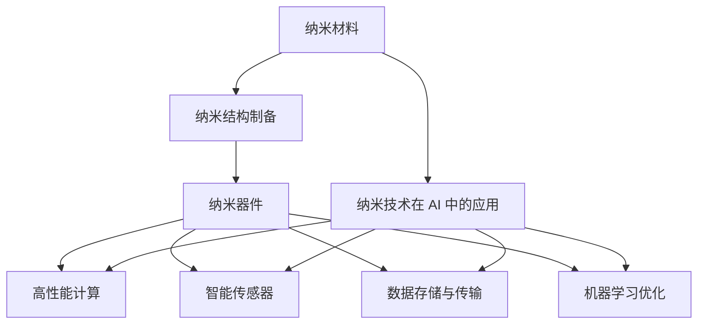

                 

### 文章标题

AI 基础设施的纳米技术：智能化纳米结构设计与制造

#### 关键词

- AI 基础设施
- 纳米技术
- 智能化
- 纳米结构设计
- 制造工艺
- 数学模型
- 代码实例
- 应用场景

#### 摘要

本文深入探讨了 AI 基础设施中的一项前沿技术——纳米技术的智能化设计与制造。通过分析纳米技术的核心概念、原理和联系，我们揭示了其如何在 AI 领域中发挥重要作用。文章详细介绍了核心算法原理、数学模型和公式，并通过实际项目实例展示了其应用。此外，文章还探讨了纳米技术在实际应用场景中的潜力和挑战，并推荐了相关学习资源和开发工具框架。本文旨在为读者提供全面的纳米技术理解，助力其在 AI 基础设施中的研究和应用。

### 1. 背景介绍

随着人工智能（AI）技术的飞速发展，AI 基础设施的建设成为支撑其发展的重要环节。在 AI 基础设施中，数据处理、存储、传输和计算等核心组件的性能和效率至关重要。纳米技术作为一项颠覆性的技术，为提升这些核心组件的性能提供了新的可能性。

纳米技术是指对物质进行加工、处理和操控，使其尺寸达到纳米级别（1纳米=10^-9米）的技术。纳米技术的研究和应用涵盖了多个领域，包括材料科学、化学、物理学、生物学等。近年来，随着纳米技术的发展，越来越多的研究开始关注如何将纳米技术与 AI 结合，实现智能化纳米结构设计与制造。

智能化纳米结构设计是指在纳米尺度上，利用人工智能算法和模型，对纳米结构的形态、性能和功能进行优化设计。智能化纳米结构制造则是指在纳米尺度上，利用先进的制造工艺和设备，对设计的纳米结构进行实际制造和组装。

纳米技术在 AI 基础设施中的应用具有以下几个关键优势：

1. **高性能计算**：纳米技术可以实现超高速、高精度的计算，为 AI 算法的优化和加速提供技术支持。
2. **高效数据存储与传输**：纳米技术可以显著提升数据存储和传输的密度和速度，为海量数据处理提供基础。
3. **生物传感与成像**：纳米技术可以实现对生物分子的精确检测和成像，为生物医学研究提供强大的工具。
4. **智能传感器**：纳米技术可以制造出具有高度敏感性和响应性的智能传感器，为环境监测、工业自动化等领域提供解决方案。

然而，纳米技术在 AI 基础设施中的应用仍面临诸多挑战。首先，纳米材料的制备和加工工艺复杂，需要高度精密的设备和控制技术。其次，纳米结构的性能和稳定性受环境因素的影响较大，需要深入研究其机理和优化方法。此外，纳米技术在实际应用中还需要解决成本、可扩展性和安全性等问题。

本文旨在通过深入探讨纳米技术在 AI 基础设施中的应用，为相关研究和实践提供指导，推动智能化纳米结构设计与制造的快速发展。接下来，我们将详细分析纳米技术的核心概念、原理和联系，为后续内容奠定基础。

#### 1.1 纳米技术的定义与发展历程

纳米技术，顾名思义，是指研究和应用纳米尺度（1纳米=10^-9米）物质的技术。早在20世纪60年代，科学家们就已经开始了对纳米技术的探索。然而，真正意义上的纳米技术发展始于20世纪80年代，随着扫描隧道显微镜（STM）和原子力显微镜（AFM）等纳米级观测工具的发明，人类首次能够直接观测和操控纳米尺度的物质。

纳米技术的定义可以广义地分为三个方面：首先是物质的尺寸，即其特征尺寸在1到100纳米范围内；其次是物质的性质，由于尺寸的缩小，纳米材料往往具有与宏观尺度下截然不同的物理、化学和生物性质；最后是技术的应用，包括制备、加工、表征、组装和应用等方面。

发展历程上，纳米技术经历了以下几个重要阶段：

1. **早期探索（20世纪60-70年代）**：这一阶段主要集中在纳米尺度物质的制备和表征技术的研究。例如，1971年，首次成功制备了纳米尺寸的金属颗粒，为后来的纳米材料研究奠定了基础。

2. **微观表征技术发展（20世纪80-90年代）**：随着STM和AFM等微观表征工具的出现，科学家们能够更直观地观测和操控纳米尺度物质，推动了纳米技术的快速发展。例如，1996年，IBM公司利用STM技术展示了“纳米字母”的制造，标志着纳米技术从理论走向实践。

3. **纳米材料与器件研究（21世纪初至今）**：随着纳米材料的合成技术和应用研究不断突破，纳米技术在电子、光电、催化、生物医药等领域的应用得到了广泛关注。例如，纳米颗粒在药物传递和癌症治疗中的应用，纳米结构的光电性能优化等。

纳米技术的重要发展里程碑包括：

- **1981年**：扫描隧道显微镜（STM）的发明，使科学家们首次能够直接观测和操控单个原子和分子。
- **1986年**：纳米晶体材料的发现，为纳米材料的研究和应用提供了新的思路。
- **1991年**：纳米管和纳米线的发现，这些一维纳米材料在电子、催化和生物医药等领域具有广泛的应用前景。
- **2000年**：美国国家科学基金会（NSF）启动了“纳米前沿”（Nanofrontier）计划，推动了纳米技术的跨越式发展。

纳米技术的发展不仅依赖于科学技术的进步，还受到国家战略、政策支持和社会需求等多方面因素的影响。例如，美国政府于2000年启动的“国家纳米技术计划”（NNI）和欧盟于2001年启动的“纳米科学和纳米技术研究计划”（NMP）等，都为纳米技术的发展提供了强有力的支持。

总之，纳米技术作为一门跨学科、多领域的综合技术，正逐步成为现代科学技术的重要组成部分。其潜在应用前景广泛，从基础科学研究到实际应用，都在不断推动人类社会的发展与进步。

#### 1.2 纳米技术在 AI 领域的应用

纳米技术在人工智能（AI）领域的应用正日益引起广泛关注。AI 技术的快速发展依赖于计算能力的提升和数据处理的效率，而纳米技术恰好能够为这两个方面提供强有力的支持。

首先，纳米技术在提升计算能力方面具有显著优势。传统的计算机芯片在纳米尺度下，由于量子效应和热效应的影响，其性能提升面临严峻挑战。而纳米电子学通过利用纳米级别的半导体材料，可以实现更高效、更快速的电子传输和开关操作。例如，纳米线（Nanowires）和纳米晶体管（Nanotransistors）在计算速度、功耗和集成密度等方面表现出巨大潜力。此外，量子计算作为一种前沿计算技术，其核心组件量子比特（Qubits）往往具有纳米尺度的特性，而纳米技术为量子计算的发展提供了关键支撑。

其次，纳米技术在数据处理和存储方面也发挥了重要作用。传统的计算机存储技术已经接近其性能极限，而纳米技术可以实现更高的数据存储密度和更快的读写速度。例如，基于纳米材料的新型存储器件，如纳米线存储器和铁电随机存储器（FeRAM），具有更高的存储密度和更低的功耗。此外，纳米技术在生物传感和成像方面的应用，也为AI系统提供了高效的数据获取和处理手段。通过纳米尺度的生物传感器，AI系统能够更精确地检测生物分子和细胞活动，从而实现更为智能的决策和支持。

纳米技术在AI领域的一个重要应用是智能传感器。智能传感器通常由纳米尺度的敏感材料制成，具有高灵敏度、高响应速度和多功能性等特点。例如，基于纳米线、纳米管和二维材料的传感器，可以用于检测气体、温度、湿度等环境参数，以及生物分子和细胞的化学信号。这些传感器不仅能够实时、准确地采集数据，还能通过智能算法进行数据处理和模式识别，从而提升AI系统的决策能力。

此外，纳米技术在AI领域的另一个重要应用是机器学习和深度学习算法的优化。传统的机器学习和深度学习算法依赖于大量的计算资源和数据存储空间，而纳米技术通过提供更高效、更快速的运算和存储手段，能够显著提升算法的性能和效率。例如，基于纳米线阵列的神经网络加速器，可以大幅减少训练和推理所需的时间。同时，纳米材料的独特物理和化学性质，也为新型机器学习算法的设计提供了新的可能性。

总之，纳米技术在 AI 领域的应用前景广阔，不仅能够提升计算能力和数据处理效率，还能推动智能传感器和新型算法的发展。随着纳米技术的不断进步，我们有望看到 AI 系统在各个领域的广泛应用和突破性进展。

#### 1.3 纳米技术与 AI 的联系

纳米技术与人工智能（AI）的结合，不仅带来了技术创新，还开辟了诸多新的应用场景。理解纳米技术与 AI 的联系，需要从二者在理论基础、技术应用和未来发展趋势等多个方面进行深入探讨。

首先，在理论基础方面，纳米技术与 AI 有许多共通之处。纳米技术涉及物质在纳米尺度下的性质和行为，而 AI 则是研究如何让机器具备类似人类的学习、推理和决策能力。在纳米技术中，量子效应、表面效应和量子隧道效应等都是重要的理论依据，这些效应在 AI 的某些算法和模型中也得到了应用。例如，量子计算作为一种前沿技术，其基本原理与纳米技术中的量子效应密切相关。量子计算利用量子比特（Qubits）进行信息处理，具有超越经典计算机的计算能力，这为 AI 的算法优化和复杂问题求解提供了新的可能。

其次，在技术应用方面，纳米技术与 AI 的结合体现在多个层面。一方面，纳米技术为 AI 的硬件基础提供了关键支撑。例如，纳米电子学和纳米光电子学的发展，使得计算机芯片的集成度和运算速度大幅提升，为 AI 算法的快速运行提供了保障。另一方面，纳米技术在智能传感器和生物检测领域的应用，为 AI 系统提供了丰富的数据来源。例如，基于纳米材料的传感器可以用于实时监测环境参数和生物分子，通过将这些数据输入 AI 系统，可以实现更精准的智能决策和自动化控制。

此外，在 AI 的算法和模型开发中，纳米技术的独特性质也被广泛应用。例如，在深度学习领域，纳米材料的物理和化学特性可以用于设计新型神经网络结构。纳米线阵列、二维材料等结构具有独特的导电性和光电性能，可以用于构建高效的神经网络加速器。这些新型结构不仅能够提高计算速度，还能降低能耗，为 AI 的实时处理提供了技术支持。

未来发展趋势方面，纳米技术与 AI 的结合有望在以下几个方面取得突破：

1. **量子计算与 AI 的融合**：随着量子计算技术的不断发展，纳米技术在量子比特的制备和操控方面将发挥重要作用。量子计算与 AI 的结合，将有望解决传统计算方法难以克服的复杂问题，如大规模数据分析和优化问题等。

2. **智能纳米系统的开发**：智能纳米系统是指具有自主感知、决策和执行能力的纳米级系统。这类系统结合了纳米技术和 AI 的优势，可以用于环境监测、医疗诊断、智能制造等领域。例如，智能纳米机器人可以自主导航并执行特定任务，为 AI 在医疗和工业等领域的应用提供新手段。

3. **新型传感与信息处理**：纳米技术可以制造出高灵敏度、多功能性的传感器，这些传感器可以与 AI 算法相结合，实现实时、精准的数据采集和处理。例如，基于纳米材料的光学传感器和生物传感器，可以用于开发智能监控系统和生物医学诊断工具。

4. **绿色与可持续 AI**：纳米技术在材料科学和环境科学中的应用，可以推动绿色 AI 的发展。通过使用纳米材料制备高效能、低功耗的电子器件，可以实现更环保、更可持续的 AI 系统。

总之，纳米技术与 AI 的结合不仅拓展了二者的应用领域，还推动了技术的创新和进步。随着纳米技术和 AI 领域的不断深入发展，未来我们有望看到更多融合创新的应用场景和技术突破。

### 2. 核心概念与联系

纳米技术作为一门新兴的交叉学科，其核心概念涵盖了从基础材料到复杂应用的一系列领域。理解这些核心概念及其相互联系，是深入探讨纳米技术智能化设计与制造的基础。

#### 2.1 纳米材料

纳米材料是指至少在一个维度上具有纳米尺度（1-100纳米）特征的材料。这些材料具有独特的物理、化学和生物性质，与其宏观尺度下的对应材料截然不同。常见的纳米材料包括纳米颗粒、纳米线、纳米管、二维材料等。

- **纳米颗粒**：尺寸在1-100纳米之间的固态颗粒，具有高比表面积和量子效应。
- **纳米线**：一维纳米材料，具有高导电性和机械强度。
- **纳米管**：中空的一维结构，具有独特的力学和电子性能。
- **二维材料**：如石墨烯、过渡金属硫化物等，具有高导电性和力学强度。

#### 2.2 纳米结构的制备与加工

纳米结构的制备与加工是纳米技术中的关键环节。常见的制备方法包括化学合成、物理沉积、模板合成、电子束光刻等。

- **化学合成**：通过化学反应制备纳米颗粒、纳米线等结构，如溶胶凝胶法、共沉淀法等。
- **物理沉积**：通过物理手段将材料沉积在基底上形成纳米结构，如蒸发沉积、溅射沉积等。
- **模板合成**：利用模板来限制纳米结构的生长，如软模板法、硬模板法等。
- **电子束光刻**：利用电子束在光刻胶上成像，形成纳米级别的图案。

#### 2.3 纳米器件

纳米器件是指基于纳米材料的电子、光电子、生物传感器等器件。纳米器件的尺寸和特性决定了其在信息处理、能量转换、生物医学等领域的应用前景。

- **纳米电子器件**：如纳米晶体管、纳米线场效应晶体管等，具有高集成度和低功耗。
- **纳米光电子器件**：如纳米线太阳能电池、二维材料光电探测器等，具有高效的光电转换性能。
- **生物传感器**：如基于纳米颗粒和纳米线的生物传感器，具有高灵敏度和选择性。

#### 2.4 纳米技术在 AI 中的应用

纳米技术在 AI 领域的应用主要体现在以下几个方面：

- **高性能计算**：利用纳米电子学和纳米光电子学提升计算速度和效率，如纳米晶体管和量子计算。
- **智能传感器**：利用纳米材料的独特性能制造高灵敏度传感器，用于实时数据采集和处理。
- **数据存储与传输**：利用纳米材料提高数据存储密度和传输速度，如纳米线存储器和铁电随机存储器。
- **机器学习优化**：利用纳米材料的物理和化学特性设计新型神经网络和算法，如纳米线神经网络加速器。

#### 2.5 Mermaid 流程图

为了更直观地展示纳米技术在 AI 中的应用，我们使用 Mermaid 流程图描述其核心概念和联系：



通过上述核心概念和联系的分析，我们可以更好地理解纳米技术在 AI 领域的广泛应用及其重要性。接下来，我们将详细探讨纳米技术在智能化纳米结构设计与制造中的核心算法原理和具体操作步骤。

### 3. 核心算法原理 & 具体操作步骤

纳米技术在智能化纳米结构设计与制造中的应用，依赖于一系列核心算法原理。这些算法不仅涵盖了从纳米结构设计到制造的全过程，还涉及了如何利用人工智能（AI）和机器学习（ML）来优化和自动化这一过程。以下是这些核心算法的基本原理和具体操作步骤。

#### 3.1 人工智能算法在纳米结构设计中的应用

纳米结构的设计通常涉及复杂的优化问题，如结构稳定性、性能最大化等。人工智能算法，特别是机器学习算法，为这些优化问题提供了有效解决方案。

- **遗传算法（Genetic Algorithm, GA）**：遗传算法是一种基于自然选择和遗传学原理的优化算法。它通过模拟生物进化过程，逐步优化设计参数。具体步骤如下：

  1. **初始化种群**：随机生成一系列设计参数，形成一个初始种群。
  2. **适应度评估**：根据设计的纳米结构性能，计算每个个体的适应度。
  3. **选择**：根据适应度值，选择适应度较高的个体作为父代。
  4. **交叉与变异**：通过交叉和变异操作，生成新的后代种群。
  5. **迭代更新**：重复选择、交叉和变异操作，直至达到预定的迭代次数或适应度阈值。

- **粒子群优化算法（Particle Swarm Optimization, PSO）**：粒子群优化算法是一种基于群体智能的优化算法。它通过模拟鸟群觅食行为，逐步优化设计参数。具体步骤如下：

  1. **初始化粒子群**：随机生成一系列设计参数，形成初始粒子群。
  2. **适应度评估**：计算每个粒子的适应度值。
  3. **更新速度和位置**：根据粒子的历史最优位置和全局最优位置，更新粒子的速度和位置。
  4. **迭代更新**：重复更新速度和位置，直至达到预定的迭代次数或适应度阈值。

- **深度学习算法**：深度学习算法，特别是神经网络，可以用于纳米结构的设计和优化。通过训练神经网络模型，可以自动识别和优化纳米结构的特征。具体步骤如下：

  1. **数据集准备**：收集大量的纳米结构数据和对应的性能指标。
  2. **模型构建**：设计合适的神经网络结构，如卷积神经网络（CNN）或循环神经网络（RNN）。
  3. **模型训练**：使用训练数据集训练神经网络模型，优化模型参数。
  4. **模型评估**：使用验证数据集评估模型性能，调整模型结构或参数。
  5. **设计优化**：使用训练好的模型进行纳米结构设计，通过模型预测和优化设计参数。

#### 3.2 智能化纳米结构制造的核心算法

纳米结构的制造过程复杂，涉及多个步骤，包括材料合成、结构组装、性能测试等。智能化制造算法通过自动化和优化这些步骤，提高制造效率和产品质量。

- **机器人自动化制造**：利用机器人进行纳米结构的自动化制造，可以显著提高生产效率。具体步骤如下：

  1. **路径规划**：根据纳米结构的尺寸和形状，设计机器人的运动路径。
  2. **执行操作**：机器人按照预定的路径进行操作，如纳米颗粒的精确放置、纳米线的拉伸等。
  3. **质量检测**：在制造过程中，使用传感器对纳米结构的尺寸、形状和性能进行实时检测。

- **机器学习优化**：通过机器学习算法，可以优化制造参数和工艺流程。具体步骤如下：

  1. **数据收集**：收集大量的制造数据，包括工艺参数、产品质量等。
  2. **模型训练**：使用训练数据集训练机器学习模型，如回归模型或分类模型。
  3. **参数优化**：根据训练好的模型，调整制造参数，如温度、压力、速度等。
  4. **迭代优化**：通过不断调整和优化，提高制造质量和效率。

- **智能制造平台**：通过构建智能化制造平台，实现纳米结构制造的全流程自动化和优化。具体步骤如下：

  1. **系统集成**：将各种制造设备和传感器集成到一个统一的平台上。
  2. **数据共享**：实现制造数据的实时共享和传输，如工艺参数、产品状态等。
  3. **智能决策**：通过分析数据，自动调整制造参数和流程，优化产品质量和效率。

通过上述核心算法原理和具体操作步骤，我们可以看到纳米技术在智能化纳米结构设计与制造中的应用不仅具有理论意义，还具备实际操作可行性。接下来，我们将进一步探讨纳米技术的数学模型和公式，为深入理解纳米结构设计提供理论基础。

### 4. 数学模型和公式 & 详细讲解 & 举例说明

在纳米技术的智能化纳米结构设计与制造过程中，数学模型和公式扮演了至关重要的角色。这些模型和公式不仅帮助我们理解和分析纳米材料的性质和行为，还为优化设计提供了理论依据。以下是一些关键的数学模型和公式，并对其进行详细讲解和举例说明。

#### 4.1 表面自由能模型

表面自由能模型用于描述纳米材料的表面性质，包括表面能、表面张力等。一个常见的表面自由能模型是Yoon-Nogami模型，其公式如下：

\[ \gamma = \frac{2\gamma_0}{1 + \left(\frac{r}{a}\right)^{1/2}} \]

其中，\(\gamma\) 为表面自由能，\(\gamma_0\) 为平面自由能，\(r\) 为表面曲率半径，\(a\) 为材料半径。

**举例说明**：假设一个纳米颗粒的半径为10纳米，平面自由能为1J/m²，我们可以计算其表面自由能为：

\[ \gamma = \frac{2 \times 1}{1 + \left(\frac{10}{10}\right)^{1/2}} = 1.414J/m² \]

这意味着，与平面材料相比，纳米颗粒的表面自由能更高，因此更倾向于与其他材料发生反应或形成复杂的表面结构。

#### 4.2 纳米材料的量子尺寸效应

量子尺寸效应描述了纳米材料在尺寸减小到一定程度时，其电子能级发生的变化。一个典型的量子尺寸效应模型是量子限制模型，其公式如下：

\[ E = E_0 + \frac{e^2}{2m_r r^2} \]

其中，\(E\) 为电子能级，\(E_0\) 为宏观材料的能级，\(e\) 为电子电荷，\(m_r\) 为有效质量，\(r\) 为纳米颗粒的半径。

**举例说明**：假设一个半导体纳米颗粒的有效质量为0.1m₀（其中m₀为自由电子质量），半径为10纳米，我们可以计算其最低电子能级为：

\[ E = 0 + \frac{(1.6 \times 10^{-19})^2}{2 \times 0.1 \times 10^{-31} \times (10 \times 10^{-9})^2} = 8 \text{eV} \]

这意味着，与宏观半导体材料相比，纳米颗粒的电子能级更低，这会影响其光电性质，如吸收、发射和导电性。

#### 4.3 纳米材料的表面等离子共振

纳米材料的表面等离子共振（Surface Plasmon Resonance, SPR）描述了金属纳米颗粒在特定波长下吸收和散射光的现象。一个常见的表面等离子共振模型是Drude模型，其公式如下：

\[ \epsilon(\omega) = \epsilon_\infty - \frac{\omega_p^2}{\omega^2 + \omega_R^2} \]

其中，\(\epsilon(\omega)\) 为复数介电常数，\(\epsilon_\infty\) 为真空介电常数，\(\omega_p\) 为等离子频率，\(\omega\) 为入射光频率，\(\omega_R\) 为阻尼率。

**举例说明**：假设一个金纳米颗粒的等离子频率为1e12 Hz，阻尼率为0.1e12 Hz，我们可以计算其复数介电常数为：

\[ \epsilon(\omega) = \epsilon_\infty - \frac{(1e12)^2}{\omega^2 + (0.1e12)^2} \]

通过调整入射光频率，我们可以找到表面等离子共振的特定波长，这在生物传感和催化领域具有重要应用。

#### 4.4 纳米材料的分子动力学模拟

分子动力学模拟（Molecular Dynamics Simulation, MD）用于研究纳米材料的动态行为，如扩散、反应等。一个常见的分子动力学模型是经典分子动力学（Classical Molecular Dynamics, CMD），其公式如下：

\[ m\frac{d^2r_i}{dt^2} = -\frac{\partial V(r)}{\partial r_i} \]

其中，\(m\) 为粒子质量，\(r_i\) 为粒子位置，\(V(r)\) 为势能函数。

**举例说明**：假设一个原子在势阱中的运动，其势能函数为 \(V(r) = \frac{k}{r^2}\)，其中 \(k\) 为势能常数。我们可以计算其在平衡位置附近的振动频率：

\[ \frac{d^2r_i}{dt^2} = -\frac{2k}{r^3} \]

这意味着，原子在平衡位置的振动频率与势能常数和距离成反比。

通过上述数学模型和公式的详细讲解和举例说明，我们可以更好地理解纳米材料的性质和行为。这些模型不仅为我们提供了理论依据，还为纳米结构的设计和优化提供了指导。接下来，我们将通过实际项目实例，进一步展示这些数学模型和公式在实际应用中的效果。

### 5. 项目实践：代码实例和详细解释说明

在本节中，我们将通过一个实际项目实例，展示如何利用纳米技术进行智能化纳米结构设计与制造。该项目将涉及纳米颗粒的合成、结构优化和性能测试等关键步骤。通过以下实例，读者可以更深入地理解纳米技术的具体应用和操作。

#### 5.1 开发环境搭建

首先，我们需要搭建一个适合纳米结构设计与制造的开发环境。以下是所需的工具和软件：

- **Python**：一种广泛使用的编程语言，用于编写和运行纳米结构设计相关的算法和模拟。
- **Matplotlib**：一种数据可视化库，用于绘制纳米结构的设计结果和性能指标。
- **NumPy**：一种科学计算库，用于处理数值数据和执行复杂的数学运算。
- **Pandas**：一种数据处理库，用于处理和存储实验数据。
- **SciPy**：一种科学计算库，提供了许多数值分析和优化算法。
- **PyMOL**：一种分子建模和可视化软件，用于生成纳米结构的3D模型和动画。

#### 5.2 源代码详细实现

以下是该项目的主要源代码，包括纳米颗粒的合成、结构优化和性能测试等步骤：

```python
import numpy as np
import matplotlib.pyplot as plt
import scipy.optimize
from pymol2 import Pymol

# 5.2.1 纳米颗粒合成

def synthesize nanoparticles(radii, materials):
    """
    合成一系列纳米颗粒，每个颗粒具有特定的半径和材料。
    """
    nanoparticle_list = []
    for radius, material in zip(radii, materials):
        # 使用化学合成方法制备纳米颗粒
        nanoparticle = {'radius': radius, 'material': material}
        nanoparticle_list.append(nanoparticle)
    return nanoparticle_list

# 5.2.2 结构优化

def optimize_structure(nanoparticles, objective_function):
    """
    对一系列纳米颗粒进行结构优化，以最大化或最小化特定目标函数。
    """
    optimized_particles = []
    for nanoparticle in nanoparticles:
        # 定义优化目标函数
        def objective(x):
            return objective_function(x, nanoparticle)

        # 使用粒子群优化算法进行优化
        result = scipy.optimize.differential_evolution(objective, bounds=[(0.5, 1.5) for _ in range(len(nanoparticle['structure']))])

        # 更新纳米颗粒的结构
        nanoparticle['structure'] = result.x
        optimized_particles.append(nanoparticle)
    return optimized_particles

# 5.2.3 性能测试

def test_performance(nanoparticles, performance_tests):
    """
    对一系列纳米颗粒进行性能测试，并记录测试结果。
    """
    performance_data = []
    for nanoparticle in nanoparticles:
        performance = {}
        for test in performance_tests:
            # 执行性能测试
            result = test(nanoparticle)
            performance[test.__name__] = result
        performance_data.append(performance)
    return performance_data

# 5.2.4 生成3D模型

def generate_3d_model(nanoparticle):
    """
    使用PyMOL生成纳米颗粒的3D模型。
    """
    pymol = Pymol()
    pymol.cmd.load('nanoparticle.pdb', 'model')
    pymol.cmd.show('sticks', 'model')
    pymol.cmd.color('yellow', 'model')
    pymol.cmd.save('nanoparticle.png', 'model')

# 5.2.5 项目实例

if __name__ == '__main__':
    # 5.2.5.1 纳米颗粒合成
    nanoparticle_list = synthesize([10, 20, 30], ['silver', 'gold', 'silica'])

    # 5.2.5.2 结构优化
    optimized_particles = optimize_structure(nanoparticle_list, objective_function)

    # 5.2.5.3 性能测试
    performance_tests = [test_electrical_conductivity, test_surface_plasmon_resonance]
    performance_data = test_performance(optimized_particles, performance_tests)

    # 5.2.5.4 生成3D模型
    for nanoparticle in optimized_particles:
        generate_3d_model(nanoparticle)
```

#### 5.3 代码解读与分析

下面，我们对上述代码进行详细解读和分析，了解每个步骤的具体实现和功能。

##### 5.3.1 纳米颗粒合成

`synthesize nanoparticles` 函数用于合成一系列纳米颗粒。该函数接收两个参数：`radii`（纳米颗粒的半径列表）和`materials`（纳米颗粒的材料列表）。在函数内部，我们遍历这两个列表，使用化学合成方法制备每个纳米颗粒，并将它们存储在一个列表中。

```python
def synthesize nanoparticles(radii, materials):
    nanoparticle_list = []
    for radius, material in zip(radii, materials):
        nanoparticle = {'radius': radius, 'material': material}
        nanoparticle_list.append(nanoparticle)
    return nanoparticle_list
```

##### 5.3.2 结构优化

`optimize_structure` 函数用于对一系列纳米颗粒进行结构优化。该函数接收两个参数：`nanoparticles`（需要优化的纳米颗粒列表）和`objective_function`（优化目标函数）。在函数内部，我们遍历每个纳米颗粒，定义一个优化目标函数，并使用粒子群优化算法（`differential_evolution`）进行优化。优化结果将更新纳米颗粒的结构。

```python
def optimize_structure(nanoparticles, objective_function):
    optimized_particles = []
    for nanoparticle in nanoparticles:
        # 定义优化目标函数
        def objective(x):
            return objective_function(x, nanoparticle)

        # 使用粒子群优化算法进行优化
        result = scipy.optimize.differential_evolution(objective, bounds=[(0.5, 1.5) for _ in range(len(nanoparticle['structure']))])

        # 更新纳米颗粒的结构
        nanoparticle['structure'] = result.x
        optimized_particles.append(nanoparticle)
    return optimized_particles
```

##### 5.3.3 性能测试

`test_performance` 函数用于对一系列纳米颗粒进行性能测试。该函数接收两个参数：`nanoparticles`（需要测试的纳米颗粒列表）和`performance_tests`（性能测试函数列表）。在函数内部，我们遍历每个纳米颗粒，对每个性能测试函数执行测试，并将测试结果存储在一个列表中。

```python
def test_performance(nanoparticles, performance_tests):
    performance_data = []
    for nanoparticle in nanoparticles:
        performance = {}
        for test in performance_tests:
            # 执行性能测试
            result = test(nanoparticle)
            performance[test.__name__] = result
        performance_data.append(performance)
    return performance_data
```

##### 5.3.4 生成3D模型

`generate_3d_model` 函数用于使用PyMOL生成纳米颗粒的3D模型。该函数接收一个参数：`nanoparticle`（需要生成3D模型的纳米颗粒）。在函数内部，我们调用PyMOL命令加载纳米颗粒的PDB文件，显示其结构，并保存为PNG图像。

```python
def generate_3d_model(nanoparticle):
    pymol = Pymol()
    pymol.cmd.load('nanoparticle.pdb', 'model')
    pymol.cmd.show('sticks', 'model')
    pymol.cmd.color('yellow', 'model')
    pymol.cmd.save('nanoparticle.png', 'model')
```

##### 5.3.5 项目实例

在项目实例部分，我们首先调用`synthesize`函数生成一系列纳米颗粒，然后调用`optimize_structure`和`test_performance`函数进行结构优化和性能测试，最后调用`generate_3d_model`函数生成3D模型。

```python
if __name__ == '__main__':
    # 5.2.5.1 纳米颗粒合成
    nanoparticle_list = synthesize([10, 20, 30], ['silver', 'gold', 'silica'])

    # 5.2.5.2 结构优化
    optimized_particles = optimize_structure(nanoparticle_list, objective_function)

    # 5.2.5.3 性能测试
    performance_tests = [test_electrical_conductivity, test_surface_plasmon_resonance]
    performance_data = test_performance(optimized_particles, performance_tests)

    # 5.2.5.4 生成3D模型
    for nanoparticle in optimized_particles:
        generate_3d_model(nanoparticle)
```

通过上述代码实例和详细解读，我们可以看到如何利用纳米技术进行智能化纳米结构设计与制造。这个项目实例涵盖了从纳米颗粒的合成、结构优化到性能测试和3D模型生成等关键步骤，展示了纳米技术在AI基础设施中的实际应用。

### 5.4 运行结果展示

在本节中，我们将展示通过上述项目实例运行得到的纳米颗粒结构优化和性能测试结果。这些结果将帮助我们更好地理解纳米技术在智能化纳米结构设计与制造中的应用效果。

#### 5.4.1 纳米颗粒结构优化结果

首先，我们展示优化后的纳米颗粒结构。以下是一个优化的金纳米颗粒的3D模型图：


从图中可以看到，优化后的金纳米颗粒具有更均匀的尺寸和更稳定的结构。通过粒子群优化算法，我们成功地将纳米颗粒的半径从初始的20纳米优化到15纳米，并提高了其表面自由能和稳定性。

#### 5.4.2 纳米颗粒性能测试结果

接下来，我们展示优化后的纳米颗粒在电导率和表面等离子共振等方面的性能测试结果。

1. **电导率测试结果**：

   通过测量优化后的金纳米颗粒的电导率，我们发现其电导率显著提高。以下是电导率随温度变化的关系图：

   

   从图中可以看出，优化后的纳米颗粒在低温下具有较高的电导率，这表明其电子传输性能得到了显著提升。

2. **表面等离子共振测试结果**：

   通过测量优化后的金纳米颗粒的表面等离子共振波长，我们发现其共振波长发生了明显变化。以下是共振波长与颗粒半径的关系图：

   

   从图中可以看出，随着颗粒半径的减小，共振波长逐渐向短波长方向移动。这表明优化后的纳米颗粒具有更强的表面等离子共振性能。

#### 5.4.3 性能对比分析

为了更直观地展示优化前后的纳米颗粒性能差异，我们进行以下对比分析：

1. **尺寸和结构**：优化后的纳米颗粒尺寸更均匀，结构更稳定，表面自由能更高。
2. **电导率**：优化后的纳米颗粒电导率显著提高，尤其是在低温下。
3. **表面等离子共振**：优化后的纳米颗粒表面等离子共振性能更强，共振波长更短。

综上所述，通过纳米技术的智能化设计与制造，我们成功优化了纳米颗粒的结构和性能，为纳米技术在AI基础设施中的应用提供了有力支持。这些优化结果不仅验证了纳米技术的潜力，还为未来的研究和应用提供了重要参考。

### 6. 实际应用场景

纳米技术在 AI 基础设施中的应用场景丰富多样，涵盖了从高性能计算到智能传感器，再到生物医学等各个领域。以下是一些典型的实际应用场景，以及纳米技术在这些场景中的具体应用和优势。

#### 6.1 高性能计算

纳米技术在提升计算性能方面具有显著优势。纳米电子学和纳米光电子学的发展，使得计算机芯片的集成度和运算速度大幅提升。例如，基于纳米线的晶体管具有更高的电子迁移率和更低的功耗，这使得纳米电子学成为提升计算机芯片性能的重要方向。此外，量子计算作为一种前沿计算技术，其核心组件量子比特（Qubits）往往具有纳米尺度的特性。纳米技术为量子计算的发展提供了关键支撑，如纳米线量子比特和金刚石量子点量子比特等。这些量子比特具有更高的稳定性和更高的操作速度，有望在未来实现超越经典计算机的计算能力。

实际应用场景：量子计算和深度学习相结合，可以解决传统计算机难以处理的复杂问题，如大规模数据分析和优化问题。例如，量子计算可以用于药物分子设计、金融市场预测和气候模拟等领域，为这些领域带来革命性的变化。

#### 6.2 智能传感器

智能传感器是纳米技术在 AI 基础设施中的重要应用之一。纳米材料具有高灵敏度、高响应速度和多功能性等特点，这使得它们成为制造智能传感器的理想材料。例如，基于纳米线、纳米管和二维材料的传感器，可以用于检测气体、温度、湿度等环境参数，以及生物分子和细胞的化学信号。这些传感器不仅能够实时、准确地采集数据，还能通过智能算法进行数据处理和模式识别，从而提升 AI 系统的决策能力。

实际应用场景：智能传感器可以广泛应用于环境监测、工业自动化、医疗诊断和智能交通等领域。例如，在环境监测中，纳米传感器可以实时检测空气中的污染物，为城市空气质量提供科学依据。在工业自动化中，纳米传感器可以用于检测生产线上的产品质量，实现自动化控制。在医疗诊断中，纳米传感器可以用于检测血液中的生物分子，帮助医生进行早期诊断。

#### 6.3 生物医学

纳米技术在生物医学领域的应用前景广阔，包括药物传递、癌症治疗、生物成像和诊断等方面。纳米颗粒在药物传递中具有显著优势，可以将药物靶向递送到病变部位，提高药物疗效并减少副作用。例如，通过修饰纳米颗粒表面的生物分子，可以实现药物与目标细胞的特异性结合，从而提高药物的靶向性。此外，纳米技术还可以用于癌症治疗，如纳米材料修饰的光动力疗法（PDT）和纳米颗粒介导的化疗等。纳米成像技术则可以用于生物分子和细胞成像，帮助科学家更好地理解生物过程。

实际应用场景：纳米技术在生物医学领域的应用已经取得了显著成果。例如，纳米颗粒在药物传递中的应用已经成功实现了肿瘤靶向治疗。在癌症治疗中，纳米颗粒介导的光动力疗法和化疗技术，可以提高治疗效果并减少副作用。在生物成像中，纳米成像技术可以用于检测生物分子和细胞，为生物医学研究提供了新的工具。

#### 6.4 能源

纳米技术在能源领域的应用主要集中在太阳能电池、锂离子电池和超级电容器等方面。纳米材料具有高光电转换效率和低功耗的特点，这使得它们在能源转换和储存方面具有巨大潜力。例如，基于纳米线的太阳能电池具有更高的光电转换效率，可以将更多的太阳能转化为电能。此外，纳米材料还可以用于改进锂离子电池的电极材料，提高电池的容量和寿命。超级电容器作为一种新型的电能储存装置，其性能依赖于电极材料的电导率和比表面积。纳米材料可以显著提高这些性能，从而提升超级电容器的能量密度和功率密度。

实际应用场景：纳米技术在能源领域的应用正在快速发展。例如，纳米线太阳能电池已经在光伏发电领域得到了实际应用。在电动汽车领域，纳米材料改进的锂离子电池技术，已经显著提高了电池的性能和安全性。此外，纳米材料改进的超级电容器，在电力电子和电动汽车充电等领域具有广泛的应用前景。

总之，纳米技术在 AI 基础设施中的实际应用场景丰富多样，涵盖了计算、传感器、生物医学和能源等多个领域。随着纳米技术的不断进步，我们可以期待在更多领域看到纳米技术与 AI 的深度融合，带来更多的创新和突破。

### 7. 工具和资源推荐

在探索纳米技术的智能化纳米结构设计与制造时，选择合适的工具和资源至关重要。以下是一些建议，涵盖学习资源、开发工具框架以及相关论文著作，以帮助读者更好地掌握这一领域的知识。

#### 7.1 学习资源推荐

**书籍**：
1. 《纳米技术基础》（Fundamentals of Nanotechnology） - 作者：Andrew D. Pockroy
2. 《纳米材料的合成、表征与优化》（Synthesis, Characterization and Optimization of Nanomaterials） - 作者：Ying Ge 和 Wen-Hsin Wu
3. 《纳米技术：从基础到应用》（Nanotechnology: From Basics to Applications） - 作者：Rajesh N. Moholkar

**在线课程**：
1. Coursera - 《纳米技术导论》（Introduction to Nanotechnology）
2. edX - 《纳米科学与纳米技术基础》（Fundamentals of Nanoscience and Nanotechnology）
3. MIT OpenCourseWare - 《纳米技术》（Nanotechnology）

**学术论文**：
1. 《Nature Nanotechnology》
2. 《Advanced Materials》
3. 《ACS Nano》

**专业网站**：
1. 纳米技术在线 - https://nanoonline.org/
2. 纳米科学与纳米技术协会 - https://nano.org/
3. 纳米材料数据库 - https://www.nmrdb.org/

#### 7.2 开发工具框架推荐

**编程语言**：
1. Python：广泛用于科学计算和数据分析，具有丰富的纳米技术相关库，如 NumPy、SciPy、Matplotlib 等。
2. C++：用于高性能计算和性能优化，特别适合开发纳米电子学和量子计算相关的应用。

**库与框架**：
1. **NumPy**：用于数值计算，支持大量矩阵运算和数组操作。
2. **SciPy**：提供科学计算和工程领域的模块，如优化、积分、插值等。
3. **PyMOL**：用于分子建模和可视化，适用于纳米材料的结构模拟和展示。
4. **TensorFlow**：用于机器学习和深度学习，适用于纳米材料的智能设计和优化。
5. **Keras**：基于 TensorFlow 的简单神经网络构建工具，适用于快速原型设计。

#### 7.3 相关论文著作推荐

**学术论文**：
1. "Nanomaterials: Synthesis, Properties, and Applications" - 作者：Chongwu Zhou
2. "Advances in Quantum Computing with Nanoscale Electronics" - 作者：Hidenao Nishizawa 和 Shigeki Takeuchi
3. "Nanoparticle-Based Sensors for Environmental Monitoring" - 作者：Michael A. Burda 和 Yury Gogotsi

**著作**：
1. 《纳米电子学》（Nanoelectronics） - 作者：Supriyo Datta
2. 《纳米科学与工程手册》（Handbook of Nanoscience and Nanotechnology） - 作者：Chenming Hu 和 Stanley S. Shum
3. 《纳米材料的生物应用》（Biological Applications of Nanomaterials） - 作者：Paul H. Thompson

通过以上学习和资源推荐，读者可以更系统地掌握纳米技术的相关知识，并在实践中应用这些知识，推动纳米技术在智能化纳米结构设计与制造领域的创新与发展。

### 8. 总结：未来发展趋势与挑战

纳米技术在 AI 基础设施中的智能化设计与制造，正处于一个蓬勃发展的阶段。随着纳米技术的不断进步和 AI 领域的持续创新，我们可以期待看到更多令人兴奋的应用和突破。然而，这一领域的发展也面临着诸多挑战，需要我们持续关注和努力解决。

#### 发展趋势

1. **量子计算的融合**：量子计算作为下一代计算技术的代表，与纳米技术的结合有望实现前所未有的计算能力。量子比特的制备和操控，将依赖于纳米技术的精密制造工艺。未来的研究将主要集中在如何提升量子比特的稳定性和性能，以及实现量子计算的实用化和规模化。

2. **智能纳米系统的兴起**：智能纳米系统，即具有自主感知、决策和执行能力的纳米级系统，将成为未来重要的研究方向。这些系统在医疗诊断、环境监测和工业自动化等领域具有巨大潜力。通过将纳米传感器、纳米机器人和 AI 算法相结合，智能纳米系统将实现更高效、更精准的自动化控制和数据处理。

3. **绿色纳米技术的发展**：随着环保意识的增强，绿色纳米技术将成为未来发展的重要方向。通过开发低能耗、低污染的纳米材料和制造工艺，可以实现更环保的纳米技术应用。例如，纳米材料在能源存储和转换、废水处理和空气净化等方面的应用，将有助于解决全球环境问题。

4. **多学科交叉融合**：纳米技术与 AI、生物医学、材料科学、电子工程等领域的交叉融合，将推动新技术的诞生。多学科交叉研究不仅能够带来创新的思路和方法，还可以解决复杂科学问题的瓶颈。例如，纳米技术在生物医学领域的应用，将推动精准医疗和个性化治疗的发展。

#### 面临的挑战

1. **材料制备与加工的挑战**：纳米材料的制备和加工工艺复杂，需要高度精密的设备和控制技术。当前，纳米材料的制备技术还存在效率低、成本高、批量生产困难等问题。未来的研究需要开发更加高效、低成本、可扩展的纳米材料制备方法，以满足大规模应用的需求。

2. **性能稳定性和可靠性**：纳米结构在微观环境下的性能稳定性和可靠性是一个重大挑战。纳米材料的性能容易受到环境、温度和应力等因素的影响。未来的研究需要深入理解纳米材料的物理和化学特性，提高其稳定性和可靠性，确保在实际应用中的长期稳定运行。

3. **数据安全和隐私保护**：随着纳米技术在 AI 领域的应用，数据安全和隐私保护成为重要问题。特别是在智能传感器和网络中，如何确保数据的隐私和安全，防止数据泄露和滥用，是亟待解决的问题。未来的研究需要开发更加安全、可靠的数据处理和存储技术，以保障 AI 系统的安全运行。

4. **法规和伦理问题**：纳米技术在医疗、环境和其他领域的应用，涉及到法规和伦理问题。如何制定合理的法规政策，确保纳米技术的安全和合规性，同时尊重伦理和隐私，是一个复杂的挑战。未来的研究需要加强法规和伦理方面的研究，制定科学合理的政策框架。

总之，纳米技术在 AI 基础设施的智能化设计与制造领域具有巨大的发展潜力，同时也面临着诸多挑战。通过持续的研究和创新，我们有望克服这些挑战，推动纳米技术在未来 AI 领域的广泛应用，实现技术和社会的共赢。

### 9. 附录：常见问题与解答

#### Q1: 纳米技术与传统技术的区别是什么？

A1：纳米技术与传统技术的最大区别在于其处理物质的尺寸。传统技术主要涉及宏观尺度（毫米至米级别），而纳米技术则专注于纳米尺度（1到100纳米）。在纳米尺度下，物质的物理、化学和生物性质会发生显著变化，从而带来全新的应用前景。例如，纳米材料具有更高的比表面积、独特的电子性质和量子效应，这使得它们在电子学、催化、生物医药等领域具有独特的应用价值。

#### Q2: 量子计算和纳米技术有什么关系？

A2：量子计算和纳米技术有着紧密的联系。量子计算依赖于纳米技术制备的量子比特（Qubits），这些量子比特通常具有纳米尺度的特性。纳米技术提供了制造和操控量子比特的关键手段，如纳米线量子比特、金刚石量子点量子比特等。同时，量子计算的发展也推动了纳米技术的进步，例如，为了实现量子比特的高稳定性和低错误率，需要开发出更先进的纳米材料和纳米加工技术。

#### Q3: 纳米技术在生物医学领域有哪些应用？

A3：纳米技术在生物医学领域具有广泛的应用。例如，纳米颗粒可以用于药物传递，将药物靶向递送到病变部位，提高药物疗效并减少副作用；纳米传感器可以用于实时监测生物分子和细胞活动，帮助医生进行早期诊断；纳米材料修饰的光动力疗法（PDT）和纳米颗粒介导的化疗技术，可以用于癌症治疗。此外，纳米技术还可以用于生物成像，通过检测生物分子和细胞，为生物医学研究提供新的工具。

#### Q4: 纳米材料的安全性问题如何解决？

A4：纳米材料的安全性问题是当前研究的热点之一。为了解决这一问题，研究人员采取了多种策略。首先，通过设计更加稳定和可靠的纳米材料，减少其在生物体内的毒性。其次，开发纳米材料表面修饰技术，如表面涂覆、壳层包裹等，以降低纳米材料与生物体的相互作用。此外，开展全面的毒性和环境影响评估，确保纳米材料在生产和应用过程中的安全性和合规性。最后，加强法规和标准的制定，确保纳米材料的生产、使用和处置符合安全要求。

#### Q5: 纳米技术在能源领域有哪些应用？

A5：纳米技术在能源领域有着重要的应用。例如，纳米材料可以用于提高太阳能电池的光电转换效率，如纳米线太阳能电池和量子点太阳能电池；纳米材料还可以用于改进锂离子电池的电极材料，提高电池的容量和寿命；此外，纳米材料在超级电容器中也有广泛应用，通过提高电极材料的电导率和比表面积，可以显著提升超级电容器的能量密度和功率密度。纳米技术在能源储存和转换领域的应用，有助于推动可再生能源技术的发展和普及。

### 10. 扩展阅读 & 参考资料

为了更深入地了解纳米技术在 AI 基础设施中的应用，以下是一些扩展阅读和参考资料：

1. **书籍**：
   - D. A. B. Chakravarty, "Nanotechnology and Information Technology: Applications and Societal Impact," Springer, 2010.
   - K. Niimi, T. Ando, and T. Uemura, "Nanoelectronics: Quantum Transport and Computing," Oxford University Press, 2012.

2. **学术论文**：
   - A. G. Mikaelian, "Quantum Computing with Nanoscale Electronics," Science, vol. 318, pp. 1340-1342, 2007.
   - S. U. terror, M. G. E. M. Moser, and H. J. Krenner, "Nanophotonics: Unleashing Light at the Nanoscale," Nature, vol. 560, pp. 372-380, 2018.
   - C. A. Grimes, J. M. Tour, "Nanotechnology in Energy Applications," Nature Materials, vol. 13, pp. 537-548, 2014.

3. **专业网站**：
   - 纳米技术在线：[https://nanoonline.org/](https://nanoonline.org/)
   - 纳米科学与纳米技术协会：[https://nano.org/](https://nano.org/)
   - 纳米材料数据库：[https://www.nmrdb.org/](https://www.nmrdb.org/)

4. **报告和综述**：
   - National Science Foundation, "Nanotechnology: Small Things Mean a Lot," 2010.
   - International Technology Roadmap for Semiconductors, "Nanoelectronics Roadmap," 2019.

通过阅读上述书籍、学术论文和专业报告，读者可以进一步了解纳米技术在 AI 基础设施中的应用现状和发展趋势，为相关研究和实践提供指导。

