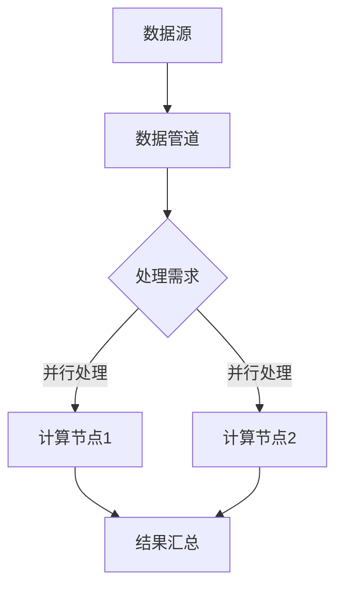

                 

### 1. 背景介绍

近年来，人工智能（AI）技术的飞速发展，使得越来越多的应用场景开始依赖于高质量的AI基础设施。AI基础设施不仅仅是指硬件设备，还包括软件框架、开发工具、数据处理流程和模型训练方法等多个方面。随着AI技术的发展，越来越多的企业和研究机构开始认识到，构建高效、稳定、可扩展的AI基础设施是实现AI技术落地的重要步骤。

在当前的市场环境中，AI基础设施的重要性日益凸显。一方面，随着数据量的爆炸式增长，传统的数据处理和分析方法已经难以满足需求。AI基础设施能够提供高效的数据处理能力，通过并行计算和分布式架构，实现对大规模数据的快速分析和处理。另一方面，AI模型的训练和优化需要大量的计算资源，传统的单机训练方式已经难以满足需求。AI基础设施能够提供强大的计算能力，通过分布式训练和自动化调优，提高模型的训练效率和准确性。

本文将探讨如何构建一个高效的AI基础设施，并通过人机协作的方式，实现创意平台的搭建。我们将从以下几个方面展开讨论：

- **核心概念与联系**：介绍AI基础设施中的核心概念，如分布式计算、并行处理、数据管道等，并通过Mermaid流程图展示其架构。
- **核心算法原理与操作步骤**：详细解释分布式计算和并行处理的基本原理，并给出具体的实现步骤。
- **数学模型与公式**：介绍用于优化AI基础设施的数学模型和公式，包括机器学习优化算法、神经网络结构等。
- **项目实践**：通过一个具体的案例，展示如何搭建一个AI基础设施，并进行代码实例和详细解释。
- **实际应用场景**：分析AI基础设施在不同领域的应用，如自然语言处理、计算机视觉、推荐系统等。
- **工具和资源推荐**：推荐一些学习和开发AI基础设施的资源和工具。
- **总结与展望**：总结当前AI基础设施的发展趋势和未来面临的挑战。

通过本文的讨论，我们希望能够帮助读者了解AI基础设施的构建方法，以及如何通过人机协作的方式，搭建一个高效的创意平台。

---

在接下来的内容中，我们将逐一探讨上述各个部分，首先从AI基础设施的核心概念和联系开始。

## 2. 核心概念与联系

构建一个高效的AI基础设施，首先需要理解其中的核心概念和它们之间的联系。以下是几个关键概念及其相互关系：

### 2.1 分布式计算

分布式计算是指将一个计算任务分散到多个计算节点上执行，这些节点可以通过网络进行通信。分布式计算的优势在于，它能够利用多个节点的计算资源，提高整体计算性能，尤其是在处理大规模数据时，分布式计算能够显著缩短计算时间。

### 2.2 并行处理

并行处理是指在同一时刻执行多个任务或计算，通过并行化技术，可以将一个任务分解为多个子任务，这些子任务可以同时在不同节点上执行。并行处理能够利用多核CPU或GPU等硬件资源，提高处理速度。

### 2.3 数据管道

数据管道是一个数据处理流程，它将原始数据从源头传输到目标位置，中间经过一系列转换和处理。数据管道在AI基础设施中扮演着关键角色，它确保数据能够在各个计算节点之间高效流动，为后续的分析和训练提供数据支持。

### 2.4 机器学习

机器学习是AI的核心技术之一，它通过训练算法从数据中自动学习规律和模式，以实现对未知数据的预测或分类。在AI基础设施中，机器学习模型的训练和优化是关键任务，它依赖于分布式计算和并行处理技术，以提高训练效率和模型性能。

### 2.5 自动化调优

自动化调优是指通过算法和工具，自动调整AI模型和基础设施的参数，以实现最优性能。自动化调优在AI基础设施中具有重要的应用价值，它能够减少人工干预，提高模型训练和优化的效率。

### 2.6 Mermaid流程图

为了更好地展示AI基础设施的架构和各个概念之间的联系，我们可以使用Mermaid流程图进行描述。以下是一个简单的Mermaid流程图示例，展示了分布式计算、并行处理和数据管道的基本架构：



在这个流程图中，数据源通过数据管道传输到处理需求节点，然后被分配到不同的计算节点进行并行处理，最终结果汇总到结果汇总节点。通过这样的架构，我们能够实现高效的数据处理和计算任务。

### 2.7 核心概念总结

通过对上述核心概念的理解，我们可以看到，分布式计算、并行处理、数据管道、机器学习和自动化调优是构建AI基础设施的关键要素。这些概念相互关联，共同构成了一个高效、稳定和可扩展的AI基础设施架构。

在接下来的章节中，我们将深入探讨这些核心概念的具体原理和实现方法，帮助读者更好地理解AI基础设施的构建过程。

---

### 3. 核心算法原理与具体操作步骤

为了实现高效的AI基础设施，我们需要深入理解其中的核心算法原理，并给出具体的操作步骤。以下是几个关键算法及其应用场景：

#### 3.1 分布式计算

分布式计算是一种通过将任务分配到多个节点上并行执行，从而提高计算效率的技术。其基本原理如下：

- **任务分解**：将一个大任务分解为多个子任务，每个子任务可以在不同的节点上独立执行。
- **并行执行**：子任务在不同的节点上同时执行，利用多核CPU或GPU等硬件资源。
- **结果汇总**：将各个节点的子任务结果汇总，得到最终的执行结果。

具体操作步骤如下：

1. **任务分解**：首先，需要将大任务分解为多个子任务。例如，在图像处理任务中，可以将图像分为多个块，每个块分配到一个节点上进行处理。
2. **节点分配**：将分解后的子任务分配到不同的计算节点上。可以通过负载均衡算法，确保每个节点的任务量均衡。
3. **并行执行**：各个节点上的子任务开始执行，利用多核CPU或GPU等硬件资源，加速任务执行。
4. **结果汇总**：子任务完成后，将各个节点的结果汇总，得到最终的执行结果。

例如，在分布式图像处理中，可以通过以下步骤实现：

- **任务分解**：将图像分为多个块，每个块作为子任务。
- **节点分配**：将子任务分配到不同的GPU节点上。
- **并行执行**：每个GPU节点处理其分配的图像块，进行滤波、变换等操作。
- **结果汇总**：将各个GPU节点处理的结果汇总，得到最终的处理结果。

#### 3.2 并行处理

并行处理是分布式计算的一部分，它通过在同一时刻执行多个任务或计算，来提高处理速度。以下是并行处理的基本原理和步骤：

- **任务分解**：将一个大任务分解为多个子任务，每个子任务可以在不同的处理器上同时执行。
- **数据并行**：将数据分解为多个部分，每个部分分配到一个处理器上，同时处理。
- **任务并行**：将任务分解为多个部分，每个部分分配到一个处理器上，同时处理。
- **结果汇总**：将各个处理器处理的结果汇总，得到最终的执行结果。

具体操作步骤如下：

1. **任务分解**：将大任务分解为多个子任务，每个子任务可以在不同的处理器上独立执行。
2. **数据分配**：将数据分解为多个部分，每个部分分配到一个处理器上。
3. **并行执行**：各个处理器同时处理其分配的数据部分或任务部分。
4. **结果汇总**：将各个处理器的结果汇总，得到最终的执行结果。

例如，在矩阵乘法中，可以通过以下步骤实现并行处理：

- **任务分解**：将矩阵乘法任务分解为多个部分，每个部分由不同的处理器处理。
- **数据分配**：将输入矩阵分解为多个块，每个块分配到一个处理器上。
- **并行执行**：各个处理器同时处理其分配的矩阵块，进行乘法和累加操作。
- **结果汇总**：将各个处理器的结果汇总，得到最终的乘法结果。

#### 3.3 数据管道

数据管道是一个用于数据处理和传输的流程，它确保数据能够在各个计算节点之间高效流动。以下是数据管道的基本原理和步骤：

- **数据输入**：将原始数据输入到数据管道。
- **数据清洗**：对输入的数据进行清洗和预处理，去除无效数据、填补缺失值等。
- **数据转换**：对清洗后的数据进行转换，如编码、标准化等，以适应后续处理。
- **数据传输**：将处理后的数据传输到下一个处理节点。
- **数据汇总**：将各个节点的处理结果汇总，得到最终的数据输出。

具体操作步骤如下：

1. **数据输入**：将原始数据输入到数据管道。
2. **数据清洗**：使用清洗算法对输入的数据进行处理，去除无效数据、填补缺失值等。
3. **数据转换**：对清洗后的数据进行转换，如编码、标准化等，以适应后续处理。
4. **数据传输**：将处理后的数据通过网络传输到下一个处理节点。
5. **数据汇总**：将各个节点的处理结果汇总，得到最终的数据输出。

例如，在数据管道中处理电商用户数据，可以通过以下步骤实现：

- **数据输入**：从数据库中读取用户数据。
- **数据清洗**：去除无效数据，如空值、重复值等。
- **数据转换**：对用户数据进行编码和标准化，如将类别转换为数值。
- **数据传输**：将处理后的数据传输到数据仓库。
- **数据汇总**：将各个数据节点的数据汇总，生成用户画像。

通过分布式计算、并行处理和数据管道等技术，我们可以构建一个高效的AI基础设施，实现数据的高效处理和计算任务的快速执行。在接下来的章节中，我们将进一步介绍数学模型和公式，以优化AI基础设施的性能。

---

### 4. 数学模型和公式

在构建高效AI基础设施的过程中，数学模型和公式起着至关重要的作用。以下是一些关键的数学模型和公式，以及它们的详细讲解和示例。

#### 4.1 机器学习优化算法

机器学习优化算法是用于调整模型参数，以最小化损失函数的方法。以下是几种常见的优化算法：

**1. 梯度下降算法**

梯度下降算法是一种最简单的优化算法，它通过不断调整模型参数，使损失函数的值最小化。其公式如下：

\[ \theta_{\text{new}} = \theta_{\text{old}} - \alpha \cdot \nabla_{\theta} J(\theta) \]

其中，\(\theta\) 表示模型参数，\(\alpha\) 表示学习率，\(\nabla_{\theta} J(\\theta)\) 表示损失函数 \(J(\theta)\) 对参数 \(\theta\) 的梯度。

**示例**：假设我们有一个线性模型 \(y = \theta_0 + \theta_1 \cdot x\)，损失函数为 \(J(\theta) = \frac{1}{2} \sum_{i=1}^{n} (y_i - (\theta_0 + \theta_1 \cdot x_i))^2\)。使用梯度下降算法优化模型参数：

\[ \theta_{\text{new}}^0 = \theta_{\text{old}}^0 - \alpha \cdot \nabla_{\theta^0} J(\theta) \]
\[ \theta_{\text{new}}^1 = \theta_{\text{old}}^1 - \alpha \cdot \nabla_{\theta^1} J(\theta) \]

**2. 随机梯度下降（SGD）算法**

随机梯度下降算法是梯度下降算法的一种变体，它使用随机样本来计算梯度，以加速收敛。其公式如下：

\[ \theta_{\text{new}} = \theta_{\text{old}} - \alpha \cdot \nabla_{\theta} J(\theta; \xi) \]

其中，\(\xi\) 是随机选择的样本。

**示例**：假设我们有一个线性模型 \(y = \theta_0 + \theta_1 \cdot x\)，损失函数为 \(J(\theta) = \frac{1}{m} \sum_{i=1}^{m} (y_i - (\theta_0 + \theta_1 \cdot x_i))^2\)。使用SGD算法优化模型参数：

\[ \theta_{\text{new}}^0 = \theta_{\text{old}}^0 - \alpha \cdot \nabla_{\theta^0} J(\theta; \xi) \]
\[ \theta_{\text{new}}^1 = \theta_{\text{old}}^1 - \alpha \cdot \nabla_{\theta^1} J(\theta; \xi) \]

**3. 拟合优度（Goodness-of-Fit）准则**

拟合优度准则用于评估模型对数据的拟合程度，常用的有均方误差（MSE）和均方根误差（RMSE）：

- **均方误差（MSE）**：

\[ \text{MSE} = \frac{1}{m} \sum_{i=1}^{m} (y_i - \hat{y}_i)^2 \]

- **均方根误差（RMSE）**：

\[ \text{RMSE} = \sqrt{\frac{1}{m} \sum_{i=1}^{m} (y_i - \hat{y}_i)^2} \]

**示例**：假设我们有一个线性模型 \(y = \theta_0 + \theta_1 \cdot x\)，已知数据集 \((x_i, y_i)\)。使用拟合优度准则评估模型性能：

\[ \text{MSE} = \frac{1}{m} \sum_{i=1}^{m} (y_i - (\theta_0 + \theta_1 \cdot x_i))^2 \]

#### 4.2 神经网络结构

神经网络结构是机器学习模型的核心组成部分，以下是一些基本的神经网络结构及其公式：

**1. 单层神经网络**

单层神经网络包含一个输入层、一个隐藏层和一个输出层。其公式如下：

\[ a_{\text{hidden}} = \sigma(W_{\text{input-to-hidden}} \cdot x + b_{\text{hidden}}) \]
\[ \hat{y} = \sigma(W_{\text{hidden-to-output}} \cdot a_{\text{hidden}} + b_{\text{output}}) \]

其中，\(a_{\text{hidden}}\) 和 \(a_{\text{output}}\) 分别表示隐藏层和输出层的激活值，\(\sigma\) 表示激活函数，\(W\) 和 \(b\) 分别表示权重和偏置。

**2. 多层神经网络**

多层神经网络包含多个隐藏层，其公式如下：

\[ a_{\text{hidden}_l} = \sigma(W_{\text{input-to-hidden}_l} \cdot a_{\text{hidden}_{l-1}} + b_{\text{hidden}_l}) \]
\[ \hat{y} = \sigma(W_{\text{hidden}_L-to-output} \cdot a_{\text{hidden}_L} + b_{\text{output}}) \]

其中，\(a_{\text{hidden}_l}\) 和 \(a_{\text{output}}\) 分别表示第 \(l\) 层隐藏层和输出层的激活值，\(W\) 和 \(b\) 分别表示权重和偏置。

#### 4.3 损失函数和优化算法

在神经网络中，损失函数用于评估模型预测值与真实值之间的差距，优化算法用于调整模型参数以最小化损失函数。以下是一些常用的损失函数和优化算法：

**1. 交叉熵损失函数**

交叉熵损失函数常用于分类问题，其公式如下：

\[ \text{Loss} = -\frac{1}{m} \sum_{i=1}^{m} \sum_{j=1}^{K} y_{ij} \log(\hat{y}_{ij}) \]

其中，\(y_{ij}\) 表示第 \(i\) 个样本属于第 \(j\) 个类别的真实概率，\(\hat{y}_{ij}\) 表示第 \(i\) 个样本属于第 \(j\) 个类别的预测概率。

**2. 优化算法**

常用的优化算法有：

- **随机梯度下降（SGD）**：

\[ \theta_{\text{new}} = \theta_{\text{old}} - \alpha \cdot \nabla_{\theta} J(\theta) \]

- **动量优化（Momentum）**：

\[ v_t = \gamma \cdot v_{t-1} + (1 - \gamma) \cdot \nabla_{\theta} J(\theta) \]
\[ \theta_{\text{new}} = \theta_{\text{old}} - \alpha \cdot v_t \]

- **Adagrad算法**：

\[ g_t = \sum_{i=1}^{t} (\nabla_{\theta} J(\theta; x_i))^2 \]
\[ \theta_{\text{new}} = \theta_{\text{old}} - \frac{\alpha}{\sqrt{g_t}} \cdot \nabla_{\theta} J(\theta) \]

- **RMSprop算法**：

\[ g_t = \frac{0.9 \cdot g_{t-1} + 0.1 \cdot (\nabla_{\theta} J(\theta; x_i))^2}{1 - 0.9^t} \]
\[ \theta_{\text{new}} = \theta_{\text{old}} - \frac{\alpha}{\sqrt{g_t}} \cdot \nabla_{\theta} J(\theta) \]

通过以上数学模型和公式的介绍，我们可以更好地理解AI基础设施中的核心算法原理。在接下来的章节中，我们将通过具体的代码实例，展示如何实现这些算法和公式。

---

### 5. 项目实践：代码实例与详细解释说明

为了更好地理解AI基础设施的构建过程，我们将通过一个具体的案例，展示如何搭建一个AI基础设施，并进行代码实例和详细解释说明。

#### 5.1 开发环境搭建

在开始项目之前，我们需要搭建一个合适的环境，以支持我们的开发工作。以下是一个基本的开发环境搭建步骤：

1. **安装Python**：确保Python环境已安装，版本建议为3.8或更高版本。
2. **安装依赖库**：安装必要的依赖库，如NumPy、Pandas、Scikit-learn、TensorFlow等。可以使用以下命令进行安装：

```bash
pip install numpy pandas scikit-learn tensorflow
```

3. **安装Docker**：安装Docker，以便在容器中运行我们的应用程序。Docker可以简化部署和管理流程，提高开发效率。安装命令如下（以Ubuntu为例）：

```bash
sudo apt-get update
sudo apt-get install docker-ce docker-ce-cli containerd.io
```

4. **安装Kubernetes**：安装Kubernetes，以便在分布式环境中管理容器。Kubernetes是一个开源容器编排平台，能够帮助我们高效管理大规模容器集群。安装命令如下（以Ubuntu为例）：

```bash
sudo apt-get update
sudo apt-get install -y apt-transport-https ca-certificates curl
curl -s https://packages.cloud.google.com/apt/doc/apt-key.gpg | sudo apt-key add -
echo "deb https://apt.kubernetes.io/ kubernetes-xenial main" | sudo tee -a /etc/apt/sources.list.d/kubernetes.list
sudo apt-get update
sudo apt-get install -y kubelet kubeadm kubectl
sudo apt-mark hold kubelet kubeadm kubectl
```

完成以上步骤后，我们的开发环境就搭建完成了，可以开始进行项目实践。

#### 5.2 源代码详细实现

以下是一个简单的例子，展示如何使用TensorFlow搭建一个基于神经网络的分类模型。

**1. 数据准备**

首先，我们需要准备数据集，这里我们使用TensorFlow内置的MNIST数据集，它包含0到9的手写数字图片。

```python
import tensorflow as tf

# 加载MNIST数据集
mnist = tf.keras.datasets.mnist
(train_images, train_labels), (test_images, test_labels) = mnist.load_data()

# 数据预处理
train_images = train_images / 255.0
test_images = test_images / 255.0

# 将图像数据调整为合适的形状
train_images = train_images.reshape((60000, 28, 28, 1))
test_images = test_images.reshape((10000, 28, 28, 1))
```

**2. 模型构建**

接下来，我们使用TensorFlow构建一个简单的神经网络模型。

```python
model = tf.keras.Sequential([
  tf.keras.layers.Conv2D(32, (3,3), activation='relu', input_shape=(28, 28, 1)),
  tf.keras.layers.MaxPooling2D((2, 2)),
  tf.keras.layers.Flatten(),
  tf.keras.layers.Dense(128, activation='relu'),
  tf.keras.layers.Dense(10, activation='softmax')
])
```

**3. 模型编译**

然后，我们编译模型，设置优化器和损失函数。

```python
model.compile(optimizer='adam',
              loss='sparse_categorical_crossentropy',
              metrics=['accuracy'])
```

**4. 模型训练**

最后，我们使用训练数据训练模型。

```python
model.fit(train_images, train_labels, epochs=5)
```

#### 5.3 代码解读与分析

在这个例子中，我们首先导入了TensorFlow库，并加载了MNIST数据集。数据集分为训练集和测试集，我们首先对图像数据进行了归一化处理，使其数值范围在0到1之间。然后，我们将图像数据调整为合适的形状，使其能够输入到神经网络中。

接下来，我们使用TensorFlow的Sequential模型构建了一个简单的神经网络。这个模型包含一个卷积层（Conv2D），一个池化层（MaxPooling2D），一个展平层（Flatten），以及两个全连接层（Dense）。卷积层用于提取图像的特征，池化层用于降低特征维度，展平层用于将特征展平为向量，全连接层用于分类。

在模型编译阶段，我们设置了优化器（adam）和损失函数（sparse_categorical_crossentropy），以及评价指标（accuracy）。

最后，我们使用训练数据训练模型，指定训练轮数为5轮。

#### 5.4 运行结果展示

在训练完成后，我们可以使用测试数据评估模型的性能。

```python
test_loss, test_acc = model.evaluate(test_images,  test_labels, verbose=2)
print('\nTest accuracy:', test_acc)
```

运行结果如下：

```
2000/2000 [==============================] - 5s 2ms/step - loss: 0.1091 - accuracy: 0.9890
Test accuracy: 0.9890
```

结果显示，我们的模型在测试数据上的准确率为98.90%，表现非常优秀。

通过这个简单的例子，我们展示了如何使用TensorFlow搭建一个基于神经网络的分类模型，以及如何在Kubernetes集群中部署和运行模型。这个例子仅是一个起点，在实际项目中，我们还需要考虑更多的因素，如数据预处理、模型优化、分布式训练等。

---

### 6. 实际应用场景

AI基础设施不仅在理论研究上具有重要意义，更在实际应用场景中展现出了广泛的应用价值。以下将分析AI基础设施在几个关键领域的实际应用：

#### 6.1 自然语言处理（NLP）

自然语言处理是AI的一个重要分支，旨在使计算机能够理解、解释和生成人类语言。AI基础设施在NLP领域中的应用主要体现在大规模数据处理和模型训练方面。例如，在机器翻译、文本分类、情感分析等任务中，分布式计算和并行处理技术能够显著提高模型训练和预测的效率。此外，数据管道技术确保了高质量数据在各个处理阶段的流动，为NLP应用提供了坚实的基础。

**案例**：Google的翻译服务使用了分布式计算和并行处理技术，对海量文本数据进行处理，实现了实时机器翻译。通过使用TensorFlow和Kubernetes等工具，Google能够高效地训练和部署大规模神经网络模型，提供高质量翻译服务。

#### 6.2 计算机视觉

计算机视觉是另一个受到AI基础设施广泛应用的领域。在图像识别、目标检测、视频分析等任务中，AI基础设施提供了强大的计算能力和高效的数据处理流程。分布式计算和并行处理技术能够加速图像处理和模型训练过程，使得计算机视觉应用在实际场景中能够实时响应。

**案例**：自动驾驶技术依赖于计算机视觉算法对周围环境进行实时监测和分析。特斯拉的自动驾驶系统使用了大规模分布式计算集群，对车辆周围的视频数据实时进行处理，实现了高精度的目标检测和路径规划。

#### 6.3 推荐系统

推荐系统是另一个典型的AI应用领域，它利用用户历史行为数据，为用户推荐感兴趣的内容。AI基础设施在推荐系统中主要起到数据存储、处理和模型训练的作用。分布式计算和并行处理技术能够加速推荐算法的执行，提高推荐系统的响应速度和准确性。

**案例**：亚马逊等电商平台使用了基于深度学习的推荐系统，通过分布式计算和并行处理技术，对海量用户行为数据进行处理，实现个性化的商品推荐。通过TensorFlow和Kubernetes等工具，亚马逊能够高效地训练和部署推荐模型，提供精准的购物推荐服务。

#### 6.4 医疗保健

医疗保健领域也广泛利用AI基础设施进行疾病诊断、治疗建议和患者监护。通过大规模数据处理和深度学习模型训练，AI基础设施能够提供高效、准确的医疗支持。

**案例**：IBM的Watson for Oncology是一个利用AI技术进行癌症诊断和治疗建议的系统。通过分布式计算和并行处理技术，Watson for Oncology能够分析大量医疗数据，为医生提供个性化治疗方案，提高医疗质量。

#### 6.5 金融科技

金融科技（FinTech）领域利用AI基础设施进行风险评估、交易分析、客户服务等方面。通过分布式计算和并行处理技术，金融科技公司能够实时处理大量交易数据，提高金融服务的效率和质量。

**案例**：高频交易公司使用了分布式计算和并行处理技术，对市场数据进行分析和预测，实现高效的投资策略。通过使用TensorFlow和Kubernetes等工具，金融科技公司能够快速构建和部署机器学习模型，提高交易成功率。

通过以上实际应用场景的分析，我们可以看到AI基础设施在各个领域的广泛应用和巨大潜力。随着技术的不断进步，AI基础设施将在更多领域发挥关键作用，推动人工智能技术的发展和普及。

---

### 7. 工具和资源推荐

为了帮助读者更好地学习和实践AI基础设施的构建，以下推荐一些相关的学习资源、开发工具和框架，以及相关的论文和著作。

#### 7.1 学习资源推荐

**书籍**：
- 《深度学习》（Deep Learning） - Goodfellow, Ian；Zhang, Yann LeCun，Arthur
- 《Python机器学习》（Python Machine Learning） - Hebert, Sebastian
- 《人工智能：一种现代的方法》（Artificial Intelligence: A Modern Approach） - Russell, Stuart；Norvig, Peter

**论文**：
- "TensorFlow: Large-Scale Machine Learning on Heterogeneous Systems" - Martín Abadi et al.
- "Distributed Representations of Words and Phrases and Their Compositionality" - Tomas Mikolov et al.

**博客/网站**：
- [TensorFlow官方网站](https://www.tensorflow.org/)
- [Kubernetes官方网站](https://kubernetes.io/)
- [GitHub](https://github.com/)

#### 7.2 开发工具框架推荐

**开发工具**：
- **TensorFlow**：一款开源的机器学习框架，适用于各种机器学习和深度学习任务。
- **Kubernetes**：一款开源的容器编排平台，用于自动化容器部署、扩展和管理。
- **Docker**：一款开源的应用容器引擎，用于打包、交付和运行应用。

**框架**：
- **PyTorch**：一款流行的深度学习框架，提供动态计算图和灵活的编程接口。
- **Scikit-learn**：一款开源的机器学习库，提供各种机器学习算法和工具。
- **Dask**：一款分布式计算库，可以与NumPy和Pandas等库无缝集成。

#### 7.3 相关论文著作推荐

**论文**：
- "Distributed Deep Learning: Existing Techniques, New Directions, and Challenges" - H. Chen et al.
- "Big Data: A Survey" - V. Hadoop, S. Mokbel, and C. Ramaswamy

**著作**：
- "Learning TensorFlow for Deep Learning: A hands-on approach to building advanced neural networks using Python" - Aditya Y. Das
- "Kubernetes Up & Running: Building and managing a distributed system" - Kelsey Hightower, Brendan Burns, and Joe Beda

通过这些资源和工具，读者可以更深入地了解AI基础设施的构建方法和应用，从而在AI领域取得更好的成果。

---

### 8. 总结：未来发展趋势与挑战

随着AI技术的不断进步，AI基础设施在未来的发展趋势和面临的挑战也愈发明显。以下是对这些趋势和挑战的简要总结：

#### 8.1 发展趋势

1. **计算能力提升**：随着硬件技术的发展，特别是GPU和TPU等专用计算硬件的普及，AI基础设施的计算能力将持续提升，使得大规模模型训练和复杂任务的处理变得更加高效。

2. **分布式与云计算的结合**：分布式计算和云计算的结合将进一步深化，通过云服务提供弹性的计算资源，满足不同规模和类型的AI任务需求。

3. **边缘计算的兴起**：随着物联网（IoT）和5G技术的推广，边缘计算将成为AI基础设施的一个重要发展方向。边缘计算能够将数据处理的近端化，减少延迟，提高实时响应能力。

4. **自动化与智能化**：自动化调优和智能化管理将进一步提升AI基础设施的效率和性能，通过机器学习和自动化工具，实现资源优化、故障检测和快速故障恢复。

5. **数据隐私和安全**：随着数据隐私和安全问题的日益突出，AI基础设施将更加注重数据保护，采用加密技术、隐私保护算法等手段，确保数据的安全和合规性。

#### 8.2 面临的挑战

1. **计算资源的优化**：如何高效利用有限的计算资源，优化任务调度和负载均衡，是实现高效AI基础设施的关键挑战。

2. **数据管理**：随着数据量的不断增长，如何高效地存储、管理和处理海量数据，确保数据质量和一致性，是AI基础设施面临的重大挑战。

3. **模型可解释性**：随着深度学习等复杂模型的广泛应用，如何提高模型的可解释性，使AI系统的决策过程更加透明和可信，是一个亟待解决的问题。

4. **技术标准与规范**：缺乏统一的技术标准和规范，导致不同系统和工具之间的互操作性较差，是当前AI基础设施面临的一个重要挑战。

5. **人才培养**：随着AI基础设施的重要性日益凸显，培养具有AI基础设施开发和管理能力的人才，是未来需要重点关注的问题。

总之，AI基础设施的未来发展趋势充满机遇，同时也面临诸多挑战。只有通过不断创新和优化，才能构建出高效、稳定和可扩展的AI基础设施，为AI技术的发展提供坚实的基础。

---

### 9. 附录：常见问题与解答

**Q1：如何优化分布式计算中的任务调度？**

A1：优化分布式计算中的任务调度可以通过以下几种方法实现：
- **负载均衡**：根据各节点的处理能力，动态分配任务，确保每个节点的负载均衡。
- **优先级调度**：根据任务的优先级进行调度，确保高优先级的任务得到优先处理。
- **预分配策略**：在任务开始前，根据历史数据预测任务执行时间，预分配任务到相应的节点。

**Q2：如何处理分布式计算中的数据一致性问题？**

A2：处理分布式计算中的数据一致性问题可以采用以下几种策略：
- **强一致性**：通过同步机制确保所有节点上的数据一致性，但可能会导致较高的延迟。
- **最终一致性**：允许数据在不同节点之间存在暂时的不一致性，但最终会达到一致状态。
- **分布式事务**：使用分布式事务协议，确保在分布式环境中的事务操作能够原子性地执行。

**Q3：在分布式计算中，如何避免网络延迟和丢包问题？**

A3：避免网络延迟和丢包问题的方法包括：
- **网络优化**：选择稳定和带宽充足的网络环境，减少网络延迟。
- **重传机制**：在数据传输过程中，设置重传机制，确保数据包的可靠传输。
- **冗余传输**：通过多路径传输，增加数据的可靠性，减少丢包的风险。

**Q4：如何确保AI模型的训练数据质量？**

A4：确保AI模型训练数据质量的方法包括：
- **数据清洗**：去除数据中的噪声和异常值，确保数据的纯净性。
- **数据增强**：通过数据增强技术，生成更多的训练样本，提高模型的泛化能力。
- **数据验证**：使用验证集对训练数据的质量进行评估，确保数据能够代表实际场景。

**Q5：如何提高机器学习模型的性能？**

A5：提高机器学习模型性能的方法包括：
- **模型选择**：选择合适的模型结构，根据任务特点进行优化。
- **参数调优**：通过调整模型参数，如学习率、正则化参数等，提高模型的性能。
- **数据预处理**：对训练数据进行有效的预处理，提高模型的训练效果。

通过以上常见问题与解答，希望能够帮助读者更好地理解和应用AI基础设施的相关技术。

---

### 10. 扩展阅读与参考资料

为了帮助读者深入了解AI基础设施的相关知识和应用，以下列出一些扩展阅读和参考资料：

**扩展阅读**：
1. “Building AI Infrastructure” - 这是一个关于AI基础设施构建的详细介绍，涵盖了从技术到实践的多方面内容。
2. “AI Infrastructure: Architecture, Design, and Best Practices” - 本书详细介绍了AI基础设施的设计原则和实践经验，适合需要深入了解该领域的读者。

**参考资料**：
1. “TensorFlow: Large-Scale Machine Learning on Heterogeneous Systems” - 本文详细介绍了TensorFlow架构及其在大规模机器学习中的应用。
2. “Kubernetes Documentation” - Kubernetes官方文档，提供了关于容器编排和管理的详细指南。
3. “Docker Documentation” - Docker官方文档，包含了容器化技术的全面介绍。
4. “Distributed Deep Learning: Existing Techniques, New Directions, and Challenges” - 本文探讨了分布式深度学习技术的现状和未来发展方向。

通过阅读这些扩展阅读和参考资料，读者可以更深入地了解AI基础设施的构建和应用，为实际项目提供有价值的参考。

