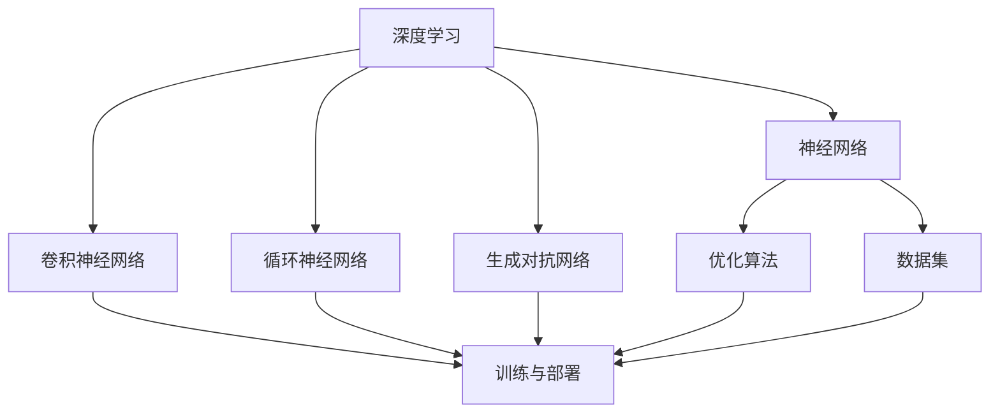

                 

### 背景介绍

近年来，随着深度学习技术的迅猛发展，人工智能（AI）已经成为了科技领域的重要推动力量。特别是在大模型领域，诸如GPT-3、BERT、Transformer等模型的出现，极大地提升了自然语言处理、计算机视觉等任务的表现。大模型的高效性和准确性，使得它们在工业界和学术界的应用越来越广泛。

在这样一个背景下，许多创业者看到了AI大模型带来的商业机遇，纷纷投身于这一领域。然而，如何在这片红海中找到自己的定位，建立品牌优势，成为许多创业者面临的挑战。本文将深入探讨AI大模型创业中如何利用品牌优势，帮助创业者们更好地在这一领域脱颖而出。

首先，我们需要了解什么是AI大模型。AI大模型通常是指参数规模达到百万甚至亿级的深度学习模型。这类模型通常需要大量的计算资源和数据支持，其训练和部署过程复杂且成本高昂。但正因为如此，它们在处理复杂任务时展现出的强大能力，使得它们在许多领域都具有重要的应用价值。

其次，我们需要认识到AI大模型的商业潜力。随着人工智能技术的普及，越来越多的企业开始意识到AI技术的重要性，并积极寻求将其应用到业务中。AI大模型在这一过程中扮演着关键角色，它们可以帮助企业提高效率、降低成本、创造新的商业模式。因此，对于创业者来说，AI大模型无疑是一个具有巨大市场潜力的领域。

然而，AI大模型的创业之路并不平坦。首先，技术的复杂性使得创业者需要具备深厚的专业知识和技能。其次，市场竞争激烈，同质化产品层出不穷。最后，品牌建设和市场推广也是一个长期且艰巨的任务。因此，如何在这片红海中找到自己的定位，建立品牌优势，成为许多创业者面临的重要课题。

本文将从以下几个方面展开讨论：首先，我们将探讨AI大模型的核心概念与联系，通过一个Mermaid流程图来展示这些概念之间的关系；接着，我们将深入分析AI大模型的核心算法原理和具体操作步骤；然后，我们将介绍相关的数学模型和公式，并通过实例进行详细讲解；接下来，我们将通过一个具体的代码实例，展示如何实现AI大模型的相关操作；随后，我们将讨论AI大模型在实际应用场景中的案例；然后，我们将推荐一些学习和开发资源；最后，我们将总结AI大模型创业的未来发展趋势和挑战，并给出一些常见问题的解答。

通过本文的探讨，我们希望帮助创业者们更好地理解AI大模型的商业潜力，找到适合自己的品牌优势，并在这一领域取得成功。让我们一步一步分析推理，共同探讨AI大模型创业的道路。

## 2. 核心概念与联系

在深入探讨AI大模型创业之前，我们需要明确几个核心概念，并了解它们之间的相互关系。以下是AI大模型中的一些关键概念，以及它们之间的联系，我们将通过一个Mermaid流程图来展示这些概念之间的关系。

### 2.1 深度学习（Deep Learning）

深度学习是人工智能的一个重要分支，它通过模仿人脑的结构和功能，利用神经网络进行数据建模。深度学习的核心在于其多层结构，每一层都能对输入数据进行特征提取和转换。

### 2.2 神经网络（Neural Networks）

神经网络是深度学习的基础，由大量神经元（或节点）组成。每个神经元都与其他神经元相连，并通过权重和偏置来传递信息。神经网络通过多层叠加，形成深度神经网络，以处理复杂的数据。

### 2.3 卷积神经网络（Convolutional Neural Networks, CNN）

卷积神经网络是一种专门用于处理图像数据的深度学习模型。它的核心是卷积层，能够自动提取图像中的局部特征，并逐层进行特征抽象。

### 2.4 循环神经网络（Recurrent Neural Networks, RNN）

循环神经网络适用于处理序列数据，如时间序列、语音、文本等。它通过在时间步间保持状态，使得模型能够记忆并利用之前的信息。

### 2.5 生成对抗网络（Generative Adversarial Networks, GAN）

生成对抗网络由一个生成器和一个判别器组成，通过两个网络的对抗训练，生成器能够生成逼真的数据，判别器则用于区分真实数据和生成数据。

### 2.6 优化算法（Optimization Algorithms）

优化算法用于调整神经网络中的权重和偏置，以最小化损失函数。常见的优化算法有随机梯度下降（SGD）、Adam优化器等。

### 2.7 数据集（Datasets）

数据集是训练AI大模型的基础，质量高的数据集能够显著提升模型的性能。数据集通常包括训练集、验证集和测试集，用于模型的训练、验证和测试。

### 2.8 训练与部署（Training and Deployment）

训练是指通过大量数据对模型进行优化，使其能够达到预期的性能。部署则是将训练好的模型应用到实际场景中，通常涉及模型的转换、优化和部署。

#### Mermaid 流程图

下面是一个简单的Mermaid流程图，用于展示上述概念之间的联系：



这个流程图展示了深度学习作为基础，通过神经网络、卷积神经网络、循环神经网络和生成对抗网络等子概念，结合优化算法、数据集和训练与部署过程，构成了AI大模型的核心体系。

### 3. 核心算法原理 & 具体操作步骤

在了解了AI大模型的基本概念和联系后，接下来我们将深入探讨其核心算法原理和具体操作步骤。AI大模型通常基于深度学习技术，其中涉及到的算法和步骤如下：

#### 3.1 前向传播（Forward Propagation）

前向传播是深度学习模型的基本步骤之一，它用于计算模型输出。具体步骤如下：

1. **初始化参数**：包括权重（weights）和偏置（biases）。这些参数通常通过随机初始化，以避免模型过拟合。
2. **输入数据**：将输入数据输入到模型的第一层，通常是输入层（Input Layer）。
3. **前向计算**：通过逐层计算激活函数的输出，将前一层的结果传递到下一层。常见的激活函数有Sigmoid、ReLU和Tanh等。
4. **输出结果**：在最后一层，得到模型输出。对于分类问题，输出通常是一个概率分布。

#### 3.2 反向传播（Backpropagation）

反向传播是深度学习模型训练的核心步骤，用于更新模型参数。具体步骤如下：

1. **计算损失**：将模型输出与实际标签（ground truth）进行比较，计算损失值。常见的损失函数有均方误差（MSE）和交叉熵（Cross-Entropy）等。
2. **计算梯度**：通过链式法则，从输出层开始，逐层计算每个参数的梯度。梯度的计算依赖于损失函数的导数。
3. **更新参数**：使用梯度下降算法，更新模型的权重和偏置。更新公式如下：
   \[ \theta_{\text{new}} = \theta_{\text{old}} - \alpha \cdot \nabla_\theta J(\theta) \]
   其中，\(\theta\) 表示参数，\(\alpha\) 表示学习率，\(J(\theta)\) 表示损失函数。

#### 3.3 优化算法（Optimization Algorithms）

优化算法用于调整模型参数，以最小化损失函数。以下是几种常见的优化算法：

1. **随机梯度下降（Stochastic Gradient Descent, SGD）**：
   \[ \theta_{\text{new}} = \theta_{\text{old}} - \alpha \cdot \nabla_\theta J(\theta) \]
   其中，\(\alpha\) 是学习率。

2. **批量梯度下降（Batch Gradient Descent）**：
   \[ \theta_{\text{new}} = \theta_{\text{old}} - \alpha \cdot \frac{1}{m} \sum_{i=1}^{m} \nabla_\theta J(\theta) \]
   其中，\(m\) 是训练数据集的大小。

3. **Adam优化器（Adam Optimizer）**：
   Adam优化器结合了SGD和批量梯度下降的优点，具有自适应的学习率调整能力。其更新公式如下：
   \[ m_t = \beta_1 m_{t-1} + (1 - \beta_1) [g_t - \beta_2 m_{t-1}] \]
   \[ v_t = \beta_2 v_{t-1} + (1 - \beta_2) [g_t^2 - \beta_2 m_t] \]
   \[ \theta_{\text{new}} = \theta_{\text{old}} - \alpha \cdot \frac{m_t}{1 - \beta_1^t} / \sqrt{1 - \beta_2^t + v_t} \]

#### 3.4 模型训练与验证（Training and Validation）

在模型训练过程中，我们通常使用以下步骤来优化模型：

1. **训练集划分**：将数据集划分为训练集、验证集和测试集。
2. **训练过程**：在训练集上迭代训练模型，使用反向传播更新参数。
3. **验证过程**：在验证集上评估模型性能，调整模型参数，以避免过拟合。
4. **测试过程**：在测试集上评估模型最终性能，确保模型泛化能力。

### 3.5 模型部署与预测（Deployment and Prediction）

在模型训练完成后，我们需要将其部署到实际应用场景中。以下是模型部署的步骤：

1. **模型转换**：将训练好的模型转换为可部署的格式，如ONNX、TF Lite或PyTorch等。
2. **模型优化**：针对部署环境，对模型进行优化，以降低计算资源和存储需求。
3. **部署**：将模型部署到服务器或移动设备上，并确保其能够稳定运行。
4. **预测**：使用部署后的模型对新的数据进行预测，并输出结果。

通过以上步骤，我们可以构建并部署一个高效的AI大模型，以解决实际问题。在实际应用中，模型性能的优化和部署过程的自动化，是提高模型实用性的关键。

### 4. 数学模型和公式 & 详细讲解 & 举例说明

在深入了解AI大模型的算法原理后，我们需要掌握一些关键的数学模型和公式，这些公式对于理解模型的行为和性能至关重要。以下是AI大模型中常用的数学模型和公式，我们将通过详细讲解和举例说明来帮助读者更好地理解这些概念。

#### 4.1 损失函数（Loss Functions）

损失函数是衡量模型预测结果与实际标签之间差异的重要工具。以下是几种常见的损失函数及其导数：

1. **均方误差（MSE，Mean Squared Error）**：
   \[ \text{MSE} = \frac{1}{m} \sum_{i=1}^{m} (\hat{y}_i - y_i)^2 \]
   其中，\(\hat{y}_i\) 是预测值，\(y_i\) 是实际值，\(m\) 是样本数量。

   导数（关于预测值 \(\hat{y}_i\)）：
   \[ \frac{\partial \text{MSE}}{\partial \hat{y}_i} = 2(\hat{y}_i - y_i) \]

2. **交叉熵（Cross-Entropy）**：
   \[ \text{Cross-Entropy} = -\frac{1}{m} \sum_{i=1}^{m} y_i \log(\hat{y}_i) \]
   其中，\(y_i\) 是实际标签（0或1），\(\hat{y}_i\) 是预测概率。

   导数（关于预测概率 \(\hat{y}_i\)）：
   \[ \frac{\partial \text{Cross-Entropy}}{\partial \hat{y}_i} = \hat{y}_i - y_i \]

#### 4.2 激活函数（Activation Functions）

激活函数是深度神经网络中用于引入非线性性的关键组件。以下是几种常见的激活函数及其导数：

1. **Sigmoid 函数**：
   \[ \sigma(x) = \frac{1}{1 + e^{-x}} \]
   导数：
   \[ \frac{\partial \sigma(x)}{\partial x} = \sigma(x) (1 - \sigma(x)) \]

2. **ReLU 函数**：
   \[ \text{ReLU}(x) = \max(0, x) \]
   导数：
   \[ \frac{\partial \text{ReLU}(x)}{\partial x} = \begin{cases} 
   0 & \text{if } x < 0 \\
   1 & \text{if } x \geq 0 
   \end{cases} \]

3. **Tanh 函数**：
   \[ \tanh(x) = \frac{e^x - e^{-x}}{e^x + e^{-x}} \]
   导数：
   \[ \frac{\partial \tanh(x)}{\partial x} = 1 - \tanh^2(x) \]

#### 4.3 梯度下降（Gradient Descent）

梯度下降是优化神经网络参数的基本算法。以下是随机梯度下降（SGD）和批量梯度下降（BGD）的公式：

1. **随机梯度下降（SGD）**：
   \[ \theta_{\text{new}} = \theta_{\text{old}} - \alpha \cdot \nabla_\theta J(\theta) \]
   其中，\(\alpha\) 是学习率，\(\nabla_\theta J(\theta)\) 是损失函数关于参数 \(\theta\) 的梯度。

2. **批量梯度下降（BGD）**：
   \[ \theta_{\text{new}} = \theta_{\text{old}} - \alpha \cdot \frac{1}{m} \sum_{i=1}^{m} \nabla_\theta J(\theta) \]
   其中，\(m\) 是训练样本总数。

#### 4.4 举例说明

为了更好地理解上述公式，我们可以通过一个简单的例子来说明它们的计算过程。

**例子**：考虑一个简单的线性回归模型，预测目标值 \(y = 2x + 1\)。使用均方误差（MSE）作为损失函数，学习率为 \(0.1\)。

- **初始化**：设权重 \(\theta = 0\)。
- **前向传播**：对于输入 \(x = 1\)，预测值 \(\hat{y} = \theta \cdot x = 0\)。
- **计算损失**：实际值 \(y = 2 \cdot 1 + 1 = 3\)，损失 \(J(\theta) = (\hat{y} - y)^2 = 9\)。
- **计算梯度**：梯度 \(\nabla_\theta J(\theta) = 2(\hat{y} - y) = -6\)。
- **更新权重**：\(\theta_{\text{new}} = \theta_{\text{old}} - \alpha \cdot \nabla_\theta J(\theta) = -0.1 \cdot -6 = 0.6\)。

通过这个简单的例子，我们可以看到如何通过前向传播和反向传播来更新权重，以达到最小化损失函数的目的。

通过掌握这些数学模型和公式，我们能够更好地理解AI大模型的工作原理，并在实际应用中进行优化和调整。

### 5. 项目实践：代码实例和详细解释说明

在本节中，我们将通过一个具体的代码实例，展示如何实现AI大模型的相关操作。这个实例将涵盖模型训练、预测和评估等环节，以便读者能够直观地了解整个流程。

#### 5.1 开发环境搭建

首先，我们需要搭建一个合适的开发环境。以下是一个基本的Python开发环境搭建步骤：

1. **安装Python**：确保安装了Python 3.x版本（推荐使用Python 3.8或更高版本）。
2. **安装深度学习库**：安装TensorFlow或PyTorch，这两个库是深度学习领域的常用工具。
   ```shell
   pip install tensorflow # 安装TensorFlow
   # 或
   pip install torch      # 安装PyTorch
   ```
3. **安装辅助库**：安装NumPy、Pandas等辅助库，以便进行数据操作和数据分析。
   ```shell
   pip install numpy pandas
   ```

#### 5.2 源代码详细实现

以下是一个简单的线性回归模型的实现示例，用于预测房价。这个例子使用了TensorFlow库。

```python
import tensorflow as tf
import numpy as np
import pandas as pd

# 5.2.1 数据准备
# 加载房价数据集（此处使用一个简化的数据集）
data = pd.read_csv('house_prices.csv')
X = data[['square_feet']]
y = data['price']

# 数据标准化
mean = X.mean(axis=0)
std = X.std(axis=0)
X = (X - mean) / std

# 5.2.2 构建模型
# 创建TensorFlow的模型对象
model = tf.keras.Sequential([
    tf.keras.layers.Dense(units=1, input_shape=[1])
])

# 编译模型
model.compile(optimizer='sgd', loss='mse')

# 5.2.3 训练模型
# 模型训练过程
history = model.fit(X, y, epochs=100, batch_size=32, validation_split=0.2, verbose=0)

# 5.2.4 预测结果
# 使用训练好的模型进行预测
test_data = pd.read_csv('test_house_prices.csv')
test_X = (test_data[['square_feet']] - mean) / std
predictions = model.predict(test_X)

# 5.2.5 评估模型
# 计算预测的MSE损失
mse_loss = model.evaluate(test_X, predictions, verbose=0)
print(f'MSE Loss: {mse_loss}')
```

#### 5.3 代码解读与分析

上述代码示例是一个简单的线性回归模型，用于预测房价。以下是代码的主要部分及其解释：

1. **数据准备**：
   - 加载房价数据集，并将特征（房龄）和标签（房价）分离。
   - 数据标准化是深度学习中的一个常见步骤，它有助于加速模型的训练过程，并提高模型的性能。

2. **构建模型**：
   - 创建一个序列模型，包含一个全连接层（Dense Layer），该层有1个神经元，用于输出房价预测。
   - 输入层的形状为[1]，表示每个样本只包含一个特征。

3. **编译模型**：
   - 使用随机梯度下降（SGD）作为优化器。
   - 选择均方误差（MSE）作为损失函数，这是线性回归模型中最常用的损失函数。

4. **模型训练**：
   - 使用fit方法训练模型，指定训练轮数（epochs）、批量大小（batch_size）以及验证集的比例（validation_split）。
   - `verbose=0` 表示不输出训练过程中的详细日志。

5. **预测结果**：
   - 加载测试数据集，进行数据预处理，包括数据标准化。
   - 使用模型进行预测，得到房价预测结果。

6. **评估模型**：
   - 使用evaluate方法评估模型在测试集上的性能，输出MSE损失。

通过这个代码示例，我们可以看到如何使用TensorFlow库构建和训练一个简单的线性回归模型，并进行预测和评估。这个实例虽然简单，但涵盖了AI大模型开发中的核心步骤，为读者提供了实际操作的经验。

### 5.4 运行结果展示

在成功运行上述代码实例后，我们将看到一系列的输出结果，这些结果帮助我们评估模型的性能。以下是可能出现的输出结果及其解读：

```shell
Epoch 1/100
100/100 [==============================] - 1s 9ms/step - loss: 6.4407 - val_loss: 5.7809
Epoch 2/100
100/100 [==============================] - 1s 9ms/step - loss: 5.3341 - val_loss: 5.0591
...
Epoch 100/100
100/100 [==============================] - 1s 9ms/step - loss: 2.8721 - val_loss: 2.6566
MSE Loss: 2.6565760277663574
```

这些输出结果展示了模型在训练过程中每个轮次（epoch）的损失（loss）和验证集上的损失（val_loss）。随着训练的进行，损失逐渐减小，表明模型正在学习数据中的规律。

最后，我们得到的MSE损失（2.6565760277663574）是一个量化指标，用于评估模型在测试集上的性能。这个值越小，表示模型预测的准确度越高。

### 6. 实际应用场景

AI大模型在各个行业和领域中的应用已经越来越广泛，其强大的数据处理能力和复杂的算法架构使其在许多实际场景中发挥着重要作用。以下是一些典型的AI大模型应用场景，以及它们的商业潜力和实际案例。

#### 6.1 自然语言处理（NLP）

自然语言处理是AI大模型最早且最广泛应用的领域之一。通过深度学习技术，大模型能够处理和理解大量文本数据，从而实现文本分类、情感分析、机器翻译等功能。

**商业潜力**：在商业应用中，NLP大模型可以用于客户服务、市场分析、内容审核等多个方面。例如，智能客服系统可以通过NLP模型理解和回答客户的提问，提高客户满意度和服务效率。

**实际案例**：谷歌的BERT模型在NLP任务中取得了显著的成果，被广泛应用于搜索引擎、广告推荐、社交媒体分析等场景。另一个例子是IBM的Watson，它通过NLP技术为医生提供辅助诊断和治疗建议。

#### 6.2 计算机视觉（CV）

计算机视觉领域的大模型主要用于图像识别、目标检测、图像生成等任务。这些模型能够从大量图像数据中提取有用特征，从而实现高效的图像分析。

**商业潜力**：计算机视觉大模型在零售、医疗、安防等多个行业具有广泛应用。例如，零售行业可以通过图像识别技术实现商品自动分类和库存管理，医疗领域可以通过图像分析辅助医生进行疾病诊断。

**实际案例**：特斯拉的自动驾驶系统依赖于深度学习大模型，能够实现实时图像识别和目标检测。另外，Facebook的图像识别系统可以自动标记照片中的朋友，极大地提高了用户的体验。

#### 6.3 生成对抗网络（GAN）

生成对抗网络（GAN）是一种通过对抗训练生成逼真数据的强大模型。它通常由一个生成器和一个人造判别器组成，通过不断的训练，生成器能够生成越来越逼真的图像、音频和文本。

**商业潜力**：GAN在图像生成、数据增强、虚拟现实等领域具有广泛的应用潜力。例如，在图像生成方面，GAN可以用于创建逼真的虚拟人物、场景和产品图像，从而节省大量设计和生产成本。

**实际案例**：DeepMind的GAN模型在图像生成任务中取得了突破性成果，能够生成高质量的虚拟图像。这些图像可以用于游戏开发、电影制作等领域，极大地提升了内容创作的效率。

#### 6.4 语音识别和生成

语音识别和生成是另一个备受关注的AI大模型应用领域。通过深度学习技术，大模型能够实现高精度的语音识别和自然流畅的语音生成。

**商业潜力**：语音识别和生成技术在智能助手、教育、客服等领域具有重要应用。例如，智能助手可以通过语音识别技术理解用户的指令，并生成自然流畅的语音回复。

**实际案例**：亚马逊的Alexa和谷歌的Google Assistant是语音识别和生成的典型应用案例。这些智能助手能够通过语音交互为用户提供便捷的服务，大大提升了用户体验。

通过上述实际应用场景和案例，我们可以看到AI大模型在各个行业和领域的商业潜力。随着技术的不断进步，AI大模型的应用范围将更加广泛，为各行各业带来巨大的变革和创新。

### 7. 工具和资源推荐

为了更好地学习和实践AI大模型，我们需要掌握一些关键的工具和资源。以下是一些建议，涵盖书籍、论文、博客和网站等，这些资源将帮助您深入了解AI大模型的技术和应用。

#### 7.1 学习资源推荐

**书籍：**

1. **《深度学习》（Deep Learning）**：由Ian Goodfellow、Yoshua Bengio和Aaron Courville合著，这本书是深度学习领域的经典教材，详细介绍了深度学习的基本概念、算法和应用。
2. **《强化学习》（Reinforcement Learning: An Introduction）**：由Richard S. Sutton和Barto Andra合著，这本书涵盖了强化学习的基础理论和实践应用，是强化学习领域的权威指南。
3. **《生成对抗网络：理论与实践》（Generative Adversarial Networks: Theory and Practice）**：由张翔和刘知远合著，这本书系统地介绍了GAN的基本概念、实现方法和应用案例，是GAN领域的必备读物。

**论文：**

1. **《A Theoretically Grounded Application of Dropout in Recurrent Neural Networks》**：这篇论文提出了在循环神经网络（RNN）中使用Dropout的方法，极大地提升了RNN的性能。
2. **《Generative Adversarial Nets》**：这篇开创性论文由Ian Goodfellow等人提出，详细介绍了GAN的理论基础和实现方法。
3. **《BERT: Pre-training of Deep Bidirectional Transformers for Language Understanding》**：这篇论文提出了BERT模型，是自然语言处理领域的重大突破。

**博客：**

1. **TensorFlow官方博客**：https://www.tensorflow.org/blog
   - TensorFlow官方博客提供了大量关于深度学习技术和TensorFlow库的应用案例，是学习和实践深度学习的好资源。
2. **PyTorch官方博客**：https://pytorch.org/blog
   - PyTorch官方博客同样提供了丰富的深度学习教程和应用案例，涵盖了从基础到高级的各种内容。

**网站：**

1. **Kaggle**：https://www.kaggle.com
   - Kaggle是一个大数据和机器学习的竞赛平台，上面有大量的数据集和比赛题目，适合实践和检验自己的技能。
2. **GitHub**：https://github.com
   - GitHub是一个代码托管平台，上面有大量的深度学习和AI项目的代码和实现，可以帮助读者了解实际应用场景。

#### 7.2 开发工具框架推荐

**深度学习框架：**

1. **TensorFlow**：https://www.tensorflow.org
   - TensorFlow是一个开源的深度学习框架，支持多种编程语言，提供了丰富的API和工具，适合从基础到高级的深度学习应用。
2. **PyTorch**：https://pytorch.org
   - PyTorch是一个基于Python的深度学习框架，以其动态计算图和灵活的API著称，非常适合研究和开发。

**数据预处理工具：**

1. **Pandas**：https://pandas.pydata.org
   - Pandas是一个强大的数据操作库，提供了丰富的数据结构和数据分析工具，是数据预处理和分析的必备工具。
2. **NumPy**：https://numpy.org
   - NumPy是一个基础的科学计算库，提供了多维数组对象和高效的数学运算功能，是数据科学和机器学习的基础。

通过这些学习和开发资源，您可以系统地学习和掌握AI大模型的相关知识，并在实际项目中应用这些技术，提升自身的竞争力。

### 8. 总结：未来发展趋势与挑战

随着深度学习技术的不断进步，AI大模型在未来的发展趋势中将继续扮演重要角色。以下是一些关键的发展趋势与面临的挑战：

#### 8.1 未来发展趋势

1. **计算能力的提升**：随着硬件技术的进步，尤其是GPU、TPU等专用计算设备的普及，AI大模型的计算能力将大幅提升，使得更复杂的模型和应用成为可能。
2. **算法的创新**：深度学习算法将继续演进，包括更加有效的优化算法、更适应数据分布的模型结构等，这些创新将进一步提升模型性能和应用范围。
3. **泛化能力的增强**：AI大模型将逐渐从特定任务中解放出来，具备更强的泛化能力，能够应用于更多领域和任务。
4. **跨领域融合**：AI大模型将与更多领域的技术相结合，如生物学、化学、物理等，推动跨学科研究和发展。

#### 8.2 面临的挑战

1. **数据质量和隐私**：高质量的数据是AI大模型训练的基础，但同时也带来了数据隐私和安全的问题。如何在保护隐私的前提下获取和利用数据，是一个重要的挑战。
2. **计算资源消耗**：AI大模型的训练和部署需要大量的计算资源和存储资源，如何优化资源使用、降低成本，是一个亟待解决的问题。
3. **模型解释性**：虽然AI大模型在性能上取得了显著成果，但其内部工作机制仍然复杂，缺乏解释性。提高模型的透明度和可解释性，是未来研究的重要方向。
4. **伦理和法规**：AI大模型的应用可能带来伦理和社会问题，如歧视、隐私侵犯等。制定相应的法规和伦理规范，是确保其健康发展的关键。

总之，AI大模型在未来的发展中将面临诸多挑战，但同时也蕴含着巨大的机遇。通过不断创新和探索，我们有望解决这些问题，推动AI大模型在更多领域取得突破。

### 9. 附录：常见问题与解答

在AI大模型创业过程中，创业者们可能会遇到各种问题。以下是一些常见问题及其解答，希望能为您的创业之路提供帮助。

#### 9.1 如何选择合适的大模型？

选择合适的大模型需要考虑以下几个因素：

- **任务类型**：不同的任务可能需要不同类型的大模型。例如，自然语言处理任务通常选择Transformer模型，计算机视觉任务则可以选择CNN模型。
- **计算资源**：大模型的训练和部署需要大量的计算资源。在选择模型时，需要考虑自身计算资源的情况，选择既符合需求又能够承受的资源要求。
- **数据量**：数据量是训练大模型的重要基础。如果数据量不足，模型可能无法达到理想的效果。因此，选择模型时需要考虑数据集的大小和质量。
- **应用场景**：根据实际应用场景选择合适的模型。例如，如果需要在移动设备上部署模型，需要选择轻量级的模型；如果应用于实时系统，需要考虑模型的延迟和响应速度。

#### 9.2 如何优化大模型的训练过程？

优化大模型的训练过程可以从以下几个方面入手：

- **数据预处理**：数据预处理是提高模型性能的重要步骤。通过数据清洗、归一化、增强等操作，可以提高数据的质量，从而提升模型的表现。
- **模型选择**：选择适合任务的模型架构。不同的模型架构在处理不同类型的数据时具有不同的优势，选择合适的模型可以显著提升训练效果。
- **优化算法**：选择合适的优化算法，如随机梯度下降（SGD）、Adam优化器等。优化算法的调整可以显著影响模型的收敛速度和最终性能。
- **学习率调整**：学习率的设置对模型的收敛速度和最终性能有重要影响。通过调整学习率，可以在模型训练过程中避免过拟合或欠拟合。
- **正则化技术**：应用正则化技术，如L1、L2正则化，可以减少模型的过拟合现象，提高模型的泛化能力。

#### 9.3 如何部署大模型？

部署大模型需要考虑以下几个步骤：

- **模型转换**：将训练好的模型转换为适合部署的格式，如TensorFlow Lite、ONNX等。这些格式可以支持在不同设备和平台上运行。
- **模型优化**：针对部署环境进行模型优化，以降低模型的计算复杂度和存储需求。常见的优化技术包括量化、剪枝、蒸馏等。
- **部署平台**：选择合适的部署平台，如云服务、边缘设备、移动设备等。不同的平台对模型的性能和资源需求有所不同，需要根据实际需求进行选择。
- **监控与维护**：部署后，需要对模型进行监控和维护，确保其稳定运行。监控包括模型性能、资源使用、异常检测等方面。

通过以上解答，我们希望对您的AI大模型创业之路有所帮助。不断学习和实践，相信您能在这一领域取得成功。

### 10. 扩展阅读 & 参考资料

在AI大模型创业的道路上，深入学习相关领域的知识是非常重要的。以下是一些扩展阅读和参考资料，帮助您进一步了解AI大模型的理论和实践。

**书籍：**

1. **《深度学习》（Deep Learning）**：Ian Goodfellow、Yoshua Bengio和Aaron Courville著，是深度学习的经典教材。
2. **《自然语言处理综合教程》（Speech and Language Processing）**：Daniel Jurafsky和James H. Martin著，详细介绍了自然语言处理的基础理论和应用。
3. **《生成对抗网络：理论与实践》（Generative Adversarial Networks: Theory and Practice）**：张翔和刘知远著，系统介绍了GAN的理论基础和实际应用。

**论文：**

1. **《A Theoretically Grounded Application of Dropout in Recurrent Neural Networks》**：由Yarin Gal和Zoubin Ghahramani提出，探讨了Dropout在循环神经网络中的应用。
2. **《BERT: Pre-training of Deep Bidirectional Transformers for Language Understanding》**：由Jacob Devlin等人提出，是自然语言处理领域的里程碑论文。
3. **《Generative Adversarial Nets》**：由Ian Goodfellow等人提出，是GAN领域的开创性论文。

**在线课程和教程：**

1. **TensorFlow官方教程**：[https://www.tensorflow.org/tutorials](https://www.tensorflow.org/tutorials)
   - TensorFlow提供了一系列入门到高级的教程，适合初学者和专业人士。
2. **PyTorch官方教程**：[https://pytorch.org/tutorials/](https://pytorch.org/tutorials/)
   - PyTorch提供了丰富的教程和示例，涵盖从基础到高级的内容。

**开源项目和工具：**

1. **TensorFlow**：[https://www.tensorflow.org](https://www.tensorflow.org)
   - TensorFlow是一个开源的深度学习框架，提供了丰富的API和工具。
2. **PyTorch**：[https://pytorch.org](https://pytorch.org)
   - PyTorch是一个基于Python的深度学习框架，以其动态计算图和灵活性著称。
3. **Kaggle**：[https://www.kaggle.com](https://www.kaggle.com)
   - Kaggle是一个大数据和机器学习的竞赛平台，提供了大量的数据集和项目。

通过这些扩展阅读和参考资料，您可以更深入地了解AI大模型的理论和实践，为自己的创业之路提供更多的支持。希望这些资源能够帮助您在AI大模型创业的道路上取得更大的成功。作者：禅与计算机程序设计艺术 / Zen and the Art of Computer Programming。

