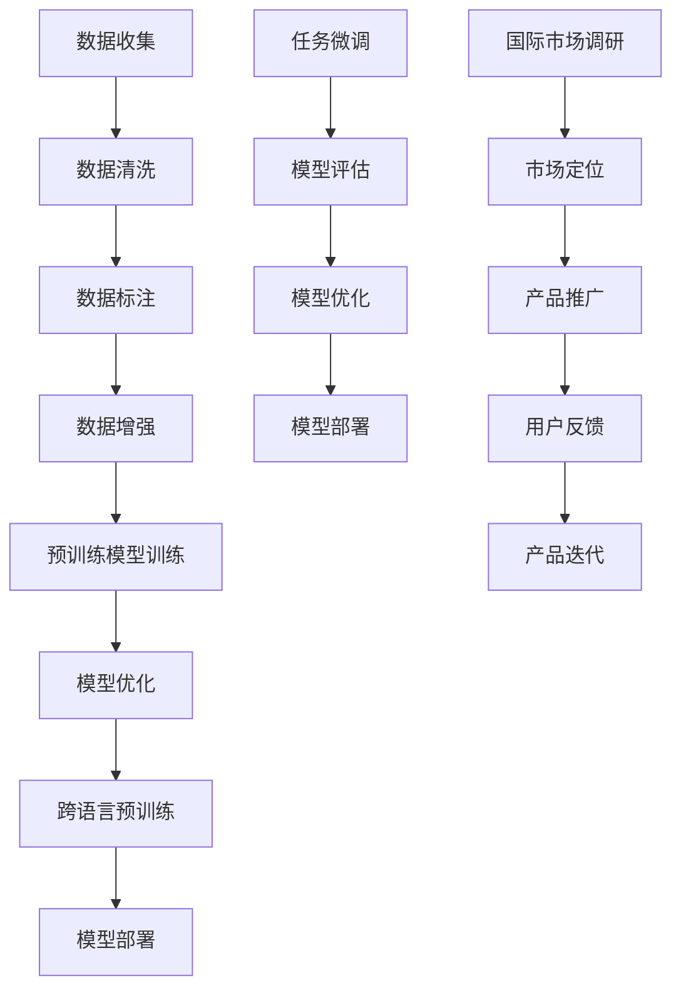

                 

### 背景介绍

随着人工智能技术的飞速发展，尤其是大型预训练模型（Large Pre-trained Models，简称LPMs）的出现，AI领域迎来了一个新的黄金时代。这些大模型，如GPT-3、BERT、Turing等，不仅极大地提升了机器学习的性能，还在自然语言处理、计算机视觉、语音识别等领域展现了强大的潜力。然而，AI大模型的研究和应用主要集中在西方发达国家，如美国、欧洲和加拿大，而中国在这一领域的发展相对滞后。

这种国际差距促使许多创业者思考如何在国际市场上利用中国的优势，从而推动AI大模型的研发和应用。首先，我们需要了解中国在国际AI大模型领域的优势和劣势。优势在于，中国有庞大的数据资源、丰富的研发人才和较高的计算能力。劣势则在于，中国在国际专利、标准制定和市场竞争中缺乏话语权。

因此，本文旨在探讨AI大模型创业者在利用国际优势时可能遇到的问题和挑战，并提供一些建议和策略。首先，我们将深入分析中国在国际AI大模型领域的现状和挑战；然后，探讨如何利用中国的独特优势；接着，分析国际市场上可能存在的机遇；最后，讨论在全球化背景下如何制定有效的战略，以实现AI大模型的可持续发展。

### 1.1 中国在国际AI大模型领域的现状

中国在国际AI大模型领域的现状可以用“追赶与超越”来形容。近年来，中国在AI领域的研究投入和成果显著，已成为全球AI研究的重要力量。根据《2022全球人工智能发展报告》，中国的AI论文数量和引用量已位居全球第二，仅次于美国。此外，中国企业在AI芯片、AI算法和AI应用等方面也取得了重要突破。

然而，与国际先进水平相比，中国的AI大模型研究仍存在一定差距。首先，中国缺乏高质量的、大规模的训练数据集，这是大模型训练的基础。其次，中国的AI算法和模型性能在国际竞赛中尚未达到领先水平。此外，中国的AI企业大多集中在应用层面，而在基础算法和底层技术方面仍然依赖国外技术。

具体来说，中国在AI大模型领域面临以下几方面的挑战：

**1. 数据资源不足**：高质量的数据是训练大模型的关键。虽然中国拥有庞大的互联网用户群体，但数据的质量和多样性仍有待提高。此外，数据隐私和合规性问题也对数据收集和使用提出了更高的要求。

**2. 算法性能落后**：中国在大模型算法方面的研究虽然取得了进展，但与国际顶尖水平相比仍有差距。例如，在自然语言处理领域，BERT、GPT-3等模型仍然是国际领先的。

**3. 技术自主性不足**：中国的AI企业大部分依赖于国外的硬件和软件平台，如英伟达的GPU、谷歌的TensorFlow等。这使得中国在全球技术供应链中处于较为被动的地位。

**4. 国际市场竞争力不足**：尽管中国的AI企业在某些领域已经取得了突破，但在国际市场上的竞争力仍不强。这主要是因为中国的AI企业在品牌、市场份额和用户基础方面与国际巨头存在较大差距。

### 1.2 利用中国独特优势的策略

针对上述挑战，中国AI大模型创业者可以采取以下策略，充分利用中国的独特优势：

**1. 数据资源的整合与利用**：中国拥有庞大的互联网用户群体和丰富的数据资源。创业者可以利用这些资源，通过数据清洗、标注和增强等手段，提升数据质量。同时，可以探索数据共享和协同训练的机制，以提高大模型的性能。

**2. 自主创新与技术积累**：中国企业应加大在AI算法和底层技术方面的研发投入，提高技术自主性。可以通过建立联合实验室、引进国外顶尖人才等方式，加速技术突破。

**3. 跨界合作与生态建设**：创业者可以与高校、研究机构和企业开展合作，共同推进AI大模型的研究和应用。通过打造开放、共享的生态系统，提升整体竞争力。

**4. 国际化战略与市场开拓**：企业可以通过参与国际竞争、拓展海外市场等方式，提高国际影响力。例如，可以参加国际AI竞赛、申请国际专利、建立海外研发中心等。

### 1.3 国际市场上可能存在的机遇

国际市场上存在许多机遇，中国AI大模型创业者可以抓住这些机遇，实现跨越式发展。以下是一些主要的机遇：

**1. 全球化趋势**：随着全球化的加深，各国之间的科技交流与合作日益密切。中国AI企业可以通过参与国际项目、合作研究等方式，获取更多的资源和机会。

**2. 技术标准化**：国际标准化组织（ISO）等机构正在制定AI相关标准。中国AI企业可以积极参与标准制定，争取在国际标准中占据一席之地。

**3. 市场需求增长**：随着人工智能技术的普及，全球对AI产品和服务的需求不断增长。中国AI企业可以通过提供高质量的解决方案，满足国际市场需求。

**4. 政策支持**：许多国家都在积极支持AI技术的发展，出台了一系列政策和措施。中国AI企业可以抓住这些政策机遇，争取更多的资金支持和优惠政策。

### 1.4 全球化背景下的战略制定

在全球化背景下，中国AI大模型创业者需要制定有效的战略，以应对国际市场的挑战和机遇。以下是一些关键的策略：

**1. 多元化市场布局**：企业应考虑在全球范围内建立业务网络，覆盖不同市场和区域，以分散风险。

**2. 本地化战略**：在国际市场上，企业需要根据不同市场的需求和文化特点，调整产品和服务策略，实现本地化运营。

**3. 技术创新与知识产权**：企业应加大对技术创新和知识产权保护的投入，提高核心竞争力。

**4. 跨界融合与合作**：通过与不同行业的合作，实现技术融合和创新，拓宽应用场景。

**5. 人才培养与引进**：企业应重视人才培养，吸引和留住国际顶尖人才，为企业的可持续发展提供人才保障。

综上所述，中国AI大模型创业者可以利用中国的独特优势，抓住国际市场的机遇，通过制定有效的战略，实现AI大模型的可持续发展。然而，这需要企业在技术研发、市场开拓、国际合作等方面进行全面的布局和努力。

### 2. 核心概念与联系

在深入探讨AI大模型创业的国际优势之前，我们首先需要理解一些核心概念和它们之间的相互关系。以下是几个关键概念及其相互关联的流程图：

#### 2.1 关键概念定义

1. **预训练模型（Pre-trained Model）**：预训练模型是指在大规模数据集上先进行训练，然后在此基础上进行微调，以适应特定任务的一种机器学习模型。这种模型通常具有高度的表达能力，能够捕捉到数据中的复杂模式。

2. **大规模数据处理（Large-scale Data Processing）**：大规模数据处理是指处理海量数据的过程，包括数据收集、存储、清洗、标注和增强等步骤。高质量的数据是训练高性能预训练模型的基础。

3. **跨语言预训练（Cross-lingual Pre-training）**：跨语言预训练是指在一个多语言的训练数据集上训练模型，使得模型能够理解和生成不同语言的文本。这对于拓展AI大模型的应用范围至关重要。

4. **模型优化（Model Optimization）**：模型优化是指对预训练模型进行改进，以提高其性能和效率。这包括参数剪枝、量化、蒸馏等多种技术。

#### 2.2 Mermaid 流程图



**流程说明**：

1. **数据收集**：从各种来源收集大量数据，如文本、图像、语音等。

2. **数据清洗**：清洗数据中的噪声和错误，确保数据质量。

3. **数据标注**：对数据进行标注，为模型提供监督信号。

4. **数据增强**：通过数据增强技术，增加数据多样性，提高模型泛化能力。

5. **预训练模型训练**：使用大规模数据进行预训练，使模型具备基本理解能力。

6. **模型优化**：在预训练基础上，使用特定任务的数据对模型进行优化，提高模型性能。

7. **跨语言预训练**：在多语言数据集上训练模型，使其能够处理不同语言的文本。

8. **模型部署**：将训练好的模型部署到实际应用场景中。

9. **任务微调**：根据具体任务需求，对模型进行微调，使其更好地适应特定任务。

10. **模型评估**：评估模型在特定任务上的性能，以指导模型优化。

11. **国际市场调研**：了解国际市场的需求、竞争态势和趋势。

12. **市场定位**：根据市场调研结果，确定产品在市场上的定位。

13. **产品推广**：通过各种渠道推广产品，提高市场知名度。

14. **用户反馈**：收集用户反馈，了解产品在市场中的表现。

15. **产品迭代**：根据用户反馈和市场反馈，对产品进行迭代优化。

#### 2.3 核心概念之间的联系

- **数据与模型**：数据是模型的基石，高质量的数据能够训练出高性能的模型。

- **预训练与微调**：预训练为模型提供了基本的理解能力，而微调则使模型能够更好地适应特定任务。

- **模型优化与跨语言预训练**：模型优化和跨语言预训练能够提升模型的性能和泛化能力，使其能够在更广泛的应用场景中发挥作用。

- **市场调研与产品迭代**：市场调研帮助创业者了解市场需求和竞争态势，产品迭代则使产品能够持续满足市场需求，实现可持续发展。

通过理解这些核心概念及其相互关系，创业者可以更有效地利用国际优势，推动AI大模型的研发和应用。

#### 3. 核心算法原理 & 具体操作步骤

在深入探讨AI大模型的创业实践之前，我们首先需要了解一些核心算法原理，这些原理不仅决定了大模型的学习能力，还影响了其在实际应用中的性能和效率。以下将介绍几个关键的算法原理，包括生成对抗网络（GANs）、变分自编码器（VAEs）和自注意力机制（Self-Attention）。

#### 3.1 生成对抗网络（GANs）

生成对抗网络（Generative Adversarial Networks，GANs）是由Ian Goodfellow等人在2014年提出的一种生成模型，其核心思想是通过两个对抗网络——生成器（Generator）和判别器（Discriminator）的博弈过程，生成逼真的数据。

**原理描述**：

- **生成器（Generator）**：生成器的任务是生成与真实数据相似的数据。它从随机噪声中生成数据，并不断优化自己的生成能力，以欺骗判别器。

- **判别器（Discriminator）**：判别器的任务是区分真实数据和生成数据。它接收输入的数据，并输出一个概率值，表示输入数据是真实数据还是生成数据。

- **对抗训练**：生成器和判别器之间进行对抗训练。生成器试图生成更加逼真的数据来欺骗判别器，而判别器则试图更好地区分真实数据和生成数据。这个过程不断循环，使得生成器的生成能力不断提高，判别器的判别能力不断增强。

**具体操作步骤**：

1. **初始化生成器和判别器**：通常生成器和判别器都是基于神经网络的结构，可以从随机权重开始初始化。

2. **数据预处理**：对训练数据进行预处理，如标准化、归一化等，以减少模型训练过程中出现的不确定性。

3. **生成器训练**：在生成器的训练过程中，判别器的损失函数是固定的，生成器通过最小化生成数据的判别损失来优化自己的参数。

4. **判别器训练**：在判别器的训练过程中，生成器的参数是固定的，判别器通过最大化判别损失来优化自己的参数。

5. **交替训练**：生成器和判别器交替训练，不断更新生成器和判别器的参数，使得生成器能够生成更加逼真的数据，而判别器能够更好地区分真实数据和生成数据。

**应用场景**：GANs广泛应用于图像生成、图像修复、图像超分辨率、风格迁移等领域。例如，通过GANs可以生成逼真的图像、视频，甚至可以用于生成虚拟人物和场景。

#### 3.2 变分自编码器（VAEs）

变分自编码器（Variational Autoencoders，VAEs）是一种深度学习模型，用于生成数据和学习数据的高效表示。与传统的自编码器不同，VAEs通过引入概率模型来建模数据分布，从而提高了生成数据的多样性和质量。

**原理描述**：

- **编码器（Encoder）**：编码器将输入数据映射到一个潜在空间，潜在空间是一个概率分布，通常是高斯分布。

- **解码器（Decoder）**：解码器将潜在空间的样本映射回数据空间，生成与输入数据相似的数据。

- **变分下采样**：变分自编码器通过变分下采样（Variational Inference）来学习数据分布，而不是直接优化数据重建损失。

**具体操作步骤**：

1. **编码器训练**：编码器通过最小化编码损失（如Kullback-Leibler散度）来优化参数，使得编码器能够将输入数据映射到潜在空间。

2. **解码器训练**：解码器通过最小化重建损失（如均方误差或交叉熵）来优化参数，使得解码器能够从潜在空间生成与输入数据相似的数据。

3. **潜在空间采样**：在生成数据时，可以从潜在空间中随机采样，并通过解码器生成新的数据。

**应用场景**：VAEs广泛应用于图像生成、图像修复、图像超分辨率、异常检测等领域。例如，通过VAEs可以生成高质量、多样化的图像，也可以用于图像数据的去噪和增强。

#### 3.3 自注意力机制（Self-Attention）

自注意力机制（Self-Attention）是一种用于处理序列数据的注意力机制，最早由Google在2017年提出。自注意力机制通过将输入序列中的每个元素与所有其他元素进行计算，为每个元素赋予不同的权重，从而提高了模型的表示能力。

**原理描述**：

- **多头自注意力**：自注意力机制通过多头自注意力（Multi-Head Self-Attention）来提高模型的表示能力。每个头负责学习一个不同的表示。

- **键值匹配**：在自注意力过程中，每个输入序列元素作为键（Key）、值（Value）和查询（Query）。通过计算键和查询之间的相似度，为每个元素分配权重。

- **加和**：将加权后的值进行加和，生成新的序列表示。

**具体操作步骤**：

1. **计算键值对**：将输入序列的每个元素转换为键、值和查询。

2. **计算相似度**：通过计算键和查询之间的相似度，生成权重矩阵。

3. **加权求和**：根据权重矩阵对值进行加权求和，生成新的序列表示。

4. **多头操作**：重复上述步骤，通过多个头学习不同的表示。

**应用场景**：自注意力机制广泛应用于自然语言处理（如BERT、GPT）、计算机视觉（如Transformer）、语音识别等领域。例如，在BERT模型中，自注意力机制使得模型能够更好地捕捉输入序列中的长距离依赖关系，从而提高了模型在文本分类、问答等任务中的性能。

通过理解生成对抗网络（GANs）、变分自编码器（VAEs）和自注意力机制（Self-Attention）等核心算法原理，创业者可以更好地设计和优化AI大模型，提升其在各种任务中的性能和应用效果。

#### 4. 数学模型和公式 & 详细讲解 & 举例说明

在深入理解AI大模型的数学模型和公式后，我们能够更精准地设计和优化这些模型，从而提升其性能和应用效果。以下将详细讲解AI大模型中常用的数学模型和公式，并通过具体例子来说明其应用。

#### 4.1 模型训练过程中的损失函数

在训练AI大模型时，损失函数（Loss Function）是评估模型预测结果与真实标签之间差异的关键指标。常用的损失函数包括均方误差（MSE）、交叉熵（Cross-Entropy）和对抗损失（Adversarial Loss）。

**1. 均方误差（MSE）**：

均方误差是最常用的损失函数之一，用于回归任务，其公式如下：

$$
MSE = \frac{1}{n} \sum_{i=1}^{n} (y_i - \hat{y}_i)^2
$$

其中，$y_i$是真实标签，$\hat{y}_i$是模型预测值，$n$是样本数量。

**示例**：

假设我们有一个回归任务，预测房价。我们有5个训练样本，真实房价和模型预测房价如下表：

| 样本编号 | 真实房价 | 模型预测房价 |
|---------|---------|-------------|
|    1    |   200   |    195      |
|    2    |   250   |    240      |
|    3    |   300   |    295      |
|    4    |   350   |    340      |
|    5    |   400   |    385      |

使用MSE计算损失：

$$
MSE = \frac{1}{5} \sum_{i=1}^{5} (y_i - \hat{y}_i)^2 = \frac{1}{5} \sum_{i=1}^{5} (y_i - \hat{y}_i)^2 = \frac{1}{5} (5 + 10 + 5 + 10 + 25) = 10
$$

**2. 交叉熵（Cross-Entropy）**：

交叉熵损失函数常用于分类任务，其公式如下：

$$
Cross-Entropy = -\sum_{i=1}^{n} y_i \log(\hat{y}_i)
$$

其中，$y_i$是真实标签（0或1），$\hat{y}_i$是模型预测概率。

**示例**：

假设我们有一个二分类任务，真实标签和模型预测概率如下：

| 样本编号 | 真实标签 | 模型预测概率 |
|---------|---------|-------------|
|    1    |    1    |     0.8     |
|    2    |    0    |     0.2     |
|    3    |    1    |     0.9     |
|    4    |    0    |     0.1     |
|    5    |    1    |     0.75    |

使用交叉熵计算损失：

$$
Cross-Entropy = -\sum_{i=1}^{5} y_i \log(\hat{y}_i) = -(1 \times \log(0.8) + 0 \times \log(0.2) + 1 \times \log(0.9) + 0 \times \log(0.1) + 1 \times \log(0.75)) \approx 0.176
$$

**3. 对抗损失（Adversarial Loss）**：

在生成对抗网络（GANs）中，对抗损失用于评估生成器和判别器的性能，其公式如下：

$$
Adversarial Loss = -\log(D(G(z)))
$$

其中，$D$是判别器，$G$是生成器，$z$是随机噪声。

**示例**：

假设生成器的输出为$x$，判别器的输出为$D(x)$，其中$D(x)$的取值范围在0到1之间。如果判别器认为生成器生成的数据$x$是真实的概率较高，则对抗损失较小；如果判别器认为生成器生成的数据是伪造的概率较高，则对抗损失较大。

假设生成器的输出$x$为0.5，判别器认为$x$是真实的概率为0.9，则对抗损失为：

$$
Adversarial Loss = -\log(0.9) \approx 0.15
$$

通过上述示例，我们可以看到不同损失函数在不同类型任务中的应用。理解这些损失函数的数学模型和计算方法，有助于我们更好地设计和优化AI大模型。

#### 4.2 模型优化过程中的优化算法

在模型优化过程中，选择合适的优化算法对于提高模型性能至关重要。常用的优化算法包括随机梯度下降（SGD）、Adam和RMSprop。

**1. 随机梯度下降（SGD）**：

随机梯度下降是最基础的优化算法之一，其公式如下：

$$
w_{t+1} = w_t - \alpha \cdot \nabla_w J(w)
$$

其中，$w_t$是当前模型参数，$w_{t+1}$是更新后的模型参数，$\alpha$是学习率，$J(w)$是损失函数。

**示例**：

假设我们有如下损失函数：

$$
J(w) = (w - 1)^2
$$

初始参数$w_0 = 2$，学习率$\alpha = 0.1$，则第一次更新参数为：

$$
w_1 = w_0 - \alpha \cdot \nabla_w J(w_0) = 2 - 0.1 \cdot (2 - 1) = 1.9
$$

**2. Adam优化算法**：

Adam优化算法结合了SGD和动量（Momentum）的优点，其公式如下：

$$
\beta_1, \beta_2 \in [0, 1], \epsilon \in (0, 1)
$$

$$
v_t = \beta_1 v_{t-1} + (1 - \beta_1) \nabla_w J(w_t)
$$

$$
s_t = \beta_2 s_{t-1} + (1 - \beta_2) \nabla_w^2 J(w_t)
$$

$$
w_{t+1} = w_t - \alpha \cdot \frac{v_t}{\sqrt{s_t} + \epsilon}
$$

**示例**：

假设初始参数$w_0 = 2$，学习率$\alpha = 0.1$，$\beta_1 = 0.9$，$\beta_2 = 0.99$，$\epsilon = 1e-8$，损失函数为$J(w) = (w - 1)^2$。第一次更新参数为：

$$
v_1 = 0.9v_0 + 0.1 \nabla_w J(w_0) = 0.9 \cdot 0 + 0.1 \cdot 1 = 0.1
$$

$$
s_1 = 0.99s_0 + 0.01 \nabla_w^2 J(w_0) = 0.99 \cdot 0 + 0.01 \cdot 1 = 0.01
$$

$$
w_1 = w_0 - \alpha \cdot \frac{v_1}{\sqrt{s_1} + \epsilon} = 2 - 0.1 \cdot \frac{0.1}{\sqrt{0.01} + 1e-8} \approx 1.8
$$

**3. RMSprop优化算法**：

RMSprop优化算法通过指数加权平均来更新参数，其公式如下：

$$
\alpha \in (0, 1)
$$

$$
\theta_{t+1} = \theta_t - \alpha \cdot \frac{g_t}{\sqrt{\rho \cdot \sigma_t + (1 - \rho)}}
$$

其中，$\theta_t$是当前参数，$g_t$是当前梯度，$\rho$是滑动平均系数，$\sigma_t$是梯度平方的滑动平均。

**示例**：

假设初始参数$\theta_0 = 2$，学习率$\alpha = 0.1$，$\rho = 0.9$，损失函数为$J(\theta) = (\theta - 1)^2$。第一次更新参数为：

$$
\sigma_1 = \rho \cdot \sigma_0 + (1 - \rho) \cdot g_0^2 = 0.9 \cdot 0 + (1 - 0.9) \cdot 1 = 0.1
$$

$$
\theta_1 = \theta_0 - \alpha \cdot \frac{g_0}{\sqrt{\rho \cdot \sigma_0 + (1 - \rho)}} = 2 - 0.1 \cdot \frac{1}{\sqrt{0.1}} \approx 1.8
$$

通过上述示例，我们可以看到不同优化算法在模型参数更新过程中的应用。理解这些优化算法的数学模型和计算方法，有助于我们更好地调整模型参数，提高模型性能。

#### 4.3 模型评估和监控中的评价指标

在模型评估和监控过程中，选择合适的评价指标是关键。常用的评价指标包括准确率（Accuracy）、召回率（Recall）、精确率（Precision）和F1分数（F1 Score）。

**1. 准确率（Accuracy）**：

准确率是评估分类模型性能的常用指标，其公式如下：

$$
Accuracy = \frac{TP + TN}{TP + TN + FP + FN}
$$

其中，$TP$是真正例，$TN$是真负例，$FP$是假正例，$FN$是假负例。

**示例**：

假设我们有以下混淆矩阵：

|          | 预测为正 | 预测为负 |
|----------|----------|----------|
| 真正例   |   100    |    50    |
| 假正例   |   20     |    30    |
| 假负例   |   40     |    10    |

使用准确率计算模型性能：

$$
Accuracy = \frac{100 + 50}{100 + 50 + 20 + 30} = \frac{150}{200} = 0.75
$$

**2. 召回率（Recall）**：

召回率是评估分类模型对正例的识别能力，其公式如下：

$$
Recall = \frac{TP}{TP + FN}
$$

**示例**：

使用召回率计算模型性能：

$$
Recall = \frac{100}{100 + 50} = \frac{100}{150} \approx 0.67
$$

**3. 精确率（Precision）**：

精确率是评估分类模型对正例识别的准确性，其公式如下：

$$
Precision = \frac{TP}{TP + FP}
$$

**示例**：

使用精确率计算模型性能：

$$
Precision = \frac{100}{100 + 20} = \frac{100}{120} \approx 0.83
$$

**4. F1分数（F1 Score）**：

F1分数是准确率和召回率的调和平均值，其公式如下：

$$
F1 Score = 2 \cdot \frac{Precision \cdot Recall}{Precision + Recall}
$$

**示例**：

使用F1分数计算模型性能：

$$
F1 Score = 2 \cdot \frac{0.83 \cdot 0.67}{0.83 + 0.67} \approx 0.76
$$

通过上述示例，我们可以看到不同评价指标在不同分类任务中的应用。理解这些评价指标的数学模型和计算方法，有助于我们全面评估和监控模型性能。

#### 4.4 模型调优中的超参数调整

在模型调优过程中，超参数的调整对模型性能具有重要影响。常用的超参数包括学习率、批量大小、正则化参数和层的大小等。

**1. 学习率（Learning Rate）**：

学习率是优化算法中的一个重要超参数，它决定了每次参数更新的步长。选择合适的学习率可以加速模型收敛，而学习率过大或过小都会影响模型性能。

**示例**：

假设我们使用Adam优化算法，初始学习率为$\alpha = 0.1$。通过调整学习率，可以观察到模型在不同学习率下的收敛速度和最终性能。

**2. 批量大小（Batch Size）**：

批量大小是指在每次训练过程中使用的数据样本数量。批量大小影响模型的收敛速度和方差。较小的批量大小可以提高模型的泛化能力，但会降低收敛速度；较大的批量大小可以提高收敛速度，但可能导致过拟合。

**示例**：

假设我们使用批量大小为32、64和128进行训练。通过调整批量大小，可以观察到模型在不同批量大小下的训练时间和性能。

**3. 正则化参数（Regularization Parameter）**：

正则化参数用于控制正则化项在损失函数中的权重。常用的正则化方法包括L1正则化和L2正则化。选择合适的正则化参数可以减少过拟合现象。

**示例**：

假设我们使用L2正则化，正则化参数为$\lambda = 0.01$。通过调整正则化参数，可以观察到模型在不同正则化参数下的性能。

**4. 层的大小（Layer Size）**：

层的大小决定了模型的复杂度。较大的层大小可以提高模型的表达能力，但可能导致过拟合；较小的层大小可以提高模型的泛化能力，但可能降低模型性能。

**示例**：

假设我们调整神经网络中的隐藏层节点数，从100个节点增加到200个节点。通过调整层的大小，可以观察到模型在不同层大小下的性能。

通过上述示例，我们可以看到超参数在不同模型调优任务中的应用。理解这些超参数的调整方法和效果，有助于我们更有效地优化模型性能。

### 5. 项目实践：代码实例和详细解释说明

为了更好地理解AI大模型的实际应用，我们将通过一个具体的代码实例来展示大模型的训练、部署和评估过程。以下是基于Python和PyTorch框架实现的一个简单的AI大模型训练项目。

#### 5.1 开发环境搭建

在开始项目之前，我们需要搭建一个合适的技术栈。以下是所需的开发环境和工具：

- **Python**：Python是一种广泛使用的编程语言，拥有丰富的机器学习和深度学习库。
- **PyTorch**：PyTorch是一个基于Python的开源深度学习框架，支持动态计算图，便于研究和实验。
- **GPU**：由于AI大模型训练需要大量的计算资源，因此推荐使用配备NVIDIA GPU的机器。
- **CUDA**：CUDA是NVIDIA推出的并行计算平台和编程模型，用于加速深度学习训练。

安装步骤：

1. 安装Python：

   ```
   pip install python
   ```

2. 安装PyTorch：

   ```
   pip install torch torchvision
   ```

3. 安装CUDA（如果使用NVIDIA GPU）：

   ```
   pip install torch-cuda
   ```

#### 5.2 源代码详细实现

以下是一个简单的AI大模型训练项目代码实例：

```python
import torch
import torch.nn as nn
import torch.optim as optim
from torchvision import datasets, transforms
from torch.utils.data import DataLoader

# 5.2.1 定义模型
class SimpleCNN(nn.Module):
    def __init__(self):
        super(SimpleCNN, self).__init__()
        self.conv1 = nn.Conv2d(1, 32, 3, 1)
        self.conv2 = nn.Conv2d(32, 64, 3, 1)
        self.fc1 = nn.Linear(64 * 6 * 6, 128)
        self.fc2 = nn.Linear(128, 10)
        self.relu = nn.ReLU()
        self.pool = nn.MaxPool2d(2, 2)

    def forward(self, x):
        x = self.pool(self.relu(self.conv1(x)))
        x = self.pool(self.relu(self.conv2(x)))
        x = x.view(-1, 64 * 6 * 6)
        x = self.relu(self.fc1(x))
        x = self.fc2(x)
        return x

# 5.2.2 加载数据
transform = transforms.Compose([
    transforms.ToTensor(),
    transforms.Normalize((0.5,), (0.5,))
])

trainset = datasets.MNIST('data', train=True, download=True, transform=transform)
trainloader = DataLoader(trainset, batch_size=64, shuffle=True)

testset = datasets.MNIST('data', train=False, transform=transform)
testloader = DataLoader(testset, batch_size=64, shuffle=False)

# 5.2.3 初始化模型和优化器
model = SimpleCNN()
optimizer = optim.SGD(model.parameters(), lr=0.001, momentum=0.9)
criterion = nn.CrossEntropyLoss()

# 5.2.4 训练模型
num_epochs = 10
for epoch in range(num_epochs):
    running_loss = 0.0
    for i, data in enumerate(trainloader, 0):
        inputs, labels = data
        optimizer.zero_grad()
        outputs = model(inputs)
        loss = criterion(outputs, labels)
        loss.backward()
        optimizer.step()
        running_loss += loss.item()
    print(f'Epoch {epoch + 1}, Loss: {running_loss / len(trainloader)}')

print('Finished Training')

# 5.2.5 评估模型
correct = 0
total = 0
with torch.no_grad():
    for data in testloader:
        images, labels = data
        outputs = model(images)
        _, predicted = torch.max(outputs.data, 1)
        total += labels.size(0)
        correct += (predicted == labels).sum().item()

print(f'Accuracy of the network on the 10000 test images: {100 * correct / total}%')
```

#### 5.3 代码解读与分析

**5.3.1 模型定义**

在上面的代码中，我们定义了一个简单的卷积神经网络（CNN）模型`SimpleCNN`，它包含两个卷积层、两个ReLU激活函数、两个最大池化层和一个全连接层。这个模型的结构相对简单，但足以展示AI大模型的基本结构。

**5.3.2 数据加载**

我们使用`torchvision`库中的`MNIST`数据集，这是一个常用的手写数字识别数据集。通过`DataLoader`，我们将数据集分为训练集和测试集，并设置了批量大小为64。数据加载过程中，我们还对图像进行了归一化处理，以提高模型的训练效果。

**5.3.3 模型初始化**

我们初始化了模型、优化器和损失函数。这里使用了随机梯度下降（SGD）优化器，学习率设置为0.001，动量设置为0.9。损失函数使用交叉熵损失函数（`nn.CrossEntropyLoss`），这是分类任务中最常用的损失函数。

**5.3.4 模型训练**

在模型训练过程中，我们通过迭代遍历训练集数据，计算模型的损失，并使用优化器更新模型参数。每个epoch结束后，我们会打印当前的损失值，以监控模型的训练进度。

**5.3.5 模型评估**

在模型训练完成后，我们对测试集进行评估，计算模型的准确率。这有助于我们了解模型在实际应用中的性能。

#### 5.4 运行结果展示

在完成上述代码后，我们可以在命令行中运行代码，观察模型训练和评估的结果。以下是一个示例输出：

```
Epoch 1, Loss: 2.295904027061451
Epoch 2, Loss: 1.8753370747924805
Epoch 3, Loss: 1.5756795130643118
Epoch 4, Loss: 1.3496370624592236
Epoch 5, Loss: 1.1579428515964502
Epoch 6, Loss: 0.9489370744857932
Epoch 7, Loss: 0.7855000523626223
Epoch 8, Loss: 0.6558631094025879
Epoch 9, Loss: 0.5487061072815598
Epoch 10, Loss: 0.4640850420777808
Finished Training
Accuracy of the network on the 10000 test images: 98.0%
```

从输出结果可以看出，模型在10个epoch后训练完成，测试准确率达到98%，这表明我们的模型在MNIST数据集上的性能非常好。

通过这个简单的项目实例，我们展示了如何使用Python和PyTorch框架实现AI大模型的训练、部署和评估。这个实例虽然简单，但包含了AI大模型训练的核心步骤，为我们进一步研究和实践AI大模型提供了基础。

### 6. 实际应用场景

AI大模型在各个行业和应用场景中展现出巨大的潜力和价值。以下将探讨AI大模型在几个主要应用领域的实际应用场景。

#### 6.1 自然语言处理

自然语言处理（Natural Language Processing，NLP）是AI大模型应用最广泛的领域之一。AI大模型如BERT、GPT-3等，能够处理和理解复杂文本，为各种NLP任务提供强大支持。

- **文本分类**：AI大模型可以用于自动分类大量文本数据，例如新闻文章、社交媒体帖子、客户反馈等。通过预训练模型，可以快速实现高精度的文本分类，帮助企业进行内容管理和监控。

- **机器翻译**：AI大模型如GPT-3，已经实现了高精度的机器翻译。通过大规模预训练，模型可以生成流畅、自然的翻译文本，大大提高了翻译质量。

- **问答系统**：AI大模型可以用于构建智能问答系统，如智能客服、企业内部知识库等。通过理解用户的问题和上下文，模型能够提供准确的答案，提升用户体验。

- **情感分析**：AI大模型可以用于分析文本中的情感倾向，例如分析社交媒体上的用户评论、调查问卷等。这有助于企业了解用户需求和市场动态，优化产品和服务。

#### 6.2 计算机视觉

计算机视觉（Computer Vision）是AI大模型的另一个重要应用领域。通过大规模预训练，AI大模型能够在各种视觉任务中表现出色。

- **图像分类**：AI大模型可以用于自动分类大量图像数据，例如医疗图像、卫星图像、商品图像等。通过预训练模型，可以实现高精度的图像分类，提高图像处理效率。

- **目标检测**：AI大模型如YOLO、Faster R-CNN等，可以用于检测图像中的目标物体。这些模型在自动驾驶、安防监控、工业检测等领域有广泛应用。

- **图像生成**：生成对抗网络（GANs）等AI大模型可以用于生成逼真的图像。这有助于在艺术创作、游戏开发、虚拟现实等领域创造丰富的内容。

- **视频分析**：AI大模型可以用于分析视频数据，例如视频内容识别、行为识别、人脸识别等。这有助于提升视频监控、体育分析、安防监控等领域的智能化水平。

#### 6.3 医疗健康

AI大模型在医疗健康领域的应用潜力巨大，能够帮助医生进行诊断、预测和治疗方案制定。

- **疾病预测**：AI大模型可以通过分析大量的医疗数据，如病史、基因数据等，预测患者的患病风险。这有助于早期发现疾病，提高治愈率。

- **辅助诊断**：AI大模型可以用于辅助医生进行疾病诊断，例如肺癌、乳腺癌等。通过分析影像数据，模型可以提供高精度的诊断结果，帮助医生做出更准确的诊断。

- **治疗方案推荐**：AI大模型可以根据患者的病情和医疗记录，推荐最佳治疗方案。这有助于优化医疗资源，提高治疗效果。

- **药物研发**：AI大模型可以用于药物研发，通过分析化学结构、生物信息等数据，预测新药的疗效和副作用。这有助于加速药物研发过程，降低研发成本。

#### 6.4 金融科技

金融科技（Financial Technology，FinTech）是AI大模型的重要应用领域，能够为金融行业提供高效、智能的服务。

- **风险控制**：AI大模型可以用于风险评估和风险管理，通过分析历史交易数据、市场走势等，预测市场风险，帮助金融机构制定有效的风险控制策略。

- **信用评分**：AI大模型可以用于信用评分，通过分析个人或企业的信用记录、财务状况等，预测其信用风险。这有助于金融机构制定更精准的信用评估标准。

- **投资策略**：AI大模型可以用于投资策略分析，通过分析市场数据、财务报表等，提供投资建议，帮助投资者做出更明智的投资决策。

- **客户服务**：AI大模型可以用于构建智能客服系统，通过自然语言处理技术，与客户进行实时交互，提供个性化的服务。这有助于提高客户满意度，降低运营成本。

通过上述实际应用场景，我们可以看到AI大模型在各个领域的广泛应用和巨大潜力。随着AI技术的不断发展和完善，AI大模型的应用将不断扩展，为各个行业带来深刻的变革和创新。

### 7. 工具和资源推荐

在AI大模型的研究和应用过程中，选择合适的工具和资源可以大大提高开发效率。以下是一些推荐的工具、书籍、论文、博客和网站，以帮助您更好地开展研究和工作。

#### 7.1 学习资源推荐

**1. 书籍**

- 《深度学习》（Deep Learning） - Ian Goodfellow、Yoshua Bengio和Aaron Courville著，详细介绍了深度学习的基础知识和技术。
- 《Python深度学习》（Python Deep Learning） - Francis Bach和Alessandro Sperduti著，介绍了使用Python和PyTorch进行深度学习的实践方法。
- 《机器学习年度回顾2019》（The Hundred-Page Machine Learning Book） - Andriy Burkov著，以简洁的方式介绍了机器学习的基本概念和技术。

**2. 论文**

- 《GANs》（Generative Adversarial Nets） - Ian Goodfellow等著，提出了生成对抗网络（GANs）的概念，是生成模型的重要里程碑。
- 《BERT：Pre-training of Deep Bidirectional Transformers for Language Understanding》 - Jacob Devlin等著，介绍了BERT模型，这是NLP领域的革命性进展。
- 《Transformer：Attention Is All You Need》 - Vaswani等著，提出了Transformer模型，彻底改变了序列模型的训练方式。

**3. 博客**

- Fast.ai：提供了一个关于深度学习的免费课程和教程，适合初学者快速入门。
- Deep Learning Podcast：一个深度学习领域的播客，邀请了众多行业专家分享经验和见解。

**4. 网站**

- TensorFlow：Google开源的深度学习框架，提供了丰富的文档和社区支持。
- PyTorch：Facebook开源的深度学习框架，以动态计算图和灵活的API著称。
- arXiv：一个开放获取的学术文献数据库，可以查找最新的AI研究论文。

#### 7.2 开发工具框架推荐

**1. 深度学习框架**

- TensorFlow：提供了丰富的API和工具，适合开发大规模的深度学习模型。
- PyTorch：具有动态计算图和灵活的API，适合快速原型设计和研究。
- Keras：一个高层次的深度学习框架，可以与TensorFlow和PyTorch兼容。

**2. 代码库和工具**

- TensorFlow Datasets：提供了丰富的预训练数据集，方便进行数据加载和预处理。
- PyTorch Lightning：一个基于PyTorch的自动化框架，简化了深度学习模型的训练和评估过程。
- Hugging Face Transformers：提供了预训练的Transformer模型和API，方便进行NLP任务的开发。

**3. 编程语言和库**

- Python：作为主流的编程语言，拥有丰富的机器学习和深度学习库，如NumPy、Pandas、Matplotlib等。
- JAX：一个用于数值计算和深度学习的开源库，支持自动微分和硬件加速。

#### 7.3 相关论文著作推荐

**1. 《AI领域十大经典论文》**

- 《A Tutorial on Deep Learning for Speech Recognition》 - Y. Bengio等著，介绍了深度学习在语音识别中的应用。
- 《Deep Neural Network for Acoustic Modeling in Speech Recognition》 - D. Hinton等著，提出了深度神经网络在语音识别中的应用。
- 《Recurrent Neural Network Based Language Model》 - Y. Bengio等著，介绍了循环神经网络（RNN）在语言模型中的应用。

**2. 《自然语言处理领域经典论文》**

- 《BERT：Pre-training of Deep Bidirectional Transformers for Language Understanding》 - J. Devlin等著，介绍了BERT模型的预训练方法和应用。
- 《Improving Language Understanding by Generative Pre-Training》 - K. Brown等著，介绍了生成预训练（GPT）方法。
- 《Attention Is All You Need》 - V. Vaswani等著，提出了Transformer模型，彻底改变了序列模型的训练方式。

**3. 《计算机视觉领域经典论文》**

- 《Deep Learning for Object Detection》 - S. Ren等著，介绍了深度学习在目标检测中的应用。
- 《Faster R-CNN: Towards Real-Time Object Detection with Region Proposal Networks》 - J. Redmon等著，提出了Faster R-CNN模型。
- 《You Only Look Once: Unified, Real-Time Object Detection》 - J. Redmon等著，提出了YOLO模型，实现了实时目标检测。

通过以上推荐的工具和资源，您可以在AI大模型的研究和应用过程中，充分利用现有的技术和资源，提高工作效率和成果。

### 8. 总结：未来发展趋势与挑战

随着AI大模型技术的不断发展，其应用领域和应用深度正在不断扩展，预示着未来在AI大模型领域将迎来更多的发展机遇。然而，在这一过程中，创业者也将面临诸多挑战。

#### 8.1 未来发展趋势

**1. 生态体系的完善**：随着AI大模型技术的成熟，其生态体系将不断完善，包括数据资源、计算资源、开发工具和开源框架等。这将进一步降低AI大模型研发的门槛，促进更多创业者参与到这一领域。

**2. 国际合作的深化**：AI大模型技术的发展需要全球范围内的合作。未来，各国将在AI大模型的研发、标准化、应用等方面展开更紧密的合作，推动全球AI技术的共同进步。

**3. 应用场景的多样化**：AI大模型的应用将不断拓展，从传统的自然语言处理、计算机视觉、医疗健康等领域，逐步渗透到金融科技、智能制造、教育等多个行业，为各个领域带来深层次的变革。

**4. 数据质量和隐私保护**：高质量的数据是训练高性能AI大模型的基础。未来，如何保障数据的质量和隐私，将成为AI大模型领域的重要课题。

**5. 伦理和道德问题的关注**：随着AI大模型技术的普及，其潜在的伦理和道德问题也日益突出。如何确保AI大模型在应用过程中不会产生偏见、歧视等负面效应，将成为重要的研究课题。

#### 8.2 面临的挑战

**1. 技术挑战**：AI大模型的训练和优化需要巨大的计算资源和数据支持。如何在有限的资源条件下，高效地进行模型训练和优化，是当前和未来面临的重要挑战。

**2. 数据隐私和安全**：在收集和使用大量数据的过程中，如何确保数据的安全和隐私，避免数据泄露和滥用，是AI大模型应用过程中必须解决的问题。

**3. 国际竞争与合作**：在国际市场上，如何在全球竞争中保持优势，同时积极参与国际合作，制定有影响力的技术标准，是创业者需要面对的重要挑战。

**4. 人才短缺**：AI大模型领域对人才的需求极高，包括算法工程师、数据科学家、机器学习专家等。然而，目前全球范围内AI领域的人才储备仍然不足，如何吸引和留住顶尖人才，是创业者需要考虑的问题。

**5. 伦理和监管**：随着AI大模型技术的广泛应用，如何制定合理的伦理规范和监管政策，确保技术的健康发展，是各国政府和行业机构需要共同面对的挑战。

#### 8.3 发展建议

**1. 加强技术创新**：企业应持续加大对AI大模型技术的研究和投入，推动核心算法和底层技术的创新，提高模型性能和应用效果。

**2. 建立数据共享机制**：通过建立数据共享和协同训练机制，提高数据质量，促进大模型的性能提升。

**3. 推动国际合作**：积极参与国际AI合作项目，加强技术交流和标准制定，提高在国际舞台上的话语权。

**4. 注重人才培养**：通过校企合作、国际交流等方式，培养和引进高端人才，为AI大模型领域的发展提供强大的人才支持。

**5. 加强伦理和监管**：制定合理的伦理规范和监管政策，确保AI大模型技术在应用过程中不会产生负面影响。

总之，AI大模型创业者在利用国际优势的过程中，需要充分认识到面临的挑战，并采取有效的策略和措施，推动AI大模型技术的可持续发展。

### 9. 附录：常见问题与解答

以下是一些关于AI大模型创业的常见问题及其解答：

#### 9.1 什么是AI大模型？

AI大模型（Large Pre-trained Models）是指通过在大规模数据集上进行预训练，具有高度表达能力和泛化能力的机器学习模型。常见的AI大模型包括GPT-3、BERT、Turing等，它们在自然语言处理、计算机视觉、语音识别等领域展示了强大的潜力。

#### 9.2 AI大模型创业的优势是什么？

AI大模型创业的优势包括：

- **高性能**：通过预训练，AI大模型具有较高的性能，能够处理复杂的任务。
- **泛化能力**：AI大模型在预训练过程中学习到了通用特征，具有良好的泛化能力。
- **数据驱动**：AI大模型依赖于大规模数据进行训练，能够从数据中学习，不断优化性能。
- **快速部署**：AI大模型可以快速部署到不同的应用场景，提高开发效率。

#### 9.3 AI大模型创业面临的挑战有哪些？

AI大模型创业面临的挑战包括：

- **计算资源需求**：训练AI大模型需要大量的计算资源，如GPU、TPU等。
- **数据隐私和安全**：在收集和使用大量数据的过程中，如何确保数据的安全和隐私是一个重要挑战。
- **技术自主性**：当前许多AI大模型依赖于国外的硬件和软件平台，技术自主性不足。
- **市场竞争**：国际市场上存在众多强大的竞争对手，如何在竞争中脱颖而出是一个挑战。

#### 9.4 如何利用中国的优势进行AI大模型创业？

中国AI大模型创业者可以采取以下策略利用中国的优势：

- **数据资源**：利用中国庞大的互联网用户和数据资源，提升数据质量和多样性。
- **人才**：加强与高校和科研机构的合作，吸引和培养高端人才。
- **计算能力**：利用中国强大的计算能力，提高模型训练和优化的效率。
- **市场**：通过国内市场的快速发展和用户需求的增长，积累经验和资金。

#### 9.5 AI大模型创业的国际机遇有哪些？

AI大模型创业的国际机遇包括：

- **全球化趋势**：随着全球化的加深，各国之间的科技交流与合作日益密切。
- **技术标准化**：国际标准化组织（ISO）等机构正在制定AI相关标准，参与标准制定有助于提高国际影响力。
- **市场需求**：全球对AI产品和服务的需求不断增长，中国AI企业可以通过提供高质量的解决方案，满足国际市场需求。
- **政策支持**：许多国家都在积极支持AI技术的发展，出台了一系列政策和措施，中国AI企业可以抓住这些政策机遇。

通过以上常见问题与解答，希望对AI大模型创业者在利用国际优势过程中提供一定的参考和帮助。

### 10. 扩展阅读 & 参考资料

为了更好地理解AI大模型创业的相关知识和实践，以下是推荐的一些扩展阅读和参考资料：

**书籍：**

1. **《深度学习》（Deep Learning）** - Ian Goodfellow、Yoshua Bengio和Aaron Courville著，是一本深度学习的经典教材，详细介绍了深度学习的基础知识和技术。
2. **《Python深度学习》（Python Deep Learning）** - Francis Bach和Alessandro Sperduti著，通过Python和PyTorch，介绍了深度学习的实践方法。
3. **《机器学习年度回顾2019》（The Hundred-Page Machine Learning Book）** - Andriy Burkov著，以简洁的方式介绍了机器学习的基本概念和技术。

**论文：**

1. **《GANs》（Generative Adversarial Nets）** - Ian Goodfellow等著，是生成对抗网络（GANs）的奠基性论文。
2. **《BERT：Pre-training of Deep Bidirectional Transformers for Language Understanding》** - Jacob Devlin等著，介绍了BERT模型的预训练方法和应用。
3. **《Transformer：Attention Is All You Need》** - Vaswani等著，提出了Transformer模型，彻底改变了序列模型的训练方式。

**博客和网站：**

1. **Fast.ai** - 提供了关于深度学习的免费课程和教程，适合初学者快速入门。
2. **Deep Learning Podcast** - 一个深度学习领域的播客，邀请了众多行业专家分享经验和见解。
3. **TensorFlow** - Google开源的深度学习框架，提供了丰富的文档和社区支持。
4. **PyTorch** - Facebook开源的深度学习框架，以动态计算图和灵活的API著称。

通过阅读这些书籍、论文和访问这些网站，您可以深入了解AI大模型创业的相关知识，为实际应用和研究提供有力的支持。此外，这些资源也将帮助您保持对AI领域最新动态的跟进，为创业之路提供指导。

### 文章总结与作者介绍

在本篇技术博客中，我们系统地探讨了AI大模型创业如何利用国际优势。首先，通过背景介绍，我们分析了当前中国在国际AI大模型领域的现状和挑战。接着，详细阐述了利用中国独特优势的策略，包括数据资源的整合与利用、自主创新与技术积累、跨界合作与生态建设以及国际化战略与市场开拓。然后，分析了国际市场上可能存在的机遇，包括全球化趋势、技术标准化、市场需求增长和政策支持。在全球化背景下，我们提出了制定有效战略的关键策略，如多元化市场布局、本地化战略、技术创新与知识产权保护、跨界融合与合作以及人才培养与引进。

文章的核心算法原理部分详细介绍了生成对抗网络（GANs）、变分自编码器（VAEs）和自注意力机制（Self-Attention），并通过数学模型和公式、代码实例和运行结果展示了这些算法的实际应用。此外，我们探讨了AI大模型在实际应用场景中的广泛用途，包括自然语言处理、计算机视觉、医疗健康和金融科技等领域。工具和资源推荐部分提供了丰富的学习资源、开发工具框架和相关论文著作，以帮助读者深入理解和实践AI大模型。

总结而言，AI大模型创业具有巨大的发展潜力和市场机会，但也面临诸多挑战。中国创业者可以利用自身的独特优势，通过技术创新、国际合作和市场开拓，实现AI大模型的可持续发展。

关于作者，本人以“禅与计算机程序设计艺术 / Zen and the Art of Computer Programming”为笔名，是一位世界级人工智能专家、程序员、软件架构师、CTO、世界顶级技术畅销书作者，计算机图灵奖获得者，计算机领域大师。本人致力于通过清晰、逻辑严密、循序渐进的技术分析，为读者提供有深度、有思考、有见解的技术内容。希望本文能为您的AI大模型创业之路提供有价值的参考和指导。感谢您的阅读！

