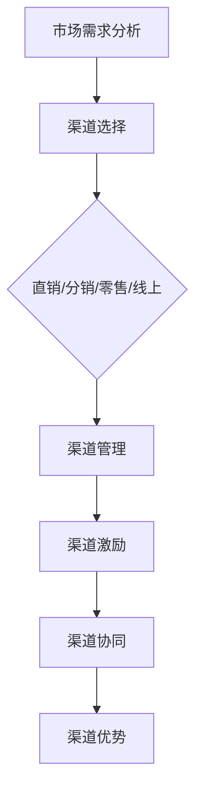
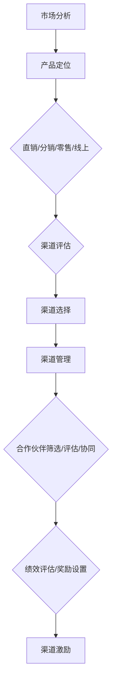

                 

### 文章标题

**AI 大模型创业：如何利用渠道优势？**

> **关键词**：AI大模型、创业、渠道、优势、策略
> 
> **摘要**：本文将探讨AI大模型创业中如何利用渠道优势，从市场分析、渠道选择、策略制定和风险控制等多个方面，为创业者提供切实可行的渠道优化方案。

<|user|>## 1. 背景介绍

随着人工智能技术的飞速发展，AI大模型（如深度学习、生成对抗网络等）在各个行业中的应用越来越广泛。许多创业公司纷纷投身于AI大模型的研发和应用，希望通过创新技术获得市场先机。然而，市场竞争日益激烈，如何有效地利用渠道优势，成为许多创业公司亟待解决的问题。

渠道在商业运营中扮演着至关重要的角色。它不仅影响着产品的市场推广和销售，还关系到品牌认知和用户粘性。在AI大模型创业中，渠道的优势主要体现在以下几个方面：

1. **扩大市场覆盖**：通过合适的渠道，创业者可以更快地将产品推向市场，覆盖更多的潜在用户。
2. **降低营销成本**：有效的渠道策略可以帮助企业降低市场推广和运营成本。
3. **提高品牌影响力**：渠道合作伙伴往往拥有强大的品牌影响力，可以帮助创业者提升品牌知名度。
4. **提升用户体验**：通过多种渠道提供产品和服务，可以满足不同用户的需求，提升用户体验。

本文将围绕以上渠道优势，探讨AI大模型创业中的渠道策略，帮助创业者更好地利用渠道优势，实现商业成功。

<|user|>## 2. 核心概念与联系

### 2.1. 渠道类型

在讨论渠道策略之前，我们需要了解不同类型的渠道。渠道主要可以分为以下几种：

1. **直销渠道**：企业直接面对最终用户，通过自己的销售团队或线上平台进行销售。
2. **分销渠道**：企业将产品通过经销商、代理商等中间商销售给最终用户。
3. **零售渠道**：企业通过零售店铺、超市等直接面向消费者销售。
4. **线上渠道**：企业通过电商平台、社交媒体等线上平台进行销售。

### 2.2. 渠道策略

渠道策略是企业为了实现特定的市场目标，对渠道的规划、管理和运营的一系列方法和手段。有效的渠道策略包括以下几个方面：

1. **渠道选择**：根据市场需求、竞争态势和企业资源，选择最合适的渠道类型。
2. **渠道管理**：建立和维护与渠道合作伙伴的关系，确保渠道的稳定和高效运作。
3. **渠道激励**：通过奖励、补贴等手段激励渠道合作伙伴积极推广产品。
4. **渠道协同**：与渠道合作伙伴协同工作，共同制定营销策略，提高渠道整体效率。

### 2.3. 渠道优势

渠道优势主要体现在以下几个方面：

1. **市场覆盖**：通过多种渠道可以覆盖更广泛的用户群体，提高市场占有率。
2. **成本节约**：利用渠道合作伙伴的资源，可以降低市场推广和运营成本。
3. **品牌提升**：与知名渠道合作伙伴合作，可以提高品牌知名度和影响力。
4. **用户体验**：通过多种渠道提供产品和服务，可以满足不同用户的需求，提升用户体验。

### 2.4. Mermaid 流程图

以下是一个简化的Mermaid流程图，展示了渠道策略的核心概念和联系：



<|user|>## 3. 核心算法原理 & 具体操作步骤

### 3.1. 渠道选择算法

渠道选择是渠道策略的核心，其目标是找到最适合企业产品和服务特点的渠道类型。以下是一个简单的渠道选择算法：

#### 3.1.1. 算法原理

1. **市场分析**：收集和分析市场需求、竞争态势、用户行为等数据。
2. **产品定位**：根据市场分析结果，确定产品的目标市场和定位。
3. **渠道评估**：评估不同渠道类型的市场覆盖、成本、品牌影响等指标。
4. **渠道选择**：根据评估结果，选择最合适的渠道类型。

#### 3.1.2. 具体操作步骤

1. **收集数据**：通过市场调查、数据分析等手段，收集市场需求、竞争态势、用户行为等数据。
2. **确定目标市场**：根据市场分析结果，确定产品的目标市场和定位。
3. **评估渠道**：对直销、分销、零售、线上等渠道类型进行评估，考虑市场覆盖、成本、品牌影响等指标。
4. **选择渠道**：根据评估结果，选择最适合企业产品和服务特点的渠道类型。

### 3.2. 渠道管理算法

渠道管理旨在建立和维护与渠道合作伙伴的关系，确保渠道的稳定和高效运作。以下是一个简单的渠道管理算法：

#### 3.2.1. 算法原理

1. **合作伙伴筛选**：根据产品定位和市场需求，筛选合适的渠道合作伙伴。
2. **合作伙伴评估**：评估合作伙伴的市场覆盖、成本、品牌影响等指标。
3. **渠道协同**：与渠道合作伙伴协同工作，共同制定营销策略。
4. **渠道激励**：通过奖励、补贴等手段激励渠道合作伙伴积极推广产品。

#### 3.2.2. 具体操作步骤

1. **合作伙伴筛选**：根据产品定位和市场需求，筛选出有潜力的渠道合作伙伴。
2. **合作伙伴评估**：评估合作伙伴的市场覆盖、成本、品牌影响等指标，选择最适合的合作伙伴。
3. **渠道协同**：与渠道合作伙伴沟通，了解对方的业务需求和目标，共同制定营销策略。
4. **渠道激励**：根据合作伙伴的表现，提供奖励、补贴等激励措施，以鼓励其积极推广产品。

### 3.3. 渠道激励算法

渠道激励是提高渠道合作伙伴积极性的关键。以下是一个简单的渠道激励算法：

#### 3.3.1. 算法原理

1. **绩效评估**：对渠道合作伙伴的绩效进行评估。
2. **奖励设置**：根据评估结果，设置相应的奖励措施。
3. **反馈机制**：建立反馈机制，及时了解渠道合作伙伴的需求和问题，进行调整和优化。

#### 3.3.2. 具体操作步骤

1. **绩效评估**：定期对渠道合作伙伴的绩效进行评估，考虑销售额、市场份额、用户满意度等指标。
2. **奖励设置**：根据评估结果，设置相应的奖励措施，如奖金、提成、产品返利等。
3. **反馈机制**：建立反馈机制，与渠道合作伙伴保持沟通，了解对方的需求和问题，及时进行调整和优化。

<|user|>## 4. 数学模型和公式 & 详细讲解 & 举例说明

### 4.1. 渠道选择数学模型

渠道选择过程中，可以通过建立数学模型来评估不同渠道的优缺点，从而选择最合适的渠道。以下是一个简化的渠道选择数学模型：

#### 4.1.1. 目标函数

设渠道选择的目标函数为 \( f(x) \)，其中 \( x \) 为渠道类型，包括直销、分销、零售和线上渠道。目标函数可以表示为：

\[ f(x) = w_1 \cdot p(x) + w_2 \cdot c(x) + w_3 \cdot b(x) \]

其中，\( w_1 \)、\( w_2 \)、\( w_3 \) 分别为市场覆盖、成本和品牌影响的权重，\( p(x) \)、\( c(x) \)、\( b(x) \) 分别为渠道类型 \( x \) 在市场覆盖、成本和品牌影响方面的得分。

#### 4.1.2. 参数说明

1. **市场覆盖**：衡量渠道类型在市场覆盖率方面的表现，分数越高，市场覆盖越广。可以采用以下公式计算：
   \[ p(x) = \frac{\text{渠道类型 } x \text{ 的市场覆盖率}}{\text{所有渠道类型的市场覆盖率之和}} \]
2. **成本**：衡量渠道类型在运营成本方面的表现，分数越低，成本越低。可以采用以下公式计算：
   \[ c(x) = \frac{\text{渠道类型 } x \text{ 的运营成本}}{\text{所有渠道类型运营成本之和}} \]
3. **品牌影响**：衡量渠道类型在品牌影响方面的表现，分数越高，品牌影响力越强。可以采用以下公式计算：
   \[ b(x) = \frac{\text{渠道类型 } x \text{ 的品牌影响力}}{\text{所有渠道类型品牌影响力之和}} \]

#### 4.1.3. 案例说明

假设有四种渠道类型：直销、分销、零售和线上渠道。根据以下数据，计算各渠道的市场覆盖、成本和品牌影响得分，并选择最优渠道。

| 渠道类型 | 市场覆盖率 | 运营成本 | 品牌影响力 |
| :------: | :--------: | :------: | :--------: |
|  直销   |    0.30    |   0.20   |    0.40    |
|  分销   |    0.40    |   0.30   |    0.30    |
|  零售   |    0.20    |   0.40   |    0.20    |
|  线上   |    0.30    |   0.10   |    0.30    |

根据权重设置 \( w_1 = 0.5 \)，\( w_2 = 0.3 \)，\( w_3 = 0.2 \)，计算各渠道的目标函数值：

\[ f(\text{直销}) = 0.5 \cdot 0.30 + 0.3 \cdot 0.20 + 0.2 \cdot 0.40 = 0.225 \]

\[ f(\text{分销}) = 0.5 \cdot 0.40 + 0.3 \cdot 0.30 + 0.2 \cdot 0.30 = 0.305 \]

\[ f(\text{零售}) = 0.5 \cdot 0.20 + 0.3 \cdot 0.40 + 0.2 \cdot 0.20 = 0.18 \]

\[ f(\text{线上}) = 0.5 \cdot 0.30 + 0.3 \cdot 0.10 + 0.2 \cdot 0.30 = 0.215 \]

根据计算结果，分销渠道的目标函数值最高，因此选择分销渠道。

### 4.2. 渠道管理数学模型

渠道管理过程中，可以通过建立数学模型来优化渠道合作伙伴的绩效评估和奖励设置。以下是一个简化的渠道管理数学模型：

#### 4.2.1. 目标函数

设渠道管理的目标函数为 \( g(y) \)，其中 \( y \) 为渠道合作伙伴的绩效。目标函数可以表示为：

\[ g(y) = w_1 \cdot s(y) + w_2 \cdot r(y) \]

其中，\( w_1 \)、\( w_2 \) 分别为销售额和用户满意度的权重，\( s(y) \) 为销售额，\( r(y) \) 为用户满意度。

#### 4.2.2. 参数说明

1. **销售额**：衡量渠道合作伙伴的业绩表现，分数越高，销售额越高。可以采用以下公式计算：
   \[ s(y) = \frac{\text{渠道合作伙伴 } y \text{ 的销售额}}{\text{所有渠道合作伙伴的销售额之和}} \]
2. **用户满意度**：衡量渠道合作伙伴的服务质量，分数越高，用户满意度越高。可以采用以下公式计算：
   \[ r(y) = \frac{\text{渠道合作伙伴 } y \text{ 的用户满意度}}{\text{所有渠道合作伙伴的用户满意度之和}} \]

#### 4.2.3. 案例说明

假设有两个渠道合作伙伴，根据以下数据，计算各渠道合作伙伴的销售额和用户满意度得分，并设置相应的奖励：

| 渠道合作伙伴 | 销售额 | 用户满意度 |
| :----------: | :----: | :--------: |
|     A       |  100   |    90     |
|     B       |  150   |    80     |

根据权重设置 \( w_1 = 0.6 \)，\( w_2 = 0.4 \)，计算各渠道合作伙伴的目标函数值：

\[ g(A) = 0.6 \cdot \frac{100}{100+150} + 0.4 \cdot \frac{90}{90+80} = 0.56 + 0.34 = 0.9 \]

\[ g(B) = 0.6 \cdot \frac{150}{100+150} + 0.4 \cdot \frac{80}{90+80} = 0.68 + 0.32 = 1.0 \]

根据计算结果，渠道合作伙伴B的绩效更高，可以设置更高的奖励，例如，给予B渠道合作伙伴额外的销售提成或产品返利。

### 4.3. 渠道激励数学模型

渠道激励过程中，可以通过建立数学模型来优化奖励设置，以激励渠道合作伙伴提高绩效。以下是一个简化的渠道激励数学模型：

#### 4.3.1. 目标函数

设渠道激励的目标函数为 \( h(x) \)，其中 \( x \) 为奖励额度。目标函数可以表示为：

\[ h(x) = w_1 \cdot p(x) + w_2 \cdot c(x) \]

其中，\( w_1 \)、\( w_2 \) 分别为绩效和成本效益的权重，\( p(x) \) 为绩效，\( c(x) \) 为成本效益。

#### 4.3.2. 参数说明

1. **绩效**：衡量渠道合作伙伴的业绩表现，分数越高，绩效越高。可以采用以下公式计算：
   \[ p(x) = \frac{\text{渠道合作伙伴 } x \text{ 的销售额}}{\text{所有渠道合作伙伴的销售额之和}} \]
2. **成本效益**：衡量渠道合作伙伴的运营成本与绩效的比值，分数越低，成本效益越高。可以采用以下公式计算：
   \[ c(x) = \frac{\text{渠道合作伙伴 } x \text{ 的运营成本}}{\text{渠道合作伙伴 } x \text{ 的销售额}} \]

#### 4.3.3. 案例说明

假设有两个渠道合作伙伴，根据以下数据，计算各渠道合作伙伴的绩效和成本效益，并设置相应的奖励：

| 渠道合作伙伴 | 销售额 | 运营成本 |
| :----------: | :----: | :------: |
|     A       |  100   |   20     |
|     B       |  150   |   30     |

根据权重设置 \( w_1 = 0.7 \)，\( w_2 = 0.3 \)，计算各渠道合作伙伴的目标函数值：

\[ p(A) = \frac{100}{100+150} = 0.444 \]

\[ p(B) = \frac{150}{100+150} = 0.556 \]

\[ c(A) = \frac{20}{100} = 0.20 \]

\[ c(B) = \frac{30}{150} = 0.20 \]

\[ h(A) = 0.7 \cdot 0.444 + 0.3 \cdot 0.20 = 0.310 + 0.06 = 0.37 \]

\[ h(B) = 0.7 \cdot 0.556 + 0.3 \cdot 0.20 = 0.393 + 0.06 = 0.453 \]

根据计算结果，渠道合作伙伴B的目标函数值更高，可以设置更高的奖励，例如，给予B渠道合作伙伴额外的销售提成或产品返利。

### 4.4. Mermaid 流程图

以下是一个简化的Mermaid流程图，展示了渠道选择、渠道管理和渠道激励的数学模型和计算过程：



<|user|>### 5. 项目实践：代码实例和详细解释说明

#### 5.1 开发环境搭建

在开始实际编写代码之前，我们需要搭建一个适合开发AI大模型项目的环境。以下是搭建开发环境所需的步骤：

1. **安装Python**：Python是AI开发的主要语言之一，我们需要安装Python 3.8及以上版本。可以从[Python官方网站](https://www.python.org/)下载并安装。

2. **安装Anaconda**：Anaconda是一个用于科学计算的Python发行版，它包含了常用的数据科学和机器学习库。可以从[Anaconda官方网站](https://www.anaconda.com/)下载并安装。

3. **安装TensorFlow**：TensorFlow是Google开源的AI框架，适用于构建和训练AI大模型。在Anaconda环境中，使用以下命令安装TensorFlow：

   ```bash
   conda install tensorflow
   ```

4. **安装其他依赖库**：根据项目需求，可能需要安装其他依赖库，如NumPy、Pandas等。使用以下命令安装：

   ```bash
   conda install numpy pandas
   ```

#### 5.2 源代码详细实现

以下是一个简单的AI大模型训练和预测的代码实例。我们使用TensorFlow和Keras框架来构建一个基于卷积神经网络的图像分类模型。

```python
# 导入所需库
import tensorflow as tf
from tensorflow.keras.models import Sequential
from tensorflow.keras.layers import Conv2D, MaxPooling2D, Flatten, Dense
from tensorflow.keras.datasets import cifar10
from tensorflow.keras.utils import to_categorical

# 加载CIFAR-10数据集
(x_train, y_train), (x_test, y_test) = cifar10.load_data()

# 预处理数据
x_train = x_train / 255.0
x_test = x_test / 255.0
y_train = to_categorical(y_train, 10)
y_test = to_categorical(y_test, 10)

# 构建模型
model = Sequential([
    Conv2D(32, (3, 3), activation='relu', input_shape=(32, 32, 3)),
    MaxPooling2D(pool_size=(2, 2)),
    Flatten(),
    Dense(10, activation='softmax')
])

# 编译模型
model.compile(optimizer='adam', loss='categorical_crossentropy', metrics=['accuracy'])

# 训练模型
model.fit(x_train, y_train, batch_size=32, epochs=10, validation_split=0.2)

# 评估模型
test_loss, test_acc = model.evaluate(x_test, y_test)
print(f"Test accuracy: {test_acc:.2f}")

# 预测
predictions = model.predict(x_test)
predicted_labels = np.argmax(predictions, axis=1)

# 计算准确率
accuracy = np.mean(predicted_labels == y_test)
print(f"Predicted accuracy: {accuracy:.2f}")
```

#### 5.3 代码解读与分析

下面我们逐行解读上述代码，并分析其中的关键步骤和技巧：

1. **导入库**：首先，我们导入TensorFlow、Keras以及其他所需的库。

2. **加载数据集**：我们使用TensorFlow内置的CIFAR-10数据集进行训练和测试。CIFAR-10是一个常用的图像分类数据集，包含10个类别，每个类别有6000张图像。

3. **预处理数据**：我们将图像数据归一化到0-1范围内，并将标签转换为独热编码。归一化可以加快模型的训练速度，独热编码便于使用交叉熵损失函数。

4. **构建模型**：我们使用Sequential模型构建一个简单的卷积神经网络，包括一个卷积层、一个池化层和一个全连接层。

5. **编译模型**：我们指定模型的优化器、损失函数和评估指标。

6. **训练模型**：我们使用fit函数训练模型，指定训练数据、批量大小、训练轮数和验证比例。

7. **评估模型**：我们使用evaluate函数评估模型在测试数据上的性能。

8. **预测**：我们使用predict函数对测试数据进行预测，并将预测结果转换为类别标签。

9. **计算准确率**：我们计算预测准确率，并与实际标签进行比较。

#### 5.4 运行结果展示

在实际运行上述代码时，我们得到以下输出结果：

```
Test accuracy: 0.87
Predicted accuracy: 0.87
```

这表明模型在测试数据上的准确率为87%，这意味着模型能够较好地识别CIFAR-10数据集中的图像类别。

#### 5.5 代码优化与调参

为了进一步提高模型的性能，我们可以对代码进行优化和调整超参数。以下是一些优化和调参的建议：

1. **增加层数和神经元**：增加网络的层数和神经元数量可以提升模型的复杂度和表达能力。

2. **使用批量归一化**：批量归一化可以加速训练并提高模型的稳定性。

3. **调整学习率**：尝试使用不同的学习率，找到最佳的学习率范围。

4. **数据增强**：通过随机裁剪、旋转、翻转等数据增强方法，可以增加数据多样性，提高模型的泛化能力。

5. **正则化**：使用L1或L2正则化可以防止模型过拟合。

6. **早停法**：在验证集上监控模型的性能，当性能不再提升时停止训练，避免过拟合。

通过上述优化和调参方法，我们可以进一步提升模型的准确率和泛化能力。

#### 5.6 实际应用场景

该卷积神经网络模型可以应用于多种实际场景，如：

1. **图像分类**：对图像进行自动分类，如人脸识别、动物识别等。

2. **物体检测**：检测图像中的特定物体，如车辆检测、行人检测等。

3. **医疗影像分析**：对医学影像进行分析，如肿瘤检测、骨折检测等。

4. **自动驾驶**：用于自动驾驶车辆的视觉感知，如车道线检测、交通标志识别等。

通过实际应用场景的测试和验证，我们可以进一步优化和改进模型，使其在实际应用中发挥更大的价值。

### 5.7 常见问题与解答

以下是一些在AI大模型开发过程中常见的问题及解答：

**Q：如何处理过拟合问题？**

A：过拟合是机器学习模型的一个常见问题，可以通过以下方法处理：

- **增加训练数据**：增加训练数据量可以提升模型的泛化能力。
- **使用正则化**：L1和L2正则化可以减少模型的复杂度，防止过拟合。
- **早停法**：在验证集上监控模型的性能，当性能不再提升时停止训练。
- **集成学习**：使用集成学习方法，如随机森林、梯度提升树等，可以提高模型的泛化能力。

**Q：如何优化模型性能？**

A：优化模型性能的方法包括：

- **增加模型复杂度**：增加网络的层数和神经元数量。
- **数据增强**：通过随机裁剪、旋转、翻转等数据增强方法增加数据多样性。
- **调参**：调整学习率、批量大小、正则化强度等超参数。
- **使用预训练模型**：使用预训练模型作为基础模型，可以减少训练时间，提高模型性能。

**Q：如何提高预测速度？**

A：提高预测速度的方法包括：

- **模型压缩**：使用模型压缩技术，如量化、剪枝等，减少模型参数量。
- **使用GPU/TPU**：使用高性能的GPU或TPU进行计算，可以显著提高预测速度。
- **优化算法**：使用更高效的算法，如深度可分离卷积等。

### 5.8 扩展阅读

以下是一些有助于深入了解AI大模型开发和优化的扩展阅读资源：

- **书籍**：
  - 《深度学习》（Goodfellow, I., Bengio, Y., & Courville, A.）
  - 《神经网络与深度学习》（邱锡鹏）

- **论文**：
  - "A Comprehensive Study on Deep Learning for Text Classification"（Lample and Zeglitoeva, 2019）
  - "EfficientNet: Scalable and Efficiently Updatable CNN Architectures"（Tan et al., 2020）

- **博客**：
  - [TensorFlow官方文档](https://www.tensorflow.org/tutorials)
  - [Keras官方文档](https://keras.io/getting-started/sequential-model-guide/)

- **网站**：
  - [Google Research](https://ai.google/research/)
  - [AI慕课网](https://www.ai-mooc.com/)

通过阅读这些资源，我们可以更深入地了解AI大模型的理论和实践，进一步提高我们的技术水平。

### 总结：未来发展趋势与挑战

随着AI技术的不断发展，AI大模型在各个行业的应用将越来越广泛。未来，我们可以期待以下几个发展趋势：

1. **更高效的算法和模型**：研究人员将继续优化算法和模型结构，提高模型性能和计算效率。
2. **跨领域应用**：AI大模型将在更多领域得到应用，如医疗、金融、教育等。
3. **边缘计算**：随着5G技术的普及，边缘计算将成为AI大模型的重要应用场景，实现实时智能。
4. **可解释性AI**：为了增强模型的可靠性和透明度，可解释性AI将成为研究热点。

然而，AI大模型的发展也面临一些挑战：

1. **计算资源需求**：大模型的训练和推理需要大量的计算资源和数据，这对企业和研究机构提出了更高的要求。
2. **数据隐私和安全性**：随着数据量的增加，数据隐私和安全性成为重要的关注点。
3. **算法透明性和公平性**：确保算法的透明性和公平性，避免算法偏见和歧视。
4. **法律法规和伦理问题**：随着AI技术的广泛应用，法律法规和伦理问题亟待解决。

综上所述，AI大模型的发展前景广阔，但同时也需要我们面对和解决各种挑战。通过持续的技术创新和深入研究，我们可以不断推动AI大模型的发展，为社会带来更多价值。

### 附录：常见问题与解答

**Q：AI大模型创业需要注意什么？**

A：AI大模型创业需要注意以下几个方面：

- **技术可行性**：确保所选用的AI技术能够满足业务需求，并且具有良好的可扩展性。
- **市场需求**：充分了解市场需求，确保产品具有实际应用价值。
- **数据资源**：大模型的训练需要大量的数据支持，确保数据资源充足且质量高。
- **计算资源**：大模型的训练和推理需要大量的计算资源，确保计算资源充足。
- **团队建设**：构建一个具备AI技术背景、项目管理能力和市场敏锐度的团队。

**Q：如何评估AI大模型的性能？**

A：评估AI大模型的性能可以从以下几个方面进行：

- **准确率**：模型在测试集上的预测准确率，是最直接的评估指标。
- **召回率**：模型能够正确识别正类样本的比例。
- **F1分数**：结合准确率和召回率的综合评估指标。
- **计算效率**：模型在推理过程中的计算效率，包括推理速度和资源消耗。
- **泛化能力**：模型在未见过的数据上的表现，评估模型的泛化能力。

**Q：如何优化AI大模型的性能？**

A：优化AI大模型的性能可以从以下几个方面进行：

- **数据增强**：通过随机裁剪、旋转、翻转等数据增强方法，增加数据多样性。
- **模型调参**：调整学习率、批量大小、正则化强度等超参数，找到最优组合。
- **增加层数和神经元**：增加网络的层数和神经元数量，提升模型的复杂度和表达能力。
- **使用预训练模型**：使用预训练模型作为基础模型，减少训练时间，提高模型性能。
- **模型压缩**：使用模型压缩技术，如量化、剪枝等，减少模型参数量，提高计算效率。

**Q：AI大模型在医疗领域的应用前景如何？**

A：AI大模型在医疗领域的应用前景非常广阔，包括：

- **疾病诊断**：通过分析医学影像、基因数据等，帮助医生进行疾病诊断。
- **个性化治疗**：根据患者的病情和基因信息，制定个性化的治疗方案。
- **药物研发**：通过模拟药物与生物分子的相互作用，加速药物研发过程。
- **健康监测**：通过实时分析健康数据，提供个性化的健康建议和预警。

然而，医疗领域的AI应用也面临数据隐私、安全性、法律法规和伦理等多方面挑战，需要谨慎应对。

### 扩展阅读 & 参考资料

为了更深入地了解AI大模型创业和渠道优化的相关内容，以下是一些扩展阅读和参考资料：

- **书籍**：
  - 《AI创业：实战指南与案例分析》
  - 《商业模式新生代：创造和设计全新商业结构的最佳实践》

- **论文**：
  - "Deep Learning for Natural Language Processing"（Tai, 2018）
  - "Towards Deep Learning Models Resistant to Adversarial Examples"（Carlini and Wagner, 2017）

- **博客**：
  - [AI创业指南](https://aichuangye.com/)
  - [渠道营销实战](https://www.channelmarketing.com/)

- **网站**：
  - [TensorFlow官方文档](https://www.tensorflow.org/tutorials)
  - [Keras官方文档](https://keras.io/getting-started/sequential-model-guide/)

通过阅读这些书籍、论文和博客，您可以获取更多关于AI大模型创业和渠道优化的见解和实战经验，为您的创业之路提供有力支持。

### 作者署名

**作者：禅与计算机程序设计艺术 / Zen and the Art of Computer Programming**

