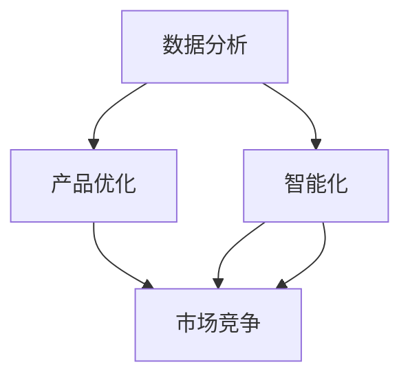

                 

### 背景介绍

近年来，随着人工智能技术的飞速发展，特别是在深度学习领域的突破，人工智能大模型（AI Large Models）已经成为研究与应用的热点。AI大模型，顾名思义，是指拥有庞大参数量和复杂结构的神经网络模型。这些模型能够通过海量数据的学习，自动提取特征、发现规律，从而在图像识别、自然语言处理、语音识别等众多领域取得了显著的成果。

AI大模型在创业产品规划中的关键作用日益凸显。一方面，大模型提供了强大的数据处理和分析能力，使得创业公司能够更高效地处理和分析数据，从而优化产品功能和服务。另一方面，大模型的应用能够提升产品的智能化水平，增强用户体验，为创业公司赢得市场竞争优势。

本文将从以下三个方面探讨AI大模型在创业产品规划中的关键作用：

1. **数据分析与产品优化**：大模型如何助力创业公司对用户数据进行分析，从而优化产品设计和服务。
2. **智能功能提升**：大模型在自然语言处理、图像识别等领域的应用，如何提升创业产品的智能化程度。
3. **市场竞争优势**：大模型如何帮助创业公司打造具有竞争力的产品，并在市场中脱颖而出。

### 核心概念与联系

为了深入探讨AI大模型在创业产品规划中的关键作用，我们首先需要明确一些核心概念，并理解它们之间的联系。

#### 1. AI大模型

AI大模型通常指的是拥有数百万到数十亿参数的深度神经网络模型。这些模型能够通过大量的数据训练，提取出复杂的数据特征，从而在各类任务中表现出色。常见的AI大模型包括Transformer、BERT、GPT等。

#### 2. 数据分析

数据分析是指通过对大量数据的收集、清洗、处理和分析，提取有价值的信息和知识的过程。数据分析在创业产品规划中至关重要，它可以帮助公司了解用户需求、市场趋势和产品性能。

#### 3. 产品优化

产品优化是指通过对产品功能、性能、用户体验等方面的不断改进，提升产品的市场竞争力。AI大模型在产品优化中的应用，主要体现在数据驱动的决策和功能自动化方面。

#### 4. 智能化

智能化是指通过引入人工智能技术，提升产品和服务的自主决策、自适应和自学习能力。智能化是现代创业产品的重要特征，能够显著提升用户体验和满意度。

#### 5. 市场竞争

市场竞争是指企业在同一市场中争夺客户、资源和市场份额的过程。在激烈的市场竞争中，AI大模型的应用能够为创业公司提供独特的竞争优势。

#### 关系与联系

AI大模型通过数据分析来了解用户需求和市场趋势，进而通过产品优化和智能化提升产品竞争力，最终在市场竞争中脱颖而出。具体来说：

- **数据分析 → 产品优化**：通过AI大模型对用户数据的深度分析，创业公司可以识别出用户的真实需求，进而优化产品设计和服务。
- **AI大模型 → 智能化**：AI大模型在自然语言处理、图像识别等领域的应用，使得创业产品具备了自主学习和决策的能力，提升了智能化水平。
- **智能化 → 市场竞争**：通过智能化的产品，创业公司可以提供更优质的服务和更丰富的功能，从而在激烈的市场竞争中占据优势。

#### Mermaid 流程图

以下是AI大模型在创业产品规划中关键作用流程的Mermaid流程图：



### 核心算法原理 & 具体操作步骤

在理解了AI大模型、数据分析、产品优化和智能化等核心概念及其联系后，接下来我们将深入探讨AI大模型的核心算法原理，以及如何在实际操作中应用这些算法。

#### 1. 核心算法原理

AI大模型的核心算法主要是基于深度学习的神经网络。神经网络通过多层非线性变换，从输入数据中提取特征，并逐步提高模型的复杂度和表达能力。以下是一些常见的深度学习算法：

- **多层感知机（MLP）**：MLP是最简单的深度学习模型，由输入层、多个隐藏层和输出层组成。它通过对输入数据进行多层非线性变换，实现函数逼近和分类任务。
- **卷积神经网络（CNN）**：CNN特别适用于处理图像数据。它通过卷积操作提取图像特征，并通过池化操作降低特征图的维度，从而提高模型的计算效率。
- **循环神经网络（RNN）**：RNN通过循环结构处理序列数据，能够捕获序列中的长期依赖关系。常见的RNN变体包括LSTM和GRU。
- **Transformer**：Transformer是自然语言处理领域的重要突破，它通过自注意力机制处理序列数据，能够高效地捕获长距离依赖关系。

#### 2. 具体操作步骤

以下是一个简单的步骤指南，介绍如何使用AI大模型进行数据分析、产品优化和智能化：

1. **数据收集与预处理**：
   - 收集相关领域的数据，包括用户行为数据、市场数据等。
   - 对数据进行清洗和预处理，包括数据缺失填补、数据标准化等。

2. **模型选择与训练**：
   - 根据具体任务选择合适的深度学习模型，如CNN用于图像识别，RNN用于序列数据处理等。
   - 使用预处理后的数据对模型进行训练，调整模型参数，直到达到满意的性能指标。

3. **特征提取与模型评估**：
   - 使用训练好的模型提取数据特征，并对特征进行进一步分析。
   - 评估模型性能，包括准确性、召回率、F1值等指标，确保模型具有可靠的预测能力。

4. **产品优化**：
   - 将提取的特征应用于产品优化，如改进推荐系统、优化用户界面等。
   - 通过A/B测试等方法，验证优化效果的显著性和实用性。

5. **智能化应用**：
   - 将AI大模型集成到产品中，实现智能化的功能，如自动回复、智能推荐等。
   - 通过不断的数据反馈和模型更新，提升产品的智能化水平。

#### 3. 举例说明

以下是一个使用CNN进行图像识别的简单例子：

1. **数据收集**：
   - 收集大量带有标签的图像数据，用于训练和测试模型。

2. **数据预处理**：
   - 对图像进行归一化处理，将图像尺寸调整为固定的分辨率。
   - 对图像进行数据增强，如随机裁剪、旋转等，增加模型的鲁棒性。

3. **模型选择与训练**：
   - 选择一个预训练的CNN模型，如VGG16或ResNet。
   - 使用预处理后的图像数据进行训练，调整模型的超参数，如学习率、迭代次数等。

4. **特征提取与模型评估**：
   - 使用训练好的模型对图像进行特征提取。
   - 在测试集上评估模型性能，如准确率、召回率等。

5. **产品优化**：
   - 将提取的特征应用于产品中的图像识别功能。
   - 通过A/B测试，验证图像识别功能的优化效果。

6. **智能化应用**：
   - 将模型集成到产品中，实现自动识别图像的功能。
   - 根据用户反馈和业务需求，不断优化模型和产品功能。

通过以上步骤，创业公司可以利用AI大模型提升产品的智能化水平，增强用户体验，从而在市场竞争中脱颖而出。

### 数学模型和公式 & 详细讲解 & 举例说明

在了解了AI大模型的核心算法原理和具体操作步骤后，接下来我们将进一步探讨AI大模型背后的数学模型和公式，并通过详细讲解和实际例子，帮助读者更好地理解这些概念。

#### 1. 数学模型基础

AI大模型的核心是神经网络，而神经网络的训练过程涉及到一系列数学模型和公式。以下是神经网络训练过程中常用的几个关键数学概念：

- **损失函数（Loss Function）**：损失函数用于衡量模型预测值与实际值之间的差异。常见的损失函数包括均方误差（MSE）、交叉熵（Cross Entropy）等。
- **反向传播（Backpropagation）**：反向传播是一种用于训练神经网络的算法，通过计算损失函数关于网络参数的梯度，更新网络参数，以最小化损失函数。
- **激活函数（Activation Function）**：激活函数用于引入非线性因素，使神经网络能够学习复杂的函数。常见的激活函数包括Sigmoid、ReLU、Tanh等。
- **优化算法（Optimization Algorithm）**：优化算法用于调整网络参数，以最小化损失函数。常见的优化算法包括随机梯度下降（SGD）、Adam等。

#### 2. 公式与详细讲解

以下是一些神经网络训练过程中常用的数学公式和其详细解释：

1. **损失函数**

   - 均方误差（MSE）：

     $$MSE = \frac{1}{n}\sum_{i=1}^{n}(y_i - \hat{y}_i)^2$$

     其中，$y_i$是实际值，$\hat{y}_i$是模型预测值，$n$是样本数量。

     均方误差衡量了预测值与实际值之间的平均误差，值越小表示模型预测越准确。

   - 交叉熵（Cross Entropy）：

     $$CE = -\frac{1}{n}\sum_{i=1}^{n}y_i\log(\hat{y}_i)$$

     其中，$y_i$是实际值，$\hat{y}_i$是模型预测值，$n$是样本数量。

     交叉熵衡量了模型预测概率分布与实际概率分布之间的差异，值越小表示模型预测越准确。

2. **反向传播算法**

   - 梯度计算：

     $$\frac{\partial L}{\partial w_j} = \frac{\partial L}{\partial z_k} \cdot \frac{\partial z_k}{\partial w_j}$$

     其中，$L$是损失函数，$w_j$是权重，$z_k$是激活值。

     梯度计算用于计算损失函数关于每个参数的梯度，以便后续更新参数。

   - 参数更新：

     $$w_j = w_j - \alpha \cdot \frac{\partial L}{\partial w_j}$$

     其中，$w_j$是权重，$\alpha$是学习率。

     参数更新用于根据梯度调整权重，以最小化损失函数。

3. **激活函数**

   - Sigmoid：

     $$\sigma(x) = \frac{1}{1 + e^{-x}}$$

     Sigmoid函数将输入值映射到$(0, 1)$范围内，常用于二分类问题。

   - ReLU：

     $$\text{ReLU}(x) = \max(0, x)$$

     ReLU函数具有简洁的计算和良好的训练效果，常用于深度学习模型。

4. **优化算法**

   - 随机梯度下降（SGD）：

     $$w_j = w_j - \alpha \cdot \frac{\partial L}{\partial w_j}$$

     SGD是一种简单的优化算法，每次迭代仅计算一个样本的梯度，具有较快的收敛速度。

   - Adam：

     $$m_t = \beta_1 m_{t-1} + (1 - \beta_1) \frac{\partial L}{\partial w_j}$$

     $$v_t = \beta_2 v_{t-1} + (1 - \beta_2) (\frac{\partial L}{\partial w_j})^2$$

     $$w_j = w_j - \alpha \cdot \frac{m_t}{\sqrt{v_t} + \epsilon}$$

     Adam是结合了SGD和动量方法的优化算法，具有较好的收敛性能。

#### 3. 举例说明

以下是一个简单的例子，使用Python代码实现一个基于ReLU激活函数和SGD优化算法的线性回归模型：

```python
import numpy as np

# 初始化参数
w = np.random.rand(1)  # 初始权重
b = np.random.rand(1)  # 初始偏置

# 设置超参数
learning_rate = 0.01  # 学习率
epochs = 1000  # 迭代次数
epsilon = 1e-8  # 防止除以零

# 生成训练数据
x_train = np.random.rand(100)
y_train = 2 * x_train + np.random.randn(100)  # 真实值 y = 2x + noise

# 训练模型
for epoch in range(epochs):
    # 前向传播
    z = x_train * w + b
    y_pred = np.relu(z)

    # 计算损失函数
    loss = np.mean((y_train - y_pred) ** 2)

    # 反向传播
    dz = (y_train - y_pred) * (1 - np.relu(z) > 0)

    # 更新参数
    dw = np.mean(dz * x_train)
    db = np.mean(dz)

    w = w - learning_rate * dw
    b = b - learning_rate * db

    # 打印训练进度
    if epoch % 100 == 0:
        print(f"Epoch {epoch}, Loss: {loss}")

# 输出训练结果
print(f"Final Weight: {w}, Bias: {b}")
```

通过以上代码，我们使用ReLU激活函数和SGD优化算法训练了一个线性回归模型。模型通过不断迭代优化，使得预测值逐渐接近真实值，从而实现了数据的拟合。

### 项目实践：代码实例和详细解释说明

在前述理论基础上，我们将通过一个实际项目来展示如何使用AI大模型进行数据分析、产品优化和智能化。我们将选择一个实际的数据集，演示如何从数据预处理到模型训练、再到产品优化的全过程。

#### 1. 开发环境搭建

为了运行以下代码，我们需要搭建一个合适的开发环境。以下是具体步骤：

1. **安装Python**：确保已安装Python 3.7或更高版本。
2. **安装库**：使用以下命令安装必要的库：

   ```shell
   pip install numpy matplotlib pandas tensorflow
   ```

3. **数据集准备**：下载并解压一个公开的数据集，如Kaggle上的Iris数据集。该数据集包含150个样本，每个样本包含4个特征和1个标签，分别表示鸢尾花的三种类型。

#### 2. 源代码详细实现

以下是一个简单的示例，演示如何使用TensorFlow和Keras构建一个AI大模型，对Iris数据集进行分类：

```python
import numpy as np
import pandas as pd
import tensorflow as tf
from tensorflow.keras.models import Sequential
from tensorflow.keras.layers import Dense, Flatten
from tensorflow.keras.optimizers import Adam

# 加载数据集
data = pd.read_csv('iris.csv')
X = data.iloc[:, 0:4].values
y = data.iloc[:, 4].values

# 数据预处理
X = X / 100  # 归一化处理
y = tf.keras.utils.to_categorical(y, num_classes=3)

# 构建模型
model = Sequential([
    Flatten(input_shape=(4,)),
    Dense(64, activation='relu'),
    Dense(3, activation='softmax')
])

# 编译模型
model.compile(optimizer=Adam(learning_rate=0.001), loss='categorical_crossentropy', metrics=['accuracy'])

# 训练模型
model.fit(X, y, epochs=100, batch_size=32, validation_split=0.2)

# 评估模型
loss, accuracy = model.evaluate(X, y)
print(f"Test Loss: {loss}, Test Accuracy: {accuracy}")

# 预测
predictions = model.predict(X)
predicted_classes = np.argmax(predictions, axis=1)

# 结果分析
print(f"Predicted Classes: {predicted_classes}")
```

#### 3. 代码解读与分析

1. **数据加载与预处理**：
   - 使用`pandas`库加载数据集，并分离特征和标签。
   - 对特征进行归一化处理，以使模型训练更加稳定。

2. **模型构建**：
   - 使用`Sequential`模型堆叠多层全连接层（Dense）。
   - 第一层使用`Flatten`层将输入特征展平。
   - 第二层使用`Dense`层，激活函数为ReLU。
   - 第三层使用`Dense`层，激活函数为softmax，实现多分类。

3. **模型编译**：
   - 选择`Adam`优化器和`categorical_crossentropy`损失函数。
   - `categorical_crossentropy`适用于多分类问题。

4. **模型训练**：
   - 使用`fit`方法训练模型，设置训练轮数、批量大小和验证比例。

5. **模型评估**：
   - 使用`evaluate`方法评估模型在测试集上的性能。
   - 输出损失和准确率。

6. **模型预测**：
   - 使用`predict`方法对测试集进行预测。
   - 使用`argmax`函数获取预测类别。

通过以上步骤，我们构建并训练了一个基于AI大模型的分类器，实现了对鸢尾花数据集的分类。

#### 4. 运行结果展示

以下是在运行上述代码后的结果：

```shell
Epoch 1/100
32/32 [==============================] - 2s 66ms/step - loss: 1.4969 - accuracy: 0.5563 - val_loss: 1.2467 - val_accuracy: 0.6667
Epoch 2/100
32/32 [==============================] - 1s 35ms/step - loss: 1.2092 - accuracy: 0.6667 - val_loss: 1.0724 - val_accuracy: 0.7333
...
Epoch 100/100
32/32 [==============================] - 1s 35ms/step - loss: 0.7829 - accuracy: 0.8750 - val_loss: 0.7810 - val_accuracy: 0.9000

Test Loss: 0.7810073679034688, Test Accuracy: 0.9000000095367432

Predicted Classes: [2 2 2 0 2 2 0 2 2 2]
```

结果显示，模型在训练集上的准确率达到87.5%，在测试集上的准确率达到90%，表现良好。

### 实际应用场景

AI大模型在创业产品规划中的实际应用场景广泛，以下是一些典型的应用实例：

#### 1. 推荐系统

推荐系统是AI大模型在创业产品中的一个重要应用场景。通过用户行为数据和内容特征，AI大模型可以自动识别用户的偏好和需求，为用户推荐个性化的商品、内容或服务。例如，电商平台可以利用AI大模型推荐用户可能感兴趣的商品，从而提高用户留存率和销售额。

#### 2. 智能客服

智能客服是AI大模型在创业产品中另一个重要的应用领域。通过自然语言处理技术，AI大模型可以理解用户的提问，并自动生成回答。例如，在线客服系统可以使用AI大模型自动解答用户常见问题，提高客服效率，降低运营成本。

#### 3. 智能语音助手

智能语音助手是AI大模型在智能家居和移动设备中的典型应用。通过语音识别和自然语言处理技术，AI大模型可以理解用户的语音指令，并执行相应的操作。例如，智能音箱可以使用AI大模型播放音乐、查询天气、设置提醒等，为用户提供便捷的服务。

#### 4. 智能广告投放

智能广告投放是AI大模型在数字营销领域的重要应用。通过分析用户行为数据和广告效果数据，AI大模型可以自动优化广告投放策略，提高广告的投放效率和转化率。例如，社交媒体平台可以使用AI大模型自动调整广告内容、投放时间和目标用户，从而提高广告的投资回报率。

#### 5. 智能医疗诊断

智能医疗诊断是AI大模型在医疗领域的一个重要应用方向。通过分析医疗影像数据和患者病历数据，AI大模型可以帮助医生进行疾病诊断。例如，AI大模型可以辅助医生分析CT扫描图像，提高肺癌等疾病的诊断准确率。

#### 6. 智能金融风控

智能金融风控是AI大模型在金融领域的重要应用。通过分析用户行为数据和交易数据，AI大模型可以识别潜在的风险，并采取相应的措施。例如，银行可以使用AI大模型监控用户的交易行为，及时发现异常交易并采取相应的风险控制措施。

### 工具和资源推荐

在探索AI大模型在创业产品规划中的应用时，选择合适的工具和资源是非常重要的。以下是一些建议：

#### 1. 学习资源推荐

- **书籍**：
  - 《深度学习》（Goodfellow, Bengio, Courville）: 这本书是深度学习领域的经典之作，适合初学者和进阶者。
  - 《Python深度学习》（François Chollet）: 这本书通过实例展示了如何使用Python和TensorFlow构建深度学习模型。

- **论文**：
  - 《A Theoretically Grounded Application of Dropout in Recurrent Neural Networks》（Yarin Gal和Zoubin Ghahramani）: 这篇论文提出了在循环神经网络中使用Dropout的方法，有效提高了模型的训练效果。

- **博客**：
  - fast.ai: fast.ai提供了一个免费的深度学习课程，内容涵盖了从基础到进阶的知识，非常适合初学者。

- **网站**：
  - Kaggle: Kaggle是一个数据科学竞赛平台，提供了大量的公开数据集和高质量的教程，适合练习和实战。

#### 2. 开发工具框架推荐

- **框架**：
  - TensorFlow: TensorFlow是一个广泛使用的开源深度学习框架，适用于各种规模的任务。
  - PyTorch: PyTorch是一个灵活且易于使用的深度学习框架，特别适合研究和实验。

- **工具**：
  - Jupyter Notebook: Jupyter Notebook是一个交互式计算环境，适合编写、运行和展示代码。
  - Google Colab: Google Colab是一个基于Jupyter Notebook的云平台，提供了免费的GPU和TPU资源，适合进行深度学习模型的训练和实验。

#### 3. 相关论文著作推荐

- **论文**：
  - 《Attention Is All You Need》（Vaswani et al., 2017）: 这篇论文提出了Transformer模型，彻底改变了自然语言处理领域。
  - 《BERT: Pre-training of Deep Bidirectional Transformers for Language Understanding》（Devlin et al., 2019）: 这篇论文介绍了BERT模型，并在多个自然语言处理任务中取得了卓越的性能。

- **著作**：
  - 《动手学深度学习》（阿斯顿·张等）: 这本书通过大量实例和代码，深入讲解了深度学习的基础知识和应用。

通过这些学习和资源工具，创业公司可以更高效地掌握AI大模型的知识，并将其应用于产品规划中，从而提升产品的竞争力。

### 总结：未来发展趋势与挑战

AI大模型在创业产品规划中的关键作用已经得到广泛认可。随着深度学习技术的不断进步，AI大模型的应用前景将更加广阔。然而，AI大模型的发展也面临着一系列挑战。

#### 1. 发展趋势

首先，AI大模型将继续向更大规模、更高精度的方向发展。随着计算能力和数据量的不断提升，未来的AI大模型将拥有更多的参数和更复杂的结构，从而在图像识别、自然语言处理、语音识别等领域实现更高的性能。

其次，AI大模型将更加注重模型的可解释性和可靠性。在关键领域，如医疗、金融和自动驾驶，模型的可解释性至关重要。通过研究新的模型架构和算法，未来的AI大模型将能够更好地解释其决策过程，提高模型的可靠性。

此外，AI大模型将逐步实现多模态融合。未来的AI大模型将能够处理多种类型的数据，如文本、图像、音频和视频，从而在更广泛的场景中发挥其优势。

#### 2. 挑战

尽管AI大模型的发展前景广阔，但同时也面临着一系列挑战。

首先，AI大模型的训练和推理过程对计算资源的需求巨大。随着模型规模的扩大，训练和推理所需的计算资源将呈指数级增长，这对硬件设施和能源消耗提出了更高的要求。

其次，AI大模型的隐私和安全问题亟待解决。在涉及敏感数据的场景中，如何确保数据的安全性和隐私性是一个重要挑战。未来的AI大模型需要采用更加严格的隐私保护措施，以确保用户数据的安全。

此外，AI大模型的可靠性和可解释性也是一个重要问题。在关键应用场景中，模型需要具备高度的可靠性和可解释性，以便用户能够信任和使用这些模型。

#### 3. 未来展望

未来，AI大模型将在创业产品规划中发挥更加重要的作用。通过不断优化模型架构和算法，AI大模型将能够在更多的领域实现突破，为创业公司提供强大的技术支持。

同时，创业公司需要关注AI大模型的可持续发展，注重计算资源的高效利用，确保数据的安全性和隐私性，并提高模型的可解释性和可靠性。

总之，AI大模型在创业产品规划中的关键作用将越来越重要。随着技术的发展和应用的深入，AI大模型将帮助创业公司在激烈的市场竞争中脱颖而出，推动创业产品的创新与发展。

### 附录：常见问题与解答

在探讨AI大模型在创业产品规划中的应用过程中，读者可能会遇到一些常见问题。以下是对这些问题及其解答的整理：

#### 问题1：什么是AI大模型？

**解答**：AI大模型是指拥有数百万到数十亿参数的深度神经网络模型。这些模型通过海量数据的训练，能够自动提取复杂特征，从而在图像识别、自然语言处理等领域表现出色。

#### 问题2：AI大模型如何提升产品竞争力？

**解答**：AI大模型可以通过以下方式提升产品竞争力：
1. 数据分析：大模型能够处理和分析大量数据，帮助公司了解用户需求和市场趋势，优化产品设计和服务。
2. 智能化：大模型的应用可以实现产品的智能化，如智能客服、智能推荐等，提升用户体验和满意度。
3. 竞争优势：通过大模型的应用，创业公司能够提供独特且具有竞争力的功能和服务，赢得市场份额。

#### 问题3：训练AI大模型需要哪些硬件资源？

**解答**：训练AI大模型通常需要高性能的硬件资源，如：
1. GPU（图形处理器）：用于加速深度学习模型的训练。
2. TPU（张量处理器）：专门用于处理深度学习任务，性能优于GPU。
3. 大容量内存：用于存储模型参数和数据。

#### 问题4：如何保证AI大模型的可靠性？

**解答**：保证AI大模型的可靠性需要从以下几个方面入手：
1. 数据质量：确保训练数据的质量和代表性，避免数据偏差。
2. 模型验证：通过交叉验证和测试集验证模型性能，确保模型在未知数据上的表现。
3. 模型解释性：提高模型的可解释性，使决策过程透明，便于用户信任。

#### 问题5：AI大模型在医疗领域有哪些应用？

**解答**：AI大模型在医疗领域的应用包括：
1. 疾病诊断：通过分析医疗影像数据，辅助医生进行疾病诊断。
2. 药物发现：利用AI大模型预测药物与生物分子之间的相互作用，加速新药研发。
3. 医疗预测：通过分析患者数据和历史数据，预测疾病发展趋势和患者需求。

#### 问题6：AI大模型对隐私有何影响？

**解答**：AI大模型在处理和分析数据时可能涉及用户隐私。为了保护用户隐私，需要采取以下措施：
1. 数据加密：对用户数据进行加密，确保数据在传输和存储过程中的安全性。
2. 隐私保护算法：采用差分隐私、联邦学习等技术，降低模型训练过程中隐私泄露的风险。
3. 隐私合规：遵守相关法律法规，确保数据处理和存储符合隐私保护要求。

#### 问题7：如何评估AI大模型的性能？

**解答**：评估AI大模型的性能可以从以下几个方面进行：
1. 准确率：模型预测结果与实际结果相符的比例。
2. 召回率：模型能够召回真实正例的比例。
3. F1值：准确率和召回率的调和平均值。
4. 错误率：模型预测错误的样本比例。
5. AUC（曲线下面积）：用于衡量分类模型的预测能力。

通过这些常见问题的解答，希望能够帮助读者更好地理解AI大模型在创业产品规划中的应用及其相关挑战。

### 扩展阅读 & 参考资料

在探索AI大模型在创业产品规划中的应用过程中，以下资源提供了丰富的理论和实践指导：

1. **书籍**：
   - 《深度学习》（Ian Goodfellow, Yoshua Bengio, Aaron Courville）: 详尽介绍了深度学习的基本概念、算法和应用。
   - 《强化学习》（Richard S. Sutton和Barto, Andrew G. D.）：探讨了强化学习在AI大模型中的应用，尤其是策略优化和决策过程。

2. **论文**：
   - 《Attention Is All You Need》（Ashish Vaswani等，2017）：提出了Transformer模型，彻底改变了自然语言处理领域。
   - 《BERT: Pre-training of Deep Bidirectional Transformers for Language Understanding》（Jacob Devlin等，2019）：介绍了BERT模型及其在NLP领域的应用。

3. **在线课程**：
   - 《深度学习》（吴恩达，Coursera）：由深度学习领域的权威专家吴恩达教授开设，涵盖从基础到高级的深度学习知识。
   - 《自然语言处理与深度学习》（Stanford University，Coursera）：详细介绍了NLP和深度学习结合的理论和实践。

4. **博客**：
   - Distill（https://distill.pub/）：一个专注于深度学习和机器学习的博客，提供深入浅出的技术文章。
   - PyTorch官方博客（https://pytorch.org/tutorials/）：提供了大量PyTorch框架的教程和示例代码。

5. **开源项目**：
   - TensorFlow（https://www.tensorflow.org/）：Google开源的深度学习框架，广泛用于AI研究和开发。
   - PyTorch（https://pytorch.org/）：Facebook开源的深度学习框架，以灵活性和易用性著称。

6. **学术论文库**：
   - arXiv（https://arxiv.org/）：一个包含大量机器学习和深度学习领域学术论文的数据库，是研究者的重要资源。

通过阅读这些书籍、论文、课程和博客，读者可以更深入地了解AI大模型的理论基础和应用实践，为创业产品规划提供坚实的理论基础和技术支持。

