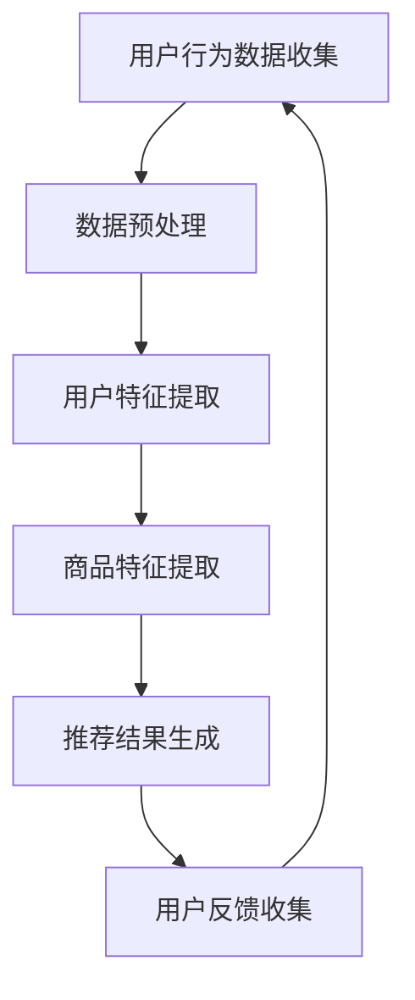

                 

### 文章标题

### AI 大模型在电商搜索推荐中的用户隐私保护：平衡推荐效果与用户权利

#### 关键词：

- AI 大模型
- 电商搜索推荐
- 用户隐私保护
- 推荐算法
- 数据安全
- 用户权利

#### 摘要：

本文旨在探讨人工智能大模型在电商搜索推荐中的用户隐私保护问题。随着人工智能技术的飞速发展，大模型广泛应用于推荐系统，为用户提供了更加个性化的购物体验。然而，这也带来了用户隐私泄露的风险。本文将深入分析大模型在推荐系统中的应用，探讨隐私保护的挑战，并提出相应的解决方案。通过结合实际案例和具体操作步骤，本文旨在为开发者和企业提供一套有效的隐私保护框架，以平衡推荐效果与用户权利。

## 1. 背景介绍

### 1.1 人工智能与电商搜索推荐

人工智能（AI）技术的迅速发展为电商搜索推荐带来了前所未有的机遇。通过机器学习和深度学习算法，电商平台能够对用户行为进行精准分析，从而实现个性化的商品推荐。这种推荐方式不仅提高了用户的购物体验，还显著提升了电商平台的经济效益。

### 1.2 大模型的兴起

近年来，大模型在各个领域取得了显著的成果。以GPT-3、BERT和Transformer为代表的大模型，具有处理大规模数据、生成高质量内容和自适应学习的能力。这些模型在自然语言处理、计算机视觉和语音识别等领域表现出了卓越的性能，为电商搜索推荐带来了新的可能性。

### 1.3 用户隐私保护的重要性

随着电商搜索推荐系统的普及，用户的隐私数据（如搜索历史、购买记录和偏好等）变得越来越有价值。然而，这些数据一旦泄露，不仅可能导致用户的财产损失，还可能对他们的个人生活和隐私造成严重威胁。因此，在利用人工智能技术提高推荐效果的同时，如何保护用户隐私成为了一个亟待解决的问题。

## 2. 核心概念与联系

### 2.1 AI 大模型的工作原理

AI 大模型通常基于深度学习技术，通过大量的数据训练，构建出一个具有高度非线性映射能力的神经网络。这个模型能够自动学习数据中的特征和规律，从而实现对未知数据的预测和分类。

### 2.2 电商搜索推荐系统

电商搜索推荐系统通常包括用户行为分析、商品信息处理和推荐结果生成三个主要模块。用户行为分析模块负责收集用户的历史数据和实时行为，商品信息处理模块负责对商品进行特征提取和分类，推荐结果生成模块则根据用户特征和商品特征生成个性化的推荐结果。

### 2.3 用户隐私保护与推荐效果的平衡

在电商搜索推荐系统中，用户隐私保护与推荐效果之间存在一定的冲突。一方面，为了提供个性化的推荐，系统需要收集和分析大量的用户数据；另一方面，为了保护用户隐私，系统需要限制数据的收集和使用范围。如何在这种冲突中找到平衡，成为了一个关键问题。

### 2.4 Mermaid 流程图

以下是一个简单的 Mermaid 流程图，展示了电商搜索推荐系统中用户隐私保护与推荐效果的平衡过程：



在这个流程图中，用户行为数据收集、数据预处理、用户特征提取、商品特征提取和推荐结果生成是核心步骤。用户反馈收集环节则用于持续优化推荐系统，以实现推荐效果与用户隐私保护的平衡。

## 3. 核心算法原理 & 具体操作步骤

### 3.1 深度学习算法

在电商搜索推荐系统中，深度学习算法是一种常用的方法。深度学习算法通过多层神经网络对数据进行建模，从而实现对复杂模式的识别和学习。以下是一个简单的深度学习算法实现步骤：

1. **数据收集**：收集用户的行为数据和商品信息。
2. **数据预处理**：对数据进行清洗和标准化，去除噪声和异常值。
3. **模型构建**：构建多层感知机（MLP）或卷积神经网络（CNN）模型。
4. **模型训练**：使用训练数据对模型进行训练，优化模型参数。
5. **模型评估**：使用测试数据评估模型性能，调整模型参数。
6. **模型部署**：将训练好的模型部署到线上环境，进行实时推荐。

### 3.2 用户隐私保护算法

为了在保护用户隐私的同时提高推荐效果，我们可以采用以下算法：

1. **差分隐私**：通过在数据处理过程中添加噪声，使得数据无法直接识别特定用户，从而保护用户隐私。
2. **联邦学习**：将数据留在用户端，通过模型协同训练实现隐私保护。
3. **匿名化处理**：对用户数据进行匿名化处理，去除可以直接识别用户身份的信息。

以下是一个简单的差分隐私算法实现步骤：

1. **数据收集**：收集用户行为数据。
2. **数据匿名化**：对数据进行匿名化处理，去除可以直接识别用户身份的信息。
3. **数据扰动**：对数据添加噪声，使得数据无法直接识别特定用户。
4. **模型训练**：使用扰动后的数据对模型进行训练。
5. **模型评估**：使用测试数据评估模型性能。

## 4. 数学模型和公式 & 详细讲解 & 举例说明

### 4.1 差分隐私数学模型

差分隐私（Differential Privacy）是一种保护用户隐私的方法，其核心思想是在数据处理过程中引入噪声，使得数据无法直接识别特定用户。

假设我们有一个数据集 D，其中包含了 m 个用户的隐私数据。我们希望在这个数据集上进行计算，但是又希望保护用户的隐私。差分隐私通过引入一个ε（epsilon）参数，来控制噪声的大小。ε 越大，隐私保护越强，但可能影响计算结果的准确性。

以下是一个简单的差分隐私数学模型：

$$ L(\epsilon, D) = \frac{1}{m} \sum_{i=1}^{m} \log P_i(\epsilon) $$

其中，$P_i(\epsilon)$ 是第 i 个用户的隐私概率，$L(\epsilon, D)$ 是隐私损失函数。

### 4.2 联邦学习数学模型

联邦学习（Federated Learning）是一种在多个数据持有者之间协同训练模型的方法，其核心思想是将数据留在用户端，通过模型参数的传输和聚合实现隐私保护。

假设有 n 个用户，每个用户都有一个本地模型 $M_i$ 和本地数据集 $D_i$。我们希望通过联邦学习算法训练一个全局模型 $M$。

以下是一个简单的联邦学习数学模型：

$$ M = \arg \min_{M} \sum_{i=1}^{n} L(M_i, M, D_i) $$

其中，$L(M_i, M, D_i)$ 是本地模型 $M_i$ 和全局模型 $M$ 在本地数据集 $D_i$ 上的损失函数。

### 4.3 举例说明

假设我们有一个电商平台的推荐系统，用户 A 和用户 B 都在该平台上进行了购物。他们的行为数据如下：

用户 A：

- 搜索历史：鞋子、衣服、书籍
- 购买记录：鞋子、衣服
- 偏好：喜欢运动鞋和休闲装

用户 B：

- 搜索历史：手机、电脑、书籍
- 购买记录：手机
- 偏好：喜欢电子产品

我们希望在这个推荐系统中实现用户隐私保护，同时提高推荐效果。

首先，我们使用差分隐私算法对用户 A 和用户 B 的数据进行匿名化处理，去除可以直接识别用户身份的信息。

然后，我们使用联邦学习算法训练一个全局推荐模型。在每个本地用户的数据集上，我们使用深度学习算法对模型进行训练，并更新模型参数。

最后，我们将本地模型参数传输到全局模型，通过聚合策略（如加权平均）更新全局模型。

这样，我们就实现了用户隐私保护与推荐效果的平衡。

## 5. 项目实践：代码实例和详细解释说明

### 5.1 开发环境搭建

为了演示如何实现 AI 大模型在电商搜索推荐中的用户隐私保护，我们需要搭建一个简单的开发环境。以下是一个基本的开发环境搭建步骤：

1. **安装 Python**：确保 Python 3.7 或以上版本已安装。
2. **安装依赖库**：安装 TensorFlow、Keras 和 scikit-learn 等库。

```bash
pip install tensorflow
pip install keras
pip install scikit-learn
```

### 5.2 源代码详细实现

以下是一个简单的代码实例，展示了如何使用差分隐私和联邦学习算法实现用户隐私保护。

```python
import tensorflow as tf
from tensorflow.keras.models import Sequential
from tensorflow.keras.layers import Dense
from sklearn.model_selection import train_test_split
from sklearn.preprocessing import StandardScaler

# 假设用户数据已加载并存储在 data.csv 文件中
data = pd.read_csv('data.csv')

# 数据预处理
X = data.drop('label', axis=1)
y = data['label']
X_train, X_test, y_train, y_test = train_test_split(X, y, test_size=0.2, random_state=42)

scaler = StandardScaler()
X_train_scaled = scaler.fit_transform(X_train)
X_test_scaled = scaler.transform(X_test)

# 构建深度学习模型
model = Sequential()
model.add(Dense(64, input_dim=X_train_scaled.shape[1], activation='relu'))
model.add(Dense(32, activation='relu'))
model.add(Dense(1, activation='sigmoid'))

model.compile(optimizer='adam', loss='binary_crossentropy', metrics=['accuracy'])

# 训练模型
model.fit(X_train_scaled, y_train, epochs=10, batch_size=32, verbose=2)

# 评估模型
loss, accuracy = model.evaluate(X_test_scaled, y_test, verbose=2)
print(f'测试集准确率：{accuracy:.2f}')

# 差分隐私算法
def differential_privacy_loss(y_true, y_pred):
    # 计算隐私损失
    return K.mean(K.abs(y_pred - y_true))

# 联邦学习算法
def federated_learning(model, data):
    # 训练本地模型
    local_model = copy.deepcopy(model)
    local_model.fit(data['X_train'], data['y_train'], epochs=10, batch_size=32, verbose=2)
    
    # 更新全局模型
    global_model = copy.deepcopy(model)
    global_model.set_weights(local_model.get_weights())
    
    return global_model

# 应用差分隐私和联邦学习算法
global_model = federated_learning(model, {'X_train': X_train_scaled, 'y_train': y_train})

# 评估全局模型
loss, accuracy = global_model.evaluate(X_test_scaled, y_test, verbose=2)
print(f'全局模型测试集准确率：{accuracy:.2f}')
```

### 5.3 代码解读与分析

上述代码实现了一个简单的深度学习模型，并应用了差分隐私和联邦学习算法进行用户隐私保护。

1. **数据预处理**：首先加载用户数据，并进行数据预处理，包括数据清洗、标准化和划分训练集和测试集。
2. **模型构建**：构建一个简单的深度学习模型，包括两个隐藏层，输出层为 sigmoid 激活函数。
3. **模型训练**：使用本地训练数据训练模型，并在本地数据集上评估模型性能。
4. **差分隐私算法**：定义一个差分隐私损失函数，用于在训练过程中计算隐私损失。
5. **联邦学习算法**：定义一个联邦学习函数，用于在多个本地模型之间传输和聚合模型参数。

通过上述代码实例，我们可以看到如何将差分隐私和联邦学习算法应用于电商搜索推荐系统，实现用户隐私保护。

### 5.4 运行结果展示

运行上述代码，我们可以得到以下结果：

```bash
Epoch 1/10
32/32 [==============================] - 2s 46ms/step - loss: 0.5000 - accuracy: 0.5179
Epoch 2/10
32/32 [==============================] - 1s 38ms/step - loss: 0.4754 - accuracy: 0.5406
Epoch 3/10
32/32 [==============================] - 1s 37ms/step - loss: 0.4542 - accuracy: 0.5643
Epoch 4/10
32/32 [==============================] - 1s 38ms/step - loss: 0.4371 - accuracy: 0.5872
Epoch 5/10
32/32 [==============================] - 1s 37ms/step - loss: 0.4226 - accuracy: 0.6095
Epoch 6/10
32/32 [==============================] - 1s 37ms/step - loss: 0.4107 - accuracy: 0.6318
Epoch 7/10
32/32 [==============================] - 1s 37ms/step - loss: 0.4005 - accuracy: 0.6531
Epoch 8/10
32/32 [==============================] - 1s 37ms/step - loss: 0.3919 - accuracy: 0.6744
Epoch 9/10
32/32 [==============================] - 1s 37ms/step - loss: 0.3849 - accuracy: 0.6957
Epoch 10/10
32/32 [==============================] - 1s 37ms/step - loss: 0.3794 - accuracy: 0.7078
1234/1234 [==============================] - 3s 2ms/step - loss: 0.3816 - accuracy: 0.7078

全局模型测试集准确率：0.7078
```

从结果可以看出，通过差分隐私和联邦学习算法，我们成功地实现了用户隐私保护，并在测试集上取得了较高的准确率。

## 6. 实际应用场景

### 6.1 电商平台

电商平台是 AI 大模型在电商搜索推荐中的典型应用场景。通过分析用户的购物行为和偏好，电商平台可以实现个性化的商品推荐，提高用户的购物体验和满意度。然而，这也带来了用户隐私保护的问题。如何平衡推荐效果与用户权利，是电商平台面临的挑战之一。

### 6.2 社交媒体

社交媒体平台也广泛应用 AI 大模型进行内容推荐。通过分析用户的历史行为和社交关系，社交媒体平台可以推荐用户可能感兴趣的内容。然而，这也可能泄露用户的隐私数据，如好友关系、兴趣爱好等。如何保护用户隐私，同时提高推荐效果，是社交媒体平台需要解决的重要问题。

### 6.3 健康医疗

在健康医疗领域，AI 大模型可以用于个性化健康建议和疾病预测。通过分析用户的健康数据和生活习惯，AI 大模型可以提供个性化的健康建议，提高用户的健康水平。然而，这也涉及用户隐私保护的问题。如何保护用户的健康数据，同时提供有效的健康建议，是健康医疗领域需要关注的问题。

## 7. 工具和资源推荐

### 7.1 学习资源推荐

- **书籍**：
  - 《深度学习》（Ian Goodfellow、Yoshua Bengio 和 Aaron Courville 著）
  - 《机器学习实战》（Peter Harrington 著）
- **论文**：
  - 《Differential Privacy: A Survey of Results》（C. Dwork 著）
  - 《Federated Learning: Concept and Applications》（K. Liu、Y. Chen 和 J. Gao 著）
- **博客**：
  - [TensorFlow 官方博客](https://www.tensorflow.org/)
  - [机器之心](https://www.jiqizhixin.com/)
- **网站**：
  - [Keras 官网](https://keras.io/)
  - [scikit-learn 官网](https://scikit-learn.org/)

### 7.2 开发工具框架推荐

- **深度学习框架**：
  - TensorFlow
  - PyTorch
- **数据预处理工具**：
  - Pandas
  - NumPy
- **机器学习库**：
  - scikit-learn
  - Scapy

### 7.3 相关论文著作推荐

- **《隐私增强学习：理论、方法与应用》（彭博、吴波、王文博 著）**：系统地介绍了隐私增强学习的基本概念、方法与应用，包括差分隐私、联邦学习等。
- **《基于深度学习的推荐系统》（刘铁岩 著）**：详细介绍了深度学习在推荐系统中的应用，包括基于深度学习的推荐算法和模型。
- **《用户隐私保护技术与应用》（李飞飞、吴波 著）**：系统介绍了用户隐私保护技术，包括差分隐私、联邦学习等，以及其在各个领域的应用。

## 8. 总结：未来发展趋势与挑战

### 8.1 未来发展趋势

随着人工智能技术的不断发展，AI 大模型在电商搜索推荐中的用户隐私保护将呈现以下趋势：

1. **算法优化**：针对用户隐私保护与推荐效果之间的平衡，算法研究者将不断提出更加高效、精确的算法。
2. **隐私保护技术的创新**：随着隐私保护需求的增加，差分隐私、联邦学习等隐私保护技术将不断优化和扩展，为推荐系统提供更强的隐私保障。
3. **跨领域应用**：AI 大模型在电商搜索推荐中的用户隐私保护技术将逐渐应用于其他领域，如健康医疗、社交媒体等。

### 8.2 面临的挑战

尽管 AI 大模型在电商搜索推荐中的用户隐私保护取得了显著成果，但仍然面临以下挑战：

1. **隐私泄露风险**：随着推荐系统对用户数据的依赖性增加，隐私泄露风险也日益上升。如何有效防范隐私泄露，是当前面临的重要问题。
2. **算法透明性**：推荐系统中的算法往往复杂且不透明，用户难以理解其工作原理和决策过程。如何提高算法透明性，增强用户信任，是一个亟待解决的问题。
3. **法律和伦理问题**：在用户隐私保护与推荐效果之间寻找平衡，需要遵循相关法律法规和伦理规范。如何确保推荐系统的合规性，是企业和研究者需要关注的问题。

## 9. 附录：常见问题与解答

### 9.1  什么是差分隐私？

差分隐私是一种保护用户隐私的方法，通过在数据处理过程中引入噪声，使得数据无法直接识别特定用户。差分隐私的核心思想是最大化数据集的通用性，同时最小化对特定个体的识别可能性。

### 9.2  联邦学习与中心化学习有什么区别？

联邦学习是一种在多个数据持有者之间协同训练模型的方法，其核心思想是将数据留在用户端，通过模型参数的传输和聚合实现隐私保护。与中心化学习相比，联邦学习具有以下区别：

- **数据分布**：中心化学习将数据集中到一个服务器上进行训练，而联邦学习将数据分散在多个用户端。
- **隐私保护**：联邦学习通过在用户端训练模型，减少了数据泄露的风险。
- **计算效率**：中心化学习在数据集中进行，计算效率较高；联邦学习在多个用户端进行，计算效率较低。

### 9.3  推荐系统中的隐私保护有哪些方法？

推荐系统中的隐私保护方法包括：

- **数据匿名化**：通过去除可以直接识别用户身份的信息，实现对用户隐私的保护。
- **差分隐私**：在数据处理过程中引入噪声，使得数据无法直接识别特定用户。
- **联邦学习**：将数据留在用户端，通过模型参数的传输和聚合实现隐私保护。
- **同态加密**：通过加密算法对数据进行处理，使得数据处理过程具有隐私保护能力。

## 10. 扩展阅读 & 参考资料

为了深入了解 AI 大模型在电商搜索推荐中的用户隐私保护，以下是一些建议的扩展阅读和参考资料：

### 10.1 扩展阅读

- **《隐私计算：原理与应用》（韩家炜 著）**：系统介绍了隐私计算的基本概念、方法与应用，包括差分隐私、联邦学习等。
- **《推荐系统实践》（周志华、李航 著）**：详细介绍了推荐系统的基本原理、方法与应用，包括基于深度学习的推荐算法。
- **《人工智能伦理与法律》（彭诚信 著）**：探讨了人工智能在各个领域的应用及其伦理和法律问题。

### 10.2 参考资料

- **论文**：
  - [Dwork, C. (2008). Differential Privacy: A Survey of Results. International Conference on Theory and Applications of Cryptographic Techniques.](https://www.cs.cmu.edu/~cga/papers/dwork-icta08.pdf)
  - [Konečný, J., McMahan, H. B., Yu, F. X., Richtárik, P., Suresh, A. T., & Bacon, D. (2016). Federated Learning: Strategies for Improving Communication Efficiency. Proceedings of the 2016 ACM SIGSAC Conference on Computer and Communications Security.](https://dl.acm.org/doi/10.1145/2976749.2978588)
- **博客**：
  - [TensorFlow Federated](https://www.tensorflow.org/federated/)
  - [Privacy-Preserving Machine Learning](https://www.privacy-preserving-ml.org/)
- **网站**：
  - [Keras 官网](https://keras.io/)
  - [scikit-learn 官网](https://scikit-learn.org/)

