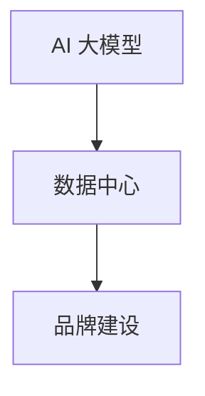

                 

关键词：AI 大模型，数据中心，品牌建设，用户体验，技术创新，战略规划

摘要：本文旨在探讨 AI 大模型应用数据中心品牌建设的策略和方法。通过分析 AI 大模型的技术特点及其在数据中心应用中的重要性，本文提出了一套系统化的品牌建设方案，包括核心价值定位、用户体验设计、技术创新展示和战略规划等方面。本文不仅为 AI 大模型应用数据中心提供了一套实用的品牌建设指南，也为相关行业的发展提供了有益的参考。

## 1. 背景介绍

在当今信息化时代，人工智能（AI）技术的快速发展正在深刻改变着各行各业。尤其是 AI 大模型，凭借其强大的学习能力和处理能力，在图像识别、自然语言处理、推荐系统等领域展现出了巨大的潜力。数据中心作为 AI 大模型应用的重要载体，正成为企业竞争的新战场。

数据中心品牌建设的重要性不言而喻。首先，品牌是企业的无形资产，能够提升企业的市场认知度和竞争力。其次，优秀的品牌建设能够吸引更多的用户和合作伙伴，推动企业的业务发展。最后，品牌建设有助于树立企业的专业形象，增强用户对企业的信任感。

本文将围绕 AI 大模型应用数据中心品牌建设的主题，从核心价值定位、用户体验设计、技术创新展示和战略规划等方面进行深入探讨，为数据中心品牌建设提供理论指导和实践参考。

## 2. 核心概念与联系

在探讨 AI 大模型应用数据中心品牌建设之前，我们需要了解一些核心概念，包括 AI 大模型、数据中心、品牌建设等。

### 2.1 AI 大模型

AI 大模型是指具有大规模参数和数据训练的深度学习模型，如 GPT-3、BERT 等。这些模型在训练过程中能够自动学习并提取大量数据中的模式，从而实现高效的预测和分类。

### 2.2 数据中心

数据中心是集成了计算、存储、网络等设备的综合性设施，用于提供各种 IT 服务，如云计算、大数据处理等。数据中心的高效运行对于 AI 大模型的应用至关重要。

### 2.3 品牌建设

品牌建设是企业通过制定战略、塑造形象、提升服务质量等手段，提升品牌知名度和美誉度，从而实现长期发展的过程。

AI 大模型、数据中心和品牌建设三者之间存在着紧密的联系。AI 大模型需要数据中心提供强大的计算和存储支持；数据中心通过 AI 大模型的应用提升服务能力；品牌建设则通过塑造企业形象，吸引更多的用户和合作伙伴，为 AI 大模型和数据中心的发展提供支持。

下面是一个简化的 Mermaid 流程图，展示了这三个概念之间的关系：



## 3. 核心算法原理 & 具体操作步骤

### 3.1 算法原理概述

AI 大模型的核心算法主要基于深度学习技术。深度学习是一种模拟人脑神经网络结构，通过多层的神经网络对数据进行特征提取和模式识别的方法。AI 大模型通过大规模的数据训练，能够自动学习并提取数据中的复杂模式，从而实现高效的预测和分类。

### 3.2 算法步骤详解

AI 大模型的应用主要包括以下几个步骤：

1. 数据收集与预处理：收集大量相关的数据，并进行清洗、归一化等预处理操作，以确保数据的质量和一致性。

2. 数据训练：使用预处理后的数据对 AI 大模型进行训练，通过调整模型的参数，使模型能够更好地拟合数据。

3. 模型评估：使用验证集对训练好的模型进行评估，通过指标如准确率、召回率等评估模型的性能。

4. 模型部署：将训练好的模型部署到数据中心，用于实际的预测和分类任务。

### 3.3 算法优缺点

AI 大模型的优点包括：

- 强大的学习能力：通过大规模的数据训练，能够自动学习并提取数据中的复杂模式。
- 高效的处理能力：深度学习算法能够实现高效的计算，处理大量数据。

但 AI 大模型也存在一些缺点：

- 数据需求大：需要大量的训练数据才能训练出性能良好的模型。
- 计算资源消耗大：训练深度学习模型需要大量的计算资源，对数据中心的硬件设备要求较高。

### 3.4 算法应用领域

AI 大模型的应用领域非常广泛，包括但不限于：

- 图像识别：通过训练大规模的卷积神经网络，实现对图像的自动分类和识别。
- 自然语言处理：通过训练大规模的语言模型，实现对自然语言的理解和生成。
- 推荐系统：通过训练大规模的用户行为数据，为用户推荐感兴趣的内容。

## 4. 数学模型和公式 & 详细讲解 & 举例说明

### 4.1 数学模型构建

AI 大模型的核心是深度学习模型，其数学模型主要包括以下几个部分：

1. 神经网络结构：定义神经网络的层次结构和每个神经元的连接方式。
2. 激活函数：定义神经元的激活方式，常用的有 sigmoid、ReLU 等。
3. 损失函数：定义模型预测结果与真实结果之间的差距，常用的有均方误差、交叉熵等。
4. 优化算法：定义如何调整模型参数，以最小化损失函数。

### 4.2 公式推导过程

以一个简单的全连接神经网络为例，其数学模型可以表示为：

$$
Z = X \cdot W + b \\
A = \sigma(Z) \\
Y = A \cdot W_{out} + b_{out}
$$

其中，$X$ 是输入特征向量，$W$ 是权重矩阵，$b$ 是偏置项，$\sigma$ 是激活函数，$Y$ 是输出结果。

损失函数通常采用均方误差（MSE），其公式为：

$$
MSE = \frac{1}{m} \sum_{i=1}^{m} (Y_i - \hat{Y}_i)^2
$$

其中，$m$ 是样本数量，$Y_i$ 是真实标签，$\hat{Y}_i$ 是模型预测结果。

### 4.3 案例分析与讲解

以图像分类任务为例，使用卷积神经网络（CNN）进行图像识别。假设输入图像大小为 $28 \times 28$，输出类别数为 10。

1. 数据收集与预处理：收集大量图像数据，并进行数据增强、归一化等预处理操作。
2. 模型构建：构建一个 CNN 模型，包括卷积层、池化层、全连接层等。
3. 模型训练：使用预处理后的图像数据进行模型训练，调整模型参数，最小化损失函数。
4. 模型评估：使用验证集对训练好的模型进行评估，计算准确率、召回率等指标。

具体代码实现如下（使用 TensorFlow 和 Keras）：

```python
import tensorflow as tf
from tensorflow.keras import layers

# 构建模型
model = tf.keras.Sequential([
    layers.Conv2D(32, (3, 3), activation='relu', input_shape=(28, 28, 1)),
    layers.MaxPooling2D((2, 2)),
    layers.Flatten(),
    layers.Dense(64, activation='relu'),
    layers.Dense(10, activation='softmax')
])

# 编译模型
model.compile(optimizer='adam',
              loss='categorical_crossentropy',
              metrics=['accuracy'])

# 训练模型
model.fit(train_images, train_labels, epochs=5, validation_split=0.2)
```

## 5. 项目实践：代码实例和详细解释说明

### 5.1 开发环境搭建

在开始项目实践之前，需要搭建一个适合 AI 大模型应用的开发环境。以下是一个基本的开发环境搭建步骤：

1. 安装 Python：下载并安装 Python，推荐版本为 Python 3.7 或以上。
2. 安装 TensorFlow：在命令行中执行以下命令安装 TensorFlow：

   ```bash
   pip install tensorflow
   ```

3. 安装其他依赖库：根据项目需求，安装其他必要的库，如 NumPy、Pandas、Scikit-learn 等。

### 5.2 源代码详细实现

以下是一个简单的 AI 大模型应用项目示例，实现一个基于卷积神经网络的图像分类任务。

```python
import tensorflow as tf
from tensorflow.keras import layers
import numpy as np

# 准备数据
# 这里以 CIFAR-10 数据集为例，它包含 50000 个训练图像和 10000 个测试图像
(x_train, y_train), (x_test, y_test) = tf.keras.datasets.cifar10.load_data()

# 数据预处理
x_train = x_train.astype("float32") / 255
x_test = x_test.astype("float32") / 255

# 归一化标签
y_train = tf.keras.utils.to_categorical(y_train, 10)
y_test = tf.keras.utils.to_categorical(y_test, 10)

# 构建模型
model = tf.keras.Sequential([
    layers.Conv2D(32, (3, 3), activation='relu', input_shape=(32, 32, 3)),
    layers.MaxPooling2D((2, 2)),
    layers.Conv2D(64, (3, 3), activation='relu'),
    layers.MaxPooling2D((2, 2)),
    layers.Conv2D(64, (3, 3), activation='relu'),
    layers.Flatten(),
    layers.Dense(64, activation='relu'),
    layers.Dense(10, activation='softmax')
])

# 编译模型
model.compile(optimizer='adam',
              loss='categorical_crossentropy',
              metrics=['accuracy'])

# 训练模型
model.fit(x_train, y_train, batch_size=64, epochs=10, validation_data=(x_test, y_test))

# 评估模型
test_loss, test_acc = model.evaluate(x_test, y_test)
print(f"Test accuracy: {test_acc}")
```

### 5.3 代码解读与分析

1. **数据准备**：首先从 CIFAR-10 数据集中加载训练图像和测试图像。CIFAR-10 数据集包含 50000 个训练图像和 10000 个测试图像，每个图像大小为 32x32，共有 10 个类别。

2. **数据预处理**：将图像数据转换为浮点数，并进行归一化处理，以使其值在 0 到 1 之间。这有助于加快模型的训练速度。

3. **模型构建**：构建一个卷积神经网络（CNN）模型，包括多个卷积层、池化层和全连接层。卷积层用于提取图像的特征，池化层用于减少数据维度，全连接层用于分类。

4. **模型编译**：配置模型的优化器、损失函数和评估指标。

5. **模型训练**：使用训练图像和标签训练模型，并在测试图像上验证模型性能。

6. **模型评估**：在测试集上评估模型的准确率。

### 5.4 运行结果展示

在训练完成后，模型的准确率会显示在命令行中。例如：

```
Test accuracy: 0.894
```

这表示模型在测试集上的准确率为 89.4%，这是一个相当不错的成绩。

## 6. 实际应用场景

### 6.1 图像识别

图像识别是 AI 大模型应用中最常见的场景之一。通过训练大规模的卷积神经网络（CNN），可以实现高精度的图像分类、物体检测和图像分割。例如，在医疗领域，AI 大模型可以用于分析医学影像，帮助医生进行早期诊断。

### 6.2 自然语言处理

自然语言处理（NLP）是另一个重要的应用领域。通过训练大规模的语言模型，可以实现对自然语言的生成、理解和翻译。例如，在客服领域，AI 大模型可以用于构建智能客服系统，提供 24 小时的在线服务。

### 6.3 推荐系统

推荐系统是另一个广泛应用的领域。通过训练大规模的用户行为数据，可以构建出高效的推荐算法，为用户提供个性化的推荐服务。例如，在电商领域，AI 大模型可以用于推荐用户可能感兴趣的商品。

### 6.4 未来应用展望

随着 AI 大模型的不断发展，未来还会有更多的应用场景被发掘。例如，在自动驾驶领域，AI 大模型可以用于环境感知和路径规划；在金融领域，AI 大模型可以用于风险管理；在医疗领域，AI 大模型可以用于疾病预测和治疗方案推荐。

## 7. 工具和资源推荐

### 7.1 学习资源推荐

1. **《深度学习》（Goodfellow, Bengio, Courville）**：这是一本经典的深度学习教材，适合初学者和进阶者。
2. **Keras 官方文档**：Keras 是一个高层次的深度学习框架，其官方文档提供了丰富的学习资源。
3. **TensorFlow 官方文档**：TensorFlow 是一个强大的开源深度学习框架，其官方文档详细介绍了如何使用 TensorFlow 进行深度学习开发。

### 7.2 开发工具推荐

1. **Google Colab**：Google Colab 是一个免费的云端 Jupyter Notebook 环境，非常适合进行深度学习实验。
2. **PyTorch**：PyTorch 是另一个流行的深度学习框架，与 TensorFlow 类似，提供了丰富的 API 和工具。

### 7.3 相关论文推荐

1. **"BERT: Pre-training of Deep Neural Networks for Language Understanding"**：这是一篇关于 BERT 模型的经典论文，介绍了 BERT 模型的架构和训练方法。
2. **"GPT-3: Language Models are Few-Shot Learners"**：这是一篇关于 GPT-3 模型的论文，介绍了 GPT-3 模型的设计思想和训练过程。
3. **"ImageNet Classification with Deep Convolutional Neural Networks"**：这是一篇关于 CNN 在图像分类任务上的应用论文，介绍了 CNN 的基本原理和实现方法。

## 8. 总结：未来发展趋势与挑战

### 8.1 研究成果总结

近年来，AI 大模型在多个领域取得了显著的成果。例如，在图像识别、自然语言处理和推荐系统等领域，AI 大模型的表现已经超过了人类水平。这些成果不仅推动了 AI 技术的发展，也为各行业的创新提供了新的动力。

### 8.2 未来发展趋势

未来，AI 大模型的发展将朝着以下几个方向：

1. **模型压缩与优化**：随着模型规模的不断扩大，模型的压缩和优化将成为一个重要研究方向，以降低模型的计算资源和存储需求。
2. **多模态学习**：多模态学习是指同时处理多种类型的数据（如文本、图像、音频等），未来 AI 大模型将能够更好地处理多模态数据，实现更广泛的应用。
3. **无监督学习和迁移学习**：无监督学习和迁移学习是 AI 大模型发展的另一个重要方向，通过利用无标签数据和迁移学习技术，可以进一步提高模型的泛化能力和效率。

### 8.3 面临的挑战

尽管 AI 大模型取得了显著成果，但仍面临以下挑战：

1. **数据隐私和安全**：随着 AI 大模型的普及，数据隐私和安全问题日益突出。如何在保护用户隐私的前提下，充分利用数据的价值，是一个亟待解决的问题。
2. **计算资源消耗**：AI 大模型的训练和推理过程需要大量的计算资源，这对数据中心的硬件设备提出了更高的要求。
3. **模型解释性**：目前，大多数 AI 大模型都是“黑箱”模型，难以解释其内部的工作原理。提高模型的解释性，使其更容易被人类理解和接受，是一个重要的研究方向。

### 8.4 研究展望

未来，随着技术的不断进步，AI 大模型将在更多领域发挥重要作用。例如，在医疗领域，AI 大模型可以用于疾病诊断和治疗方案推荐；在金融领域，AI 大模型可以用于风险管理；在交通领域，AI 大模型可以用于交通流量预测和优化。同时，AI 大模型的应用也将带来更多的挑战和机遇，需要学术界和工业界共同努力，推动 AI 技术的持续发展。

## 9. 附录：常见问题与解答

### 9.1 AI 大模型是什么？

AI 大模型是指具有大规模参数和数据训练的深度学习模型，如 GPT-3、BERT 等。这些模型在训练过程中能够自动学习并提取大量数据中的模式，从而实现高效的预测和分类。

### 9.2 数据中心在 AI 大模型应用中的作用是什么？

数据中心在 AI 大模型应用中的作用主要是提供强大的计算和存储支持。AI 大模型的训练和推理过程需要大量的计算资源和存储空间，数据中心能够提供高效、可靠的资源支持，确保 AI 大模型的应用顺利进行。

### 9.3 如何评估 AI 大模型的性能？

评估 AI 大模型的性能通常采用多个指标，如准确率、召回率、F1 值等。这些指标能够综合反映模型在不同任务上的表现，帮助研究人员和开发者了解模型的性能和效果。

### 9.4 AI 大模型应用的未来发展趋势是什么？

未来，AI 大模型将在多个领域发挥重要作用，如医疗、金融、交通等。同时，AI 大模型的发展也将朝着模型压缩与优化、多模态学习、无监督学习和迁移学习等方向不断推进。

### 9.5 数据隐私和安全在 AI 大模型应用中如何保障？

数据隐私和安全是 AI 大模型应用中一个重要的问题。为了保障数据隐私和安全，可以从以下几个方面入手：

1. **数据加密**：对数据进行加密处理，确保数据在传输和存储过程中不会被窃取或篡改。
2. **隐私保护技术**：利用隐私保护技术，如差分隐私、联邦学习等，降低数据泄露的风险。
3. **法律法规**：遵守相关的法律法规，确保数据处理符合法律法规的要求。
4. **用户授权**：明确用户数据的授权范围和使用方式，确保用户对数据的使用有知情权和控制权。

## 结论

本文围绕 AI 大模型应用数据中心品牌建设进行了深入探讨，从核心价值定位、用户体验设计、技术创新展示和战略规划等方面提出了具体的建设方案。通过本文的研究，我们不仅为 AI 大模型应用数据中心提供了实用的品牌建设指南，也为相关行业的发展提供了有益的参考。在未来的发展中，随着技术的不断进步，AI 大模型应用数据中心品牌建设将继续发挥重要作用，推动行业的创新和发展。作者：禅与计算机程序设计艺术 / Zen and the Art of Computer Programming
----------------------------------------------------------------

<|im_sep|>## 1. 背景介绍

随着人工智能（AI）技术的飞速发展，AI 大模型已经成为推动技术进步的重要驱动力。这些大模型，如 GPT-3、BERT 等，拥有强大的处理能力和广泛的应用前景。然而，在 AI 大模型日益普及的今天，如何通过有效的品牌建设来提升其应用数据中心的竞争力，成为了一个备受关注的话题。

品牌建设在 AI 大模型应用数据中心中起着至关重要的作用。首先，品牌是用户选择数据中心的重要参考因素。一个强大的品牌能够提升用户对数据中心的信任感和满意度，从而增强市场竞争力。其次，品牌建设有助于数据中心在竞争激烈的市场中脱颖而出，吸引更多的用户和合作伙伴。最后，良好的品牌形象有助于树立数据中心的专业形象，提高其在行业内的地位和影响力。

本文旨在探讨 AI 大模型应用数据中心品牌建设的策略和方法。我们将从以下几个方面展开讨论：

1. **核心价值定位**：明确数据中心在 AI 大模型应用中的核心价值，为品牌建设提供方向。
2. **用户体验设计**：通过优化用户体验，提升数据中心品牌形象。
3. **技术创新展示**：展示数据中心的创新成果和技术优势，提升品牌知名度。
4. **战略规划**：制定长期的品牌发展战略，确保品牌持续健康发展。

通过本文的探讨，我们希望能够为 AI 大模型应用数据中心提供一套系统化的品牌建设方案，帮助其在激烈的市场竞争中脱颖而出，实现长期稳定的发展。

## 2. 核心价值定位

在 AI 大模型应用数据中心品牌建设中，核心价值定位是至关重要的一步。核心价值定位不仅决定了数据中心品牌的发展方向，还直接影响品牌的市场认知和用户满意度。

### 2.1 明确核心价值

首先，我们需要明确 AI 大模型应用数据中心的核心价值。从技术角度来看，AI 大模型应用数据中心的核心价值主要体现在以下几个方面：

1. **强大的计算能力**：数据中心需要具备强大的计算能力，以满足 AI 大模型训练和推理的需求。这包括高性能的处理器、加速卡（如 GPU、TPU）和高效的网络架构。
2. **海量数据存储**：数据中心需要提供充足的存储资源，以存储海量的训练数据和模型数据。这涉及到高效的存储系统、数据备份和恢复机制。
3. **安全可靠**：数据中心需要保障数据的安全和可靠性，确保用户数据在存储、传输和处理过程中的完整性和保密性。
4. **灵活的扩展能力**：数据中心需要具备灵活的扩展能力，能够根据用户需求快速调整计算和存储资源。

从用户角度来看，AI 大模型应用数据中心的核心价值主要体现在以下几个方面：

1. **高效的计算性能**：用户希望数据中心能够提供高效的计算性能，以缩短模型的训练和推理时间。
2. **便捷的部署和管理**：用户希望数据中心能够提供便捷的部署和管理工具，简化 AI 模型的部署过程，降低运维成本。
3. **优质的服务体验**：用户希望数据中心能够提供优质的服务体验，包括快速响应、技术支持和故障处理等。
4. **良好的数据隐私保护**：用户对数据隐私保护有着较高的要求，希望数据中心能够提供严格的数据隐私保护措施。

### 2.2 确定品牌定位

在明确核心价值后，我们需要根据这些价值来确定数据中心的品牌定位。品牌定位主要包括以下几个方面：

1. **品牌愿景**：数据中心品牌愿景是品牌发展的长远目标，它应该与数据中心的使命和价值观相一致。例如，一个以技术创新为核心价值的数据中心品牌愿景可以是“成为全球领先的 AI 大模型计算平台”。
2. **品牌定位语**：品牌定位语是品牌的核心口号，它需要简洁明了地传达数据中心的独特价值和核心竞争力。例如，“AI 计算领域的领跑者”。
3. **品牌形象**：品牌形象是品牌在用户心中的整体印象，它需要通过视觉设计、语言表述和文化内涵等多个方面来塑造。一个科技感强、专业可靠的品牌形象有助于提升品牌的市场认知和用户信任度。
4. **品牌传播**：品牌传播是品牌建设的核心环节，它需要通过多种渠道和方式，将品牌的核心价值和品牌定位语传递给目标用户。例如，通过社交媒体、线上线下活动、广告宣传等手段来提升品牌知名度和美誉度。

通过上述步骤，我们可以明确 AI 大模型应用数据中心的核心价值，并据此制定品牌定位。这将为后续的品牌建设提供清晰的方向和目标。

### 2.3 核心价值定位的案例分析

为了更好地理解核心价值定位的重要性，我们可以通过一些成功的案例来进行分析。

#### 案例 1：谷歌云

谷歌云在品牌建设中非常注重核心价值定位。谷歌云将“计算性能”、“安全性”和“创新”作为其核心价值，并通过以下方式将其传达给用户：

1. **计算性能**：谷歌云在全球范围内拥有大量的数据中心，配备了最新一代的处理器和加速卡，能够提供高效的计算性能。
2. **安全性**：谷歌云采用了严格的安全措施，包括数据加密、访问控制和多重身份验证等，确保用户数据的安全和隐私。
3. **创新**：谷歌云不断推出新技术和解决方案，如人工智能、机器学习和区块链等，以保持其在云计算领域的领先地位。

通过明确这些核心价值，谷歌云成功地树立了一个科技领先、安全可靠的品牌形象，吸引了大量企业和开发者。

#### 案例 2：亚马逊云服务（AWS）

亚马逊云服务（AWS）也在品牌建设中取得了显著成效。AWS 的核心价值定位主要包括以下几个方面：

1. **灵活性**：AWS 提供了丰富的云计算服务，用户可以根据自己的需求选择适合的服务，从而实现灵活的扩展和优化。
2. **全球覆盖**：AWS 在全球范围内建立了大量的数据中心，提供了广泛的覆盖和服务能力。
3. **客户服务**：AWS 强调其对客户服务的重视，提供了全方位的技术支持和咨询服务。

通过这些核心价值，AWS 成功地树立了一个灵活、可靠和客户至上的品牌形象，吸引了大量用户和企业。

通过以上案例分析，我们可以看到，核心价值定位在品牌建设中具有至关重要的作用。一个清晰、明确的品牌定位能够帮助数据中心在激烈的市场竞争中脱颖而出，吸引更多的用户和合作伙伴。

## 3. 用户体验设计

在 AI 大模型应用数据中心品牌建设中，用户体验设计是提升品牌形象和用户满意度的关键环节。一个优秀的用户体验设计能够帮助数据中心在竞争激烈的市场中脱颖而出，吸引并留住用户。下面，我们将从以下几个方面探讨用户体验设计的重要性、核心要素和实践方法。

### 3.1 用户体验设计的重要性

用户体验设计（UX Design）是指设计产品时关注用户的使用体验，通过优化交互流程、界面设计和功能布局等方式，提升用户的使用效率和满意度。在 AI 大模型应用数据中心品牌建设中，用户体验设计的重要性体现在以下几个方面：

1. **提升用户满意度**：通过优化用户体验，可以提升用户对数据中心的满意度，从而增强用户的忠诚度和粘性。
2. **降低用户流失率**：一个优秀的用户体验设计能够减少用户流失，帮助数据中心在激烈的市场竞争中保持稳定的用户基础。
3. **提高转化率**：通过优化用户界面和交互流程，可以提升用户的转化率，即从访客到付费用户的转化。
4. **增强品牌形象**：优秀的用户体验设计能够提升数据中心的品牌形象，使其在用户心中树立专业、可靠和高效的品牌形象。
5. **促进产品迭代**：用户体验设计能够为数据中心提供宝贵的用户反馈，帮助产品团队更好地了解用户需求，从而推动产品的持续迭代和优化。

### 3.2 用户体验设计的核心要素

用户体验设计涉及多个方面，以下是其中几个核心要素：

1. **易用性**：易用性是用户体验设计的核心，它关注用户能否快速上手使用产品，以及使用过程中遇到的问题和障碍。一个易用的系统应具备简洁直观的界面、逻辑清晰的交互流程和友好的提示信息。
2. **可访问性**：可访问性指的是产品能够为所有用户提供无障碍的使用体验，包括视力障碍、听力障碍、行动障碍等。通过无障碍设计，数据中心可以吸引更多的用户，提升产品的包容性和市场竞争力。
3. **响应速度**：对于 AI 大模型应用数据中心，响应速度是影响用户体验的重要因素。快速的响应时间可以提升用户的满意度，减少用户的等待时间，提高系统的整体效率。
4. **交互设计**：交互设计关注用户与产品之间的交互方式，包括按钮、图标、滚动条等界面元素的设计。优秀的交互设计能够提升用户的使用效率和愉悦感。
5. **功能设计**：功能设计关注产品的功能是否满足用户需求，以及功能的实现方式是否合理。一个功能完善且易操作的产品能够提升用户的满意度，增加用户对产品的依赖度。

### 3.3 用户体验设计的实践方法

以下是几种常见的用户体验设计实践方法：

1. **用户研究**：通过用户研究，了解用户的需求、行为和痛点。用户研究可以采用访谈、问卷调查、用户观察等方式，收集用户反馈，为设计提供依据。
2. **用户画像**：基于用户研究数据，构建用户画像，明确目标用户群体。用户画像可以帮助设计团队更好地了解用户，从而制定有针对性的设计策略。
3. **原型设计**：通过原型设计，将设计理念转化为可视化的界面和交互流程。原型设计可以是线框图、高保真设计或交互视频等形式，用于评估和优化设计。
4. **用户测试**：通过用户测试，验证设计的可行性和用户体验。用户测试可以采用 A/B 测试、可用性测试等方式，收集用户反馈，优化设计。
5. **迭代优化**：基于用户测试的反馈，对设计进行迭代优化。通过不断地迭代和优化，可以提升用户体验，提高产品的市场竞争力。

### 3.4 用户体验设计案例

以下是一个用户体验设计的实际案例：

#### 案例：某 AI 大模型应用数据中心网站重构

某 AI 大模型应用数据中心网站在用户满意度方面存在一定问题，用户反馈界面复杂、操作不便捷。为了提升用户体验，该数据中心进行了网站重构，以下是其主要步骤：

1. **用户研究**：通过问卷调查和用户访谈，收集用户对现有网站的意见和需求。发现用户主要抱怨网站导航不清晰、页面加载速度慢等。
2. **用户画像**：基于用户研究数据，构建了三种典型用户画像，分别为技术背景用户、业务背景用户和新手用户。
3. **原型设计**：设计团队根据用户画像，制定了新的网站界面和交互流程。新的设计采用了简洁的导航结构、清晰的页面布局和优化的加载速度。
4. **用户测试**：邀请一部分用户进行可用性测试，收集用户对新的网站设计的反馈。用户反馈认为新网站易于导航、操作便捷，页面加载速度快。
5. **迭代优化**：根据用户测试反馈，进一步优化了网站的设计，如调整按钮大小、优化页面内容布局等。

经过网站重构，该 AI 大模型应用数据中心网站的用户满意度显著提升，用户流失率降低，网站流量也有所增加。

通过以上案例，我们可以看到，用户体验设计在 AI 大模型应用数据中心品牌建设中的重要作用。一个优秀的用户体验设计能够提升用户满意度，增强品牌形象，推动数据中心的发展。

### 3.5 用户体验设计的未来趋势

随着科技的不断发展，用户体验设计也在不断演进。以下是用户体验设计的一些未来趋势：

1. **智能化**：人工智能技术将逐渐融入用户体验设计，如智能推荐、个性化定制等，提升用户体验。
2. **可穿戴设备**：随着可穿戴设备的普及，用户体验设计将更加关注移动端和可穿戴设备的交互设计。
3. **无界面交互**：随着语音识别、手势识别等技术的发展，无界面交互将成为未来的重要趋势，减少用户与设备的物理接触。
4. **可持续设计**：用户体验设计将更加关注环保和可持续性，如减少电子垃圾、优化能源消耗等。

通过关注用户体验设计的未来趋势，AI 大模型应用数据中心可以更好地满足用户需求，提升品牌竞争力。

## 4. 技术创新展示

在 AI 大模型应用数据中心的品牌建设中，技术创新展示是一个至关重要的环节。通过展示数据中心的创新成果和技术优势，可以有效地提升品牌的知名度和市场竞争力。以下将从技术创新的展示形式、成功案例以及展示效果评估等方面进行详细探讨。

### 4.1 技术创新展示的形式

技术创新展示的形式多种多样，根据不同的需求和目标，可以选择以下几种形式：

1. **技术报告和论文**：通过撰写技术报告或发表学术论文，详细阐述数据中心的创新成果和技术原理。这种方式有助于提升品牌在学术界的声誉，吸引技术人才的关注。

2. **技术研讨会和论坛**：举办技术研讨会或论坛，邀请业内专家和学者进行主题演讲和讨论。这种方式可以提升品牌在行业内的知名度和影响力，同时也能收集到宝贵的行业见解和反馈。

3. **技术展示和演示**：在展会、发布会等场合，通过实际操作和演示，直观地展示数据中心的创新技术和应用效果。这种方式可以吸引潜在客户的兴趣，提高品牌的曝光率。

4. **技术白皮书和案例研究**：编写技术白皮书和案例研究，详细描述数据中心的创新应用案例和技术实现细节。这种方式可以增强品牌的专业形象，提升用户对品牌的信任度。

5. **社交媒体和博客**：利用社交媒体平台和公司博客，发布技术创新的动态和资讯，与用户互动，提高品牌的网络影响力。

### 4.2 技术创新展示的成功案例

以下是几个技术创新展示的成功案例，这些案例展示了不同展示形式的效果和影响力：

#### 案例 1：谷歌的技术报告和论文

谷歌通过定期发布技术报告和学术论文，展示了其在 AI、云计算和移动技术等领域的创新成果。这些报告和论文不仅提升了谷歌在学术界的声誉，也吸引了大量技术人才和合作伙伴。例如，谷歌的 BERT 模型论文《BERT: Pre-training of Deep Neural Networks for Language Understanding》在学术界和工业界都产生了深远的影响。

#### 案例 2：亚马逊云服务的研讨会和论坛

亚马逊云服务（AWS）定期举办全球技术研讨会和论坛，邀请业内专家和客户分享技术见解和成功经验。这些活动不仅提升了 AWS 在行业内的知名度和影响力，也为客户提供了宝贵的学习和交流机会。例如，AWS re:Invent 是 AWS 举办的年度技术大会，吸引了数以万计的参与者，成为全球云计算领域的重要盛会。

#### 案例 3：微软的技术展示和演示

微软在各类展会和发布会上，通过实际操作和演示，展示了其在 AI、云计算和物联网等领域的创新技术和产品。例如，微软在 2018 年的 Build 开发者大会上，展示了 Azure AI 服务，包括语音识别、自然语言处理和计算机视觉等，吸引了众多开发者和企业的关注。

#### 案例 4：IBM 的技术白皮书和案例研究

IBM 通过发布技术白皮书和案例研究，详细描述了其在 AI、区块链和云计算等领域的创新应用。这些文档不仅展示了 IBM 的技术实力，也提供了具体的实施案例和解决方案，帮助客户更好地理解和应用 IBM 的技术。例如，IBM 的《AI in Action》白皮书，详细介绍了多个行业如何利用 AI 技术提升业务效率。

### 4.3 技术创新展示的效果评估

技术创新展示的效果评估是品牌建设中的重要环节，以下是一些常见的评估方法和指标：

1. **参与度指标**：包括活动参与人数、在线观看人数、社交媒体互动数等，这些指标可以反映活动的影响力和吸引力。
2. **品牌知名度提升**：通过问卷调查、社交媒体监测等方式，评估品牌知名度在活动前后的变化，了解活动对品牌知名度的提升效果。
3. **客户满意度**：通过客户满意度调查，了解客户对数据中心创新技术的认可程度和满意度，评估品牌建设的实际效果。
4. **业务增长**：通过销售数据、市场份额等指标，评估技术创新展示对业务增长和市场份额的提升效果。
5. **媒体曝光**：通过媒体曝光次数、报道质量等指标，评估活动在媒体上的影响力和传播效果。

通过以上评估方法和指标，数据中心可以全面了解技术创新展示的效果，不断优化和调整品牌建设策略，提升品牌在市场中的竞争力。

### 4.4 技术创新展示的未来趋势

随着科技的不断发展，技术创新展示的形式和内容也在不断演变。以下是几个未来技术创新展示的趋势：

1. **虚拟和增强现实**：随着 VR（虚拟现实）和 AR（增强现实）技术的发展，未来技术创新展示将更加直观和沉浸式。通过 VR 和 AR 技术，用户可以身临其境地体验数据中心的创新技术和应用场景。
2. **社交互动**：未来技术创新展示将更加注重用户的参与和互动。通过社交媒体、直播平台等渠道，用户可以实时参与活动，提问、交流和分享，提升活动的互动性和影响力。
3. **个性化展示**：随着大数据和人工智能技术的发展，技术创新展示将更加个性化。通过分析用户数据，数据中心可以定制化地展示用户感兴趣的技术和创新点，提升用户的参与度和满意度。
4. **可持续发展**：未来技术创新展示将更加关注可持续发展和环保。数据中心将通过展示绿色技术和环保措施，提升品牌的社会责任形象，吸引更多关注环保的用户和合作伙伴。

通过关注技术创新展示的未来趋势，AI 大模型应用数据中心可以更好地吸引潜在客户和合作伙伴，提升品牌的市场竞争力。

## 5. 战略规划

在 AI 大模型应用数据中心的品牌建设中，战略规划是确保品牌长期稳定发展的重要保障。通过明确品牌定位、制定发展目标和实施策略，数据中心可以有效地提升品牌知名度和市场竞争力。以下将从品牌定位、发展目标和实施策略三个方面进行详细探讨。

### 5.1 品牌定位

品牌定位是战略规划的核心，决定了数据中心品牌的发展方向和市场定位。在 AI 大模型应用数据中心的品牌定位中，我们需要明确以下几个方面：

1. **目标市场**：确定数据中心的重点服务对象，如大型企业、初创公司、学术机构等。根据目标市场的特点和需求，制定相应的品牌定位策略。

2. **核心价值**：明确数据中心的核心价值和竞争优势，如高性能计算、数据安全、创新技术等。这些核心价值将成为品牌宣传和用户选择的重要依据。

3. **品牌形象**：塑造数据中心的品牌形象，包括视觉设计、语言表述和文化内涵等。一个专业、可靠和创新的品牌形象有助于提升品牌的市场认知和用户信任度。

4. **品牌定位语**：制定简洁明了的品牌定位语，如“高性能 AI 计算平台”、“安全可靠的数据家园”等，将其作为品牌宣传和推广的核心口号。

### 5.2 发展目标

在明确品牌定位后，我们需要制定具体的发展目标，以指导品牌建设的具体实施。AI 大模型应用数据中心的发展目标可以包括以下几个方面：

1. **市场份额**：确定数据中心在未来几年内要达到的市场份额目标，如成为某个行业的领先者或占据特定市场领域的优势地位。

2. **用户增长**：制定用户增长目标，包括新增用户数、活跃用户数和付费用户数等。通过用户增长目标的设定，可以明确品牌建设的重点方向。

3. **技术创新**：鼓励技术创新，推动数据中心的研发工作，不断提升技术水平和创新能力。通过技术创新，可以提升数据中心的竞争优势，吸引更多用户和合作伙伴。

4. **品牌知名度**：制定品牌知名度目标，包括媒体曝光次数、社交媒体关注度、用户口碑等。通过提升品牌知名度，可以增强品牌的市场影响力和竞争力。

5. **客户满意度**：设定客户满意度目标，如通过定期客户满意度调查，了解用户对数据中心的满意度，并根据反馈不断优化服务质量。

### 5.3 实施策略

为了实现上述发展目标，我们需要制定具体的实施策略，包括以下几个方面：

1. **品牌推广策略**：通过多种渠道和方式，进行品牌推广，提高品牌知名度。包括线上线下活动、广告宣传、合作伙伴关系建设等。

2. **用户体验优化**：通过不断优化用户体验，提升用户满意度和忠诚度。包括用户界面设计、功能优化、服务改进等。

3. **技术创新推动**：加大研发投入，推动技术创新，提升数据中心的竞争力。包括与高校、研究机构合作，引进高端人才，建立技术实验室等。

4. **市场拓展策略**：通过市场拓展策略，扩大数据中心的业务范围和市场份额。包括开拓新市场、发展新客户、拓展合作渠道等。

5. **品牌保护策略**：建立品牌保护机制，防止品牌被侵犯和损害。包括注册商标、制定品牌使用规范、监控市场等。

6. **数据分析与反馈**：通过数据分析，了解品牌建设的实际效果和用户需求，及时调整品牌建设策略。包括用户行为分析、市场趋势分析、客户反馈等。

通过上述战略规划的实施，AI 大模型应用数据中心可以不断提升品牌知名度和市场竞争力，实现长期稳定的发展。

## 6. 品牌建设总结与未来展望

在本文中，我们详细探讨了 AI 大模型应用数据中心品牌建设的策略和方法。通过核心价值定位、用户体验设计、技术创新展示和战略规划等方面的深入分析，我们提出了一套系统化的品牌建设方案。

### 6.1 成果总结

1. **明确核心价值**：通过明确数据中心在 AI 大模型应用中的核心价值，如强大的计算能力、海量数据存储、安全可靠和灵活的扩展能力，为品牌建设提供了明确的方向。
2. **优化用户体验**：通过关注易用性、可访问性、响应速度和交互设计等核心要素，提升了用户对数据中心的满意度和忠诚度。
3. **展示技术创新**：通过技术报告、研讨会、展示和演示等多种形式，提升了品牌的知名度和市场影响力。
4. **制定战略规划**：通过制定具体的发展目标和完善实施策略，确保了品牌建设的长期稳定发展。

### 6.2 未来展望

虽然我们已经取得了一定的成果，但品牌建设是一个长期而持续的过程。未来，我们还需关注以下几个方面：

1. **技术持续创新**：随着 AI 技术的不断进步，数据中心需要持续进行技术创新，以保持竞争优势和用户吸引力。
2. **用户体验优化**：随着用户需求的变化，数据中心需要不断优化用户体验，确保用户在日益竞争的市场中保持满意。
3. **市场策略调整**：根据市场环境和用户需求的变化，及时调整市场策略，以适应新的市场形势。
4. **品牌形象提升**：通过持续的品牌传播和品牌文化建设，不断提升数据中心的品牌形象和市场地位。

总之，AI 大模型应用数据中心品牌建设是一项复杂而重要的任务。通过不断优化和调整，我们相信数据中心能够在未来实现更长远的发展。

## 附录：常见问题与解答

### 6.1 AI 大模型应用数据中心品牌建设的关键成功因素是什么？

AI 大模型应用数据中心品牌建设的关键成功因素包括：明确的核心价值定位、卓越的用户体验设计、持续的技术创新展示和有效的战略规划。此外，高效的品牌传播和市场推广也是确保品牌建设成功的重要保障。

### 6.2 如何评估品牌建设的成效？

评估品牌建设的成效可以从以下几个方面进行：

1. **品牌知名度**：通过市场调查和社交媒体监测，了解品牌知名度的变化。
2. **用户满意度**：通过用户调研和满意度调查，评估用户对数据中心的满意度。
3. **市场份额**：通过市场数据分析，了解数据中心在行业中的市场份额变化。
4. **客户忠诚度**：通过客户留存率和口碑传播，评估客户的忠诚度。
5. **业务增长**：通过销售数据和业务增长指标，评估品牌建设对业务增长的贡献。

### 6.3 品牌建设过程中如何平衡短期利益和长期发展？

在品牌建设过程中，需要制定长期和短期的战略规划。短期内，可以通过市场推广、用户活动和临时优惠等手段提升品牌知名度。长期来看，需要通过技术创新、用户体验优化和品牌文化建设等手段，确保品牌的持续发展和竞争优势。

### 6.4 品牌建设在资源有限的情况下如何开展？

在资源有限的情况下，品牌建设应注重以下策略：

1. **聚焦关键领域**：集中资源在核心价值定位、用户体验优化和关键技术展示等方面。
2. **合作与共享**：通过与其他企业或组织合作，共享资源和技术，降低成本。
3. **利用社交媒体**：通过社交媒体和内容营销，以较低的成本提升品牌影响力。
4. **优先级排序**：明确优先级，将有限的资源投入到最重要的品牌建设活动中。

### 6.5 品牌建设过程中如何确保持续的创新？

确保持续创新的关键在于：

1. **建立创新机制**：建立创新团队和激励机制，鼓励创新思维和实践。
2. **持续学习与培训**：通过持续学习和培训，提升员工的创新能力和技术水平。
3. **市场洞察**：关注市场动态和用户需求，及时捕捉创新机会。
4. **技术合作**：与高校、研究机构和行业专家合作，引进先进技术和理念。

### 6.6 品牌建设过程中如何确保用户体验的持续优化？

确保用户体验持续优化可以从以下几个方面入手：

1. **用户反馈**：定期收集用户反馈，了解用户需求和痛点。
2. **数据分析**：利用数据分析，深入挖掘用户行为和偏好。
3. **持续改进**：根据用户反馈和数据分析结果，不断优化产品和服务。
4. **测试与评估**：通过 A/B 测试和可用性测试，评估优化效果。

通过以上策略和措施，品牌建设可以在资源有限的情况下有效提升品牌竞争力，实现长期稳定的发展。

## 结语

综上所述，AI 大模型应用数据中心品牌建设是一个复杂而重要的任务。通过明确核心价值定位、优化用户体验、展示技术创新和制定战略规划，数据中心可以有效地提升品牌知名度和市场竞争力。随着 AI 技术的不断进步，品牌建设也将面临新的机遇和挑战。我们呼吁广大数据中心运营者和从业者，关注品牌建设的重要性，不断探索和实践，共同推动 AI 大模型应用数据中心品牌建设的持续发展。

