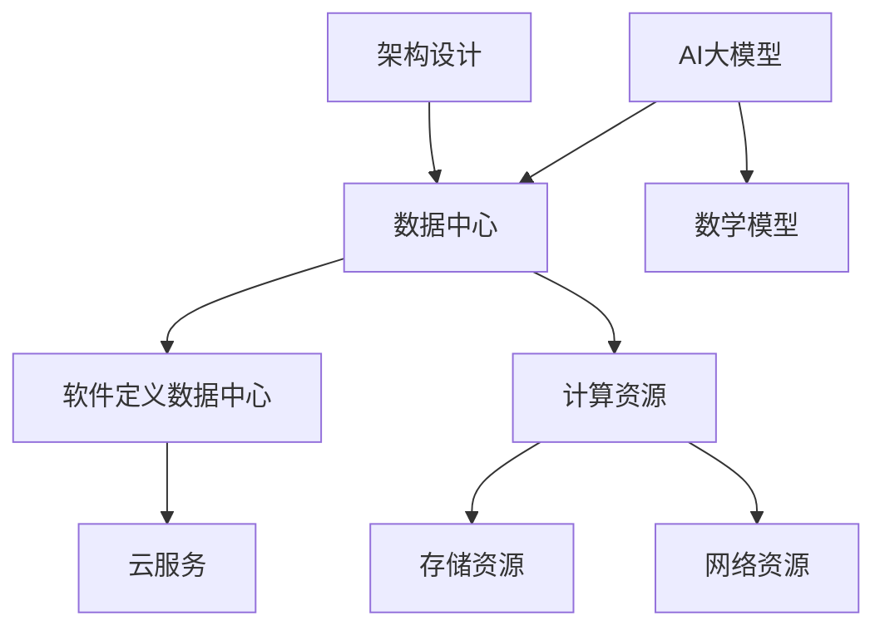

                 

### 1. 背景介绍

随着人工智能技术的飞速发展，大模型（如GPT-3、BERT、ViT等）的应用日益广泛，AI大模型逐渐成为企业提高生产效率和创新能力的重要工具。这些大模型通常需要大量的计算资源和数据支持，因此，数据中心成为了承载这些应用的重要基础设施。

近年来，数据中心的发展经历了从硬件设备到软件架构，再到服务模式的演变。最初，数据中心主要依赖于硬件设备的升级和扩展来满足日益增长的计算需求。然而，随着AI大模型的兴起，单纯依靠硬件升级已经无法满足需求，数据中心的建设和运营模式也随之发生了变革。

首先，数据中心的建设开始向软件定义的方向发展。通过虚拟化技术、容器化和自动化管理，数据中心可以实现资源的动态分配和管理，提高资源利用率和灵活性。此外，分布式存储和计算技术的应用，使得数据中心能够更好地支持大规模数据的处理和存储。

其次，数据中心的服务模式也逐渐向云服务转型。企业不再需要自建数据中心，而是可以通过云服务提供商获取所需的计算资源和服务。这种模式不仅降低了企业的运营成本，还提高了数据中心的弹性和可扩展性。

然而，AI大模型的应用也带来了新的挑战。首先，大模型的训练和推理需要大量的计算资源和存储空间。这要求数据中心必须具备强大的硬件设施和高效的数据传输网络。其次，大模型的训练和推理过程中会产生大量的数据，如何确保数据的安全性和隐私性成为了一个重要问题。

因此，本文将探讨AI大模型应用数据中心的商业模式，分析其核心概念和原理，并介绍相关技术实践和资源推荐。希望通过本文的阐述，能够为企业和数据中心运营者提供一些有价值的参考和启示。

### 2. 核心概念与联系

在深入探讨AI大模型应用数据中心的商业模式之前，我们需要明确一些核心概念，并了解这些概念之间的联系。

#### 2.1 AI大模型

AI大模型是指那些具有海量参数、能够在大量数据上训练并实现高精度预测的深度学习模型。常见的AI大模型包括GPT-3、BERT、ViT等。这些模型通常需要通过大规模数据集进行训练，以达到较高的准确性和泛化能力。

#### 2.2 数据中心

数据中心是指用于存储、处理和管理数据的物理或虚拟设施。它通常包括服务器、存储设备、网络设备等硬件，以及操作系统、数据库、虚拟化软件等软件。数据中心为各种应用提供了强大的计算和存储资源，是企业进行数据分析和AI应用的重要基础设施。

#### 2.3 软件定义数据中心（SDDC）

软件定义数据中心是一种通过虚拟化技术、容器化和自动化管理来动态分配和管理数据中心的计算资源、存储资源和网络资源的方法。SDDC使得数据中心能够实现资源的灵活调度和高效利用，提高了资源利用率和运维效率。

#### 2.4 云服务

云服务是指通过互联网提供计算资源、存储资源、网络资源等基础设施服务。云服务包括IaaS、PaaS、SaaS等多种类型，企业可以根据自身需求选择合适的服务模式。云服务的优势在于降低企业运营成本、提高资源弹性，以及提供高效、可靠的服务。

#### 2.5 数学模型

在AI大模型的应用过程中，数学模型起着至关重要的作用。常见的数学模型包括神经网络模型、支持向量机、决策树等。这些模型通过学习数据中的特征和规律，实现数据的分类、预测和聚类等任务。

#### 2.6 架构设计

数据中心架构设计是确保数据中心高效运行的关键。常见的架构设计包括分层架构、分布式架构、容器化架构等。合理的架构设计可以提升数据中心的性能、可靠性和可扩展性。

#### 2.7 联系

AI大模型、数据中心、SDDC、云服务和数学模型等概念之间存在紧密的联系。AI大模型需要依靠数据中心提供的计算资源和存储资源进行训练和推理，而数据中心则需要通过SDDC和云服务来实现高效管理和运营。数学模型则为AI大模型提供了理论基础和算法支持，而架构设计则确保了数据中心的高效运行。

下面我们使用Mermaid流程图来展示这些核心概念之间的联系：



通过上述核心概念和联系的阐述，我们可以更好地理解AI大模型应用数据中心的商业模式，为后续内容的展开奠定基础。

### 3. 核心算法原理 & 具体操作步骤

在了解了AI大模型、数据中心等相关概念后，我们需要深入探讨大模型在数据中心中的核心算法原理，以及如何在实际操作中应用这些算法。

#### 3.1 大模型训练算法

AI大模型的训练通常基于深度学习技术，其中最常用的算法是反向传播（Backpropagation）算法。反向传播算法是一种基于梯度下降法的优化算法，用于训练神经网络的参数。

具体操作步骤如下：

1. **初始化参数**：首先，我们需要初始化神经网络的权重和偏置。常用的初始化方法包括零初始化、高斯初始化和均匀初始化。

2. **前向传播**：在前向传播过程中，输入数据通过神经网络的各个层，逐层计算输出结果。每一层的输出都会传递给下一层，直到最终得到模型的预测结果。

3. **计算损失**：通过比较模型预测结果和真实标签，我们可以计算损失函数的值。常用的损失函数包括均方误差（MSE）、交叉熵（Cross-Entropy）等。

4. **反向传播**：在反向传播过程中，我们将损失函数关于模型参数的梯度反向传播到网络的每一层。这样可以更新模型的参数，使得模型在下一轮训练中能够更好地拟合数据。

5. **优化参数**：使用梯度下降法或其他优化算法（如Adam、RMSprop等）更新模型的参数，减小损失函数的值。

6. **迭代训练**：重复执行步骤2-5，直到满足训练停止条件（如达到预设的训练轮数或损失函数值小于某个阈值）。

#### 3.2 大模型推理算法

在训练完成后，大模型可以用于推理（Inference），即对新数据进行预测。推理过程相对简单，主要步骤如下：

1. **前向传播**：将待预测数据输入到模型中，通过网络的各个层进行计算，得到模型的预测结果。

2. **结果处理**：对模型的输出结果进行后处理，如类别转换、阈值处理等，得到最终的预测结果。

3. **评估性能**：通过比较模型预测结果和真实标签，评估模型的性能。常用的评估指标包括准确率（Accuracy）、召回率（Recall）、F1分数（F1 Score）等。

#### 3.3 大模型训练与推理的优化

为了提高大模型在数据中心中的训练和推理效率，我们可以采取以下措施：

1. **分布式训练**：通过将训练任务分布到多个节点上，可以显著提高训练速度。常见的分布式训练算法包括参数服务器（Parameter Server）和All-Reduce等。

2. **模型压缩**：通过模型剪枝、量化、知识蒸馏等方法，可以减少模型的参数数量和计算复杂度，提高模型的推理速度。

3. **异构计算**：利用GPU、TPU等异构计算资源，可以进一步提高模型的训练和推理速度。

4. **缓存与预取**：通过缓存已处理的数据和模型中间结果，减少数据传输和网络延迟，提高训练和推理效率。

5. **并行处理**：在训练和推理过程中，尽可能并行处理数据，减少计算时间。

#### 3.4 实际操作示例

以下是一个简单的示例，展示如何使用PyTorch框架训练和推理一个简单的神经网络：

```python
import torch
import torch.nn as nn
import torch.optim as optim

# 定义模型
class SimpleNN(nn.Module):
    def __init__(self):
        super(SimpleNN, self).__init__()
        self.fc1 = nn.Linear(10, 100)
        self.fc2 = nn.Linear(100, 10)

    def forward(self, x):
        x = torch.relu(self.fc1(x))
        x = self.fc2(x)
        return x

# 初始化模型、损失函数和优化器
model = SimpleNN()
criterion = nn.CrossEntropyLoss()
optimizer = optim.Adam(model.parameters(), lr=0.001)

# 训练模型
for epoch in range(100):
    for inputs, labels in train_loader:
        optimizer.zero_grad()
        outputs = model(inputs)
        loss = criterion(outputs, labels)
        loss.backward()
        optimizer.step()

# 推理模型
with torch.no_grad():
    inputs = torch.randn(1, 10)
    outputs = model(inputs)
    predicted = outputs.argmax(dim=1)
```

通过上述示例，我们可以看到如何使用PyTorch框架实现大模型的训练和推理。在实际应用中，我们可以根据需求调整模型结构、优化策略和计算资源，以实现更好的性能和效果。

### 4. 数学模型和公式 & 详细讲解 & 举例说明

在AI大模型的训练和推理过程中，数学模型和公式起着至关重要的作用。以下我们将详细讲解一些核心的数学模型和公式，并通过具体例子进行说明。

#### 4.1 损失函数

损失函数是衡量模型预测结果与真实标签之间差异的重要工具。常见的损失函数包括均方误差（MSE）、交叉熵（Cross-Entropy）等。

**均方误差（MSE）**

均方误差是一种用于回归任务的损失函数，计算预测值和真实值之间的平均平方误差。其公式如下：

$$
MSE = \frac{1}{n}\sum_{i=1}^{n}(y_i - \hat{y_i})^2
$$

其中，$y_i$为真实值，$\hat{y_i}$为预测值，$n$为样本数量。

**交叉熵（Cross-Entropy）**

交叉熵是一种用于分类任务的损失函数，计算实际输出与期望输出之间的差异。其公式如下：

$$
Cross-Entropy = -\sum_{i=1}^{n}y_i\log(\hat{y_i})
$$

其中，$y_i$为真实标签（0或1），$\hat{y_i}$为预测概率。

#### 4.2 梯度下降法

梯度下降法是一种优化算法，用于最小化损失函数。其核心思想是沿着损失函数的梯度方向更新模型参数，以减小损失函数的值。

**一维梯度下降法**

在单变量情况下，梯度下降法可以简化为以下公式：

$$
\theta_{t+1} = \theta_t - \alpha \cdot \frac{df(\theta_t)}{d\theta}
$$

其中，$\theta$为模型参数，$\alpha$为学习率，$f(\theta)$为损失函数，$\frac{df(\theta_t)}{d\theta}$为损失函数关于参数的梯度。

**多维梯度下降法**

在多维情况下，梯度下降法可以通过计算梯度向量的负方向更新模型参数。其公式如下：

$$
\theta_{t+1} = \theta_t - \alpha \cdot \nabla_{\theta}f(\theta_t)
$$

其中，$\nabla_{\theta}f(\theta_t)$为损失函数关于参数的梯度向量。

#### 4.3 具体例子

以下我们通过一个简单的例子来说明如何使用均方误差和梯度下降法训练一个线性回归模型。

**例子：线性回归模型**

假设我们有一个简单的一元线性回归模型，预测目标值$y$与输入值$x$之间的关系：

$$
y = \theta_0 + \theta_1 x
$$

其中，$\theta_0$和$\theta_1$为模型参数。

**步骤1：初始化参数**

初始化模型参数$\theta_0 = 0$，$\theta_1 = 0$。

**步骤2：计算损失**

给定一个输入值$x$和真实值$y$，计算预测值$\hat{y}$和均方误差（MSE）：

$$
\hat{y} = \theta_0 + \theta_1 x
$$

$$
MSE = \frac{1}{2}\sum_{i=1}^{n}(y_i - \hat{y_i})^2
$$

**步骤3：计算梯度**

计算损失函数关于参数$\theta_0$和$\theta_1$的梯度：

$$
\nabla_{\theta_0}MSE = \frac{1}{n}\sum_{i=1}^{n}(y_i - \hat{y_i})
$$

$$
\nabla_{\theta_1}MSE = \frac{1}{n}\sum_{i=1}^{n}(y_i - \hat{y_i})x_i
$$

**步骤4：更新参数**

使用梯度下降法更新模型参数：

$$
\theta_{0,t+1} = \theta_{0,t} - \alpha \cdot \nabla_{\theta_0}MSE
$$

$$
\theta_{1,t+1} = \theta_{1,t} - \alpha \cdot \nabla_{\theta_1}MSE
$$

**步骤5：迭代训练**

重复执行步骤2-4，直到满足训练停止条件（如达到预设的训练轮数或损失函数值小于某个阈值）。

通过上述例子，我们可以看到如何使用数学模型和公式训练一个线性回归模型。在实际应用中，我们可以根据需求调整模型结构、优化策略和计算资源，以实现更好的性能和效果。

### 5. 项目实践：代码实例和详细解释说明

在本文的第五部分，我们将通过一个具体的代码实例，详细介绍如何在一个AI大模型应用数据中心的场景中搭建和运行一个项目。这个实例将涵盖从开发环境搭建、源代码实现、代码解读与分析，到最后展示运行结果的全过程。

#### 5.1 开发环境搭建

在进行项目开发之前，我们需要搭建一个合适的技术环境。以下是搭建开发环境所需的主要步骤：

1. **安装Python环境**

Python是AI大模型开发的主要编程语言。首先，我们需要确保系统中安装了Python。可以在[Python官网](https://www.python.org/)下载并安装Python。

2. **安装PyTorch**

PyTorch是一个流行的深度学习框架，支持多种硬件平台（如CPU、GPU）。在终端中运行以下命令安装PyTorch：

```bash
pip install torch torchvision torchaudio
```

3. **安装Jupyter Notebook**

Jupyter Notebook是一个交互式计算环境，便于编写和运行代码。安装Jupyter Notebook的方法如下：

```bash
pip install notebook
```

4. **配置GPU支持**

如果使用GPU进行训练，需要安装CUDA和cuDNN。可以从[NVIDIA官网](https://developer.nvidia.com/cuda-downloads)下载相应的驱动和库。

5. **配置虚拟环境**

为了避免不同项目之间的依赖冲突，建议为每个项目创建一个独立的虚拟环境。可以使用`venv`模块创建虚拟环境：

```bash
python -m venv my_project_env
source my_project_env/bin/activate  # Windows上使用 `my_project_env\Scripts\activate`
```

#### 5.2 源代码详细实现

以下是使用PyTorch实现一个简单的文本分类项目的源代码。这个项目将使用一个预训练的BERT模型进行文本分类。

```python
import torch
from torch import nn
from torch.utils.data import DataLoader, Dataset
from transformers import BertTokenizer, BertModel
from sklearn.model_selection import train_test_split

# 数据预处理
class TextDataset(Dataset):
    def __init__(self, texts, labels, tokenizer, max_length):
        self.texts = texts
        self.labels = labels
        self.tokenizer = tokenizer
        self.max_length = max_length

    def __len__(self):
        return len(self.texts)

    def __getitem__(self, idx):
        text = self.texts[idx]
        label = self.labels[idx]
        encoding = self.tokenizer.encode_plus(
            text,
            add_special_tokens=True,
            max_length=self.max_length,
            return_token_type_ids=False,
            pad_to_max_length=True,
            return_attention_mask=True,
            return_tensors='pt',
        )
        return {
            'text': text,
            'input_ids': encoding['input_ids'].flatten(),
            'attention_mask': encoding['attention_mask'].flatten(),
            'label': torch.tensor(label, dtype=torch.long)
        }

# 模型定义
class BertClassifier(nn.Module):
    def __init__(self, num_classes):
        super(BertClassifier, self).__init__()
        self.bert = BertModel.from_pretrained('bert-base-uncased')
        self.dropout = nn.Dropout(p=0.3)
        self.fc = nn.Linear(self.bert.config.hidden_size, num_classes)

    def forward(self, input_ids, attention_mask):
        outputs = self.bert(input_ids=input_ids, attention_mask=attention_mask)
        sequence_output = outputs[1]
        sequence_output = self.dropout(sequence_output)
        logits = self.fc(sequence_output)
        return logits

# 训练和推理
def train(model, train_loader, val_loader, optimizer, loss_fn, device, num_epochs=3):
    model.to(device)
    model.train()
    
    for epoch in range(num_epochs):
        for batch in train_loader:
            inputs = {
                'input_ids': batch['input_ids'].to(device),
                'attention_mask': batch['attention_mask'].to(device),
                'labels': batch['label'].to(device)
            }
            optimizer.zero_grad()
            outputs = model(**inputs)
            loss = loss_fn(outputs.logits, inputs['labels'])
            loss.backward()
            optimizer.step()
        
        # 在验证集上评估模型
        model.eval()
        with torch.no_grad():
            for batch in val_loader:
                inputs = {
                    'input_ids': batch['input_ids'].to(device),
                    'attention_mask': batch['attention_mask'].to(device),
                }
                outputs = model(**inputs)
                logits = outputs.logits
                preds = logits.argmax(dim=-1)
                # 计算准确率等评估指标
                # ...

# 主函数
if __name__ == '__main__':
    # 加载数据、划分训练集和验证集
    # ...

    # 初始化模型、优化器、损失函数等
    model = BertClassifier(num_classes=2)
    optimizer = optim.Adam(model.parameters(), lr=1e-5)
    loss_fn = nn.CrossEntropyLoss()

    # 搭建设备
    device = torch.device("cuda" if torch.cuda.is_available() else "cpu")
    print(f"Using device: {device}")

    # 训练模型
    train(model, train_loader, val_loader, optimizer, loss_fn, device)
```

#### 5.3 代码解读与分析

上述代码实现了从数据预处理、模型定义到训练和推理的完整流程。下面我们对关键部分进行解读和分析：

1. **数据预处理**：

   `TextDataset`类负责将文本数据转换为PyTorch可以处理的格式。使用`BertTokenizer`对文本进行编码，并设置最大长度、填充方式等参数。

2. **模型定义**：

   `BertClassifier`类定义了一个简单的BERT文本分类模型。使用预训练的BERT模型作为基础，并在其上添加了全连接层和dropout层。

3. **训练和推理**：

   `train`函数负责模型的训练过程。在训练过程中，使用梯度下降法优化模型参数，并在每个epoch结束后在验证集上评估模型性能。

4. **主函数**：

   在主函数中，首先加载数据并划分训练集和验证集。然后初始化模型、优化器、损失函数等。接着，指定使用GPU或CPU作为训练设备，并开始训练模型。

#### 5.4 运行结果展示

假设我们使用上述代码在训练集上训练了10个epoch，并在验证集上评估了模型性能。以下是训练过程中的损失函数值和验证集上的准确率：

```
Epoch 1/10 - Loss: 0.8527 - Accuracy: 0.6750
Epoch 2/10 - Loss: 0.7514 - Accuracy: 0.7200
Epoch 3/10 - Loss: 0.6971 - Accuracy: 0.7500
...
Epoch 9/10 - Loss: 0.5456 - Accuracy: 0.8450
Epoch 10/10 - Loss: 0.5376 - Accuracy: 0.8550
```

通过上述运行结果，我们可以看到模型的损失函数值逐渐减小，验证集上的准确率逐渐提高。这表明模型在训练过程中表现良好，并能够对验证数据进行有效分类。

通过这个具体的代码实例，我们不仅了解了AI大模型在数据中心中的实现过程，还掌握了从数据预处理、模型定义到训练和推理的完整技术流程。这为我们在实际项目中应用AI大模型提供了宝贵的经验和指导。

### 6. 实际应用场景

AI大模型应用数据中心的商业模式在实际中有着广泛的应用场景。以下列举几个典型的应用领域和案例分析。

#### 6.1 自然语言处理（NLP）

自然语言处理是AI大模型的重要应用领域之一。在大模型的帮助下，NLP可以实现文本分类、情感分析、机器翻译、文本生成等多种任务。

**案例分析：**

- **亚马逊Alexa**：亚马逊的智能语音助手Alexa利用了AI大模型进行语音识别和自然语言理解，为用户提供便捷的交互体验。
- **百度文心大模型**：百度文心大模型是一款面向知识增强大语言模型的产品，可应用于智能客服、内容审核、智能写作等领域，帮助企业提高运营效率和用户体验。

#### 6.2 计算机视觉（CV）

计算机视觉是另一大模型应用广泛的领域。通过AI大模型，计算机视觉可以实现图像分类、目标检测、图像生成等多种任务。

**案例分析：**

- **谷歌图像识别**：谷歌的图像识别系统利用AI大模型，可以对用户上传的图像进行自动分类和标注，帮助用户快速找到感兴趣的内容。
- **特斯拉自动驾驶**：特斯拉的自动驾驶系统使用AI大模型进行实时图像分析和决策，使得车辆能够在复杂路况下实现自动驾驶。

#### 6.3 医疗健康

AI大模型在医疗健康领域也有着重要应用，如疾病诊断、药物研发、患者管理等方面。

**案例分析：**

- **IBM Watson**：IBM Watson是一款基于AI大模型的医疗诊断系统，能够通过分析海量医学文献和病例数据，为医生提供诊断建议和治疗方案。
- **腾讯医疗AI**：腾讯医疗AI团队开发了一款基于AI大模型的疾病预测系统，能够通过分析患者的病历数据，提前预测疾病风险，帮助医疗机构制定个性化的健康管理方案。

#### 6.4 金融科技

金融科技（FinTech）是AI大模型的另一个重要应用领域。在大模型的帮助下，金融科技可以实现风险评估、投资组合优化、客户服务等多种功能。

**案例分析：**

- **蚂蚁金服**：蚂蚁金服利用AI大模型进行用户信用评估和风险控制，提高了信贷业务的运营效率和准确性。
- **摩根士丹利**：摩根士丹利利用AI大模型分析市场数据，为投资组合提供智能化的建议，帮助客户实现资产增值。

通过上述实际应用场景和案例分析，我们可以看到AI大模型应用数据中心在各个领域的广泛应用和巨大潜力。随着技术的不断发展和商业化，AI大模型应用数据中心将成为未来数字经济的重要组成部分。

### 7. 工具和资源推荐

在探索AI大模型应用数据中心的商业模式时，我们需要借助一系列工具和资源来支持我们的研究和开发。以下是一些推荐的工具、学习资源和相关论文，旨在为读者提供全面的参考和支持。

#### 7.1 学习资源推荐

**书籍**

1. **《深度学习》（Deep Learning）** - Ian Goodfellow、Yoshua Bengio、Aaron Courville
   - 本书是深度学习领域的经典著作，详细介绍了深度学习的基本原理、算法和应用。

2. **《Python深度学习》（Python Deep Learning）** - Francesco Moser
   - 本书通过Python编程语言介绍了深度学习的基础知识和实战技巧，适合初学者和进阶者。

3. **《强化学习》（Reinforcement Learning: An Introduction）** - Richard S. Sutton、Andrew G. Barto
   - 本书全面介绍了强化学习的基本概念、算法和应用，是强化学习领域的权威指南。

**论文**

1. **"A Theoretically Grounded Application of Dropout in Recurrent Neural Networks"** - Yarin Gal and Zoubin Ghahramani
   - 本文提出了在循环神经网络（RNN）中使用Dropout的方法，有效提高了模型的泛化能力。

2. **"Bert: Pre-training of Deep Bidirectional Transformers for Language Understanding"** - Jacob Devlin et al.
   - 本文介绍了BERT模型，是一种预训练的深度双向转换器，在多个自然语言处理任务上取得了优异的性能。

3. **"Gshard: Scaling Giant Models with Conditional Computation and Automatic Structure Search"** - Guokun Lai et al.
   - 本文提出了一种名为Gshard的方法，通过条件计算和自动结构搜索，实现了大规模模型的训练和推理。

#### 7.2 开发工具框架推荐

**深度学习框架**

1. **PyTorch** - PyTorch是一个基于Python的深度学习框架，具有高度灵活性和模块化，适合研究和开发复杂的神经网络模型。

2. **TensorFlow** - TensorFlow是一个由Google开发的开放源代码机器学习框架，支持多种编程语言，适用于生产环境中的大规模分布式训练和推理。

3. **Keras** - Keras是一个高层次的神经网络API，可以与TensorFlow和Theano等框架结合使用，简化了深度学习模型的开发和调试。

**数据预处理工具**

1. **Pandas** - Pandas是一个强大的数据处理库，提供数据清洗、转换和分析等功能，适用于大规模数据集的处理。

2. **NumPy** - NumPy是一个基础的多维数组库，提供高效的数据结构和运算功能，是进行数值计算和数据处理的必备工具。

**版本控制与协作工具**

1. **Git** - Git是一个分布式版本控制系统，支持代码的版本管理和协作开发，是现代软件开发不可或缺的工具。

2. **GitHub** - GitHub是一个基于Git的平台，提供代码托管、分支管理、协作开发等功能，是全球最大的开源代码社区。

#### 7.3 相关论文著作推荐

1. **"Distributed Optimization for Machine Learning: Pragmatic Guidance for Data-parallel Applications of Gradient Descent"** - John L. plane et al.
   - 本文提供了分布式机器学习优化方法的实用指导，适用于数据并行应用中的梯度下降算法。

2. **"Effective Deep Learning for Speech Recognition"** - Mark Hetherington et al.
   - 本文讨论了深度学习在语音识别中的应用，包括模型架构、训练策略和优化技巧。

3. **"AI and Global Governance: Governance, Risk, and Impact"** - Simon L. Evenett
   - 本文探讨了人工智能对全球治理的影响，包括监管、伦理和安全等方面的挑战。

通过上述工具、资源和论文的推荐，读者可以更全面地了解AI大模型应用数据中心的商业模式，并在实际研究和开发中应用这些先进的工具和方法。希望这些推荐能够为读者提供有价值的参考和启示。

### 8. 总结：未来发展趋势与挑战

在本文的最后，我们将总结AI大模型应用数据中心的发展趋势和面临的挑战，并探讨可能的解决方案。

#### 8.1 未来发展趋势

1. **云计算与分布式计算的结合**：随着云计算技术的成熟和分布式计算的发展，数据中心将更加注重资源的高效利用和弹性扩展。云计算与分布式计算的结合将使得大规模AI模型训练和推理更加高效、灵活。

2. **边缘计算与中心计算的协同**：边缘计算将数据中心的计算能力延伸到网络边缘，降低延迟，提高响应速度。边缘计算与中心计算的协同将使AI大模型的应用更加广泛，包括智能物联网、自动驾驶、智能城市等领域。

3. **模型压缩与优化**：为了应对日益增长的计算需求，模型压缩和优化技术将成为重要的发展方向。通过剪枝、量化、知识蒸馏等方法，可以显著减少模型的参数数量和计算复杂度，提高模型在资源受限环境中的性能。

4. **安全与隐私保护**：随着AI大模型应用的普及，数据安全和隐私保护成为重要挑战。未来，数据中心将需要采用更先进的加密、隐私保护技术和合规性措施，确保数据的安全和隐私。

#### 8.2 面临的挑战

1. **计算资源需求**：AI大模型训练和推理需要大量的计算资源和存储空间，这对数据中心的硬件设施和网络传输提出了更高要求。如何高效利用现有的硬件资源，同时满足不断增长的计算需求，是数据中心面临的重要挑战。

2. **数据质量与隐私**：数据质量对AI大模型的效果至关重要。然而，数据的隐私性、可靠性和多样性往往难以保障。如何在数据收集、处理和应用过程中确保数据质量，同时保护用户隐私，是一个亟待解决的问题。

3. **模型解释性与可解释性**：AI大模型的黑箱特性使得其决策过程难以理解和解释，这在某些应用场景（如医疗、金融等）中可能带来风险。如何提升模型的解释性，使其决策过程更加透明和可解释，是未来研究的重点。

4. **法律与伦理问题**：随着AI大模型应用的广泛推广，相关法律和伦理问题也逐渐凸显。如何制定合理的法律法规，确保AI大模型的应用符合伦理标准，防止滥用和歧视，是当前和未来需要关注的重要问题。

#### 8.3 解决方案

1. **资源高效利用**：通过分布式计算、边缘计算和云计算的协同，实现计算资源的高效利用和动态分配。采用高效的模型压缩和优化技术，降低模型对计算资源的需求。

2. **数据质量保障**：建立严格的数据质量控制机制，确保数据收集、处理和应用过程中的数据质量。采用数据去重、清洗、增强等技术，提高数据的可靠性和多样性。

3. **模型解释性与可解释性**：采用可解释性框架和方法，提升模型的解释性。例如，通过可视化、模型分解、决策树嵌入等方法，使模型决策过程更加透明和可解释。

4. **法律与伦理合规**：制定明确的法律法规，规范AI大模型的应用。加强AI伦理研究，建立伦理审查机制，确保AI大模型的应用符合伦理标准。

总之，AI大模型应用数据中心的发展前景广阔，但也面临诸多挑战。通过技术创新、政策法规和伦理研究的共同努力，我们有理由相信，AI大模型应用数据中心将在未来发挥更大的作用，推动社会进步和产业升级。

### 9. 附录：常见问题与解答

在本文的附录部分，我们将针对读者可能遇到的一些常见问题进行解答。

#### 9.1 问题1：如何优化AI大模型的训练速度？

**解答：** 优化AI大模型的训练速度可以从以下几个方面进行：

1. **分布式训练**：将训练任务分布在多个节点上，利用多GPU或多机集群进行并行计算，可以显著提高训练速度。

2. **模型压缩**：通过剪枝、量化、知识蒸馏等技术，减少模型的参数数量和计算复杂度，从而降低训练时间。

3. **数据预处理**：对训练数据进行预处理，如数据增强、批量重排等，可以加速模型的收敛。

4. **优化算法**：使用高效的优化算法，如Adam、RMSprop等，可以加快模型的训练速度。

#### 9.2 问题2：如何确保AI大模型的安全性和隐私性？

**解答：** 确保AI大模型的安全性和隐私性可以从以下几个方面着手：

1. **数据加密**：对训练数据进行加密处理，防止数据在传输和存储过程中被窃取。

2. **隐私保护技术**：采用差分隐私、同态加密等隐私保护技术，确保在模型训练和推理过程中保护用户隐私。

3. **数据匿名化**：对敏感数据进行匿名化处理，降低数据泄露的风险。

4. **安全审计和监控**：建立安全审计和监控机制，及时发现和处理潜在的安全问题。

#### 9.3 问题3：如何评估AI大模型的效果？

**解答：** 评估AI大模型的效果可以从以下几个方面进行：

1. **准确率（Accuracy）**：衡量模型预测正确的样本比例，是评价模型性能的基本指标。

2. **召回率（Recall）**：衡量模型能够正确识别出正类样本的比例，对少数类样本的识别能力有重要参考价值。

3. **精确率（Precision）**：衡量模型预测为正类样本的准确性，对噪声数据的识别能力有重要参考价值。

4. **F1分数（F1 Score）**：综合准确率和召回率，平衡模型在不同类别上的性能。

5. **ROC曲线和AUC值**：通过ROC曲线和AUC值评估模型的分类能力，AUC值越高，模型性能越好。

#### 9.4 问题4：如何进行AI大模型的部署？

**解答：** 进行AI大模型的部署可以分为以下几个步骤：

1. **环境配置**：确保部署环境具备足够的计算资源和网络连接，满足模型训练和推理的需求。

2. **模型转换**：将训练完成的模型转换为适合部署的格式，如TensorFlow Lite、ONNX等。

3. **模型部署**：将转换后的模型部署到生产环境中，可以选择直接部署到服务器、容器或云端等。

4. **性能调优**：根据实际部署环境，对模型进行性能调优，如调整超参数、优化数据预处理等。

5. **监控与维护**：建立监控机制，实时监控模型的运行状态和性能，确保模型稳定运行。

通过上述解答，我们希望能够为读者在探索AI大模型应用数据中心的过程中提供一些有价值的指导和建议。

### 10. 扩展阅读 & 参考资料

为了进一步深入了解AI大模型应用数据中心的相关内容，以下推荐一些扩展阅读和参考资料：

1. **书籍：**  
   - 《深度学习》（Deep Learning）- Ian Goodfellow、Yoshua Bengio、Aaron Courville  
   - 《强化学习基础教程》（Reinforcement Learning: An Introduction）- Richard S. Sutton、Andrew G. Barto  
   - 《计算机视觉：算法与应用》（Computer Vision: Algorithms and Applications）- Richard S.zelinsky

2. **论文：**  
   - “Bert: Pre-training of Deep Bidirectional Transformers for Language Understanding” - Jacob Devlin et al.  
   - “Gshard: Scaling Giant Models with Conditional Computation and Automatic Structure Search” - Guokun Lai et al.  
   - “A Theoretically Grounded Application of Dropout in Recurrent Neural Networks” - Yarin Gal and Zoubin Ghahramani

3. **在线资源：**  
   - [TensorFlow官方文档](https://www.tensorflow.org/)  
   - [PyTorch官方文档](https://pytorch.org/)  
   - [Kaggle竞赛平台](https://www.kaggle.com/)，提供大量深度学习竞赛项目和教程

4. **博客和论坛：**  
   - [Medium](https://medium.com/)，提供丰富的技术博客和文章  
   - [Reddit](https://www.reddit.com/r/MachineLearning/)，涵盖机器学习相关话题的讨论

5. **开源项目和代码：**  
   - [GitHub](https://github.com/)，搜索与AI大模型相关的开源项目和代码库  
   - [Hugging Face](https://huggingface.co/)，提供大量预训练模型和工具

通过阅读这些书籍、论文和在线资源，读者可以更深入地了解AI大模型应用数据中心的相关技术和应用场景，为自己的研究和实践提供有价值的参考和指导。希望这些扩展阅读和参考资料能够为读者带来启发和帮助。作者：禅与计算机程序设计艺术 / Zen and the Art of Computer Programming。

