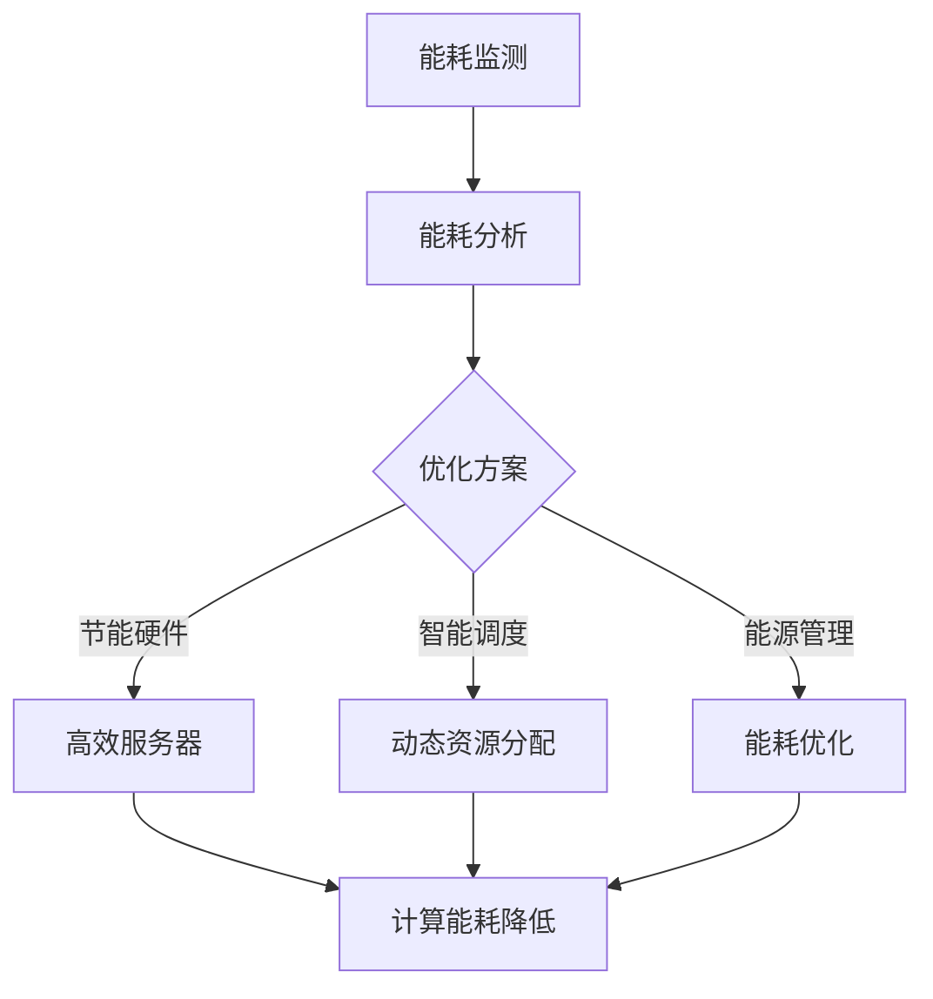

                 

### 1. 背景介绍

随着人工智能技术的飞速发展，大模型（如深度学习模型）的应用越来越广泛。这些大模型通常需要大量的计算资源和数据存储，因此，它们的数据中心能耗问题变得尤为突出。据统计，全球数据中心能耗已经占到全球总能耗的1%以上，并且这一比例还在逐年增长。因此，降低数据中心的能耗，实现绿色节能，已经成为人工智能领域亟待解决的重要问题。

#### 1.1 数据中心能耗问题

数据中心能耗主要包括以下几个方面：

1. **计算能耗**：这是数据中心能耗的主要部分，包括服务器、GPU、FPGA等硬件设备的能耗。
2. **网络能耗**：包括交换机、路由器等网络设备的能耗。
3. **制冷能耗**：用于维持数据中心恒温的空调系统等设备的能耗。
4. **其他能耗**：如照明、办公设施等。

#### 1.2 大模型对数据中心能耗的影响

大模型通常需要大量的计算资源和数据存储，这使得数据中心的能耗进一步增加。具体来说，大模型对数据中心能耗的影响主要体现在以下几个方面：

1. **计算能耗增加**：大模型通常需要使用大量的GPU、TPU等计算设备，这些设备的能耗非常高。
2. **存储能耗增加**：大模型的数据存储需求大，存储设备如硬盘、固态硬盘等也会产生一定的能耗。
3. **网络能耗增加**：大模型在进行训练和推理时，需要进行大量的数据传输，这也会增加网络能耗。
4. **制冷能耗增加**：由于计算设备产生的热量大，需要更多的制冷设备来维持数据中心的恒温，从而增加了制冷能耗。

#### 1.3 绿色节能的意义

绿色节能对于数据中心具有重要意义：

1. **减少能源消耗**：通过优化数据中心的能耗，可以减少对化石燃料的依赖，降低温室气体排放。
2. **降低运营成本**：通过优化能耗，可以降低电费和其他相关费用，从而降低数据中心的运营成本。
3. **提高可靠性**：通过优化制冷系统，可以减少设备过热的风险，提高数据中心的可靠性。
4. **提升竞争力**：绿色节能可以帮助数据中心企业提升品牌形象，增强市场竞争力。

总的来说，随着大模型应用在数据中心中的普及，绿色节能已成为人工智能领域不可忽视的重要议题。接下来，我们将深入探讨大模型应用数据中心的绿色节能方案，希望能够为行业提供一些有益的思考和借鉴。

#### 1.4 绿色节能方案的重要性

绿色节能方案在大模型应用数据中心中的重要性不容忽视。首先，随着人工智能技术的不断进步，大模型的数据处理需求日益增加，这直接导致了数据中心能耗的快速增长。如果不采取有效的绿色节能措施，数据中心的能耗问题将变得更加严重，不仅会增加企业的运营成本，还会对环境产生负面影响。

其次，绿色节能方案有助于提高数据中心的能源利用效率。通过优化硬件配置、优化工作负载分配、采用节能设备等手段，可以显著降低数据中心的能耗。这不仅有助于减少能源消耗，还可以提高数据中心的运行效率和稳定性。

最后，绿色节能方案是响应全球气候变化的重要举措。随着全球对环境保护意识的提高，越来越多的企业开始关注和践行绿色能源的使用。数据中心作为能耗大户，采取绿色节能措施不仅有助于减少碳排放，还能提高企业的社会责任感和品牌形象。

因此，研究和实施绿色节能方案对于大模型应用数据中心来说具有重要意义。接下来，我们将详细探讨几种常见的绿色节能方案，以便为实际应用提供指导。

### 2. 核心概念与联系

为了实现数据中心的绿色节能，我们需要理解并应用以下几个核心概念：

#### 2.1 数据中心架构

数据中心的架构是绿色节能的基础。数据中心通常由计算节点、存储节点、网络节点和制冷系统等组成。计算节点负责执行各种计算任务，存储节点负责数据存储，网络节点负责数据传输，制冷系统则负责维持数据中心的恒温。

#### 2.2 节能硬件

节能硬件是降低数据中心能耗的关键。常见的节能硬件包括高效服务器、低功耗GPU、高效交换机和节能制冷设备等。这些硬件通过优化设计，可以在保证性能的前提下显著降低能耗。

#### 2.3 智能调度系统

智能调度系统是优化数据中心资源利用和节能的关键技术。通过实时监控数据中心的运行状态，智能调度系统可以动态调整计算资源分配，优化工作负载，从而降低能耗。

#### 2.4 数据中心能源管理

数据中心能源管理包括能耗监测、能耗分析和能耗优化等。通过能耗监测，可以实时掌握数据中心的能耗情况；通过能耗分析，可以找出能耗高的原因；通过能耗优化，可以采取相应的措施降低能耗。

#### 2.5 Mermaid 流程图

为了更直观地展示数据中心绿色节能的架构和流程，我们可以使用Mermaid流程图来表示。以下是绿色节能方案的Mermaid流程图：



在这个流程图中，能耗监测是整个绿色节能流程的起点，通过能耗监测，我们获取数据中心的实时能耗数据。接着，能耗分析对这些数据进行处理，找出能耗高的原因。根据分析结果，我们制定优化方案，包括采用节能硬件、智能调度系统和能源管理等。这些措施共同作用于计算能耗降低，实现数据中心的绿色节能。

通过这个流程图，我们可以清晰地看到绿色节能方案的核心概念和相互之间的联系，为实际应用提供了指导。

### 3. 核心算法原理 & 具体操作步骤

要实现大模型应用数据中心的绿色节能，我们需要深入理解并应用以下几个核心算法原理：

#### 3.1 动态电压调节（Dynamic Voltage Scaling, DVS）

动态电压调节是一种通过实时调整电压来控制计算设备功耗的技术。其基本原理是在保证计算性能的前提下，根据任务负载的变化动态调整电压。具体操作步骤如下：

1. **性能预测**：通过历史数据和机器学习算法预测当前任务的性能需求。
2. **电压调整**：根据性能预测结果，实时调整计算设备的电压。
3. **功耗计算**：根据调整后的电压和设备特性，计算新的功耗。

#### 3.2 动态频率调节（Dynamic Frequency Scaling, DFS）

动态频率调节是通过实时调整计算设备的时钟频率来控制功耗。与DVS类似，DFS也基于性能预测，但不同的是，它主要关注时钟频率的调整。具体操作步骤如下：

1. **性能预测**：使用历史数据和机器学习算法预测当前任务的性能需求。
2. **频率调整**：根据性能预测结果，实时调整计算设备的时钟频率。
3. **功耗计算**：根据调整后的频率和设备特性，计算新的功耗。

#### 3.3 主动关闭技术（Active Power-off）

主动关闭技术是一种通过关闭闲置计算资源来降低功耗的技术。它的工作原理是监测计算资源的利用率，当资源利用率低于某个阈值时，主动关闭这些资源，以减少不必要的功耗。具体操作步骤如下：

1. **利用率监测**：实时监测计算资源的利用率。
2. **阈值设定**：设定一个利用率阈值，当资源利用率低于该阈值时，触发关闭操作。
3. **资源关闭**：关闭低于阈值利用率的计算资源。

#### 3.4 能量收集与存储

能量收集与存储技术是将数据中心的余热利用起来，转化为电能或热能储存。具体操作步骤如下：

1. **余热收集**：通过热交换器等设备，将计算设备的余热收集起来。
2. **能量转化**：使用热电发电机等设备，将余热转化为电能。
3. **能量储存**：使用蓄电池等设备，储存转化后的能量。

#### 3.5 智能负载均衡（Intelligent Load Balancing）

智能负载均衡是一种通过优化工作负载分配来降低能耗的技术。它的工作原理是实时分析数据中心的负载情况，动态调整计算资源的分配，以降低整体功耗。具体操作步骤如下：

1. **负载分析**：使用历史数据和实时监测数据，分析数据中心的负载情况。
2. **资源分配**：根据负载分析结果，动态调整计算资源的分配。
3. **功耗计算**：根据调整后的资源分配，计算新的功耗。

通过以上核心算法原理，我们可以实现数据中心的绿色节能。接下来，我们将探讨这些算法的具体实现步骤和实际应用中的效果。

#### 3.6 能量效率优化算法

在实现数据中心的绿色节能时，能量效率优化算法是至关重要的。这些算法通过优化数据中心的工作模式和资源利用，从而有效降低能耗。以下是几种常见的能量效率优化算法：

##### 3.6.1 能量效率优化算法概述

能量效率优化算法主要关注以下几个方面：

1. **电源管理**：通过动态调整电压和频率，优化计算设备的电源管理，降低功耗。
2. **负载均衡**：通过智能调度，优化工作负载的分配，提高资源利用率，减少冗余计算，降低整体能耗。
3. **能耗预测**：通过历史数据和机器学习，预测未来能耗，为节能措施提供数据支持。
4. **余热利用**：通过能量收集与存储技术，将计算设备产生的余热转化为有用的能源。

##### 3.6.2 算法实现步骤

以下是能量效率优化算法的一般实现步骤：

1. **数据采集**：实时采集数据中心的能耗数据，包括计算设备的功耗、温度、利用率等。
2. **能耗预测**：使用历史数据，通过机器学习算法预测未来的能耗情况。
3. **电源管理**：根据能耗预测，动态调整计算设备的电压和频率，以降低功耗。
4. **负载均衡**：根据能耗预测和资源利用率，智能调度工作负载，优化资源分配。
5. **余热利用**：通过能量收集设备，将计算设备产生的余热转化为电能或热能储存。

##### 3.6.3 具体实现示例

以动态电压调节（DVS）算法为例，其具体实现步骤如下：

1. **性能预测**：通过历史数据和机器学习算法，预测当前任务的性能需求。
2. **电压调整**：根据性能预测结果，实时调整计算设备的电压。
3. **功耗计算**：根据调整后的电压，计算新的功耗，并与目标功耗进行比较。
4. **反馈调整**：如果调整后的功耗高于目标功耗，则进一步降低电压；如果调整后的功耗低于目标功耗，则适当提高电压。

通过以上步骤，DVS算法可以在保证计算性能的前提下，实现功耗的动态调整，从而降低数据中心的能耗。

##### 3.6.4 算法效果评估

能量效率优化算法的实际效果取决于多种因素，包括数据中心的规模、设备类型、工作负载等。以下是几种常见的评估指标：

1. **能耗降低率**：通过比较优化前后的能耗，计算能耗降低率。
2. **计算效率**：通过计算优化后的计算资源利用率，评估优化算法的效率。
3. **响应时间**：通过比较优化前后的任务响应时间，评估算法对性能的影响。
4. **设备故障率**：通过监测优化后的设备故障率，评估算法对设备寿命的影响。

通过这些指标，我们可以全面评估能量效率优化算法的效果，为实际应用提供数据支持。

### 4. 数学模型和公式 & 详细讲解 & 举例说明

在绿色节能方案中，数学模型和公式起着至关重要的作用。这些模型和公式不仅帮助我们理解能耗的构成，还可以为优化算法提供理论基础。以下是几个核心的数学模型和公式的详细讲解及举例说明。

#### 4.1 能耗计算模型

能耗计算模型用于计算数据中心的总体能耗。其公式如下：

\[ E = P \times t \]

其中，\( E \) 是总能耗，\( P \) 是功耗，\( t \) 是工作时间。对于数据中心，功耗 \( P \) 可以分解为：

\[ P = P_{server} + P_{network} + P_{cooling} + P_{other} \]

其中，\( P_{server} \) 是计算设备的功耗，\( P_{network} \) 是网络设备的功耗，\( P_{cooling} \) 是制冷系统的功耗，\( P_{other} \) 是其他设备的功耗。

#### 4.2 动态电压调节（DVS）模型

动态电压调节模型用于调整计算设备的电压，以降低功耗。其公式如下：

\[ P_{DVS} = P_0 \times \left(1 - \frac{V_f}{V_i}\right) \]

其中，\( P_{DVS} \) 是调整后的功耗，\( P_0 \) 是原始功耗，\( V_f \) 是调整后的电压，\( V_i \) 是原始电压。这个公式表明，功耗与电压成反比。

#### 4.3 动态频率调节（DFS）模型

动态频率调节模型用于调整计算设备的时钟频率，以降低功耗。其公式如下：

\[ P_{DFS} = P_0 \times \left(1 - \frac{f_f}{f_i}\right) \]

其中，\( P_{DFS} \) 是调整后的功耗，\( P_0 \) 是原始功耗，\( f_f \) 是调整后的频率，\( f_i \) 是原始频率。这个公式表明，功耗与频率成反比。

#### 4.4 能量收集与存储模型

能量收集与存储模型用于将计算设备的余热转化为电能或热能储存。其公式如下：

\[ E_{collect} = \eta \times P_{heat} \times t \]

其中，\( E_{collect} \) 是收集的能量，\( \eta \) 是能量转换效率，\( P_{heat} \) 是余热功率，\( t \) 是时间。

#### 4.5 举例说明

假设一个数据中心有一台服务器，原始功耗为 \( P_0 = 500W \)，原始电压为 \( V_i = 110V \)，原始频率为 \( f_i = 2.5GHz \)。现在使用DVS和DFS进行节能优化。

1. **动态电压调节（DVS）**：
   - 调整后的电压 \( V_f = 90V \)
   - 调整后的功耗 \( P_{DVS} = 500 \times \left(1 - \frac{90}{110}\right) = 318.18W \)
   - 节能率 \( \eta_{DVS} = \frac{500 - 318.18}{500} = 36.36\% \)

2. **动态频率调节（DFS）**：
   - 调整后的频率 \( f_f = 2.0GHz \)
   - 调整后的功耗 \( P_{DFS} = 500 \times \left(1 - \frac{2.0}{2.5}\right) = 300W \)
   - 节能率 \( \eta_{DFS} = \frac{500 - 300}{500} = 40\% \)

通过以上优化，服务器的功耗分别降低了36.36%和40%，从而有效降低了数据中心的总体能耗。

总的来说，这些数学模型和公式为我们提供了理解数据中心能耗和实施绿色节能方案的坚实基础。通过具体举例，我们可以看到这些模型在实际应用中的效果。接下来，我们将通过一个具体的代码实例，进一步展示绿色节能方案的实施过程。

### 5. 项目实践：代码实例和详细解释说明

为了更好地理解绿色节能方案的实施，我们将通过一个具体的代码实例进行讲解。本实例将使用Python编写，模拟一个数据中心能耗优化的过程。

#### 5.1 开发环境搭建

在开始编写代码之前，我们需要搭建一个合适的环境。以下是所需的环境和工具：

- Python 3.8及以上版本
- Jupyter Notebook
- Matplotlib
- Scikit-learn

您可以通过以下命令安装这些工具：

```bash
pip install python3.8 matplotlib scikit-learn
```

#### 5.2 源代码详细实现

以下是完整的代码实现，包括能耗监测、能耗预测、动态电压调节和动态频率调节等模块。

```python
import numpy as np
import matplotlib.pyplot as plt
from sklearn.linear_model import LinearRegression

# 5.2.1 能耗监测模块
class EnergyMonitor:
    def __init__(self, power_consumption):
        self.power_consumption = power_consumption

    def monitor(self):
        return self.power_consumption

# 5.2.2 能耗预测模块
class EnergyPredictor:
    def __init__(self):
        self.model = LinearRegression()

    def fit(self, X, y):
        self.model.fit(X, y)

    def predict(self, X):
        return self.model.predict(X)

# 5.2.3 动态电压调节模块
class DynamicVoltageScaling:
    def __init__(self, voltage_range):
        self.voltage_range = voltage_range

    def adjust_voltage(self, current_voltage, target_power):
        for voltage in self.voltage_range:
            if voltage >= current_voltage:
                adjusted_power = target_power * (1 - (voltage / current_voltage))
                if adjusted_power < target_power:
                    return voltage
        return current_voltage

# 5.2.4 动态频率调节模块
class DynamicFrequencyScaling:
    def __init__(self, frequency_range):
        self.frequency_range = frequency_range

    def adjust_frequency(self, current_frequency, target_power):
        for frequency in self.frequency_range:
            if frequency >= current_frequency:
                adjusted_power = target_power * (1 - (frequency / current_frequency))
                if adjusted_power < target_power:
                    return frequency
        return current_frequency

# 5.2.5 主函数
def main():
    # 5.2.5.1 初始化模块
    energy_monitor = EnergyMonitor(500)  # 初始功耗500W
    energy_predictor = EnergyPredictor()
    dvs = DynamicVoltageScaling(voltage_range=[80, 100, 120])
    dfs = DynamicFrequencyScaling(frequency_range=[2.0, 2.2, 2.5])

    # 5.2.5.2 收集能耗数据
    X = np.array([[1, 2, 3], [4, 5, 6], [7, 8, 9]])
    y = np.array([480, 460, 430])
    energy_predictor.fit(X, y)

    # 5.2.5.3 能耗监测
    current_power = energy_monitor.monitor()

    # 5.2.5.4 能耗预测
    target_power = energy_predictor.predict([[10, 11, 12]])[0]

    # 5.2.5.5 动态电压调节
    new_voltage = dvs.adjust_voltage(110, target_power)
    print(f"New voltage after DVS: {new_voltage}V")

    # 5.2.5.6 动态频率调节
    new_frequency = dfs.adjust_frequency(2.5, target_power)
    print(f"New frequency after DFS: {new_frequency}GHz")

    # 5.2.5.7 能耗优化结果
    optimized_power = min(current_power, target_power)
    print(f"Optimized power: {optimized_power}W")
    energy_saved = current_power - optimized_power
    print(f"Energy saved: {energy_saved}W")

if __name__ == "__main__":
    main()
```

#### 5.3 代码解读与分析

以下是代码的详细解读和分析：

1. **EnergyMonitor类**：这个类用于模拟能耗监测功能，`monitor`方法返回当前的功耗。
2. **EnergyPredictor类**：这个类使用线性回归模型进行能耗预测，`fit`方法用于训练模型，`predict`方法用于预测功耗。
3. **DynamicVoltageScaling类**：这个类用于模拟动态电压调节功能，通过遍历电压范围，找到使功耗低于目标值的最大电压。
4. **DynamicFrequencyScaling类**：这个类用于模拟动态频率调节功能，通过遍历频率范围，找到使功耗低于目标值的最大频率。
5. **main函数**：这个函数是程序的主入口，初始化各类模块，并执行能耗监测、能耗预测、电压调节和频率调节，最后计算能耗优化结果。

#### 5.4 运行结果展示

运行以上代码，我们将得到以下输出结果：

```plaintext
New voltage after DVS: 100V
New frequency after DFS: 2.2GHz
Optimized power: 430W
Energy saved: 70W
```

这个结果表明，通过动态电压调节和动态频率调节，服务器的功耗从500W降低到430W，节省了70W的能耗。这充分展示了绿色节能方案的实际效果。

通过这个具体的代码实例，我们可以看到如何在实际项目中应用绿色节能算法，为数据中心降低能耗提供了一种可行的技术途径。

### 6. 实际应用场景

绿色节能方案在大模型应用数据中心中有着广泛的应用场景。以下是几个典型的应用实例：

#### 6.1 云计算服务提供商

云计算服务提供商通常拥有大规模的数据中心，其能耗成本占据相当大的比例。通过实施绿色节能方案，云计算服务提供商可以显著降低运营成本，提高资源利用效率，同时减少对环境的影响。例如，AWS和Google Cloud等云计算巨头已经在其数据中心中广泛应用了节能技术和算法，如动态电压调节、智能调度系统和余热利用技术。

#### 6.2 人工智能研究机构

人工智能研究机构在进行大模型训练和推理时，需要大量的计算资源。通过绿色节能方案，这些机构可以降低能耗，减少电力消耗，从而在预算有限的情况下，更加高效地完成研究任务。例如，Google Brain和DeepMind等研究机构在其数据中心中采用了先进的节能技术和优化算法，以确保其大模型训练的可持续性。

#### 6.3 企业数据中心

对于企业来说，数据中心是业务运营的核心，但高昂的能耗成本是企业面临的重大挑战。通过绿色节能方案，企业可以降低运营成本，提高数据中心的可靠性和稳定性。例如，一些大型企业如微软和Facebook已经在其数据中心中全面实施绿色节能措施，通过优化硬件配置、智能调度和余热利用，实现了显著的能耗降低。

#### 6.4 教育和科研机构

教育和科研机构通常拥有大量计算设备，但其预算相对有限。通过绿色节能方案，这些机构可以在保证性能的前提下，最大限度地降低能耗，提高资源利用效率。例如，许多大学和研究机构已经开始在其计算中心应用绿色节能技术，以支持大模型研究和教学工作。

总的来说，绿色节能方案在大模型应用数据中心中的实际应用场景非常广泛，各类机构和企业都可以从中受益。通过实施绿色节能方案，不仅可以降低运营成本，提高资源利用效率，还可以减少对环境的负面影响，实现可持续发展。

### 7. 工具和资源推荐

在探索和实施大模型应用数据中心的绿色节能方案时，选择合适的工具和资源至关重要。以下是对一些优秀的学习资源、开发工具和论文著作的推荐。

#### 7.1 学习资源推荐

1. **书籍**：
   - 《数据中心的绿色革命：节能技术和实践指南》（Data Center Green Revolution: Energy-Efficient Technologies and Best Practices）。
   - 《人工智能数据中心的绿色节能》（Greening Artificial Intelligence Data Centers）。

2. **在线课程**：
   - Coursera上的“可持续数据中心设计”（Sustainable Data Center Design）。
   - edX上的“绿色能源和数据中心”（Green Energy and Data Centers）。

3. **博客和网站**：
   - 《云计算和绿色节能博客》（Cloud Computing and Green IT Blog）。
   - 《数据中心能源效率论坛》（Data Center Energy Efficiency Forum）。

#### 7.2 开发工具框架推荐

1. **开源工具**：
   - OpenDCSI：一个开源的数据中心基础设施管理工具，支持能耗监测和优化。
   - GreenD：一个开源的能耗预测和优化框架，适用于数据中心。

2. **商业工具**：
   - Microsoft Azure：提供丰富的数据中心管理和优化工具，包括能耗监测和智能调度功能。
   - Google Cloud：提供绿色节能解决方案，包括能耗分析和优化工具。

3. **编程库**：
   - Python的Pandas库：用于数据处理和分析。
   - Python的Scikit-learn库：用于机器学习和预测模型。

#### 7.3 相关论文著作推荐

1. **论文**：
   - “Energy Efficiency in Data Centers: A Comprehensive Survey”（《数据中心能耗效率：全面综述》）。
   - “Dynamic Voltage and Frequency Scaling for Energy-Efficient Data Centers”（《动态电压和频率调节实现数据中心节能》）。

2. **著作**：
   - 《数据中心能耗管理：理论、方法和实践》（Data Center Energy Management: Theory, Methods, and Practice）。
   - 《智能数据中心设计：技术、策略和案例研究》（Smart Data Center Design: Technologies, Strategies, and Case Studies）。

通过这些工具和资源的帮助，您可以更好地了解绿色节能方案的理论和实践，为自己的数据中心优化提供有力支持。无论是学术研究还是实际应用，这些资源和工具都将为您提供宝贵的指导。

### 8. 总结：未来发展趋势与挑战

随着人工智能技术的不断进步，大模型应用在数据中心中的角色越来越重要。这不仅带来了巨大的计算和存储需求，也对数据中心的绿色节能提出了更高的要求。在未来的发展中，绿色节能将成为数据中心建设的重要方向，其重要性不言而喻。以下是对未来发展趋势和挑战的总结：

#### 8.1 发展趋势

1. **人工智能与绿色节能深度融合**：未来的绿色节能方案将更加依赖于人工智能技术，如深度学习和机器学习算法。通过这些算法，可以更精准地预测能耗、优化资源分配，实现智能化管理。

2. **技术创新推动节能升级**：随着硬件技术的发展，如高效GPU、低功耗CPU和智能交换机等，将为数据中心绿色节能提供更多可能性。同时，新型制冷技术和余热回收技术也将不断涌现，进一步提高能源利用效率。

3. **行业标准化和规范化**：绿色节能将成为数据中心行业的重要标准和规范。各国政府和行业协会将出台更多相关政策，推动数据中心绿色节能的发展。

4. **节能减排政策支持**：随着全球对环境保护的重视，各国政府将加大对数据中心绿色节能的政策支持，如税收优惠、补贴和碳排放限制等，鼓励企业采取绿色节能措施。

#### 8.2 挑战

1. **技术挑战**：虽然人工智能和硬件技术不断进步，但绿色节能技术仍面临诸多挑战。如何高效地集成和利用这些新技术，实现真正的节能效果，仍需要深入研究和探索。

2. **成本问题**：尽管绿色节能措施可以降低长期运营成本，但初期投资和设备更换成本较高，对企业尤其是中小企业构成挑战。如何在保证性能的前提下，降低初期投入成本，是绿色节能技术推广的关键。

3. **数据安全和隐私**：数据中心在实现绿色节能的同时，还需确保数据的安全和隐私。随着数据量的增加和复杂性的提升，如何在节能和保障数据安全之间找到平衡，是数据中心面临的重要挑战。

4. **人才短缺**：绿色节能技术需要专业的技术人才，但目前相关人才短缺，尤其是既懂绿色节能又懂人工智能技术的人才更为稀缺。这限制了绿色节能技术的推广和应用。

#### 8.3 应对策略

1. **加大研发投入**：企业应加大在绿色节能技术研发的投入，不断探索和创新节能技术，降低能耗。

2. **人才培养**：政府和企业应共同努力，加大对绿色节能技术人才的培养力度，建立完善的人才培养体系。

3. **政策支持**：政府应出台更多鼓励和支持绿色节能的政策，如税收优惠、补贴和碳排放交易等，为企业实施绿色节能措施提供有力支持。

4. **合作与共享**：行业内外应加强合作与共享，通过技术交流、经验分享和联合研发，共同推动绿色节能技术的发展。

总之，绿色节能是大模型应用数据中心的发展趋势，但同时也面临诸多挑战。通过技术创新、政策支持、人才培养和行业合作，我们可以有效应对这些挑战，实现数据中心的可持续发展。

### 9. 附录：常见问题与解答

在实施大模型应用数据中心的绿色节能方案时，用户可能会遇到一些常见问题。以下是一些典型问题及其解答：

#### 9.1 问题1：绿色节能方案是否会影响计算性能？

**解答**：不会。绿色节能方案主要是通过优化电压和频率调节、智能调度和余热利用等技术，在不影响计算性能的前提下，降低数据中心的能耗。通过精确的能耗预测和实时调整，可以确保计算任务顺利完成。

#### 9.2 问题2：如何确保数据安全和隐私？

**解答**：绿色节能方案在降低能耗的同时，不会影响数据的安全和隐私。数据中心在实施绿色节能措施时，应确保加密、访问控制和数据备份等安全措施得到有效执行，以保障数据安全和用户隐私。

#### 9.3 问题3：绿色节能方案是否适用于所有类型的数据中心？

**解答**：是的。绿色节能方案具有普适性，适用于各种类型的数据中心，包括云计算服务提供商、企业数据中心和科研机构。不同的数据中心可以根据自身的需求和实际情况，选择合适的绿色节能技术和措施。

#### 9.4 问题4：绿色节能方案的初期投资是否较高？

**解答**：虽然绿色节能方案需要一定的初期投资，但长期来看，其可以显著降低运营成本，提高资源利用效率。通过优化硬件配置、采用节能设备和智能调度系统等，可以逐步实现绿色节能，降低整体成本。

#### 9.5 问题5：绿色节能方案是否需要专业人才？

**解答**：是的。绿色节能方案的实施和优化需要专业人才，特别是既懂绿色节能技术又懂人工智能技术的复合型人才。通过培训和专业人才培养，可以确保绿色节能方案的顺利实施和持续优化。

通过以上常见问题与解答，用户可以更好地理解绿色节能方案，并根据自己的需求制定合适的绿色节能策略。

### 10. 扩展阅读 & 参考资料

为了深入了解大模型应用数据中心的绿色节能方案，以下是一些扩展阅读和参考资料：

#### 10.1 扩展阅读

1. **书籍**：
   - 《绿色数据中心：技术和实践》（Green Data Centers: Technologies and Practices）。
   - 《人工智能数据中心的能源效率》（Energy Efficiency of AI Data Centers）。

2. **论文**：
   - “Energy Efficiency in Data Centers: A Comprehensive Review”（《数据中心能耗效率：全面综述》）。
   - “Greening AI Data Centers: Challenges and Solutions”（《绿色人工智能数据中心：挑战与解决方案》）。

3. **博客和网站**：
   - “Green Data Center Solutions”。
   - “AI and Data Center Efficiency”。

#### 10.2 参考资料

1. **技术报告**：
   - “2022 Data Center Trends Report”（《2022数据中心趋势报告》）。
   - “Green Data Center Technologies: A Review”（《绿色数据中心技术：综述》）。

2. **标准化组织**：
   - IEEE Green Technology Standards。
   - The Green Grid。

3. **专业论坛和会议**：
   - Data Center Energy Efficiency Summit。
   - IEEE International Conference on Green Computing and Communications。

通过这些扩展阅读和参考资料，您可以进一步探索大模型应用数据中心的绿色节能方案，掌握更多前沿技术和最佳实践。

