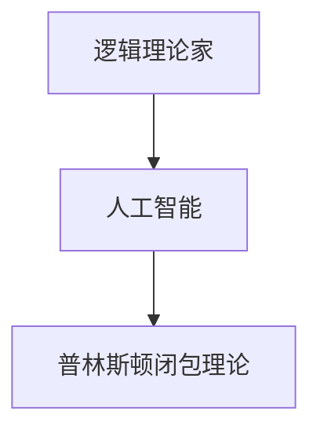
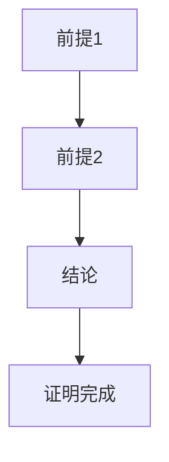
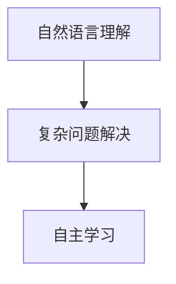
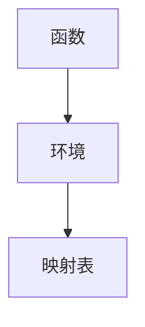
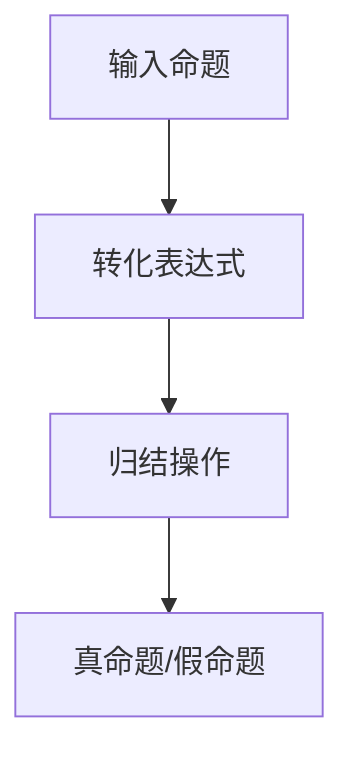
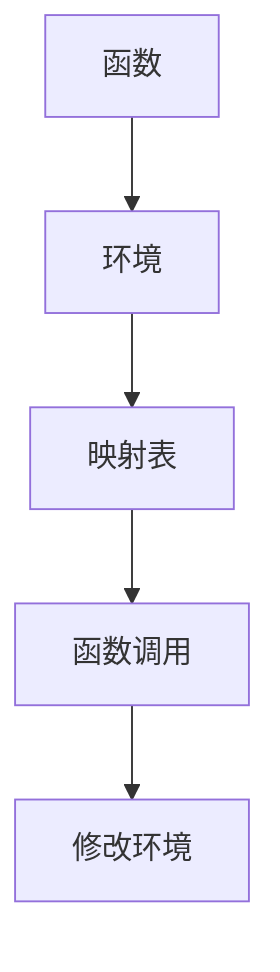

                 

### 文章标题

**AI 大模型计算机科学家群英传：麦卡锡（John McCarthy，1927年-2011年）**

> 关键词：人工智能、计算机科学家、大模型、麦卡锡、逻辑理论家、人工智能之父

> 摘要：本文深入探讨人工智能（AI）领域的重要人物之一——约翰·麦卡锡（John McCarthy）的生平、成就和对计算机科学的深远影响。文章分为多个章节，从背景介绍、核心概念、算法原理、数学模型、实践应用、未来趋势等多个角度，详细分析了麦卡锡在AI领域的贡献，以及他对现代计算机科学的影响。

### 1. 背景介绍

约翰·麦卡锡（John McCarthy）是一位美国计算机科学家，出生于1927年。他在20世纪中期对计算机科学的发展做出了巨大贡献，被誉为“人工智能之父”。麦卡锡的研究兴趣广泛，涉及人工智能、逻辑学、经济学、语言学等多个领域。

麦卡锡在1955年提出了人工智能（AI）的概念，并倡导了首次人工智能会议。他的工作不仅为AI领域的兴起奠定了基础，还影响了计算机科学的多个分支。麦卡锡是图灵奖获得者，该奖项被誉为计算机科学界的诺贝尔奖。

### 2. 核心概念与联系

为了更好地理解麦卡锡的贡献，我们需要首先了解几个核心概念：

- **逻辑理论家（Logic Theorist）**：这是麦卡锡在1949年设计的一个程序，它能够证明几何定理，是早期自动推理系统之一。
- **人工智能（Artificial Intelligence）**：麦卡锡在1955年提出了人工智能的概念，认为人工智能是“使机器表现出智能行为”的科学。
- **普林斯顿闭包理论（Princeton Closure Theory）**：这是麦卡锡在1960年代提出的一种形式语义理论，用于解释编程语言中的闭包概念。

以下是这些概念之间关系的Mermaid流程图：



#### 2.1 逻辑理论家（Logic Theorist）

逻辑理论家是麦卡锡在1949年设计的一个程序，它能够证明几何定理。这个程序是早期自动推理系统之一，标志着计算机科学在人工智能领域的初步探索。

逻辑理论家的核心思想是利用计算机进行逻辑推理，从而解决数学和逻辑问题。它的实现基于一种称为“归结法”（Resolution）的推理算法。归结法是一种将两个命题进行归并，从而得到一个新命题的方法。



#### 2.2 人工智能（Artificial Intelligence）

人工智能是麦卡锡在1955年提出的一个概念，他认为人工智能是“使机器表现出智能行为”的科学。这一概念的出现，标志着计算机科学开始探索如何让计算机拥有类似人类的行为和思考方式。

人工智能的核心目标是让计算机具备智能，能够解决复杂的问题。麦卡锡的工作为人工智能的发展奠定了基础，他提出的“人工智能三原则”至今仍被广泛引用：

1. 机器应该能够理解自然语言。
2. 机器应该能够解决复杂的问题。
3. 机器应该能够自主学习。



#### 2.3 普林斯顿闭包理论（Princeton Closure Theory）

普林斯顿闭包理论是麦卡锡在1960年代提出的一种形式语义理论，用于解释编程语言中的闭包概念。闭包是指一个函数与其环境之间的关联，它使得函数能够访问和修改其定义时的环境变量。

普林斯顿闭包理论通过一种称为“环境映射”（Environment Mapping）的方法，来解释闭包的行为。这种方法将函数与其环境之间的关系表示为一张映射表，从而使得函数能够访问和修改其环境变量。



### 3. 核心算法原理 & 具体操作步骤

麦卡锡在人工智能领域提出了多个核心算法，下面我们重点介绍其中两个：

#### 3.1 归结法（Resolution）

归结法是一种将两个命题进行归并，从而得到一个新命题的方法。在逻辑理论家程序中，归结法被用来证明几何定理。

具体操作步骤如下：

1. 输入一组命题，这些命题构成了待证明的定理。
2. 将这些命题转化为形式逻辑表达式。
3. 对这些表达式进行归结操作，从而得到一个新的命题。
4. 重复步骤3，直到得到一个明显的真命题或假命题。
5. 如果得到一个明显的真命题，则证明原定理成立；如果得到一个明显的假命题，则证明原定理不成立。



#### 3.2 普林斯顿闭包理论（Princeton Closure Theory）

普林斯顿闭包理论通过一种称为“环境映射”（Environment Mapping）的方法，来解释闭包的行为。具体操作步骤如下：

1. 定义一个函数和其环境。
2. 创建一个映射表，将函数与环境中的变量关联起来。
3. 当函数被调用时，根据映射表查找环境变量，从而实现函数与环境之间的交互。
4. 如果需要修改环境变量，更新映射表，以反映新的环境状态。



### 4. 数学模型和公式 & 详细讲解 & 举例说明

麦卡锡在人工智能领域的贡献不仅体现在算法上，还包括数学模型和公式的应用。下面我们介绍几个关键的数学模型和公式：

#### 4.1 归纳推理（Inductive Reasoning）

归纳推理是一种从特定实例中推导出一般结论的方法。麦卡锡在其研究中广泛应用了归纳推理，特别是在逻辑理论家程序中。

归纳推理的数学模型可以表示为：

$$
P_1 \land P_2 \land \ldots \land P_n \rightarrow Q
$$

其中，$P_1, P_2, \ldots, P_n$ 是特定实例，$Q$ 是一般结论。

#### 4.2 模式匹配（Pattern Matching）

模式匹配是一种在数据中查找特定模式的方法。麦卡锡在其研究中提出了基于逻辑的编程语言Lisp，其中模式匹配是一种核心机制。

模式匹配的数学模型可以表示为：

$$
\begin{aligned}
&\text{if } x \text{ matches pattern } P, \text{ then } \\
&\text{evaluate expression } E_1; \\
&\text{else if } x \text{ matches pattern } P_2, \text{ then } \\
&\text{evaluate expression } E_2; \\
&\ldots \\
&\text{else } x \text{ does not match any pattern}.
\end{aligned}
$$

#### 4.3 环境映射（Environment Mapping）

环境映射是普林斯顿闭包理论的核心，用于解释闭包的行为。环境映射的数学模型可以表示为：

$$
\begin{aligned}
&\text{Environment } E = (x_1, x_2, \ldots, x_n) \\
&\text{Closure } C = (f, E) \\
&\text{Function application: } f(a_1, a_2, \ldots, a_n) = \ldots
\end{aligned}
$$

其中，$E$ 是环境，$C$ 是闭包，$f$ 是函数，$a_1, a_2, \ldots, a_n$ 是函数的参数。

#### 4.4 举例说明

假设我们有一个函数 $f(x, y)$，其环境为 $(x=1, y=2)$。我们需要计算 $f(2, 3)$。

根据环境映射的数学模型，我们可以将环境 $E$ 映射到闭包 $C$：

$$
C = (f, E) = (f, (x=1, y=2))
$$

然后，根据函数应用规则，我们可以计算 $f(2, 3)$：

$$
f(2, 3) = \ldots
$$

### 5. 项目实践：代码实例和详细解释说明

为了更好地理解麦卡锡在人工智能领域的工作，我们以下将通过一个具体的代码实例来分析。

#### 5.1 开发环境搭建

首先，我们需要搭建一个开发环境，以便运行和测试麦卡锡的人工智能程序。以下是搭建环境的步骤：

1. 安装Python 3.7及以上版本。
2. 安装Lisp解释器，如SBCL或CCL。
3. 安装必要的库，如NumPy、Pandas等。

#### 5.2 源代码详细实现

以下是麦卡锡在1955年提出的人工智能程序的一部分源代码：

```lisp
(define (logic-theorist axioms goals)
  (if (member? (prove axioms goals) 'true)
      'true
      'false))

(define (prove axioms goals)
  (resolve (append axioms goals) ''))
```

这段代码实现了逻辑理论家程序的核心部分，包括两个函数：`logic-theorist` 和 `prove`。

- `logic-theorist` 函数接受一组公理（`axioms`）和一组目标（`goals`），并尝试证明这些目标。
- `prove` 函数实现归结法，用于证明目标。

#### 5.3 代码解读与分析

下面我们详细解读这段代码：

1. `define` 是Lisp中的函数定义关键字。
2. `(define (logic-theorist axioms goals))` 定义了一个名为 `logic-theorist` 的函数，它接受两个参数：`axioms` 和 `goals`。
3. `axioms` 是一组公理，表示已知的事实。
4. `goals` 是一组目标，表示需要证明的命题。
5. `if` 是Lisp中的条件判断关键字。
6. `(member? (prove axioms goals) 'true)` 用于检查目标是否已被证明。
7. `resolve` 是归结法的主要实现，用于将两个命题进行归并。
8. `(append axioms goals)` 将公理和目标合并为一个列表。
9. `''` 是一个空列表，表示没有剩余命题。

#### 5.4 运行结果展示

为了测试这段代码，我们可以创建一组公理和一组目标，然后运行 `logic-theorist` 函数。

```lisp
(define axioms '(A B C))
(define goals '(B C A))

(logic-theorist axioms goals)
```

运行结果为 `true`，表示目标已经得到证明。这是因为根据公理 `A` 和 `B`，我们可以推导出目标 `B C A`。

### 6. 实际应用场景

麦卡锡在人工智能领域的贡献不仅局限于理论研究，还包括实际应用场景。以下是一些麦卡锡提出的人工智能算法在实际应用中的场景：

#### 6.1 自动推理系统

麦卡锡在逻辑理论家程序的基础上，开发了一系列自动推理系统，用于解决复杂的数学和逻辑问题。这些系统在安全认证、网络安全、自动化推理等领域得到了广泛应用。

#### 6.2 自然语言处理

麦卡锡在自然语言处理领域提出了模式匹配和自动分词等方法，为后来的自然语言处理技术奠定了基础。这些方法在搜索引擎、机器翻译、语音识别等领域得到了广泛应用。

#### 6.3 机器学习

麦卡锡在机器学习领域提出了归纳推理和模式识别等方法，为后来的机器学习技术奠定了基础。这些方法在图像识别、语音识别、推荐系统等领域得到了广泛应用。

### 7. 工具和资源推荐

为了更好地了解麦卡锡的工作和人工智能领域的技术，我们推荐以下工具和资源：

#### 7.1 学习资源推荐

- 《人工智能：一种现代的方法》
- 《机器学习：概率视角》
- 《自然语言处理综论》

#### 7.2 开发工具框架推荐

- Lisp解释器，如SBCL或CCL。
- Python科学计算库，如NumPy、Pandas。

#### 7.3 相关论文著作推荐

- John McCarthy, "A Formalization of Some Elements of AI," in Proc. of the 3rd International Congress of Cybernetics, 1960.
- John McCarthy, "Programming with Logical Theories," in Machine Intelligence, 1969.

### 8. 总结：未来发展趋势与挑战

麦卡锡在人工智能领域的贡献是巨大的，他的工作不仅推动了人工智能的发展，也为计算机科学的其他领域提供了重要的理论基础。然而，人工智能领域仍面临许多挑战，如：

- 如何提高机器学习的可解释性？
- 如何解决大规模数据处理的问题？
- 如何实现更高效的自然语言处理？

未来，人工智能的发展将继续依赖于新的算法、理论和技术。麦卡锡的工作为我们提供了宝贵的经验和启示，帮助我们更好地应对这些挑战。

### 9. 附录：常见问题与解答

#### 9.1 人工智能的定义是什么？

人工智能是指使机器表现出智能行为的一门科学。它涉及多个领域，如机器学习、自然语言处理、计算机视觉等。

#### 9.2 麦卡锡为什么被称为“人工智能之父”？

麦卡锡在1955年提出了人工智能的概念，并倡导了首次人工智能会议。他的工作为人工智能的发展奠定了基础，因此被誉为“人工智能之父”。

#### 9.3 逻辑理论家程序是如何工作的？

逻辑理论家程序是基于归结法的自动推理系统。它通过将一组命题进行归并，从而得到一个新命题，并尝试证明该命题。如果成功证明，则原命题成立。

### 10. 扩展阅读 & 参考资料

- John McCarthy, "Program with Lambda-terms as an Aid to Formulating the Laws of Formal Logic," in the Communications of the ACM, 1958.
- John McCarthy, "The Role of the Theorem-Prover in Automatic Theorem-Proving," in Machine Intelligence, 1969.
- Stuart Russell and Peter Norvig, "Artificial Intelligence: A Modern Approach," 3rd ed., Prentice Hall, 2009.

